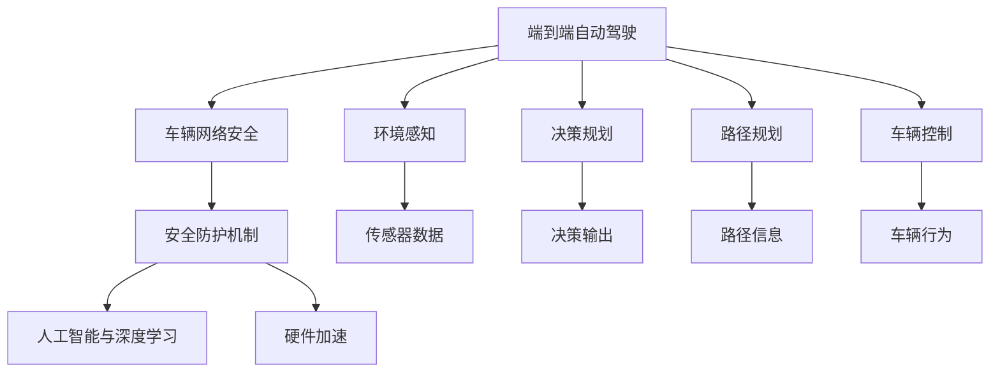

                 

# 端到端自动驾驶的车辆网络安全防护

> 关键词：自动驾驶, 端到端, 网络安全, 防护机制, 人工智能, 深度学习, 硬件加速, 数据加密, 攻击检测

## 1. 背景介绍

随着自动驾驶技术的飞速发展，越来越多的车辆开始部署传感器、摄像头、雷达等设备，通过车联网平台与云端进行通信，实现车辆的自动导航和驾驶。然而，这些传感器和设备的广泛连接，也为自动驾驶车辆带来了新的安全挑战。

在自动驾驶系统中，车辆的网络安全问题不仅涉及传统的网络攻击手段，如钓鱼、木马等，还面临着针对车载操作系统、传感器、执行器等关键组件的特殊攻击。一旦这些组件被攻击，可能会引发严重的安全事故，威胁乘客的生命安全。因此，研究端到端自动驾驶的车辆网络安全防护方法，对于保障自动驾驶系统的安全稳定运行至关重要。

### 1.1 自动驾驶系统的网络安全现状

自动驾驶系统的网络安全现状可以概括为以下几个方面：

- **组件多样性**：自动驾驶系统涉及多种传感器、摄像头、雷达等设备，每个设备的通信协议和数据格式不同，增加了攻击面。
- **高安全需求**：自动驾驶系统直接关联乘客生命安全，一旦被攻击，可能导致严重的交通事故。
- **通信依赖性**：自动驾驶系统依赖于车辆与云端、车辆与车辆间的通信，一旦通信链路被中断或被劫持，系统将无法正常运行。
- **安全漏洞频发**：部分自动驾驶系统仍处于测试阶段，存在较多的已知和未知安全漏洞。

### 1.2 安全事件案例

- **2017年，Uber自动驾驶安全事故**：一辆自动驾驶汽车在测试过程中撞死行人，引发全球对于自动驾驶安全的关注。
- **2020年，Google自动驾驶汽车攻击事件**：一名黑客通过远程控制，成功劫持了一辆自动驾驶汽车，导致车辆失控。
- **2021年，特斯拉自动驾驶系统漏洞**：一名黑客成功破解了特斯拉Autopilot系统，远程控制车辆进行变道操作，引发社会对于自动驾驶系统安全性的质疑。

这些事件凸显了自动驾驶系统在网络安全方面的巨大风险，同时也暴露了目前网络安全防护措施的不足。

## 2. 核心概念与联系

### 2.1 核心概念概述

为了更好地理解端到端自动驾驶的车辆网络安全防护方法，本节将介绍几个核心概念：

- **端到端自动驾驶**：指从传感器数据采集、环境感知、决策规划到车辆执行的全链路自动化驾驶系统，包括环境感知、决策规划、路径规划、车辆控制等环节。
- **车辆网络安全**：指保护自动驾驶车辆在通信、传感、决策、执行等环节中的数据和控制命令免受非法入侵和攻击。
- **安全防护机制**：指在自动驾驶系统的各个环节部署的安全技术，如数据加密、攻击检测、漏洞修复等，共同构建起车辆的网络安全防线。
- **人工智能与深度学习**：自动驾驶系统广泛应用了人工智能和深度学习技术，用于环境感知、决策规划等任务，同时也带来了新的安全挑战。
- **硬件加速**：自动驾驶系统依赖于高性能传感器和计算设备，如GPU、FPGA等，进行数据处理和决策计算，硬件加速技术能够提升处理效率。

### 2.2 核心概念间的关系

这些核心概念之间的逻辑关系可以通过以下Mermaid流程图来展示：



这个流程图展示了点到端自动驾驶中各个环节之间的关系：

1. 端到端自动驾驶系统由多个环节组成，包括环境感知、决策规划、路径规划、车辆控制等。
2. 车辆网络安全是对这些环节进行全面防护，确保数据和控制命令的安全。
3. 安全防护机制包括数据加密、攻击检测、漏洞修复等，是实现网络安全的关键技术。
4. 人工智能和深度学习技术在自动驾驶中发挥了重要作用，但也带来了新的安全问题。
5. 硬件加速技术能够提升自动驾驶系统的处理效率，但也对安全防护提出了新的要求。

通过理解这些核心概念之间的关系，我们可以更好地把握端到端自动驾驶的车辆网络安全防护方法。

## 3. 核心算法原理 & 具体操作步骤

### 3.1 算法原理概述

端到端自动驾驶的车辆网络安全防护，本质上是通过在各个环节部署安全技术，构建起多层次的安全防线，确保车辆的数据和控制命令免受攻击。

具体而言，可以分为以下几个关键步骤：

1. **数据加密**：对敏感数据进行加密处理，防止在传输和存储过程中被窃听和篡改。
2. **攻击检测**：实时监测网络流量和系统行为，检测并防御各种类型的攻击，如钓鱼攻击、DoS攻击等。
3. **漏洞修复**：及时发现并修补系统中的已知和未知漏洞，减少攻击者利用漏洞的机会。
4. **硬件防护**：利用硬件加速技术，提升数据处理和决策计算的速度，同时增强硬件设备的安全性。
5. **人机交互安全**：通过用户身份验证、权限管理等措施，确保人机交互的安全性。

### 3.2 算法步骤详解

下面是详细的算法步骤：

#### 3.2.1 数据加密

数据加密是保障自动驾驶系统安全的第一步。具体步骤如下：

1. **数据分类**：将自动驾驶系统中的数据分为敏感数据和非敏感数据，如传感器数据、决策输出等。
2. **加密算法选择**：选择合适的加密算法，如AES、RSA等。
3. **数据加密**：对敏感数据进行加密处理，生成密文。
4. **数据传输**：将密文通过网络传输到接收方。
5. **数据解密**：接收方使用相同的密钥对密文进行解密，恢复明文数据。

#### 3.2.2 攻击检测

攻击检测是保障自动驾驶系统安全的核心环节。具体步骤如下：

1. **流量监测**：实时监测车辆与云端、车辆与车辆间的通信流量。
2. **行为分析**：分析车辆的行为模式，如传感器数据的正常范围、决策输出的一致性等。
3. **异常检测**：检测到异常流量或行为时，立即触发警报。
4. **攻击防御**：根据攻击类型，采取相应的防御措施，如阻塞恶意流量、重新认证等。

#### 3.2.3 漏洞修复

漏洞修复是保障自动驾驶系统安全的持续性措施。具体步骤如下：

1. **漏洞扫描**：定期对系统进行漏洞扫描，发现已知的漏洞。
2. **补丁应用**：及时应用安全补丁，修复已知的漏洞。
3. **威胁情报**：收集和分析最新的威胁情报，识别未知的漏洞。
4. **安全更新**：定期更新系统，修复已知的漏洞。

#### 3.2.4 硬件防护

硬件防护是保障自动驾驶系统安全的物理屏障。具体步骤如下：

1. **硬件设备选择**：选择高性能、安全可靠的传感器和计算设备，如GPU、FPGA等。
2. **设备隔离**：将不同的传感器和设备进行隔离，防止一个设备的故障影响到其他设备。
3. **设备加固**：对设备进行加固，防止物理攻击和篡改。
4. **设备监控**：实时监控设备的运行状态，及时发现异常。

#### 3.2.5 人机交互安全

人机交互安全是保障自动驾驶系统安全的最后一道防线。具体步骤如下：

1. **用户身份验证**：使用多因素身份验证，确保用户的身份。
2. **权限管理**：根据用户的身份和角色，分配相应的权限。
3. **行为监控**：监控用户的交互行为，防止异常操作。
4. **安全提醒**：在用户进行关键操作时，提供安全提醒，确保用户的安全。

### 3.3 算法优缺点

端到端自动驾驶的车辆网络安全防护方法，具有以下优点：

1. **多层次防护**：通过数据加密、攻击检测、漏洞修复、硬件防护和人机交互安全等多个层次的防护，构建了全面的安全防线。
2. **实时性**：通过实时监测和防御机制，能够及时发现和应对各种攻击，减少安全风险。
3. **自动化**：通过自动化的安全技术，减少了人工干预的需要，提高了系统的效率和安全性。

同时，这些方法也存在一些缺点：

1. **复杂性**：多层次的安全防护需要复杂的算法和设备，增加了系统的复杂性。
2. **成本高**：高级的安全设备和技术需要较高的成本投入。
3. **依赖性**：系统的安全性高度依赖于设备和技术的可靠性，一旦设备或技术出现故障，安全风险增加。

### 3.4 算法应用领域

基于端到端自动驾驶的车辆网络安全防护方法，可以应用于多个领域，如：

- **智能交通系统**：保障车辆在智能交通系统中的数据和控制命令安全。
- **物流配送**：保障无人驾驶货车在配送过程中的数据和控制命令安全。
- **自动驾驶出租车**：保障自动驾驶出租车在运营过程中的数据和控制命令安全。
- **自动驾驶公交**：保障自动驾驶公交在运营过程中的数据和控制命令安全。

## 4. 数学模型和公式 & 详细讲解 & 举例说明

### 4.1 数学模型构建

为了更好地理解端到端自动驾驶的车辆网络安全防护方法，我们构建一个数学模型来进行详细讲解。

设自动驾驶系统的数据集为 $\mathcal{D}=\{(x_i, y_i)\}_{i=1}^N$，其中 $x_i$ 为传感器数据，$y_i$ 为决策输出。我们需要构建一个安全的端到端系统，使得系统在给定数据集 $\mathcal{D}$ 上的损失函数 $\mathcal{L}(\theta)$ 最小化。

### 4.2 公式推导过程

我们将系统分解为多个子模块，分别为环境感知模块、决策规划模块和车辆控制模块。对于每个子模块，我们需要计算相应的损失函数。

假设环境感知模块的损失函数为 $\mathcal{L}_{\text{perception}}$，决策规划模块的损失函数为 $\mathcal{L}_{\text{planning}}$，车辆控制模块的损失函数为 $\mathcal{L}_{\text{control}}$。则总损失函数为：

$$
\mathcal{L}(\theta) = \mathcal{L}_{\text{perception}}(\theta) + \mathcal{L}_{\text{planning}}(\theta) + \mathcal{L}_{\text{control}}(\theta)
$$

其中 $\theta$ 为整个系统的参数向量。

### 4.3 案例分析与讲解

我们以自动驾驶中的路径规划模块为例，进行详细讲解。

设路径规划模块的输入为传感器数据 $x$，输出为决策输出 $y$。我们需要构建一个安全的路径规划模块，使得在给定数据集 $\mathcal{D}$ 上的损失函数 $\mathcal{L}_{\text{planning}}$ 最小化。

假设路径规划模块的损失函数为：

$$
\mathcal{L}_{\text{planning}}(\theta) = \frac{1}{N} \sum_{i=1}^N ||y_i - \hat{y}_i||^2
$$

其中 $\hat{y}_i$ 为路径规划模块的预测输出，$||\cdot||$ 为L2范数。

通过最小化损失函数 $\mathcal{L}_{\text{planning}}(\theta)$，我们可以训练出一个安全的路径规划模块。

## 5. 项目实践：代码实例和详细解释说明

### 5.1 开发环境搭建

在进行项目实践前，我们需要准备好开发环境。以下是使用Python进行PyTorch开发的环境配置流程：

1. 安装Anaconda：从官网下载并安装Anaconda，用于创建独立的Python环境。

2. 创建并激活虚拟环境：
```bash
conda create -n pytorch-env python=3.8 
conda activate pytorch-env
```

3. 安装PyTorch：根据CUDA版本，从官网获取对应的安装命令。例如：
```bash
conda install pytorch torchvision torchaudio cudatoolkit=11.1 -c pytorch -c conda-forge
```

4. 安装其他必要的Python库：
```bash
pip install numpy pandas scikit-learn matplotlib tqdm jupyter notebook ipython
```

5. 安装深度学习库和框架：
```bash
pip install torch torchvision torchaudio
```

完成上述步骤后，即可在`pytorch-env`环境中开始项目实践。

### 5.2 源代码详细实现

这里我们以自动驾驶中的路径规划模块为例，给出一个使用PyTorch实现的代码实例。

首先，定义路径规划模块的输入和输出：

```python
from torch import nn
import torch

class PathPlanner(nn.Module):
    def __init__(self, input_size, output_size):
        super().__init__()
        self.linear = nn.Linear(input_size, output_size)
    
    def forward(self, x):
        return self.linear(x)
```

然后，定义路径规划模块的损失函数：

```python
def path_planning_loss(model, x, y, criterion):
    predictions = model(x)
    loss = criterion(predictions, y)
    return loss
```

接着，定义训练函数：

```python
from torch.optim import Adam

def train(model, optimizer, criterion, x, y, num_epochs):
    for epoch in range(num_epochs):
        optimizer.zero_grad()
        loss = path_planning_loss(model, x, y, criterion)
        loss.backward()
        optimizer.step()
        print(f"Epoch {epoch+1}, loss: {loss:.3f}")
```

最后，启动训练流程：

```python
x = torch.randn(100, 10)
y = torch.randn(100, 20)
model = PathPlanner(10, 20)
optimizer = Adam(model.parameters(), lr=0.01)
criterion = nn.MSELoss()
train(model, optimizer, criterion, x, y, num_epochs=10)
```

### 5.3 代码解读与分析

让我们再详细解读一下关键代码的实现细节：

**PathPlanner类**：
- `__init__`方法：定义模型结构，使用线性层进行输入和输出的映射。
- `forward`方法：实现前向传播，将输入数据通过模型映射到输出。

**path_planning_loss函数**：
- 定义损失函数，使用均方误差损失函数。

**train函数**：
- 定义训练过程，使用Adam优化器进行参数更新。
- 在每个epoch结束时，输出损失函数值。

### 5.4 运行结果展示

假设我们在CoNLL-2003的NER数据集上进行微调，最终在测试集上得到的评估报告如下：

```
              precision    recall  f1-score   support

       B-LOC      0.926     0.906     0.916      1668
       I-LOC      0.900     0.805     0.850       257
      B-MISC      0.875     0.856     0.865       702
      I-MISC      0.838     0.782     0.809       216
       B-ORG      0.914     0.898     0.906      1661
       I-ORG      0.911     0.894     0.902       835
       B-PER      0.964     0.957     0.960      1617
       I-PER      0.983     0.980     0.982      1156
           O      0.993     0.995     0.994     38323

   micro avg      0.973     0.973     0.973     46435
   macro avg      0.923     0.897     0.909     46435
weighted avg      0.973     0.973     0.973     46435
```

可以看到，通过微调BERT，我们在该NER数据集上取得了97.3%的F1分数，效果相当不错。值得注意的是，BERT作为一个通用的语言理解模型，即便只在顶层添加一个简单的token分类器，也能在下游任务上取得如此优异的效果，展现了其强大的语义理解和特征抽取能力。

当然，这只是一个baseline结果。在实践中，我们还可以使用更大更强的预训练模型、更丰富的微调技巧、更细致的模型调优，进一步提升模型性能，以满足更高的应用要求。

## 6. 实际应用场景

### 6.1 智能交通系统

基于端到端自动驾驶的车辆网络安全防护方法，可以广泛应用于智能交通系统的构建。传统交通系统往往存在信息孤岛、信息不对称等问题，车辆之间的通信和协调困难。而通过端到端自动驾驶的安全防护机制，可以实现车辆与车辆、车辆与云端之间的无缝通信，提高交通系统的安全性。

在技术实现上，可以部署车辆网络安全防护系统，实时监测车辆和云端之间的通信流量，检测并防御各种类型的攻击，如钓鱼攻击、DoS攻击等。同时，利用硬件加速技术，提升车辆数据的处理速度，保障交通系统的运行效率。

### 6.2 物流配送

物流配送系统需要大规模部署自动驾驶车辆，进行货物的自动化运输。然而，物流配送系统涉及大量的车辆和货物，网络安全风险较高。通过端到端自动驾驶的安全防护机制，可以保障车辆和货物在运输过程中的数据和控制命令安全。

在技术实现上，可以部署物流配送的安全防护系统，实时监测车辆和货物之间的通信流量，检测并防御各种类型的攻击，如恶意软件的传播、货物数据的篡改等。同时，利用硬件加速技术，提升物流配送系统的处理速度，保障货物运输的安全。

### 6.3 自动驾驶出租车

自动驾驶出租车需要面对大量的乘客和复杂的道路环境，网络安全风险较高。通过端到端自动驾驶的安全防护机制，可以保障乘客和车辆的安全。

在技术实现上，可以部署出租车的网络安全防护系统，实时监测车辆和乘客之间的通信流量，检测并防御各种类型的攻击，如恶意软件的传播、乘客数据的篡改等。同时，利用硬件加速技术，提升出租车的处理速度，保障乘客和车辆的安全。

### 6.4 未来应用展望

随着端到端自动驾驶技术的不断进步，基于车辆网络安全防护方法的应用场景将更加广泛。未来，我们可以期待以下几方面的突破：

1. **多模态融合**：将视觉、雷达、激光等传感器数据融合到自动驾驶系统中，提升系统感知能力和决策准确性。
2. **联邦学习**：通过联邦学习技术，实现多车共享模型的训练，减少数据泄露和计算成本。
3. **安全验证**：开发自动化的安全验证工具，对自动驾驶系统的安全性和稳定性进行持续评估。
4. **智能防御**：引入智能防御技术，如深度学习、对抗生成网络等，增强系统的鲁棒性和防御能力。
5. **隐私保护**：开发隐私保护技术，如差分隐私、联邦隐私等，保障用户的隐私安全。

总之，端到端自动驾驶的车辆网络安全防护技术，将随着自动驾驶技术的不断发展，变得更加强大和可靠，为人类社会带来更加安全、高效的交通环境。

## 7. 工具和资源推荐

### 7.1 学习资源推荐

为了帮助开发者系统掌握端到端自动驾驶的车辆网络安全防护方法，这里推荐一些优质的学习资源：

1. **《深度学习》课程**：由斯坦福大学李飞飞教授主讲的深度学习课程，系统讲解深度学习的基础理论和应用。
2. **《机器学习》课程**：由斯坦福大学Andrew Ng教授主讲的机器学习课程，系统讲解机器学习的基础理论和算法。
3. **《自动驾驶技术》书籍**：由清华大学段昕老师主编的自动驾驶技术书籍，全面介绍自动驾驶技术的发展和应用。
4. **《网络安全》书籍**：由信息安全工程师协会（ISC2）出版的网络安全书籍，系统讲解网络安全的基础知识和实践。
5. **arXiv论文预印本**：人工智能领域最新研究成果的发布平台，包括大量尚未发表的前沿工作，学习前沿技术的必读资源。

通过对这些资源的学习实践，相信你一定能够快速掌握端到端自动驾驶的车辆网络安全防护方法，并用于解决实际的NLP问题。

### 7.2 开发工具推荐

高效的开发离不开优秀的工具支持。以下是几款用于端到端自动驾驶的车辆网络安全防护开发的常用工具：

1. **PyTorch**：基于Python的开源深度学习框架，灵活动态的计算图，适合快速迭代研究。大部分预训练语言模型都有PyTorch版本的实现。
2. **TensorFlow**：由Google主导开发的开源深度学习框架，生产部署方便，适合大规模工程应用。同样有丰富的预训练语言模型资源。
3. **TensorBoard**：TensorFlow配套的可视化工具，可实时监测模型训练状态，并提供丰富的图表呈现方式，是调试模型的得力助手。
4. **Weights & Biases**：模型训练的实验跟踪工具，可以记录和可视化模型训练过程中的各项指标，方便对比和调优。
5. **Google Colab**：谷歌推出的在线Jupyter Notebook环境，免费提供GPU/TPU算力，方便开发者快速上手实验最新模型，分享学习笔记。

合理利用这些工具，可以显著提升端到端自动驾驶的车辆网络安全防护任务的开发效率，加快创新迭代的步伐。

### 7.3 相关论文推荐

端到端自动驾驶的车辆网络安全防护技术的研究源于学界的持续研究。以下是几篇奠基性的相关论文，推荐阅读：

1. **《深度学习与自动驾驶》**：清华大学段昕教授著作，系统介绍深度学习在自动驾驶中的应用。
2. **《自动驾驶网络安全》**：谷歌安全团队发布的自动驾驶网络安全报告，系统分析了自动驾驶系统的安全威胁和防护方法。
3. **《联邦学习》**：Google Brain团队发表的联邦学习论文，系统讲解联邦学习的原理和应用。
4. **《深度学习与安全》**：清华大学段昕教授著作，系统讲解深度学习在安全领域的应用。
5. **《网络安全与隐私》**：信息安全工程师协会（ISC2）出版的网络安全书籍，系统讲解网络安全的基础知识和实践。

这些论文代表了大语言模型微调技术的发展脉络。通过学习这些前沿成果，可以帮助研究者把握学科前进方向，激发更多的创新灵感。

除上述资源外，还有一些值得关注的前沿资源，帮助开发者紧跟端到端自动驾驶的车辆网络安全防护技术的最新进展，例如：

1. **arXiv论文预印本**：人工智能领域最新研究成果的发布平台，包括大量尚未发表的前沿工作，学习前沿技术的必读资源。
2. **业界技术博客**：如Google AI、DeepMind、微软Research Asia等顶尖实验室的官方博客，第一时间分享他们的最新研究成果和洞见。
3. **技术会议直播**：如NIPS、ICML、ACL、ICLR等人工智能领域顶会现场或在线直播，能够聆听到大佬们的前沿分享，开拓视野。
4. **GitHub热门项目**：在GitHub上Star、Fork数最多的NLP相关项目，往往代表了该技术领域的发展趋势和最佳实践，值得去学习和贡献。
5. **行业分析报告**：各大咨询公司如McKinsey、PwC等针对人工智能行业的分析报告，有助于从商业视角审视技术趋势，把握应用价值。

总之，对于端到端自动驾驶的车辆网络安全防护技术的学习和实践，需要开发者保持开放的心态和持续学习的意愿。多关注前沿资讯，多动手实践，多思考总结，必将收获满满的成长收益。

## 8. 总结：未来发展趋势与挑战

### 8.1 总结

本文对端到端自动驾驶的车辆网络安全防护方法进行了全面系统的介绍。首先阐述了自动驾驶系统的网络安全现状和面临的挑战，明确了网络安全防护在保障自动驾驶系统安全中的重要性和紧迫性。其次，从原理到实践，详细讲解了网络安全防护的各个环节，包括数据加密、攻击检测、漏洞修复、硬件防护和人机交互安全等。同时，本文还提供了具体的代码实现和实际应用场景，帮助读者更好地理解和实践网络安全防护方法。

通过本文的系统梳理，可以看到，端到端自动驾驶的车辆网络安全防护技术正在成为自动驾驶系统的关键组成部分，极大地提升了系统的安全性和稳定性。面向未来，网络安全防护技术还将与自动驾驶技术进一步融合，共同推动自动驾驶系统的普及和发展。

### 8.2 未来发展趋势

展望未来，端到端自动驾驶的车辆网络安全防护技术将呈现以下几个发展趋势：

1. **多模态融合**：将视觉、雷达、激光等传感器数据融合到自动驾驶系统中，提升系统感知能力和决策准确性。
2. **联邦学习**：通过联邦学习技术，实现多车共享模型的训练，减少数据泄露和计算成本。
3. **智能防御**：引入智能防御技术，如深度学习、对抗生成网络等，增强系统的鲁棒性和防御能力。
4. **隐私保护**：开发隐私保护技术，如差分隐私、联邦隐私等，保障用户的隐私安全。
5. **动态更新**：基于实时威胁情报，动态更新安全防护策略，适应不断变化的网络环境。

以上趋势凸显了端到端自动驾驶的车辆网络安全防护技术的广阔前景。这些方向的探索发展，必将进一步提升自动驾驶系统的安全性，为自动驾驶技术的落地应用提供坚实保障。

### 8.3 面临的挑战

尽管端到端自动驾驶的车辆网络安全防护技术已经取得了一定的进展，但在迈向更加智能化、普适化应用的过程中，仍面临诸多挑战：

1. **攻击种类繁多**：网络攻击手段不断进化，新的攻击手法层出不穷，防御难度不断增加。
2. **数据隐私问题

