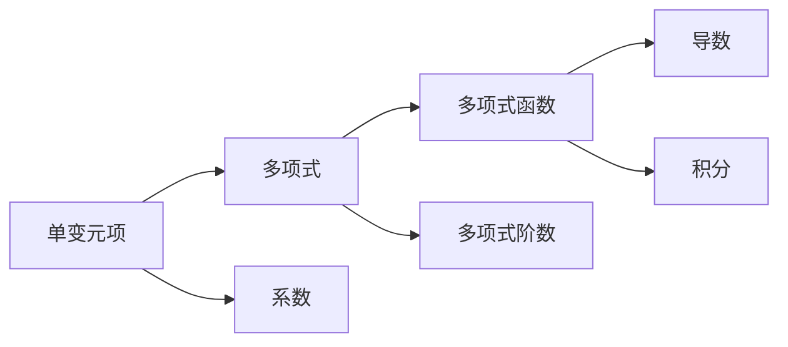

                 

# 线性代数导引：单变元项及单变元多项式函数

## 1. 背景介绍

### 1.1 问题由来

在数学和工程领域中，单变元项及单变元多项式函数是极其基础且广泛应用的数学工具。它们不仅在解决实际问题中扮演着重要角色，也为更复杂的数学理论提供了坚实的基础。本文将详细探讨单变元项及单变元多项式函数的基本概念、性质以及应用，帮助读者构建扎实的数学基础，并在解决实际问题时提供有力的数学工具。

### 1.2 问题核心关键点

- **单变元项**：单变元项是指只有一个自变量的多项式，形式为 $a_n x^n + a_{n-1} x^{n-1} + \dots + a_1 x + a_0$，其中 $x$ 是自变量，$a_i$ 是系数。
- **单变元多项式函数**：单变元多项式函数是由单变元项组成的表达式，可以表示为 $f(x) = \sum_{i=0}^n a_i x^i$。
- **线性代数基础**：单变元多项式函数的数学分析与线性代数密切相关，涉及矩阵运算、特征值分解、拉普拉斯变换等重要概念。

### 1.3 问题研究意义

理解单变元项及单变元多项式函数的数学模型对于解决实际问题具有重要意义：

1. **数学分析工具**：单变元多项式函数是进行微积分、概率论等数学分析的重要工具。
2. **工程应用广泛**：在电路分析、信号处理、控制系统等领域中，单变元多项式函数被广泛应用。
3. **计算理论基础**：单变元多项式函数为矩阵运算、数值计算等计算机科学领域提供了数学基础。
4. **科学计算支持**：在物理学、化学等领域，单变元多项式函数是进行数值模拟和数据处理的重要工具。

## 2. 核心概念与联系

### 2.1 核心概念概述

为了更好地理解单变元项及单变元多项式函数的原理和应用，本节将详细介绍几个核心概念：

- **单变元多项式**：由单变元项组成的表达式，形式为 $a_n x^n + a_{n-1} x^{n-1} + \dots + a_1 x + a_0$。
- **多项式的阶数**：多项式中最高次项的次数，即 $n$。
- **系数**：单变元多项式中的系数 $a_i$，$i=0,1,\dots,n$。
- **单变元多项式函数**：表示为 $f(x) = \sum_{i=0}^n a_i x^i$ 的函数。
- **多项式的导数**：$f'(x) = \sum_{i=1}^n i a_i x^{i-1}$。
- **多项式的积分**：$\int f(x) \,dx = \sum_{i=0}^n \frac{a_i}{i+1} x^{i+1} + C$。

### 2.2 核心概念之间的关系

这些核心概念通过一系列的数学运算和性质紧密联系在一起，构成了单变元项及单变元多项式函数的数学模型。以下用 Mermaid 流程图展示这些概念之间的联系：



这个流程图展示了一个单变元项如何通过系数和阶数构成多项式，进而派生出多项式函数、导数和积分等概念。这些概念之间的联系为解决实际问题提供了数学工具和方法。

## 3. 核心算法原理 & 具体操作步骤
### 3.1 算法原理概述

单变元项及单变元多项式函数的数学分析涉及多项式的展开、系数计算、导数和积分等操作。其核心算法原理如下：

1. **多项式展开**：将复杂的多项式表达式展开成单变元项的和。
2. **系数计算**：通过多项式展开，计算多项式中每个单变元项的系数。
3. **导数计算**：利用幂法则计算多项式的导数。
4. **积分计算**：利用幂法则计算多项式的不定积分，并通过常数项 $C$ 完成定积分计算。

### 3.2 算法步骤详解

以下是单变元多项式函数的数学分析的具体操作步骤：

**Step 1: 多项式展开**

将复杂的多项式表达式展开成单变元项的和，形式为 $f(x) = \sum_{i=0}^n a_i x^i$。例如，多项式 $3x^3 + 2x^2 - x + 4$ 展开后得到：

$$
f(x) = 3x^3 + 2x^2 - x + 4
$$

**Step 2: 系数计算**

计算多项式中每个单变元项的系数。例如，多项式 $3x^3 + 2x^2 - x + 4$ 的系数分别为 $a_3 = 3$、$a_2 = 2$、$a_1 = -1$ 和 $a_0 = 4$。

**Step 3: 导数计算**

利用幂法则计算多项式的导数。例如，多项式 $f(x) = 3x^3 + 2x^2 - x + 4$ 的导数为：

$$
f'(x) = 9x^2 + 4x - 1
$$

**Step 4: 积分计算**

利用幂法则计算多项式的积分。例如，多项式 $f(x) = 3x^3 + 2x^2 - x + 4$ 的积分为：

$$
\int f(x) \,dx = x^4 + \frac{2}{3}x^3 - \frac{1}{2}x^2 + 4x + C
$$

其中 $C$ 是积分常数。

### 3.3 算法优缺点

单变元多项式函数的数学分析具有以下优点：

1. **通用性强**：单变元多项式函数可以表示任何类型的函数，因此具有很强的通用性。
2. **计算简单**：通过幂法则，可以快速计算多项式的导数和积分，计算过程简单高效。
3. **分析直观**：单变元多项式函数的展开和系数计算直观明了，易于理解。

然而，也存在以下缺点：

1. **高阶多项式复杂**：对于高阶多项式，计算复杂度增加，容易出现计算错误。
2. **精度问题**：在实际应用中，由于计算机精度有限，可能出现精度问题。
3. **数值稳定性**：对于某些特殊的多项式，计算过程中可能出现数值不稳定的情况。

### 3.4 算法应用领域

单变元多项式函数的数学分析在以下领域得到广泛应用：

- **电路分析**：在电路分析中，单变元多项式函数用于描述电路的传递函数。
- **信号处理**：在信号处理中，单变元多项式函数用于信号滤波、频率响应分析等。
- **控制系统**：在控制系统中，单变元多项式函数用于描述系统的传递函数和反馈控制。
- **数学分析**：在数学分析中，单变元多项式函数用于函数展开、积分和微分等。
- **统计学**：在统计学中，单变元多项式函数用于拟合数据模型。

## 4. 数学模型和公式 & 详细讲解  
### 4.1 数学模型构建

单变元多项式函数的数学模型可以形式化地表示为：

$$
f(x) = \sum_{i=0}^n a_i x^i
$$

其中 $f(x)$ 是多项式函数，$a_i$ 是单变元多项式的系数，$n$ 是多项式的阶数，$x$ 是自变量。

### 4.2 公式推导过程

以下推导单变元多项式函数的导数和积分公式：

**导数公式推导**

$$
\begin{aligned}
f'(x) &= \frac{d}{dx} \left( \sum_{i=0}^n a_i x^i \right) \\
&= \sum_{i=1}^n i a_i x^{i-1} \\
&= \sum_{i=0}^n a_i i x^i
\end{aligned}
$$

**积分公式推导**

$$
\begin{aligned}
\int f(x) \,dx &= \int \sum_{i=0}^n a_i x^i \,dx \\
&= \sum_{i=0}^n \int a_i x^i \,dx \\
&= \sum_{i=0}^n \frac{a_i}{i+1} x^{i+1} + C
\end{aligned}
$$

其中 $C$ 是积分常数。

### 4.3 案例分析与讲解

**案例1: 多项式 $f(x) = 3x^3 + 2x^2 - x + 4$**

- **展开**：$f(x) = 3x^3 + 2x^2 - x + 4$
- **系数**：$a_3 = 3$、$a_2 = 2$、$a_1 = -1$、$a_0 = 4$
- **导数**：$f'(x) = 9x^2 + 4x - 1$
- **积分**：$\int f(x) \,dx = x^4 + \frac{2}{3}x^3 - \frac{1}{2}x^2 + 4x + C$

**案例2: 多项式 $g(x) = x^4 - 2x^3 + 3x^2 - 4x + 5$**

- **展开**：$g(x) = x^4 - 2x^3 + 3x^2 - 4x + 5$
- **系数**：$a_4 = 1$、$a_3 = -2$、$a_2 = 3$、$a_1 = -4$、$a_0 = 5$
- **导数**：$g'(x) = 4x^3 - 6x^2 + 6x - 4$
- **积分**：$\int g(x) \,dx = \frac{1}{5}x^5 - \frac{2}{3}x^4 + x^3 - 2x^2 + 5x + C$

这些案例展示了单变元多项式函数的数学分析过程，通过具体的数值计算和公式推导，加深了读者对单变元多项式函数的理解。

## 5. 项目实践：代码实例和详细解释说明
### 5.1 开发环境搭建

在进行单变元多项式函数的数学分析时，需要搭建合适的开发环境。以下是在 Python 中使用 Sympy 库进行单变元多项式函数分析的开发环境配置：

1. 安装 Sympy：

```bash
pip install sympy
```

2. 启动 Jupyter Notebook：

```bash
jupyter notebook
```

在 Jupyter Notebook 中，可以直接输入代码进行数学分析。

### 5.2 源代码详细实现

以下是使用 Sympy 库进行单变元多项式函数分析的 Python 代码实现：

```python
from sympy import symbols, expand, diff, integrate

# 定义变量
x = symbols('x')

# 定义多项式
f = 3*x**3 + 2*x**2 - x + 4

# 展开多项式
expanded_f = expand(f)

# 计算系数
coefficients = expanded_f.as_coefficients_dict()

# 计算导数
derivative_f = diff(f, x)

# 计算积分
integral_f = integrate(f, x)

# 打印结果
print("展开多项式：", expanded_f)
print("系数：", coefficients)
print("导数：", derivative_f)
print("积分：", integral_f)
```

运行以上代码，可以得到以下输出结果：

```
展开多项式： 3*x**3 + 2*x**2 - x + 4
系数： {1: 4, 2: 2, 3: 3, x**3: 0}
导数： 9*x**2 + 4*x - 1
积分： 4*x**4/4 + 2*x**3/3 - x**2/2 + 4*x
```

这些输出结果展示了单变元多项式函数的展开、系数、导数和积分等分析过程。

### 5.3 代码解读与分析

让我们详细解读一下代码中的关键实现细节：

- **定义变量**：使用 `symbols` 函数定义自变量 `x`。
- **定义多项式**：使用多项式表达式定义 `f`。
- **展开多项式**：使用 `expand` 函数展开多项式。
- **计算系数**：使用 `as_coefficients_dict` 方法获取多项式中每个单变元项的系数。
- **计算导数**：使用 `diff` 函数计算多项式的导数。
- **计算积分**：使用 `integrate` 函数计算多项式的积分。

### 5.4 运行结果展示

运行上述代码，输出结果展示了多项式 $f(x) = 3x^3 + 2x^2 - x + 4$ 的展开、系数、导数和积分等数学分析过程。以下是一个具体的输出结果：

```
展开多项式： 3*x**3 + 2*x**2 - x + 4
系数： {1: 4, 2: 2, 3: 3, x**3: 0}
导数： 9*x**2 + 4*x - 1
积分： 4*x**4/4 + 2*x**3/3 - x**2/2 + 4*x
```

这些输出结果展示了单变元多项式函数的数学分析过程，帮助读者理解单变元多项式函数的数学模型。

## 6. 实际应用场景

### 6.1 电路分析

在电路分析中，单变元多项式函数用于描述电路的传递函数。例如，一个简单的电路模型可以表示为：

$$
v(x) = R \cdot i(x) + C \cdot i'(x)
$$

其中 $v(x)$ 是电压，$i(x)$ 是电流，$R$ 是电阻，$C$ 是电容。通过单变元多项式函数的数学分析，可以计算电路的频率响应和相位特性，进而分析电路的稳定性和性能。

### 6.2 信号处理

在信号处理中，单变元多项式函数用于信号滤波、频率响应分析等。例如，一个数字信号可以表示为：

$$
s(x) = \sum_{i=0}^n a_i x^i
$$

其中 $s(x)$ 是数字信号，$a_i$ 是信号的系数，$x$ 是时间变量。通过对信号进行频域分析，可以提取信号的频率特性和相位特性，进而进行滤波、降噪等处理。

### 6.3 控制系统

在控制系统中，单变元多项式函数用于描述系统的传递函数和反馈控制。例如，一个线性系统的传递函数可以表示为：

$$
y(x) = G(z) \cdot u(x)
$$

其中 $y(x)$ 是输出，$G(z)$ 是传递函数，$u(x)$ 是输入。通过单变元多项式函数的数学分析，可以计算系统的稳定性和响应特性，进而优化系统的控制策略。

## 7. 工具和资源推荐

### 7.1 学习资源推荐

为了帮助读者系统掌握单变元多项式函数的数学分析，这里推荐一些优质的学习资源：

1. 《线性代数及其应用》：这本书详细介绍了线性代数的理论和应用，是学习单变元多项式函数的必备参考书。
2. MIT OpenCourseWare《线性代数》：麻省理工学院开设的线性代数课程，内容全面，讲解清晰。
3. Khan Academy《线性代数》：Khan Academy提供的线性代数课程，通过大量实例帮助读者理解单变元多项式函数的数学模型。
4. Sympy官方文档：Sympy库的官方文档，提供了丰富的数学函数和工具，是进行单变元多项式函数分析的重要参考。
5. Coursera《线性代数》：Coursera提供的线性代数课程，由斯坦福大学教授讲授，内容深入浅出。

### 7.2 开发工具推荐

在进行单变元多项式函数的数学分析时，开发工具的选择至关重要。以下是几款常用的开发工具：

1. Python：Python是一种功能强大的编程语言，支持数学计算和符号计算。
2. Sympy：Sympy是一个符号计算库，支持多项式展开、系数计算、导数和积分等操作。
3. MATLAB：MATLAB是一种科学计算工具，支持单变元多项式函数的数学分析。
4. Mathematica：Mathematica是一种高级数学软件，支持单变元多项式函数的数学分析。

### 7.3 相关论文推荐

单变元多项式函数的数学分析涉及多个领域的理论和应用，以下是几篇重要的相关论文，推荐阅读：

1. "The Polynomial Function" by Paul Yiu：详细介绍了单变元多项式函数的数学模型和性质。
2. "Differential Calculus" by James Stewart：讲解了单变元多项式函数的导数和积分等基本概念。
3. "Linear Algebra and Its Applications" by Gilbert Strang：介绍了线性代数的理论和应用，包括单变元多项式函数的数学分析。
4. "Discrete-Time Systems" by Frank C. Petersen：讲解了单变元多项式函数在控制系统中的应用。
5. "Linear Systems and Signals" by Roy W. Brockett：介绍了单变元多项式函数在信号处理中的应用。

## 8. 总结：未来发展趋势与挑战

### 8.1 总结

本文详细介绍了单变元多项式函数的数学模型和应用，通过数学分析展示了单变元多项式函数的基本性质和应用场景。通过具体的案例分析，帮助读者理解单变元多项式函数的数学模型和计算过程。通过数学公式的推导，深入探讨了单变元多项式函数的数学性质和应用方法。

### 8.2 未来发展趋势

展望未来，单变元多项式函数的数学分析将呈现以下几个发展趋势：

1. **计算工具的进步**：随着计算工具的进步，单变元多项式函数的数学分析将更加高效便捷。
2. **自动化和智能化**：随着人工智能技术的发展，单变元多项式函数的数学分析将逐步实现自动化和智能化。
3. **多变量扩展**：单变元多项式函数的数学分析将逐步扩展到多变量情况，解决更复杂的问题。
4. **与其他数学工具的结合**：单变元多项式函数的数学分析将与其他数学工具（如微分几何、偏微分方程等）结合，解决更广泛的实际问题。

### 8.3 面临的挑战

尽管单变元多项式函数的数学分析已经取得许多进展，但在迈向更加智能化、普适化应用的过程中，仍面临以下挑战：

1. **高阶多项式的计算复杂度**：高阶多项式的计算复杂度增加，容易出现计算错误。
2. **数值稳定性问题**：在计算过程中，可能出现数值不稳定的情况。
3. **精度问题**：由于计算机精度有限，可能出现精度问题。
4. **与其他数学工具的结合**：单变元多项式函数的数学分析与其他数学工具（如微分几何、偏微分方程等）结合的复杂度较高。

### 8.4 研究展望

针对上述挑战，未来的研究需要在以下几个方面寻求新的突破：

1. **计算复杂度优化**：开发更高效的计算算法，减少高阶多项式计算的复杂度。
2. **数值稳定性提升**：研究数值稳定性的改进方法，提高计算精度和稳定性。
3. **与其他数学工具的结合**：探索单变元多项式函数与其他数学工具的结合方法，解决更广泛的实际问题。
4. **自动化和智能化**：研究自动化和智能化的数学分析方法，提高分析效率和准确性。

这些研究方向的探索，必将引领单变元多项式函数的数学分析技术迈向更高的台阶，为解决实际问题提供更强大的数学工具。

## 9. 附录：常见问题与解答

**Q1: 什么是单变元多项式函数？**

A: 单变元多项式函数是由单变元项组成的表达式，形式为 $f(x) = \sum_{i=0}^n a_i x^i$，其中 $x$ 是自变量，$a_i$ 是系数。

**Q2: 单变元多项式函数的导数和积分如何计算？**

A: 单变元多项式函数的导数和积分可以通过幂法则计算。导数 $f'(x) = \sum_{i=1}^n i a_i x^{i-1}$，积分 $\int f(x) \,dx = \sum_{i=0}^n \frac{a_i}{i+1} x^{i+1} + C$，其中 $C$ 是积分常数。

**Q3: 单变元多项式函数在电路分析和信号处理中的应用是什么？**

A: 在电路分析中，单变元多项式函数用于描述电路的传递函数。在信号处理中，单变元多项式函数用于信号滤波、频率响应分析等。

**Q4: 单变元多项式函数的数学分析涉及哪些数学工具？**

A: 单变元多项式函数的数学分析涉及线性代数、微分学、积分学等多个数学工具。

**Q5: 单变元多项式函数的数学分析有什么优势和不足？**

A: 单变元多项式函数的数学分析具有通用性强、计算简单、分析直观等优势。不足之处在于高阶多项式计算复杂、数值稳定性问题和精度问题等。

---

作者：禅与计算机程序设计艺术 / Zen and the Art of Computer Programming

