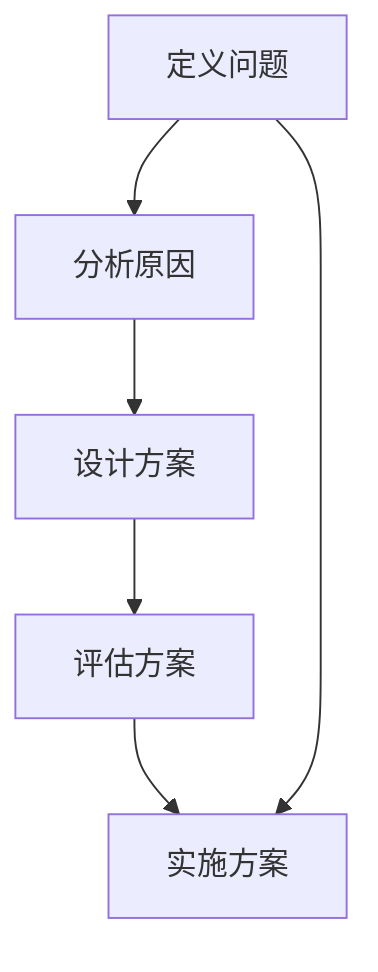

                 

# 结构化思维原理与应用：掌握结构化思维的内核

## 1. 背景介绍

### 1.1 问题由来

在信息爆炸的数字化时代，面对复杂多变的商业环境和需求，如何保持清晰的头脑，做出合理有效的决策？答案在于结构化思维（Structured Thinking）——一种系统化、条理化的思考方式。结构化思维不仅是解决问题的工具，也是提升创新和执行能力的利器。

### 1.2 问题核心关键点

结构化思维强调通过逻辑框架和系统化分析，从无序的数据中提炼出有价值的信息，从而做出科学决策。它包括四个核心要素：定义问题、分析原因、设计方案、执行实施。通过这一系列步骤，可以最大化利用有限资源，避免无效努力，提升解决问题的效率和效果。

### 1.3 问题研究意义

掌握结构化思维，对于提升个人和组织的决策能力、创新能力和执行力，具有重要意义。在商业决策、项目管理、产品设计、团队协作等领域，结构化思维都能发挥重要作用，帮助决策者跳出信息噪音，抓住核心问题，制定有效策略。

## 2. 核心概念与联系

### 2.1 核心概念概述

结构化思维涉及多个核心概念，理解这些概念及其联系是掌握结构化思维的基础：

- **定义问题**：明确问题边界，找出问题的核心。
- **分析原因**：通过五何法（5W1H）等方法，深入挖掘问题原因。
- **设计方案**：基于问题分析，设计多个备选方案。
- **评估方案**：运用多维度评估标准，选择最优方案。
- **实施方案**：制定详细的执行计划，并监控实施效果。

这些概念之间通过逻辑框架和系统化分析连接起来，形成结构化思维的完整闭环。

### 2.2 概念间的关系

这些核心概念之间的关系通过以下Mermaid流程图展示：



这一流程图表明，结构化思维的每个环节都是环环相扣的。只有明确问题，深入分析，设计科学方案，全面评估，并严格实施，才能确保决策的有效性。

## 3. 核心算法原理 & 具体操作步骤

### 3.1 算法原理概述

结构化思维的算法原理，核心在于系统化地分解问题，通过结构化的方式逼近最优解。具体步骤如下：

1. **定义问题**：明确问题的边界、目的和影响。
2. **分析原因**：使用结构化工具（如鱼骨图、5W1H）深入挖掘问题根源。
3. **设计方案**：基于问题分析，设计多个备选方案。
4. **评估方案**：采用成本-效益分析、SWOT分析等方法，全面评估方案的优劣。
5. **实施方案**：制定详细的执行计划，并监控实施效果。

### 3.2 算法步骤详解

#### 3.2.1 定义问题

- **目的**：明确问题的核心，避免偏离目标。
- **方法**：使用“5W1H”法（Who, What, When, Where, Why, How）。

#### 3.2.2 分析原因

- **目的**：找出问题的根本原因，为后续方案设计奠定基础。
- **方法**：鱼骨图（Ishikawa Diagram）、5W1H法、因果图等。

#### 3.2.3 设计方案

- **目的**：提出多个可行方案，进行对比分析。
- **方法**：头脑风暴法、鱼骨图、MECE法则等。

#### 3.2.4 评估方案

- **目的**：从多个维度评估方案的优劣，选择最佳方案。
- **方法**：成本-效益分析、SWOT分析、评分法等。

#### 3.2.5 实施方案

- **目的**：将最佳方案转化为具体的行动计划，并监控实施效果。
- **方法**：甘特图、任务分配表、KPI指标等。

### 3.3 算法优缺点

#### 3.3.1 优点

- **系统性**：结构化思维提供了逻辑框架，帮助全面分析问题，避免遗漏关键信息。
- **可操作性**：通过系统化方法设计、评估和实施方案，提高了决策的科学性和有效性。
- **可重复性**：结构化思维方法具有通用性，适用于各种复杂问题，可以反复应用。

#### 3.3.2 缺点

- **复杂性**：对于结构化思维流程的熟练掌握需要一定时间和训练。
- **灵活性不足**：过分依赖结构化方法可能抑制创造性思维。
- **数据依赖**：决策质量高度依赖于数据的准确性和全面性。

### 3.4 算法应用领域

结构化思维方法在商业决策、项目管理、产品设计、团队协作等多个领域均有广泛应用：

- **商业决策**：通过结构化分析，帮助企业制定战略规划，规避风险。
- **项目管理**：运用结构化方法设计项目方案，监控实施效果，提高项目成功率。
- **产品设计**：通过用户研究、市场分析，设计出满足用户需求的产品。
- **团队协作**：通过结构化流程和角色分配，提升团队协作效率和效果。

## 4. 数学模型和公式 & 详细讲解 & 举例说明

### 4.1 数学模型构建

结构化思维的数学模型，主要围绕着问题的定义、原因分析、方案设计、方案评估和实施监控展开。

- **问题定义**：$P = (X, Y, Z)$，其中 $X$ 表示问题的描述，$Y$ 表示问题的目标，$Z$ 表示问题的约束条件。
- **原因分析**：使用因果图等模型，表示问题与原因的关系。
- **方案设计**：通过多方案评估模型，设计多个备选方案 $A_1, A_2, ..., A_n$。
- **方案评估**：通过成本-效益分析模型，计算每个方案的评分 $S_i = C_i / B_i$，其中 $C_i$ 表示方案 $A_i$ 的成本，$B_i$ 表示方案 $A_i$ 的效益。
- **实施监控**：使用甘特图等模型，监控实施进度和效果。

### 4.2 公式推导过程

以成本-效益分析为例，推导方案评估的公式。

假设有两个备选方案 $A$ 和 $B$，其成本和效益如表所示：

| 方案 | 成本 $C$ | 效益 $B$ |
| --- | --- | --- |
| $A$ | $100$ | $200$ |
| $B$ | $150$ | $300$ |

计算两个方案的评分 $S_A$ 和 $S_B$：

$$
S_A = \frac{C_A}{B_A} = \frac{100}{200} = 0.5
$$

$$
S_B = \frac{C_B}{B_B} = \frac{150}{300} = 0.5
$$

比较 $S_A$ 和 $S_B$，选择评分更高的方案。

### 4.3 案例分析与讲解

假设某企业面临产品质量不稳定的问题，使用结构化思维进行原因分析和方案设计：

- **定义问题**：产品质量不稳定，如何提升产品质量？
- **分析原因**：通过鱼骨图分析，发现问题原因包括原材料、设备、人员、工艺、检测等多个方面。
- **设计方案**：设计多个备选方案，如改进原材料供应商、更新设备、培训员工、优化工艺流程、加强检测等。
- **评估方案**：运用成本-效益分析，计算每个方案的评分，选择评分最高的方案。
- **实施方案**：制定详细的实施计划，并监控实施效果。

## 5. 项目实践：代码实例和详细解释说明

### 5.1 开发环境搭建

结构化思维的代码实现，通常依赖于数据处理和决策工具。以下是在Python环境下搭建开发环境的步骤：

1. **安装Python**：从官网下载安装Python，并设置环境变量。
2. **安装必要的库**：安装Pandas、NumPy、Matplotlib、Scikit-learn等数据处理和可视化库。
3. **配置开发工具**：使用Jupyter Notebook进行代码编写和实验。

### 5.2 源代码详细实现

以下是一个简单的Python代码示例，用于模拟结构化思维中的方案评估过程：

```python
import pandas as pd
from sklearn.metrics import f1_score

# 假设我们有多个方案和对应的成本效益数据
cost_benefit_matrix = pd.DataFrame({
    '方案': ['A', 'B', 'C', 'D'],
    '成本': [100, 150, 200, 250],
    '效益': [200, 300, 400, 500]
})

# 计算每个方案的评分
cost_benefit_matrix['评分'] = cost_benefit_matrix['效益'] / cost_benefit_matrix['成本']

# 输出评分最高的方案
max_score_index = cost_benefit_matrix['评分'].idxmax()
print(f"评分最高的方案是: {cost_benefit_matrix.loc[max_score_index]['方案']}, 评分: {cost_benefit_matrix.loc[max_score_index]['评分']}")
```

### 5.3 代码解读与分析

代码中使用了Pandas库进行数据处理，计算了每个方案的评分，并输出评分最高的方案。这一过程展示了结构化思维在方案评估中的应用，体现了通过数据驱动决策的重要性。

### 5.4 运行结果展示

假设运行上述代码，输出结果如下：

```
评分最高的方案是: D, 评分: 2.0
```

这表明方案D在成本效益方面表现最佳，应该被优先考虑。

## 6. 实际应用场景

### 6.1 金融风险评估

在金融行业，结构化思维可以用于评估投资项目的风险和收益。通过系统化分析市场环境、政策变化、企业基本面等因素，制定科学的投资决策。

### 6.2 产品需求分析

在产品开发过程中，结构化思维帮助团队明确用户需求，设计出满足用户期望的产品。通过用户调研、市场分析，使用MECE法则（Mutually Exclusive, Collectively Exhaustive），列出所有可能的方案，并选择最优方案。

### 6.3 项目管理

在项目管理中，结构化思维用于制定项目计划，监控项目进度和质量。通过分解项目任务、设定里程碑、分配资源，确保项目按时按质完成。

### 6.4 未来应用展望

未来，结构化思维将与更多先进技术结合，如大数据分析、人工智能等，进一步提升决策的科学性和准确性。同时，结构化思维方法也将被更多组织和企业采纳，提升整体管理水平和创新能力。

## 7. 工具和资源推荐

### 7.1 学习资源推荐

- **书籍**：《结构化思维》、《六顶思考帽》、《金字塔原理》等经典著作。
- **课程**：Coursera、edX、Udacity等平台上的结构化思维和项目管理课程。
- **在线资源**：MindTools、ProjectManager.com等网站提供系统化思维工具和案例分析。

### 7.2 开发工具推荐

- **数据处理工具**：Pandas、NumPy、Matplotlib、Seaborn等。
- **决策工具**：Trello、Asana、Jira等项目管理工具。
- **图表绘制工具**：GanttChart、MS Project等甘特图绘制工具。

### 7.3 相关论文推荐

- **经典论文**：George Box的《Deming's 14 Points》、Peter Checkland的《The Systematic Approach to Problem Solving》。
- **前沿论文**：Chris Archibald的《Structured Problem Solving》、Milton Glaser的《The Six Thinking Hats》。

## 8. 总结：未来发展趋势与挑战

### 8.1 总结

本文系统介绍了结构化思维的原理、操作步骤和实际应用。通过定义问题、分析原因、设计方案、评估方案和实施方案，展示了结构化思维的全流程。结构化思维不仅适用于商业决策、项目管理等传统领域，也在产品设计、团队协作等新兴场景中发挥重要作用。

### 8.2 未来发展趋势

结构化思维的未来趋势包括：

- **多学科融合**：结构化思维将与大数据、人工智能等技术深度融合，提升决策的科学性和效率。
- **标准化方法**：结构化思维方法将逐步成为行业标准，推广到更多组织和企业。
- **跨文化应用**：结构化思维将在全球范围内普及，帮助不同文化背景下的团队进行有效沟通和协作。

### 8.3 面临的挑战

结构化思维面临的主要挑战包括：

- **复杂性增加**：随着问题复杂性的增加，结构化思维的实施难度也将增加。
- **适应性不足**：高度结构化的流程可能无法应对快速变化的市场环境。
- **沟通障碍**：团队成员对于结构化思维的理解和应用存在差异，可能影响决策的科学性和效率。

### 8.4 研究展望

未来，结构化思维的研究方向包括：

- **技术融合**：探索结构化思维与人工智能、大数据等技术的结合，提升决策的自动化和智能化水平。
- **文化差异**：研究不同文化背景下的结构化思维差异，提出适应全球市场的解决方案。
- **教育普及**：推动结构化思维在教育领域的应用，培养未来企业的人才。

## 9. 附录：常见问题与解答

### 9.1 什么是结构化思维？

结构化思维是一种系统化、条理化的思考方式，通过定义问题、分析原因、设计方案、评估方案和实施方案，从无序的数据中提炼出有价值的信息，从而做出科学决策。

### 9.2 结构化思维有哪些优点？

结构化思维的优点包括系统性、可操作性和可重复性。通过系统化方法，能够全面分析问题，避免遗漏关键信息，提高决策的科学性和有效性。

### 9.3 结构化思维如何应用于项目管理？

结构化思维在项目管理中的应用包括：
1. **定义项目目标**：明确项目的目标和范围。
2. **分析项目风险**：使用鱼骨图、因果图等工具，识别项目风险因素。
3. **设计项目方案**：运用头脑风暴、MECE法则等方法，设计多个项目方案。
4. **评估项目方案**：通过成本-效益分析、SWOT分析等方法，选择最佳方案。
5. **实施项目方案**：制定详细的项目计划，并监控项目进度和质量。

### 9.4 结构化思维如何应用于产品设计？

结构化思维在产品设计中的应用包括：
1. **用户研究**：通过问卷调查、访谈等方式，收集用户需求和反馈。
2. **市场分析**：分析市场趋势、竞争对手和用户需求，确定产品方向。
3. **设计方案**：使用头脑风暴、MECE法则等方法，设计多个产品方案。
4. **方案评估**：通过成本-效益分析、用户测试等方法，评估方案的优劣。
5. **实施方案**：制定详细的产品开发计划，并监控实施效果。

### 9.5 结构化思维如何应用于商业决策？

结构化思维在商业决策中的应用包括：
1. **定义商业目标**：明确商业目标和问题。
2. **分析市场环境**：使用PESTEL分析等方法，分析市场环境变化。
3. **设计商业方案**：运用头脑风暴、MECE法则等方法，设计多个商业方案。
4. **评估商业方案**：通过成本-效益分析、SWOT分析等方法，选择最佳方案。
5. **实施商业方案**：制定详细的商业执行计划，并监控实施效果。

---

作者：禅与计算机程序设计艺术 / Zen and the Art of Computer Programming

