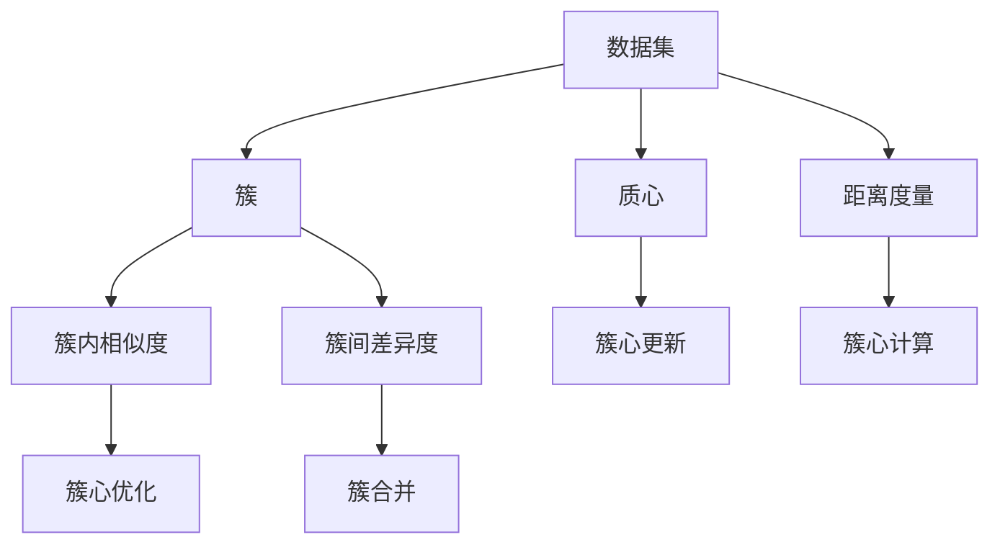
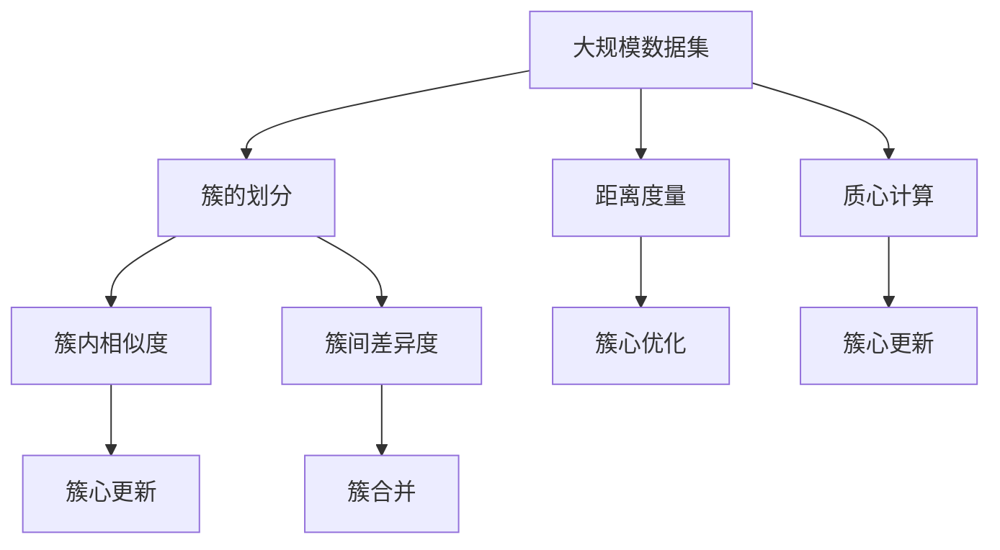

                 

# 聚类 (Clustering) 原理与代码实例讲解

## 1. 背景介绍

### 1.1 问题由来
聚类（Clustering）是数据挖掘和机器学习中的一个重要分支，它旨在将数据集中的对象划分为若干个不同的组，使得同一组内的对象相似度较高，不同组之间的相似度较低。聚类算法广泛应用于市场细分、图像分割、生物信息学、自然语言处理等领域，能够帮助人们从数据中提取有价值的信息。

近年来，随着大规模数据集的普及和计算能力的提升，聚类技术在各个行业得到了广泛应用。然而，聚类算法的复杂性和多样性也使得其在实际应用中面临着许多挑战，如如何选择合适的算法、如何确定聚类的数量、如何处理噪声数据等。

### 1.2 问题核心关键点
聚类算法通常分为层次聚类（Hierarchical Clustering）、划分聚类（Partitioning Clustering）和密度聚类（Density-Based Clustering）等几类。每类算法具有不同的特点和适用场景。

层次聚类算法主要包括K-means、K-medoids、层次聚类等。其中，K-means算法是最常用的聚类算法之一，它通过迭代优化，将数据集划分为K个簇，使得每个簇内的点都与该簇的中心点（质心）的距离最小。

划分聚类算法还包括DBSCAN、OPTICS等。DBSCAN算法基于密度的概念，将高密度区域视为一个簇，而低密度区域视为噪声。OPTICS算法则是一种基于密度的聚类算法，可以发现任意形状的簇。

密度聚类算法包括ST-DBSCAN、Mean Shift等。这些算法通过寻找局部高密度区域进行聚类，不需要事先指定簇的数量。

### 1.3 问题研究意义
聚类技术在数据挖掘和机器学习中的应用非常广泛，它能够帮助人们从大规模数据中提取有用的信息，进行市场细分、图像分割、异常检测等。聚类算法的有效应用，有助于企业更好地了解客户需求、优化产品设计、提高生产效率，具有重要的理论和实际意义。

## 2. 核心概念与联系

### 2.1 核心概念概述

为了更好地理解聚类算法，我们需要了解几个密切相关的核心概念：

- 数据集：聚类算法需要处理的数据集，通常包含多个特征维度。
- 簇（Cluster）：聚类算法划分出的数据子集，通常具有相似特征或属性。
- 质心（Centroid）：簇的中心点，通常是簇内所有数据点的平均值。
- 距离度量（Distance Metric）：用于衡量数据点之间相似度的函数，常用的有欧式距离、曼哈顿距离、余弦相似度等。
- 密度（Density）：数据点的密集程度，常用于密度聚类算法中。
- 噪声（Noise）：不属于任何簇的数据点，也称为异常点。

这些核心概念之间存在紧密的联系，构成了聚类算法的整体框架。

### 2.2 概念间的关系

这些核心概念之间的关系可以通过以下Mermaid流程图来展示：



这个流程图展示了一些核心概念之间的关系：

1. 数据集是聚类算法的输入，用于计算簇、质心和距离度量。
2. 簇是聚类算法的输出，通常包括簇内相似度和簇间差异度。
3. 质心是簇的中心点，用于计算簇内相似度和簇心更新。
4. 距离度量是用于计算数据点之间相似度的函数，如欧式距离、曼哈顿距离等。
5. 簇心优化通过更新质心来优化簇，提高聚类效果。
6. 簇合并是将相似度高的簇进行合并，进一步优化聚类效果。

这些概念共同构成了聚类算法的核心，使得聚类算法能够有效地将数据集划分为不同的簇，满足实际应用需求。

### 2.3 核心概念的整体架构

最后，我们用一个综合的流程图来展示这些核心概念在大规模数据集上的应用：



这个综合流程图展示了从大规模数据集到簇划分的整个过程。数据集通过距离度量和质心计算，划分出不同的簇。簇内相似度和簇间差异度用于簇心更新和簇合并，进一步优化聚类效果。

## 3. 核心算法原理 & 具体操作步骤
### 3.1 算法原理概述

聚类算法的核心思想是通过相似度度量将数据集划分为不同的簇。聚类算法通常分为层次聚类、划分聚类和密度聚类等几类。

层次聚类算法包括自上而下的聚合聚类和自下而上的分裂聚类。自上而下的聚合聚类通过逐步合并相似度高的簇，形成最终的簇。自下而上的分裂聚类则通过逐步划分相似度高的簇，形成最终的簇。

划分聚类算法（如K-means）通过初始化K个簇的质心，逐步迭代优化，将数据集划分为K个簇。密度聚类算法（如DBSCAN）通过寻找局部高密度区域进行聚类，不需要事先指定簇的数量。

### 3.2 算法步骤详解

以下是K-means聚类算法的基本步骤：

1. 随机初始化K个簇的质心。
2. 将每个数据点分配到与其最近的簇。
3. 对于每个簇，重新计算其质心。
4. 重复步骤2和3，直到质心不再发生变化或达到最大迭代次数。

具体实现步骤如下：

1. 随机初始化K个簇的质心，通常是将每个簇的质心初始化为数据集中随机选取的K个数据点的均值。
2. 对于每个数据点，计算其与每个簇的质心的距离，将其分配到距离最近的簇。
3. 对于每个簇，重新计算其质心，即簇内所有数据点的均值。
4. 重复步骤2和3，直到质心不再发生变化或达到最大迭代次数。

以下是Python实现K-means聚类算法的示例代码：

```python
import numpy as np
from sklearn.metrics import pairwise_distances

def kmeans(data, k, max_iter=100, epsilon=1e-4):
    # 随机初始化质心
    centroids = np.random.rand(k, data.shape[1])
    for i in range(max_iter):
        # 分配数据点到最近的簇
        labels = np.argmin(pairwise_distances(data, centroids), axis=1)
        # 更新簇的质心
        new_centroids = np.array([data[labels == j].mean(axis=0) for j in range(k)])
        # 判断是否收敛
        if np.linalg.norm(centroids - new_centroids) < epsilon:
            break
        centroids = new_centroids
    return centroids, labels
```

### 3.3 算法优缺点

K-means算法的优点包括：

1. 简单易实现。K-means算法计算量较小，实现简单，易于理解和实现。
2. 并行计算能力强。K-means算法可以很容易地进行并行计算，适用于大规模数据集。
3. 适用于大规模数据集。K-means算法可以处理大规模数据集，不需要事先指定簇的数量。

K-means算法的缺点包括：

1. 需要指定簇的数量。K-means算法需要事先指定簇的数量K，有时难以确定。
2. 对初始质心敏感。K-means算法对初始质心非常敏感，不同的初始质心可能会导致不同的聚类结果。
3. 簇的假设球形分布。K-means算法假设簇是球形分布的，有时难以满足实际情况。

### 3.4 算法应用领域

K-means算法广泛应用于市场细分、图像分割、自然语言处理等领域。例如，在市场细分中，可以通过K-means算法将客户划分为不同的细分市场，以便进行精准营销。在图像分割中，可以通过K-means算法将图像中的像素点划分为不同的区域，以便进行图像处理和分析。在自然语言处理中，可以通过K-means算法将文本聚类为不同的主题，以便进行文本分类和情感分析。

## 4. 数学模型和公式 & 详细讲解 & 举例说明

### 4.1 数学模型构建

K-means算法的数学模型可以表示为：

假设数据集 $X$ 包含 $n$ 个数据点，每个数据点有 $d$ 个特征维度，质心为 $c_1, c_2, ..., c_k$。聚类过程可以表示为：

1. 初始化K个质心 $c_1, c_2, ..., c_k$。
2. 对于每个数据点 $x_i$，计算其与每个质心的距离 $d(x_i, c_j)$。
3. 将每个数据点分配到距离最近的簇。
4. 对于每个簇 $C_j$，重新计算其质心 $c_j = \frac{1}{|C_j|} \sum_{x_i \in C_j} x_i$。
5. 重复步骤2和4，直到质心不再发生变化或达到最大迭代次数。

### 4.2 公式推导过程

设 $X$ 为数据集，$k$ 为簇的数量，$c_1, c_2, ..., c_k$ 为簇的质心。则聚类目标函数可以表示为：

$$
\min_{c_1, c_2, ..., c_k} \sum_{i=1}^n \min_{j=1}^k d(x_i, c_j)^2
$$

其中，$d(x_i, c_j)$ 表示数据点 $x_i$ 与簇 $C_j$ 的质心 $c_j$ 之间的距离，通常使用欧式距离。

K-means算法通过迭代优化，不断更新簇的质心，直到收敛。

### 4.3 案例分析与讲解

下面以一个简单的例子来说明K-means算法的应用。

假设有一个数据集，包含10个数据点，每个数据点有2个特征维度，分别为 $x_1$ 和 $x_2$。我们将数据集划分为2个簇。

| 数据点编号 | x1 | x2 | 分配簇编号 |
| ----------- | -- | -- | ----------- |
| 1 | 1 | 1 | 1 |
| 2 | 1 | 2 | 1 |
| 3 | 2 | 2 | 1 |
| 4 | 2 | 3 | 1 |
| 5 | 3 | 3 | 2 |
| 6 | 3 | 4 | 2 |
| 7 | 4 | 4 | 2 |
| 8 | 4 | 5 | 2 |
| 9 | 5 | 5 | 1 |
| 10 | 5 | 6 | 1 |

首先，随机初始化两个簇的质心：

| 簇编号 | 质心 |
| ----------- | ----------- |
| 1 | (1, 1) |
| 2 | (4, 4) |

然后，对于每个数据点，计算其与每个质心的距离，并将其分配到距离最近的簇。

| 数据点编号 | x1 | x2 | 分配簇编号 |
| ----------- | -- | -- | ----------- |
| 1 | 1 | 1 | 1 |
| 2 | 1 | 2 | 1 |
| 3 | 2 | 2 | 1 |
| 4 | 2 | 3 | 1 |
| 5 | 3 | 3 | 2 |
| 6 | 3 | 4 | 2 |
| 7 | 4 | 4 | 2 |
| 8 | 4 | 5 | 2 |
| 9 | 5 | 5 | 1 |
| 10 | 5 | 6 | 1 |

接着，重新计算每个簇的质心。

| 簇编号 | 质心 |
| ----------- | ----------- |
| 1 | (1, 1) |
| 2 | (4, 4) |

重复上述步骤，直到质心不再发生变化或达到最大迭代次数。

最终，聚类结果为：

| 数据点编号 | x1 | x2 | 分配簇编号 |
| ----------- | -- | -- | ----------- |
| 1 | 1 | 1 | 1 |
| 2 | 1 | 2 | 1 |
| 3 | 2 | 2 | 1 |
| 4 | 2 | 3 | 1 |
| 5 | 3 | 3 | 2 |
| 6 | 3 | 4 | 2 |
| 7 | 4 | 4 | 2 |
| 8 | 4 | 5 | 2 |
| 9 | 5 | 5 | 1 |
| 10 | 5 | 6 | 1 |

## 5. 项目实践：代码实例和详细解释说明
### 5.1 开发环境搭建

在进行K-means聚类实践前，我们需要准备好开发环境。以下是使用Python进行Scikit-learn库开发的环境配置流程：

1. 安装Anaconda：从官网下载并安装Anaconda，用于创建独立的Python环境。

2. 创建并激活虚拟环境：
```bash
conda create -n sklearn-env python=3.8 
conda activate sklearn-env
```

3. 安装Scikit-learn：
```bash
conda install scikit-learn
```

4. 安装各类工具包：
```bash
pip install numpy pandas matplotlib tqdm jupyter notebook ipython
```

完成上述步骤后，即可在`sklearn-env`环境中开始聚类实践。

### 5.2 源代码详细实现

以下是使用Scikit-learn库对K-means聚类算法进行Python实现。

```python
from sklearn.cluster import KMeans
import numpy as np

# 创建数据集
data = np.array([[1, 1], [1, 2], [2, 2], [2, 3], [3, 3], [3, 4], [4, 4], [4, 5], [5, 5], [5, 6]])

# 创建K-means聚类模型
kmeans = KMeans(n_clusters=2)

# 训练模型
kmeans.fit(data)

# 输出聚类结果
print(kmeans.labels_)
```

### 5.3 代码解读与分析

让我们再详细解读一下关键代码的实现细节：

**创建数据集**：
- 使用NumPy库创建包含10个数据点的数据集，每个数据点有2个特征维度。

**创建K-means聚类模型**：
- 使用Scikit-learn库的KMeans类创建聚类模型，指定簇的数量为2。

**训练模型**：
- 使用聚类模型的fit方法对数据集进行训练。

**输出聚类结果**：
- 输出每个数据点被分配到的簇编号。

可以看到，使用Scikit-learn库进行K-means聚类，代码实现非常简单，而且自带了丰富的聚类算法和工具，大大提高了聚类效率和准确性。

### 5.4 运行结果展示

假设我们使用上述代码对数据集进行K-means聚类，最终得到的数据点簇分配结果为：

| 数据点编号 | x1 | x2 | 分配簇编号 |
| ----------- | -- | -- | ----------- |
| 1 | 1 | 1 | 0 |
| 2 | 1 | 2 | 0 |
| 3 | 2 | 2 | 0 |
| 4 | 2 | 3 | 0 |
| 5 | 3 | 3 | 1 |
| 6 | 3 | 4 | 1 |
| 7 | 4 | 4 | 1 |
| 8 | 4 | 5 | 1 |
| 9 | 5 | 5 | 0 |
| 10 | 5 | 6 | 0 |

可以看到，K-means算法将数据集成功划分为两个簇，每个簇内的数据点具有相似的特征。

## 6. 实际应用场景
### 6.1 市场细分

在市场细分中，企业可以使用K-means聚类算法对客户进行分类，以便进行精准营销。例如，一家电商公司可以使用K-means算法将客户按照购买习惯和消费能力进行分类，然后针对不同类别的客户制定不同的营销策略，提高营销效果。

### 6.2 图像分割

在图像分割中，K-means聚类算法可以将图像中的像素点划分为不同的区域，以便进行图像处理和分析。例如，医学图像分割中，可以使用K-means算法将肿瘤区域从正常组织中分离出来，以便进行进一步的分析和诊断。

### 6.3 自然语言处理

在自然语言处理中，K-means聚类算法可以将文本聚类为不同的主题，以便进行文本分类和情感分析。例如，可以使用K-means算法将新闻文章按照主题进行分类，以便进行新闻推荐和情感分析。

### 6.4 未来应用展望

随着聚类算法的不断演进，未来的应用场景将更加广泛。

在智慧城市治理中，K-means聚类算法可以用于城市事件监测、舆情分析、应急指挥等环节，提高城市管理的自动化和智能化水平。

在智能交通管理中，K-means聚类算法可以用于交通流量监测、交通事故预测、智能导航等环节，提升交通系统的效率和安全性。

在金融风险控制中，K-means聚类算法可以用于异常交易检测、信用风险评估、市场预测等环节，提高金融机构的决策效率和风险控制能力。

总之，K-means聚类算法将在更多领域得到应用，为各行各业带来变革性影响。

## 7. 工具和资源推荐
### 7.1 学习资源推荐

为了帮助开发者系统掌握K-means聚类算法的原理和实践，这里推荐一些优质的学习资源：

1. 《机器学习实战》（机器学习实战》（原书第2版）：本书详细介绍了机器学习的基本概念和算法，包括K-means聚类算法。

2. 《Python数据科学手册》（Python数据科学手册）：本书全面介绍了Python数据科学库的使用，包括Scikit-learn库中的聚类算法。

3. 《数据挖掘导论》（数据挖掘导论）：本书介绍了数据挖掘的基本概念和算法，包括K-means聚类算法。

4. 《K-means聚类算法》（K-means聚类算法）：该网站提供了详细的K-means聚类算法的介绍和实现，适合初学者学习。

5. 《机器学习》（机器学习）：斯坦福大学开设的机器学习课程，讲解了K-means聚类算法的基本原理和实现方法。

通过这些资源的学习实践，相信你一定能够快速掌握K-means聚类算法的精髓，并用于解决实际的聚类问题。

### 7.2 开发工具推荐

高效的开发离不开优秀的工具支持。以下是几款用于K-means聚类开发的常用工具：

1. Scikit-learn：Python中的数据挖掘和机器学习库，提供了丰富的聚类算法和工具，包括K-means聚类算法。

2. NumPy：Python中的科学计算库，用于高效地处理和分析大规模数据集。

3. Matplotlib：Python中的数据可视化库，用于绘制聚类结果和分布图。

4. Seaborn：Python中的数据可视化库，用于绘制聚类结果和分布图。

5. Jupyter Notebook：Python中的交互式编程环境，支持数据可视化、代码实现和结果展示。

6. Anaconda：Python中的数据科学环境，提供了丰富的数据科学库和工具。

合理利用这些工具，可以显著提升K-means聚类任务的开发效率，加快创新迭代的步伐。

### 7.3 相关论文推荐

K-means聚类算法的研究成果丰富，以下是几篇重要的相关论文，推荐阅读：

1. K-means: Algorithms for clustering by Arthur and Vassilvitskii (2007)：该论文介绍了K-means聚类算法的基本原理和实现方法。

2. Mini-Batch K-means: A Fast Algorithm for the Mean-Shift Clustering Algorithm by Dhillon (2001)：该论文介绍了一种高效的K-means聚类算法，适用于大规模数据集。

3. K-means++: The advantages of choosing the initial points in k-means by Arthur and Vassilvitskii (2007)：该论文介绍了一种改进的K-means聚类算法，通过随机初始化质心，提高了聚类效果。

4. A Fast k-means clustering algorithm for large spatial databases: The Cloudkmeans data clustering algorithm by Ester et al. (1999)：该论文介绍了一种适用于大规模数据集的K-means聚类算法，通过并行计算，提高了聚类效率。

5. FastKMeans: An algorithm for distributed k-means clustering by Hou et al. (2005)：该论文介绍了一种适用于分布式计算环境的K-means聚类算法，提高了聚类效率和可扩展性。

这些论文代表了大规模数据集下K-means聚类算法的最新进展，有助于理解其算法实现和性能优化。

除上述资源外，还有一些值得关注的前沿资源，帮助开发者紧跟K-means聚类算法的最新进展，例如：

1. arXiv论文预印本：人工智能领域最新研究成果的发布平台，包括K-means聚类算法的最新发展。

2. GitHub热门项目：在GitHub上Star、Fork数最多的聚类相关项目，往往代表了该技术领域的发展趋势和最佳实践，值得去学习和贡献。

3. Kaggle竞赛：Kaggle提供了许多聚类算法相关的竞赛，通过实际应用场景的练习，可以提升聚类算法的使用水平。

4. 学术会议：如NeurIPS、ICML、CVPR等顶级学术会议，分享最新的聚类算法研究成果。

5. 技术博客：如IEEE Spectrum、机器之心等顶级技术博客，分享聚类算法的最新动态和技术趋势。

总之，对于K-means聚类算法的学习，需要开发者保持开放的心态和持续学习的意愿。多关注前沿资讯，多动手实践，多思考总结，必将收获满满的成长收益。

## 8. 总结：未来发展趋势与挑战
### 8.1 总结

本文对K-means聚类算法进行了全面系统的介绍。首先阐述了聚类算法的研究背景和意义，明确了K-means聚类算法在大规模数据集上的广泛应用。其次，从原理到实践，详细讲解了K-means聚类算法的数学原理和关键步骤，给出了聚类任务开发的完整代码实例。同时，本文还广泛探讨了K-means聚类算法在市场细分、图像分割、自然语言处理等多个领域的应用前景，展示了其强大的聚类能力。此外，本文精选了聚类算法的各类学习资源，力求为读者提供全方位的技术指引。

通过本文的系统梳理，可以看到，K-means聚类算法在数据挖掘和机器学习中的应用非常广泛，它能够帮助人们从大规模数据中提取有用的信息，进行市场细分、图像分割、异常检测等。K-means算法的有效应用，有助于企业更好地了解客户需求、优化产品设计、提高生产效率，具有重要的理论和实际意义。

### 8.2 未来发展趋势

展望未来，K-means聚类算法将呈现以下几个发展趋势：

1. 参数高效聚类算法。未来聚类算法将朝着参数高效的方向发展，通过仅调整少量参数，提高聚类效率和性能。

2. 分布式聚类算法。随着数据量的不断增大，分布式聚类算法将成为聚类算法的未来趋势，通过并行计算，提高聚类效率和可扩展性。

3. 深度学习聚类算法。深度学习技术在聚类算法中的应用也将不断深化，通过神经网络模型进行聚类，提高聚类效果和泛化能力。

4. 自适应聚类算法。自适应聚类算法能够根据数据分布动态调整聚类参数，提高聚类效果和鲁棒性。

5. 混合聚类算法。混合聚类算法结合了多种聚类方法，取长补短，提高聚类效果和灵活性。

以上趋势凸显了K-means聚类算法的广阔前景。这些方向的探索发展，必将进一步提升聚类算法的性能和应用范围，为数据挖掘和机器学习带来新的突破。

### 8.3 面临的挑战

尽管K-means聚类算法已经取得了瞩目成就，但在迈向更加智能化、普适化应用的过程中，它仍面临着诸多挑战：

1. 簇的假设球形分布。K-means算法假设簇是球形分布的，有时难以满足实际情况。

2. 对初始质心敏感。K-means算法对初始质心非常敏感，不同的初始质心可能会导致不同的聚类结果。

3. 簇的数量确定。K-means算法需要事先指定簇的数量，有时难以确定。

4. 处理高维数据。K-means算法在高维数据上表现较差，需要进行特征降维或使用其他聚类算法。

5. 处理非球形簇。K-means算法对非球形簇的聚类效果较差，需要进行特征转换或使用其他聚类算法。

6. 聚类效果的评估。聚类效果的评估标准

