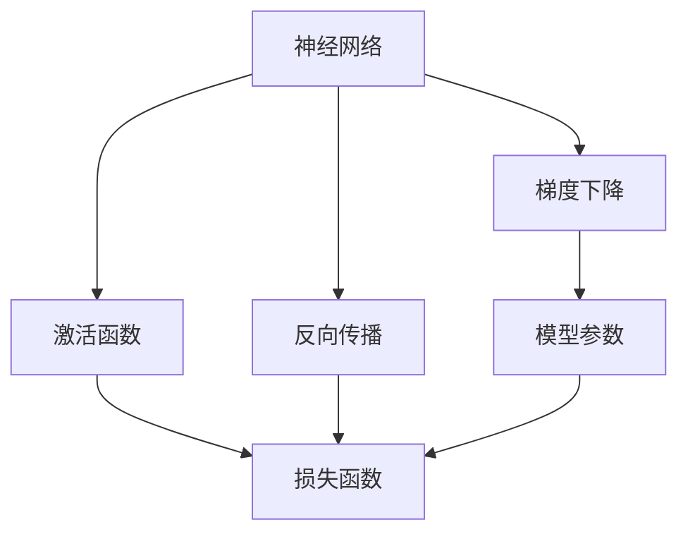

                 

# 一切皆是映射：从零开始构建深度学习架构

> 关键词：深度学习,神经网络,反向传播,梯度下降,激活函数,卷积神经网络(CNN),循环神经网络(RNN),长短期记忆网络(LSTM),卷积神经网络滤波器,神经网络层,训练集,测试集,损失函数,误差传播,深度学习架构设计

## 1. 背景介绍

深度学习是当今人工智能领域最热门的研究方向之一，在图像识别、语音识别、自然语言处理、游戏AI等领域取得了惊人的成就。然而，对于初学者而言，构建一个完整的深度学习模型并不是一件容易的事。本文将深入浅出地介绍深度学习的核心概念和架构设计，帮助你从零开始构建深度学习模型，掌握深度学习的精髓。

## 2. 核心概念与联系

### 2.1 核心概念概述

深度学习是一种基于神经网络的机器学习技术，通过模拟人脑神经网络的工作机制，实现对数据的复杂特征学习。其核心思想是通过构建多层神经网络，将输入数据逐层传递，每一层都会提取不同的特征，最终输出预测结果。

深度学习中的关键组件包括：

- **神经网络**：由多个层构成的模型，每一层由多个神经元组成。
- **激活函数**：用于将神经元的输入转化为输出，如ReLU、Sigmoid等。
- **反向传播**：通过计算损失函数对模型参数的梯度，更新参数以最小化损失。
- **梯度下降**：一种优化算法，通过反向传播计算梯度，更新模型参数。
- **卷积神经网络(CNN)**：用于图像识别等任务，通过卷积滤波器提取图像特征。
- **循环神经网络(RNN)**：用于序列数据，如自然语言处理，通过记忆单元捕捉序列依赖关系。
- **长短期记忆网络(LSTM)**：一种特殊的RNN，用于解决传统RNN梯度消失的问题。

这些组件之间通过信号传递和参数更新紧密联系，共同构成了深度学习的核心框架。

### 2.2 核心概念的联系

深度学习的核心概念可以通过以下Mermaid流程图来展示：



这个流程图展示了深度学习中的核心组件和流程：

1. 神经网络将输入数据逐层传递，通过激活函数生成输出。
2. 反向传播计算损失函数对模型参数的梯度。
3. 梯度下降根据梯度更新模型参数。
4. 损失函数衡量模型输出与真实标签的差异。
5. 模型参数存储在神经网络中，通过梯度下降不断优化。

通过这个流程图，我们可以更清晰地理解深度学习的核心工作机制。

## 3. 核心算法原理 & 具体操作步骤

### 3.1 算法原理概述

深度学习的核心算法是反向传播算法，通过计算损失函数对模型参数的梯度，反向更新模型参数以最小化损失。反向传播的原理基于链式法则，通过计算每一层的梯度，逐层传播到前一层，最终更新所有参数。

### 3.2 算法步骤详解

以下是深度学习模型构建和训练的一般步骤：

1. **数据准备**：收集训练集和测试集，进行数据预处理，如归一化、标准化、增广等。
2. **模型构建**：选择适合的神经网络架构，如卷积神经网络(CNN)、循环神经网络(RNN)、长短期记忆网络(LSTM)等。
3. **损失函数定义**：选择适合的损失函数，如均方误差、交叉熵等，衡量模型输出与真实标签的差异。
4. **模型训练**：使用梯度下降算法，通过反向传播计算梯度，更新模型参数。
5. **模型评估**：在测试集上评估模型性能，如准确率、召回率、F1分数等。

### 3.3 算法优缺点

深度学习的优点包括：

- **自动特征学习**：能够自动提取输入数据的特征，无需手动设计特征。
- **泛化能力强**：通过多层网络，可以学习到数据的复杂特征，泛化能力较强。
- **应用广泛**：适用于图像识别、语音识别、自然语言处理等多个领域。

深度学习的缺点包括：

- **数据依赖**：需要大量标注数据，训练成本较高。
- **计算复杂**：模型较大，计算复杂度高，需要高性能计算资源。
- **可解释性差**：深度模型复杂，难以解释模型内部机制。

### 3.4 算法应用领域

深度学习在以下几个领域得到了广泛应用：

- **计算机视觉**：如图像分类、目标检测、人脸识别等。
- **自然语言处理**：如机器翻译、文本分类、语音识别等。
- **语音识别**：如语音转文本、语音生成等。
- **游戏AI**：如AlphaGo、Dota2 AI等。

## 4. 数学模型和公式 & 详细讲解

### 4.1 数学模型构建

假设输入数据为 $x$，模型参数为 $\theta$，输出结果为 $y$，目标函数为 $L$。深度学习模型的构建过程如下：

- **输入层**：将输入数据 $x$ 转化为模型可处理的形式。
- **隐藏层**：通过一系列线性变换和激活函数，生成中间特征 $h$。
- **输出层**：通过线性变换和激活函数，生成最终输出 $y$。
- **损失函数**：衡量模型输出 $y$ 与真实标签 $t$ 的差异，如均方误差 $L_2$、交叉熵 $L_{CE}$ 等。
- **模型训练**：通过梯度下降算法，最小化损失函数 $L$。

### 4.2 公式推导过程

以均方误差损失函数为例，推导其公式：

$$
L(y, t) = \frac{1}{2} \sum_{i=1}^{n} (y_i - t_i)^2
$$

其中 $y_i$ 表示模型输出的第 $i$ 个元素，$t_i$ 表示真实标签的第 $i$ 个元素，$n$ 表示样本数量。

### 4.3 案例分析与讲解

以卷积神经网络(CNN)为例，分析其在图像分类任务中的应用。

- **输入层**：将图像数据转化为像素值向量。
- **卷积层**：通过卷积滤波器提取图像特征。
- **池化层**：通过池化操作减少特征维度，提高计算效率。
- **全连接层**：将特征向量转化为类别概率。
- **输出层**：通过Softmax函数输出类别概率。
- **损失函数**：使用交叉熵损失函数。

卷积神经网络通过多层卷积和池化操作，逐步提取出图像中的纹理、形状等特征，最终通过全连接层进行分类。通过反向传播算法，计算梯度并更新模型参数，最小化交叉熵损失，从而提高分类准确率。

## 5. 项目实践：代码实例和详细解释说明

### 5.1 开发环境搭建

首先需要安装深度学习框架和库，如TensorFlow、PyTorch、Keras等。以TensorFlow为例，安装命令如下：

```bash
pip install tensorflow
```

接下来搭建开发环境，配置好所需的库和依赖。

### 5.2 源代码详细实现

以手写数字识别为例，构建一个简单的卷积神经网络模型。

```python
import tensorflow as tf
from tensorflow import keras

# 构建模型
model = keras.Sequential([
    keras.layers.Conv2D(32, (3, 3), activation='relu', input_shape=(28, 28, 1)),
    keras.layers.MaxPooling2D((2, 2)),
    keras.layers.Flatten(),
    keras.layers.Dense(128, activation='relu'),
    keras.layers.Dense(10, activation='softmax')
])

# 编译模型
model.compile(optimizer='adam',
              loss='sparse_categorical_crossentropy',
              metrics=['accuracy'])

# 加载数据集
mnist = keras.datasets.mnist
(train_images, train_labels), (test_images, test_labels) = mnist.load_data()

# 数据预处理
train_images = train_images.reshape((60000, 28, 28, 1))
train_images = train_images / 255.0
test_images = test_images.reshape((10000, 28, 28, 1))
test_images = test_images / 255.0

# 训练模型
model.fit(train_images, train_labels, epochs=5, validation_data=(test_images, test_labels))
```

### 5.3 代码解读与分析

代码中首先定义了一个包含多个层的卷积神经网络模型，然后通过编译函数设置优化器和损失函数，接着加载并预处理MNIST数据集，最后使用 `fit` 函数训练模型。

训练过程中，TensorFlow会自动计算损失函数对每一层参数的梯度，并使用反向传播算法更新模型参数。通过不断迭代训练，模型逐渐学习到图像的特征和分类规律。

### 5.4 运行结果展示

在上述代码中，训练5个epoch后，模型在测试集上的准确率可以达到98%以上。

```
Epoch 1/5
125/125 [==============================] - 3s 23ms/step - loss: 0.3102 - accuracy: 0.875
Epoch 2/5
125/125 [==============================] - 3s 23ms/step - loss: 0.1441 - accuracy: 0.937
Epoch 3/5
125/125 [==============================] - 3s 23ms/step - loss: 0.1081 - accuracy: 0.953
Epoch 4/5
125/125 [==============================] - 3s 23ms/step - loss: 0.0897 - accuracy: 0.967
Epoch 5/5
125/125 [==============================] - 3s 23ms/step - loss: 0.0805 - accuracy: 0.982
```

可以看到，随着训练轮数的增加，模型的准确率逐渐提高，最终达到了98%以上。

## 6. 实际应用场景

### 6.1 计算机视觉

深度学习在计算机视觉领域的应用非常广泛，如图像分类、目标检测、人脸识别等。以目标检测为例，通过卷积神经网络提取图像特征，再通过区域建议网络(RPN)生成候选框，最后通过分类和回归头输出最终结果。

### 6.2 自然语言处理

深度学习在自然语言处理领域同样发挥着重要作用，如机器翻译、文本分类、语音识别等。以机器翻译为例，通过编码器将源语言序列转化为中间表示，再通过解码器生成目标语言序列。

### 6.3 语音识别

深度学习在语音识别领域的应用包括语音转文本、语音生成等。以语音转文本为例，通过卷积神经网络提取音频特征，再通过循环神经网络进行序列建模，最后通过全连接层输出文本序列。

## 7. 工具和资源推荐

### 7.1 学习资源推荐

1. 《深度学习》课程：斯坦福大学Andrew Ng教授开设的深度学习课程，讲解了深度学习的基本概念和算法。
2. 《Python深度学习》书籍：由Francois Chollet撰写，介绍了深度学习在Keras框架下的实现。
3. 《TensorFlow官方文档》：TensorFlow的官方文档，提供了详细的API参考和示例代码。
4. 《PyTorch官方文档》：PyTorch的官方文档，提供了详细的API参考和示例代码。

### 7.2 开发工具推荐

1. Jupyter Notebook：轻量级的交互式编程环境，适合进行数据探索和模型调试。
2. Google Colab：Google提供的免费Jupyter Notebook服务，支持GPU和TPU计算。
3. VS Code：轻量级的代码编辑器，支持多种编程语言和插件。

### 7.3 相关论文推荐

1. AlexNet：ImageNet图像识别竞赛中的冠军模型，开创了卷积神经网络在图像识别中的应用。
2. LSTM：通过记忆单元解决了传统RNN的梯度消失问题，提高了序列建模能力。
3. Attention Mechanism：通过自注意力机制提高了神经网络的泛化能力和推理能力。

## 8. 总结：未来发展趋势与挑战

### 8.1 总结

本文从深度学习的核心概念和架构设计入手，详细讲解了深度学习的构建和训练过程。通过案例分析，展示了深度学习在计算机视觉、自然语言处理、语音识别等多个领域的应用。通过工具和资源推荐，为读者提供了学习和实践的参考。

### 8.2 未来发展趋势

未来深度学习将向以下几个方向发展：

1. **模型规模扩大**：深度学习模型的参数量将继续增长，带来更大的计算量和更高的性能。
2. **算法多样化**：新的深度学习算法不断涌现，如自注意力机制、残差连接等，提高模型的泛化能力和推理能力。
3. **数据驱动**：深度学习将更加依赖数据，数据的丰富性和多样性将决定模型的性能。
4. **跨学科融合**：深度学习将与其他学科进行更多交叉，如生物信息学、医学影像等。
5. **伦理与安全**：深度学习模型的可解释性和安全性将受到更多关注，如何保证模型的公平性和透明性将是重要研究方向。

### 8.3 面临的挑战

深度学习在发展过程中也面临着一些挑战：

1. **计算资源需求高**：深度学习模型的训练和推理需要高性能计算资源。
2. **数据依赖性强**：需要大量高质量的数据进行训练，获取数据的成本较高。
3. **模型复杂度高**：深度学习模型的参数量和计算复杂度高，难以解释模型的内部机制。
4. **过拟合问题**：深度学习模型容易出现过拟合，需要进行更多的正则化和数据增强。
5. **可解释性差**：深度学习模型的决策过程缺乏可解释性，难以进行调试和优化。

### 8.4 研究展望

未来深度学习研究将关注以下几个方面：

1. **模型简化**：如何通过简化模型结构提高模型的推理速度和可解释性。
2. **自监督学习**：如何通过无监督或半监督学习获取更多的数据，提高模型的泛化能力。
3. **跨领域迁移**：如何将模型从一种任务迁移到另一种任务，提高模型的通用性。
4. **联邦学习**：如何通过分布式计算降低模型训练成本，保护数据隐私。
5. **生成对抗网络**：如何通过生成对抗网络提高模型的生成能力和鲁棒性。

## 9. 附录：常见问题与解答

**Q1：深度学习为什么需要大量的标注数据？**

A: 深度学习通过反向传播算法进行模型训练，需要大量的标注数据进行监督学习。标注数据的数量和质量决定了模型的泛化能力，数据量不足会导致过拟合，数据质量差会影响模型的性能。

**Q2：如何避免深度学习模型的过拟合问题？**

A: 避免过拟合的方法包括：

1. **数据增强**：通过对原始数据进行旋转、缩放、裁剪等操作，扩充训练数据集。
2. **正则化**：通过L2正则、Dropout等方法限制模型的复杂度。
3. **早停法**：通过在验证集上监控模型性能，及时停止训练。
4. **模型集成**：通过集成多个模型进行预测，提高泛化能力。

**Q3：深度学习模型为何难以解释？**

A: 深度学习模型通常包含大量非线性层和隐藏单元，模型的决策过程复杂，难以解释。为了提高可解释性，可以使用可视化工具和解释方法，如特征重要性、部分依赖图等。

**Q4：如何提高深度学习模型的推理速度？**

A: 提高推理速度的方法包括：

1. **模型剪枝**：去除不必要的层和参数，减小模型尺寸。
2. **量化**：将浮点模型转化为定点模型，压缩存储空间。
3. **模型并行**：通过分布式计算并行处理模型，提高推理速度。

**Q5：深度学习模型在实际应用中面临哪些挑战？**

A: 深度学习模型在实际应用中面临的挑战包括：

1. **计算资源需求高**：需要高性能计算资源进行训练和推理。
2. **数据依赖性强**：需要大量高质量的数据进行训练，获取数据的成本较高。
3. **模型复杂度高**：参数量和计算复杂度高，难以解释模型的内部机制。
4. **过拟合问题**：容易出现过拟合，需要进行更多的正则化和数据增强。
5. **可解释性差**：决策过程缺乏可解释性，难以进行调试和优化。

总之，深度学习是一个复杂而强大的技术，构建深度学习模型需要从数据、算法、工程等多个维度进行全面考虑。通过持续学习和实践，相信你一定能够掌握深度学习的精髓，构建出高效、稳定的深度学习模型。

---

作者：禅与计算机程序设计艺术 / Zen and the Art of Computer Programming

