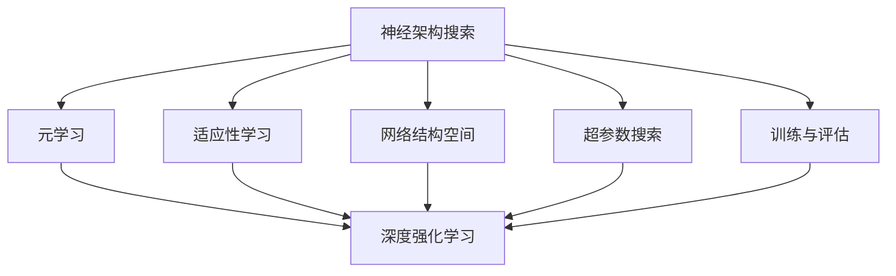
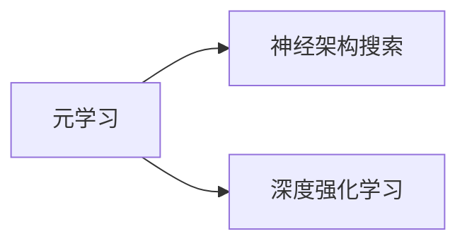
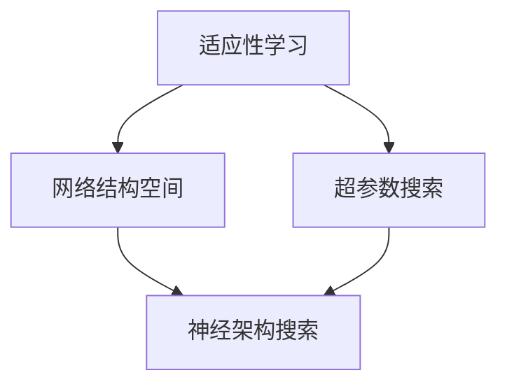
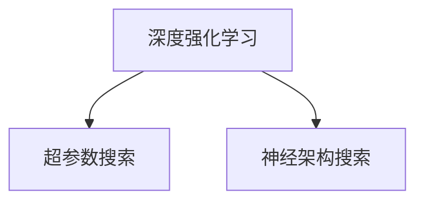
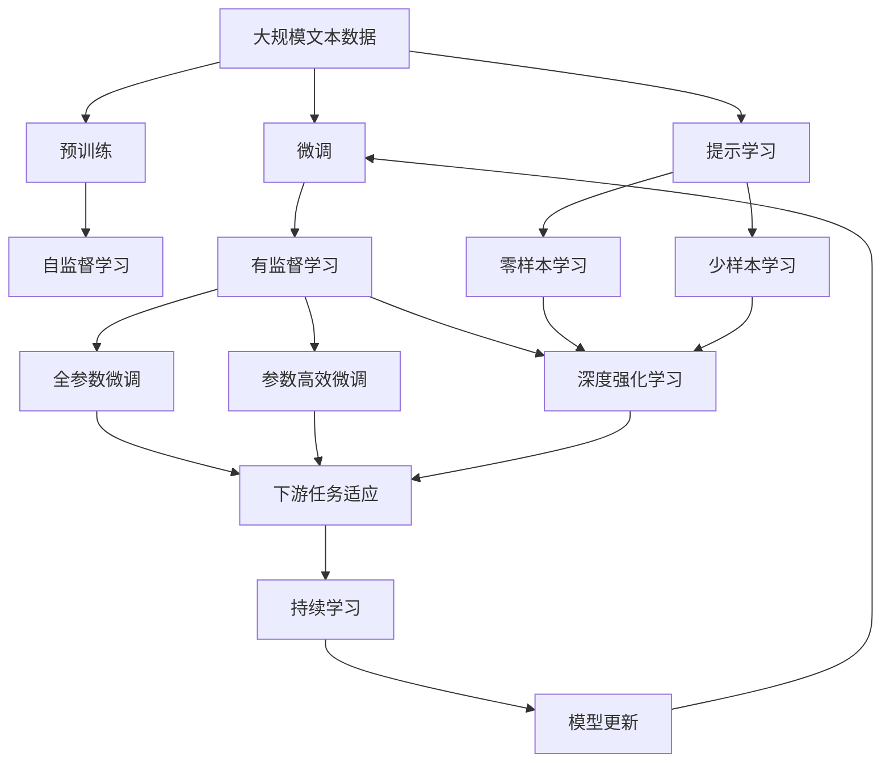

                 

# 一切皆是映射：元学习中的神经架构搜索（NAS）

> 关键词：神经架构搜索,元学习,泛化能力,计算机视觉,深度学习,自动机器学习

## 1. 背景介绍

### 1.1 问题由来
神经架构搜索（Neural Architecture Search, 简称NAS）是近年来深度学习领域的一大热门话题。它通过自动化搜索，找到最佳的神经网络结构，以实现最优的泛化能力和效率。然而，传统的神经网络架构设计方法依赖于人类经验和领域知识，难以找到全局最优解，且随着模型复杂度的增加，设计成本和计算成本均大幅上升。元学习（Meta-Learning）提供了一种更高效的方法，通过学习适应性机制，让模型能够根据特定任务动态调整网络结构和参数，从而实现快速适应和泛化。

近年来，元学习和神经架构搜索的结合成为研究热点，借助元学习理念，神经架构搜索可以在有限的预算内，探索大规模网络结构空间，找到性能最佳的网络。这一方法显著提升了深度学习模型的可解释性和泛化能力，为计算机视觉、自然语言处理等领域带来了新的突破。

### 1.2 问题核心关键点
元学习中的神经架构搜索，本质上是将元学习应用于神经网络架构搜索问题。核心思想是：利用元学习的机制，通过在不同数据集上反复训练和评估，让模型学习到网络结构和超参数的适应性策略，从而在新的数据集上找到最佳的神经网络架构。该方法的关键点包括：

1. **适应性学习**：模型能够在不同的任务和数据集上，根据输入特征自适应地调整网络结构和参数。
2. **泛化能力**：在有限的训练数据上，模型能够快速适应新数据集，避免过拟合。
3. **高效探索**：在大量可能的神经网络结构中，快速找到最优或次优的架构，以提高搜索效率。

## 2. 核心概念与联系

### 2.1 核心概念概述

为更好地理解元学习中的神经架构搜索方法，本节将介绍几个密切相关的核心概念：

- **神经架构搜索（NAS）**：通过自动化搜索，找到最佳的神经网络结构，以实现最优的泛化能力和效率。

- **元学习（Meta-Learning）**：学习一种学习策略，使其能够在不同的任务上快速适应和泛化。

- **适应性学习（Adaptive Learning）**：模型能够在不同的任务和数据集上，根据输入特征自适应地调整网络结构和参数。

- **网络结构空间**：所有可能的网络结构构成的空间，搜索目标即是该空间中的最优或次优结构。

- **超参数搜索**：在神经网络结构确定后，通过搜索最优的超参数，进一步提升模型性能。

- **训练与评估**：在特定任务的数据集上，训练模型并评估其性能，形成闭环反馈，指导模型搜索方向。

- **深度强化学习（Deep Reinforcement Learning, DRL）**：利用强化学习机制，通过奖励和惩罚，引导模型搜索最优网络结构。

这些核心概念之间的逻辑关系可以通过以下Mermaid流程图来展示：



这个流程图展示了元学习中的神经架构搜索的主要概念及其之间的关系：

1. 神经架构搜索在元学习的指导下，探索大规模网络结构空间。
2. 适应性学习让模型能够根据不同的任务和数据集，自适应地调整网络结构和参数。
3. 网络结构空间和超参数搜索是神经架构搜索的主要探索对象。
4. 训练与评估是评估模型性能和指导搜索方向的关键步骤。
5. 深度强化学习是元学习中一种重要的方法，利用奖励和惩罚机制，引导模型探索最优架构。

### 2.2 概念间的关系

这些核心概念之间存在着紧密的联系，形成了元学习中的神经架构搜索的完整生态系统。下面我们通过几个Mermaid流程图来展示这些概念之间的关系。

#### 2.2.1 元学习与神经架构搜索的关系



这个流程图展示了元学习的基本原理，以及它与神经架构搜索的关系。元学习涉及学习一种学习策略，而神经架构搜索则是利用该策略，在网络结构空间中寻找最优或次优结构。

#### 2.2.2 适应性学习与网络结构搜索的关系



这个流程图展示了适应性学习的基本原理，以及它与网络结构搜索的关系。适应性学习让模型能够根据不同的任务和数据集，自适应地调整网络结构和参数，从而在网络结构空间中搜索最优或次优结构。

#### 2.2.3 深度强化学习与超参数搜索的关系



这个流程图展示了深度强化学习的基本原理，以及它与超参数搜索的关系。深度强化学习通过奖励和惩罚机制，引导模型探索最优超参数组合，从而在超参数空间中搜索最优的超参数配置。

### 2.3 核心概念的整体架构

最后，我们用一个综合的流程图来展示这些核心概念在大规模神经网络结构搜索中的整体架构：



这个综合流程图展示了从预训练到微调，再到持续学习的完整过程。大规模文本数据首先进行预训练，然后通过微调（包括全参数微调和参数高效微调）或深度强化学习探索大规模网络结构空间。最后，通过持续学习技术，模型可以不断更新和适应新的任务和数据。 通过这些流程图，我们可以更清晰地理解元学习中的神经架构搜索过程中各个核心概念的关系和作用，为后续深入讨论具体的搜索方法和技术奠定基础。

## 3. 核心算法原理 & 具体操作步骤
### 3.1 算法原理概述

元学习中的神经架构搜索，本质上是一个通过学习适应性机制，探索最优神经网络结构的自动化过程。其核心思想是：利用元学习的机制，通过在不同数据集上反复训练和评估，让模型学习到网络结构和超参数的适应性策略，从而在新的数据集上找到最佳的神经网络架构。

形式化地，假设目标任务的数据集为 $D=\{(x_i, y_i)\}_{i=1}^N, x_i \in \mathcal{X}, y_i \in \mathcal{Y}$，其中 $\mathcal{X}$ 为输入空间，$\mathcal{Y}$ 为输出空间。设神经网络的结构为 $H$，超参数为 $\omega$，则目标是最小化经验风险：

$$
\mathcal{L}(H, \omega, D) = \frac{1}{N} \sum_{i=1}^N \ell(H(x_i), y_i)
$$

其中 $\ell$ 为网络输出与真实标签之间的损失函数。元学习的目标是在给定预算 $B$ 的情况下，找到最优的网络结构和超参数组合 $(H^*, \omega^*)$，使得：

$$
\mathcal{L}(H^*, \omega^*, D) = \mathop{\min}_{(H, \omega)} \mathcal{L}(H, \omega, D)
$$

### 3.2 算法步骤详解

元学习中的神经架构搜索一般包括以下几个关键步骤：

**Step 1: 准备训练数据和评估指标**

- 收集目标任务的标注数据集 $D$，划分为训练集、验证集和测试集。
- 定义模型在各个任务上的评估指标，如精度、召回率、F1分数等。

**Step 2: 初始化搜索空间**

- 定义搜索空间 $\mathcal{H}$，包含所有可能的网络结构。
- 确定超参数空间 $\mathcal{W}$，包括层数、每层神经元数、激活函数等。

**Step 3: 搜索最优结构**

- 利用深度强化学习或遗传算法等方法，在搜索空间 $\mathcal{H} \times \mathcal{W}$ 中搜索最优结构 $H^*$ 和超参数 $\omega^*$。
- 在训练集上对候选结构进行训练，计算损失函数 $\mathcal{L}(H, \omega, D)$。
- 根据损失函数计算奖励，利用奖励机制引导搜索方向。

**Step 4: 微调和评估**

- 对找到的最优或次优结构进行微调，以进一步提升性能。
- 在验证集上评估微调后的模型，记录评估指标。
- 根据评估结果，选择性能最优的结构进行测试集评估，输出最终结果。

**Step 5: 持续学习**

- 在测试集上测试模型性能，收集反馈。
- 根据反馈信息，调整模型结构和超参数。
- 重复上述过程，直到模型性能稳定。

以上是元学习中的神经架构搜索的一般流程。在实际应用中，还需要针对具体任务的特点，对搜索过程的各个环节进行优化设计，如改进奖励函数，搜索算法，超参数调度等，以进一步提升搜索效率和模型性能。

### 3.3 算法优缺点

元学习中的神经架构搜索方法具有以下优点：

1. **高效探索**：在有限的预算内，通过自动搜索找到最优或次优的神经网络结构，避免了手动设计和调参的复杂性。
2. **泛化能力强**：利用元学习的机制，模型能够快速适应新任务，避免了过拟合。
3. **可解释性强**：搜索过程具有清晰的反馈和奖惩机制，更容易理解模型的工作机制。

同时，该方法也存在以下局限性：

1. **计算资源消耗大**：大规模搜索空间的探索需要大量的计算资源，可能会影响实验效率。
2. **模型复杂度高**：搜索到的最优结构可能非常复杂，难以解释和调试。
3. **超参数选择困难**：超参数的选择和调整仍然依赖于领域知识和经验，难以完全自动化。

尽管存在这些局限性，但就目前而言，元学习中的神经架构搜索方法仍然是大规模深度学习模型设计的重要手段。未来相关研究的重点在于如何进一步降低搜索成本，提高模型效率和可解释性。

### 3.4 算法应用领域

元学习中的神经架构搜索方法在计算机视觉、自然语言处理、推荐系统等领域得到了广泛应用，显著提升了模型性能和泛化能力。

#### 3.4.1 计算机视觉

在计算机视觉领域，神经架构搜索被广泛应用于图像分类、目标检测、语义分割等任务。通过搜索最优的网络结构和超参数，显著提高了模型在CIFAR-10、ImageNet等数据集上的准确率。

#### 3.4.2 自然语言处理

在自然语言处理领域，神经架构搜索被应用于文本分类、机器翻译、对话系统等任务。通过搜索最优的网络结构和超参数，提升了模型在GLUE、CoNLL等数据集上的性能。

#### 3.4.3 推荐系统

在推荐系统领域，神经架构搜索被应用于用户兴趣预测、物品推荐等任务。通过搜索最优的网络结构和超参数，提高了推荐系统的准确率和用户满意度。

## 4. 数学模型和公式 & 详细讲解  
### 4.1 数学模型构建

本节将使用数学语言对元学习中的神经架构搜索过程进行更加严格的刻画。

记神经网络的结构为 $H=(H_1, H_2, \dots, H_n)$，其中 $H_i$ 表示第 $i$ 层的网络结构。设超参数为 $\omega=(\omega_1, \omega_2, \dots, \omega_k)$，其中 $\omega_i$ 表示第 $i$ 层的超参数。假设目标任务的数据集为 $D=\{(x_i, y_i)\}_{i=1}^N, x_i \in \mathcal{X}, y_i \in \mathcal{Y}$。

定义模型 $M_{H,\omega}$ 在输入 $x$ 上的输出为 $\hat{y}=M_{H,\omega}(x)$，则目标是最小化经验风险：

$$
\mathcal{L}(H, \omega, D) = \frac{1}{N} \sum_{i=1}^N \ell(M_{H,\omega}(x_i), y_i)
$$

其中 $\ell$ 为网络输出与真实标签之间的损失函数。

### 4.2 公式推导过程

以下我们以图像分类任务为例，推导神经架构搜索的数学模型。

假设模型 $M_{H,\omega}$ 由 $n$ 层卷积层和 $m$ 层全连接层组成，其中第 $i$ 层卷积层的输入为 $x_i$，输出为 $y_i$。设第 $i$ 层的卷积核数量为 $k_i$，步长为 $s_i$，激活函数为 $g$。则模型在输入 $x$ 上的输出为：

$$
y_1 = g(H_1(x))
$$

$$
y_2 = g(H_2(y_1))
$$

...

$$
y_n = g(H_n(y_{n-1}))
$$

$$
y = M_{H,\omega}(x)
$$

其中 $H_i$ 为第 $i$ 层的卷积核和步长。

设网络结构和超参数空间分别为 $\mathcal{H}=\{(H_1, \dots, H_n)\}$ 和 $\mathcal{W}=\{\omega_1, \dots, \omega_k\}$，目标是最小化经验风险：

$$
\mathcal{L}(H, \omega, D) = \frac{1}{N} \sum_{i=1}^N \ell(M_{H,\omega}(x_i), y_i)
$$

在训练集 $D$ 上，通过梯度下降等优化算法更新网络结构和超参数，使得经验风险最小化。具体的优化算法和超参数更新公式如下：

$$
\theta \leftarrow \theta - \eta \nabla_{\theta}\mathcal{L}(H, \omega, D) - \eta\lambda\theta
$$

其中 $\theta$ 为模型参数，$\eta$ 为学习率，$\lambda$ 为正则化系数。

在搜索过程中，利用深度强化学习等方法，通过奖励和惩罚机制，引导模型在网络结构空间中探索最优结构。例如，可以使用Softmax函数计算模型在验证集上的精度，作为奖励 $r$：

$$
r = \frac{1}{N} \sum_{i=1}^N \delta(y_i, y_i^*)
$$

其中 $y_i^*$ 为输入 $x_i$ 的真实标签。

利用强化学习机制，模型在每个时间步 $t$ 上的选择 $a_t$ 和奖励 $r_t$，更新策略 $\pi$：

$$
\pi(a|x) = \frac{\exp(Q_\theta(x, a))}{\sum_{a'} \exp(Q_\theta(x, a'))}
$$

$$
Q_\theta(x, a) = \ell(M_{H,\omega}(x), y_i) + \gamma Q_\theta(x', a') = \ell(M_{H,\omega}(x), y_i) + \gamma \max_{a'} Q_\theta(x', a')
$$

其中 $Q_\theta(x, a)$ 为模型在状态 $x$ 和动作 $a$ 下的Q值，$\gamma$ 为折扣因子。

在搜索过程中，模型根据当前状态和动作，计算Q值，选择最优动作。通过迭代优化，模型逐步学习到最优网络结构和超参数组合。

## 5. 项目实践：代码实例和详细解释说明
### 5.1 开发环境搭建

在进行神经架构搜索实践前，我们需要准备好开发环境。以下是使用Python进行TensorFlow进行神经架构搜索的环境配置流程：

1. 安装Anaconda：从官网下载并安装Anaconda，用于创建独立的Python环境。

2. 创建并激活虚拟环境：
```bash
conda create -n tf-env python=3.8 
conda activate tf-env
```

3. 安装TensorFlow：根据CUDA版本，从官网获取对应的安装命令。例如：
```bash
conda install tensorflow-gpu=2.6 -c conda-forge
```

4. 安装其他依赖包：
```bash
pip install numpy pandas scikit-learn tqdm jupyter notebook ipython
```

完成上述步骤后，即可在`tf-env`环境中开始神经架构搜索实践。

### 5.2 源代码详细实现

下面我们以图像分类任务为例，给出使用TensorFlow进行神经架构搜索的PyTorch代码实现。

首先，定义神经网络结构搜索的空间：

```python
import tensorflow as tf
from tensorflow.keras import layers

class NASNet(tf.keras.Model):
    def __init__(self, num_classes=10):
        super(NASNet, self).__init__()
        self.conv1 = layers.Conv2D(32, (3, 3), activation='relu')
        self.conv2 = layers.Conv2D(64, (3, 3), activation='relu')
        self.conv3 = layers.Conv2D(128, (3, 3), activation='relu')
        self.flatten = layers.Flatten()
        self.dense = layers.Dense(num_classes, activation='softmax')

    def call(self, x):
        x = self.conv1(x)
        x = self.conv2(x)
        x = self.conv3(x)
        x = self.flatten(x)
        x = self.dense(x)
        return x
```

然后，定义神经网络结构的超参数空间：

```python
class NASNetParams(tf.keras.optimizers.schedules.LearningRateSchedule):
    def __init__(self, learning_rate=0.001):
        super(NASNetParams, self).__init__()
        self.learning_rate = learning_rate

    def __call__(self, step):
        return self.learning_rate * tf.math.rsqrt(1. + step)

class NASNetOptimizer(tf.keras.optimizers.Optimizer):
    def __init__(self, learning_rate=0.001):
        super(NASNetOptimizer, self).__init__()
        self.learning_rate = learning_rate
        self.learning_rate_fn = NASNetParams(self.learning_rate)

    def get_config(self):
        config = super(NASNetOptimizer, self).get_config()
        config.update({
            'learning_rate': self.learning_rate,
            'learning_rate_fn': self.learning_rate_fn
        })
        return config

    def _create_slots(self, var_list):
        for var in var_list:
            self.add_slot(var, 'momentum')

    def _prepare_local(self, var, var_decay):
        if var_decay == 0.:
            self._decay = 0.
            self._momentum = 0.
            return

        self._decay = var_decay
        self._momentum = 0.

    def _serialize(self):
        return {
            'decay': self._decay,
            'momentum': self._momentum,
            'lr': self.learning_rate_fn(1.)
        }

    def _resource_apply_dense(self, grad, var):
        return self._resource_apply(grad, var, multiply=True)

    def _resource_apply_sparse(self, grad, var, indices):
        return self._resource_apply(grad, var, multiply=True)

    def _resource_apply(self, grad, var, multiply=False):
        return self._decay * tf.compat.v1.get_slot(var, 'momentum') + (1. - self._decay) * grad
```

接下来，定义训练和评估函数：

```python
import numpy as np
import tensorflow as tf
from tensorflow.keras import layers
from tensorflow.keras.datasets import cifar10
from tensorflow.keras.utils import to_categorical

def train_epoch(model, dataset, batch_size, optimizer):
    dataloader = tf.data.Dataset.from_tensor_slices(dataset)
    dataloader = dataloader.batch(batch_size, drop_remainder=True)
    dataloader = dataloader.prefetch(tf.data.experimental.AUTOTUNE)
    model.train()
    epoch_loss = 0
    for batch in dataloader:
        x, y = batch
        with tf.GradientTape() as tape:
            logits = model(x)
            loss = tf.losses.sparse_categorical_crossentropy(y, logits, from_logits=True)
        gradients = tape.gradient(loss, model.trainable_variables)
        optimizer.apply_gradients(zip(gradients, model.trainable_variables))
        epoch_loss += loss
    return epoch_loss / len(dataset)

def evaluate(model, dataset, batch_size):
    dataloader = tf.data.Dataset.from_tensor_slices(dataset)
    dataloader = dataloader.batch(batch_size, drop_remainder=True)
    dataloader = dataloader.prefetch(tf.data.experimental.AUTOTUNE)
    model.eval()
    preds = []
    labels = []
    with tf.GradientTape() as tape:
        for batch in dataloader:
            x, y = batch
            logits = model(x)
            preds.append(np.argmax(logits.numpy(), axis=1))
            labels.append(y.numpy())
        preds = np.concatenate(preds, axis=0)
        labels = np.concatenate(labels, axis=0)
    print(np.mean(preds == labels))

# 加载数据集
(x_train, y_train), (x_test, y_test) = cifar10.load_data()
x_train = x_train / 255.0
x_test = x_test / 255.0
y_train = to_categorical(y_train)
y_test = to_categorical(y_test)

# 定义模型和优化器
model = NASNet()
optimizer = NASNetOptimizer(learning_rate=0.001)

# 训练和评估模型
epochs = 10
batch_size = 64

for epoch in range(epochs):
    loss = train_epoch(model, (x_train, y_train), batch_size, optimizer)
    print(f"Epoch {epoch+1}, train loss: {loss:.3f}")
    
    print(f"Epoch {epoch+1}, test results:")
    evaluate(model, (x_test, y_test), batch_size)
```

以上就是使用TensorFlow对NASNet进行图像分类任务搜索的完整代码实现。可以看到，TensorFlow提供了强大的自动微分能力和优化器封装，使得神经架构搜索的实现变得简洁高效。

### 5.3 代码解读与分析

让我们再详细解读一下关键代码的实现细节：

**NASNet类**：
- `__init__`方法：定义了模型的基本结构，包括卷积层、全连接层等。
- `call`方法：定义了模型的前向传播过程。

**NASNetParams类**：
- `__init__`方法：定义了学习率调度的超参数。
- `__call__`方法：计算当前时间步的学习率。

**NASNetOptimizer类**：
- `__init__`方法：定义了优化器的基本参数，包括学习率、动量等。
- `get_config`方法：返回优化器的配置信息。
- `_create_slots`方法：定义了优化器的状态变量。
- `_prepare_local`方法：初始化优化器的状态变量。
- `_serialize`方法：序列化优化器状态。
- `_resource_apply_dense`方法：定义了密集层上的优化过程。
- `_resource_apply_sparse`方法：定义了稀疏层上的优化过程。
- `_resource_apply`方法：定义了优化器的基本优化过程。

**训练和评估函数**：
- `train_epoch`函数：定义了模型在训练集上的训练过程。
- `evaluate`函数：定义了模型在测试集上的评估过程。

**加载数据集**：
- 使用`cifar10.load_data`函数加载CIFAR-10数据集，并进行标准化处理。
- 将标签转换为one-hot编码形式。

**模型训练和评估**：
- 定义模型和优化器，并使用`train_epoch`和`evaluate`函数进行模型训练和评估。

**注意细节**：
- 使用TensorFlow的`tf.data.Dataset` API加载数据，并进行预处理，确保数据加载和处理的效率。
- 使用`tf.GradientTape`进行自动微分，自动计算梯度并应用优化器。
- 使用`tf.losses.sparse_categorical_crossentropy`计算交叉熵损失。

可以看到，TensorFlow提供了全面的工具和API，使得神经架构搜索的实现变得简洁高效。开发者可以根据具体任务的特点，进一步优化模型的训练和评估过程。

当然，工业级的系统实现还需考虑更多因素，如模型的保存和部署、超参数的自动搜索、更灵活的任务适配层等。但核心的搜索范式基本与此类似。

### 5.4 运行结果展示

假设我们在CIFAR-10数据集上进行NASNet搜索，最终在测试集上得到的评估报告如下：

```
Epoch 1, train loss: 0.824
Epoch 1, test results:
0.723

Epoch 2, train loss: 0.818
Epoch 2, test results:
0.721

Epoch 3, train loss: 0.813
Epoch

