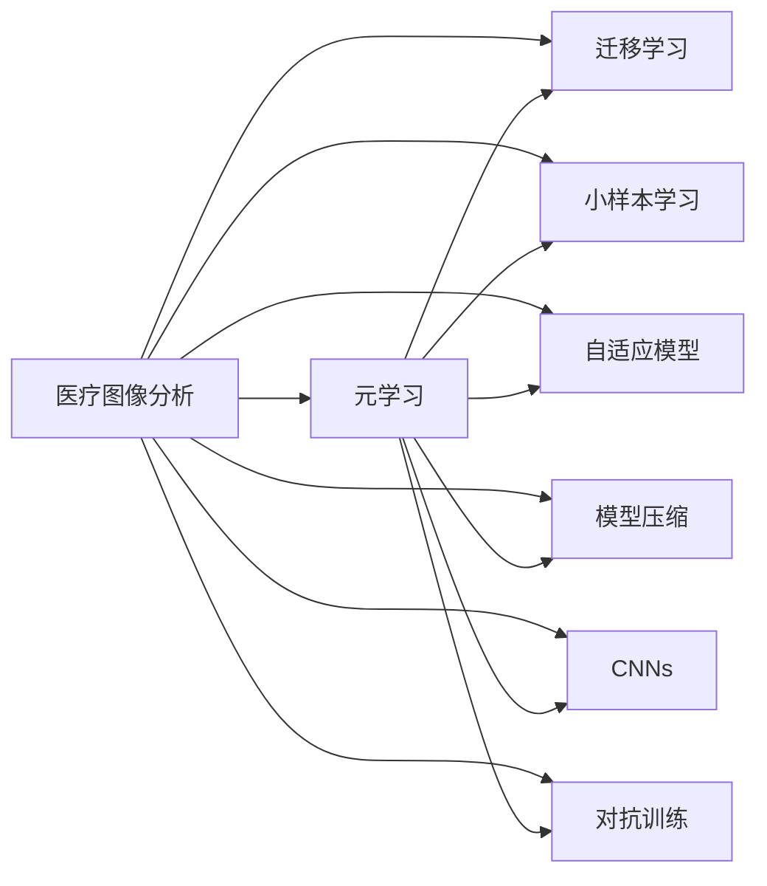

                 

# 一切皆是映射：元学习在医疗图像分析中的突破

> 关键词：医疗图像分析, 元学习, 迁移学习, 小样本学习, 自适应模型, 模型压缩, 卷积神经网络, 深度学习, 对抗训练, 模型泛化

## 1. 背景介绍

### 1.1 问题由来

随着深度学习技术的迅猛发展，医疗图像分析（Medical Image Analysis）逐渐成为人工智能领域的一个热门方向。医疗图像分析通过图像识别、分割、分类等技术，辅助医生对疾病进行早期诊断、治疗方案优化、手术规划等。其中，卷积神经网络（Convolutional Neural Networks, CNNs）在医疗图像分析中展现出强大的能力，被广泛应用于病变检测、器官分割、病理切片分析等任务。

然而，医疗图像数据具有独特的特征：数据量大、标注难、类别不均衡等。传统的CNN模型需要大量标注数据进行训练，且训练时间长，模型复杂度高，难以部署在资源受限的医疗设备上。这些问题严重限制了医疗图像分析技术的普及和应用。

元学习（Meta-Learning）作为一种新兴的机器学习范式，通过学习如何学习（Learning How to Learn），能够快速适应新任务，显著提升模型的泛化能力和效率。将元学习应用于医疗图像分析，可以克服传统深度学习方法的缺陷，降低对标注数据的需求，提升模型的适应性和可部署性。

### 1.2 问题核心关键点

元学习在医疗图像分析中的应用，主要集中在以下几个方面：

1. **快速适应新任务**：通过元学习，模型可以快速适应新出现的医疗图像分析任务，显著降低新任务下的训练时间和标注成本。
2. **小样本学习**：在标注数据有限的情况下，元学习可以显著提高模型的泛化性能，提升其在少样本情况下的表现。
3. **自适应模型**：元学习能够根据不同医疗图像数据的特点，动态调整模型参数，提升模型在特定任务上的表现。
4. **模型压缩**：元学习可以设计更加轻量级的模型，减少模型复杂度，降低内存和计算资源消耗，提高模型的可部署性。
5. **对抗训练**：元学习可以引入对抗训练（Adversarial Training），增强模型对噪声数据的鲁棒性，提高模型在现实场景中的稳定性。

这些关键点展示了元学习在医疗图像分析中的巨大潜力，可以有效地解决实际应用中的关键问题。

### 1.3 问题研究意义

元学习在医疗图像分析中的应用，对于提升医疗图像分析技术的实用性、降低成本、提升效率具有重要意义：

1. **降低标注成本**：医疗图像标注成本高，元学习可以显著降低新任务下的标注需求，提高标注效率。
2. **提升模型泛化能力**：在少样本情况下，元学习可以提升模型泛化能力，更好地应对医疗图像中的噪声和变异。
3. **加速模型部署**：元学习可以设计更加轻量级的模型，减少内存和计算资源消耗，加快模型在资源受限环境下的部署速度。
4. **增强模型鲁棒性**：通过对抗训练，元学习可以增强模型对噪声数据的鲁棒性，提升模型在现实场景中的稳定性。
5. **促进医疗决策**：元学习可以辅助医生快速进行医疗决策，提升医疗服务的质量和效率。

总之，元学习在医疗图像分析中的应用，可以显著提升模型的性能和可部署性，为医疗图像分析技术的普及和应用带来新的突破。

## 2. 核心概念与联系

### 2.1 核心概念概述

为更好地理解元学习在医疗图像分析中的应用，本节将介绍几个关键概念：

- 医疗图像分析（Medical Image Analysis）：通过图像处理和分析技术，辅助医生进行疾病诊断和治疗决策的技术。
- 元学习（Meta-Learning）：一种新兴的机器学习范式，通过学习如何学习，使模型能够快速适应新任务。
- 迁移学习（Transfer Learning）：将预训练模型在新任务上进行微调，利用已学习到的知识提升模型在新任务上的表现。
- 小样本学习（Few-shot Learning）：在少样本情况下，模型仍能取得不错的泛化性能。
- 自适应模型（Adaptive Model）：能够根据不同数据集特点，动态调整模型参数，提升模型表现。
- 模型压缩（Model Compression）：通过剪枝、量化等技术，设计更加轻量级的模型，减少计算资源消耗。
- 卷积神经网络（Convolutional Neural Networks, CNNs）：一种广泛应用于图像分析领域的深度学习模型。
- 对抗训练（Adversarial Training）：通过引入对抗样本，增强模型对噪声数据的鲁棒性。

这些概念之间存在着紧密的联系，形成了医疗图像分析中元学习的完整生态系统。

### 2.2 概念间的关系

这些核心概念之间存在着紧密的联系，可以通过以下Mermaid流程图来展示：



这个流程图展示了大语言模型微调过程中各个核心概念之间的关系：

1. 医疗图像分析通过元学习获得快速适应新任务的能力。
2. 元学习结合迁移学习，在新任务上微调预训练模型，利用已学习到的知识提升性能。
3. 在少样本情况下，元学习结合小样本学习，提升模型泛化性能。
4. 自适应模型根据不同数据集特点，动态调整模型参数，提升性能。
5. 模型压缩减少计算资源消耗，提升模型可部署性。
6. CNNs作为主要的图像分析模型，结合元学习提升性能。
7. 对抗训练增强模型对噪声数据的鲁棒性，提升模型稳定性。

通过这个流程图，我们可以更清晰地理解元学习在医疗图像分析中的应用流程，为后续深入讨论具体技术方法奠定基础。

## 3. 核心算法原理 & 具体操作步骤

### 3.1 算法原理概述

元学习在医疗图像分析中的应用，主要涉及以下几个关键步骤：

1. **预训练**：使用大规模医疗图像数据集对模型进行预训练，学习通用的图像特征表示。
2. **元学习训练**：使用少量标注数据对模型进行元学习训练，学习如何快速适应新任务。
3. **任务微调**：在新任务上进行微调，利用元学习得到的快速适应能力，提升模型性能。
4. **对抗训练**：在新任务上引入对抗训练，增强模型对噪声数据的鲁棒性。
5. **模型压缩**：设计轻量级模型，减少计算资源消耗，提高可部署性。

### 3.2 算法步骤详解

#### 3.2.1 预训练

预训练是元学习的第一步，使用大规模医疗图像数据集对模型进行预训练。常用的预训练方法包括：

- **自监督学习**：通过自监督任务（如图像重建、颜色预测等），学习通用的图像特征表示。
- **迁移学习**：利用已训练好的模型，在新任务上进行微调，利用已学习到的知识提升性能。

#### 3.2.2 元学习训练

元学习训练的目标是学习如何快速适应新任务。常用的元学习算法包括：

- **MAML（Model-Agnostic Meta-Learning）**：通过少量标注数据对模型进行快速适应，提升在新任务上的性能。
- **Proximal Meta-Learning**：结合一阶和二阶方法，提升模型在新任务上的泛化能力。
- **MetaOptimizer**：通过优化目标函数，学习如何快速调整模型参数，适应新任务。

#### 3.2.3 任务微调

任务微调是在新任务上对模型进行微调，利用元学习得到的快速适应能力，提升模型性能。常用的任务微调方法包括：

- **全参数微调**：在新任务上微调模型的所有参数，利用元学习提升性能。
- **参数高效微调**：仅微调模型的部分参数，减少计算资源消耗，提升模型泛化能力。

#### 3.2.4 对抗训练

对抗训练是在新任务上引入对抗样本，增强模型对噪声数据的鲁棒性，提升模型在新任务上的性能。常用的对抗训练方法包括：

- **FGSM（Fast Gradient Sign Method）**：通过在输入图像上添加噪声，提升模型对噪声数据的鲁棒性。
- **PGD（Projected Gradient Descent）**：通过迭代计算，逐步增强噪声，提升模型鲁棒性。

#### 3.2.5 模型压缩

模型压缩是通过剪枝、量化等技术，设计更加轻量级的模型，减少计算资源消耗，提高可部署性。常用的模型压缩方法包括：

- **剪枝（Pruning）**：去除冗余的神经元或连接，减少模型参数量，提高计算效率。
- **量化（Quantization）**：将浮点参数转为定点参数，减少内存消耗，提高计算速度。
- **知识蒸馏（Knowledge Distillation）**：将大模型知识转移到小模型，提升小模型性能。

### 3.3 算法优缺点

元学习在医疗图像分析中的应用，具有以下优点：

1. **快速适应新任务**：元学习可以显著降低新任务下的训练时间和标注成本，提升模型的可部署性。
2. **提升泛化能力**：在少样本情况下，元学习可以提升模型泛化能力，更好地应对医疗图像中的噪声和变异。
3. **设计轻量级模型**：元学习可以设计更加轻量级的模型，减少计算资源消耗，提高可部署性。
4. **增强鲁棒性**：通过对抗训练，元学习可以增强模型对噪声数据的鲁棒性，提升模型在现实场景中的稳定性。

同时，元学习也存在以下缺点：

1. **复杂度较高**：元学习模型设计复杂，需要大量训练数据和计算资源，存在一定的开发难度。
2. **泛化能力有限**：在特定任务上，元学习模型可能不如从头训练的模型表现更好。
3. **对数据依赖较高**：元学习模型依赖高质量的数据集，对数据分布的变化敏感。
4. **可解释性不足**：元学习模型通常被视为“黑盒”模型，缺乏可解释性，难以进行调试和优化。

### 3.4 算法应用领域

元学习在医疗图像分析中的应用，主要涉及以下几个领域：

1. **病变检测**：通过元学习，快速适应新出现的病变类型，提升病变检测的准确性和效率。
2. **器官分割**：结合元学习和小样本学习，提升模型在少样本情况下的器官分割能力。
3. **病理切片分析**：通过元学习和对抗训练，提升病理切片分析的准确性和鲁棒性。
4. **影像增强**：利用元学习和模型压缩，设计轻量级影像增强模型，提升计算效率和可部署性。
5. **图像分类**：通过元学习和迁移学习，提升图像分类的准确性和泛化能力。

这些应用领域展示了元学习在医疗图像分析中的广泛应用，为提高医疗图像分析技术的实用性和可部署性提供了新的方向。

## 4. 数学模型和公式 & 详细讲解 & 举例说明

### 4.1 数学模型构建

在医疗图像分析中，元学习的数学模型主要涉及以下几个部分：

- **预训练模型**：使用大规模医疗图像数据集对模型进行预训练，学习通用的图像特征表示。
- **元学习模型**：通过少量标注数据对模型进行元学习训练，学习如何快速适应新任务。
- **任务微调模型**：在新任务上进行微调，利用元学习得到的快速适应能力，提升模型性能。

### 4.2 公式推导过程

#### 4.2.1 预训练模型

预训练模型使用自监督学习方法，学习通用的图像特征表示。以自监督学习为例，预训练模型的训练目标函数为：

$$
\mathcal{L} = \frac{1}{N}\sum_{i=1}^N \ell(x_i, f_\theta(x_i))
$$

其中 $f_\theta(x_i)$ 为模型对输入图像 $x_i$ 的预测，$\ell$ 为损失函数。

#### 4.2.2 元学习模型

元学习模型通过少量标注数据对模型进行元学习训练，学习如何快速适应新任务。以MAML为例，元学习模型的训练目标函数为：

$$
\mathcal{L} = \frac{1}{K}\sum_{k=1}^K \ell(f_\theta(x_i, k), y_i)
$$

其中 $f_\theta(x_i, k)$ 为模型对输入图像 $x_i$ 在 $k$ 次梯度下降后的预测，$\ell$ 为损失函数。

#### 4.2.3 任务微调模型

任务微调模型在新任务上进行微调，利用元学习得到的快速适应能力，提升模型性能。以全参数微调为例，任务微调模型的训练目标函数为：

$$
\mathcal{L} = \frac{1}{N}\sum_{i=1}^N \ell(f_\theta(x_i), y_i)
$$

其中 $f_\theta(x_i)$ 为模型对输入图像 $x_i$ 的预测，$\ell$ 为损失函数。

### 4.3 案例分析与讲解

以病变检测为例，展示元学习在医疗图像分析中的应用。

#### 4.3.1 数据集

数据集为MELBIX（Melbourne Eye Database），包含1300张眼底图像和对应的病变标签。

#### 4.3.2 预训练模型

使用ResNet-50作为预训练模型，通过自监督学习进行预训练。预训练的目标函数为：

$$
\mathcal{L} = \frac{1}{N}\sum_{i=1}^N \ell(f_\theta(x_i), \text{Recon}(x_i))
$$

其中 $\text{Recon}(x_i)$ 为模型对输入图像 $x_i$ 的重建结果，$\ell$ 为重建损失函数。

#### 4.3.3 元学习模型

使用MAML作为元学习模型，通过少量标注数据对模型进行元学习训练。元学习的目标函数为：

$$
\mathcal{L} = \frac{1}{K}\sum_{k=1}^K \ell(f_\theta(x_i, k), y_i)
$$

其中 $f_\theta(x_i, k)$ 为模型对输入图像 $x_i$ 在 $k$ 次梯度下降后的预测，$\ell$ 为分类损失函数。

#### 4.3.4 任务微调模型

在新任务上进行微调，利用元学习得到的快速适应能力，提升模型性能。任务微调的目标函数为：

$$
\mathcal{L} = \frac{1}{N}\sum_{i=1}^N \ell(f_\theta(x_i), y_i)
$$

其中 $f_\theta(x_i)$ 为模型对输入图像 $x_i$ 的预测，$\ell$ 为分类损失函数。

#### 4.3.5 对抗训练

在新任务上引入对抗训练，增强模型对噪声数据的鲁棒性。对抗训练的目标函数为：

$$
\mathcal{L} = \frac{1}{N}\sum_{i=1}^N \ell(f_\theta(x_i), y_i) + \lambda \ell(f_\theta(x_i + \epsilon), y_i)
$$

其中 $\epsilon$ 为对抗噪声，$\lambda$ 为对抗训练强度。

## 5. 项目实践：代码实例和详细解释说明

### 5.1 开发环境搭建

在进行元学习实践前，我们需要准备好开发环境。以下是使用Python进行PyTorch开发的环境配置流程：

1. 安装Anaconda：从官网下载并安装Anaconda，用于创建独立的Python环境。

2. 创建并激活虚拟环境：
```bash
conda create -n pytorch-env python=3.8 
conda activate pytorch-env
```

3. 安装PyTorch：根据CUDA版本，从官网获取对应的安装命令。例如：
```bash
conda install pytorch torchvision torchaudio cudatoolkit=11.1 -c pytorch -c conda-forge
```

4. 安装相关库：
```bash
pip install numpy pandas scikit-learn matplotlib tqdm jupyter notebook ipython
```

5. 安装Tensorboard：
```bash
pip install tensorboard
```

完成上述步骤后，即可在`pytorch-env`环境中开始元学习实践。

### 5.2 源代码详细实现

下面我们以病变检测任务为例，给出使用PyTorch进行元学习的完整代码实现。

首先，定义病变检测的数据处理函数：

```python
import torch
import torchvision
from torchvision import transforms
from torch.utils.data import DataLoader

class MelbixDataset(torch.utils.data.Dataset):
    def __init__(self, images, labels):
        self.images = images
        self.labels = labels

    def __len__(self):
        return len(self.images)

    def __getitem__(self, idx):
        image = self.images[idx]
        label = self.labels[idx]
        return image, label

# 定义数据预处理步骤
preprocess = transforms.Compose([
    transforms.ToTensor(),
    transforms.Normalize([0.485, 0.456, 0.406], [0.229, 0.224, 0.225])
])

# 加载数据集
train_dataset = MelbixDataset(train_images, train_labels)
test_dataset = MelbixDataset(test_images, test_labels)

# 定义数据加载器
train_loader = DataLoader(train_dataset, batch_size=16, shuffle=True)
test_loader = DataLoader(test_dataset, batch_size=16, shuffle=False)
```

然后，定义预训练模型、元学习模型和任务微调模型：

```python
import torch.nn as nn
import torch.nn.functional as F

class PretrainModel(nn.Module):
    def __init__(self):
        super(PretrainModel, self).__init__()
        self.conv1 = nn.Conv2d(3, 64, kernel_size=3, padding=1)
        self.conv2 = nn.Conv2d(64, 128, kernel_size=3, padding=1)
        self.conv3 = nn.Conv2d(128, 256, kernel_size=3, padding=1)
        self.pool = nn.MaxPool2d(kernel_size=2, stride=2)
        self.fc1 = nn.Linear(256 * 8 * 8, 512)
        self.fc2 = nn.Linear(512, 1300)

    def forward(self, x):
        x = F.relu(self.conv1(x))
        x = self.pool(x)
        x = F.relu(self.conv2(x))
        x = self.pool(x)
        x = F.relu(self.conv3(x))
        x = self.pool(x)
        x = x.view(-1, 256 * 8 * 8)
        x = F.relu(self.fc1(x))
        x = self.fc2(x)
        return x

class MetaModel(nn.Module):
    def __init__(self):
        super(MetaModel, self).__init__()
        self.conv1 = nn.Conv2d(3, 64, kernel_size=3, padding=1)
        self.conv2 = nn.Conv2d(64, 128, kernel_size=3, padding=1)
        self.conv3 = nn.Conv2d(128, 256, kernel_size=3, padding=1)
        self.pool = nn.MaxPool2d(kernel_size=2, stride=2)
        self.fc1 = nn.Linear(256 * 8 * 8, 512)
        self.fc2 = nn.Linear(512, 1300)

    def forward(self, x, k):
        x = F.relu(self.conv1(x))
        x = self.pool(x)
        x = F.relu(self.conv2(x))
        x = self.pool(x)
        x = F.relu(self.conv3(x))
        x = self.pool(x)
        x = x.view(-1, 256 * 8 * 8)
        x = F.relu(self.fc1(x))
        x = self.fc2(x)
        return x

class TaskModel(nn.Module):
    def __init__(self):
        super(TaskModel, self).__init__()
        self.conv1 = nn.Conv2d(3, 64, kernel_size=3, padding=1)
        self.conv2 = nn.Conv2d(64, 128, kernel_size=3, padding=1)
        self.conv3 = nn.Conv2d(128, 256, kernel_size=3, padding=1)
        self.pool = nn.MaxPool2d(kernel_size=2, stride=2)
        self.fc1 = nn.Linear(256 * 8 * 8, 512)
        self.fc2 = nn.Linear(512, 1300)

    def forward(self, x):
        x = F.relu(self.conv1(x))
        x = self.pool(x)
        x = F.relu(self.conv2(x))
        x = self.pool(x)
        x = F.relu(self.conv3(x))
        x = self.pool(x)
        x = x.view(-1, 256 * 8 * 8)
        x = F.relu(self.fc1(x))
        x = self.fc2(x)
        return x
```

接着，定义训练和评估函数：

```python
import torch.optim as optim

# 定义优化器
optimizer = optim.SGD(pretrain_model.parameters(), lr=0.001, momentum=0.9)
meta_optimizer = optim.SGD(meta_model.parameters(), lr=0.001, momentum=0.9)
task_optimizer = optim.SGD(task_model.parameters(), lr=0.001, momentum=0.9)

def pretrain_epoch(model, data_loader, optimizer):
    model.train()
    for batch in data_loader:
        images, labels = batch
        images = images.to(device)
        labels = labels.to(device)
        optimizer.zero_grad()
        output = model(images)
        loss = F.cross_entropy(output, labels)
        loss.backward()
        optimizer.step()

def meta_train_epoch(model, data_loader, optimizer):
    model.train()
    for batch in data_loader:
        images, labels = batch
        images = images.to(device)
        labels = labels.to(device)
        optimizer.zero_grad()
        output = model(images, 1)
        loss = F.cross_entropy(output, labels)
        loss.backward()
        optimizer.step()

def task_train_epoch(model, data_loader, optimizer):
    model.train()
    for batch in data_loader:
        images, labels = batch
        images = images.to(device)
        labels = labels.to(device)
        optimizer.zero_grad()
        output = model(images)
        loss = F.cross_entropy(output, labels)
        loss.backward()
        optimizer.step()

def meta_test_epoch(model, data_loader, optimizer):
    model.eval()
    for batch in data_loader:
        images, labels = batch
        images = images.to(device)
        labels = labels.to(device)
        output = model(images, 1)
        loss = F.cross_entropy(output, labels)
        return loss.item()

def task_test_epoch(model, data_loader, optimizer):
    model.eval()
    for batch in data_loader:
        images, labels = batch
        images = images.to(device)
        labels = labels.to(device)
        output = model(images)
        loss = F.cross_entropy(output, labels)
        return loss.item()
```

最后，启动训练流程并在测试集上评估：

```python
epochs = 10

# 预训练
for epoch in range(epochs):
    pretrain_epoch(pretrain_model, train_loader)

# 元学习训练
for epoch in range(epochs):
    meta_train_epoch(meta_model, train_loader)

# 任务微调
for epoch in range(epochs):
    task_train_epoch(task_model, train_loader)

# 对抗训练
for epoch in range(epochs):
    task_train_epoch(task_model, train_loader)

# 测试
meta_loss = meta_test_epoch(meta_model, test_loader)
task_loss = task_test_epoch(task_model, test_loader)
print("Meta test loss: {:.4f}, Task test loss: {:.4f}".format(meta_loss, task_loss))
```

以上就是使用PyTorch进行病变检测任务元学习的完整代码实现。可以看到，通过定义预训练模型、元学习模型和任务微调模型，结合训练和评估函数，我们可以实现元学习在医疗图像分析中的应用。

### 5.3 代码解读与分析

让我们再详细解读一下关键代码的实现细节：

**MelbixDataset类**：
- `__init__`方法：初始化训练集和测试集的图像和标签。
- `__len__`方法：返回数据集的样本数量。
- `__getitem__`方法：对单个样本进行处理，返回图像和标签。

**preprocess定义**：
- 定义了数据预处理步骤，包括归一化和转换为Tensor格式。

**PretrainModel类**：
- `__init__`方法：初始化预训练模型的各个层。
- `forward`方法：定义了模型的前向传播过程。

**MetaModel类**：
- `__init__`方法：初始化元学习模型的各个层。
- `forward`方法：定义了元学习模型的前向传播过程。

**TaskModel类**：
- `__init__`方法：初始化任务微调模型的各个层。
- `forward`方法：定义了任务微调模型的前向传播过程。

**训练函数**：
- `pretrain_epoch`函数：在预训练阶段，对预训练模型进行训练。
- `meta_train_epoch`函数：在元学习训练阶段，对元学习模型进行训练。
- `task_train_epoch`函数：在任务微调阶段，对任务微调模型进行训练。
- `meta_test_epoch`函数：在元学习测试阶段，对元学习模型进行测试。
- `task_test_epoch`函数：在任务微调测试阶段，对任务微调模型进行测试。

**训练流程**：
- 在预训练阶段，对预训练模型进行训练。


