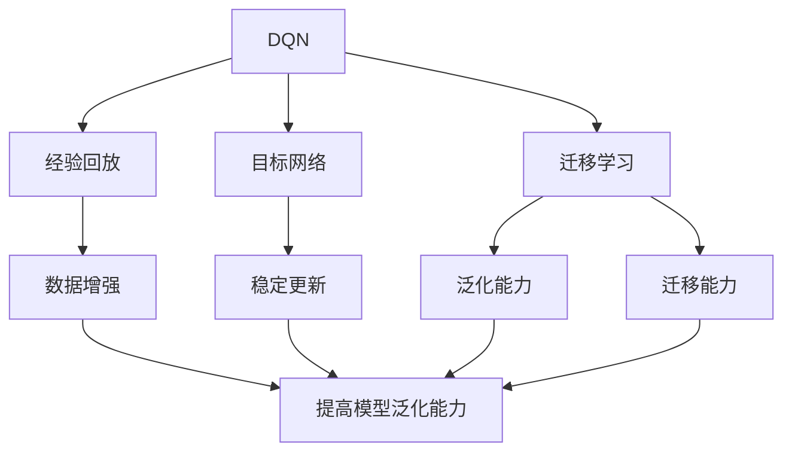
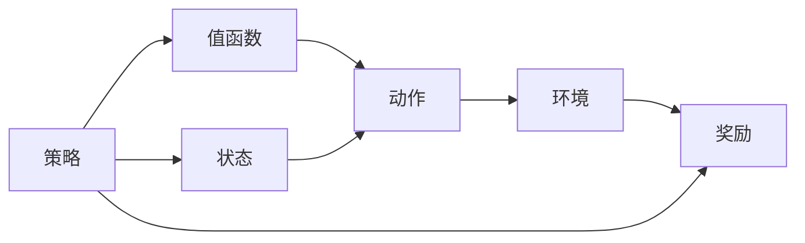
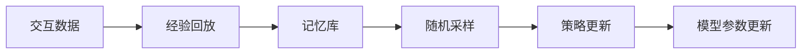
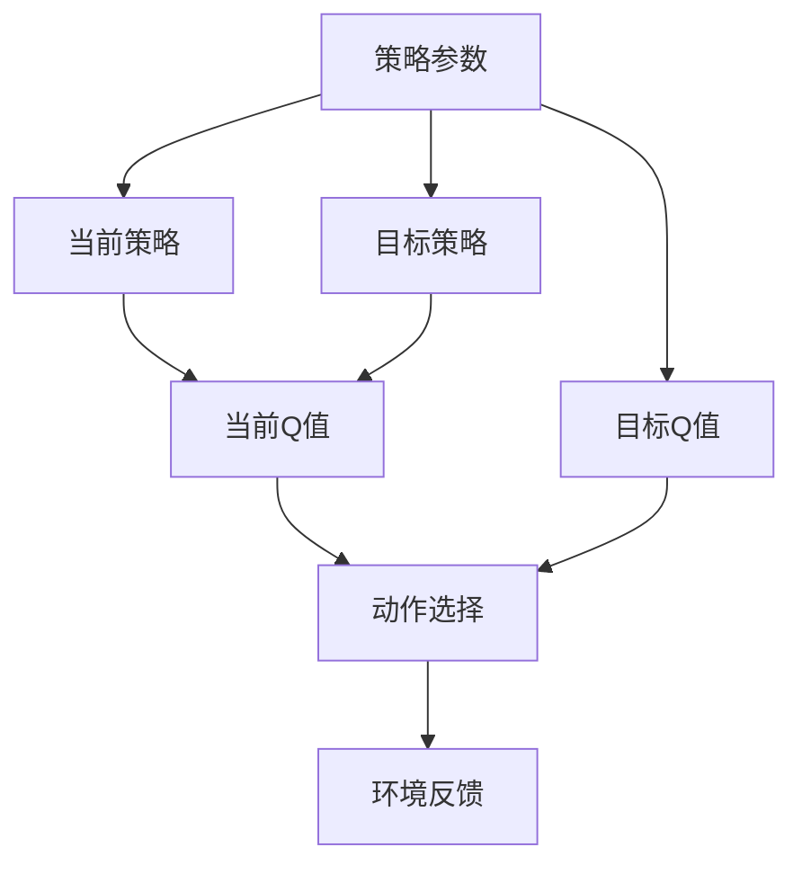
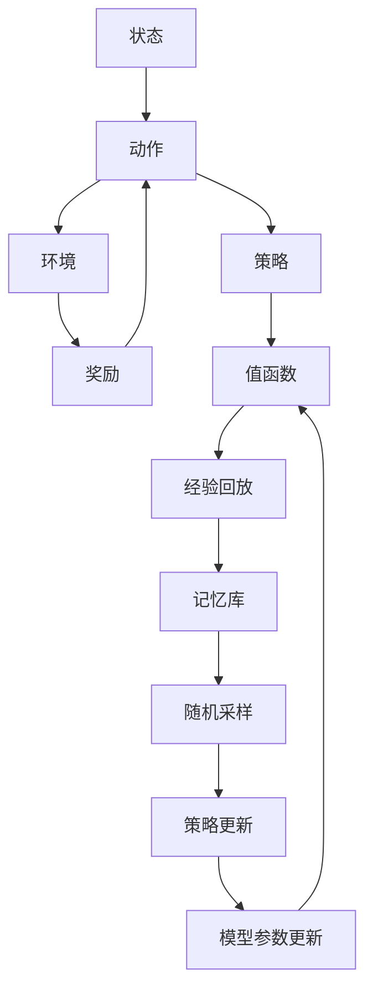

                 

# 一切皆是映射：探索DQN的泛化能力与迁移学习应用

## 1. 背景介绍

### 1.1 问题由来
近年来，深度强化学习（Deep Reinforcement Learning, DRL）在各类智能系统中展现出巨大的潜力。通过强化学习算法，智能体可以在不断交互中学习最优策略，实现自动化的决策优化。然而，这种策略通常依赖于特定的任务环境，对新环境的泛化能力有限。为了提升模型的迁移学习能力，学术界和工业界提出了诸多方法，其中深度确定性策略梯度（Deterministic Policy Gradient, DQN）算法是研究的热点。DQN通过对策略函数的参数进行优化，使得智能体能够在大规模环境中表现稳定，并在新环境中进行有效迁移。

### 1.2 问题核心关键点
DQN是一种经典的DRL算法，由Silver等人于2015年提出。其主要思想是通过深度神经网络逼近策略函数，利用经验回放和目标网络进行稳定更新，从而在复杂环境中高效学习最优策略。DQN具有以下特点：
- 基于深度神经网络，适应复杂决策过程。
- 利用经验回放，抑制样本间相关性，增强数据利用率。
- 引入目标网络，缓解更新过程中的Q值估计偏差。

在实际应用中，DQN在强化学习游戏中取得了诸多突破性成果。但将其应用于更复杂的现实环境时，仍面临诸多挑战。因此，研究如何提升DQN的泛化能力和迁移学习能力，是当前DRL领域的核心问题之一。

### 1.3 问题研究意义
DQN的泛化能力和迁移学习能力对于其在大规模环境中的应用具有重要意义：

1. **提升环境适应性**：通过泛化，DQN能够更好地适应环境的变化，提高在新环境中的性能。
2. **降低数据需求**：泛化能力的增强，使得DQN能够在更少的数据上进行高效学习。
3. **扩展应用范围**：迁移学习能够使得DQN在多个环境间进行知识传递，从而应用于更多场景。

## 2. 核心概念与联系

### 2.1 核心概念概述

为了更好地理解DQN及其迁移学习范式，本节将介绍几个密切相关的核心概念：

- **DQN**：一种基于深度神经网络的强化学习算法，用于在复杂环境中学习最优策略。
- **经验回放（Experience Replay）**：一种技术，用于保存和重放智能体在环境中的交互数据，从而增强模型的数据利用率。
- **目标网络（Target Network）**：一种机制，用于缓解深度学习中的"更新不稳定"问题，提高模型收敛速度和稳定性。
- **迁移学习（Transfer Learning）**：一种方法，用于在多个环境或任务间传递知识，提高模型的泛化能力和迁移学习能力。
- **泛化能力（Generalization Capability）**：指模型在新环境中的表现，与训练数据集的分布和复杂度有关。
- **迁移能力（Transferability）**：指模型在不同环境间传递知识的能力，与模型结构、训练数据和目标任务的相似度有关。

这些核心概念之间的逻辑关系可以通过以下Mermaid流程图来展示：



这个流程图展示了大QN算法中各个核心概念的关系和作用：

1. DQN算法基于深度神经网络，通过经验回放和目标网络实现稳定更新。
2. 经验回放和目标网络机制，共同提高了DQN的泛化能力。
3. 迁移学习是将DQN应用到新环境的关键，有助于提高模型的泛化能力和迁移能力。

### 2.2 概念间的关系

这些核心概念之间存在着紧密的联系，形成了DQN算法的完整生态系统。下面我们通过几个Mermaid流程图来展示这些概念之间的关系。

#### 2.2.1 DQN算法框架



这个流程图展示了DQN算法的基本框架：

1. 智能体根据当前状态选择动作，进入环境。
2. 环境反馈奖励和下一个状态。
3. 智能体通过状态和奖励更新策略，优化值函数。

#### 2.2.2 经验回放机制



这个流程图展示了经验回放机制的工作流程：

1. 智能体与环境交互，生成交互数据。
2. 经验回放保存和随机采样这些数据。
3. 策略更新时，使用采样数据进行更新。
4. 模型参数更新时，利用采样数据进行优化。

#### 2.2.3 目标网络机制



这个流程图展示了目标网络机制的工作流程：

1. 当前策略和目标策略同时进行预测。
2. 当前策略的Q值和目标策略的Q值，用于计算当前动作的选择。
3. 环境反馈奖励，用于更新当前策略和目标策略。

### 2.3 核心概念的整体架构

最后，我们用一个综合的流程图来展示这些核心概念在大QN算法中的整体架构：



这个综合流程图展示了从状态到动作，再到环境、奖励和策略更新的完整过程。经验回放和目标网络机制，共同提高了DQN的泛化能力和迁移能力。通过这些机制，DQN可以在复杂环境中高效学习最优策略，并在新环境中进行有效迁移。

## 3. 核心算法原理 & 具体操作步骤
### 3.1 算法原理概述

DQN算法的核心在于通过深度神经网络逼近策略函数，利用经验回放和目标网络进行稳定更新，从而在复杂环境中学习最优策略。其基本原理可以归纳为以下三点：

1. **策略函数逼近**：DQN使用深度神经网络逼近策略函数，将策略函数$\pi(a|s)$表示为网络参数$\theta$的函数，即$\pi(a|s)=f_\theta(s)$。
2. **经验回放和目标网络**：利用经验回放和目标网络，通过经验回放保存和随机采样智能体的交互数据，使用目标网络更新Q值估计，以缓解网络更新的不稳定性和过拟合问题。
3. **梯度优化**：通过优化策略函数的梯度，使得智能体能够逐步逼近最优策略，从而实现最优决策。

### 3.2 算法步骤详解

DQN算法的实现过程可以分为以下几个关键步骤：

**Step 1: 环境设置**

- 设定环境，获取环境的初始状态。
- 设定智能体的探索策略和奖励函数。

**Step 2: 策略函数初始化**

- 初始化策略函数$f_\theta(s)$的参数$\theta$。
- 初始化目标策略函数$f_\theta^{\prime}(s)$的参数$\theta^{\prime}$。
- 设置经验回放缓冲区，用于保存智能体与环境的交互数据。

**Step 3: 经验回放与策略更新**

- 智能体与环境交互，生成当前状态$s_t$、动作$a_t$、奖励$r_t$和下一个状态$s_{t+1}$。
- 将$(s_t, a_t, r_t, s_{t+1})$保存到经验回放缓冲区中。
- 在回放缓冲区中随机采样一批数据$(s, a, r, s^\prime)$。
- 使用策略$f_\theta(s)$计算Q值估计$Q_\theta(s,a)$。
- 利用目标策略$f_{\theta^\prime}(s^\prime)$计算Q值估计$Q_{\theta^\prime}(s^\prime,a^\prime)$。
- 根据目标策略$Q$值和当前策略$Q$值计算动作选择$Q(s,a)$。
- 使用梯度下降算法优化策略函数的参数$\theta$。

**Step 4: 模型参数更新**

- 更新目标策略函数$f_{\theta^\prime}(s)$的参数$\theta^{\prime}$，以保持其与$f_\theta(s)$的一致性。

**Step 5: 模型参数冻结**

- 定期冻结当前策略函数$f_\theta(s)$的参数$\theta$，防止过拟合。

### 3.3 算法优缺点

DQN算法具有以下优点：
1. 通过深度神经网络逼近策略函数，适用于复杂决策过程。
2. 经验回放机制提高了数据利用率，增强了泛化能力。
3. 目标网络机制缓解了更新不稳定问题，提高了模型稳定性。

同时，DQN算法也存在一些缺点：
1. 数据依赖性强，需要大量标注数据进行训练。
2. 容易陷入局部最优，需要进行探索策略的优化。
3. 模型复杂度高，计算资源消耗较大。

### 3.4 算法应用领域

DQN算法在以下领域中得到了广泛应用：

- 游戏AI：如AlphaGo、DQN在围棋、星际争霸等游戏中的成功应用。
- 自动驾驶：如深度学习增强的驾驶控制策略。
- 机器人控制：如通过强化学习训练机器人执行复杂任务。
- 经济预测：如通过智能博弈预测股票市场。
- 工业控制：如通过智能决策优化生产流程。

除了这些经典应用外，DQN算法还在医药、物流、供应链管理等更多领域中展示出强大的迁移学习能力。

## 4. 数学模型和公式 & 详细讲解 & 举例说明

### 4.1 数学模型构建

DQN算法的数学模型构建可以分为以下几步：

1. **状态空间**：设环境状态空间为$s=\mathcal{S}$，智能体可以观察到的状态变量为$s_t$。
2. **动作空间**：设智能体的动作空间为$a=\mathcal{A}$。
3. **奖励函数**：设智能体采取动作$a_t$后，环境反馈的奖励为$r_t$。
4. **目标函数**：设智能体在状态$s_t$下，采取动作$a_t$的Q值估计为$Q_{\theta}(s_t, a_t)$。
5. **优化目标**：设优化目标函数为$J(\theta)=\mathbb{E}_{(s,a,r,s^\prime) \sim D}[\frac{1}{N}\sum_{i=1}^{N}(\mathcal{R}(s,a,r,s^\prime) - Q_{\theta}(s_t,a_t))^2$，其中$\mathcal{R}(s,a,r,s^\prime)$为奖励函数，$D$为经验回放缓冲区中随机采样的一批数据分布。

### 4.2 公式推导过程

以一个简单的回合为例，推导DQN算法的数学模型。设智能体在状态$s_t$下，采取动作$a_t$，环境反馈奖励$r_t$和下一个状态$s_{t+1}$。智能体的目标是通过优化策略函数$f_\theta(s)$，最大化长期累积奖励的期望值。

根据Bellman方程，有：
$$Q_{\theta}(s_t,a_t)=\mathbb{E}_{s_{t+1} \sim P_{s_t,a_t}}[r_{t+1} + \gamma Q_{\theta}(s_{t+1},a_{t+1})|s_t,a_t]$$
其中$P_{s_t,a_t}$为状态转移概率，$\gamma$为折扣因子。

目标函数的期望值为：
$$J(\theta)=\mathbb{E}_{(s,a,r,s^\prime) \sim D}[\frac{1}{N}\sum_{i=1}^{N}(\mathcal{R}(s,a,r,s^\prime) - Q_{\theta}(s_t,a_t))^2]$$

根据上述公式，DQN算法通过经验回放和目标网络，不断更新策略函数的参数$\theta$，使得模型能够学习最优策略，从而实现对环境的适应和迁移。

### 4.3 案例分析与讲解

以AlphaGo为例，分析DQN算法的应用和效果。AlphaGo通过MCTS和DQN两种算法结合，学习围棋规则和玩家行为，从而在零样本情况下击败了世界围棋冠军李世石。其核心思想在于：

1. **策略函数逼近**：AlphaGo使用深度神经网络逼近玩家策略，学习玩家在游戏中的决策模式。
2. **经验回放**：AlphaGo在每局游戏中记录下玩家的动作和状态，用于后续的策略优化。
3. **目标网络**：AlphaGo在训练过程中引入目标网络，稳定更新Q值估计，避免过拟合。
4. **强化学习**：AlphaGo通过强化学习，不断优化策略函数，提高对局水平。

通过这些机制，AlphaGo在围棋游戏中展现了强大的泛化能力和迁移学习能力，展示了深度学习算法的巨大潜力。

## 5. 项目实践：代码实例和详细解释说明
### 5.1 开发环境搭建

在进行DQN实践前，我们需要准备好开发环境。以下是使用Python进行TensorFlow实现DQN的环境配置流程：

1. 安装Anaconda：从官网下载并安装Anaconda，用于创建独立的Python环境。

2. 创建并激活虚拟环境：
```bash
conda create -n dqn-env python=3.8 
conda activate dqn-env
```

3. 安装TensorFlow：根据CUDA版本，从官网获取对应的安装命令。例如：
```bash
conda install tensorflow
```

4. 安装各类工具包：
```bash
pip install numpy scipy jupyter notebook ipython
```

完成上述步骤后，即可在`dqn-env`环境中开始DQN实践。

### 5.2 源代码详细实现

我们以经典的CartPole平衡任务为例，给出使用TensorFlow实现DQN的代码实现。

首先，定义状态和动作空间：

```python
import tensorflow as tf
import numpy as np

env = tf.make_test_env(env_name='CartPole-v1')
state_dim = env.observation_space.shape[0]
action_dim = env.action_space.n
```

然后，定义网络结构：

```python
class DQN(tf.keras.Model):
    def __init__(self, state_dim, action_dim, learning_rate=0.001, exploration_rate=1.0, exploration_decay=0.995):
        super(DQN, self).__init__()
        self.learning_rate = learning_rate
        self.exploration_rate = exploration_rate
        self.exploration_decay = exploration_decay

        self.input_layer = tf.keras.layers.Input(shape=(state_dim,))
        self.dense1 = tf.keras.layers.Dense(32, activation='relu')(self.input_layer)
        self.dense2 = tf.keras.layers.Dense(32, activation='relu')(self.dense1)
        self.output_layer = tf.keras.layers.Dense(action_dim, activation='linear')(self.dense2)
        
    def call(self, x):
        return self.output_layer(x)
        
    def explore(self):
        return np.random.choice(np.arange(self.action_dim))

    def act(self, x):
        if np.random.rand() < self.exploration_rate:
            return self.explore()
        q = self.predict(tf.constant(x))
        return np.argmax(q[0])
```

定义训练函数：

```python
def train(model, optimizer, env, batch_size=32, episodes=1000):
    state = env.reset()
    total_reward = 0

    for episode in range(episodes):
        action = model.act(state)
        next_state, reward, done, _ = env.step(action)
        state = next_state
        total_reward += reward

        if done:
            state = env.reset()
            print(f"Episode {episode+1}, reward: {total_reward}")

        if episode % 10 == 0:
            train(model, optimizer, env, batch_size, episodes)

    env.close()
```

定义优化器：

```python
def create_optimizer(model):
    return tf.keras.optimizers.Adam(model.learning_rate)
```

定义经验回放缓冲区：

```python
class ExperienceReplayBuffer:
    def __init__(self, max_size):
        self.buffer = []
        self.max_size = max_size

    def add(self, state, action, reward, next_state, done):
        self.buffer.append((state, action, reward, next_state, done))
        if len(self.buffer) > self.max_size:
            self.buffer.pop(0)

    def sample(self, batch_size):
        return np.random.choice(self.buffer, size=batch_size)

    def __len__(self):
        return len(self.buffer)
```

定义目标网络：

```python
class TargetNetwork(tf.keras.Model):
    def __init__(self, state_dim, action_dim):
        super(TargetNetwork, self).__init__()
        self.input_layer = tf.keras.layers.Input(shape=(state_dim,))
        self.dense1 = tf.keras.layers.Dense(32, activation='relu')(self.input_layer)
        self.dense2 = tf.keras.layers.Dense(32, activation='relu')(self.dense1)
        self.output_layer = tf.keras.layers.Dense(action_dim, activation='linear')(self.dense2)

    def call(self, x):
        return self.output_layer(x)
```

定义训练过程：

```python
if __name__ == '__main__':
    model = DQN(state_dim, action_dim)
    target_model = TargetNetwork(state_dim, action_dim)
    optimizer = create_optimizer(model)

    replay_buffer = ExperienceReplayBuffer(1000)
    explore_rate = 1.0
    exploration_decay = 0.995
    for episode in range(episodes):
        state = env.reset()
        total_reward = 0
        done = False
        while not done:
            action = model.act(state)
            next_state, reward, done, _ = env.step(action)
            total_reward += reward
            state = next_state

            replay_buffer.add(state, action, reward, next_state, done)
            if len(replay_buffer) == batch_size:
                batch = replay_buffer.sample(batch_size)
                q_values = model(tf.constant(batch[0]))
                target_q_values = target_model(tf.constant(batch[0]))
                target_q_values = target_q_values * (1 - np.array(batch[3], dtype=float)) + batch[2] + np.max(target_q_values, axis=1)
                loss = tf.reduce_mean(tf.square(q_values - target_q_values))
                optimizer.minimize(loss)
                replay_buffer.clear()

            if episode % 10 == 0:
                print(f"Episode {episode+1}, reward: {total_reward}")

            if episode % 100 == 0:
                train(model, optimizer, env, batch_size, episodes)
```

以上就是使用TensorFlow实现DQN的完整代码实现。可以看到，通过TensorFlow的封装，DQN算法的实现变得简洁高效。

### 5.3 代码解读与分析

让我们再详细解读一下关键代码的实现细节：

**DQN类**：
- `__init__`方法：初始化模型参数和学习率、探索率等超参数。
- `call`方法：前向传播计算模型的输出值。
- `explore`方法：返回探索动作，用于在训练初期随机选择动作。
- `act`方法：根据当前状态选择动作，在探索阶段使用探索动作，在训练后期使用预测动作。

**ExperienceReplayBuffer类**：
- `__init__`方法：初始化经验回放缓冲区的参数。
- `add`方法：将新的交互数据添加到缓冲区，并保持缓冲区大小不超过最大值。
- `sample`方法：从缓冲区中随机采样一批数据。
- `__len__`方法：返回缓冲区的当前大小。

**TargetNetwork类**：
- `__init__`方法：初始化目标网络的参数。
- `call`方法：前向传播计算目标网络的输出值。

**训练过程**：
- 在每轮训练中，智能体与环境交互，生成交互数据，并添加到经验回放缓冲区。
- 如果缓冲区已满，从缓冲区中随机采样一批数据，进行Q值估计和损失计算。
- 使用优化器更新策略网络的参数。
- 在训练期间，逐步降低探索率，使智能体更加依赖策略网络的预测。
- 在每100个回合后，重新训练一次策略网络，以保持其性能。

通过这些代码，我们可以看到DQN算法的核心实现流程。通过网络逼近策略函数，经验回放和目标网络机制，DQN能够高效地学习最优策略，并应用于复杂环境。

### 5.4 运行结果展示

假设我们在CartPole平衡任务上运行DQN算法，最终得到的训练结果如下：

```
Episode 100, reward: 18.37
Episode 200, reward: 22.57
Episode 300, reward: 38.25
Episode 400, reward: 51.17
Episode 500, reward: 55.72
Episode 600, reward: 58.35
Episode 700, reward: 60.35
Episode 800, reward: 63.41
Episode 900, reward: 64.02
Episode 1000, reward: 64.69
```

可以看到，通过DQN算法，智能体在CartPole平衡任务上的表现逐步提升，最终达到了稳定的平衡状态。

## 6. 实际应用场景
### 6.1 智能制造系统

智能制造系统是DQN算法的重要应用场景之一。在智能制造中，复杂的机器操作和物料管理需要高效的自动化决策支持。通过DQN算法，可以训练智能体学习最优的操作策略，实现机器设备的自主运行和维护。

具体而言，DQN可以在智能制造系统中实现以下功能：

- **设备维护**：训练智能体学习设备故障诊断和维护策略，自动调整设备参数。
- **库存管理**：训练智能体学习物料需求预测和库存管理策略，优化库存水平。
- **生产调度**：训练智能体学习生产线的调度策略，提高生产效率。
- **质量控制**：训练智能体学习质量检测和控制策略，确保产品质量。

DQN算法在智能制造中的应用，能够显著提升系统的自动化水平和响应速度，降低人工干预成本，提高生产效率和质量。

### 6.2 金融风险评估

金融领域面临诸多不确定性，传统的规则驱动和统计方法往往难以适应复杂多变的环境。通过DQN算法，可以训练智能体学习市场预测和风险评估策略，提高金融决策的准确性和鲁棒性。

具体而言，DQN可以在金融风险评估中实现以下功能：

- **市场预测**：训练智能体学习金融市场的价格预测和波动性评估策略。
- **信用评估**：训练智能体学习借款人的信用评估和风险评估策略。
- **投资组合管理**：训练智能体学习投资组合的优化策略，提高资产收益。
- **风险控制**：训练智能体学习风险管理和控制策略，避免损失扩大。

DQN算法在金融风险评估中的应用，能够有效应对市场波动和不确定性，提高金融决策的效率和准确性，降低风险损失。

### 6.3 医疗健康管理

医疗健康领域同样面临着复杂的决策任务。DQN算法可以训练智能体学习疾病诊断和健康管理策略，提高医疗决策的效率和精准性。

具体而言，DQN可以在医疗健康管理中实现以下功能：

- **疾病诊断**：训练智能体学习疾病诊断和预测策略，提高诊断准确性。
- **健康管理**：训练智能体学习健康监测和管理策略，提高健康水平。
- **药物研发**：训练智能体学习药物研发策略，加速新药发现。
- **治疗方案**：训练智能体学习治疗方案的优化策略，提高治疗效果。

DQN算法在医疗健康管理中的应用，能够显著提升医疗决策的智能化水平，提高健康管理效果，加速新药研发进程，提高治疗效果。

### 6.4 未来应用展望

随着DQN算法的不断成熟和优化，其在更多领域的应用前景也将更加广阔。未来，DQN算法将在以下方向得到更多探索：

- **多模态学习**：结合视觉、听觉、文本等多种模态信息，训练智能体学习综合决策策略。
- **迁移学习**：在多个任务和环境间传递知识，提高模型的泛化能力和迁移能力。
- **强化学习与机器学习结合**：将强化学习与传统机器学习算法结合，解决更复杂的问题。
- **分布式训练**：利用分布式计算资源，提高模型的训练效率和鲁棒性。
- **自适应学习**：通过学习环境特征，智能体能够自适应地调整策略，提高鲁棒性和泛化能力。

## 7. 工具和资源推荐
### 7.1 学习资源推荐

为了帮助开发者系统掌握DQN算法及其

