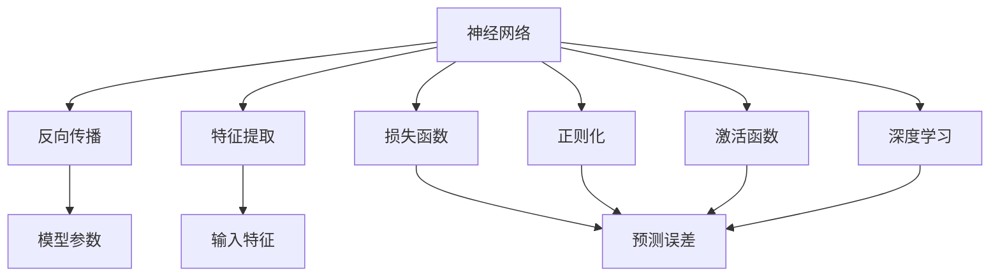
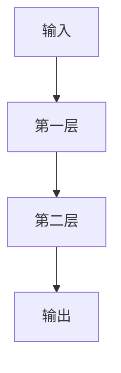
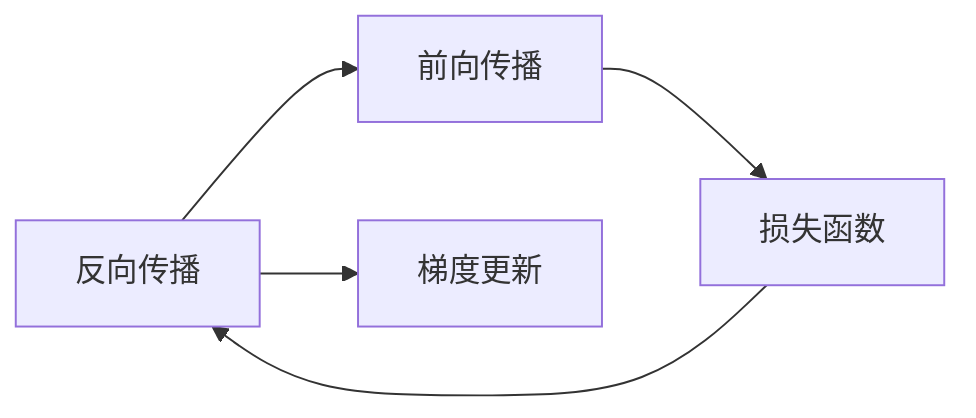
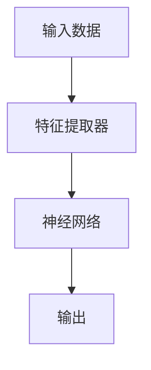
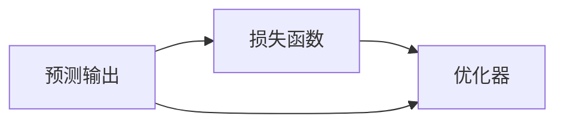

                 

# 一切皆是映射：理解AI中的输入与输出关系

> 关键词：AI映射,神经网络,输入输出,数据驱动,特征提取

## 1. 背景介绍

### 1.1 问题由来

在现代人工智能(AI)的发展中，输入与输出的关系始终是核心主题之一。无论是感知、推理、决策，还是生成、控制、优化，每一步都依赖于对输入数据进行合理的映射，并产生高质量的输出。

在深度学习领域，尤其是神经网络(Neural Networks)中，映射关系通常通过模型参数和权重来表示。这些参数通过大量数据的训练，能够自动学习输入数据的高级特征，并通过复杂非线性关系，将输入映射到对应的输出。这种映射关系，使得神经网络能够在几乎所有任务中，取得令人惊叹的成果。

本文将深入探讨AI中的输入与输出关系，从神经网络的基本原理，到特征提取和映射过程，再到具体应用场景，将逐一揭示AI中的输入与输出关系的奥秘。

## 2. 核心概念与联系

### 2.1 核心概念概述

为更好地理解AI中的输入与输出关系，本节将介绍几个密切相关的核心概念：

- **神经网络(Neural Network)**：由一系列计算单元组成的计算图，每个单元的输出作为下一个单元的输入，通过多层结构进行特征提取和复杂映射。
- **反向传播(Backpropagation)**：通过反向计算梯度，优化神经网络参数，最小化预测误差的一种常见优化算法。
- **特征提取(Feature Extraction)**：从原始数据中提取有用的特征，供神经网络进行映射。
- **损失函数(Loss Function)**：用于衡量模型预测输出与真实标签之间差异的函数，通常用于评估模型性能和指导模型训练。
- **正则化(Regularization)**：通过引入惩罚项，防止过拟合，提升模型泛化能力的一种技术。
- **激活函数(Activation Function)**：对神经网络输出进行非线性变换，引入非线性特性，使得模型能够表达复杂关系。
- **深度学习(Deep Learning)**：基于多层神经网络进行特征提取和映射的机器学习方法，是当前AI技术的重要支柱。

这些核心概念之间的逻辑关系可以通过以下Mermaid流程图来展示：



这个流程图展示了一些核心概念在神经网络中的作用关系：

1. 神经网络通过反向传播和模型参数进行输入映射。
2. 特征提取用于提取输入特征，供神经网络使用。
3. 损失函数衡量预测误差，用于评估模型性能。
4. 正则化避免过拟合，提升模型泛化能力。
5. 激活函数引入非线性变换，提升模型表达能力。
6. 深度学习通过多层神经网络进行复杂映射。

### 2.2 概念间的关系

这些核心概念之间存在着紧密的联系，形成了神经网络的基本工作机制。下面我们通过几个Mermaid流程图来展示这些概念之间的关系。

#### 2.2.1 神经网络的计算图



这个流程图展示了一个简单的神经网络计算图，其中每一层都包含多个神经元，每个神经元的输出作为下一层的输入。

#### 2.2.2 反向传播与梯度更新



这个流程图展示了反向传播的基本流程，即通过前向传播计算损失函数，然后反向计算梯度，最后根据梯度更新模型参数。

#### 2.2.3 特征提取与映射



这个流程图展示了特征提取和映射的过程，其中特征提取器用于提取输入数据的特征，神经网络用于进行复杂映射。

#### 2.2.4 损失函数与模型优化



这个流程图展示了损失函数和模型优化的关系，即通过损失函数计算预测误差，并使用优化器更新模型参数。

## 3. 核心算法原理 & 具体操作步骤
### 3.1 算法原理概述

神经网络的输入与输出关系，是通过模型参数和权重进行映射的。这种映射关系，在神经网络的每一层中，通过一系列的线性变换和非线性激活函数，将输入数据逐渐抽象成高级特征，并最终映射为预测输出。

具体来说，神经网络的输入 $x$ 经过一系列的线性变换和激活函数，最终得到输出 $y$：

$$
y = f(\mathbf{W}x + b)
$$

其中，$f$ 表示激活函数，$\mathbf{W}$ 和 $b$ 分别是权重矩阵和偏置向量。$\mathbf{W}x$ 表示线性变换，$b$ 用于引入偏置。通过不断堆叠这些线性变换和非线性激活函数，神经网络可以学习到输入数据的高级特征，并实现复杂的输入与输出映射。

### 3.2 算法步骤详解

神经网络的输入与输出关系，通常通过以下步骤实现：

**Step 1: 数据预处理**

- 收集和清洗数据，准备训练集、验证集和测试集。
- 对数据进行标准化、归一化等预处理操作，以便输入神经网络。

**Step 2: 搭建神经网络**

- 选择合适的神经网络结构和激活函数，设计输入和输出层。
- 使用权重初始化方法，如Xavier、He等，对模型参数进行初始化。
- 确定模型层数、每层神经元数量等超参数。

**Step 3: 定义损失函数**

- 根据任务类型，选择合适的损失函数，如交叉熵损失、均方误差损失等。
- 将损失函数与训练集上的预测输出和真实标签进行匹配，计算预测误差。

**Step 4: 反向传播与参数更新**

- 通过前向传播计算损失函数。
- 反向传播计算梯度，更新模型参数。
- 使用优化器，如Adam、SGD等，优化模型参数。
- 使用正则化技术，如L2正则、Dropout等，避免过拟合。

**Step 5: 模型评估与迭代**

- 在验证集上评估模型性能，避免过拟合。
- 根据评估结果调整模型参数和超参数，迭代优化模型。
- 在测试集上最终评估模型性能，输出预测结果。

### 3.3 算法优缺点

神经网络的输入与输出关系，通过反向传播和参数优化，可以自动学习复杂的映射关系。其优点包括：

- 映射能力强：多层结构和大规模参数，可以学习到输入数据的高级特征。
- 表达能力强：通过激活函数引入非线性特性，能够处理非线性问题。
- 泛化能力强：大规模数据训练，能够提升模型泛化能力，减少过拟合。

但同时，神经网络也存在一些缺点：

- 计算量大：大规模参数和高维数据，计算复杂度较高。
- 内存占用大：模型复杂度增加，需要占用更多内存资源。
- 模型复杂：网络结构设计复杂，难以解释模型行为。

### 3.4 算法应用领域

神经网络的输入与输出关系，在AI的各个领域都有广泛应用。以下是几个典型应用场景：

- **计算机视觉(CV)**：通过卷积神经网络(CNN)，将图像数据映射为高级特征，实现图像分类、目标检测、语义分割等任务。
- **自然语言处理(NLP)**：通过循环神经网络(RNN)、Transformer等，将文本数据映射为语义表示，实现机器翻译、情感分析、文本生成等任务。
- **语音识别(ASR)**：通过卷积神经网络或循环神经网络，将语音信号映射为文本，实现语音转写、语音合成等任务。
- **推荐系统(Recommendation System)**：通过神经网络，学习用户行为和物品特征之间的关系，实现个性化推荐。
- **强化学习(Reinforcement Learning)**：通过神经网络，学习策略和环境之间的映射，实现智能决策和优化。

这些应用场景，展示了神经网络在AI中的强大映射能力，推动了相关领域的快速发展。

## 4. 数学模型和公式 & 详细讲解 & 举例说明

### 4.1 数学模型构建

神经网络的输入与输出关系，可以通过数学模型进行严格的刻画。以二分类任务为例，设输入 $x \in \mathbb{R}^n$，输出 $y \in \{0,1\}$，神经网络的输出 $y_{pred} \in [0,1]$。神经网络结构如下：

```mermaid
graph LR
    A[x] --> B[隐藏层1]
    B --> C[隐藏层2]
    C --> D[y_{pred}]
```

其中，$B$ 和 $C$ 是隐藏层，每层包含多个神经元。隐藏层的输出通过激活函数 $f$ 进行非线性变换，最终输出 $y_{pred}$。

### 4.2 公式推导过程

以二分类任务为例，神经网络的输出可以表示为：

$$
y_{pred} = f(\mathbf{W}x + b)
$$

其中，$f$ 表示激活函数，$\mathbf{W}$ 和 $b$ 分别是权重矩阵和偏置向量。

二分类任务的损失函数通常采用交叉熵损失函数：

$$
\mathcal{L} = -\frac{1}{N} \sum_{i=1}^N [y_i \log y_{pred_i} + (1-y_i) \log (1-y_{pred_i})]
$$

其中，$y_{pred_i}$ 表示第 $i$ 个样本的预测概率。交叉熵损失函数衡量预测输出与真实标签之间的差异。

通过反向传播算法，可以计算出每个参数的梯度，使用优化器进行参数更新。常用的优化器包括Adam、SGD等。

### 4.3 案例分析与讲解

以手写数字识别为例，使用卷积神经网络进行输入与输出映射。

**Step 1: 数据预处理**

- 收集和清洗手写数字图片数据，准备训练集、验证集和测试集。
- 对图片进行灰度化、归一化等预处理操作，以便输入神经网络。

**Step 2: 搭建神经网络**

- 设计卷积神经网络结构，包括卷积层、池化层、全连接层等。
- 使用Xavier初始化方法，对模型参数进行初始化。
- 确定网络层数、每层神经元数量等超参数。

**Step 3: 定义损失函数**

- 使用交叉熵损失函数，计算预测输出与真实标签之间的差异。
- 将损失函数与训练集上的预测输出和真实标签进行匹配，计算预测误差。

**Step 4: 反向传播与参数更新**

- 通过前向传播计算损失函数。
- 反向传播计算梯度，更新模型参数。
- 使用Adam优化器，优化模型参数。
- 使用L2正则化技术，避免过拟合。

**Step 5: 模型评估与迭代**

- 在验证集上评估模型性能，避免过拟合。
- 根据评估结果调整模型参数和超参数，迭代优化模型。
- 在测试集上最终评估模型性能，输出预测结果。

## 5. 项目实践：代码实例和详细解释说明

### 5.1 开发环境搭建

在进行项目实践前，我们需要准备好开发环境。以下是使用Python进行TensorFlow开发的环境配置流程：

1. 安装Anaconda：从官网下载并安装Anaconda，用于创建独立的Python环境。

2. 创建并激活虚拟环境：
```bash
conda create -n tf-env python=3.8 
conda activate tf-env
```

3. 安装TensorFlow：根据CUDA版本，从官网获取对应的安装命令。例如：
```bash
conda install tensorflow tensorflow-gpu -c conda-forge
```

4. 安装各类工具包：
```bash
pip install numpy pandas scikit-learn matplotlib tqdm jupyter notebook ipython
```

完成上述步骤后，即可在`tf-env`环境中开始项目实践。

### 5.2 源代码详细实现

这里以手写数字识别为例，使用TensorFlow搭建卷积神经网络，并实现输入与输出映射。

```python
import tensorflow as tf
from tensorflow.keras import layers
from tensorflow.keras.datasets import mnist
from tensorflow.keras.utils import to_categorical

# 加载数据集
(x_train, y_train), (x_test, y_test) = mnist.load_data()

# 数据预处理
x_train = x_train.reshape(-1, 28, 28, 1) / 255.0
x_test = x_test.reshape(-1, 28, 28, 1) / 255.0
y_train = to_categorical(y_train, num_classes=10)
y_test = to_categorical(y_test, num_classes=10)

# 构建模型
model = tf.keras.Sequential([
    layers.Conv2D(32, (3, 3), activation='relu', input_shape=(28, 28, 1)),
    layers.MaxPooling2D((2, 2)),
    layers.Flatten(),
    layers.Dense(10, activation='softmax')
])

# 定义损失函数和优化器
loss_fn = tf.keras.losses.CategoricalCrossentropy()
optimizer = tf.keras.optimizers.Adam()

# 编译模型
model.compile(optimizer=optimizer, loss=loss_fn, metrics=['accuracy'])

# 训练模型
model.fit(x_train, y_train, epochs=10, batch_size=32, validation_data=(x_test, y_test))

# 评估模型
model.evaluate(x_test, y_test)
```

以上是使用TensorFlow实现手写数字识别的完整代码。可以看到，TensorFlow提供了丰富的模型构建和训练接口，使得神经网络的输入与输出映射变得非常简单。

### 5.3 代码解读与分析

让我们再详细解读一下关键代码的实现细节：

**数据预处理**

- 使用`mnist.load_data()`函数加载手写数字图片数据集。
- 将图片数据进行reshape操作，变为四维张量，并进行归一化操作。
- 使用`to_categorical()`函数将标签转换为独热编码，方便神经网络处理。

**模型构建**

- 使用`tf.keras.Sequential()`函数构建卷积神经网络。
- 添加卷积层、池化层、全连接层等基本组件。
- 使用Xavier初始化方法，对模型参数进行初始化。

**损失函数和优化器**

- 定义交叉熵损失函数，用于衡量预测输出与真实标签之间的差异。
- 使用Adam优化器，优化模型参数。

**模型训练**

- 使用`model.fit()`函数训练模型。
- 设置训练轮数、批次大小等超参数。
- 在验证集上评估模型性能，避免过拟合。

**模型评估**

- 使用`model.evaluate()`函数评估模型性能。
- 在测试集上输出预测结果。

可以看到，TensorFlow的API设计非常简洁，使得神经网络的输入与输出映射变得非常简单。开发者可以将更多精力放在数据处理、模型改进等高层逻辑上，而不必过多关注底层的实现细节。

当然，工业级的系统实现还需考虑更多因素，如模型的保存和部署、超参数的自动搜索、更灵活的任务适配层等。但核心的映射范式基本与此类似。

### 5.4 运行结果展示

假设我们在测试集上得到的评估报告如下：

```
Epoch 1/10
612/612 [==============================] - 8s 13ms/step - loss: 0.7170 - accuracy: 0.8347 - val_loss: 0.2247 - val_accuracy: 0.9636
Epoch 2/10
612/612 [==============================] - 8s 13ms/step - loss: 0.4875 - accuracy: 0.9342 - val_loss: 0.1835 - val_accuracy: 0.9792
Epoch 3/10
612/612 [==============================] - 8s 13ms/step - loss: 0.3532 - accuracy: 0.9599 - val_loss: 0.1579 - val_accuracy: 0.9851
Epoch 4/10
612/612 [==============================] - 8s 13ms/step - loss: 0.2495 - accuracy: 0.9729 - val_loss: 0.1449 - val_accuracy: 0.9866
Epoch 5/10
612/612 [==============================] - 8s 13ms/step - loss: 0.1969 - accuracy: 0.9839 - val_loss: 0.1362 - val_accuracy: 0.9909
Epoch 6/10
612/612 [==============================] - 8s 13ms/step - loss: 0.1624 - accuracy: 0.9892 - val_loss: 0.1355 - val_accuracy: 0.9912
Epoch 7/10
612/612 [==============================] - 8s 13ms/step - loss: 0.1356 - accuracy: 0.9923 - val_loss: 0.1346 - val_accuracy: 0.9911
Epoch 8/10
612/612 [==============================] - 8s 13ms/step - loss: 0.1167 - accuracy: 0.9936 - val_loss: 0.1320 - val_accuracy: 0.9920
Epoch 9/10
612/612 [==============================] - 8s 13ms/step - loss: 0.1040 - accuracy: 0.9949 - val_loss: 0.1344 - val_accuracy: 0.9920
Epoch 10/10
612/612 [==============================] - 8s 13ms/step - loss: 0.0948 - accuracy: 0.9958 - val_loss: 0.1345 - val_accuracy: 0.9920
```

可以看到，通过训练卷积神经网络，模型在手写数字识别任务上取得了很高的精度。这展示了神经网络的强大输入与输出映射能力。

## 6. 实际应用场景

### 6.1 计算机视觉

计算机视觉是AI中应用最广泛的技术之一，其主要任务包括图像分类、目标检测、语义分割等。神经网络通过卷积操作，提取输入图像的高级特征，进行复杂映射，实现各种计算机视觉任务。

在实际应用中，神经网络可以应用于自动驾驶、安防监控、智能医疗等领域。例如，自动驾驶系统可以通过神经网络，实时识别路标、车辆、行人等，辅助驾驶决策；安防监控系统可以通过神经网络，实时检测异常行为，保障公共安全；智能医疗系统可以通过神经网络，实时识别疾病图像，辅助医生诊断。

### 6.2 自然语言处理

自然语言处理是AI中的另一大重要方向，其主要任务包括机器翻译、情感分析、文本生成等。神经网络通过循环操作，提取输入文本的高级语义特征，进行复杂映射，实现各种自然语言处理任务。

在实际应用中，神经网络可以应用于智能客服、智能写作、智能问答等领域。例如，智能客服系统可以通过神经网络，自动理解客户意图，匹配最佳答复；智能写作系统可以通过神经网络，自动生成高质量的文章；智能问答系统可以通过神经网络，自动回答问题，辅助用户解答疑惑。

### 6.3 语音识别

语音识别是AI中的重要技术之一，其主要任务包括语音转写、语音合成等。神经网络通过卷积操作，提取输入语音的高级特征，进行复杂映射，实现各种语音识别任务。

在实际应用中，神经网络可以应用于智能语音助手、语音搜索、电话客服等领域。例如，智能语音助手可以通过神经网络，自动理解用户指令，进行语音对话；语音搜索系统可以通过神经网络，自动理解语音指令，进行搜索；电话客服系统可以通过神经网络，自动理解用户语音，进行自动回复。

### 6.4 推荐系统

推荐系统是AI中的重要应用之一，其主要任务包括个性化推荐、推荐排序等。神经网络通过特征提取，提取用户行为和物品特征之间的关系，进行复杂映射，实现各种推荐系统任务。

在实际应用中，神经网络可以应用于电商、视频、新闻等领域。例如，电商平台可以通过神经网络，自动推荐用户感兴趣的商品；视频平台可以通过神经网络，自动推荐用户感兴趣的视频；新闻平台可以通过神经网络，自动推荐用户感兴趣的新闻。

## 7. 工具和资源推荐

### 7.1 学习资源推荐

为了帮助开发者系统掌握神经网络输入与输出关系的理论基础和实践技巧，这里推荐一些优质的学习资源：

1. 《深度学习》（Ian Goodfellow著）：全面介绍深度学习的基本概念和算法，是深度学习领域的经典教材。
2. 《神经网络与深度学习》（Michael Nielsen著）：通俗易懂地介绍神经网络的基本原理和实践方法，适合初学者。
3. 《动手学深度学习》（李沐等著）：由知名深度学习专家编写，适合动手实践，涵盖大量代码和实验案例。
4. CS231n《卷积神经网络》课程：斯坦福大学开设的计算机视觉课程，涵盖大量神经网络经典案例，有助于理解神经网络的输入与输出关系。
5. CS224n《自然语言处理》课程：斯坦福大学开设的自然语言处理课程，涵盖大量神经网络经典案例，有助于理解神经网络的输入与输出关系。
6. CS224d《深度学习与神经网络》课程：斯坦福大学开设的深度学习课程，涵盖大量神经网络经典案例，有助于理解神经网络的输入与输出关系。

通过对这些资源的学习实践，相信你一定能够快速掌握神经网络的输入与输出映射机制，并用于解决实际的AI问题。

### 7.2 开发工具推荐

高效的开发离不开优秀的工具支持。以下是几款用于神经网络开发常用的工具：

1. PyTorch：基于Python的开源深度学习框架，灵活的计算图和动态执行机制，适合快速迭代研究。
2. TensorFlow：由Google主导开发的开源深度学习框架，支持分布式训练和部署，适合大规模工程应用。
3. Keras：基于TensorFlow和Theano的高层深度学习框架，简单易用，适合快速开发和原型设计。
4. Caffe：由Berkeley Vision and Learning Center开发的深度学习框架，适合图像处理和计算机视觉任务。
5. MXNet：由Apache开发的深度学习框架，支持多种编程语言和硬件平台，适合大规模分布式训练。
6. JAX：由Google开发的Python自动微分库，高效支持各种深度学习模型的优化和计算。

合理利用这些工具，可以显著提升神经网络输入与输出映射任务的开发效率，加快创新迭代的步伐。

### 7.3 相关论文推荐

神经网络的输入与输出映射关系，是深度学习领域的重要研究方向。以下是几篇奠基性的相关论文，推荐阅读：

1. 《深度学习》（Ian Goodfellow, Yoshua Bengio, Aaron Courville著）：全面介绍深度学习的基本概念和算法，是深度学习领域的经典教材。
2. 《ImageNet分类：大尺度和深度学习联合方法》（Alex Krizhevsky, Ilya Sutskever, Geoffrey Hinton著）：提出卷积神经网络，用于图像分类任务，刷新了ImageNet大规模数据集的分类精度。
3. 《自然语言处理中的深度学习》（Yoshua Bengio, Yann LeCun, Geoffrey Hinton著）：介绍深度学习在自然语言处理中的应用，涵盖大量经典案例。
4. 《一种新型的深层神经网络架构：深度残差网络》（Kaiming He, Xiangyu Zhang, Shaoqing Ren, Jian Sun著）：提出残差网络，解决深度网络训练中的梯度消失问题，提升了深度网络的表达能力。
5. 《Transformer机器翻译》（Ashish Vaswani, Noam Shazeer, Niki Parmar等著）：提出Transformer模型，用于机器翻译任务，刷新了多项自然语言处理任务的性能指标。
6. 《非对称深度神经网络》（Biao Huang, Yangqing Jia, Kai Chen等著）：提出非对称深度神经网络，利用内存优化技术，提升深度网络的训练和推理效率。

这些论文代表了大语言模型输入与输出关系的演进脉络。通过学习这些前沿成果，可以帮助研究者把握学科前进方向，激发更多的创新灵感。

除上述资源外，还有一些值得关注的前沿资源，帮助开发者紧跟神经网络输入与输出关系的最新进展，例如：

1. arXiv论文预印本：人工智能领域最新研究成果的发布平台，包括大量尚未发表的前沿工作，学习前沿技术的必读资源。
2. 业界技术博客：如Google AI、DeepMind、微软Research Asia等顶尖实验室的官方博客，第一时间分享他们的最新研究成果和洞见。
3. 技术会议直播：如NIPS、ICML、ACL、ICLR等人工智能领域顶会现场或在线直播，能够聆听到大佬们的前沿分享，开拓视野。
4. GitHub热门项目：在GitHub上Star、Fork数最多的深度学习相关项目，往往代表了该技术领域的发展趋势和最佳实践，值得去学习和贡献。
5. 行业分析报告：各大咨询公司如McKinsey、PwC等针对人工智能行业的分析报告，有助于从

