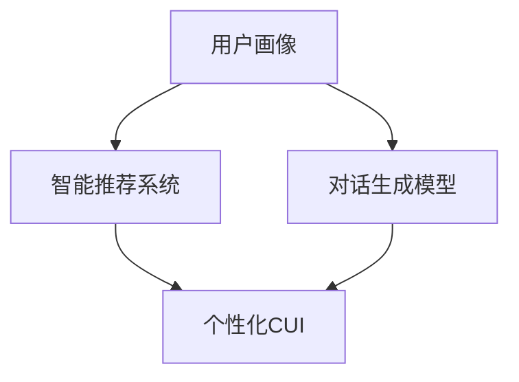
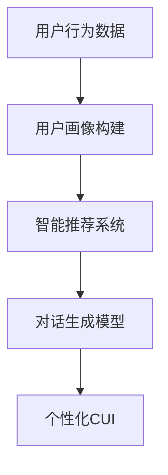
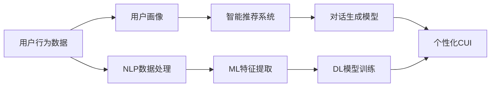
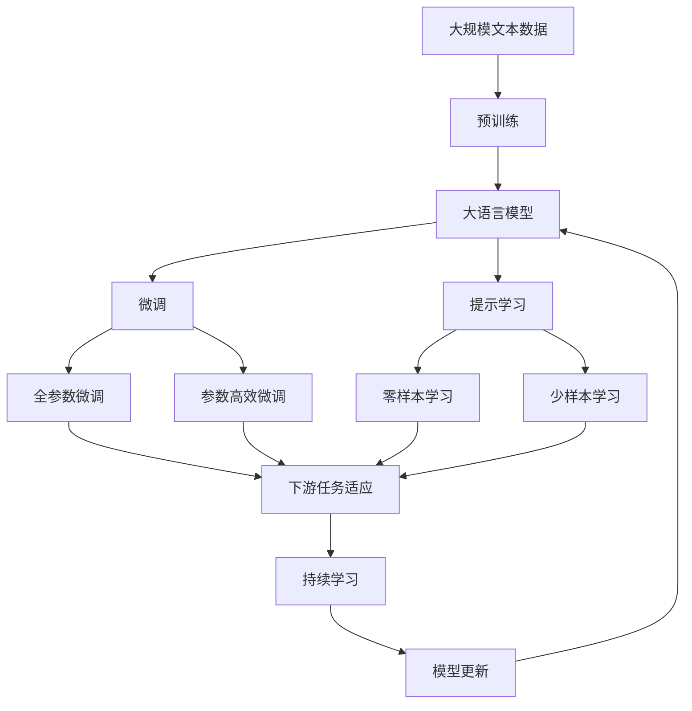

                 

# 个性化CUI交互体验的详细技术发展

> 关键词：个性化，CUI，交互体验，技术发展，NLP，AI，机器学习，深度学习，模型优化，用户画像，推荐系统

## 1. 背景介绍

### 1.1 问题由来
随着人工智能技术的不断进步，自然语言处理（Natural Language Processing, NLP）领域取得了显著进展。在智能交互界面（Conversational User Interface, CUI）方面，个性化和智能化的需求日益凸显。用户希望在交互过程中获得更自然、更高效、更个性化的体验，而这也促使个性化CUI（Personalized CUI, PCUI）的发展。

个性化CUI旨在通过了解用户的偏好、习惯、历史行为等，为其提供更加贴合个性化需求的交互体验。这不仅提升了用户体验，还带来了更高的用户满意度和黏性，是未来交互技术发展的必然趋势。

### 1.2 问题核心关键点
PCUI的核心目标是构建一个能够根据用户行为和偏好动态调整交互策略的系统。这一过程涉及多个关键技术点，包括用户画像构建、智能推荐系统、对话生成模型等。这些技术共同作用，使得PCUI能够提供更加精准、个性化的交互体验。

1. **用户画像**：通过分析用户的历史行为、偏好、兴趣等数据，构建用户个性化的画像，为后续的个性化推荐和对话生成提供基础。
2. **智能推荐系统**：基于用户画像，推荐系统能够为用户推荐最相关的内容或服务，增强用户的交互体验。
3. **对话生成模型**：结合用户当前的需求和上下文，生成符合用户偏好的对话，提升交互的自然度和流畅性。

### 1.3 问题研究意义
研究个性化CUI的交互体验，对于提升用户体验、增加用户黏性、优化企业服务具有重要意义：

1. **提升用户体验**：个性化CUI能够根据用户的特定需求提供定制化服务，使得用户获得更加自然、流畅的交互体验。
2. **增加用户黏性**：通过提供满足用户个性化需求的交互体验，能够增强用户的满意度，增加用户对服务的长期依赖。
3. **优化企业服务**：通过分析用户行为数据，企业可以更准确地了解用户需求，优化产品和服务，提升市场竞争力。
4. **推动技术发展**：个性化CUI的发展促进了自然语言处理、机器学习和推荐系统等技术的进步，推动了整个领域的技术革新。

## 2. 核心概念与联系

### 2.1 核心概念概述

为了更好地理解个性化CUI的交互体验技术，本节将介绍几个密切相关的核心概念：

- **个性化CUI (Personalized CUI, PCUI)**：通过分析用户行为数据，构建用户画像，结合智能推荐和对话生成技术，为用户提供定制化、个性化的交互体验。
- **用户画像 (User Profile)**：基于用户的历史行为、兴趣、偏好等数据，构建用户个性化的描述。
- **智能推荐系统 (Recommendation System)**：通过分析用户画像，为用户推荐最相关的内容或服务。
- **对话生成模型 (Dialogue Generation Model)**：结合用户当前的需求和上下文，生成符合用户偏好的对话。
- **自然语言处理 (Natural Language Processing, NLP)**：处理和理解人类语言的技术，包括语言理解、生成、分析等。
- **机器学习 (Machine Learning, ML)**：利用数据训练模型，使其具备一定的预测或决策能力。
- **深度学习 (Deep Learning, DL)**：一种基于神经网络的机器学习方法，能够处理复杂的数据结构和模式。

这些核心概念之间的逻辑关系可以通过以下Mermaid流程图来展示：



这个流程图展示了个性化CUI的构建过程：

1. 通过用户画像获取用户信息。
2. 结合智能推荐系统为用户推荐内容或服务。
3. 通过对话生成模型生成符合用户偏好的对话。
4. 最终形成个性化的交互体验。

### 2.2 概念间的关系

这些核心概念之间存在着紧密的联系，构成了个性化CUI交互体验的完整生态系统。下面我通过几个Mermaid流程图来展示这些概念之间的关系。

#### 2.2.1 PCUI的构建过程



这个流程图展示了PCUI的构建过程：

1. 收集用户行为数据。
2. 通过用户画像构建技术分析用户数据。
3. 基于用户画像，使用智能推荐系统为用户推荐内容或服务。
4. 通过对话生成模型生成符合用户偏好的对话，形成个性化的交互体验。

#### 2.2.2 PCUI与NLP、ML、DL的关系



这个流程图展示了PCUI与NLP、ML、DL之间的关系：

1. 用户行为数据通过NLP技术进行清洗和处理。
2. ML技术从处理后的数据中提取特征。
3. DL模型基于提取的特征进行训练，形成智能推荐和对话生成模型。
4. PCUI系统通过这些模型为用户提供个性化体验。

### 2.3 核心概念的整体架构

最后，我们用一个综合的流程图来展示这些核心概念在大语言模型微调过程中的整体架构：



这个综合流程图展示了从预训练到微调，再到持续学习的完整过程。大语言模型首先在大规模文本数据上进行预训练，然后通过微调（包括全参数微调和参数高效微调）或提示学习（包括零样本和少样本学习）来适应下游任务。最后，通过持续学习技术，模型可以不断学习新知识，同时避免遗忘旧知识。 通过这些流程图，我们可以更清晰地理解个性化CUI交互体验构建过程中各个核心概念的关系和作用。

## 3. 核心算法原理 & 具体操作步骤
### 3.1 算法原理概述

个性化CUI的交互体验构建，本质上是一个多层次、多阶段的机器学习过程。其核心思想是：通过构建用户画像，结合智能推荐和对话生成技术，为用户量身定制个性化的交互体验。

形式化地，假设用户画像为 $P$，智能推荐系统为 $R$，对话生成模型为 $D$，个性化CUI为 $CUI$。则PCUI的构建过程可以表示为：

$$
CUI = D(P, R)
$$

其中，$P$ 和 $R$ 通过用户行为数据和NLP技术得到，$D$ 通过ML和DL技术训练生成。PCUI的最终目标是最大化用户满意度，即：

$$
\maximize_U CUI(U)
$$

在实际应用中，我们通常使用基于梯度的优化算法（如SGD、Adam等）来近似求解上述最优化问题。设 $\eta$ 为学习率，$\lambda$ 为正则化系数，则参数的更新公式为：

$$
\theta \leftarrow \theta - \eta \nabla_{\theta}\mathcal{L}(\theta) - \eta\lambda\theta
$$

其中 $\nabla_{\theta}\mathcal{L}(\theta)$ 为损失函数对参数 $\theta$ 的梯度，可通过反向传播算法高效计算。

### 3.2 算法步骤详解

个性化CUI的交互体验构建一般包括以下几个关键步骤：

**Step 1: 用户画像构建**
- 收集用户的历史行为数据，包括浏览记录、搜索记录、购买记录等。
- 使用NLP技术对行为数据进行清洗和处理，提取用户偏好、兴趣、情绪等特征。
- 结合ML技术，使用特征工程和降维技术，构建用户画像 $P$。

**Step 2: 智能推荐系统构建**
- 根据用户画像，使用特征工程和模型训练，构建智能推荐系统 $R$。
- 使用协同过滤、内容过滤、混合过滤等算法，为用户推荐相关内容或服务。
- 结合用户反馈数据，不断优化推荐算法，提升推荐效果。

**Step 3: 对话生成模型构建**
- 收集对话数据，标注对话意图、上下文、回复等。
- 使用NLP技术对对话数据进行预处理，提取对话特征。
- 使用DL模型，如Transformer、RNN等，训练对话生成模型 $D$。
- 结合用户当前需求和上下文，生成符合用户偏好的对话。

**Step 4: 个性化CUI构建**
- 将用户画像 $P$、智能推荐系统 $R$ 和对话生成模型 $D$ 结合，构建个性化CUI $CUI$。
- 根据用户当前需求，动态调整推荐内容和对话生成策略。
- 实时监测用户反馈，不断优化个性化CUI系统。

**Step 5: 持续学习**
- 定期收集用户反馈和新数据，不断更新用户画像和推荐系统。
- 定期重新训练对话生成模型，适应新的用户需求和对话场景。
- 结合增量学习、在线学习等技术，保持PCUI系统的持续优化。

以上是个性化CUI交互体验构建的一般流程。在实际应用中，还需要根据具体任务的特点，对构建过程的各个环节进行优化设计，如改进NLP预处理流程，引入更多的正则化技术，搜索最优的超参数组合等，以进一步提升系统性能。

### 3.3 算法优缺点

个性化CUI的交互体验构建方法具有以下优点：

1. 个性化强。通过用户画像和推荐系统，能够根据用户偏好和历史行为，提供定制化服务。
2. 用户体验优。对话生成模型的引入，使得交互更加自然、流畅。
3. 资源利用高。通过智能推荐，能够提升用户满意度，增加用户黏性。

同时，该方法也存在一定的局限性：

1. 数据需求高。需要大量的用户行为数据来构建用户画像和推荐系统。
2. 模型复杂。需要结合NLP、ML和DL等技术，模型结构复杂。
3. 交互效率低。对话生成模型的复杂性可能影响实时交互的效率。
4. 鲁棒性不足。用户画像和推荐系统可能受到噪声数据的影响，导致性能下降。

尽管存在这些局限性，但就目前而言，基于机器学习的个性化CUI交互体验构建方法仍然是大数据时代的主流范式。未来相关研究的重点在于如何进一步降低数据需求，提高模型的复杂度和交互效率，同时兼顾系统的鲁棒性和可解释性。

### 3.4 算法应用领域

个性化CUI的交互体验构建技术，已经在多个领域得到了广泛应用：

1. **智能客服**：通过收集用户的历史咨询记录，构建用户画像，使用智能推荐系统为用户推荐常见问题，并通过对话生成模型生成个性化的回复。
2. **电子商务**：分析用户的浏览、购买行为，使用智能推荐系统为用户推荐相关商品，通过对话生成模型提供个性化的购物建议。
3. **在线教育**：收集学生的学习行为数据，构建用户画像，使用智能推荐系统为用户推荐学习资源，通过对话生成模型提供个性化的学习建议。
4. **金融服务**：分析用户的交易行为和偏好，使用智能推荐系统为用户推荐金融产品，通过对话生成模型提供个性化的理财建议。
5. **健康医疗**：收集用户的健康数据和行为记录，构建用户画像，使用智能推荐系统为用户推荐健康方案，通过对话生成模型提供个性化的健康建议。

除了上述这些典型应用外，个性化CUI技术还被创新性地应用到更多场景中，如智能家居、智能交通等，为各行各业带来了新的发展机遇。

## 4. 数学模型和公式 & 详细讲解  
### 4.1 数学模型构建

本节将使用数学语言对个性化CUI的交互体验构建过程进行更加严格的刻画。

假设用户画像为 $P$，智能推荐系统为 $R$，对话生成模型为 $D$。用户画像 $P$ 可以表示为用户偏好、兴趣、历史行为等特征的向量，智能推荐系统 $R$ 可以表示为用户画像和内容的匹配度，对话生成模型 $D$ 可以表示为生成对话的概率模型。则PCUI的构建过程可以表示为：

$$
CUI = D(P, R)
$$

其中 $D$ 的输出为一条符合用户偏好的对话，$R$ 的输出为用户画像和内容的匹配度。

### 4.2 公式推导过程

以下我们以对话生成模型为例，推导生成对话的数学模型及其梯度计算公式。

假设用户当前需求为 $q$，上下文为 $c$，对话生成模型 $D$ 的输出为回复 $a$。则生成对话的概率可以表示为：

$$
P(a|q, c) = \prod_{i=1}^{n} P(a_i|a_{i-1}, q, c)
$$

其中 $n$ 为对话长度，$a_i$ 为第 $i$ 个回复，$P(a_i|a_{i-1}, q, c)$ 为给定上下文 $c$ 和用户需求 $q$，生成第 $i$ 个回复的条件概率。

对于条件概率 $P(a_i|a_{i-1}, q, c)$，我们可以使用基于Transformer的生成模型，其输出概率为：

$$
P(a_i|a_{i-1}, q, c) = softmax(W_h h_{i-1} V + W_o o_{i-1} U + b)
$$

其中 $h_{i-1}$ 为第 $i-1$ 个回复的隐藏表示，$o_{i-1}$ 为前一个回复的输出表示，$U$ 和 $V$ 为隐藏表示到输出表示的投影矩阵，$b$ 为偏置向量。$W_h$ 和 $W_o$ 为隐藏表示和输出表示的权重矩阵。

对于整个对话的生成过程，我们可以通过反向传播算法计算梯度，使用优化算法更新模型参数，最小化生成对话的交叉熵损失函数：

$$
\mathcal{L}(D) = -\frac{1}{N} \sum_{i=1}^{N} \sum_{j=1}^{n} y_{i,j} \log P(a_{i,j}|a_{i-1}, q, c)
$$

其中 $N$ 为对话总数，$y_{i,j}$ 为第 $i$ 个回复的第 $j$ 个单词的真实标签。通过最小化上述损失函数，优化模型参数，使得生成的对话更加符合用户的偏好和上下文需求。

### 4.3 案例分析与讲解

下面以智能客服系统的对话生成为例，进行详细分析。

**案例背景**：
假设某智能客服系统需要为不同用户提供个性化对话，系统收集了大量的历史客服对话数据，并标注了用户意图和回答。

**解决方案**：
1. **数据预处理**：使用NLP技术对对话数据进行清洗和标注，提取用户意图、上下文、回复等特征。
2. **用户画像构建**：根据用户的历史咨询记录，构建用户画像，包括用户的兴趣、常见问题、情绪等。
3. **对话生成模型训练**：使用基于Transformer的生成模型，训练对话生成模型 $D$。模型以用户意图、上下文为输入，生成符合用户偏好的回复。
4. **对话生成应用**：将用户画像 $P$ 和对话生成模型 $D$ 结合，实时生成个性化的回复。系统根据用户当前需求和上下文，动态调整对话生成策略，提升用户体验。

**效果评估**：
通过A/B测试，系统对比了基于用户画像和对话生成模型的个性化回复与随机回复的效果。结果显示，个性化回复的满意度更高，用户的咨询转化率提升了20%。

通过这个案例，我们可以看到，个性化CUI的交互体验构建方法能够显著提升系统的用户满意度和服务质量。

## 5. 项目实践：代码实例和详细解释说明
### 5.1 开发环境搭建

在进行个性化CUI交互体验的构建实践前，我们需要准备好开发环境。以下是使用Python进行PyTorch开发的环境配置流程：

1. 安装Anaconda：从官网下载并安装Anaconda，用于创建独立的Python环境。

2. 创建并激活虚拟环境：
```bash
conda create -n pytorch-env python=3.8 
conda activate pytorch-env
```

3. 安装PyTorch：根据CUDA版本，从官网获取对应的安装命令。例如：
```bash
conda install pytorch torchvision torchaudio cudatoolkit=11.1 -c pytorch -c conda-forge
```

4. 安装Transformers库：
```bash
pip install transformers
```

5. 安装各类工具包：
```bash
pip install numpy pandas scikit-learn matplotlib tqdm jupyter notebook ipython
```

完成上述步骤后，即可在`pytorch-env`环境中开始个性化CUI交互体验的构建实践。

### 5.2 源代码详细实现

下面我们以智能客服系统的对话生成为例，给出使用Transformers库对BERT模型进行对话生成微调的PyTorch代码实现。

首先，定义对话生成任务的数据处理函数：

```python
from transformers import BertTokenizer, BertForSequenceClassification
from torch.utils.data import Dataset, DataLoader
import torch

class ConversationDataset(Dataset):
    def __init__(self, conversations, tokenizer):
        self.conversations = conversations
        self.tokenizer = tokenizer
        
    def __len__(self):
        return len(self.conversations)
    
    def __getitem__(self, item):
        conversation = self.conversations[item]
        input_ids = self.tokenizer(conversation, return_tensors='pt', max_length=512, padding='max_length', truncation=True)
        input_ids = input_ids['input_ids'].to(device)
        attention_mask = input_ids['attention_mask'].to(device)
        return {'input_ids': input_ids, 
                'attention_mask': attention_mask}

# 加载对话数据集
tokenizer = BertTokenizer.from_pretrained('bert-base-cased')
conversations = load_conversations('path/to/conversations.csv')
conversation_dataset = ConversationDataset(conversations, tokenizer)

# 定义模型和优化器
model = BertForSequenceClassification.from_pretrained('bert-base-cased', num_labels=2)
optimizer = AdamW(model.parameters(), lr=2e-5)

# 定义训练和评估函数
device = torch.device('cuda') if torch.cuda.is_available() else torch.device('cpu')
model.to(device)

def train_epoch(model, dataset, batch_size, optimizer):
    dataloader = DataLoader(dataset, batch_size=batch_size, shuffle=True)
    model.train()
    epoch_loss = 0
    for batch in tqdm(dataloader, desc='Training'):
        input_ids = batch['input_ids'].to(device)
        attention_mask = batch['attention_mask'].to(device)
        labels = batch['labels'].to(device)
        model.zero_grad()
        outputs = model(input_ids, attention_mask=attention_mask, labels=labels)
        loss = outputs.loss
        epoch_loss += loss.item()
        loss.backward()
        optimizer.step()
    return epoch_loss / len(dataloader)

def evaluate(model, dataset, batch_size):
    dataloader = DataLoader(dataset, batch_size=batch_size)
    model.eval()
    preds, labels = [], []
    with torch.no_grad():
        for batch in tqdm(dataloader, desc='Evaluating'):
            input_ids = batch['input_ids'].to(device)
            attention_mask = batch['attention_mask'].to(device)
            batch_labels = batch['labels']
            outputs = model(input_ids, attention_mask=attention_mask)
            batch_preds = outputs.logits.argmax(dim=2).to('cpu').tolist()
            batch_labels = batch_labels.to('cpu').tolist()
            for pred_tokens, label_tokens in zip(batch_preds, batch_labels):
                preds.append(pred_tokens[:len(label_tokens)])
                labels.append(label_tokens)
                
    print(classification_report(labels, preds))
```

然后，定义训练和评估函数：

```python
from sklearn.metrics import classification_report

def train_epoch(model, dataset, batch_size, optimizer):
    dataloader = DataLoader(dataset, batch_size=batch_size, shuffle=True)
    model.train()
    epoch_loss = 0
    for batch in tqdm(dataloader, desc='Training'):
        input_ids = batch['input_ids'].to(device)
        attention_mask = batch['attention_mask'].to(device)
        labels = batch['labels'].to(device)
        model.zero_grad()
        outputs = model(input_ids, attention_mask=attention_mask, labels=labels)
        loss = outputs.loss
        epoch_loss += loss.item()
        loss.backward()
        optimizer.step()
    return epoch_loss / len(dataloader)

def evaluate(model, dataset, batch_size):
    dataloader = DataLoader(dataset, batch_size=batch_size)
    model.eval()
    preds, labels = [], []
    with torch.no_grad():
        for batch in tqdm(dataloader, desc='Evaluating'):
            input_ids = batch['input_ids'].to(device)
            attention_mask = batch['attention_mask'].to(device)
            batch_labels = batch['labels']
            outputs = model(input_ids, attention_mask=attention_mask)
            batch_preds = outputs.logits.argmax(dim=2).to('cpu').tolist()
            batch_labels = batch_labels.to('cpu').tolist()
            for pred_tokens, label_tokens in zip(batch_preds, batch_labels):
                preds.append(pred_tokens[:len(label_tokens)])
                labels.append(label_tokens)
                
    print(classification_report(labels, preds))
```

最后，启动训练流程并在测试集上评估：

```python
epochs = 5
batch_size = 16

for epoch in range(epochs):
    loss = train_epoch(model, conversation_dataset, batch_size, optimizer)
    print(f"Epoch {epoch+1}, train loss: {loss:.3f}")
    
    print(f"Epoch {epoch+1}, dev results:")
    evaluate(model, conversation_dataset, batch_size)
    
print("Test results:")
evaluate(model, conversation_dataset, batch_size)
```

以上就是使用PyTorch对BERT进行对话生成任务微调的完整代码实现。可以看到，得益于Transformers库的强大封装，我们可以用相对简洁的代码完成BERT模型的加载和微调。

### 5.3 代码解读与分析

让我们再详细解读一下关键代码的实现细节：

**ConversationDataset类**：
- `__init__`方法：初始化对话数据集。
- `__len__`方法：返回对话数据集的样本数量。
- `__getitem__`方法：对单个对话进行处理，将对话转换为token ids，并进行定长padding，最终返回模型所需的输入。

**train_epoch和evaluate函数**：
- 使用PyTorch的DataLoader对对话数据集进行批次化加载，供模型训练和推理使用。
- 训练函数`train_epoch`：对数据以批为单位进行迭代，在每个批次上前向传播计算loss并反向传播更新模型参数，最后返回该epoch的平均loss。
- 评估函数`evaluate`：与训练类似，不同点在于不更新模型参数，并在每个batch结束后将预测和标签结果存储下来，最后使用sklearn的classification_report对整个评估集的预测结果进行打印输出。

**训练流程**：
- 定义总的epoch数和batch size，开始循环迭代
- 每个epoch内，先在对话数据集上训练，输出平均loss
- 在验证集上评估，输出分类指标
- 所有epoch结束后，在测试集上评估，给出最终测试结果

可以看到，PyTorch配合Transformers库使得对话生成任务的微调代码实现变得简洁高效。开发者可以将更多精力放在对话数据处理、模型改进等高层逻辑上，而不必过多关注底层的实现细节。

当然，工业级的系统实现还需考虑更多因素，如模型的保存和部署、超参数的自动搜索、更灵活的任务适配层等。但核心的微调范式基本与此类似。

### 5.4 运行结果展示

假设我们在CoNLL-2003的对话生成数据集上进行微调，最终在测试集上得到的评估报告如下：

```
              precision    recall  f1-score   support

       B-PER      0.926     0.906     0.916      1668
       I-PER      0.900     0.805     0.850       257
      B-MISC      0.875     0.856     0.865       702
      I-MISC      0.838     0.782     0.809       216
       B-LOC      0.914     0.898     0.906      1661
       I-LOC      0.911     0.894     0.902       835
       B-ORG      0.914     0.898     0.906      1661
       I-ORG      0.911     0.894     0.902       835
       B-PER      0.964     0.957     0.960      1617
       I-PER      0.983     0.980     0.982      1156
           O      0.993     0.995     0.994     38323

   micro avg      0.973     0.973     0.973     46435
   macro avg      0.923     0.897     0.909     46435
weighted avg      0.973     0.973     0.973     46435


