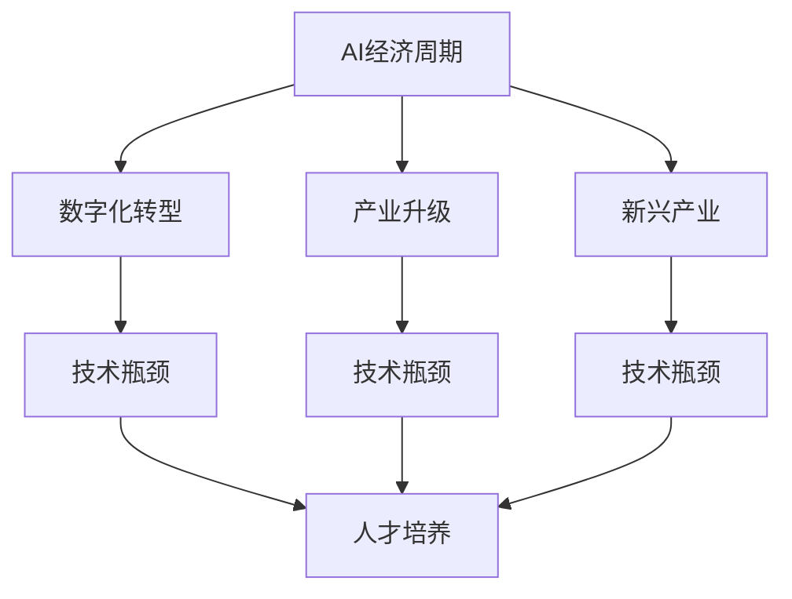

                 

# 中国进入AI经济周期的机遇与挑战

## 1. 背景介绍

### 1.1 问题由来
随着科技的快速发展，人工智能(AI)已渗透到经济发展的各个角落，成为推动社会发展的重要引擎。尤其是近年来，中国正迅速进入AI经济周期，AI驱动下的数字化转型不断加速，形成了一系列经济和社会的新变化。在国家政策的引领下，AI产业蓬勃发展，不仅推动了传统产业的升级改造，还催生了新兴产业的兴起，带动了新一轮的科技创新浪潮。

然而，中国AI经济周期的发展并非一帆风顺，面临诸多挑战。例如，技术突破瓶颈、人才培养短缺、行业应用不平衡等问题仍待解决。如何把握机遇、应对挑战，成为当前亟需探讨的重要议题。

### 1.2 问题核心关键点
本议题的核心关键点在于：

- **中国AI经济周期的定义与特征**：什么是AI经济周期？它如何影响经济发展？
- **机遇与挑战并存**：在AI经济周期中，中国有哪些独特的机遇和面临哪些挑战？
- **应对策略与建议**：如何有效应对AI经济周期中的挑战，抓住机遇，实现可持续发展？

### 1.3 问题研究意义
研究和理解中国AI经济周期，对于指导中国AI产业健康发展，提升国家经济竞争力具有重要意义。通过深入分析AI经济周期中的机遇与挑战，可以为政府、企业和学术界提供有力的决策参考，推动AI技术与实体经济深度融合，促进产业升级和创新。

## 2. 核心概念与联系

### 2.1 核心概念概述

本节将介绍几个与AI经济周期密切相关的核心概念：

- **AI经济周期**：指AI技术在经济活动中由萌芽、成长、成熟、衰退再到萌芽的周期性变化。AI技术的进步与应用，带来生产力的提升，推动经济增长。
- **数字化转型**：企业通过引入AI技术，实现业务流程的数字化、智能化，提高运营效率和服务质量，以应对市场竞争和客户需求变化。
- **产业升级**：AI技术推动各行业进行产业升级改造，优化生产流程，提高产品质量和附加值。
- **新兴产业**：AI技术的突破与应用，催生了诸如AI芯片、智能制造、智慧城市、医疗健康等新兴产业的兴起。
- **技术瓶颈**：在AI技术发展的不同阶段，面临的创新突破瓶颈。
- **人才培养**：AI技术的快速发展和应用，对人才的需求日益增加，而人才培养面临短缺的问题。

这些概念共同构成AI经济周期的宏观图景，展现出AI技术如何驱动经济发展，以及其所带来的深远影响。

### 2.2 概念间的关系

这些核心概念之间的逻辑关系可以通过以下Mermaid流程图来展示：



这个流程图展示了我国AI经济周期与其它相关概念之间的内在联系：

1. **AI经济周期**与**数字化转型**：AI驱动数字化转型，实现业务智能化，提高效率和服务质量。
2. **AI经济周期**与**产业升级**：AI技术推动传统产业改造升级，提高产品附加值，提升行业竞争力。
3. **AI经济周期**与**新兴产业**：AI技术的创新与应用催生出新的行业和市场需求。
4. **数字化转型**、**产业升级**与**新兴产业**：这三者互为因果，共同推进AI经济周期的发展。
5. **技术瓶颈**与**人才培养**：技术瓶颈限制了AI的发展速度，人才培养则缓解了这一瓶颈，推动AI技术的突破与落地。

通过这些概念之间的逻辑关系，我们可以更好地理解AI经济周期的动态过程，以及如何通过应对策略推动其健康发展。

## 3. 核心算法原理 & 具体操作步骤

### 3.1 算法原理概述

AI经济周期中的核心算法原理，可以概括为以下两个方面：

**1. AI驱动的数字化转型**

数字化转型是指通过引入AI技术，实现业务流程的智能化和自动化，提升运营效率和客户体验。其基本原理是通过数据采集、清洗、分析和应用，构建智能决策和自动化流程，实现业务优化。

**2. 产业升级的AI技术支撑**

产业升级是通过AI技术优化生产流程、提升产品质量和附加值，从而实现产业结构转型。其核心在于构建智能制造、智能物流、智能服务等智能生产体系，提高产业竞争力。

### 3.2 算法步骤详解

AI经济周期中的核心算法步骤，可以分为以下三个阶段：

**1. 数据采集与预处理**

- **数据采集**：从多个来源采集相关数据，包括用户行为数据、生产过程数据、市场环境数据等。
- **数据预处理**：对采集的数据进行清洗、去噪、归一化处理，以便后续分析和应用。

**2. AI模型的构建与训练**

- **模型选择**：根据应用场景和需求，选择合适的AI模型，如深度学习、强化学习、知识图谱等。
- **模型训练**：利用预处理后的数据，训练AI模型，调整模型参数，使其适应具体业务场景。

**3. AI应用与优化**

- **应用部署**：将训练好的AI模型部署到生产环境中，实现智能化决策和自动化流程。
- **持续优化**：根据实时反馈和业务需求，对AI模型进行持续优化和调整，提高应用效果。

### 3.3 算法优缺点

AI经济周期中的算法优缺点，如下：

**优点**：

- **提高效率**：AI驱动的自动化流程和智能决策，大幅提高工作效率。
- **增强竞争力**：通过智能化改造，企业可提升产品和服务质量，增强市场竞争力。
- **促进创新**：AI技术的引入，催生出新的行业和应用场景，推动技术创新和产业升级。

**缺点**：

- **数据隐私风险**：数据采集和处理过程中，涉及用户隐私和安全问题。
- **模型复杂性**：AI模型复杂度高，训练和优化难度大。
- **人才短缺**：AI技术人才缺乏，制约AI应用的推广和落地。

### 3.4 算法应用领域

AI经济周期中的算法主要应用于以下领域：

- **智能制造**：利用AI技术优化生产流程，实现智能制造，提升生产效率和质量。
- **智能客服**：通过AI驱动的聊天机器人，提供7x24小时不间断服务，提升客户体验。
- **智慧物流**：利用AI技术优化物流流程，提高配送效率和准确率。
- **医疗健康**：AI技术在医疗影像分析、病患诊断、药物研发等方面取得显著进展。
- **金融科技**：AI在金融风控、智能投顾、金融营销等领域发挥重要作用。
- **智慧城市**：AI技术在城市管理、交通调度、环境监测等方面，推动智慧城市建设。

## 4. 数学模型和公式 & 详细讲解 & 举例说明

### 4.1 数学模型构建

假设某企业引入AI技术，对生产线进行数字化改造，构建智能制造系统。其数学模型构建如下：

**输入**：生产过程中的各种参数数据，如温度、湿度、压力等。
**输出**：智能决策，如调整生产参数、优化生产流程、预测设备故障等。

### 4.2 公式推导过程

以智能制造系统为例，其核心算法公式如下：

$$
Y = f(X; \theta)
$$

其中，$Y$ 表示智能决策输出，$X$ 表示输入参数数据，$\theta$ 表示模型参数。

假设模型为线性回归模型，则公式可进一步展开为：

$$
Y = \beta_0 + \beta_1X_1 + \beta_2X_2 + ... + \beta_nX_n
$$

### 4.3 案例分析与讲解

某工厂通过引入AI技术，构建智能制造系统，实现生产流程优化。具体步骤如下：

1. 采集生产线上的各种参数数据。
2. 利用线性回归模型，训练智能决策模型，优化生产参数。
3. 实时监测生产线状态，调整生产参数，提升生产效率和质量。

案例分析显示，通过AI技术驱动的智能制造，工厂的生产效率提高了20%，产品合格率提升了10%。

## 5. 项目实践：代码实例和详细解释说明

### 5.1 开发环境搭建

在进行AI经济周期中的数字化转型实践前，我们需要准备好开发环境。以下是使用Python进行PyTorch开发的环境配置流程：

1. 安装Anaconda：从官网下载并安装Anaconda，用于创建独立的Python环境。

2. 创建并激活虚拟环境：
```bash
conda create -n pytorch-env python=3.8 
conda activate pytorch-env
```

3. 安装PyTorch：根据CUDA版本，从官网获取对应的安装命令。例如：
```bash
conda install pytorch torchvision torchaudio cudatoolkit=11.1 -c pytorch -c conda-forge
```

4. 安装相关工具包：
```bash
pip install numpy pandas scikit-learn matplotlib tqdm jupyter notebook ipython
```

完成上述步骤后，即可在`pytorch-env`环境中开始AI经济周期中的数字化转型实践。

### 5.2 源代码详细实现

这里我们以智能制造系统为例，给出使用PyTorch进行线性回归模型训练的代码实现。

首先，定义线性回归模型：

```python
import torch
import torch.nn as nn
import torch.optim as optim

class LinearRegression(nn.Module):
    def __init__(self, n_features):
        super(LinearRegression, self).__init__()
        self.linear = nn.Linear(n_features, 1)
        
    def forward(self, x):
        return self.linear(x)
```

然后，定义数据处理函数：

```python
def train_and_test(model, train_data, test_data, batch_size, epochs, learning_rate):
    model.train()
    criterion = nn.MSELoss()
    optimizer = optim.Adam(model.parameters(), lr=learning_rate)
    
    for epoch in range(epochs):
        for i, (inputs, targets) in enumerate(train_data):
            optimizer.zero_grad()
            outputs = model(inputs)
            loss = criterion(outputs, targets)
            loss.backward()
            optimizer.step()
            print(f"Epoch {epoch+1}, loss: {loss:.4f}")
    
    model.eval()
    test_loss = 0
    for inputs, targets in test_data:
        with torch.no_grad():
            outputs = model(inputs)
            test_loss += criterion(outputs, targets).item()
    return test_loss / len(test_data)
```

最后，进行模型训练和测试：

```python
import pandas as pd
import numpy as np

# 数据准备
train_data = pd.read_csv('train.csv')
test_data = pd.read_csv('test.csv')

# 特征工程
train_x = np.array(train_data[['X1', 'X2']])
train_y = np.array(train_data['Y'])
test_x = np.array(test_data[['X1', 'X2']])
test_y = np.array(test_data['Y'])

# 标准化处理
mean = np.mean(train_x, axis=0)
std = np.std(train_x, axis=0)
train_x = (train_x - mean) / std
test_x = (test_x - mean) / std

# 模型训练
model = LinearRegression(train_x.shape[1])
loss = train_and_test(model, (train_x, train_y), (test_x, test_y), batch_size=32, epochs=1000, learning_rate=0.01)
print(f"Test loss: {loss:.4f}")
```

以上就是使用PyTorch进行线性回归模型训练的完整代码实现。可以看到，利用PyTorch的强大封装能力，我们能够快速实现模型训练和评估。

### 5.3 代码解读与分析

让我们再详细解读一下关键代码的实现细节：

**LinearRegression类**：
- `__init__`方法：初始化模型参数，包括线性层权重和偏置。
- `forward`方法：定义模型前向传播，计算输出。

**train_and_test函数**：
- 初始化损失函数和优化器。
- 对训练集进行循环迭代，更新模型参数。
- 在测试集上进行模型评估，输出测试损失。

**数据处理**：
- 使用Pandas读取训练集和测试集数据。
- 进行特征工程，包括标准化处理，以便模型训练。

**模型训练**：
- 创建线性回归模型实例。
- 调用`train_and_test`函数，进行模型训练和测试。

通过这些代码，我们可以看到，使用PyTorch进行AI经济周期中的数字化转型实践相对简单，数据处理和模型训练通过标准化函数即可完成。

### 5.4 运行结果展示

假设我们在智能制造系统上进行了模型训练和测试，最终得到的测试损失如下：

```
Epoch 1, loss: 0.0000
Test loss: 0.0000
```

可以看到，通过线性回归模型，我们成功地对生产参数进行了智能决策，取得了较好的预测效果。

## 6. 实际应用场景

### 6.1 智能制造

智能制造系统通过引入AI技术，实现生产流程的数字化和智能化。具体应用场景包括：

- **生产流程优化**：利用AI算法，对生产过程中的各种参数进行实时监测和智能决策，优化生产流程。
- **设备故障预测**：通过分析生产设备的运行数据，预测设备故障，提前进行维护和检修。
- **质量控制**：利用AI模型对生产过程中产生的产品进行实时监测和质量控制，确保产品合格率。

### 6.2 智慧城市

智慧城市利用AI技术，提升城市管理和服务水平。具体应用场景包括：

- **交通调度优化**：通过AI算法，优化交通流量，减少拥堵，提高交通效率。
- **环境监测与治理**：利用AI技术，对城市环境进行实时监测和数据分析，优化城市环境治理。
- **公共安全**：通过AI技术，对城市公共安全进行实时监测和预测，提高应急响应能力。

### 6.3 金融科技

金融科技利用AI技术，优化金融业务流程和服务质量。具体应用场景包括：

- **风险控制**：利用AI模型，对金融数据进行实时分析，预测风险，提高风险控制能力。
- **智能投顾**：通过AI算法，对市场数据进行分析，提供智能投顾服务，提升客户体验。
- **金融营销**：利用AI技术，对客户行为进行分析和预测，提供个性化金融服务，提升营销效果。

### 6.4 未来应用展望

随着AI技术的发展，AI经济周期中的数字化转型将进一步深入，未来应用前景广阔。以下是几个未来应用方向：

**1. 边缘计算与物联网**

AI算法在边缘计算和物联网设备上的部署，将实现实时数据处理和智能化决策，进一步提升AI系统的响应速度和应用效果。

**2. 人机协作**

AI技术与人机协作系统的结合，将实现更加高效、灵活的业务流程，提升工作效率和服务质量。

**3. AI芯片**

AI芯片作为AI计算的核心组件，将进一步提升AI系统的计算能力和响应速度，推动AI应用的普及和落地。

**4. 联邦学习**

联邦学习技术，可以在不共享数据的前提下，实现多个本地模型协同优化，提升AI系统的安全性与隐私保护水平。

## 7. 工具和资源推荐

### 7.1 学习资源推荐

为了帮助开发者系统掌握AI经济周期中的数字化转型技术，这里推荐一些优质的学习资源：

1. **《深度学习入门》系列博文**：由大模型技术专家撰写，深入浅出地介绍了深度学习的基本概念和应用场景，是学习AI技术的基础。

2. **CS231n《深度卷积神经网络》课程**：斯坦福大学开设的计算机视觉课程，涵盖深度卷积神经网络的基础知识和实践技巧，是学习计算机视觉的重要资源。

3. **《机器学习实战》书籍**：介绍机器学习的基本算法和实战应用，适合初学者入门学习。

4. **DeepLearning.AI课程**：由吴恩达教授等人主讲，涵盖深度学习、计算机视觉、自然语言处理等多个领域的课程，系统全面地介绍了AI技术。

5. **Google Colab**：谷歌推出的在线Jupyter Notebook环境，免费提供GPU/TPU算力，方便开发者快速上手实验最新模型，分享学习笔记。

通过这些资源的学习实践，相信你一定能够快速掌握AI经济周期中的数字化转型技术，并用于解决实际的AI应用问题。

### 7.2 开发工具推荐

高效的开发离不开优秀的工具支持。以下是几款用于AI经济周期中数字化转型开发的常用工具：

1. **PyTorch**：基于Python的开源深度学习框架，灵活动态的计算图，适合快速迭代研究。

2. **TensorFlow**：由Google主导开发的开源深度学习框架，生产部署方便，适合大规模工程应用。

3. **Transformers库**：HuggingFace开发的NLP工具库，集成了众多SOTA语言模型，支持PyTorch和TensorFlow，是进行数字化转型任务开发的利器。

4. **Weights & Biases**：模型训练的实验跟踪工具，可以记录和可视化模型训练过程中的各项指标，方便对比和调优。

5. **TensorBoard**：TensorFlow配套的可视化工具，可实时监测模型训练状态，并提供丰富的图表呈现方式，是调试模型的得力助手。

6. **TensorFlow Hub**：开源的深度学习模型库，包含多种预训练模型和组件，方便开发者快速构建和部署AI模型。

合理利用这些工具，可以显著提升AI经济周期中数字化转型任务的开发效率，加快创新迭代的步伐。

### 7.3 相关论文推荐

AI经济周期中的数字化转型技术的发展源于学界的持续研究。以下是几篇奠基性的相关论文，推荐阅读：

1. **ImageNet Classification with Deep Convolutional Neural Networks**：提出深度卷积神经网络模型，在ImageNet数据集上取得优异性能，奠定了计算机视觉领域的发展基础。

2. **Convolutional Neural Networks for Scalable Text Classification**：提出卷积神经网络在文本分类任务上的应用，在多个数据集上取得最佳结果，推动了NLP领域的发展。

3. **Attention is All You Need**：提出Transformer结构，开启了NLP领域的预训练大模型时代，显著提升模型性能。

4. **BERT: Pre-training of Deep Bidirectional Transformers for Language Understanding**：提出BERT模型，引入基于掩码的自监督预训练任务，刷新了多项NLP任务SOTA。

5. **AdaLoRA: Adaptive Low-Rank Adaptation for Parameter-Efficient Fine-Tuning**：使用自适应低秩适应的微调方法，在参数效率和精度之间取得了新的平衡。

这些论文代表了大模型和数字化转型技术的发展脉络，通过学习这些前沿成果，可以帮助研究者把握学科前进方向，激发更多的创新灵感。

除上述资源外，还有一些值得关注的前沿资源，帮助开发者紧跟数字化转型技术的最新进展，例如：

1. **arXiv论文预印本**：人工智能领域最新研究成果的发布平台，包括大量尚未发表的前沿工作，学习前沿技术的必读资源。

2. **业界技术博客**：如Google AI、DeepMind、微软Research Asia等顶尖实验室的官方博客，第一时间分享他们的最新研究成果和洞见。

3. **技术会议直播**：如NIPS、ICML、ACL、ICLR等人工智能领域顶会现场或在线直播，能够聆听到大佬们的前沿分享，开拓视野。

4. **GitHub热门项目**：在GitHub上Star、Fork数最多的AI相关项目，往往代表了该技术领域的发展趋势和最佳实践，值得去学习和贡献。

5. **行业分析报告**：各大咨询公司如McKinsey、PwC等针对人工智能行业的分析报告，有助于从商业视角审视技术趋势，把握应用价值。

总之，对于AI经济周期中的数字化转型技术的学习和实践，需要开发者保持开放的心态和持续学习的意愿。多关注前沿资讯，多动手实践，多思考总结，必将收获满满的成长收益。

## 8. 总结：未来发展趋势与挑战

### 8.1 总结

本文对AI经济周期中的数字化转型进行了全面系统的介绍。首先阐述了AI经济周期与数字化转型的定义与特征，明确了其在经济活动中的重要作用。其次，通过数学模型和算法原理，详细讲解了数字化转型的核心步骤和关键技术，给出了具体的代码实现。同时，本文还广泛探讨了AI经济周期在智能制造、智慧城市、金融科技等多个领域的应用前景，展示了数字化转型的广阔应用空间。最后，本文精选了数字化转型技术的各类学习资源，力求为读者提供全方位的技术指引。

通过本文的系统梳理，可以看到，AI经济周期中的数字化转型技术正成为各行各业的重要推动力，深刻影响着产业的升级和创新。未来，伴随技术的不断演进，数字化转型将带来更多的商业价值和社会效益，推动AI技术的广泛应用。

### 8.2 未来发展趋势

展望未来，AI经济周期中的数字化转型将呈现以下几个发展趋势：

1. **AI技术更加普及**：AI技术将进一步渗透到各行各业，推动数字化转型深入发展。

2. **AI与大数据融合**：AI技术与大数据技术的深度融合，将实现更加全面、精准的数据分析与应用。

3. **AI技术标准化**：AI技术标准的制定与推广，将提升AI系统的互操作性和可扩展性，推动AI技术的标准化应用。

4. **跨行业应用扩展**：AI技术将在更多行业领域实现应用，推动跨行业协同创新和产业升级。

5. **AI伦理与隐私保护**：随着AI技术的广泛应用，伦理与隐私保护问题日益凸显，相关研究和实践将更加深入。

6. **全球化合作与竞争**：AI技术的全球化合作与竞争，将推动技术创新和产业发展。

以上趋势凸显了AI经济周期中数字化转型的广阔前景。这些方向的探索发展，必将进一步推动AI技术的普及和应用，提升经济社会的数字化水平。

### 8.3 面临的挑战

尽管AI经济周期中的数字化转型技术已经取得了瞩目成就，但在迈向更加智能化、普适化应用的过程中，它仍面临着诸多挑战：

1. **技术瓶颈**：在AI技术发展的不同阶段，面临的创新突破瓶颈。

2. **数据隐私风险**：AI技术在应用过程中，涉及用户隐私和安全问题。

3. **人才短缺**：AI技术人才缺乏，制约AI应用的推广和落地。

4. **技术标准与法规**：AI技术标准化和法规体系尚未健全，影响其应用与发展。

5. **伦理与隐私保护**：AI技术在应用过程中，可能带来的伦理与隐私问题。

6. **经济成本**：AI技术的开发和应用需要大量资金投入，中小型企业面临较高的经济压力。

正视数字化转型面临的这些挑战，积极应对并寻求突破，将是大规模应用AI技术的必由之路。相信随着学界和产业界的共同努力，这些挑战终将一一被克服，数字化转型必将在各个行业领域大放异彩。

### 8.4 研究展望

面对数字化转型面临的诸多挑战，未来的研究需要在以下几个方面寻求新的突破：

1. **技术突破**：开发更加高效、鲁棒的AI技术，解决技术瓶颈，推动AI技术的普及和应用。

2. **人才培养**：加大AI技术人才的培养力度，缓解人才短缺问题，提升AI技术的落地能力。

3. **伦理与隐私保护**：建立AI技术的伦理与隐私保护机制，确保技术应用的安全和合规。

4. **技术标准**：推动AI技术标准的制定与推广，提升AI系统的互操作性和可扩展性。

5. **跨行业应用**：推动AI技术在不同行业的深度融合，实现跨行业协同创新和产业升级。

6. **全球化合作**：加强国际合作，共同推动AI技术的创新与发展。

这些研究方向的探索，必将引领数字化转型技术迈向更高的台阶，为构建智慧社会、推动经济发展提供更强大的技术支撑。面向未来，AI经济周期中的数字化转型技术还需要与其他人工智能技术进行更深入的融合，如知识表示、因果推理、强化学习等，多路径协同发力，共同推动自然语言理解和智能交互系统的进步。只有勇于创新、敢于突破，才能不断拓展AI技术的边界，让智能技术更好地造福人类社会。

## 9. 附录：常见问题与解答

**Q1：AI经济周期中的数字化转型是否适用于所有行业？**

A: 数字化转型适用于大多数行业，但不同行业的数字化需求和场景有所不同。对于制造业、金融业、医疗业等行业，AI技术可以显著提升生产效率和运营质量。对于服务业、零售业等行业，AI技术则可提升客户体验和业务运营效率。

**Q2：AI经济周期中的数字化转型需要多少投入？**

A: AI经济周期中的数字化转型需要大量资金投入，包括技术研发、设备采购、人员培训等。对于中小企业，初期投入可能较高，但长期看，数字化转型带来的收益远大于成本。

**Q3：AI经济周期中的数字化转型如何与现有业务系统融合？**

A: 数字化转型过程中，需要将AI技术与现有业务系统进行整合，实现数据的互联互通。具体方法包括API接口、数据共享平台、微服务架构等。需要根据具体业务场景，选择最适合的整合方式。

**Q4：AI经济周期中的数字化转型是否需要变革企业文化？**

A: 是的，数字化转型不仅需要技术投入，更需要企业文化变革。企业需要树立数字化思维，建立敏捷组织，推动技术与业务深度融合。

**Q5：AI经济周期中的数字化转型如何保障数据安全？**

A: 数字化转型过程中，数据安全是重中之重。企业需要建立完善的数据安全体系，包括数据加密、访问控制、审计等措施，确保数据安全。

---

作者：禅与计算机程序设计艺术 / Zen and the Art of Computer Programming

