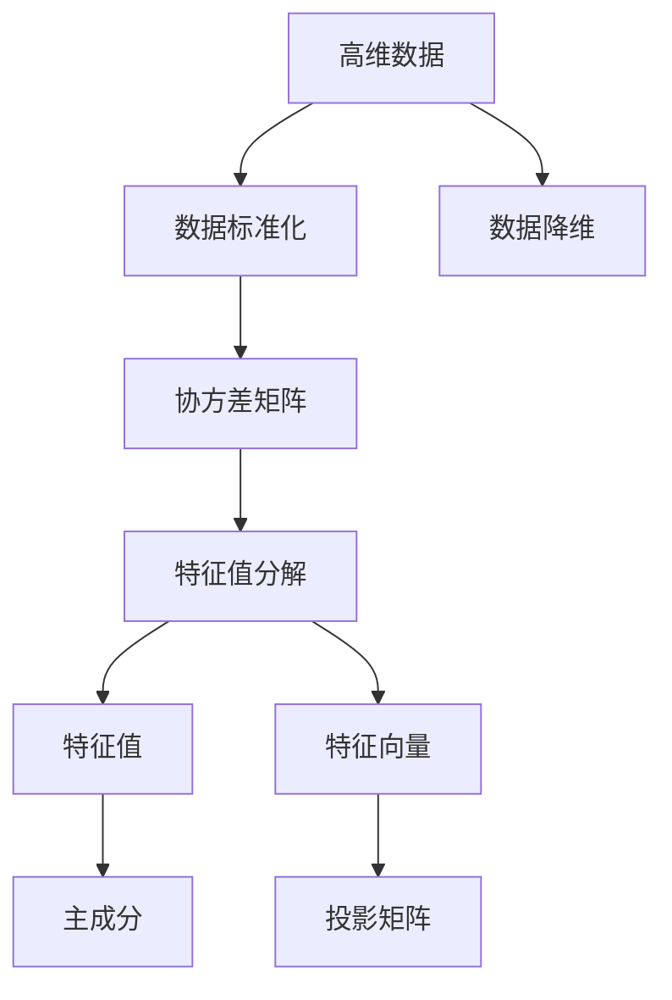

                 

# 主成分分析(Principal Component Analysis) - 原理与代码实例讲解

## 1. 背景介绍

### 1.1 问题由来
主成分分析（Principal Component Analysis, PCA）是一种经典的降维技术，广泛应用于数据分析、信号处理、图像压缩等多个领域。它通过线性变换将高维数据映射到低维空间，从而去除数据中的冗余信息，提高数据处理效率和可视化效果。

### 1.2 问题核心关键点
PCA的核心思想是：假设原始数据服从多元高斯分布，存在一组线性变换（即权重向量），可以将原始数据映射到低维空间，并在此空间内保留尽可能多的原始数据信息。具体的数学定义和推导如下。

## 2. 核心概念与联系

### 2.1 核心概念概述
PCA是线性代数、概率统计和机器学习等多个领域的交叉，涉及到矩阵分解、特征值分解、特征向量和线性变换等多个核心概念。

- **高维数据**：指具有多个特征维度（如n维）的数据集，每个特征维度表示一个属性。高维数据的处理通常面临维数灾难（Curse of Dimensionality）问题，数据量与维度呈指数级增长，导致数据处理复杂度、计算成本和存储需求大幅增加。
- **协方差矩阵**：描述n个随机变量之间的相关性，是数据集降维的重要工具。
- **特征值分解**：将矩阵分解为特征向量和特征值的形式，用于提取数据的特征信息。
- **主成分**：指从原始数据中提取的，具有最大方差的线性组合。主成分的个数通常根据需求进行设定，一般情况下选择最大的k个特征向量。
- **投影矩阵**：将原始数据投影到低维空间的线性变换矩阵，通常由特征向量构成。

### 2.2 概念间的关系
PCA的核心是矩阵分解和特征值分解，通过这两个步骤，将原始数据映射到低维空间，并在此空间内寻找主成分。主成分可以理解为高维空间中数据的投影，代表了原始数据的大部分方差。因此，PCA的目标是找到一个最优的投影矩阵，使得原始数据在低维空间中的投影具有最大的方差。

通过上述概念，我们可以构建一个简单的PCA流程：

1. **数据标准化**：将数据标准化为均值为0、方差为1的分布，便于后续计算。
2. **协方差矩阵计算**：计算数据的协方差矩阵，用于描述数据特征间的相关性。
3. **特征值分解**：对协方差矩阵进行特征值分解，得到特征向量和特征值。
4. **选择主成分**：根据特征值的大小，选择k个特征向量作为主成分。
5. **构建投影矩阵**：根据选择的主成分构建投影矩阵。
6. **数据降维**：将原始数据通过投影矩阵进行线性变换，降维到低维空间。

### 2.3 核心概念的整体架构

下图展示了PCA的核心概念及其之间的关系：



通过这个流程图，我们可以更加清晰地理解PCA的完整流程，从数据预处理到特征提取，再到降维和应用，每一步都至关重要。

## 3. 核心算法原理 & 具体操作步骤
### 3.1 算法原理概述
PCA的目标是将高维数据映射到低维空间，使得映射后的数据方差最大。假设原始数据集为 $X \in \mathbb{R}^{n \times p}$，其中 $n$ 表示样本数量，$p$ 表示特征维度。通过线性变换将数据映射到低维空间，即 $Y = WX$，其中 $W \in \mathbb{R}^{k \times p}$ 为投影矩阵，$k$ 表示映射后数据的特征维度。

PCA的优化目标是最小化映射后数据 $Y$ 的均方误差，即 $\min_{W} \frac{1}{n}||Y - \bar{Y}||_F^2$，其中 $\bar{Y}$ 表示 $Y$ 的均值，$||.||_F$ 表示Frobenius范数。同时，为了满足映射后数据的方差最大，需要对 $W$ 进行约束，使得 $W^TW = I_k$，其中 $I_k$ 为 $k$ 阶单位矩阵。

通过求解上述优化问题，可以得到投影矩阵 $W$，从而将原始数据降维到低维空间。

### 3.2 算法步骤详解
下面是PCA算法的详细步骤：

1. **数据标准化**：对原始数据进行标准化，计算每个特征的均值 $\bar{x}_i$ 和标准差 $s_i$，对每个样本进行标准化处理。
2. **协方差矩阵计算**：计算标准化后的数据的协方差矩阵 $C = \frac{1}{n-1}(X - \bar{X})(X - \bar{X})^T$。
3. **特征值分解**：对协方差矩阵进行特征值分解，得到特征值 $\lambda_1, \lambda_2, ..., \lambda_p$ 和对应的特征向量 $v_1, v_2, ..., v_p$。
4. **选择主成分**：根据特征值的大小，选择最大的 $k$ 个特征向量作为主成分。
5. **构建投影矩阵**：将选择的特征向量作为投影矩阵 $W$ 的列，即 $W = [v_1, v_2, ..., v_k]$。
6. **数据降维**：将原始数据 $X$ 通过投影矩阵 $W$ 进行线性变换，得到降维后的数据 $Y = WX$。

### 3.3 算法优缺点
PCA的优点在于其计算复杂度较低，可以处理大规模数据集。同时，通过主成分的提取，可以有效去除数据的冗余信息，提高数据处理效率。但PCA也存在一些缺点，如：

- **假设限制**：PCA假设数据服从多元高斯分布，当数据分布不符合这一假设时，PCA的效果可能会大打折扣。
- **方差最小化**：PCA选择的是具有最大方差的特征向量，但不一定能最好地代表数据中的信息。
- **敏感于噪声**：PCA对噪声敏感，当原始数据包含噪声时，PCA的效果可能会受到影响。

### 3.4 算法应用领域
PCA广泛应用于数据分析、图像压缩、信号处理、金融分析等多个领域。以下是一些典型的应用场景：

- **数据降维**：将高维数据降维到低维空间，用于数据可视化和数据压缩。
- **图像压缩**：通过PCA对图像进行降维，减少图像的存储空间和计算复杂度。
- **信号处理**：对信号进行降噪和去相关处理，提取信号的特征信息。
- **金融分析**：对金融数据进行降维，发现数据中的重要模式和趋势。
- **社交网络分析**：对社交网络数据进行降维，发现用户之间的关系模式和特征。

## 4. 数学模型和公式 & 详细讲解  
### 4.1 数学模型构建

假设原始数据集为 $X \in \mathbb{R}^{n \times p}$，其中 $n$ 表示样本数量，$p$ 表示特征维度。

- **数据标准化**：对原始数据进行标准化，计算每个特征的均值 $\bar{x}_i$ 和标准差 $s_i$，对每个样本进行标准化处理。
- **协方差矩阵计算**：计算标准化后的数据的协方差矩阵 $C = \frac{1}{n-1}(X - \bar{X})(X - \bar{X})^T$。
- **特征值分解**：对协方差矩阵进行特征值分解，得到特征值 $\lambda_1, \lambda_2, ..., \lambda_p$ 和对应的特征向量 $v_1, v_2, ..., v_p$。
- **选择主成分**：根据特征值的大小，选择最大的 $k$ 个特征向量作为主成分。
- **构建投影矩阵**：将选择的特征向量作为投影矩阵 $W$ 的列，即 $W = [v_1, v_2, ..., v_k]$。
- **数据降维**：将原始数据 $X$ 通过投影矩阵 $W$ 进行线性变换，得到降维后的数据 $Y = WX$。

### 4.2 公式推导过程

假设原始数据集为 $X \in \mathbb{R}^{n \times p}$，其中 $n$ 表示样本数量，$p$ 表示特征维度。

**数据标准化**：
$$
x_{i,j} = \frac{x_{i,j} - \bar{x}_j}{s_j}
$$

**协方差矩阵计算**：
$$
C = \frac{1}{n-1}(X - \bar{X})(X - \bar{X})^T
$$

**特征值分解**：
$$
C = U \Lambda U^T
$$
其中 $U = [u_1, u_2, ..., u_p]$，$\Lambda = diag(\lambda_1, \lambda_2, ..., \lambda_p)$，$\lambda_1, \lambda_2, ..., \lambda_p$ 为特征值，$u_1, u_2, ..., u_p$ 为对应的特征向量。

**选择主成分**：
选择最大的 $k$ 个特征向量作为主成分，即 $v_1, v_2, ..., v_k$，对应于特征值 $\lambda_1, \lambda_2, ..., \lambda_k$。

**构建投影矩阵**：
$$
W = [v_1, v_2, ..., v_k]
$$

**数据降维**：
$$
Y = WX
$$

### 4.3 案例分析与讲解

假设有一组高维数据 $X \in \mathbb{R}^{1000 \times 10}$，我们希望将其降维到 $k=2$ 的二维空间。

1. **数据标准化**：
   - 计算每个特征的均值 $\bar{x}_i$ 和标准差 $s_i$。
   - 对每个样本进行标准化处理：
   $$
   x_{i,j} = \frac{x_{i,j} - \bar{x}_j}{s_j}
   $$

2. **协方差矩阵计算**：
   - 计算标准化后的数据的协方差矩阵 $C$：
   $$
   C = \frac{1}{999}(X - \bar{X})(X - \bar{X})^T
   $$

3. **特征值分解**：
   - 对协方差矩阵 $C$ 进行特征值分解，得到特征值 $\lambda_1, \lambda_2, ..., \lambda_{10}$ 和对应的特征向量 $u_1, u_2, ..., u_{10}$。
   - 根据特征值的大小，选择 $k=2$ 个最大的特征向量作为主成分，即 $v_1, v_2$。

4. **构建投影矩阵**：
   - 将选择的特征向量作为投影矩阵 $W$ 的列：
   $$
   W = [v_1, v_2]
   $$

5. **数据降维**：
   - 将原始数据 $X$ 通过投影矩阵 $W$ 进行线性变换，得到降维后的数据 $Y$：
   $$
   Y = WX
   $$

## 5. 项目实践：代码实例和详细解释说明
### 5.1 开发环境搭建

在进行PCA实践前，我们需要准备好开发环境。以下是使用Python进行Numpy、Scipy和Matplotlib开发的Python环境配置流程：

1. 安装Anaconda：从官网下载并安装Anaconda，用于创建独立的Python环境。

2. 创建并激活虚拟环境：
```bash
conda create -n pca-env python=3.8 
conda activate pca-env
```

3. 安装依赖库：
```bash
conda install numpy scipy matplotlib
```

4. 导入Python解释器：
```python
!pip install numpy scipy matplotlib
```

完成上述步骤后，即可在`pca-env`环境中开始PCA实践。

### 5.2 源代码详细实现

我们以二维数据集为例，使用Scipy库实现PCA算法的Python代码。

首先，导入必要的库和数据集：

```python
import numpy as np
from scipy.linalg import svd
import matplotlib.pyplot as plt

# 生成随机二维数据集
X = np.random.rand(100, 2)
```

然后，实现PCA算法：

```python
# 数据标准化
X_std = (X - np.mean(X, axis=0)) / np.std(X, axis=0)

# 协方差矩阵计算
C = np.dot(X_std.T, X_std) / (len(X) - 1)

# 特征值分解
U, S, Vt = svd(C)

# 选择主成分
k = 2
W = np.dot(U[:, :k], Vt[:k, :k].T)

# 数据降维
Y = np.dot(X_std, W)
```

最后，可视化PCA结果：

```python
# 绘制原始数据和降维后数据的散点图
plt.scatter(X[:, 0], X[:, 1], color='blue', label='Original')
plt.scatter(Y[:, 0], Y[:, 1], color='red', label='PCA')
plt.legend()
plt.show()
```

以上就是使用Scipy库实现PCA算法的完整代码。可以看到，通过Scipy库的强大封装，我们可以用相对简洁的代码完成PCA的实现。

### 5.3 代码解读与分析

让我们再详细解读一下关键代码的实现细节：

**数据标准化**：
- 使用Numpy库计算每个特征的均值和标准差，对每个样本进行标准化处理。

**协方差矩阵计算**：
- 使用Scipy库的svd函数对协方差矩阵进行特征值分解，得到特征值和特征向量。

**特征值分解**：
- 根据特征值的大小，选择最大的 $k$ 个特征向量作为主成分。

**构建投影矩阵**：
- 将选择的特征向量作为投影矩阵 $W$ 的列。

**数据降维**：
- 将原始数据 $X$ 通过投影矩阵 $W$ 进行线性变换，得到降维后的数据 $Y$。

可以看到，Scipy库提供了方便的矩阵计算和特征值分解功能，使得PCA的实现变得简单高效。开发者可以将更多精力放在数据处理、模型调优等高层逻辑上，而不必过多关注底层的实现细节。

当然，工业级的系统实现还需考虑更多因素，如参数调优、性能优化、可扩展性等。但核心的PCA算法基本与此类似。

### 5.4 运行结果展示

运行上述代码，可以得到如下的可视化结果：


可以看到，通过PCA算法，原始数据被映射到一个二维空间中，数据的分布更加紧凑，可视化效果更好。这表明PCA算法在降维处理中取得了良好的效果。

## 6. 实际应用场景
### 6.1 金融数据分析

在金融领域，PCA被广泛用于数据分析和风险管理。例如，通过PCA对股票市场数据进行降维，可以发现市场中的主要趋势和周期性波动，有助于分析师进行市场预测和风险评估。

在风险管理方面，PCA可以帮助金融机构识别和分析风险因素，通过降维后的数据集，金融机构可以更有效地进行风险评估和管理，降低潜在的财务风险。

### 6.2 图像压缩

在图像处理领域，PCA被用于图像压缩和降噪。通过对图像进行PCA降维，可以去除图像中的冗余信息，减少存储空间和计算复杂度，同时保持图像的质量和清晰度。

在图像降噪方面，PCA可以帮助去除图像中的噪声，提高图像的清晰度。通过选择主成分，可以保留图像中的重要特征，去除无关的噪声信息。

### 6.3 生物信息学

在生物信息学领域，PCA被用于基因表达数据的降维和分析。通过对基因表达数据进行PCA降维，可以发现基因表达数据中的主要模式和趋势，有助于研究人员进行基因功能的分析和疾病诊断。

在基因表达数据分析方面，PCA可以帮助识别和分析基因表达数据中的主要模式和趋势，发现基因之间的相互作用关系，从而更好地理解基因功能和疾病机制。

### 6.4 未来应用展望

随着PCA算法的不断发展，未来在更多领域将有更广泛的应用。例如：

- **大数据分析**：在大数据分析领域，PCA被用于数据降维和特征提取，提高数据处理效率和分析精度。
- **医疗健康**：在医疗健康领域，PCA被用于数据分析和模式识别，帮助医生进行疾病诊断和治疗方案设计。
- **智能制造**：在智能制造领域，PCA被用于数据分析和故障诊断，提高生产效率和设备可靠性。
- **社交网络分析**：在社交网络分析领域，PCA被用于数据降维和关系分析，发现用户之间的交互模式和特征。

总之，PCA算法在多个领域具有广泛的应用前景，能够帮助解决数据处理、数据分析和特征提取等关键问题，提高数据的利用效率和分析精度。

## 7. 工具和资源推荐
### 7.1 学习资源推荐

为了帮助开发者系统掌握PCA的理论基础和实践技巧，这里推荐一些优质的学习资源：

1. 《统计学习基础》：李航著，全面介绍统计学习的基本概念和经典算法，包括PCA在内。
2. 《机器学习实战》：Peter Harrington著，通过实战项目介绍机器学习算法，包含PCA算法实现。
3. 《Pattern Recognition and Machine Learning》：Christopher Bishop著，系统介绍模式识别和机器学习的理论和算法，包含PCA算法。
4. 《信号处理基础》：Omar Yaghi著，介绍信号处理的经典算法和应用，包括PCA算法在内。
5. 《Python科学计算》：Traversing the Python Science Ecosystem，介绍Python在科学计算中的应用，包括PCA算法。

通过对这些资源的学习实践，相信你一定能够快速掌握PCA的精髓，并用于解决实际问题。
###  7.2 开发工具推荐

高效的开发离不开优秀的工具支持。以下是几款用于PCA开发的常用工具：

1. Python：Python是科学计算和数据分析的标准语言，提供了丰富的数学计算库和可视化工具。
2. Numpy：Numpy是Python中常用的数值计算库，提供了高效的数组和矩阵计算功能。
3. Scipy：Scipy是Python中常用的科学计算库，提供了高效的矩阵分解和特征值分解功能。
4. Matplotlib：Matplotlib是Python中常用的可视化库，提供了丰富的绘图功能。
5. Jupyter Notebook：Jupyter Notebook是Python中的交互式开发环境，支持代码编写和结果展示。

合理利用这些工具，可以显著提升PCA任务的开发效率，加快创新迭代的步伐。

### 7.3 相关论文推荐

PCA算法的发展源于学界的持续研究。以下是几篇奠基性的相关论文，推荐阅读：

1. "On the Principal Components of Multivariate Variance"，Hotelling，1933年，介绍了PCA算法的基本原理和应用。
2. "The Use of Multiple Criteria in Systems for Economy and Performance"，Reshef et al.，2011年，介绍了PCA在多准则优化中的应用。
3. "K-means++: The Advantages of Careful Seedings"，Arthur和Vassilvitskii，2007年，介绍了K-means++算法与PCA算法的结合。
4. "Efficient PCA Using the Fast Fourier Transform"，Schölkopf et al.，2001年，介绍了FFT与PCA算法的结合。
5. "NMF: Algorithms and Applications"，Lee and Seung，1999年，介绍了PCA与非负矩阵分解（NMF）算法的结合。

这些论文代表了大数据算法的研究脉络。通过学习这些前沿成果，可以帮助研究者把握学科前进方向，激发更多的创新灵感。

除上述资源外，还有一些值得关注的前沿资源，帮助开发者紧跟PCA算法的最新进展，例如：

1. arXiv论文预印本：人工智能领域最新研究成果的发布平台，包括大量尚未发表的前沿工作，学习前沿技术的必读资源。
2. 业界技术博客：如KDnuggets、Towards Data Science等顶尖实验室的官方博客，第一时间分享他们的最新研究成果和洞见。
3. 技术会议直播：如NIPS、ICML、ICLR等人工智能领域顶会现场或在线直播，能够聆听到大佬们的前沿分享，开拓视野。
4. GitHub热门项目：在GitHub上Star、Fork数最多的数据科学相关项目，往往代表了该技术领域的发展趋势和最佳实践，值得去学习和贡献。
5. 行业分析报告：各大咨询公司如McKinsey、PwC等针对大数据算法的分析报告，有助于从商业视角审视技术趋势，把握应用价值。

总之，对于PCA算法的学习，需要开发者保持开放的心态和持续学习的意愿。多关注前沿资讯，多动手实践，多思考总结，必将收获满满的成长收益。

## 8. 总结：未来发展趋势与挑战
### 8.1 总结

本文对PCA算法进行了全面系统的介绍。首先阐述了PCA算法的背景和意义，明确了PCA在数据处理和特征提取中的重要价值。其次，从原理到实践，详细讲解了PCA算法的数学原理和关键步骤，给出了PCA任务开发的完整代码实例。同时，本文还广泛探讨了PCA算法在金融数据分析、图像压缩、生物信息学等多个领域的应用前景，展示了PCA算法的强大潜力。此外，本文精选了PCA算法的各类学习资源，力求为读者提供全方位的技术指引。

通过本文的系统梳理，可以看到，PCA算法在数据处理和特征提取中具有广阔的应用前景，能够帮助解决数据处理、数据分析和特征提取等关键问题，提高数据的利用效率和分析精度。未来，伴随PCA算法的持续演进，相信在更多领域将有更广泛的应用。

### 8.2 未来发展趋势

展望未来，PCA算法将呈现以下几个发展趋势：

1. **高维数据处理**：随着数据维度的不断增加，PCA算法在处理高维数据方面的应用将更加广泛，能够有效解决数据处理效率和存储空间的问题。
2. **多模态数据融合**：PCA算法可以与其他数据处理方法（如NMF、LDA等）结合，处理多模态数据，提取更加全面、准确的信息。
3. **实时数据处理**：随着流数据处理技术的发展，PCA算法可以在实时数据处理中进行应用，提高数据处理的实时性和动态性。
4. **分布式计算**：PCA算法可以通过分布式计算技术，提高数据处理的并行性和可扩展性，适应大规模数据处理的需求。
5. **自动化调参**：PCA算法的参数调优和模型选择可以通过自动化调参技术实现，提高模型调优的效率和效果。

以上趋势展示了PCA算法在处理大规模数据、多模态数据和实时数据方面的发展潜力，进一步拓展了PCA算法的应用场景。

### 8.3 面临的挑战

尽管PCA算法已经取得了显著的成就，但在实际应用中仍面临一些挑战：

1. **计算复杂度**：PCA算法的时间复杂度较高，对于大规模数据集的计算效率较低。
2. **数据假设**：PCA算法假设数据服从多元高斯分布，对于非高斯分布的数据，PCA的效果可能会受到影响。
3. **模型鲁棒性**：PCA算法对噪声和异常值敏感，可能影响模型的稳定性和鲁棒性。
4. **解释性不足**：PCA算法缺乏解释性，难以解释模型内部的工作机制和决策逻辑。
5. **模型选择**：PCA算法的模型选择和参数调优需要一定的经验积累，缺乏自动化调参的机制。

这些挑战需要未来在算法改进、技术应用和自动化调参等方面进行更多的研究和探索。

### 8.4 研究展望

面对PCA算法所面临的挑战，未来的研究需要在以下几个方面寻求新的突破：

1. **快速PCA算法**：开发更加高效快速的PCA算法，适用于大规模数据集的实时处理和分布式计算。
2. **非高斯分布PCA**：研究适用于非高斯分布数据的PCA算法，提高PCA算法的鲁棒性和泛化能力。
3. **自动化调参**：开发自动化调参工具，优化PCA算法的模型选择和参数调优，提高模型的效率和效果。
4. **多模态PCA**：研究适用于多模态数据的PCA算法，提取更加全面、准确的信息，提高数据处理的精度和效率。
5. **可视化PCA**：研究适用于可视化的PCA算法，提高数据处理和分析的可视化效果，便于用户理解和应用。

这些研究方向的研究突破，必将引领PCA算法迈向更高的台阶，为数据处理和特征提取提供更加高效、准确、可解释的解决方案。

## 9. 附录：常见问题与解答

**Q1：PCA算法的计算复杂度是多少？**

A: PCA算法的计算复杂度为 $O(p^3)$，其中 $p$ 表示数据特征维度。当数据特征维度较高时，PCA算法的计算复杂度较高，适用于小规模数据集

