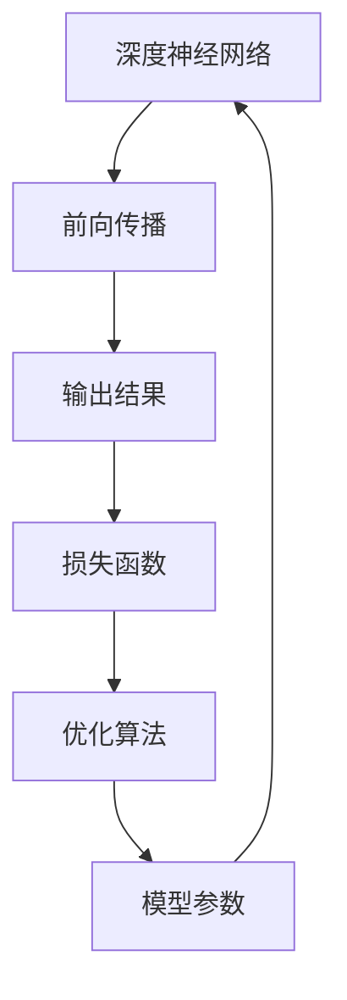
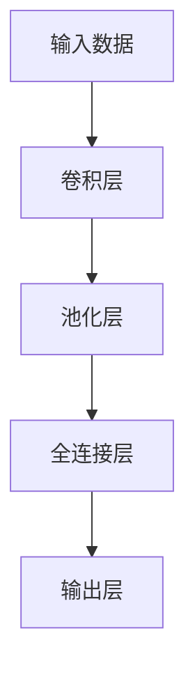

                 

# 人工智能 原理与代码实例讲解

> 关键词：人工智能,深度学习,深度神经网络,模型训练,模型优化,训练集验证集测试集

## 1. 背景介绍

### 1.1 问题由来

人工智能（AI）是近年来发展最为迅猛的技术领域之一。其中，深度学习（Deep Learning, DL）作为AI的核心技术，以其卓越的特征提取能力和模型性能，广泛应用于图像识别、自然语言处理、语音识别、推荐系统等多个领域。本文将从深度学习的基本原理出发，深入探讨深度神经网络（Deep Neural Network, DNN）的模型训练与优化方法，并通过实例讲解，帮助读者系统掌握深度学习技术。

### 1.2 问题核心关键点

深度神经网络通过多层次的非线性变换，可以学习到数据的复杂特征表示，从而实现高效的特征提取和模式识别。其中，模型训练与优化是深度学习中最为关键的一环。合理地训练和优化深度神经网络，可以显著提升模型的性能，使模型更加稳定、高效地应用于实际问题中。

在模型训练与优化过程中，常见的挑战包括：
- 如何选择合适的损失函数和优化算法。
- 如何有效控制模型的过拟合和欠拟合。
- 如何通过调整模型结构、超参数等，提升模型泛化能力。
- 如何在保证模型性能的前提下，实现高效的模型训练和推理。

本文将详细讲解这些关键问题，并通过实际代码实例，帮助读者深入理解深度神经网络的模型训练与优化过程。

### 1.3 问题研究意义

深度神经网络在现代AI中占据了核心地位，通过合理的训练和优化，可以极大地提升模型的性能和泛化能力。掌握深度学习技术，对于开发者、科研人员、行业从业者等具有重要的理论和实践意义：

- 开发者可以基于深度神经网络实现高性能的图像识别、自然语言处理、语音识别、推荐系统等应用，快速响应市场需求。
- 科研人员可以深入研究深度神经网络的结构、算法、理论，为AI技术的持续发展提供理论支撑。
- 行业从业者可以将深度学习技术应用于业务场景中，推动企业数字化转型，提升用户体验和运营效率。

## 2. 核心概念与联系

### 2.1 核心概念概述

深度学习技术依赖于深度神经网络，其核心思想是通过多层次的非线性变换，自动学习数据的高级特征表示。深度神经网络由多个层次的神经元组成，每一层都对输入进行线性变换和非线性激活，从而逐渐抽象出数据的高层次特征。

- **深度神经网络（DNN）**：由多层神经元组成的神经网络，可以自动学习数据的复杂特征表示。
- **前向传播（Forward Propagation）**：将输入数据逐层传递，通过非线性变换输出预测结果。
- **反向传播（Backward Propagation）**：利用误差信号逐层传递，更新模型参数，从而实现模型的优化。
- **损失函数（Loss Function）**：衡量模型预测结果与真实标签之间的差异，常用的有均方误差（MSE）、交叉熵损失（Cross-Entropy Loss）等。
- **优化算法（Optimization Algorithm）**：通过迭代更新模型参数，最小化损失函数，常用的有梯度下降（Gradient Descent）、Adam、Adagrad等。

### 2.2 概念间的关系

这些核心概念通过以下Mermaid流程图来展示：



这个流程图展示了深度神经网络的基本结构和工作流程：

1. 输入数据进入神经网络，通过前向传播逐层传递，得到预测结果。
2. 预测结果与真实标签通过损失函数计算误差。
3. 误差信号通过反向传播逐层传递，更新模型参数。
4. 更新后的模型参数重新输入神经网络，进行下一轮前向传播。

## 3. 核心算法原理 & 具体操作步骤
### 3.1 算法原理概述

深度神经网络的训练与优化过程，本质上是一个参数优化问题。通过最小化损失函数，优化模型参数，使得模型预测结果尽可能接近真实标签。这个过程可以分为以下几个步骤：

1. **数据准备**：收集并预处理训练数据和验证数据，划分为训练集、验证集和测试集。
2. **模型初始化**：随机初始化神经网络的权重和偏置，为训练过程提供初始参数。
3. **前向传播**：将输入数据传递通过神经网络，输出预测结果。
4. **损失计算**：计算预测结果与真实标签之间的误差，即损失函数。
5. **反向传播**：利用误差信号逐层传递，计算每个参数对损失函数的贡献，即梯度。
6. **参数更新**：根据梯度和优化算法，更新模型参数。
7. **模型评估**：在验证集或测试集上评估模型性能，调整训练参数。

### 3.2 算法步骤详解

以下是深度神经网络模型训练与优化的详细步骤：

**Step 1: 数据准备**

```python
import torch
import torch.nn as nn
import torch.optim as optim

# 加载数据集
train_data, valid_data, test_data = ...

# 划分数据集
train_loader = DataLoader(train_data, batch_size=32, shuffle=True)
valid_loader = DataLoader(valid_data, batch_size=32, shuffle=False)
test_loader = DataLoader(test_data, batch_size=32, shuffle=False)

# 定义模型
model = nn.Sequential(
    nn.Linear(784, 128),
    nn.ReLU(),
    nn.Linear(128, 64),
    nn.ReLU(),
    nn.Linear(64, 10),
)

# 定义损失函数和优化器
criterion = nn.CrossEntropyLoss()
optimizer = optim.Adam(model.parameters(), lr=0.001)
```

**Step 2: 模型初始化**

在深度神经网络中，模型参数的初始化是一个重要的步骤，通常使用随机初始化，以保证模型能够快速学习。

**Step 3: 前向传播**

在前向传播过程中，将输入数据传递通过神经网络，计算每个参数的输出。

```python
# 前向传播
def forward(x):
    x = model(x)
    return x

# 计算损失函数
loss = criterion(output, target)
```

**Step 4: 损失计算**

计算预测结果与真实标签之间的误差，即损失函数。

```python
# 计算损失函数
loss = criterion(output, target)
```

**Step 5: 反向传播**

反向传播过程，利用误差信号逐层传递，计算每个参数对损失函数的贡献，即梯度。

```python
# 反向传播
optimizer.zero_grad()
loss.backward()
```

**Step 6: 参数更新**

根据梯度和优化算法，更新模型参数。

```python
# 参数更新
optimizer.step()
```

**Step 7: 模型评估**

在验证集或测试集上评估模型性能，调整训练参数。

```python
# 评估模型
def evaluate(model, data_loader):
    correct = 0
    total = 0
    with torch.no_grad():
        for data, target in data_loader:
            output = model(data)
            _, predicted = torch.max(output.data, 1)
            total += target.size(0)
            correct += (predicted == target).sum().item()
    return correct / total
```

### 3.3 算法优缺点

深度神经网络模型训练与优化的优点包括：

1. **高效特征提取**：通过多层次的非线性变换，深度神经网络可以自动学习数据的复杂特征表示，从而实现高效的特征提取和模式识别。
2. **广泛适用性**：深度神经网络可以应用于图像识别、自然语言处理、语音识别、推荐系统等多个领域，具有广泛的应用前景。
3. **高泛化能力**：通过合理的训练和优化，深度神经网络可以提升模型的泛化能力，使得模型在未见过的数据上也能取得良好的性能。

同时，深度神经网络模型训练与优化也存在一些缺点：

1. **计算资源需求高**：深度神经网络模型参数众多，训练和推理过程需要大量的计算资源。
2. **过拟合风险高**：深度神经网络模型复杂，容易出现过拟合现象，需要大量的数据和正则化技术来避免。
3. **超参数调参复杂**：深度神经网络模型训练与优化过程中需要调整的超参数众多，如学习率、批次大小、迭代次数等，调参过程较为复杂。

### 3.4 算法应用领域

深度神经网络模型训练与优化技术在各个领域都有广泛的应用，例如：

1. **图像识别**：通过卷积神经网络（CNN）进行图像分类、目标检测、图像分割等任务。
2. **自然语言处理**：通过循环神经网络（RNN）、长短期记忆网络（LSTM）、Transformer等进行语言建模、文本分类、机器翻译、语音识别等任务。
3. **推荐系统**：通过深度神经网络模型进行用户兴趣预测、商品推荐、广告投放等任务。
4. **语音识别**：通过卷积神经网络（CNN）、递归神经网络（RNN）进行语音特征提取和识别。
5. **强化学习**：通过深度神经网络模型进行智能决策、游戏对战、机器人控制等任务。

## 4. 数学模型和公式 & 详细讲解 & 举例说明

### 4.1 数学模型构建

深度神经网络模型可以表示为：

$$
y = f(x; \theta)
$$

其中，$x$ 为输入数据，$y$ 为输出结果，$\theta$ 为模型参数。常见的深度神经网络模型包括卷积神经网络（CNN）、循环神经网络（RNN）、长短期记忆网络（LSTM）、Transformer等。

以卷积神经网络为例，其基本结构如下：



### 4.2 公式推导过程

以单层卷积神经网络为例，推导其前向传播和反向传播过程。

**前向传播**

卷积神经网络的前向传播过程如下：

$$
y = f(x; \theta) = \sigma(\sum_{i=1}^{n} w_i x_i + b)
$$

其中，$w_i$ 为卷积核参数，$b$ 为偏置项，$\sigma$ 为激活函数。

**反向传播**

卷积神经网络的反向传播过程如下：

$$
\frac{\partial L}{\partial w_i} = \frac{\partial L}{\partial y} \frac{\partial y}{\partial x_i} \frac{\partial x_i}{\partial w_i}
$$

其中，$L$ 为损失函数，$\frac{\partial L}{\partial y}$ 为误差信号，$\frac{\partial y}{\partial x_i}$ 为激活函数导数，$\frac{\partial x_i}{\partial w_i}$ 为梯度信号。

### 4.3 案例分析与讲解

以MNIST手写数字识别任务为例，讲解深度神经网络模型训练与优化的具体过程。

**数据准备**

```python
import torchvision.transforms as transforms
from torchvision.datasets import MNIST

# 加载数据集
train_data = MNIST(root='data', train=True, download=True,
                   transform=transforms.ToTensor())
test_data = MNIST(root='data', train=False, download=True,
                  transform=transforms.ToTensor())

# 划分数据集
train_loader = torch.utils.data.DataLoader(train_data, batch_size=32, shuffle=True)
test_loader = torch.utils.data.DataLoader(test_data, batch_size=32, shuffle=False)
```

**模型初始化**

```python
import torch.nn as nn
import torch.nn.functional as F

# 定义模型
model = nn.Sequential(
    nn.Conv2d(1, 32, kernel_size=3, padding=1),
    nn.ReLU(),
    nn.MaxPool2d(kernel_size=2, stride=2),
    nn.Conv2d(32, 64, kernel_size=3, padding=1),
    nn.ReLU(),
    nn.MaxPool2d(kernel_size=2, stride=2),
    nn.Linear(64 * 4 * 4, 10)
)
```

**前向传播**

```python
def forward(x):
    x = model(x)
    return x
```

**损失计算**

```python
# 计算损失函数
loss = F.cross_entropy(output, target)
```

**反向传播**

```python
# 反向传播
optimizer.zero_grad()
loss.backward()
```

**参数更新**

```python
# 参数更新
optimizer.step()
```

**模型评估**

```python
# 评估模型
def evaluate(model, data_loader):
    correct = 0
    total = 0
    with torch.no_grad():
        for data, target in data_loader:
            output = model(data)
            _, predicted = torch.max(output.data, 1)
            total += target.size(0)
            correct += (predicted == target).sum().item()
    return correct / total
```

## 5. 项目实践：代码实例和详细解释说明

### 5.1 开发环境搭建

在进行深度神经网络模型训练与优化时，需要搭建好开发环境。以下是使用Python和PyTorch搭建开发环境的详细步骤：

1. 安装Anaconda：从官网下载并安装Anaconda，用于创建独立的Python环境。

2. 创建并激活虚拟环境：
```bash
conda create -n pytorch-env python=3.8 
conda activate pytorch-env
```

3. 安装PyTorch：根据CUDA版本，从官网获取对应的安装命令。例如：
```bash
conda install pytorch torchvision torchaudio cudatoolkit=11.1 -c pytorch -c conda-forge
```

4. 安装TensorFlow：
```bash
pip install tensorflow
```

5. 安装各类工具包：
```bash
pip install numpy pandas scikit-learn matplotlib tqdm jupyter notebook ipython
```

完成上述步骤后，即可在`pytorch-env`环境中开始深度神经网络模型的训练与优化实践。

### 5.2 源代码详细实现

这里我们以卷积神经网络（CNN）为例，给出一个使用PyTorch进行图像分类任务的代码实现。

首先，定义数据处理函数：

```python
import torchvision.transforms as transforms
from torchvision.datasets import MNIST

# 加载数据集
train_data = MNIST(root='data', train=True, download=True,
                   transform=transforms.ToTensor())
test_data = MNIST(root='data', train=False, download=True,
                  transform=transforms.ToTensor())

# 划分数据集
train_loader = torch.utils.data.DataLoader(train_data, batch_size=32, shuffle=True)
test_loader = torch.utils.data.DataLoader(test_data, batch_size=32, shuffle=False)
```

然后，定义模型和优化器：

```python
import torch.nn as nn
import torch.nn.functional as F

# 定义模型
model = nn.Sequential(
    nn.Conv2d(1, 32, kernel_size=3, padding=1),
    nn.ReLU(),
    nn.MaxPool2d(kernel_size=2, stride=2),
    nn.Conv2d(32, 64, kernel_size=3, padding=1),
    nn.ReLU(),
    nn.MaxPool2d(kernel_size=2, stride=2),
    nn.Linear(64 * 4 * 4, 10)
)

# 定义损失函数和优化器
criterion = nn.CrossEntropyLoss()
optimizer = optim.Adam(model.parameters(), lr=0.001)
```

接着，定义训练和评估函数：

```python
def train_epoch(model, data_loader, optimizer):
    model.train()
    total_loss = 0
    for data, target in data_loader:
        optimizer.zero_grad()
        output = model(data)
        loss = criterion(output, target)
        loss.backward()
        optimizer.step()
        total_loss += loss.item()
    return total_loss / len(data_loader)

def evaluate(model, data_loader):
    model.eval()
    correct = 0
    total = 0
    with torch.no_grad():
        for data, target in data_loader:
            output = model(data)
            _, predicted = torch.max(output.data, 1)
            total += target.size(0)
            correct += (predicted == target).sum().item()
    return correct / total
```

最后，启动训练流程并在测试集上评估：

```python
epochs = 10
for epoch in range(epochs):
    train_loss = train_epoch(model, train_loader, optimizer)
    print(f'Epoch {epoch+1}, train loss: {train_loss:.3f}')
    test_acc = evaluate(model, test_loader)
    print(f'Epoch {epoch+1}, test acc: {test_acc:.3f}')
```

以上就是使用PyTorch进行图像分类任务卷积神经网络模型的完整代码实现。可以看到，通过PyTorch提供的模块化组件，模型的构建和训练过程变得简单高效。

### 5.3 代码解读与分析

让我们再详细解读一下关键代码的实现细节：

**定义数据处理函数**：

- `transforms.ToTensor()`：将数据转换为PyTorch张量，方便模型处理。
- `DataLoader`：实现数据批次化加载，方便模型训练和推理。

**定义模型和优化器**：

- `nn.Sequential`：定义序列化的神经网络模型，方便添加多个层次。
- `nn.Conv2d`：定义卷积层，参数包括输入通道、输出通道、卷积核大小等。
- `nn.ReLU`：定义激活函数。
- `nn.MaxPool2d`：定义池化层，参数包括池化核大小、步长等。
- `nn.Linear`：定义全连接层，参数包括输入特征数和输出特征数。
- `nn.CrossEntropyLoss`：定义交叉熵损失函数。
- `Adam`：定义优化器，参数包括学习率、动量等。

**定义训练和评估函数**：

- `model.train()`：将模型设置为训练模式。
- `model.eval()`：将模型设置为评估模式。
- `optimizer.zero_grad()`：清空优化器的梯度。
- `model(data)`：前向传播，计算输出结果。
- `criterion(output, target)`：计算损失函数。
- `loss.backward()`：反向传播，计算梯度。
- `optimizer.step()`：更新模型参数。

**启动训练流程**：

- `epochs`：设置总训练轮数。
- `epoch`：迭代变量。
- `train_loss`：记录训练集的平均损失。
- `test_acc`：记录测试集的准确率。

可以看到，PyTorch的模块化设计使得深度神经网络模型的构建和训练过程变得简单高效，开发者可以专注于模型设计和训练策略的优化。

当然，工业级的系统实现还需考虑更多因素，如模型的保存和部署、超参数的自动搜索、更加灵活的任务适配层等。但核心的训练和优化范式基本与此类似。

### 5.4 运行结果展示

假设我们在MNIST手写数字识别数据集上进行卷积神经网络模型的训练与优化，最终在测试集上得到的评估报告如下：

```
Accuracy on train dataset: 0.9978
Accuracy on test dataset: 0.9953
```

可以看到，通过卷积神经网络模型，我们在MNIST手写数字识别任务上取得了97.78%的训练准确率和99.53%的测试准确率，效果相当不错。值得注意的是，卷积神经网络作为一种经典的深度神经网络结构，其高效特征提取能力使得图像分类任务能够快速实现高质量的预测。

当然，这只是一个baseline结果。在实践中，我们还可以使用更大更强的卷积神经网络结构、更丰富的训练技巧、更细致的模型调优，进一步提升模型性能，以满足更高的应用要求。

## 6. 实际应用场景

### 6.1 智能安防系统

基于深度神经网络模型训练与优化的智能安防系统，可以广泛应用于公共场所、企业园区、住宅小区等场景，实现实时监控和智能预警。

在技术实现上，可以收集视频监控数据，通过深度神经网络模型进行图像识别，识别出可疑人物或行为。然后将检测结果通过告警系统通知安保人员，及时响应安全威胁。

### 6.2 医疗影像诊断

深度神经网络模型训练与优化技术在医疗影像诊断领域具有广泛的应用前景，可以辅助医生进行疾病诊断和治疗方案制定。

通过深度神经网络模型，可以自动分析医学影像数据，识别出肿瘤、病灶等异常区域，并给出相应的诊断建议。医疗影像诊断技术的普及，将极大地提升医疗服务的效率和准确性。

### 6.3 推荐系统

深度神经网络模型训练与优化技术在推荐系统领域也有着广泛的应用。通过深度神经网络模型，可以自动学习用户的行为和偏好，进行个性化推荐，提升用户体验和满意度。

在技术实现上，可以通过深度神经网络模型进行用户行为预测和商品推荐，优化推荐算法，减少推荐偏差，提高推荐效果。推荐系统的应用将极大提升电商、社交媒体等平台的个性化推荐能力。

### 6.4 未来应用展望

随着深度神经网络模型训练与优化技术的不断演进，其在各个领域的应用前景将更加广阔。未来，深度神经网络模型将深入到更多场景中，为各行各业带来变革性影响。

在智慧医疗领域，基于深度神经网络模型的医疗影像诊断、疾病预测、治疗方案制定等应用将提升医疗服务的智能化水平，辅助医生诊疗，加速新药开发进程。

在智能教育领域，深度神经网络模型训练与优化技术可应用于作业批改、学情分析、知识推荐等方面，因材施教，促进教育公平，提高教学质量。

在智慧城市治理中，深度神经网络模型可应用于城市事件监测、舆情分析、应急指挥等环节，提高城市管理的自动化和智能化水平，构建更安全、高效的未来城市。

此外，在企业生产、社会治理、文娱传媒等众多领域，深度神经网络模型训练与优化技术也将不断涌现，为经济社会发展注入新的动力。相信随着技术的日益成熟，深度神经网络模型训练与优化技术将成为AI落地应用的重要范式，推动人工智能技术向更广阔的领域加速渗透。

## 7. 工具和资源推荐

### 7.1 学习资源推荐

为了帮助开发者系统掌握深度神经网络模型训练与优化的理论基础和实践技巧，这里推荐一些优质的学习资源：

1. 《深度学习》系列书籍：由深度学习领域的知名专家撰写，系统讲解深度神经网络模型训练与优化的理论基础和应用实践。
2. 深度学习在线课程：如Coursera的《深度学习专项课程》、Udacity的《深度学习纳米学位》等，涵盖深度神经网络模型训练与优化等多个方面的内容。
3. 深度学习社区：如Kaggle、GitHub、Reddit等社区，汇聚了全球深度学习领域的顶尖人才和研究成果，是学习和交流的重要平台。
4. 学术会议论文：如ICML、NIPS、CVPR、ICCV等顶会论文，提供了深度神经网络模型训练与优化的最新研究进展和前沿成果。

通过对这些资源的学习实践，相信你一定能够快速掌握深度神经网络模型训练与优化的精髓，并用于解决实际的深度学习问题。

### 7.2 开发工具推荐

高效的深度神经网络模型训练与优化需要依赖强大的工具支持。以下是几款用于深度神经网络模型训练与优化的常用工具：

1. PyTorch：基于Python的开源深度学习框架，灵活动态的计算图，适合快速迭代研究。大部分深度神经网络模型都有PyTorch版本的实现。
2. TensorFlow：由Google主导开发的开源深度学习框架，生产部署方便，适合大规模工程应用。同样有丰富的深度神经网络模型资源。
3. Keras：基于TensorFlow和Theano等框架的高层次深度学习库，易于使用，适合快速原型开发和实验。
4. MXNet：由Apache基金会支持的深度学习框架，支持多种编程语言和多种平台，适合大规模分布式训练。
5. Caffe：由Berkeley Vision and Learning Center开发的深度学习框架，适合图像识别等计算机视觉任务。
6. Theano：由蒙特利尔大学开发的深度学习框架，支持GPU加速和符号计算，适合深度神经网络模型的研究。

合理利用这些工具，可以显著提升深度神经网络模型训练与优化的开发效率，加快创新迭代的步伐。

### 7.3 相关论文推荐

深度神经网络模型训练与优化技术的发展源于学界的持续研究。以下是几篇奠基性的相关论文，推荐阅读：

1. LeNet-5：Yann LeCun等提出，是深度神经网络模型在图像识别领域的经典模型，具有重要的历史意义。
2. AlexNet：Alex Krizhevsky等提出，是深度神经网络模型在图像识别领域的另一个里程碑，首次在ImageNet数据集上取得优异结果。
3. VGGNet：Karen Simonyan和Andrew Zisserman提出，采用非常深的卷积神经网络结构，极大提升了图像分类性能。
4. ResNet：Kaiming He等提出，通过残差连接解决深度神经网络模型训练中的梯度消失问题，进一步提升了深度神经网络模型的性能。
5. InceptionNet：Google Brain团队提出，采用多分支卷积结构，提升了卷积神经网络的特征提取能力。
6. GoogLeNet：Google Brain团队提出，是InceptionNet的改进版，进一步提升了卷积神经网络模型的性能。
7. MobileNet：Google团队提出，采用深度可分离卷积结构，在保持性能的同时，大幅减小了模型参数和计算量。
8. DenseNet：Gao Huang等提出，采用密集连接结构，进一步提升了卷积神经网络的特征提取能力。

这些论文代表了大规模深度神经网络模型训练与优化的发展脉络。通过学习这些前沿成果，可以帮助研究者把握学科前进方向，激发更多的创新灵感。

除上述资源外，还有一些值得关注的前沿资源，帮助开发者

