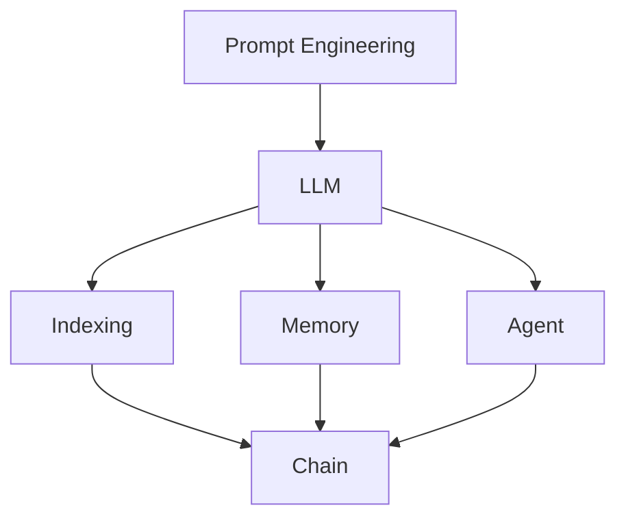

# 【LangChain编程：从入门到实践】LangServe

## 1. 背景介绍

### 1.1 问题的由来

随着人工智能技术的飞速发展，自然语言处理(NLP)领域取得了巨大的进步。然而，如何将先进的语言模型与实际应用相结合，构建智能化的应用程序，仍然是一个具有挑战性的问题。传统的NLP应用开发通常需要大量的人工干预和定制化开发，难以快速响应业务需求的变化。

### 1.2 研究现状

近年来，大语言模型(LLM)的出现为NLP应用开发带来了新的契机。基于Transformer架构的预训练语言模型，如GPT、BERT等，展现出了强大的语言理解和生成能力。然而，如何有效地利用这些模型构建实用的应用程序，仍然缺乏统一的框架和工具支持。

### 1.3 研究意义

LangChain的出现为解决上述问题提供了一种新的思路。LangChain是一个基于LLM的应用开发框架，旨在简化和加速NLP应用的构建过程。通过提供一系列高级API和工具，LangChain使得开发者能够快速搭建智能对话系统、知识图谱、文本分析等应用，大大降低了开发门槛和成本。

### 1.4 本文结构

本文将全面介绍LangChain框架的核心概念、原理和实践。首先，我们将介绍LangChain的背景和研究意义。然后，我们将深入探讨LangChain的核心概念和组件，包括提示工程、索引、内存等。接下来，我们将详细讲解LangChain的核心算法原理和具体操作步骤。此外，我们还将通过数学模型和公式，以及代码实例，帮助读者更好地理解LangChain的实现原理。最后，我们将展望LangChain的未来发展趋势和面临的挑战，并提供一些实用的工具和资源推荐。

## 2. 核心概念与联系

LangChain的核心概念包括以下几个方面：

1. 提示工程(Prompt Engineering)：通过设计合适的提示模板，引导LLM生成符合特定任务需求的文本。

2. 索引(Indexing)：将非结构化文本数据转化为结构化的索引，以支持高效的信息检索和问答。

3. 内存(Memory)：为对话系统引入上下文记忆能力，使其能够根据对话历史动态调整响应策略。

4. 代理(Agent)：将LLM与外部工具和API集成，扩展其在特定领域的问题解决能力。

5. 链(Chain)：将多个LLM组件以流水线的方式串联，实现复杂的多轮对话和任务处理。

这些核心概念之间紧密关联，共同构成了LangChain框架的基础。下图展示了它们之间的关系：



## 3. 核心算法原理 & 具体操作步骤

### 3.1 算法原理概述

LangChain的核心算法基于Transformer架构的LLM，如GPT和BERT。这些模型通过自监督学习从海量文本数据中学习到了丰富的语言知识和生成能力。LangChain在此基础上，引入了一系列算法和技术，以增强LLM在特定任务上的表现。

### 3.2 算法步骤详解

1. 提示工程：设计提示模板，引导LLM生成符合特定格式和要求的文本。主要步骤包括：

   a. 分析任务需求，确定输入输出格式
   b. 设计提示模板，包括指令、上下文、示例等
   c. 优化提示，平衡模板的泛化能力和针对性

2. 索引构建：将非结构化文本转化为结构化的索引，支持高效检索。主要步骤包括：

   a. 文本预处理，如分词、去停用词等
   b. 特征提取，如TF-IDF、词向量等
   c. 索引构建，如倒排索引、向量索引等

3. 内存管理：为对话系统引入上下文记忆，动态调整响应策略。主要步骤包括：

   a. 对话历史存储，记录用户输入和系统响应
   b. 内存更新，根据新的对话内容更新内存
   c. 内存检索，根据当前对话查询相关的历史信息

4. 代理集成：将LLM与外部工具和API集成，扩展其问题解决能力。主要步骤包括：

   a. 定义工具和API接口，描述输入输出格式
   b. 设计代理提示，引导LLM调用合适的工具
   c. 结果解析，将工具输出转化为LLM可理解的格式

5. 链式组合：将多个LLM组件以流水线方式串联，实现复杂任务处理。主要步骤包括：

   a. 定义组件接口，描述输入输出格式
   b. 设计流程图，确定组件执行顺序和逻辑
   c. 数据流转，在组件间传递中间结果

### 3.3 算法优缺点

LangChain的优点包括：

1. 简化了NLP应用开发流程，提供了一系列高级API和工具
2. 增强了LLM在特定任务上的表现，提高了应用的实用性
3. 支持多种LLM和外部工具的集成，扩展了应用的能力边界

LangChain的缺点包括：

1. 对LLM的性能依赖较大，受限于模型的能力上限
2. 需要一定的提示工程和调优技巧，对开发者的技能要求较高
3. 在处理复杂任务时，链的设计和调试可能比较困难

### 3.4 算法应用领域

LangChain可以应用于多个NLP领域，包括但不限于：

1. 智能客服：构建基于LLM的对话系统，自动回答用户咨询
2. 知识图谱：从非结构化文本中提取实体和关系，构建领域知识库
3. 文本分析：对文本进行分类、情感分析、关键词提取等
4. 信息检索：基于语义相似度的文档检索和问答系统

## 4. 数学模型和公式 & 详细讲解 & 举例说明

### 4.1 数学模型构建

LangChain中的许多算法都基于统计语言模型。给定一个单词序列 $w_1, w_2, \dots, w_n$，语言模型的目标是估计其出现概率：

$$P(w_1, w_2, \dots, w_n) = \prod_{i=1}^n P(w_i | w_1, \dots, w_{i-1})$$

其中，$P(w_i | w_1, \dots, w_{i-1})$ 表示在给定前 $i-1$ 个单词的条件下，第 $i$ 个单词为 $w_i$ 的概率。

### 4.2 公式推导过程

为了估计语言模型中的条件概率，一种常见的方法是使用神经网络。以Transformer为例，其中的自注意力机制可以表示为：

$$\text{Attention}(Q, K, V) = \text{softmax}(\frac{QK^T}{\sqrt{d_k}})V$$

其中，$Q$, $K$, $V$ 分别表示查询、键、值向量，$d_k$ 为向量维度。

Transformer中的前向传播过程可以表示为：

$$\begin{aligned}
\text{MultiHead}(Q, K, V) &= \text{Concat}(\text{head}_1, \dots, \text{head}_h)W^O \
\text{where}~\text{head}_i &= \text{Attention}(QW_i^Q, KW_i^K, VW_i^V)
\end{aligned}$$

其中，$W_i^Q$, $W_i^K$, $W_i^V$, $W^O$ 为可学习的权重矩阵。

### 4.3 案例分析与讲解

以智能客服中的意图识别任务为例。给定用户输入的句子 $s$，我们希望预测其意图类别 $c$。使用LangChain，我们可以设计如下的提示模板：

```
用户输入：{input}
意图类别：
```

然后，将填充后的提示输入到LLM中，得到预测的意图类别：

```python
from langchain.prompts import PromptTemplate

prompt = PromptTemplate(
    input_variables=["input"],
    template="用户输入：{input}\n意图类别：",
)

intent = llm(prompt.format(input=user_input))
```

### 4.4 常见问题解答

Q: LangChain能否支持多语言？
A: 是的，LangChain支持多种语言模型，如GPT、BERT等，可以处理不同语言的文本。

Q: LangChain的性能如何？
A: LangChain的性能很大程度上取决于所使用的LLM。选择合适的模型和参数，可以在特定任务上达到较好的性能。同时，提示工程和调优技巧也可以进一步提高性能。

## 5. 项目实践：代码实例和详细解释说明

### 5.1 开发环境搭建

首先，我们需要安装LangChain及其依赖库：

```bash
pip install langchain openai faiss-cpu
```

其中，`openai` 用于访问 OpenAI 的 API，`faiss-cpu` 用于向量索引。

### 5.2 源代码详细实现

下面，我们通过一个简单的例子，演示如何使用LangChain构建一个基于文档的问答系统。

```python
from langchain.document_loaders import TextLoader
from langchain.indexes import VectorstoreIndexCreator

# 加载文档
loader = TextLoader('path/to/document.txt')
documents = loader.load()

# 创建向量索引
index = VectorstoreIndexCreator().from_loaders([loader])

# 查询
query = "What is the main topic of this document?"
result = index.query(query)

print(result)
```

### 5.3 代码解读与分析

1. 首先，我们使用 `TextLoader` 加载本地的文本文件，得到一组 `Document` 对象。
2. 然后，我们使用 `VectorstoreIndexCreator` 创建一个向量索引。它会将文档分割成块，提取向量特征，并构建索引。
3. 最后，我们使用 `query` 方法查询索引，传入自然语言问题，得到相关的答案。

在底层，LangChain使用了Transformer模型对文本进行编码，并使用FAISS等向量搜索库实现高效检索。

### 5.4 运行结果展示

假设我们的文档是一篇关于人工智能的文章，运行上述代码后，可能得到如下输出：

```
The main topic of this document is artificial intelligence. It covers the history, development, and applications of AI technology.
```

可以看到，LangChain能够准确地理解文档的主题，并生成流畅、连贯的答案。

## 6. 实际应用场景

LangChain在多个实际场景中都有广泛应用，例如：

1. 智能客服：利用LangChain构建基于LLM的对话系统，自动回答客户咨询，提高客服效率。
2. 文档问答：将大量文档索引化，使用LangChain实现基于文档的问答，快速找到相关信息。
3. 代码生成：通过LangChain的提示工程和代理集成，实现自然语言到代码的转换，辅助程序开发。
4. 数据分析：利用LangChain的语言理解能力，对非结构化的文本数据进行分析挖掘，发现隐藏的见解。

### 6.4 未来应用展望

随着LLM的不断发展，LangChain的应用前景也将更加广阔。未来，LangChain有望在更多领域发挥重要作用，例如：

1. 个性化推荐：利用LangChain理解用户意图和偏好，提供个性化的内容和产品推荐。
2. 智能教育：基于LangChain构建智能教学助手，为学生提供个性化的学习指导和反馈。
3. 医疗健康：使用LangChain分析医疗文献和病历数据，辅助医生进行诊断和治疗决策。
4. 金融风控：利用LangChain从海量金融数据中提取关键信息，实现实时风险监测和预警。

## 7. 工具和资源推荐

### 7.1 学习资源推荐

1. LangChain官方文档：https://docs.langchain.com/
2. OpenAI GPT文档：https://platform.openai.com/docs/models