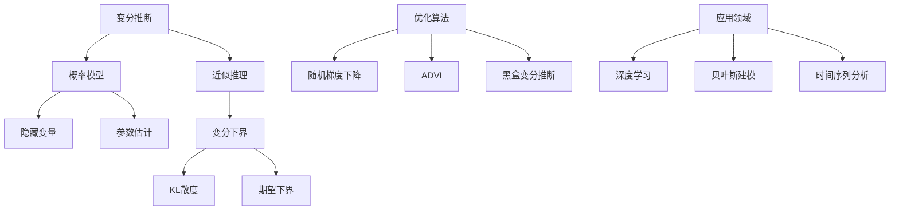

# 变分推断原理与代码实战案例讲解

## 1. 背景介绍

### 1.1 问题的由来

在机器学习和统计建模领域,我们经常需要推断隐藏变量或参数的后验分布。然而,在复杂模型中,由于存在耦合的隐藏变量和非高斯先验,使得精确推断后验分布变得非常困难,甚至不可能。这个挑战促使了变分推断方法的发展。

变分推断是一种近似推断技术,用于近似计算复杂概率模型中隐藏变量或参数的后验分布。它通过最小化变分下界(Evidence Lower Bound, ELBO)来寻找最优的近似后验分布,从而避免了直接计算通常难以解决的后验分布。

### 1.2 研究现状

近年来,变分推断方法在机器学习领域得到了广泛的应用和研究。随着深度学习的兴起,变分自编码器(Variational Autoencoder, VAE)成为了一种流行的生成模型,它将变分推断与深度神经网络相结合,用于学习数据的潜在表示和生成新的样本。

除了VAE,变分推断还被应用于各种机器学习任务,如主题建模、时间序列分析、贝叶斯神经网络等。研究人员不断探索新的变分推断算法和优化技术,以提高推断精度和计算效率。

### 1.3 研究意义

变分推断为解决复杂概率模型中的推断问题提供了一种有效的近似方法。它的主要意义包括:

1. **处理复杂模型**: 变分推断可以应用于具有耦合隐藏变量和非高斯先验的复杂概率模型,为这些模型提供了可行的推断解决方案。

2. **计算效率**: 相比于精确推断方法,变分推断通常具有更好的计算效率,尤其在处理大规模数据和高维隐藏变量时。

3. **理论基础**: 变分推断建立在坚实的数学和统计理论基础之上,为进一步发展和改进提供了理论支持。

4. **广泛应用**: 变分推断已被广泛应用于机器学习、统计建模、信号处理等多个领域,展现了其强大的适用性和价值。

### 1.4 本文结构

本文将全面介绍变分推断的原理、算法和实践应用。内容安排如下:

1. 背景介绍
2. 核心概念与联系
3. 核心算法原理与具体操作步骤
4. 数学模型和公式详细讲解与案例分析
5. 项目实践:代码实例和详细解释
6. 实际应用场景
7. 工具和资源推荐
8. 总结:未来发展趋势与挑战
9. 附录:常见问题与解答

## 2. 核心概念与联系

变分推断是一种近似推理技术,应用于概率模型中隐藏变量的后验推断和参数估计。它的核心思想是通过优化变分下界(Evidence Lower Bound, ELBO)来寻找最优的近似后验分布,从而避免直接计算通常难以解决的后验分布。

变分下界由KL散度(Kullback-Leibler Divergence)和期望下界(Expected Lower Bound)两部分组成。KL散度衡量近似后验分布与真实后验分布之间的差异,而期望下界则是对数据的证据下界。通过最大化变分下界,我们可以找到最佳的近似后验分布。

优化变分下界通常采用优化算法,如随机梯度下降(Stochastic Gradient Descent)、自动差分变分推断(Automatic Differentiation Variational Inference, ADVI)和黑盒变分推断(Black Box Variational Inference)等。

变分推断在多个领域都有广泛的应用,如深度学习(如变分自编码器)、贝叶斯建模、时间序列分析等。它为解决复杂概率模型中的推断问题提供了一种有效的近似方法。

## 3. 核心算法原理与具体操作步骤

### 3.1 算法原理概述

变分推断的核心思想是通过优化变分下界(ELBO)来寻找最优的近似后验分布,从而避免直接计算通常难以解决的后验分布。变分下界由KL散度和期望下界两部分组成,可以表示为:

$$\text{ELBO}(\theta, \phi) = \mathbb{E}_{q_\phi(z|x)}[\log p_\theta(x, z) - \log q_\phi(z|x)]$$

其中:

- $p_\theta(x, z)$是概率模型的联合分布,包含观测数据$x$和潜在变量$z$,由模型参数$\theta$参数化。
- $q_\phi(z|x)$是近似后验分布,由变分参数$\phi$参数化,用于近似真实的后验分布$p_\theta(z|x)$。

变分推断的目标是通过优化变分参数$\phi$来最大化变分下界,从而获得最优的近似后验分布$q_\phi(z|x)$。这可以通过梯度上升或其他优化算法来实现。

### 3.2 算法步骤详解

变分推断算法的具体步骤如下:

1. **定义概率模型**: 首先,定义概率模型$p_\theta(x, z)$,包含观测数据$x$和潜在变量$z$,由模型参数$\theta$参数化。

2. **选择近似后验分布**: 选择一个合适的近似后验分布$q_\phi(z|x)$,由变分参数$\phi$参数化。通常选择具有较简单形式的分布,如高斯分布或者均匀分布。

3. **构建变分下界**: 根据概率模型和近似后验分布,构建变分下界$\text{ELBO}(\theta, \phi)$。

4. **优化变分参数**: 使用优化算法(如随机梯度下降、ADVI或黑盒变分推断)优化变分参数$\phi$,以最大化变分下界$\text{ELBO}(\theta, \phi)$。这通常需要计算$\text{ELBO}$关于$\phi$的梯度,并进行梯度上升。

5. **近似后验分布**: 在优化过程中,变分参数$\phi$会不断更新,从而获得最优的近似后验分布$q_\phi(z|x)$。

6. **模型参数估计(可选)**: 在某些情况下,我们还可以通过最大化变分下界来估计模型参数$\theta$。这需要计算$\text{ELBO}$关于$\theta$的梯度,并进行梯度上升。

7. **预测和推断**: 使用获得的近似后验分布$q_\phi(z|x)$进行预测和推断任务。

需要注意的是,变分推断算法的性能和精度在很大程度上取决于近似后验分布的选择和优化算法的有效性。选择合适的近似分布和优化方法对于获得良好的推断结果至关重要。

### 3.3 算法优缺点

变分推断算法具有以下优缺点:

**优点**:

1. **计算效率高**: 相比于精确推断方法,变分推断通常具有更好的计算效率,尤其在处理大规模数据和高维隐藏变量时。

2. **适用于复杂模型**: 变分推断可以应用于具有耦合隐藏变量和非高斯先验的复杂概率模型,为这些模型提供了可行的推断解决方案。

3. **灵活性强**: 变分推断允许选择不同的近似后验分布和优化算法,提供了灵活性和可扩展性。

4. **理论基础坚实**: 变分推断建立在坚实的数学和统计理论基础之上,为进一步发展和改进提供了理论支持。

**缺点**:

1. **近似性**: 变分推断只能获得近似后验分布,而不是精确的后验分布,存在一定的近似误差。

2. **敏感性**: 算法的性能和精度在很大程度上取决于近似后验分布的选择和优化算法的有效性,对这些选择敏感。

3. **局部最优**: 优化过程可能会陷入局部最优解,导致获得的近似后验分布不是全局最优解。

4. **计算复杂度**: 对于某些复杂模型,计算变分下界和梯度仍然可能存在计算复杂度高的问题。

总的来说,变分推断算法提供了一种有效的近似推断方法,在计算效率和适用范围方面具有优势,但也存在一定的局限性和挑战。在实际应用中,需要根据具体问题和要求,权衡选择合适的近似后验分布和优化算法。

### 3.4 算法应用领域

变分推断算法在机器学习和统计建模领域有着广泛的应用,包括但不限于以下领域:

1. **深度学习**:
   - 变分自编码器(Variational Autoencoders, VAEs)
   - 生成对抗网络(Generative Adversarial Networks, GANs)
   - 贝叶斯神经网络

2. **贝叶斯建模**:
   - 隐马尔可夫模型(Hidden Markov Models, HMMs)
   - 主题模型(Topic Models)
   - 高斯过程(Gaussian Processes)

3. **时间序列分析**:
   - 状态空间模型(State Space Models)
   - 动态线性模型(Dynamic Linear Models)

4. **自然语言处理**:
   - 神经主题模型(Neural Topic Models)
   - 变分自编码器语言模型(Variational Autoencoder Language Models)

5. **计算机视觉**:
   - 变分自编码器用于图像生成和表示学习
   - 变分对象检测和分割模型

6. **推荐系统**:
   - 协同过滤模型(Collaborative Filtering Models)
   - 隐语义模型(Latent Semantic Models)

7. **生物信息学**:
   - 基因表达数据分析
   - 蛋白质结构预测

8. **信号处理**:
   - 盲源分离(Blind Source Separation)
   - 语音增强(Speech Enhancement)

总的来说,变分推断算法为解决复杂概率模型中的推断问题提供了一种有效的近似方法,在多个领域都有广泛的应用。随着算法的不断改进和优化,它在未来将继续发挥重要作用。

## 4. 数学模型和公式详细讲解与举例说明

### 4.1 数学模型构建

在变分推断中,我们需要构建一个概率模型来描述观测数据和潜在变量之间的关系。通常,这个概率模型可以表示为联合分布$p_\theta(x, z)$,其中$x$表示观测数据,而$z$表示潜在变量。

概率模型的具体形式取决于问题的性质和假设。常见的概率模型包括:

- **高斯混合模型(Gaussian Mixture Model, GMM)**:假设数据由多个高斯分布的混合生成。
- **隐马尔可夫模型(Hidden Markov Model, HMM)**:用于时序数据建模,假设存在隐藏状态序列。
- **主题模型(Topic Model)**:用于文本数据建模,假设每个文档由多个主题组成。
- **贝叶斯神经网络(Bayesian Neural Network, BNN)**:将神经网络的权重视为随机变量,并对其进行贝叶斯推断。

无论选择何种概率模型,它们都可以用联合分布$p_\theta(x, z)$来表示,其中$\theta$是模型参数。

### 4.2 公式推导过程

变分推断的核心目标是近似计算后验分布$p_\theta(z|x)$,因为在复杂模型中,直接计算后验分布通常是困难或不可行的。为了实现这一目标,我们引入了一个近似后验分布$q_\phi(z|x)$,其中$\phi$是变分参数。

然后,我们定义了变分下界(Evidence Lower Bound, ELBO):

$$\begin{aligned}
\text{ELBO}(\theta, \phi) &= \math