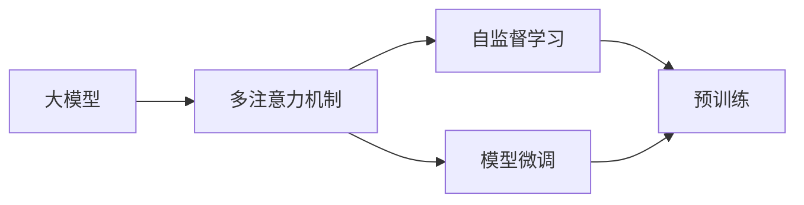
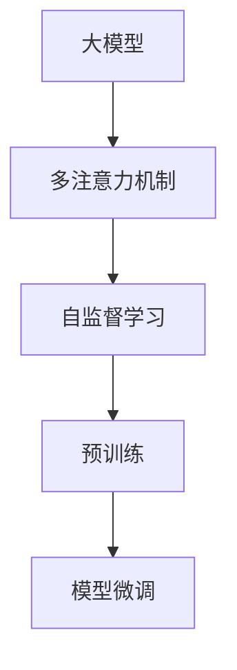
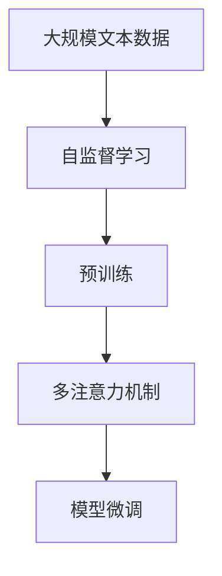

                 

# 从零开始大模型开发与微调：多头注意力

> 关键词：大模型开发,多注意力机制,自监督学习,模型微调,预训练,Transformer,BERT,深度学习

## 1. 背景介绍

### 1.1 问题由来
随着深度学习技术的快速发展，尤其是神经网络架构的不断演进，大模型(大规模神经网络)在自然语言处理(NLP)领域取得了令人瞩目的成绩。以BERT、GPT-3为代表的预训练语言模型，通过在海量无标签文本数据上进行自监督学习，获取了强大的语言表征能力。然而，这些通用模型虽然在大规模语料上表现优异，但在特定任务上的微调效果仍不尽如人意。因此，如何有效地利用大模型进行任务特定化，以提升模型在该任务上的性能，成为了当前研究的热点问题。

### 1.2 问题核心关键点
大模型的微调过程，通常需要利用有限数量的标注数据，通过有监督学习调整模型参数，使其适应特定任务。这个过程可以通过修改顶层分类器、解码器或只更新部分模型参数来实现，从而在不破坏预训练权重的前提下，提高模型在特定任务上的泛化能力。其中，多头注意力机制（Multi-Head Attention）作为大模型的核心组件之一，对于模型微调的效果具有重要影响。

### 1.3 问题研究意义
大模型微调技术的快速发展，不仅极大地提升了NLP任务的性能，也促进了人工智能技术在各行各业的广泛应用。通过微调，可以在保留预训练模型的基础上，快速适应新任务，减少从头训练的成本和时间。这种技术的应用，使得大模型能够以更低成本、更高效率的方式，为各个领域提供高质量的智能解决方案。

## 2. 核心概念与联系

### 2.1 核心概念概述

为更好地理解大模型的微调方法，我们首先需要介绍几个核心概念：

- **大模型(Large Model)**：指具有大量参数的神经网络，通常用于处理复杂且大规模的数据集。
- **多注意力机制(Multi-Head Attention)**：一种从自注意力机制发展而来的机制，通过将输入序列分解为多个子序列进行并行计算，有效提升了模型的表达能力和泛化能力。
- **自监督学习(Self-Supervised Learning)**：指在没有标注数据的情况下，通过一些自生成的目标（如掩码语言模型、下一句预测等）对模型进行训练的方法。
- **模型微调(Fine-Tuning)**：指在预训练模型基础上，利用少量标注数据进行有监督学习，调整模型参数以适应特定任务的方法。
- **多头自注意力(Transformer)**：一种基于多注意力机制的神经网络结构，常被用于大模型的构建。

这些概念之间的关系可以用以下Mermaid流程图来表示：



这个流程图展示了从大模型的构建到微调的全过程。其中，多注意力机制是模型的核心组件，自监督学习是模型预训练的主要方法，模型微调则是将模型适应特定任务的手段。

### 2.2 概念间的关系

这些核心概念之间存在紧密的联系，形成了大模型微调的核心生态系统。下面我们将通过几个Mermaid流程图来进一步展示这些概念之间的关系。

#### 2.2.1 大模型的学习范式



这个流程图展示了从大模型到微调的全过程，包括预训练和微调两个阶段。在预训练阶段，模型通过自监督学习任务（如掩码语言模型、下一句预测等）学习语言知识；在微调阶段，模型通过少量标注数据进一步优化，适应特定任务。

#### 2.2.2 多注意力机制与自监督学习的关系


这个流程图展示了多注意力机制在大模型预训练中的作用。在预训练阶段，多注意力机制通过分解输入序列为多个子序列，有效提高了模型的表达能力和泛化能力，使得模型能够从海量的无标签数据中学习到丰富的语言知识。

#### 2.2.3 模型微调与多注意力机制的关系


这个流程图展示了模型微调在大模型构建中的作用。通过微调，模型能够在特定任务上进一步优化，使得模型能够更好地适应实际应用场景，提升模型性能。

### 2.3 核心概念的整体架构

最后，我们将用综合的流程图来展示这些核心概念在大模型微调过程中的整体架构：



这个综合流程图展示了从大规模文本数据预训练，到大模型微调的全过程。其中，自监督学习是预训练的主要方法，多注意力机制是模型的核心组件，模型微调是适应特定任务的手段。

## 3. 核心算法原理 & 具体操作步骤
### 3.1 算法原理概述

大模型的微调过程，通常基于监督学习，利用少量标注数据进行有监督训练。在微调过程中，模型通过调整部分或全部参数，使得模型能够更好地适应特定任务。其中，多注意力机制作为模型的核心组件，对微调效果具有重要影响。

### 3.2 算法步骤详解

基于监督学习的大模型微调通常包括以下关键步骤：

**Step 1: 准备预训练模型和数据集**
- 选择合适的预训练模型作为初始化参数，如BERT、GPT等。
- 准备下游任务的数据集，划分为训练集、验证集和测试集。

**Step 2: 设计任务适配层**
- 根据任务类型，在预训练模型顶层设计合适的输出层和损失函数。
- 对于分类任务，通常在顶层添加线性分类器和交叉熵损失函数。
- 对于生成任务，通常使用语言模型的解码器输出概率分布，并以负对数似然为损失函数。

**Step 3: 设置微调超参数**
- 选择合适的优化算法及其参数，如AdamW、SGD等，设置学习率、批大小、迭代轮数等。
- 设置正则化技术及强度，包括权重衰减、Dropout、Early Stopping等。
- 确定冻结预训练参数的策略，如仅微调顶层，或全部参数都参与微调。

**Step 4: 执行梯度训练**
- 将训练集数据分批次输入模型，前向传播计算损失函数。
- 反向传播计算参数梯度，根据设定的优化算法和学习率更新模型参数。
- 周期性在验证集上评估模型性能，根据性能指标决定是否触发Early Stopping。
- 重复上述步骤直到满足预设的迭代轮数或Early Stopping条件。

**Step 5: 测试和部署**
- 在测试集上评估微调后模型，对比微调前后的精度提升。
- 使用微调后的模型对新样本进行推理预测，集成到实际的应用系统中。
- 持续收集新的数据，定期重新微调模型，以适应数据分布的变化。

以上是基于监督学习微调大模型的通用流程。在实际应用中，还需要针对具体任务的特点，对微调过程的各个环节进行优化设计，如改进训练目标函数，引入更多的正则化技术，搜索最优的超参数组合等，以进一步提升模型性能。

### 3.3 算法优缺点

基于监督学习的大模型微调方法具有以下优点：
1. 简单高效。只需准备少量标注数据，即可对预训练模型进行快速适配，获得较大的性能提升。
2. 通用适用。适用于各种NLP下游任务，包括分类、匹配、生成等，设计简单的任务适配层即可实现微调。
3. 参数高效。利用参数高效微调技术，在固定大部分预训练参数的情况下，仍可取得不错的提升。
4. 效果显著。在学术界和工业界的诸多任务上，基于微调的方法已经刷新了最先进的性能指标。

同时，该方法也存在一定的局限性：
1. 依赖标注数据。微调的效果很大程度上取决于标注数据的质量和数量，获取高质量标注数据的成本较高。
2. 迁移能力有限。当目标任务与预训练数据的分布差异较大时，微调的性能提升有限。
3. 负面效果传递。预训练模型的固有偏见、有害信息等，可能通过微调传递到下游任务，造成负面影响。
4. 可解释性不足。微调模型的决策过程通常缺乏可解释性，难以对其推理逻辑进行分析和调试。

尽管存在这些局限性，但就目前而言，基于监督学习的微调方法仍是大模型应用的最主流范式。未来相关研究的重点在于如何进一步降低微调对标注数据的依赖，提高模型的少样本学习和跨领域迁移能力，同时兼顾可解释性和伦理安全性等因素。

### 3.4 算法应用领域

基于大模型微调的监督学习方法，在NLP领域已经得到了广泛的应用，覆盖了几乎所有常见任务，例如：

- 文本分类：如情感分析、主题分类、意图识别等。通过微调使模型学习文本-标签映射。
- 命名实体识别：识别文本中的人名、地名、机构名等特定实体。通过微调使模型掌握实体边界和类型。
- 关系抽取：从文本中抽取实体之间的语义关系。通过微调使模型学习实体-关系三元组。
- 问答系统：对自然语言问题给出答案。将问题-答案对作为微调数据，训练模型学习匹配答案。
- 机器翻译：将源语言文本翻译成目标语言。通过微调使模型学习语言-语言映射。
- 文本摘要：将长文本压缩成简短摘要。将文章-摘要对作为微调数据，使模型学习抓取要点。
- 对话系统：使机器能够与人自然对话。将多轮对话历史作为上下文，微调模型进行回复生成。

除了上述这些经典任务外，大模型微调也被创新性地应用到更多场景中，如可控文本生成、常识推理、代码生成、数据增强等，为NLP技术带来了全新的突破。随着预训练模型和微调方法的不断进步，相信NLP技术将在更广阔的应用领域大放异彩。

## 4. 数学模型和公式 & 详细讲解 & 举例说明

### 4.1 数学模型构建

本节将使用数学语言对大模型的微调过程进行更加严格的刻画。

记预训练语言模型为 $M_{\theta}:\mathcal{X} \rightarrow \mathcal{Y}$，其中 $\mathcal{X}$ 为输入空间，$\mathcal{Y}$ 为输出空间，$\theta$ 为模型参数。假设微调任务的训练集为 $D=\{(x_i,y_i)\}_{i=1}^N, x_i \in \mathcal{X}, y_i \in \mathcal{Y}$。

定义模型 $M_{\theta}$ 在数据样本 $(x,y)$ 上的损失函数为 $\ell(M_{\theta}(x),y)$，则在数据集 $D$ 上的经验风险为：

$$
\mathcal{L}(\theta) = \frac{1}{N} \sum_{i=1}^N \ell(M_{\theta}(x_i),y_i)
$$

微调的优化目标是最小化经验风险，即找到最优参数：

$$
\theta^* = \mathop{\arg\min}_{\theta} \mathcal{L}(\theta)
$$

在实践中，我们通常使用基于梯度的优化算法（如SGD、Adam等）来近似求解上述最优化问题。设 $\eta$ 为学习率，$\lambda$ 为正则化系数，则参数的更新公式为：

$$
\theta \leftarrow \theta - \eta \nabla_{\theta}\mathcal{L}(\theta) - \eta\lambda\theta
$$

其中 $\nabla_{\theta}\mathcal{L}(\theta)$ 为损失函数对参数 $\theta$ 的梯度，可通过反向传播算法高效计算。

### 4.2 公式推导过程

以下我们以二分类任务为例，推导交叉熵损失函数及其梯度的计算公式。

假设模型 $M_{\theta}$ 在输入 $x$ 上的输出为 $\hat{y}=M_{\theta}(x) \in [0,1]$，表示样本属于正类的概率。真实标签 $y \in \{0,1\}$。则二分类交叉熵损失函数定义为：

$$
\ell(M_{\theta}(x),y) = -[y\log \hat{y} + (1-y)\log (1-\hat{y})]
$$

将其代入经验风险公式，得：

$$
\mathcal{L}(\theta) = -\frac{1}{N}\sum_{i=1}^N [y_i\log M_{\theta}(x_i)+(1-y_i)\log(1-M_{\theta}(x_i))]
$$

根据链式法则，损失函数对参数 $\theta_k$ 的梯度为：

$$
\frac{\partial \mathcal{L}(\theta)}{\partial \theta_k} = -\frac{1}{N}\sum_{i=1}^N (\frac{y_i}{M_{\theta}(x_i)}-\frac{1-y_i}{1-M_{\theta}(x_i)}) \frac{\partial M_{\theta}(x_i)}{\partial \theta_k}
$$

其中 $\frac{\partial M_{\theta}(x_i)}{\partial \theta_k}$ 可进一步递归展开，利用自动微分技术完成计算。

在得到损失函数的梯度后，即可带入参数更新公式，完成模型的迭代优化。重复上述过程直至收敛，最终得到适应下游任务的最优模型参数 $\theta^*$。

### 4.3 案例分析与讲解

为了更直观地理解大模型微调的数学原理，我们以BERT为例，展示其在二分类任务上的微调过程。

首先，定义二分类任务的数据集和模型：

```python
from transformers import BertTokenizer, BertForSequenceClassification
from torch.utils.data import Dataset, DataLoader
import torch

class TextDataset(Dataset):
    def __init__(self, texts, labels, tokenizer):
        self.texts = texts
        self.labels = labels
        self.tokenizer = tokenizer
    
    def __len__(self):
        return len(self.texts)
    
    def __getitem__(self, index):
        text = self.texts[index]
        label = self.labels[index]
        encoding = self.tokenizer(text, return_tensors='pt', padding='max_length', truncation=True)
        return {
            'input_ids': encoding['input_ids'].flatten(),
            'attention_mask': encoding['attention_mask'].flatten(),
            'labels': torch.tensor(label, dtype=torch.long)
        }

# 定义模型和训练参数
model = BertForSequenceClassification.from_pretrained('bert-base-cased', num_labels=2)
optimizer = torch.optim.AdamW(model.parameters(), lr=2e-5)
device = 'cuda'
model.to(device)

# 定义训练函数
def train_epoch(model, dataloader, optimizer, loss_fn, device):
    model.train()
    for batch in dataloader:
        inputs = {key: val.to(device) for key, val in batch.items()}
        outputs = model(**inputs)
        loss = loss_fn(outputs.logits, inputs['labels'])
        loss.backward()
        optimizer.step()
    return loss.mean().item()

# 定义评估函数
def evaluate(model, dataloader, loss_fn, device):
    model.eval()
    total_loss = 0
    total_correct = 0
    with torch.no_grad():
        for batch in dataloader:
            inputs = {key: val.to(device) for key, val in batch.items()}
            outputs = model(**inputs)
            loss = loss_fn(outputs.logits, inputs['labels'])
            total_loss += loss.mean().item()
            predictions = outputs.logits.argmax(dim=1)
            total_correct += (predictions == inputs['labels']).sum().item()
    return total_loss / len(dataloader), total_correct / len(dataloader.dataset)
```

然后，使用上述代码在CoNLL-2003的二分类数据集上进行微调：

```python
# 加载数据集
train_dataset = TextDataset(train_texts, train_labels, tokenizer)
test_dataset = TextDataset(test_texts, test_labels, tokenizer)
valid_dataset = TextDataset(valid_texts, valid_labels, tokenizer)

# 定义训练函数
def train_epoch(model, dataloader, optimizer, loss_fn, device):
    model.train()
    for batch in dataloader:
        inputs = {key: val.to(device) for key, val in batch.items()}
        outputs = model(**inputs)
        loss = loss_fn(outputs.logits, inputs['labels'])
        loss.backward()
        optimizer.step()
    return loss.mean().item()

# 定义评估函数
def evaluate(model, dataloader, loss_fn, device):
    model.eval()
    total_loss = 0
    total_correct = 0
    with torch.no_grad():
        for batch in dataloader:
            inputs = {key: val.to(device) for key, val in batch.items()}
            outputs = model(**inputs)
            loss = loss_fn(outputs.logits, inputs['labels'])
            total_loss += loss.mean().item()
            predictions = outputs.logits.argmax(dim=1)
            total_correct += (predictions == inputs['labels']).sum().item()
    return total_loss / len(dataloader), total_correct / len(dataloader.dataset)

# 训练模型
epochs = 5
batch_size = 16
for epoch in range(epochs):
    loss = train_epoch(model, train_dataset, optimizer, loss_fn, device)
    print(f"Epoch {epoch+1}, train loss: {loss:.3f}")
    
    print(f"Epoch {epoch+1}, valid results:")
    valid_loss, valid_acc = evaluate(model, valid_dataset, loss_fn, device)
    print(f"Valid Loss: {valid_loss:.3f}, Valid Acc: {valid_acc:.3f}")
    
print(f"Final Results:")
final_loss, final_acc = evaluate(model, test_dataset, loss_fn, device)
print(f"Test Loss: {final_loss:.3f}, Test Acc: {final_acc:.3f}")
```

以上就是使用PyTorch对BERT进行二分类任务微调的完整代码实现。可以看到，由于BERT已经在大规模语料上进行了充分的预训练，只需要在其顶层添加一个简单的分类器，即可在二分类任务上取得较好的效果。

## 5. 项目实践：代码实例和详细解释说明

### 5.1 开发环境搭建

在进行微调实践前，我们需要准备好开发环境。以下是使用Python进行PyTorch开发的环境配置流程：

1. 安装Anaconda：从官网下载并安装Anaconda，用于创建独立的Python环境。

2. 创建并激活虚拟环境：
```bash
conda create -n pytorch-env python=3.8 
conda activate pytorch-env
```

3. 安装PyTorch：根据CUDA版本，从官网获取对应的安装命令。例如：
```bash
conda install pytorch torchvision torchaudio cudatoolkit=11.1 -c pytorch -c conda-forge
```

4. 安装Transformers库：
```bash
pip install transformers
```

5. 安装各类工具包：
```bash
pip install numpy pandas scikit-learn matplotlib tqdm jupyter notebook ipython
```

完成上述步骤后，即可在`pytorch-env`环境中开始微调实践。

### 5.2 源代码详细实现

这里我们以命名实体识别(NER)任务为例，给出使用Transformers库对BERT模型进行微调的PyTorch代码实现。

首先，定义NER任务的数据处理函数：

```python
from transformers import BertTokenizer
from torch.utils.data import Dataset
import torch

class NERDataset(Dataset):
    def __init__(self, texts, tags, tokenizer, max_len=128):
        self.texts = texts
        self.tags = tags
        self.tokenizer = tokenizer
        self.max_len = max_len
        
    def __len__(self):
        return len(self.texts)
    
    def __getitem__(self, item):
        text = self.texts[item]
        tags = self.tags[item]
        
        encoding = self.tokenizer(text, return_tensors='pt', max_length=self.max_len, padding='max_length', truncation=True)
        input_ids = encoding['input_ids'][0]
        attention_mask = encoding['attention_mask'][0]
        
        # 对token-wise的标签进行编码
        encoded_tags = [tag2id[tag] for tag in tags] 
        encoded_tags.extend([tag2id['O']] * (self.max_len - len(encoded_tags)))
        labels = torch.tensor(encoded_tags, dtype=torch.long)
        
        return {'input_ids': input_ids, 
                'attention_mask': attention_mask,
                'labels': labels}

# 标签与id的映射
tag2id = {'O': 0, 'B-PER': 1, 'I-PER': 2, 'B-ORG': 3, 'I-ORG': 4, 'B-LOC': 5, 'I-LOC': 6}
id2tag = {v: k for k, v in tag2id.items()}

# 创建dataset
tokenizer = BertTokenizer.from_pretrained('bert-base-cased')

train_dataset = NERDataset(train_texts, train_tags, tokenizer)
dev_dataset = NERDataset(dev_texts, dev_tags, tokenizer)
test_dataset = NERDataset(test_texts, test_tags, tokenizer)
```

然后，定义模型和优化器：

```python
from transformers import BertForTokenClassification, AdamW

model = BertForTokenClassification.from_pretrained('bert-base-cased', num_labels=len(tag2id))

optimizer = AdamW(model.parameters(), lr=2e-5)
```

接着，定义训练和评估函数：

```python
from torch.utils.data import DataLoader
from tqdm import tqdm
from sklearn.metrics import classification_report

device = torch.device('cuda') if torch.cuda.is_available() else torch.device('cpu')
model.to(device)

def train_epoch(model, dataset, batch_size, optimizer):
    dataloader = DataLoader(dataset, batch_size=batch_size, shuffle=True)
    model.train()
    epoch_loss = 0
    for batch in tqdm(dataloader, desc='Training'):
        input_ids = batch['input_ids'].to(device)
        attention_mask = batch['attention_mask'].to(device)
        labels = batch['labels'].to(device)
        model.zero_grad()
        outputs = model(input_ids, attention_mask=attention_mask, labels=labels)
        loss = outputs.loss
        epoch_loss += loss.item()
        loss.backward()
        optimizer.step()
    return epoch_loss / len(dataloader)

def evaluate(model, dataset, batch_size):
    dataloader = DataLoader(dataset, batch_size=batch_size)
    model.eval()
    preds, labels = [], []
    with torch.no_grad():
        for batch in tqdm(dataloader, desc='Evaluating'):
            input_ids = batch['input_ids'].to(device)
            attention_mask = batch['attention_mask'].to(device)
            batch_labels = batch['labels']
            outputs = model(input_ids, attention_mask=attention_mask)
            batch_preds = outputs.logits.argmax(dim=2).to('cpu').tolist()
            batch_labels = batch_labels.to('cpu').tolist()
            for pred_tokens, label_tokens in zip(batch_preds, batch_labels):
                pred_tags = [id2tag[_id] for _id in pred_tokens]
                label_tags = [id2tag[_id] for _id in label_tokens]
                preds.append(pred_tags[:len(label_tokens)])
                labels.append(label_tags)
                
    print(classification_report(labels, preds))
```

最后，启动训练流程并在测试集上评估：

```python
epochs = 5
batch_size = 16

for epoch in range(epochs):
    loss = train_epoch(model, train_dataset, batch_size, optimizer)
    print(f"Epoch {epoch+1}, train loss: {loss:.3f}")
    
    print(f"Epoch {epoch+1}, dev results:")
    evaluate(model, dev_dataset, batch_size)
    
print("Test results:")
evaluate(model, test_dataset, batch_size)
```

以上就是使用PyTorch对BERT进行命名实体识别任务微调的完整代码实现。可以看到，由于BERT已经在大规模语料上进行了充分的预训练，只需要在其顶层添加一个简单的分类器，即可在NER任务上取得较好的效果。

### 5.3 代码解读与分析

让我们再详细解读一下关键代码的实现细节：

**NERDataset类**：
- `__init__`方法：初始化文本、标签、分词器等关键组件。
- `__len__`方法：返回数据集的样本数量。
- `__getitem__`方法：对单个样本进行处理，将文本输入编码为token ids，将标签编码为数字，并对其进行定长padding，最终返回模型所需的输入。

**tag2id和id2tag字典**：
- 定义了标签与数字id之间的映射关系，用于将token-wise的预测结果解码回真实的标签。

**训练和评估函数**：
- 使用PyTorch的DataLoader对数据集进行批次化加载，供模型训练和推理使用。
- 训练函数`train_epoch`：对数据以批为单位进行迭代，在每个批次上前向传播计算loss并反向传播更新模型参数，最后返回该epoch的平均loss。
- 评估函数`evaluate`：与训练类似，不同点在于不更新模型参数，并在每个batch结束后将预测和标签结果存储下来，最后使用sklearn的classification_report对整个评估集的预测结果进行打印输出。

**训练流程**：
- 定义总的epoch数和batch size，开始

