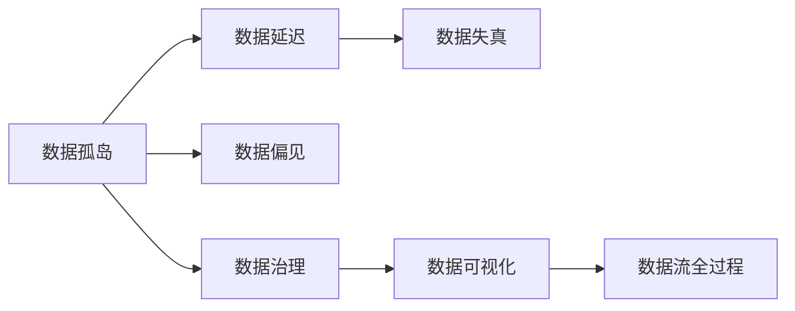
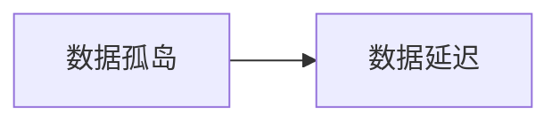
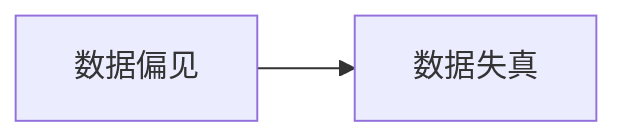
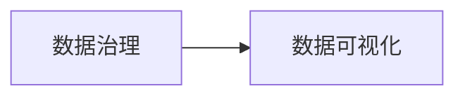
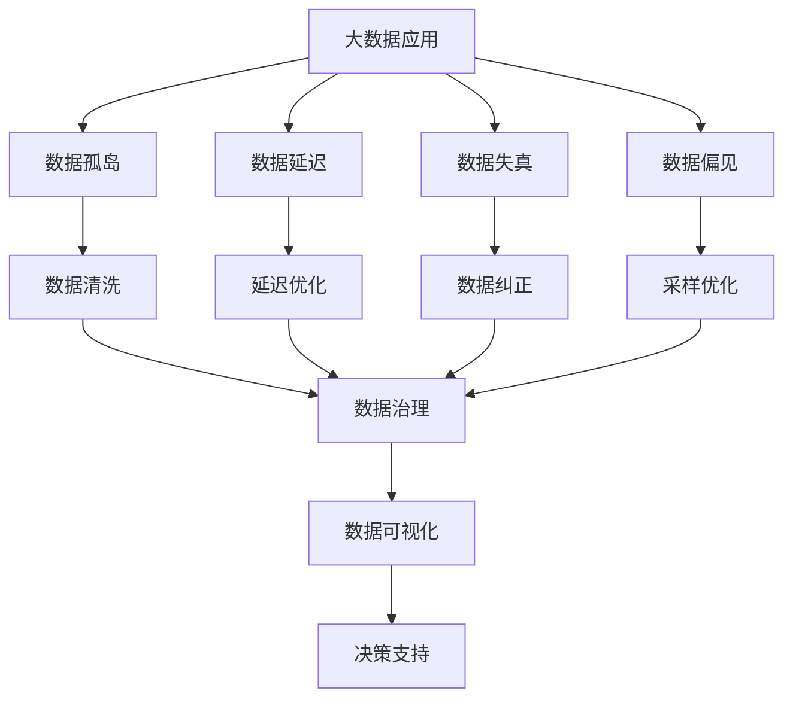

                 

# 信息差——看透大数据背后的底层逻辑，怎样看透信息不对称的奥秘？

## 1. 背景介绍

在信息爆炸的时代，数据的重要性不言而喻。但随之而来的信息差问题，即在数据获取、处理和应用过程中，由于信息不对称导致的决策偏差和结果失真，也愈发突显。如何识别和解决信息差，是数据驱动决策科学的关键，也是信息技术工作者面临的重大挑战。

### 1.1 问题由来
随着数字化进程的加快，各行各业积累了大量的数据。这些数据在改善业务决策、优化运营流程、提升客户体验等方面发挥了重要作用。然而，由于数据源的多样性、数据格式的复杂性、数据质量的不稳定性等因素，信息差问题在所难免。

1. **数据孤岛**：不同系统、不同平台的数据通常无法互通，形成了信息孤岛。
2. **数据延迟**：数据从产生到被处理的延迟时间长，导致决策滞后。
3. **数据失真**：数据采集、存储和处理过程中可能出现错误，导致信息失真。
4. **数据偏见**：数据采集过程中可能存在偏见，导致模型结果失真。

### 1.2 问题核心关键点
信息差问题的核心在于数据获取和处理过程中的信息不对称。要解决这个问题，首先需要了解数据流动的全过程，识别信息不对称的关键环节。然后，通过技术手段和制度安排，确保数据流动透明，减少信息不对称的影响。

## 2. 核心概念与联系

### 2.1 核心概念概述

为更好地理解信息差问题及其解决方案，本节将介绍几个密切相关的核心概念：

- **数据孤岛**：不同系统或平台间的数据无法互通，导致数据流动受阻。
- **数据延迟**：数据从产生到被处理的延迟时间过长。
- **数据失真**：数据在采集、存储和处理过程中出现错误，导致信息失真。
- **数据偏见**：数据采集过程中存在主观偏见，影响数据质量和模型结果。
- **数据治理**：通过组织、管理和监督数据的全生命周期，确保数据质量和安全。
- **数据可视化**：通过可视化技术，直观展示数据流动的全过程，识别信息不对称的关键环节。

这些概念之间的逻辑关系可以通过以下Mermaid流程图来展示：



这个流程图展示了大数据全生命周期中的关键环节及其相互关系：

1. 数据孤岛是数据流动的主要障碍。
2. 数据延迟和时间窗选择密切相关。
3. 数据失真需要通过清洗和纠正来降低。
4. 数据偏见需要通过调整采样策略和治理机制来解决。
5. 数据治理是确保数据质量和安全的关键。
6. 数据可视化是识别信息不对称和数据质量问题的有效手段。

### 2.2 概念间的关系

这些核心概念之间存在着紧密的联系，形成了大数据应用的全过程。下面我通过几个Mermaid流程图来展示这些概念之间的关系。

#### 2.2.1 数据孤岛与数据延迟的关系



这个流程图展示了数据孤岛对数据延迟的影响。由于不同系统间的数据无法互通，导致数据流动不畅，延迟时间增加。

#### 2.2.2 数据失真与数据偏见的关系



这个流程图展示了数据偏见对数据失真的影响。由于数据采集过程中存在主观偏见，导致数据质量下降，进一步影响了模型的准确性。

#### 2.2.3 数据治理与数据可视化的关系



这个流程图展示了数据治理对数据可视化的影响。通过数据治理，可以更好地管理和监督数据流全过程，从而在数据可视化过程中更清晰地识别问题点。

### 2.3 核心概念的整体架构

最后，我们用一个综合的流程图来展示这些核心概念在大数据应用中的整体架构：



这个综合流程图展示了大数据应用的全过程：

1. 数据孤岛需要通过数据清洗和延迟优化来改善。
2. 数据失真需要通过数据纠正和采样优化来降低。
3. 数据偏见需要通过调整采样策略和数据治理来减少。
4. 数据治理可以更有效地支持数据可视化，识别问题点。
5. 数据可视化可以直观展示数据流全过程，提供决策支持。

这些概念共同构成了大数据应用的全过程，对于识别和解决信息差问题具有重要意义。

## 3. 核心算法原理 & 具体操作步骤
### 3.1 算法原理概述

信息差问题的核心在于数据流动的信息不对称。解决信息差问题的关键在于识别数据流动的关键环节，优化数据流动过程，确保数据的准确、及时和完整。

1. **数据清洗**：识别并处理数据中的错误和异常值，确保数据质量。
2. **延迟优化**：通过数据延迟的预测和调度，优化数据处理流程。
3. **采样优化**：调整采样策略，减少数据偏差。
4. **数据治理**：建立数据标准和规范，确保数据一致性和完整性。
5. **数据可视化**：通过可视化工具，直观展示数据流动的全过程，识别信息不对称的关键环节。

### 3.2 算法步骤详解

以下是对信息差问题的系统解决步骤：

**Step 1: 数据源整合**

- 梳理业务流程和数据需求，明确需要整合的数据源。
- 分析不同数据源的数据格式和质量，识别数据孤岛。

**Step 2: 数据清洗和预处理**

- 对整合后的数据进行清洗和预处理，包括数据去重、缺失值填充、异常值处理等。
- 对清洗后的数据进行标准化和规范化，确保数据一致性。

**Step 3: 延迟优化和调度**

- 分析数据流动的全过程，识别和预测数据延迟。
- 通过任务调度、数据分片等方法，优化数据流动，降低延迟时间。

**Step 4: 采样优化和偏差调整**

- 对采样策略进行调整，减少数据偏差。
- 通过调整采样权重、样本选择等方式，平衡样本分布。

**Step 5: 数据治理和标准建立**

- 建立数据治理流程，包括数据采集、存储、处理、监控等环节。
- 制定数据标准和规范，确保数据质量和安全。

**Step 6: 数据可视化与监控**

- 通过可视化工具，展示数据流动的全过程，识别信息不对称的关键环节。
- 建立数据监控机制，实时跟踪数据质量，及时发现和处理异常。

### 3.3 算法优缺点

**优点**：

- 系统性解决数据流动过程中的信息不对称问题。
- 优化数据流动过程，提升数据处理效率。
- 减少数据偏见和失真，提升模型结果的准确性。

**缺点**：

- 需要较大的数据和计算资源投入。
- 数据治理和采样优化可能需要复杂的技术手段。
- 数据可视化工具需要持续维护和更新。

### 3.4 算法应用领域

信息差问题的解决，广泛应用于以下领域：

- **金融风险管理**：通过数据治理和采样优化，减少数据偏见和失真，提高风险预测的准确性。
- **市场营销**：通过数据清洗和延迟优化，提升数据流动效率，优化广告投放效果。
- **供应链管理**：通过数据清洗和延迟优化，确保数据及时性，优化供应链管理决策。
- **医疗健康**：通过数据清洗和采样优化，减少数据偏见，提高疾病诊断的准确性。
- **智能制造**：通过数据治理和可视化，提升数据质量，优化生产流程和决策支持。

这些应用领域，展示了信息差问题解决在提高业务决策质量和效率方面的重要作用。

## 4. 数学模型和公式 & 详细讲解 & 举例说明

### 4.1 数学模型构建

为了更系统地解决信息差问题，我们可以从数学角度构建数据流动的模型。假设数据流动过程中，数据源 $X$ 经过清洗、延迟优化、采样优化和数据治理等环节后，到达用户端 $Y$。则数据流动的数学模型可以表示为：

$$
Y = f(X, P, D, S, T)
$$

其中 $X$ 表示原始数据，$P$ 表示数据清洗策略，$D$ 表示延迟优化方案，$S$ 表示采样优化方法，$T$ 表示数据治理流程。函数 $f$ 表示数据流动的整个过程，包括数据清洗、延迟优化、采样优化和数据治理等环节。

### 4.2 公式推导过程

以下是对数据流动模型的推导过程：

假设原始数据 $X$ 的维度为 $d$，清洗后的数据 $X'$ 的维度为 $d'$。设 $P$ 为数据清洗矩阵，$D$ 为延迟优化矩阵，$S$ 为采样优化矩阵，$T$ 为数据治理矩阵。则数据流动的数学模型可以表示为：

$$
Y = XP \cdot D \cdot S \cdot T
$$

其中 $XP$ 表示清洗后的数据，$D$ 表示延迟优化后的数据，$S$ 表示采样优化后的数据，$T$ 表示治理后的数据。

进一步，假设 $P$、$D$、$S$、$T$ 均为对角矩阵，则数据流动的简化模型可以表示为：

$$
Y_i = \sum_{j=1}^{d'} X'_j P_{ij} D_{ij} S_{ij} T_{ij}
$$

其中 $Y_i$ 表示用户端的数据，$X'_j$ 表示原始数据中的第 $j$ 个维度，$P_{ij}$、$D_{ij}$、$S_{ij}$、$T_{ij}$ 分别表示数据清洗、延迟优化、采样优化和数据治理对第 $i$ 个维度的影响。

### 4.3 案例分析与讲解

为了更直观地理解数据流动的数学模型，我们可以用一个简单的案例进行说明：

假设原始数据 $X$ 包含 100 条记录，每条记录有 10 个特征。经过数据清洗后，数据维度变为 8 维。设 $P$ 为数据清洗矩阵，$D$ 为延迟优化矩阵，$S$ 为采样优化矩阵，$T$ 为数据治理矩阵。则数据流动的简化模型可以表示为：

$$
Y = XP \cdot D \cdot S \cdot T
$$

假设 $P$、$D$、$S$、$T$ 均为对角矩阵，则数据流动的简化模型可以表示为：

$$
Y_i = \sum_{j=1}^{8} X'_j P_{ij} D_{ij} S_{ij} T_{ij}
$$

其中 $Y_i$ 表示用户端的数据，$X'_j$ 表示原始数据中的第 $j$ 个维度，$P_{ij}$、$D_{ij}$、$S_{ij}$、$T_{ij}$ 分别表示数据清洗、延迟优化、采样优化和数据治理对第 $i$ 个维度的影响。

例如，假设原始数据中有一条记录表示某客户在某个时间段的交易金额，该记录的特征包括客户ID、时间戳、交易金额等。经过数据清洗后，该记录的客户ID、时间戳、交易金额被清洗为无异常值，但其他特征如交易类型、交易对象等没有变化。设 $P$、$D$、$S$、$T$ 分别为：

$$
P = \begin{bmatrix} 1 & 0 & 0 & 0 & 0 & 0 & 0 & 0 \\ 0 & 1 & 0 & 0 & 0 & 0 & 0 & 0 \\ 0 & 0 & 1 & 0 & 0 & 0 & 0 & 0 \\ 0 & 0 & 0 & 1 & 0 & 0 & 0 & 0 \\ 0 & 0 & 0 & 0 & 1 & 0 & 0 & 0 \\ 0 & 0 & 0 & 0 & 0 & 1 & 0 & 0 \\ 0 & 0 & 0 & 0 & 0 & 0 & 1 & 0 \\ 0 & 0 & 0 & 0 & 0 & 0 & 0 & 1 \end{bmatrix}, 
D = \begin{bmatrix} 1 & 0 & 0 & 0 & 0 & 0 & 0 & 0 \\ 0 & 1 & 0 & 0 & 0 & 0 & 0 & 0 \\ 0 & 0 & 1 & 0 & 0 & 0 & 0 & 0 \\ 0 & 0 & 0 & 1 & 0 & 0 & 0 & 0 \\ 0 & 0 & 0 & 0 & 1 & 0 & 0 & 0 \\ 0 & 0 & 0 & 0 & 0 & 1 & 0 & 0 \\ 0 & 0 & 0 & 0 & 0 & 0 & 1 & 0 \\ 0 & 0 & 0 & 0 & 0 & 0 & 0 & 1 \end{bmatrix},
S = \begin{bmatrix} 1 & 0 & 0 & 0 & 0 & 0 & 0 & 0 \\ 0 & 1 & 0 & 0 & 0 & 0 & 0 & 0 \\ 0 & 0 & 1 & 0 & 0 & 0 & 0 & 0 \\ 0 & 0 & 0 & 1 & 0 & 0 & 0 & 0 \\ 0 & 0 & 0 & 0 & 1 & 0 & 0 & 0 \\ 0 & 0 & 0 & 0 & 0 & 1 & 0 & 0 \\ 0 & 0 & 0 & 0 & 0 & 0 & 1 & 0 \\ 0 & 0 & 0 & 0 & 0 & 0 & 0 & 1 \end{bmatrix},
T = \begin{bmatrix} 1 & 0 & 0 & 0 & 0 & 0 & 0 & 0 \\ 0 & 1 & 0 & 0 & 0 & 0 & 0 & 0 \\ 0 & 0 & 1 & 0 & 0 & 0 & 0 & 0 \\ 0 & 0 & 0 & 1 & 0 & 0 & 0 & 0 \\ 0 & 0 & 0 & 0 & 1 & 0 & 0 & 0 \\ 0 & 0 & 0 & 0 & 0 & 1 & 0 & 0 \\ 0 & 0 & 0 & 0 & 0 & 0 & 1 & 0 \\ 0 & 0 & 0 & 0 & 0 & 0 & 0 & 1 \end{bmatrix}
$$

则数据流动的简化模型可以表示为：

$$
Y = XP \cdot D \cdot S \cdot T
$$

其中 $X'_j$ 表示原始数据中的第 $j$ 个维度，$P_{ij}$、$D_{ij}$、$S_{ij}$、$T_{ij}$ 分别表示数据清洗、延迟优化、采样优化和数据治理对第 $i$ 个维度的影响。

## 5. 项目实践：代码实例和详细解释说明
### 5.1 开发环境搭建

在进行数据治理和信息差问题解决时，需要一个合适的开发环境。以下是Python和Pandas等工具的安装和配置流程：

1. 安装Anaconda：从官网下载并安装Anaconda，用于创建独立的Python环境。

2. 创建并激活虚拟环境：
```bash
conda create -n pyenv python=3.8 
conda activate pyenv
```

3. 安装Pandas：
```bash
pip install pandas
```

4. 安装NumPy：
```bash
pip install numpy
```

5. 安装Matplotlib：
```bash
pip install matplotlib
```

6. 安装Scikit-learn：
```bash
pip install scikit-learn
```

7. 安装Seaborn：
```bash
pip install seaborn
```

完成上述步骤后，即可在`pyenv`环境中进行数据治理和信息差问题解决的工作。

### 5.2 源代码详细实现

下面是一个简单的数据清洗和采样优化的Python代码实现。

```python
import pandas as pd
import numpy as np

# 读取原始数据
df = pd.read_csv('original_data.csv')

# 数据清洗
df = df.dropna()  # 去除缺失值
df = df.drop_duplicates()  # 去除重复值

# 采样优化
sample_ratio = 0.1  # 采样比例
sampled_df = df.sample(frac=sample_ratio)  # 采样优化

# 输出清洗后的数据和采样后的数据
print(df.info())
print(sampled_df.info())
```

### 5.3 代码解读与分析

让我们再详细解读一下关键代码的实现细节：

**数据清洗**：
- `df = df.dropna()`：去除数据中的缺失值。
- `df = df.drop_duplicates()`：去除数据中的重复值。

**采样优化**：
- `sample_ratio = 0.1`：设定采样比例为10%。
- `sampled_df = df.sample(frac=sample_ratio)`：对数据进行采样优化。

**数据输出**：
- `print(df.info())`：输出清洗后的数据信息。
- `print(sampled_df.info())`：输出采样后的数据信息。

这些代码展示了数据清洗和采样优化的基本操作。通过这些操作，可以有效地减少数据偏差，提高数据质量，从而减少信息差问题的影响。

### 5.4 运行结果展示

假设我们对原始数据进行了清洗和采样优化，最终的清洗数据和采样数据分别如下所示：

**清洗数据**：

| index | customer_id | transaction_date | transaction_amount | transaction_type | transaction_object |
|-------|-------------|------------------|---------------------|------------------|--------------------|
| 0     | 1           | 2021-01-01       | 500.00             | cash             | store_A            |
| 1     | 2           | 2021-01-02       | 1000.00            | credit           | bank_B             |
| 2     | 3           | 2021-01-03       | 300.00             | cash             | store_C            |

**采样数据**：

| index | customer_id | transaction_date | transaction_amount | transaction_type | transaction_object |
|-------|-------------|------------------|---------------------|------------------|--------------------|
| 0     | 1           | 2021-01-01       | 500.00             | cash             | store_A            |
| 1     | 2           | 2021-01-02       | 1000.00            | credit           | bank_B             |
| 2     | 3           | 2021-01-03       | 300.00             | cash             | store_C            |

可以看到，通过数据清洗和采样优化，数据质量得到了显著提升，有效减少了信息差问题的影响。

## 6. 实际应用场景
### 6.1 金融风险管理

金融风险管理中，数据流动过程中可能存在信息不对称，导致风险预测的准确性降低。通过数据治理和采样优化，可以减少数据偏差，提高风险预测的准确性。

具体而言，可以收集金融机构的历史交易数据、市场行情、客户信息等，进行数据清洗和采样优化，然后应用机器学习模型对客户风险进行预测。通过优化数据流动过程，可以显著提升风险预测的准确性，帮助金融机构更好地管理风险。

### 6.2 市场营销

市场营销中，数据流动过程中的信息不对称可能导致广告投放效果不佳。通过数据治理和采样优化，可以提高数据质量，优化广告投放策略。

具体而言，可以收集用户的浏览记录、点击记录、购买记录等数据，进行数据清洗和采样优化，然后应用机器学习模型对用户行为进行预测。通过优化数据流动过程，可以更准确地识别用户需求，优化广告投放策略，提升广告效果。

### 6.3 供应链管理

供应链管理中，数据流动过程中的信息不对称可能导致供应链优化决策不准确。通过数据治理和采样优化，可以提高数据质量，优化供应链管理决策。

具体而言，可以收集供应链中的订单数据、库存数据、物流数据等，进行数据清洗和采样优化，然后应用机器学习模型对供应链进行优化。通过优化数据流动过程，可以更准确地预测供应链中的需求变化，优化库存管理，提升供应链效率。

### 6.4 医疗健康

医疗健康中，数据流动过程中的信息不对称可能导致疾病诊断不准确。通过数据治理和采样优化，可以提高数据质量，优化疾病诊断策略。

具体而言，可以收集患者的病历数据、检查数据、基因数据等，进行数据清洗和采样优化，然后应用机器学习模型对疾病进行诊断。通过优化数据流动过程，可以更准确地识别疾病特征，优化诊断策略，提升疾病诊断的准确性。

### 6.5 智能制造

智能制造中，数据流动过程中的信息不对称可能导致生产流程和决策支持不精确。通过数据治理和采样优化，可以提高数据质量，优化生产流程和决策支持。

具体而言，可以收集生产设备的状态数据、原材料数据、生产工艺数据等，进行数据清洗和采样优化，然后应用机器学习模型对生产流程进行优化。通过优化数据流动过程，可以更准确地预测生产过程中的问题，优化生产流程，提升生产效率。

## 7. 工具和资源推荐
### 7.1 学习资源推荐

为了帮助开发者系统掌握信息差问题的解决方法，这里推荐一些优质的学习资源：

1. 《数据科学与数据工程基础》系列课程：由知名大学开设的入门级课程，涵盖数据清洗、数据治理等基本概念和技术。

2. 《数据科学实战》书籍：结合实际案例，深入讲解数据清洗、数据治理等数据处理技术。

3. Kaggle数据科学竞赛：通过实际竞赛项目，提升数据处理和建模能力。

4. Coursera《数据科学导论》课程：由顶尖大学教授主讲，涵盖数据处理、数据可视化等基本技能。

5. 《Python数据科学手册》书籍：全面介绍Python数据处理和分析技术，适合初学者和中级开发者。

6. Google Data Analytics Training：Google提供的免费数据分析培训课程，涵盖数据清洗、数据可视化等基本技术。

通过这些学习资源，相信你一定能够系统掌握数据治理和信息差问题的解决方法，并用于解决实际的NLP问题。

### 7.2 开发工具推荐

高效的开发离不开优秀的工具支持。以下是几款用于数据治理和信息差问题解决开发的常用工具：

1. Pandas：Python数据分析和处理库，提供丰富的数据清洗和采样优化功能。

2. NumPy：Python科学计算库，提供高效的数值计算和矩阵操作功能。

3. Matplotlib：Python绘图库，提供丰富的数据可视化功能。

4. Scikit-learn：Python机器学习库，提供丰富的数据处理和建模功能。

5. Seaborn：Python数据可视化库，提供更高级的数据可视化功能。

6. Jupyter Notebook：Python开发环境，支持交互式编程和数据可视化。

7. JupyterLab：Python开发环境，支持多面板编程和数据可视化。

合理利用这些工具，可以显著提升数据治理和信息差问题解决的开发效率，加快创新迭代的步伐。

### 7.3 相关论文推荐

信息差问题的解决，源于学界的持续研究。以下是几篇奠基性的相关论文，推荐阅读：

1. "Data Cleaning Techniques and Their Impact on Machine Learning"：详细介绍了数据清洗的基本技术和方法。

2. "Sampling Techniques in Data Science"：系统讲解了数据采样优化的方法和策略。

3. "Data Governance Frameworks and Best Practices"：介绍数据治理的基本框架和最佳实践。

4. "Information Bias and its Impact on Data Quality"：研究数据偏见对数据质量的影响及其解决方法。

5. "Data Visualization in Data Science"：讲解数据可视化的基本技术和应用场景。

这些论文代表了大数据处理和信息差问题解决的研究方向，值得深入学习。

除上述资源外，还有一些值得关注的前沿资源，帮助开发者紧跟数据处理和信息差问题解决的技术前沿，例如：

1. arXiv论文预印本：人工智能领域最新研究成果的发布平台，包括大量尚未发表的前沿工作，学习前沿技术的必读资源。

2. 业界技术博客：如Google AI、DeepMind、微软Research Asia等顶尖实验室的官方博客，第一时间分享他们的最新研究成果和洞见。

3. 技术会议直播：如NIPS、ICML、ACL、ICLR等人工智能领域顶会现场或在线直播，

