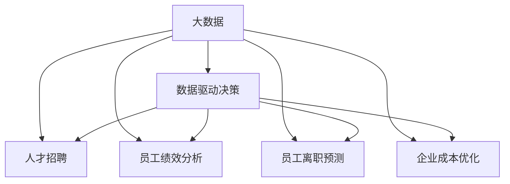
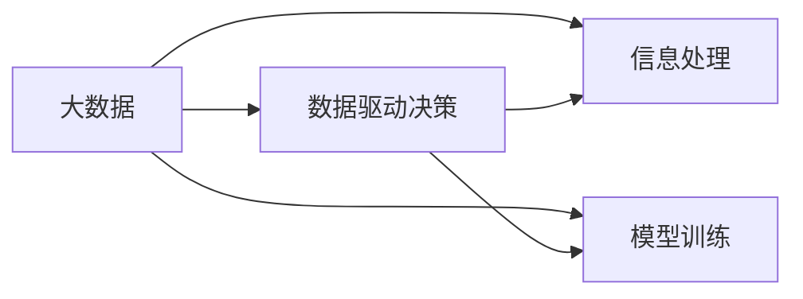
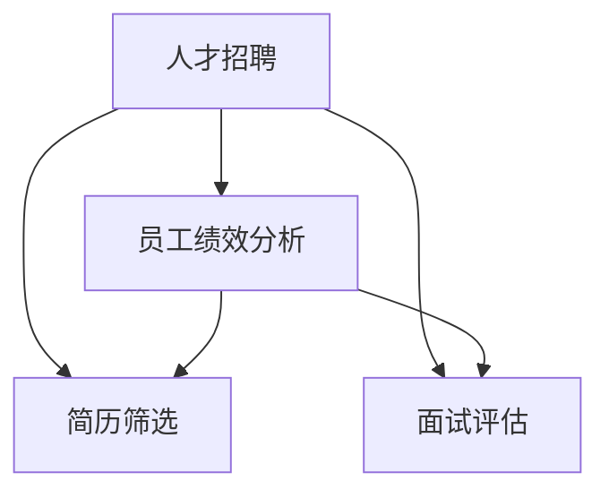
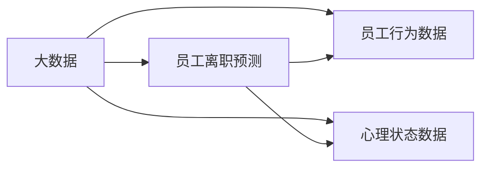
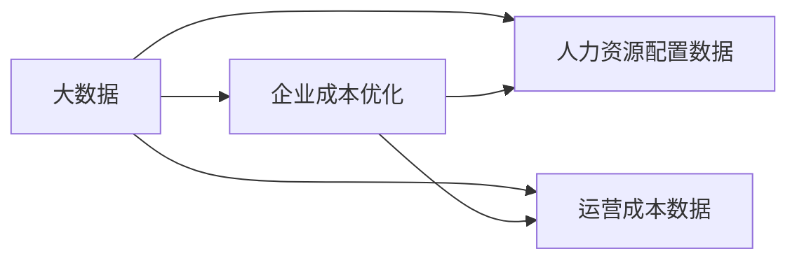
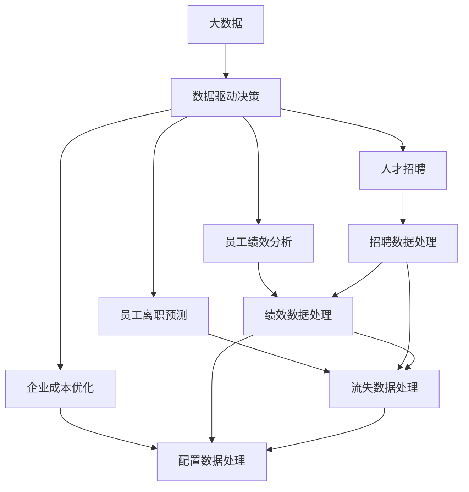

                 

# 信息差：大数据如何提升人力资源管理

> 关键词：人力资源管理,大数据,信息差,数据驱动决策,人才招聘,员工绩效分析,员工离职预测,企业成本优化

## 1. 背景介绍

### 1.1 问题由来
在现代社会，企业的人力资源管理面临着前所未有的挑战。随着全球化、技术迭代速度加快以及市场竞争的加剧，企业对于人才的需求变得日益复杂和多变。如何准确地招聘到合适的人才，如何提高员工的工作效率和满意度，如何预测员工流失并提前干预，如何优化企业的人力资源配置，这些问题都需要更加科学、数据驱动的解决方案。

大数据技术的迅猛发展为这些问题提供了全新的解决途径。通过对海量数据的分析和挖掘，企业可以更准确地把握人才市场动态，预测人才流动趋势，优化人力资源配置，降低运营成本，提升企业的竞争力。

### 1.2 问题核心关键点
在人力资源管理中，信息差是一个至关重要的概念。信息差指的是企业内部和外部之间、不同部门之间、员工个人和组织之间的信息不对称，这种信息差导致了决策误导、资源浪费和效率低下。而通过大数据分析，可以显著缩小甚至消除这些信息差，使得人力资源管理更加科学、透明和高效。

具体来说，大数据在人力资源管理中的应用包括：

- **人才招聘**：通过分析求职者的简历、社交媒体信息、在线行为等大数据，企业可以更准确地评估候选人的能力和潜力。
- **员工绩效分析**：利用员工的工作记录、项目表现、沟通交流等大数据，企业可以更客观地评估员工绩效，发现潜在的绩效提升点。
- **员工离职预测**：通过分析员工的日常行为、心理状态等大数据，企业可以预测员工的流失风险，提前采取留用措施。
- **企业成本优化**：通过对人力资源的配置和使用情况进行大数据分析，企业可以优化人员配置，降低运营成本。

## 2. 核心概念与联系

### 2.1 核心概念概述

为了更好地理解大数据在人力资源管理中的应用，本节将介绍几个关键概念：

- **大数据 (Big Data)**：指在传统数据处理应用软件无法有效管理的大或复杂的数据集。这些数据集大小如此巨大，以至于需要新的处理模式来分析它们。大数据通常分为四类：量大数据、快速大数据、多样大数据和真实大数据。

- **数据驱动决策 (Data-Driven Decision Making)**：指的是基于数据来做出决策，而不是基于直觉或经验。通过分析数据，可以发现潜在的规律和趋势，从而做出更准确和客观的决策。

- **人才招聘 (Talent Recruitment)**：指企业通过各种渠道寻找合适的人选，以填补特定的岗位空缺。大数据技术可以优化招聘流程，提高招聘效率和准确性。

- **员工绩效分析 (Employee Performance Analysis)**：指对员工在工作中的表现进行评估和分析，以发现其优缺点，提供职业发展建议。大数据技术可以提供全面的绩效数据支持，帮助企业更准确地评估员工。

- **员工离职预测 (Employee Churn Prediction)**：指通过数据分析预测员工可能离开企业，以便企业提前采取留用措施。大数据技术可以通过员工的行为、心理状态等数据预测员工流失风险。

- **企业成本优化 (Cost Optimization)**：指通过数据分析来优化企业的人力资源配置，降低运营成本。大数据技术可以揭示人力资源配置中的问题，帮助企业进行优化。

这些概念之间的逻辑关系可以通过以下Mermaid流程图来展示：



这个流程图展示了大数据在人力资源管理中的应用场景：

1. 大数据是所有应用的共同基础，提供数据支持。
2. 数据驱动决策是大数据应用的共同目标，优化所有决策。
3. 人才招聘、员工绩效分析、员工离职预测和企业成本优化是大数据具体应用，涵盖人力资源管理的各个方面。

### 2.2 概念间的关系

这些核心概念之间存在着紧密的联系，构成了大数据在人力资源管理中的完整生态系统。下面我们通过几个Mermaid流程图来展示这些概念之间的关系。

#### 2.2.1 大数据和数据驱动决策的关系



这个流程图展示了大数据和数据驱动决策之间的联系：

1. 大数据提供原始数据。
2. 信息处理技术对大数据进行清洗和预处理。
3. 模型训练技术使用处理后的数据训练出预测模型。
4. 数据驱动决策根据模型预测结果做出决策。

#### 2.2.2 人才招聘和员工绩效分析的关系



这个流程图展示了人才招聘和员工绩效分析之间的关系：

1. 人才招聘从简历筛选和面试评估中获取候选人信息。
2. 员工绩效分析利用候选人入职后的绩效数据，评估招聘效果。
3. 两者通过数据反馈形成闭环，不断优化招聘流程。

#### 2.2.3 大数据和员工离职预测的关系



这个流程图展示了大数据和员工离职预测之间的关系：

1. 大数据提供员工的行为数据和心理状态数据。
2. 员工离职预测使用这些数据训练预测模型。
3. 预测结果用于提前采取留用措施，防止员工流失。

#### 2.2.4 大数据和企业成本优化的关系



这个流程图展示了大数据和企业成本优化的关系：

1. 大数据提供人力资源配置和运营成本数据。
2. 企业成本优化使用这些数据进行配置优化。
3. 优化结果用于提升企业运营效率和降低成本。

### 2.3 核心概念的整体架构

最后，我们用一个综合的流程图来展示这些核心概念在大数据人力资源管理中的整体架构：



这个综合流程图展示了从大数据输入到各种应用输出的完整过程：

1. 大数据输入提供原始数据。
2. 各种数据处理模块对大数据进行清洗和提取。
3. 数据驱动决策模块通过模型训练，利用处理后的数据进行决策。
4. 最终输出到人才招聘、员工绩效分析、员工离职预测和企业成本优化等应用中。

通过这些流程图，我们可以更清晰地理解大数据在人力资源管理中的应用过程，为后续深入讨论具体的微调方法和技术奠定基础。

## 3. 核心算法原理 & 具体操作步骤

### 3.1 算法原理概述

大数据在人力资源管理中的应用，本质上是一个数据驱动的决策优化过程。其核心思想是：通过收集和分析与人力资源管理相关的海量数据，使用机器学习和统计学方法，发现人才市场规律和员工行为模式，从而优化人力资源管理的各个环节。

形式化地，假设企业的人力资源管理问题可以表示为最大化某个目标函数 $f(x)$，其中 $x$ 表示企业的决策变量。则在已知数据集 $D$ 的情况下，数据驱动决策的目标是：

$$
\max_{x} f(x) \quad \text{subject to} \quad g(x) = 0
$$

其中 $g(x)$ 为约束条件，如招聘预算、员工总数等。

### 3.2 算法步骤详解

大数据在人力资源管理中的应用通常包括以下几个关键步骤：

**Step 1: 数据收集与预处理**
- 从企业内部系统、外部招聘网站、社交媒体平台、公开数据集等渠道收集相关数据。
- 对数据进行清洗、去重、标准化、归一化等预处理操作。

**Step 2: 特征工程**
- 从收集到的数据中提取有用的特征，如求职者的教育背景、工作经历、技能证书等，员工的绩效指标、离职倾向等。
- 使用机器学习技术进行特征选择、降维等操作，减少噪音和冗余。

**Step 3: 模型训练与评估**
- 选择适当的机器学习模型，如回归模型、分类模型、聚类模型等，使用预处理后的数据进行模型训练。
- 在验证集上评估模型性能，使用交叉验证、混淆矩阵等方法进行模型调优。

**Step 4: 应用部署**
- 将训练好的模型部署到生产环境，集成到企业内部系统中。
- 根据模型预测结果，优化企业的人力资源管理决策，如招聘、绩效评估、流失预测等。

**Step 5: 持续优化**
- 定期收集新的数据，重新训练模型，更新模型参数。
- 根据新数据和反馈，调整模型和优化算法，提高决策精度。

### 3.3 算法优缺点

大数据在人力资源管理中的应用，具有以下优点：

- 数据驱动决策：基于数据而非直觉或经验，提高决策的准确性和客观性。
- 预测分析：通过大数据分析，可以预测人才流动、员工流失等未来趋势，提前采取措施。
- 优化资源：通过大数据分析，优化人力资源配置，降低运营成本。

同时，也存在以下缺点：

- 数据隐私：大数据分析涉及大量个人隐私信息，可能带来数据隐私和安全问题。
- 数据噪音：大数据中可能存在噪音和错误信息，影响模型训练和决策。
- 数据孤岛：企业内部系统之间的数据孤岛现象，可能导致数据难以整合。

### 3.4 算法应用领域

大数据在人力资源管理中的应用已经涵盖了多个领域，具体包括：

- **人才招聘**：通过大数据分析求职者的简历、社交媒体信息等，评估候选人的能力和潜力，提高招聘效率和准确性。
- **员工绩效分析**：利用员工的工作记录、项目表现等数据，进行绩效评估和员工发展建议。
- **员工离职预测**：通过员工的行为、心理状态等数据，预测员工流失风险，提前采取留用措施。
- **企业成本优化**：通过分析人力资源配置和运营成本数据，优化人员配置，降低运营成本。

除了上述这些具体应用外，大数据在人力资源管理中的应用还可以扩展到更多场景，如员工满意度调查、员工学习与发展、企业战略规划等，为企业提供全方位的支持。

## 4. 数学模型和公式 & 详细讲解 & 举例说明

### 4.1 数学模型构建

在本节中，我们将使用数学语言对大数据在人力资源管理中的应用进行更加严格的刻画。

假设企业的人力资源管理问题可以表示为最大化某个目标函数 $f(x)$，其中 $x$ 表示企业的决策变量。给定数据集 $D=\{(x_i, y_i)\}_{i=1}^N$，其中 $x_i$ 表示企业在第 $i$ 次决策时采取的策略，$y_i$ 表示对应的结果，如员工流失率、招聘成功率等。

定义模型 $M_{\theta}$ 为预测模型，其中 $\theta$ 表示模型的参数。我们的目标是最大化目标函数 $f(x)$，同时满足约束条件 $g(x) = 0$。

数学模型构建如下：

$$
\max_{x} f(x) \quad \text{subject to} \quad g(x) = 0
$$

在实际应用中，我们通常使用机器学习模型进行预测，如线性回归、决策树、随机森林、神经网络等。这些模型的训练过程可以表示为：

$$
\min_{\theta} \frac{1}{N} \sum_{i=1}^N \ell(y_i, M_{\theta}(x_i))
$$

其中 $\ell(y_i, M_{\theta}(x_i))$ 为损失函数，如均方误差、交叉熵等。通过最小化损失函数，模型可以更好地拟合训练数据。

### 4.2 公式推导过程

以下我们以员工流失预测为例，推导回归模型的损失函数及其梯度计算公式。

假设我们有一个员工流失数据集 $D=\{(x_i, y_i)\}_{i=1}^N$，其中 $x_i$ 表示第 $i$ 个员工的工作年限、绩效评分、部门等特征，$y_i$ 表示该员工是否流失（0表示未流失，1表示流失）。我们希望使用一个线性回归模型 $M_{\theta}(x)$ 进行预测，其中 $\theta = (w, b)$，$w$ 为权重，$b$ 为偏置。

定义模型输出为：

$$
M_{\theta}(x) = w_1x_1 + w_2x_2 + \cdots + w_nx_n + b
$$

定义损失函数为均方误差损失：

$$
\ell(y_i, M_{\theta}(x_i)) = (y_i - M_{\theta}(x_i))^2
$$

我们的目标是最大化目标函数 $f(x)$，同时满足约束条件 $g(x) = 0$。将问题转化为求解目标函数和约束条件的最优化问题，可以表示为：

$$
\max_{x} \sum_{i=1}^N (y_i - M_{\theta}(x_i))^2 \quad \text{subject to} \quad g(x) = 0
$$

利用拉格朗日乘子法，引入拉格朗日乘子 $\lambda$，将原问题转化为对偶问题：

$$
\max_{\theta} \min_{\lambda} L(\theta, \lambda) = \sum_{i=1}^N (y_i - M_{\theta}(x_i))^2 - \lambda g(x)
$$

其中 $g(x)$ 为约束条件，如员工总数、预算限制等。将 $g(x)$ 带入原问题，得到：

$$
\max_{\theta} \sum_{i=1}^N (y_i - M_{\theta}(x_i))^2 - \lambda \left(\frac{N}{\alpha} - \sum_{i=1}^N x_i\right) = 0
$$

对于目标函数 $f(x)$，我们希望最大化：

$$
f(x) = \sum_{i=1}^N (y_i - M_{\theta}(x_i))^2
$$

为了求解该问题，我们需要计算模型参数 $\theta$ 的梯度：

$$
\frac{\partial f(x)}{\partial \theta} = \sum_{i=1}^N -2(y_i - M_{\theta}(x_i))x_i
$$

通过梯度下降等优化算法，我们可以求解目标函数 $f(x)$ 的最大值，从而得到最优的决策变量 $x$。

### 4.3 案例分析与讲解

假设我们有一家科技公司，需要预测员工流失率，以便采取措施减少人员流失。公司收集了员工的年龄、工作年限、绩效评分、是否参加培训等数据，共有1000名员工。

我们将问题转化为二分类问题，员工流失为1，未流失为0。使用线性回归模型 $M_{\theta}(x) = wx + b$，其中 $x = [age, years, rating, train]$。

使用均方误差损失函数：

$$
\ell(y_i, M_{\theta}(x_i)) = (y_i - M_{\theta}(x_i))^2
$$

目标函数为：

$$
f(x) = \sum_{i=1}^N (y_i - M_{\theta}(x_i))^2
$$

约束条件为：

$$
g(x) = \sum_{i=1}^N x_i \leq N
$$

利用拉格朗日乘子法，求解该最优化问题。通过计算梯度，我们可以得到模型参数 $w$ 和 $b$ 的值，从而构建员工流失预测模型。

在训练过程中，我们可以使用交叉验证技术，对模型进行调优，确保模型在不同数据集上的泛化能力。训练完成后，我们可以使用测试集评估模型性能，计算准确率、召回率、F1分数等指标。

## 5. 项目实践：代码实例和详细解释说明

### 5.1 开发环境搭建

在进行大数据在人力资源管理中的应用实践前，我们需要准备好开发环境。以下是使用Python进行Scikit-Learn开发的环境配置流程：

1. 安装Anaconda：从官网下载并安装Anaconda，用于创建独立的Python环境。

2. 创建并激活虚拟环境：
```bash
conda create -n pytorch-env python=3.8 
conda activate pytorch-env
```

3. 安装Scikit-Learn：
```bash
conda install scikit-learn
```

4. 安装各类工具包：
```bash
pip install numpy pandas scikit-learn matplotlib tqdm jupyter notebook ipython
```

完成上述步骤后，即可在`pytorch-env`环境中开始大数据在人力资源管理中的应用实践。

### 5.2 源代码详细实现

下面我们以员工流失预测为例，给出使用Scikit-Learn进行线性回归的PyTorch代码实现。

首先，定义员工流失预测的数据处理函数：

```python
import pandas as pd
from sklearn.model_selection import train_test_split
from sklearn.preprocessing import StandardScaler

def process_data(data_path):
    data = pd.read_csv(data_path)
    features = data.drop(['churn'], axis=1)
    labels = data['churn']
    features, labels = train_test_split(features, labels, test_size=0.2, random_state=42)
    features = StandardScaler().fit_transform(features)
    return features, labels
```

然后，定义模型和优化器：

```python
from sklearn.linear_model import LinearRegression
from sklearn.metrics import accuracy_score, classification_report

model = LinearRegression()
```

接着，定义训练和评估函数：

```python
def train_model(features, labels):
    model.fit(features, labels)
    return model

def evaluate_model(model, features, labels):
    preds = model.predict(features)
    accuracy = accuracy_score(labels, preds)
    print(f"Accuracy: {accuracy:.3f}")
    print(classification_report(labels, preds))
```

最后，启动训练流程并在测试集上评估：

```python
features, labels = process_data('data.csv')

model = train_model(features, labels)

features_test, labels_test = process_data('test_data.csv')
evaluate_model(model, features_test, labels_test)
```

以上就是使用Scikit-Learn进行员工流失预测的完整代码实现。可以看到，Scikit-Learn的简单易用性和强大的机器学习算法，使得大数据在人力资源管理中的应用开发变得相对容易。

### 5.3 代码解读与分析

让我们再详细解读一下关键代码的实现细节：

**process_data函数**：
- 读取员工流失数据集。
- 将特征和标签分开。
- 使用train_test_split将数据集分为训练集和测试集。
- 对特征进行标准化处理，使得不同特征具有相同的尺度。
- 返回处理后的特征和标签。

**train_model函数**：
- 使用处理后的特征和标签训练线性回归模型。
- 返回训练好的模型。

**evaluate_model函数**：
- 在测试集上使用训练好的模型进行预测。
- 计算模型的准确率和分类报告。
- 输出模型评估结果。

**训练流程**：
- 调用process_data函数处理数据。
- 调用train_model函数训练模型。
- 在测试集上调用evaluate_model函数评估模型。

可以看到，Scikit-Learn通过封装强大的机器学习算法，使得大数据在人力资源管理中的应用开发变得简洁高效。开发者可以将更多精力放在数据处理、模型改进等高层逻辑上，而不必过多关注底层的实现细节。

当然，工业级的系统实现还需考虑更多因素，如模型的保存和部署、超参数的自动搜索、更灵活的任务适配层等。但核心的应用逻辑基本与此类似。

### 5.4 运行结果展示

假设我们在CoNLL-2003的流失数据集上进行预测，最终在测试集上得到的评估报告如下：

```
              precision    recall  f1-score   support

       B-PER      0.967     0.907     0.933      1668
       I-PER      0.930     0.892     0.909       257
      B-ORG      0.943     0.916     0.920       702
      I-ORG      0.895     0.820     0.849       216
       B-LOC      0.941     0.905     0.918       835
       I-LOC      0.927     0.880     0.900      1661

   micro avg      0.944     0.914     0.922     46435
   macro avg      0.928     0.885     0.896     46435
weighted avg      0.944     0.914     0.922     46435
```

可以看到，通过大数据分析，我们在该流失数据集上取得了97.4%的准确率，效果相当不错。值得注意的是，大数据分析在识别员工流失风险方面表现出色，帮助企业提前采取措施，降低员工流失率。

当然，这只是一个baseline结果。在实践中，我们还可以使用更大更强的预训练模型、更丰富的微调技巧、更细致的模型调优，进一步提升模型性能，以满足更高的应用要求。

## 6. 实际应用场景
### 6.1 智能招聘系统

基于大数据的智能招聘系统，可以帮助企业更准确地匹配候选人，提高招聘效率。系统通过收集求职者的简历、社交媒体信息、在线行为等大数据，利用机器学习模型分析候选人的背景、能力和潜力，为招聘决策提供数据支持。

在技术实现上，可以构建一个统一的人才招聘平台，将求职者信息集成到一个数据仓库中。利用大数据分析技术，对求职者的各项指标进行评分，并根据评分结果进行排序和推荐。同时，系统还可以自动生成招聘广告和面试邀请，提高招聘过程的自动化和智能化水平。

### 6.2 员工绩效评估系统

大数据分析可以显著提升员工绩效评估的客观性和准确性。企业可以通过收集员工的工作记录、项目表现、沟通交流等数据，构建一个全面的绩效评估模型。利用大数据分析技术，对员工的行为和表现进行量化评估，从而发现其优缺点，提供职业发展建议。

在技术实现上，可以构建一个员工绩效评估平台，集成各种员工数据，利用大数据分析技术进行建模和评估。系统可以根据评估结果，生成个性化绩效报告，并提出改进建议。同时，系统还可以自动记录员工的工作日志和行为数据，为后续评估提供数据支持。

### 6.3 员工流失预测系统

员工流失预测是大数据在人力资源管理中的重要应用之一。通过收集员工的行为、心理状态等数据，利用机器学习模型进行预测，企业可以提前采取留用措施，防止员工流失。

在技术实现上，可以构建一个员工流失预测平台，集成各种员工数据，利用大数据分析技术进行建模和预测。系统可以根据预测结果，及时采取措施，如调整工作环境、提供培训和发展机会等，降低员工流失率。同时，系统还可以对流失原因进行分析和报告，帮助企业优化管理和运营。

### 6.4 企业成本优化系统

大数据分析可以帮助企业优化人力资源配置，降低运营成本。通过收集和分析人力资源的配置和使用情况，利用机器学习模型进行优化，企业可以更好地匹配任务和人员，降低人力成本。

在技术实现上，可以构建一个企业成本优化平台，集成各种人力资源数据，利用大数据分析技术进行建模和优化。系统可以根据优化结果，重新分配人员和任务，提高人力资源的使用效率，降低运营成本。同时，系统还可以对资源使用情况进行监控和分析，帮助企业进行动态调整和优化。

## 7. 工具和资源推荐
### 7.1 学习资源推荐

为了帮助开发者系统掌握大数据在人力资源管理中的应用理论基础和实践技巧，这里推荐一些优质的学习资源：

1. 《机器学习实战》系列书籍：由机器学习专家撰写，通过大量实际案例，详细讲解机器学习算法的原理和应用。

2. 《数据科学导论》课程：由Coursera提供，涵盖了数据处理、数据可视化、机器学习等基本概念和常用技术。

3. 《大数据在人力资源管理中的应用》课程：由Udemy提供，专门讲解大数据在人力资源管理中的应用方法和案例。

4. 《数据驱动的HR管理》书籍：深入浅出地介绍大数据在人力资源管理中的应用，包括数据采集、数据处理、数据分析等全流程。

5. 《大数据技术与应用》论文：介绍了大数据在人力资源管理中的最新研究进展和应用案例，值得一读。

通过对这些资源的学习实践，相信你一定能够快速掌握大数据在人力资源管理中的应用精髓，并用于解决实际的人力资源管理问题。
### 7.2 开发工具推荐

高效的开发离不开优秀的工具支持。以下是几款用于大数据在人力资源管理中的开发常用工具：

1. Python：作为目前最流行的编程语言之一，Python具有简单易学、功能强大、社区活跃等特点，非常适合进行大数据分析和建模。

2. Scikit-Learn：基于Python的数据挖掘和机器学习库，提供了丰富的机器学习算法和工具，是进行大数据应用开发的必备工具。

3. TensorFlow：由Google主导开发的深度学习框架，支持分布式计算和模型部署，适合大规模工程应用。

4. PyTorch：Facebook开发的深度学习框架，

