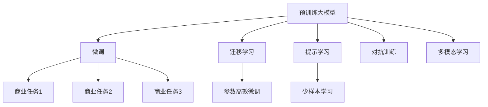
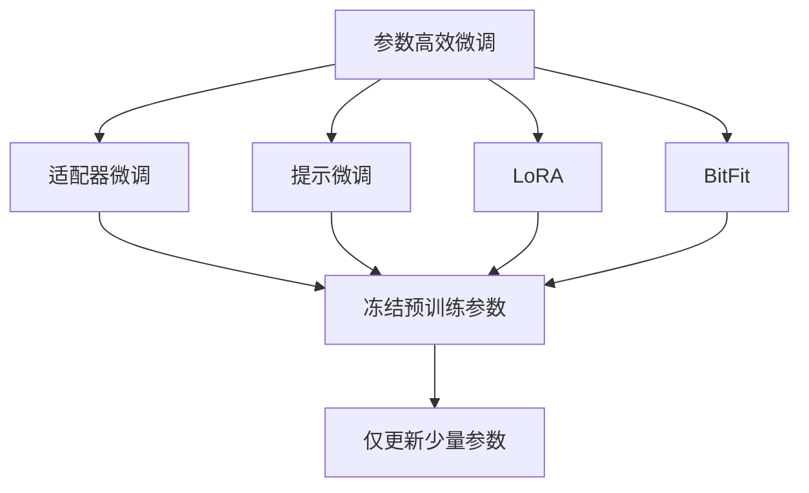
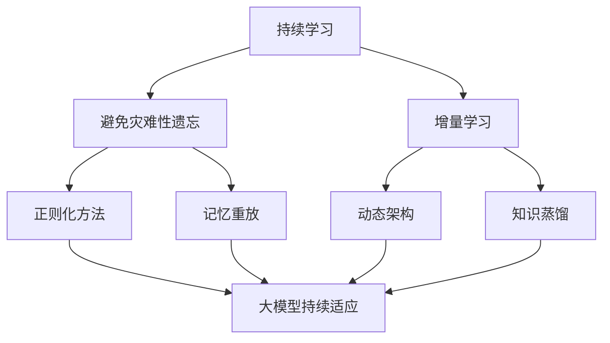

                 

# 大模型：从理论到实践的商业应用

> 关键词：大模型,预训练,微调,迁移学习,商业应用,企业智能化,人工智能,深度学习

## 1. 背景介绍

### 1.1 问题由来
随着深度学习技术的飞速发展，尤其是预训练大模型的出现，人工智能领域迎来了新的里程碑。大模型通常指的是具有数百亿甚至更多参数的神经网络，通过大规模无标签数据预训练，学习到丰富的语言和视觉表示能力。预训练大模型的一个显著优势是，它们可以在不同任务上实现跨领域的知识迁移，极大降低了新任务开发的成本和时间。

近年来，预训练大模型在商业应用中取得了显著成效，被广泛应用于自然语言处理（NLP）、计算机视觉（CV）、语音识别等领域。通过微调（Fine-Tuning）等技术手段，预训练模型可以在特定商业场景中实现高性能的定制化应用。例如，GPT-3在大规模文本生成、问答系统、代码生成等领域展现出了强大的潜力。在大规模电商推荐系统、智能客服、金融风控等场景中，大模型也展示了其独特的优势。

### 1.2 问题核心关键点
预训练大模型的商业应用主要集中在以下几个关键点：

- **预训练与微调**：预训练大模型在通用数据集上进行预训练，通过微调适应特定商业任务。
- **迁移学习**：利用大模型的跨领域知识，在不同任务间进行迁移学习。
- **参数高效微调（PEFT）**：在大模型的基础上，仅微调少量参数，减少计算资源消耗。
- **提示学习**：通过特定提示模板，引导模型进行推理和生成，减少微调参数。
- **少样本学习**：在大模型上进行零样本或少样本学习，减少对标注数据的依赖。

这些技术手段极大地拓展了预训练大模型的应用范围，提升了商业系统在特定任务上的性能。

### 1.3 问题研究意义
研究大模型的商业应用，对于推动人工智能技术的落地应用，提升企业智能化水平，加速产业数字化转型，具有重要意义：

1. **降低开发成本**：利用预训练大模型，企业可以快速开发定制化商业应用，减少从头开发所需的数据、计算和人力成本。
2. **提升系统性能**：通过微调等技术，大模型能够更好地适应特定任务，在商业场景中取得优异的性能表现。
3. **加速应用进程**：大模型预训练-微调的过程，可以显著缩短任务开发周期，提高系统部署速度。
4. **带来技术创新**：预训练-微调的技术促进了对大模型知识的深入研究，催生了如参数高效微调、提示学习、少样本学习等新的研究方向。
5. **赋能产业升级**：预训练大模型的应用，推动了传统行业向智能化方向发展，为行业数字化转型提供新动能。

## 2. 核心概念与联系

### 2.1 核心概念概述

为更好地理解预训练大模型的商业应用，本节将介绍几个关键核心概念：

- **预训练大模型**：如GPT-3、BERT、DALL-E等，通过大规模无标签数据预训练，学习到通用的语言和视觉表示能力。
- **微调**：在大模型的基础上，使用特定商业任务的少量标注数据进行微调，优化模型在特定任务上的性能。
- **迁移学习**：利用大模型的跨领域知识，在不同商业任务间进行迁移学习。
- **参数高效微调（PEFT）**：在大模型的基础上，仅微调少量参数，减少计算资源消耗。
- **提示学习**：通过特定提示模板，引导模型进行推理和生成，减少微调参数。
- **少样本学习**：在大模型上进行零样本或少样本学习，减少对标注数据的依赖。
- **对抗训练**：引入对抗样本，提高模型鲁棒性。
- **多模态学习**：将视觉、文本、语音等多模态信息融合，提升模型的综合理解能力。

这些核心概念之间紧密关联，共同构成了预训练大模型的商业应用框架。以下是一个简化的Mermaid流程图，展示这些概念之间的关系：



### 2.2 概念间的关系

这些核心概念之间的关系紧密而复杂。以下通过几个Mermaid流程图来进一步展示：

#### 2.2.1 预训练与微调的关系


预训练是微调的基础，微调是在预训练模型上进行的特定任务适配。

#### 2.2.2 迁移学习与微调的关系


迁移学习利用预训练模型在不同商业任务间进行知识迁移，通过微调进一步优化。

#### 2.2.3 参数高效微调（PEFT）



参数高效微调仅更新少量模型参数，固定大部分预训练参数，减少计算资源消耗。

#### 2.2.4 持续学习在大模型的应用



持续学习使模型能够不断学习新知识，同时避免遗忘旧知识。

## 3. 核心算法原理 & 具体操作步骤

### 3.1 算法原理概述

预训练大模型的商业应用主要基于以下两个核心算法：

- **微调算法**：在大模型的基础上，使用特定商业任务的少量标注数据进行微调，优化模型在特定任务上的性能。微调算法利用优化算法（如AdamW、SGD等），最小化任务损失函数，从而获得最优参数。
- **迁移学习算法**：利用大模型的跨领域知识，在不同商业任务间进行迁移学习。迁移学习通过预训练模型和微调模型的联合训练，使得模型能够在不同任务间进行知识迁移。

### 3.2 算法步骤详解

预训练大模型的商业应用步骤如下：

1. **数据准备**：收集商业任务的标注数据集，并进行预处理和划分。标注数据集应尽量覆盖任务的所有可能情况。
2. **模型初始化**：选择适合的预训练大模型，如GPT-3、BERT等，进行初始化。
3. **微调过程**：在预训练模型基础上，使用标注数据进行微调，优化模型参数。微调过程中，需要设置合适的学习率、批大小、迭代轮数等超参数。
4. **模型评估**：在测试集上评估微调后的模型性能，检查其在特定商业任务上的表现。
5. **模型部署**：将微调后的模型部署到实际商业应用中，进行性能监控和迭代优化。

### 3.3 算法优缺点

预训练大模型的商业应用具有以下优点：

- **高效性**：利用预训练模型的知识，仅需少量标注数据即可快速实现任务适配，节省开发时间和成本。
- **泛化能力**：预训练模型在大规模数据上学习，具备较强的泛化能力，能够在不同任务上取得较好的表现。
- **可解释性**：利用微调和提示学习等技术手段，可以控制模型输出，提供可解释的推理过程。

同时，预训练大模型的商业应用也存在一些缺点：

- **数据依赖**：微调效果高度依赖标注数据的质量和数量，获取高质量标注数据成本较高。
- **模型复杂性**：大模型的参数量庞大，推理和微调过程计算资源消耗大，需要高性能硬件支持。
- **知识迁移局限**：不同商业任务间的知识迁移效果可能因任务复杂度、数据分布等因素受限。

### 3.4 算法应用领域

预训练大模型的商业应用涵盖了多个领域，包括但不限于：

- **自然语言处理**：如情感分析、命名实体识别、文本分类、机器翻译等。
- **计算机视觉**：如图像分类、目标检测、图像生成等。
- **语音识别**：如自动语音识别、语音合成、情感识别等。
- **推荐系统**：如电商推荐、广告推荐、内容推荐等。
- **金融风控**：如信用评估、风险预测、欺诈检测等。
- **智能客服**：如对话系统、智能问答、客户推荐等。
- **智能制造**：如设备监控、质量检测、生产调度等。
- **医疗健康**：如疾病诊断、症状分析、患者咨询等。

## 4. 数学模型和公式 & 详细讲解 & 举例说明

### 4.1 数学模型构建

预训练大模型在商业应用中，通常基于以下数学模型进行微调：

- **任务损失函数**：定义在标注数据上的损失函数，衡量模型输出与真实标签之间的差异。
- **参数更新**：利用优化算法（如AdamW、SGD等），最小化损失函数，更新模型参数。

### 4.2 公式推导过程

以文本分类任务为例，假设模型输入为文本 $x$，输出为分类概率向量 $\hat{y}=M_{\theta}(x)$，其中 $\theta$ 为模型参数。任务损失函数为交叉熵损失函数：

$$
\ell(\theta) = -\frac{1}{N} \sum_{i=1}^N \sum_{j=1}^C y_{ij} \log \hat{y}_{ij}
$$

其中 $y_{ij}$ 为第 $i$ 个样本属于第 $j$ 类的真实标签，$C$ 为类别数。

模型的参数更新公式为：

$$
\theta \leftarrow \theta - \eta \nabla_{\theta}\ell(\theta)
$$

其中 $\eta$ 为学习率，$\nabla_{\theta}\ell(\theta)$ 为损失函数对模型参数的梯度。

### 4.3 案例分析与讲解

以情感分析任务为例，分析预训练大模型在商业应用中的具体实现。情感分析任务的目标是从文本中识别情感极性（如正面、负面、中性）。步骤如下：

1. **数据准备**：收集标注情感极性的文本数据集，并进行预处理。
2. **模型选择**：选择BERT等预训练模型作为初始化模型。
3. **微调过程**：利用标注数据，在BERT模型的基础上进行微调，优化情感分析任务的性能。
4. **模型评估**：在测试集上评估微调后模型的性能，如准确率、F1分数等。
5. **模型部署**：将微调后的模型部署到实际商业应用中，进行性能监控和迭代优化。

## 5. 项目实践：代码实例和详细解释说明

### 5.1 开发环境搭建

在开始预训练大模型的商业应用开发前，需要准备以下开发环境：

1. **安装Anaconda**：从官网下载并安装Anaconda，用于创建独立的Python环境。
2. **创建并激活虚拟环境**：
   ```bash
   conda create -n pytorch-env python=3.8 
   conda activate pytorch-env
   ```
3. **安装PyTorch**：根据CUDA版本，从官网获取对应的安装命令。例如：
   ```bash
   conda install pytorch torchvision torchaudio cudatoolkit=11.1 -c pytorch -c conda-forge
   ```
4. **安装Transformer库**：
   ```bash
   pip install transformers
   ```
5. **安装各类工具包**：
   ```bash
   pip install numpy pandas scikit-learn matplotlib tqdm jupyter notebook ipython
   ```

完成上述步骤后，即可在`pytorch-env`环境中开始开发。

### 5.2 源代码详细实现

以下是一个使用PyTorch框架，对BERT模型进行情感分析任务微调的示例代码：

```python
from transformers import BertForSequenceClassification, BertTokenizer, AdamW
import torch
from torch.utils.data import Dataset, DataLoader
from sklearn.metrics import classification_report

# 准备数据集
class SentimentDataset(Dataset):
    def __init__(self, texts, labels):
        self.texts = texts
        self.labels = labels
        self.tokenizer = BertTokenizer.from_pretrained('bert-base-cased')
        
    def __len__(self):
        return len(self.texts)
    
    def __getitem__(self, idx):
        text = self.texts[idx]
        label = self.labels[idx]
        
        encoding = self.tokenizer(text, truncation=True, padding='max_length', max_length=256, return_tensors='pt')
        return {'input_ids': encoding['input_ids'], 'attention_mask': encoding['attention_mask'], 'labels': torch.tensor(label, dtype=torch.long)}

# 数据加载器
def get_dataloader(dataset, batch_size):
    return DataLoader(dataset, batch_size=batch_size, shuffle=True)

# 模型定义和训练
model = BertForSequenceClassification.from_pretrained('bert-base-cased', num_labels=3)
optimizer = AdamW(model.parameters(), lr=2e-5)

# 训练过程
def train_epoch(model, dataloader, optimizer, device):
    model.to(device)
    model.train()
    
    for batch in dataloader:
        input_ids = batch['input_ids'].to(device)
        attention_mask = batch['attention_mask'].to(device)
        labels = batch['labels'].to(device)
        
        model.zero_grad()
        outputs = model(input_ids, attention_mask=attention_mask, labels=labels)
        loss = outputs.loss
        loss.backward()
        optimizer.step()
        
    return loss.item()

# 模型评估
def evaluate(model, dataloader, device):
    model.eval()
    preds, labels = [], []
    
    with torch.no_grad():
        for batch in dataloader:
            input_ids = batch['input_ids'].to(device)
            attention_mask = batch['attention_mask'].to(device)
            labels = batch['labels'].to(device)
            
            outputs = model(input_ids, attention_mask=attention_mask)
            preds.append(outputs.logits.argmax(dim=1).tolist())
            labels.append(labels.tolist())
        
    return classification_report(labels, preds)

# 训练和评估
device = torch.device('cuda' if torch.cuda.is_available() else 'cpu')
train_dataset = SentimentDataset(train_texts, train_labels)
dev_dataset = SentimentDataset(dev_texts, dev_labels)
test_dataset = SentimentDataset(test_texts, test_labels)

train_dataloader = get_dataloader(train_dataset, batch_size=32)
dev_dataloader = get_dataloader(dev_dataset, batch_size=32)
test_dataloader = get_dataloader(test_dataset, batch_size=32)

epochs = 3
batch_size = 32

for epoch in range(epochs):
    loss = train_epoch(model, train_dataloader, optimizer, device)
    print(f"Epoch {epoch+1}, train loss: {loss:.3f}")
    
    print(f"Epoch {epoch+1}, dev results:")
    dev_results = evaluate(model, dev_dataloader, device)
    print(dev_results)
    
print(f"Final test results:")
test_results = evaluate(model, test_dataloader, device)
print(test_results)
```

### 5.3 代码解读与分析

以下是代码关键部分的解读与分析：

1. **SentimentDataset类**：
   - `__init__`方法：初始化文本、标签和分词器。
   - `__len__`方法：返回数据集的样本数量。
   - `__getitem__`方法：对单个样本进行处理，将文本输入编码为token ids，并返回模型所需的输入。

2. **模型定义和训练**：
   - `BertForSequenceClassification.from_pretrained`：从预训练的BERT模型加载模型。
   - `AdamW`：设置优化器。
   - `train_epoch`函数：在每个epoch内，对数据进行迭代训练，计算并返回损失。

3. **模型评估**：
   - `evaluate`函数：在测试集上评估模型的性能，并返回分类报告。
   - `classification_report`：使用sklearn计算并返回分类指标。

4. **训练和评估流程**：
   - `device`：选择GPU或CPU进行训练。
   - `train_dataset`等数据集定义：将文本和标签转换为模型所需格式。
   - `train_dataloader`等数据加载器：控制模型的批量大小和训练数据顺序。
   - `epochs`和`batch_size`：控制训练轮数和批量大小。

5. **运行结果展示**：
   - `train_epoch`和`evaluate`函数的输出：训练损失和测试分类报告。

以上代码示例展示了如何使用PyTorch框架，在商业应用场景中对BERT模型进行情感分析任务的微调。通过简单的几步操作，即可利用预训练模型快速构建定制化的商业应用。

## 6. 实际应用场景

### 6.1 智能客服系统

基于预训练大模型的智能客服系统，可以大幅提升客户服务效率和质量。传统的客服系统需要大量人工客服，高峰期响应速度慢，且服务质量难以保证。使用预训练大模型进行微调，可以构建7x24小时在线的智能客服系统，快速响应客户咨询，提高服务质量。

在技术实现上，可以收集企业内部的客服对话记录，将问题和最佳答复构建成监督数据，在预训练模型基础上进行微调。微调后的模型能够自动理解客户意图，匹配最合适的答复，并进行对话交互，大大减少人工客服的工作量，提升客户满意度。

### 6.2 金融舆情监测

金融机构需要实时监测市场舆论动向，以便及时应对负面信息传播，规避金融风险。传统的舆情监测方式成本高、效率低，难以应对网络时代海量信息爆发的挑战。使用预训练大模型进行情感分析和话题分类任务的微调，可以实时监测金融舆情，预测市场趋势，辅助风险控制。

具体而言，可以收集金融领域相关的新闻、评论等文本数据，并对其进行情感标注和话题分类标注。在此基础上对预训练语言模型进行微调，使其能够自动判断文本情感倾向和讨论话题，在实时抓取的网络文本数据上进行舆情监测，及时预警负面信息，帮助金融机构快速应对潜在风险。

### 6.3 个性化推荐系统

当前的推荐系统往往只依赖用户的历史行为数据进行物品推荐，无法深入理解用户的真实兴趣偏好。使用预训练大模型进行推荐任务微调，可以更好地挖掘用户行为背后的语义信息，从而提供更精准、多样的推荐内容。

在实践中，可以收集用户浏览、点击、评论、分享等行为数据，提取和用户交互的物品标题、描述、标签等文本内容。将文本内容作为模型输入，用户的后续行为（如是否点击、购买等）作为监督信号，在此基础上微调预训练语言模型。微调后的模型能够从文本内容中准确把握用户的兴趣点，生成推荐列表，提高推荐效果和用户体验。

### 6.4 未来应用展望

随着预训练大模型的不断发展，其商业应用将不断拓展，展现出更加广阔的前景：

1. **多模态应用**：将视觉、文本、语音等多模态信息融合，提升模型的综合理解能力，应用于智能家居、智能医疗、智能制造等场景。
2. **边缘计算**：在边缘设备上进行模型推理，降低网络传输开销，提高响应速度，应用于物联网、智能交通等领域。
3. **联邦学习**：在分布式环境中，通过模型聚合和参数更新，保护用户隐私，应用于医疗、金融、零售等敏感领域。
4. **大规模并行计算**：利用分布式计算和GPU加速，处理大规模数据和模型，应用于科学研究、气候预测、生物信息学等领域。
5. **跨领域知识迁移**：在不同任务间进行知识迁移，提升模型在特定领域的表现，应用于医疗诊断、教育测评、法律咨询等垂直领域。

## 7. 工具和资源推荐

### 7.1 学习资源推荐

为了帮助开发者系统掌握预训练大模型的商业应用，这里推荐一些优质的学习资源：

1. **《深度学习》课程**：斯坦福大学李飞飞教授开设的深度学习课程，全面介绍深度学习的基本原理和经典算法，适合初学者和进阶学习者。
2. **《自然语言处理综述》**：斯坦福大学李飞飞教授团队编写的综述论文，系统总结了自然语言处理的最新进展，适合了解领域前沿。
3. **《Transformers实战》**：HuggingFace的Transformers库官方文档，提供丰富的预训练模型和微调样例代码，适合动手实践。
4. **《Python深度学习》**：Francois Chollet的深度学习实战书籍，深入浅出地介绍了TensorFlow和Keras框架，适合动手实践。
5. **《NLP实战》**：Oriol Vinyals的NLP实战书籍，介绍了在TensorFlow中实现NLP任务的经典案例，适合动手实践。

通过对这些资源的学习实践，相信你一定能够快速掌握预训练大模型的商业应用，并用于解决实际的NLP问题。

### 7.2 开发工具推荐

高效的开发离不开优秀的工具支持。以下是几款用于预训练大模型商业应用的常用工具：

1. **PyTorch**：基于Python的开源深度学习框架，灵活动态的计算图，适合快速迭代研究。
2. **TensorFlow**：由Google主导开发的开源深度学习框架，生产部署方便，适合大规模工程应用。
3. **HuggingFace Transformers库**：集成了众多SOTA预训练模型，支持PyTorch和TensorFlow，是微调任务开发的利器。
4. **TensorBoard**：TensorFlow配套的可视化工具，实时监测模型训练状态，提供丰富的图表呈现方式。
5. **Weights & Biases**：模型训练的实验跟踪工具，记录和可视化模型训练过程中的各项指标，方便对比和调优。
6. **Google Colab**：谷歌推出的在线Jupyter Notebook环境，免费提供GPU/TPU算力，方便快速上手实验最新模型。

合理利用这些工具，可以显著提升预训练大模型的商业应用开发效率，加快创新迭代的步伐。

### 7.3 相关论文推荐

预训练大模型的商业应用涉及多个前沿研究方向，以下是几篇奠基性的相关论文，推荐阅读：

1. **Attention is All You Need**：提出Transformer结构，开启了NLP领域的预训练大模型时代。
2. **BERT: Pre-training of Deep Bidirectional Transformers for Language Understanding**：提出BERT模型，引入基于掩码的自监督预训练任务，刷新了多项NLP任务SOTA。
3. **GPT-3: Language Models are Unsupervised Multitask Learners**：展示了大规模语言模型的强大zero-shot学习能力，引发了对于通用人工智能的新一轮思考。
4. **XLNet: Generalized Autoregressive Pretraining for Language Understanding**：提出XLNet模型，解决自监督学习中的位置偏差问题，进一步提升了模型的性能。
5. **BART: Denoising Sequence-to-Sequence Pre-training for Natural Language Processing**：提出BART模型，适用于文本生成、文本摘要等序列建模任务。

这些论文代表了大模型商业应用的研究进展，展示了预训练大模型在NLP任务中的强大潜力。通过学习这些前沿成果，可以帮助研究者把握学科前进方向，激发更多的创新灵感。

除上述资源外，还有一些值得关注的前沿资源，帮助开发者紧跟预训练大模型的商业应用技术，例如：

1. **arXiv论文预印本**：人工智能领域最新研究成果的发布平台，包括大量尚未发表的前沿工作，学习前沿技术的必读资源。
2. **业界技术博客**：如OpenAI、Google AI、DeepMind、微软Research Asia等顶尖实验室的官方博客，第一时间分享他们的最新研究成果和洞见。
3. **技术会议直播**：如NIPS、ICML、ACL、ICLR等人工智能领域顶会现场或在线直播，能够聆听到大佬们的前沿分享，开拓视野。
4. **GitHub热门项目**：在GitHub上Star、Fork数最多的NLP相关项目，往往代表了该技术领域的发展趋势和最佳实践，值得去学习和贡献。
5. **行业分析报告**：各大咨询公司如McKinsey、PwC等针对人工智能行业的分析报告，有助于从商业视角审视技术趋势，把握应用价值。

总之，对于预训练大模型的商业应用的学习和实践，需要开发者保持开放的心态和持续学习的意愿。多关注前沿资讯，多动手实践，多思考总结，必将收获满满的成长收益。

## 8. 总结：未来发展趋势与挑战

### 8.1 总结

本文对预训练大模型在商业应用中的原理和实践进行了全面系统的介绍。首先阐述了预训练大模型和微调的商业应用背景，明确了其在工作流程中的作用。其次，从原理到实现，详细讲解了预训练大模型在商业任务中的微调过程，并提供了具体的代码示例。同时，本文还广泛探讨了预训练大模型在多个行业领域的应用场景，展示了其强大的应用潜力。

通过本文的系统梳理，可以看到，预训练大模型的商业应用正在成为人工智能技术落地应用的重要范式，极大地拓展了NLP系统的应用范围，推动了产业数字化转型。未来，伴随预训练模型和微调方法的持续演进，相信人工智能技术将在

