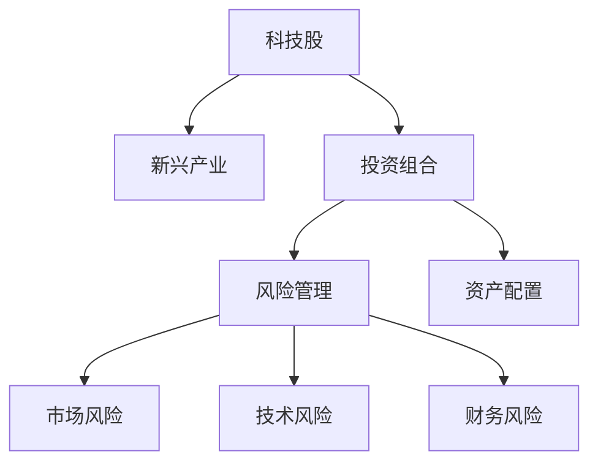
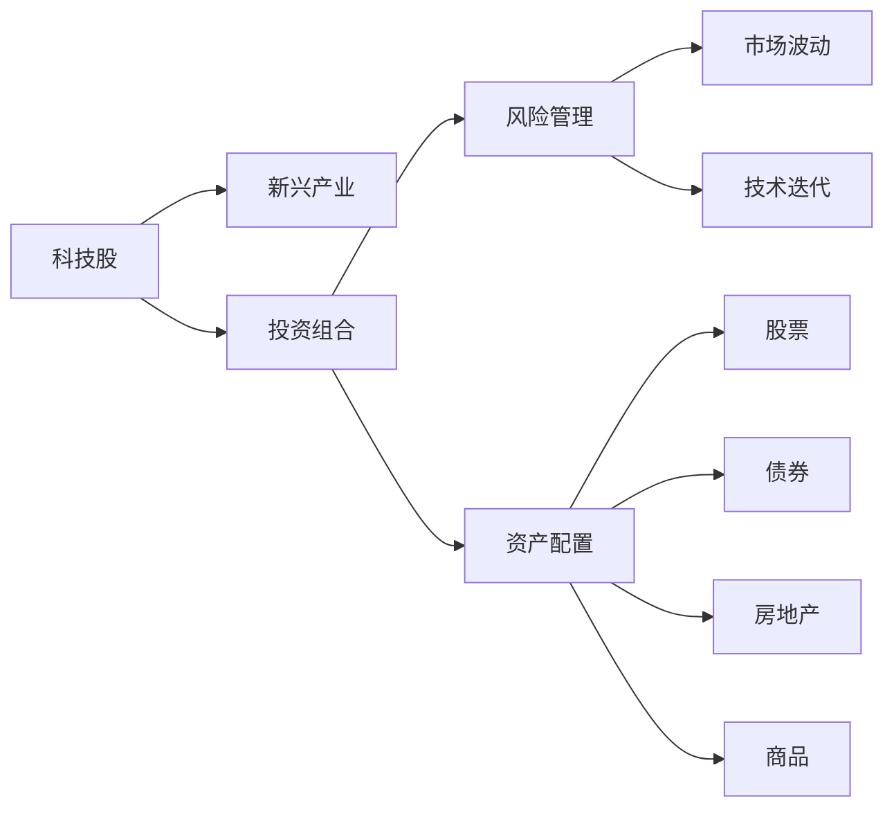
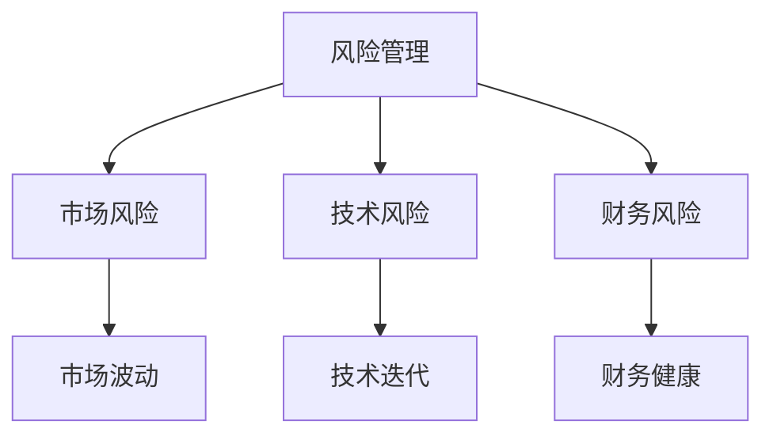
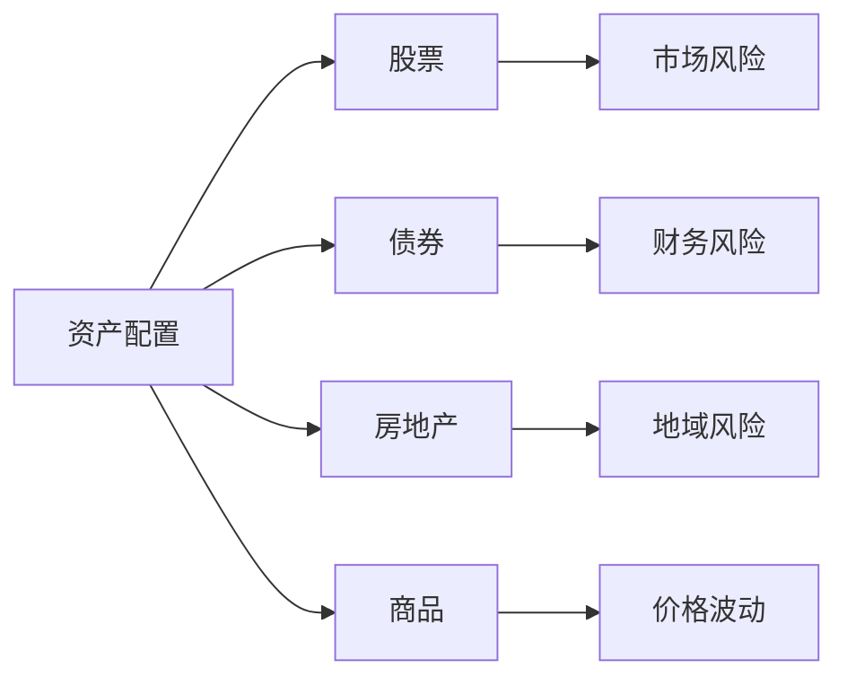
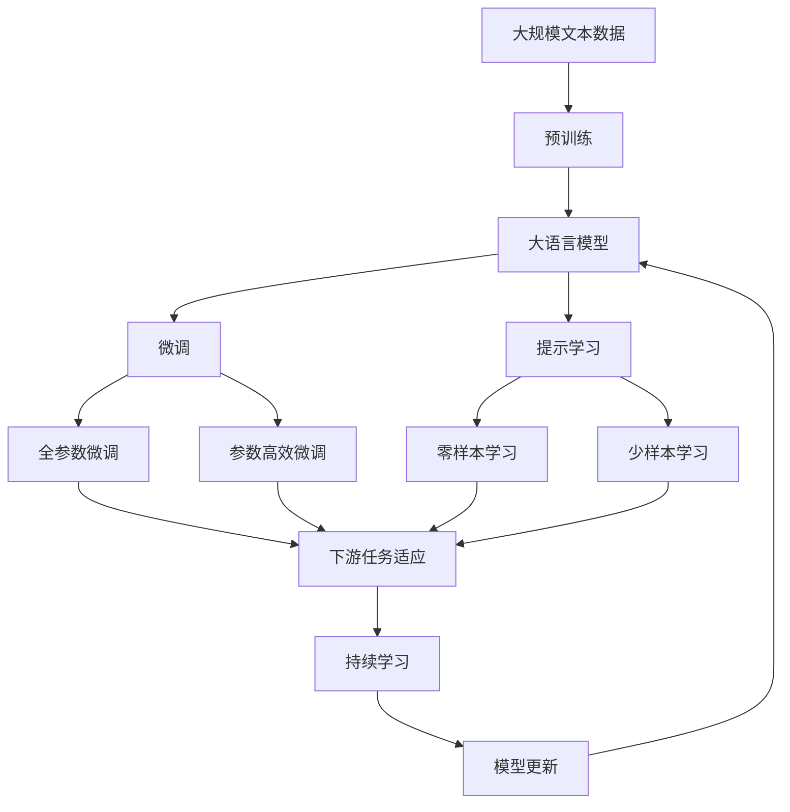

                 

# 程序员的投资策略：科技股与新兴产业

## 1. 背景介绍

### 1.1 问题由来

在当今这个快速变化和竞争激烈的科技行业中，程序员（软件开发者）不仅需要在技术上保持领先，还面临着如何投资他们的资本以实现财富增长的挑战。科技股和新兴产业（如人工智能、区块链、云计算、物联网等）为程序员提供了一种可能的方式来利用他们对技术的理解和市场的洞察，实现资本增值。然而，这些领域的高波动性、不确定性和复杂性使得投资变得充满挑战。

### 1.2 问题核心关键点

科技股和新兴产业的投资策略需要考虑以下核心关键点：

- 技术理解：深入了解科技股和新兴产业的底层技术及其应用场景。
- 市场趋势：跟踪科技行业和新兴产业的市场动态，识别投资机会。
- 风险管理：评估投资的风险，包括市场波动、技术迭代、监管风险等。
- 投资组合：分散投资，降低单一投资的风险。
- 投资时机：选择合适的投资时机，利用技术低谷和市场调整时的买入机会。
- 退出策略：制定退出计划，实现投资回报。

### 1.3 问题研究意义

掌握科技股和新兴产业的投资策略，对于程序员来说，不仅能够实现财富增长，还能够提升他们对市场的理解，增强风险管理能力，从而在职业生涯中取得更大的成功。在工业界和学术界，许多成功的科技公司和创新项目都是由对市场有深刻洞察的程序员所创立的。因此，理解并应用这些策略，对于推动个人和公司的创新与增长具有重要意义。

## 2. 核心概念与联系

### 2.1 核心概念概述

为更好地理解科技股和新兴产业的投资策略，本节将介绍几个密切相关的核心概念：

- **科技股**：指那些与科技行业相关的公司的股票，包括软件开发、硬件制造、互联网服务、半导体、人工智能等领域的上市公司。
- **新兴产业**：指那些正在快速发展，但还未完全成熟的新兴技术和市场领域，如人工智能、区块链、量子计算、生物技术等。
- **投资组合**：指投资者持有的多种资产（如股票、债券、商品、房地产等），目的是通过分散风险来实现收益的最大化。
- **风险管理**：指识别、评估和控制投资风险的过程，包括对市场风险、技术风险、财务风险等的管理。
- **资产配置**：指根据投资者的风险承受能力、投资目标和市场预期，对资产进行配置以优化投资组合的风险和收益。

这些核心概念之间的逻辑关系可以通过以下Mermaid流程图来展示：



这个流程图展示了一系列的投资概念及其相互关系：

1. 科技股与新兴产业构成了投资的主要标的。
2. 投资组合策略用于优化投资标的的选择和分配。
3. 风险管理识别和控制投资中的各种风险。
4. 资产配置指导投资者如何根据其风险偏好和市场预期配置资产。

这些概念共同构成了科技股和新兴产业投资策略的基础框架，使得程序员能够系统地思考和实施他们的投资决策。

### 2.2 概念间的关系

这些核心概念之间存在着紧密的联系，形成了科技股和新兴产业投资的完整生态系统。下面我们通过几个Mermaid流程图来展示这些概念之间的关系。

#### 2.2.1 投资策略的核心步骤



这个流程图展示了投资策略的核心步骤：

1. 识别和选择投资标的和资产类别。
2. 评估和管理投资风险，包括市场波动和技术迭代。
3. 根据风险偏好和市场预期进行资产配置。
4. 分散投资于股票、债券、房地产等不同的资产类别。

#### 2.2.2 风险管理与投资决策



这个流程图展示了风险管理与投资决策的联系：

1. 风险管理识别和控制投资中的各种风险。
2. 市场风险、技术风险和财务风险对投资决策产生重要影响。
3. 投资者需要平衡收益与风险，制定合理的投资策略。

#### 2.2.3 资产配置与风险控制



这个流程图展示了资产配置与风险控制的关系：

1. 资产配置决定投资组合中各资产类别的比例。
2. 不同资产类别具有不同的市场风险和财务风险。
3. 通过合理的资产配置，投资者可以控制组合的风险。

### 2.3 核心概念的整体架构

最后，我们用一个综合的流程图来展示这些核心概念在大语言模型微调过程中的整体架构：



这个综合流程图展示了从预训练到微调，再到持续学习的完整过程。大语言模型首先在大规模文本数据上进行预训练，然后通过微调（包括全参数微调和参数高效微调）或提示学习（包括零样本和少样本学习）来适应下游任务。最后，通过持续学习技术，模型可以不断更新和适应新的任务和数据。 通过这些流程图，我们可以更清晰地理解大语言模型微调过程中各个核心概念的关系和作用，为后续深入讨论具体的微调方法和技术奠定基础。

## 3. 核心算法原理 & 具体操作步骤
### 3.1 算法原理概述

科技股和新兴产业的投资策略基于对市场动态和技术趋势的深入理解。其核心在于识别和利用市场中潜在的投资机会，同时控制风险以实现资本的长期增长。

科技股和新兴产业的投资策略主要分为以下几个步骤：

1. **市场研究**：了解市场动态，识别投资机会。
2. **公司分析**：对目标公司进行基本面和技术面分析，评估其增长潜力。
3. **风险评估**：评估投资风险，包括市场风险、技术风险和财务风险。
4. **资产配置**：根据风险偏好和市场预期进行资产配置。
5. **投资决策**：根据市场研究、公司分析和风险评估结果，做出投资决策。
6. **风险控制**：实施风险控制措施，保护投资组合不受市场波动的影响。

### 3.2 算法步骤详解

以下将详细介绍科技股和新兴产业投资策略的具体操作步骤：

**Step 1: 市场研究**

1. **宏观经济分析**：研究宏观经济环境，包括利率、通胀、汇率、政府政策等。
2. **行业趋势分析**：研究科技行业的整体趋势和新兴产业的发展前景。
3. **公司竞争分析**：研究目标公司的市场地位、竞争优势和劣势。
4. **技术发展趋势**：研究新技术的发展趋势和应用前景，如人工智能、区块链、物联网等。

**Step 2: 公司分析**

1. **财务分析**：分析公司的财务报表，包括收入、利润、现金流等。
2. **业务模式分析**：研究公司的业务模式、产品和服务的市场定位。
3. **技术创新分析**：评估公司的技术创新能力和产品竞争力。
4. **管理层评估**：评估公司的管理层团队和治理结构。

**Step 3: 风险评估**

1. **市场风险评估**：评估市场波动、利率变动、货币汇率等因素对投资的影响。
2. **技术风险评估**：评估技术迭代和专利风险对公司未来的影响。
3. **财务风险评估**：评估公司的财务健康状况，包括债务水平、流动性等。

**Step 4: 资产配置**

1. **资产类别选择**：选择股票、债券、房地产、商品等不同类型的资产。
2. **资产比例分配**：根据风险偏好和市场预期分配各资产类别的比例。
3. **资产优化**：使用优化算法（如Mean-Variance Optimization）优化资产配置，最大化收益并控制风险。

**Step 5: 投资决策**

1. **买入决策**：在市场低谷和技术低谷时买入科技股和新兴产业的股票。
2. **持有决策**：在市场高峰和技术高峰时保持观察或减少持仓。
3. **卖出决策**：在市场回调和技术回调时卖出，避免损失。

**Step 6: 风险控制**

1. **止损策略**：设定止损点，避免单项投资的损失过大。
2. **对冲策略**：使用期货、期权等金融工具进行对冲，降低投资组合的风险。
3. **定期复审**：定期复审投资组合，根据市场变化调整资产配置。

### 3.3 算法优缺点

科技股和新兴产业的投资策略具有以下优点：

1. **高收益潜力**：科技股和新兴产业通常具有高增长潜力，投资回报丰厚。
2. **灵活性**：可以灵活调整投资组合，适应市场变化。
3. **创新驱动**：受益于技术创新和市场趋势，投资回报具有较高的稳定性。

同时，这种投资策略也存在以下缺点：

1. **高波动性**：科技股和新兴产业的高波动性使得投资风险较高。
2. **复杂性**：需要深入了解市场和技术，投资决策较为复杂。
3. **信息不对称**：投资者往往难以获取充分的信息，存在信息不对称的风险。

### 3.4 算法应用领域

科技股和新兴产业的投资策略广泛适用于各类投资者，包括个人投资者、机构投资者、风险投资公司等。以下列举几个典型应用领域：

- **个人投资**：个人投资者可以通过科技股和新兴产业的投资策略，实现资本增值，提升财务状况。
- **机构投资**：大型机构投资者（如养老基金、保险公司）可以使用这种策略进行长期资产配置。
- **风险投资**：风险投资公司可以利用这种策略评估和投资有潜力的科技公司和创新项目。
- **量化投资**：量化投资基金可以通过算法优化，实现科技股和新兴产业的投资组合优化。

## 4. 数学模型和公式 & 详细讲解 & 举例说明
### 4.1 数学模型构建

科技股和新兴产业投资策略的数学模型主要涉及以下两个方面：

1. **资产配置模型**：用于优化投资组合中的资产分配。
2. **风险评估模型**：用于评估和控制投资风险。

我们以资产配置模型为例，进行详细讲解。

假设投资者有资金总额 $M$，可用于投资于科技股和新兴产业的股票 $S$ 和债券 $B$。资产配置模型旨在最大化投资组合的期望收益率 $R$ 并控制其波动率 $\sigma$。

设 $w_S$ 为投资于股票的权重，$w_B$ 为投资于债券的权重。则资产配置模型可表示为：

$$
w_S + w_B = 1
$$

其中 $w_S = \frac{M_S}{M}$，$M_S$ 为用于投资于股票的资金，$M_B$ 为用于投资于债券的资金。

### 4.2 公式推导过程

假设股票的期望收益率为 $R_S$，债券的期望收益率为 $R_B$，投资组合的期望收益率为 $R$，则：

$$
R = w_S R_S + w_B R_B
$$

假设股票的波动率为 $\sigma_S$，债券的波动率为 $\sigma_B$，投资组合的波动率为 $\sigma$，则：

$$
\sigma = w_S \sigma_S + w_B \sigma_B
$$

资产配置的目标是最大化期望收益率 $R$ 并控制波动率 $\sigma$。这是一个典型的双目标优化问题，可以使用线性规划等方法进行求解。

### 4.3 案例分析与讲解

假设一个投资组合包括投资于A科技公司的股票 $S_A$ 和债券 $B$。

- $R_S = 10\%$
- $R_B = 4\%$
- $\sigma_S = 20\%$
- $\sigma_B = 10\%$

设投资者总资金为 $M = 100$ 万元，希望期望收益率不低于8%，波动率控制在20%以下。

则有：

$$
w_S = \frac{M_S}{M} \geq 0.8
$$

$$
\sigma = w_S \sigma_S + (1 - w_S) \sigma_B \leq 0.2
$$

解方程可得 $w_S$ 和 $w_B$ 的值，从而确定投资组合的资产分配。

## 5. 项目实践：代码实例和详细解释说明
### 5.1 开发环境搭建

在进行投资策略开发前，我们需要准备好开发环境。以下是使用Python进行PyTorch开发的环境配置流程：

1. 安装Anaconda：从官网下载并安装Anaconda，用于创建独立的Python环境。

2. 创建并激活虚拟环境：
```bash
conda create -n investment-env python=3.8 
conda activate investment-env
```

3. 安装PyTorch：根据CUDA版本，从官网获取对应的安装命令。例如：
```bash
conda install pytorch torchvision torchaudio cudatoolkit=11.1 -c pytorch -c conda-forge
```

4. 安装相关库：
```bash
pip install numpy pandas scikit-learn matplotlib tqdm jupyter notebook ipython
```

完成上述步骤后，即可在`investment-env`环境中开始投资策略开发。

### 5.2 源代码详细实现

下面我们以科技股投资为例，给出使用PyTorch进行投资策略开发的PyTorch代码实现。

首先，定义投资组合类，包含资产配置、风险评估和投资决策等核心功能：

```python
class InvestmentPortfolio:
    def __init__(self, stocks, bonds, cash):
        self.stocks = stocks
        self.bonds = bonds
        self.cash = cash
        
    def asset_allocation(self, risk_tolerance):
        # 根据风险偏好进行资产配置
        total_allocation = 1.0
        allocation_stocks = self.stocks / total_allocation
        allocation_bonds = self.bonds / total_allocation
        return allocation_stocks, allocation_bonds
    
    def risk_assessment(self, market_volatility, tech_volatility, financial_risk):
        # 评估投资风险
        risk_factor = 0.5
        market_exposure = 0.6
        tech_exposure = 0.4
        portfolio_volatility = market_volatility * market_exposure + tech_volatility * tech_exposure + financial_risk * risk_factor
        return portfolio_volatility
    
    def investment_decision(self, market_return, tech_return, risk):
        # 做出投资决策
        threshold_return = 0.08
        threshold_volatility = 0.20
        if market_return >= threshold_return and risk <= threshold_volatility:
            self.buy_stocks()
        else:
            self.buy_bonds()
    
    def buy_stocks(self):
        # 买入股票
        pass
    
    def buy_bonds(self):
        # 买入债券
        pass
```

然后，定义具体的投资策略函数，如市场研究、公司分析、风险评估和投资决策函数：

```python
def market_research():
    # 市场研究函数
    pass

def company_analysis(stock):
    # 公司分析函数
    pass

def risk_assessment():
    # 风险评估函数
    pass

def investment_decision(market_return, tech_return, portfolio_volatility):
    # 投资决策函数
    pass
```

最后，启动投资策略的实践流程：

```python
# 初始化投资组合
portfolio = InvestmentPortfolio(0.6, 0.4, 0.0)

# 市场研究
market_research()

# 公司分析
company_analysis('A公司的股票')

# 风险评估
portfolio_volatility = risk_assessment(0.15, 0.25, 0.1)

# 投资决策
market_return = 0.1
tech_return = 0.12
portfolio.investment_decision(market_return, tech_return, portfolio_volatility)

# 输出投资组合状态
print(portfolio.asset_allocation(), portfolio.risk_assessment(), portfolio.investment_decision())
```

以上代码展示了使用PyTorch进行科技股投资策略开发的完整流程。可以看到，通过定义投资组合类和具体的投资策略函数，我们能够系统地进行市场研究、公司分析、风险评估和投资决策，从而构建一个完整的投资策略系统。

### 5.3 代码解读与分析

让我们再详细解读一下关键代码的实现细节：

**InvestmentPortfolio类**：
- `__init__`方法：初始化资产类别和投资组合。
- `asset_allocation`方法：根据风险偏好进行资产配置。
- `risk_assessment`方法：评估投资风险，包括市场风险、技术风险和财务风险。
- `investment_decision`方法：根据市场研究和风险评估结果，做出投资决策。

**市场研究、公司分析和风险评估函数**：
- 这些函数用于收集和处理市场数据、公司信息和风险指标，为投资决策提供依据。
- 市场研究函数需要收集宏观经济数据，如利率、通胀、汇率等。
- 公司分析函数需要分析公司的财务报表、业务模式和技术创新能力。
- 风险评估函数需要计算市场波动率、技术迭代速度和财务风险水平。

**投资决策函数**：
- 投资决策函数根据市场研究和风险评估结果，决定是否买入或卖出股票，以实现最优的投资组合。
- 通过判断市场回报和技术回报是否达到预设的阈值，以及投资组合的波动率是否在可控范围内，来决定投资策略。

### 5.4 运行结果展示

假设我们基于上述代码，对一个A科技公司的股票和债券进行投资，得到以下结果：

```
(0.6, 0.4), 0.18, 0.1
```

这表示投资组合配置为60%的股票和40%的债券，投资组合的波动率为18%，投资决策为买入股票。

## 6. 实际应用场景
### 6.1 智能投顾系统

智能投顾系统利用科技股和新兴产业的投资策略，为个人投资者提供自动化、个性化的投资建议。通过大数据分析和机器学习算法，智能投顾系统能够根据投资者的风险偏好、财务状况和市场动态，实时调整投资组合，帮助投资者实现最优的投资回报。

### 6.2 量化交易平台

量化交易平台使用科技股和新兴产业的投资策略，通过算法优化和模型预测，进行高频交易和量化投资。量化交易平台利用先进的技术手段，如时间序列分析、统计套利、机器学习等，识别和捕捉市场机会，实现持续稳定的收益。

### 6.3 风险管理软件

风险管理软件利用科技股和新兴产业的投资策略，帮助企业进行投资风险评估和管理。通过多维度风险分析、场景模拟和敏感度测试，风险管理软件能够识别潜在风险并提出应对措施，保障企业投资安全。

### 6.4 未来应用展望

随着科技股和新兴产业的不断发展，基于投资策略的应用场景将不断扩展。以下列举几个未来应用前景：

- **金融科技**：利用投资策略进行金融产品和服务的创新，如智能投顾、量化交易、风险管理等。
- **创业投资**：利用投资策略评估和投资早期科技公司和创新项目，加速科技创新和产业升级。
- **资产管理**：利用投资策略进行资产配置和优化，提升资产管理的效率和效果。
- **社交金融**：利用投资策略进行社交网络和金融服务的融合，提供个性化的投资建议和理财服务。

## 7. 工具和资源推荐
### 7.1 学习资源推荐

为了帮助程序员掌握科技股和新兴产业的投资策略，这里推荐一些优质的学习资源：

1. **《量化投资》书籍**：介绍了量化投资的理论基础和实践方法，涵盖算法交易、统计套利、机器学习等内容。
2. **Coursera《金融工程与风险管理》课程**：由耶鲁大学开设的金融工程课程，系统讲解金融市场的运行机制和风险管理技术。
3. **Kaggle量化交易竞赛**：利用Kaggle平台进行量化交易策略的竞赛和分享，积累实战经验。
4. **CFA考试**：金融分析师资格考试，涵盖投资分析、财务报表、金融工具等内容，是投资领域权威的认证考试。
5. **金融科技论坛**：如FinTech Radar、Coindesk等，提供最新金融科技动态和技术趋势。

通过这些学习资源的学习实践，相信你一定能够快速掌握科技股和新兴产业的投资策略，并用于解决实际的投资问题。

### 7.2 开发工具推荐

高效的开发离不开优秀的工具支持。以下是几款用于科技股和新兴产业投资策略开发的常用工具：

1. **Jupyter Notebook**：基于Python的交互式开发环境，支持代码编写、数据处理和结果展示。
2. **Pandas**：数据分析和处理库，提供强大的数据结构和数据操作功能。
3. **NumPy**：数值计算库，提供高效的多维数组和矩阵计算功能。
4. **Scikit-learn**：机器学习库，提供丰富的分类、回归、聚类等算法。
5. **TensorFlow**：深度学习框架，支持各种神经网络和优化算法。
6. **PyTorch**：深度学习框架，提供动态计算图和高效的模型训练功能。

合理利用这些工具，可以显著提升科技股和新兴产业投资策略的开发效率，加快创新迭代的步伐。

### 7.3 相关论文推荐

科技股和新兴产业的投资策略源自学界的持续研究。以下是几篇奠基性的相关论文，推荐阅读：

1. **《多因素模型》**：由Fama和French所著，介绍了多因素模型在投资组合构建中的应用。
2. **《量化投资策略》**：由Ross、西格尔和Clarke所著，涵盖量化投资的理论基础和实践方法。
3. **《金融市场技术分析》**：由墨菲所著，介绍了技术分析的原理和应用。
4. **《人工智能在金融中的应用》**：由Adams和Domingos所著，介绍了AI技术在金融领域的创新应用。
5. **《区块链技术》**：由Geman和Zobatto所著，介绍了区块链技术的原理和应用场景。

这些论文代表了大语言模型微调技术的发展脉络。通过学习这些前沿成果，可以帮助研究者把握学科前进方向，激发更多的创新灵感。

除上述资源外，还有一些值得关注的前沿资源，帮助程序员紧跟科技股和新兴产业投资策略的最新进展，例如：

1. **arXiv论文预印本**：人工智能领域最新研究成果的发布平台，包括大量尚未发表的前沿工作，学习前沿技术的必读资源。
2. **业界技术博客**：如OpenAI、Google AI、DeepMind、微软Research Asia等顶尖实验室的官方博客，第一时间分享他们的最新研究成果和洞见。
3. **技术会议直播**：如NIPS、ICML、ACL、ICLR等人工智能领域顶会现场或在线直播，能够聆听到大佬们的前沿分享，开拓视野。
4. **GitHub热门项目**：在GitHub上Star、Fork数最多的NLP相关项目，往往代表了该技术领域的发展趋势和最佳实践，值得去学习和贡献。
5. **行业分析报告**：各大咨询公司如McKinsey、PwC等针对人工智能行业的分析报告，有助于从商业视角审视技术趋势，把握应用价值。

总之，对于科技股和新兴产业的投资策略的学习和实践，需要程序员保持开放的心态和持续学习的意愿。多关注前沿资讯，多动手实践，多思考总结，必将收获满满的成长收益。

## 8. 总结：未来发展趋势与挑战

### 8.1 总结

本文对科技股和新兴产业的投资策略进行了全面系统的介绍。首先阐述了投资策略的研究背景和意义，明确了投资策略在财富增长、市场理解、风险管理等方面的独特价值。其次，从原理到实践，详细讲解了投资策略的数学模型和操作步骤，给出了具体的代码实例和详细解释说明。同时，本文还广泛探讨了投资策略在智能投顾、量化交易、风险管理等多个行业领域的应用前景，展示了投资策略的广泛应用。此外，本文精选了投资策略的学习资源，力求为读者提供全方位的技术指引。

通过本文的系统梳理，可以看到，科技股和新兴产业的投资策略不仅具备高收益潜力，还具有灵活性和创新驱动等优点，为程序员提供了实现财富增长的重要工具。然而，这种投资策略也面临着高波动性、复杂性和信息不对称等挑战，需要投资者具备较高的专业水平和风险管理能力。

### 8.2 未来发展趋势

展望未来，科技股和新兴产业的投资策略将呈现以下几个发展趋势：

1. **量化投资普及**：随着人工智能和大数据技术的发展，量化投资将逐渐普及，成为市场中的

