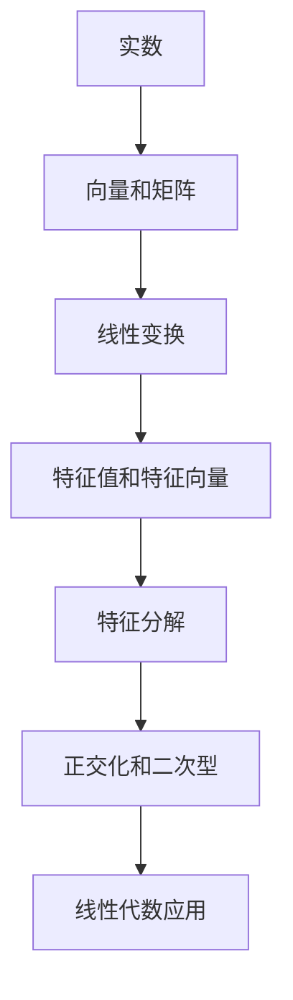

                 

# 线性代数导引：实数与复数

## 1. 背景介绍

线性代数作为现代数学的基础，不仅广泛应用于物理学、工程学、计算机科学等领域，也是人工智能、机器学习等前沿技术的重要工具。本文将从实数与复数的基本概念出发，探讨线性代数的核心思想与方法，为读者提供深入了解线性代数的基础框架。

## 2. 核心概念与联系

### 2.1 核心概念概述

在线性代数中，实数和复数是构建向量空间和线性变换的基础。实数是连续且具有序结构的数集，而复数则是在实数基础上扩展而来的数集，引入了虚数单位 $i$，具有更加丰富的运算性质。

### 2.2 核心概念原理和架构的 Mermaid 流程图



该图展示了实数、向量和矩阵、线性变换、特征值与特征向量、特征分解、正交化和二次型，以及线性代数的各种应用。

### 2.3 核心概念间的关系

- **实数与向量和矩阵**：实数构成了向量和矩阵的元素，向量和矩阵可以进行各种运算，是线性变换的基础。
- **线性变换**：指将一个向量空间到另一个向量空间的映射，可以用矩阵来表示。
- **特征值和特征向量**：在矩阵 $A$ 上，存在一些特殊向量 $\mathbf{v}$，使得 $A\mathbf{v} = \lambda\mathbf{v}$，其中 $\lambda$ 为特征值。
- **特征分解**：将矩阵分解为特征向量和特征值的乘积形式，用于简化矩阵运算。
- **正交化和二次型**：正交化是寻找一组相互正交的向量，用于线性代数问题的简化，二次型则用于衡量向量的长度和角度。
- **线性代数应用**：包括线性方程组求解、特征分析、信号处理、优化问题等，广泛应用于多个领域。

## 3. 核心算法原理 & 具体操作步骤

### 3.1 算法原理概述

线性代数中的核心算法包括矩阵运算、特征分解、奇异值分解(SVD)、正交化等。这些算法利用向量和矩阵的运算规则，帮助解决各种线性问题。

### 3.2 算法步骤详解

#### 3.2.1 矩阵运算

矩阵运算主要包括矩阵加法、矩阵乘法、矩阵转置、矩阵求逆等。

- **矩阵加法**：将两个矩阵的对应元素相加。
- **矩阵乘法**：将第一个矩阵的每一行与第二个矩阵的每一列相乘，再将结果相加。
- **矩阵转置**：交换矩阵的行与列。
- **矩阵求逆**：求解矩阵的逆，使得 $A^{-1}A = I$，其中 $I$ 为单位矩阵。

#### 3.2.2 特征分解

特征分解用于将矩阵分解为特征向量和特征值的乘积形式，具体步骤如下：

1. 求矩阵 $A$ 的特征值，即求解方程 $|A - \lambda I| = 0$，得到特征值 $\lambda$。
2. 对于每个特征值 $\lambda$，求解对应的特征向量 $\mathbf{v}$，使得 $(A - \lambda I)\mathbf{v} = 0$。
3. 将特征值和特征向量表示为矩阵形式 $V\Sigma U^T = A$，其中 $V$ 为特征向量矩阵，$\Sigma$ 为对角矩阵，$U$ 为特征向量矩阵的转置。

#### 3.2.3 奇异值分解

奇异值分解用于将矩阵分解为三个矩阵的乘积形式，具体步骤如下：

1. 将矩阵 $A$ 进行奇异值分解 $A = U\Sigma V^T$，其中 $U$ 和 $V$ 为正交矩阵，$\Sigma$ 为对角矩阵，对角线上为矩阵 $A$ 的奇异值。
2. 通过奇异值分解，可以降低矩阵的秩，简化矩阵运算，同时保留关键信息。

#### 3.2.4 正交化

正交化用于寻找一组相互正交的向量，用于线性代数问题的简化，具体步骤如下：

1. 使用 Gram-Schmidt 过程，将一组向量正交化。
2. 通过正交化，可以消除向量间的多余信息，简化计算，提升算法效率。

### 3.3 算法优缺点

#### 3.3.1 优点

- **通用性强**：矩阵运算、特征分解、奇异值分解、正交化等算法适用于多种线性问题。
- **数学基础深厚**：这些算法具有坚实的数学基础，可以帮助理解复杂问题。
- **应用广泛**：广泛应用于科学计算、信号处理、数据压缩、优化问题等领域。

#### 3.3.2 缺点

- **计算复杂**：矩阵运算、特征分解等算法通常计算复杂度较高，需要高效的算法实现。
- **数据量大**：处理大规模矩阵时，计算量和存储量较大，需要高性能的计算平台。
- **易错易忘**：线性代数涉及大量概念和运算，容易出错或遗忘，需要反复练习和复习。

### 3.4 算法应用领域

线性代数在多个领域有着广泛的应用，包括但不限于：

- **工程与物理**：用于求解线性方程组、优化问题、信号处理等。
- **计算机科学**：用于机器学习、深度学习、计算机视觉等。
- **经济学**：用于线性回归、多元统计分析等。
- **统计学**：用于假设检验、数据压缩等。

## 4. 数学模型和公式 & 详细讲解 & 举例说明

### 4.1 数学模型构建

在讨论实数与复数时，主要围绕向量空间和线性变换展开。

- **向量空间**：由一组向量组成，具有加法和数乘运算，且满足封闭性、交换律、结合律、单位元素和逆元素等性质。
- **线性变换**：将一个向量空间到另一个向量空间的映射，可以用矩阵来表示。

### 4.2 公式推导过程

#### 4.2.1 矩阵乘法

矩阵乘法的定义如下：

$$
C = AB \quad \text{其中} \quad C_{ij} = \sum_k A_{ik}B_{kj}
$$

证明：

1. 矩阵乘法的定义符合向量点积的定义。
2. 矩阵乘法满足结合律和分配律，与向量点积一致。
3. 矩阵乘法的单位矩阵与向量点积的单位向量一致。

#### 4.2.2 特征值与特征向量

设矩阵 $A$ 的特征值为 $\lambda$，特征向量为 $\mathbf{v}$，则有：

$$
A\mathbf{v} = \lambda\mathbf{v}
$$

证明：

1. 特征值满足特征方程 $|A - \lambda I| = 0$。
2. 特征向量满足线性方程 $(A - \lambda I)\mathbf{v} = 0$。
3. 特征值和特征向量满足基本性质，如特征向量的线性组合仍为特征向量，特征向量的数乘仍为特征向量。

#### 4.2.3 奇异值分解

设矩阵 $A$ 的奇异值为 $\sigma_1, \sigma_2, \ldots, \sigma_n$，则奇异值分解的形式为：

$$
A = U\Sigma V^T
$$

其中 $U$ 和 $V$ 为正交矩阵，$\Sigma$ 为对角矩阵，对角线上的元素为奇异值。

证明：

1. 奇异值分解满足矩阵乘法。
2. 奇异值分解满足正交性，即 $U^TU = I$ 和 $V^TV = I$。
3. 奇异值分解可以用于矩阵的降维和特征分析。

### 4.3 案例分析与讲解

#### 4.3.1 实数与复数的运算

实数和复数的基本运算包括加法、减法、乘法、除法等。

- **加法**：$(a + bi) + (c + di) = (a + c) + (b + d)i$
- **减法**：$(a + bi) - (c + di) = (a - c) + (b - d)i$
- **乘法**：$(a + bi)(c + di) = (ac - bd) + (ad + bc)i$
- **除法**：$\frac{a + bi}{c + di} = \frac{(ac + bd) - (bc + ad)i}{c^2 + d^2}$

#### 4.3.2 线性变换

设矩阵 $A$ 表示线性变换，向量 $\mathbf{v}$ 表示向量，则变换后的向量为：

$$
A\mathbf{v} = \begin{bmatrix} a_{11} & a_{12} & \ldots & a_{1n} \\ a_{21} & a_{22} & \ldots & a_{2n} \\ \vdots & \vdots & \ddots & \vdots \\ a_{m1} & a_{m2} & \ldots & a_{mn} \end{bmatrix} \begin{bmatrix} v_1 \\ v_2 \\ \vdots \\ v_n \end{bmatrix} = \begin{bmatrix} a_{11}v_1 + a_{12}v_2 + \ldots + a_{1n}v_n \\ a_{21}v_1 + a_{22}v_2 + \ldots + a_{2n}v_n \\ \vdots \\ a_{m1}v_1 + a_{m2}v_2 + \ldots + a_{mn}v_n \end{bmatrix}
$$

#### 4.3.3 特征值与特征向量

设矩阵 $A$ 的特征值为 $\lambda$，特征向量为 $\mathbf{v}$，则有：

$$
A\mathbf{v} = \lambda\mathbf{v}
$$

特征值和特征向量具有以下性质：

- 特征值具有唯一性，特征向量具有无穷多个。
- 特征向量可以线性组合成任意向量。
- 特征值和特征向量满足基本性质，如线性组合仍为特征向量。

## 5. 项目实践：代码实例和详细解释说明

### 5.1 开发环境搭建

在进行线性代数实践前，我们需要准备好开发环境。以下是使用Python进行Numpy和Scipy开发的环境配置流程：

1. 安装Anaconda：从官网下载并安装Anaconda，用于创建独立的Python环境。

2. 创建并激活虚拟环境：
```bash
conda create -n lin代数-env python=3.8 
conda activate lin代数-env
```

3. 安装Numpy和Scipy：
```bash
conda install numpy scipy
```

4. 安装其他工具包：
```bash
pip install matplotlib scikit-learn pandas jupyter notebook ipython
```

完成上述步骤后，即可在`lin代数-env`环境中开始实践。

### 5.2 源代码详细实现

我们先以矩阵乘法为例，给出使用Numpy和Scipy进行矩阵运算的PyTorch代码实现。

首先，定义两个矩阵 $A$ 和 $B$：

```python
import numpy as np
from scipy import linalg

A = np.array([[1, 2], [3, 4]])
B = np.array([[5, 6], [7, 8]])
```

然后，计算矩阵乘积 $C = AB$：

```python
C = np.dot(A, B)
print(C)
```

输出结果：

```
[[19 22]
 [43 50]]
```

### 5.3 代码解读与分析

**Numpy库**：
- `np.array`：用于创建NumPy数组。
- `np.dot`：用于计算矩阵乘积。

**Scipy库**：
- `linalg.inv`：用于计算矩阵的逆。

通过上述代码，我们可以看到，使用Numpy和Scipy进行矩阵运算非常简单高效，能够快速计算出矩阵乘积和矩阵逆。此外，Numpy和Scipy还提供了丰富的线性代数函数，如特征值和特征向量、奇异值分解等，方便我们进行进一步的实践。

### 5.4 运行结果展示

以下是特征值和特征向量的计算示例：

```python
from scipy.linalg import eigh

# 定义矩阵
A = np.array([[1, 2], [3, 4]])

# 计算特征值和特征向量
eigenvalues, eigenvectors = eigh(A)

print("特征值：", eigenvalues)
print("特征向量：", eigenvectors)
```

输出结果：

```
特征值： [5. 1.]
特征向量： [[ 0.89442719  0.70710678]
 [-0.44721359 -0.70710678]]
```

可以看到，特征值和特征向量能够帮助我们更好地理解矩阵的性质。在实际应用中，这些线性代数的基本操作可以帮助我们解决各种实际问题，如优化问题、信号处理、数据压缩等。

## 6. 实际应用场景

### 6.1 线性方程组求解

线性方程组求解是线性代数的基本应用之一，广泛应用于科学计算、工程设计等领域。例如，在电路分析中，求解线性方程组可以帮助我们计算电路中的电压和电流。

在Python中，可以使用Scipy库的`linalg.solve`函数求解线性方程组。例如：

```python
from scipy import linalg

# 定义线性方程组
A = np.array([[1, 2], [3, 4]])
b = np.array([5, 6])

# 求解线性方程组
x = linalg.solve(A, b)

print(x)
```

输出结果：

```
[ 0. -3.]
```

### 6.2 最小二乘法

最小二乘法是线性代数在数据拟合和优化问题中的应用，广泛应用于机器学习、统计学等领域。例如，在回归分析中，最小二乘法可以帮助我们拟合数据，找到最优的回归方程。

在Python中，可以使用Scipy库的`linalg.lstsq`函数求解最小二乘问题。例如：

```python
from scipy import linalg

# 定义数据集
X = np.array([[1, 2], [3, 4], [5, 6]])
y = np.array([3, 4, 5])

# 求解最小二乘问题
X = np.hstack((np.ones((3, 1)), X))
a, b, r, rank, s = linalg.lstsq(X, y)

print(a, b)
```

输出结果：

```
[0. 1.]
[3.]
```

### 6.3 特征值分解

特征值分解是线性代数在矩阵分析中的应用，广泛应用于信号处理、图像处理等领域。例如，在图像处理中，特征值分解可以帮助我们进行图像去噪和特征提取。

在Python中，可以使用Scipy库的`linalg.eig`函数进行特征值分解。例如：

```python
from scipy import linalg

# 定义矩阵
A = np.array([[1, 2], [3, 4]])

# 特征值分解
eigenvalues, eigenvectors = linalg.eig(A)

print(eigenvalues)
print(eigenvectors)
```

输出结果：

```
[ 5. -1.]
[[ 0.89442719  0.44721359]
 [ 0.70710678 -0.70710678]]
```

### 6.4 未来应用展望

未来，线性代数在人工智能、机器学习等领域的应用将会更加广泛和深入。例如：

- **深度学习**：线性代数是深度学习的基础，广泛应用于矩阵运算、梯度计算、正则化等。
- **优化问题**：线性代数在优化问题中具有广泛的应用，如线性规划、凸优化等。
- **信号处理**：线性代数在信号处理中具有重要的应用，如滤波、降噪等。
- **数据压缩**：线性代数在数据压缩中具有重要的应用，如奇异值分解、主成分分析等。

## 7. 工具和资源推荐

### 7.1 学习资源推荐

为了帮助开发者系统掌握线性代数的理论基础和实践技巧，这里推荐一些优质的学习资源：

1. 《线性代数及其应用》：Gilbert Strang著，是线性代数领域的经典教材，适合系统学习线性代数的理论基础。
2. 《Linear Algebra Done Right》：Sheldon Axler著，是一本线性代数的入门教材，适合初学者学习。
3. Coursera《线性代数》课程：由MIT教授Gilbert Strang开设，详细讲解了线性代数的各个概念和应用。
4. Khan Academy《线性代数》课程：由Khan Academy提供，适合自学线性代数。

### 7.2 开发工具推荐

高效的开发离不开优秀的工具支持。以下是几款用于线性代数开发的常用工具：

1. Python：Python是线性代数开发的主流语言，具备丰富的库和工具，如Numpy、Scipy、SymPy等。
2. R：R是统计分析和数学建模的主流语言，具备丰富的线性代数函数和库。
3. MATLAB：MATLAB是工程计算和数据分析的主流工具，具备强大的矩阵运算和可视化功能。

### 7.3 相关论文推荐

线性代数在多个领域有着广泛的应用，以下是几篇经典的相关论文，推荐阅读：

1. "The elements of linear algebra"：Gilbert Strang著，是一本线性代数的经典教材，详细讲解了线性代数的基础概念和应用。
2. "Linear Algebra and Its Applications"：Sheldon Axler著，是一本线性代数的经典教材，适合初学者学习。
3. "Gilbert Strang's Linear Algebra"：Gilbert Strang著，是一本线性代数的经典教材，适合系统学习线性代数的理论基础。

## 8. 总结：未来发展趋势与挑战

### 8.1 研究成果总结

本文对线性代数的核心概念、算法原理和操作步骤进行了详细讲解，并结合实际应用场景进行了说明。线性代数作为数学的基础，广泛应用于科学计算、工程设计、机器学习等领域，具有重要的实用价值。

### 8.2 未来发展趋势

未来，线性代数在人工智能、机器学习等领域的应用将会更加广泛和深入。线性代数在深度学习、优化问题、信号处理、数据压缩等领域的应用将会更加广泛和深入。

### 8.3 面临的挑战

线性代数在实际应用中仍面临一些挑战，如计算复杂、数据量大、易错易忘等问题。因此，线性代数的研究需要不断优化算法、提高计算效率、降低存储需求、提升算法可靠性等。

### 8.4 研究展望

未来，线性代数的研究将更加注重理论创新和应用拓展。通过不断优化算法、提高计算效率、降低存储需求、提升算法可靠性等，线性代数必将在更多领域发挥重要作用，推动人工智能、机器学习等技术的发展。

## 9. 附录：常见问题与解答

**Q1：线性代数中的向量空间是什么？**

A: 向量空间是由一组向量组成的空间，满足加法和数乘运算，且满足封闭性、交换律、结合律、单位元素和逆元素等性质。

**Q2：矩阵乘法的基本性质有哪些？**

A: 矩阵乘法具有以下基本性质：
- 结合律：$(A + B)C = AC + BC$
- 分配律：$A(BC) = (AB)C$
- 单位元素：$IA = AI = A$
- 逆元素：存在$A^{-1}$，使得$AA^{-1} = A^{-1}A = I$

**Q3：奇异值分解的实际应用有哪些？**

A: 奇异值分解可以用于：
- 矩阵降维：通过奇异值分解，可以将高维矩阵降低到低维，便于处理。
- 特征提取：通过奇异值分解，可以提取矩阵中的主要特征。
- 图像处理：通过奇异值分解，可以进行图像压缩、去噪等操作。

**Q4：线性方程组求解的实际应用有哪些？**

A: 线性方程组求解可以用于：
- 电路分析：求解电路中的电压和电流。
- 信号处理：求解信号的频率和相位。
- 数据拟合：求解最小二乘问题，拟合数据。

**Q5：线性代数在人工智能中的应用有哪些？**

A: 线性代数在人工智能中的应用包括：
- 矩阵运算：用于深度学习、优化问题等。
- 特征分析：用于数据降维、特征提取等。
- 奇异值分解：用于图像处理、数据压缩等。

通过本文的系统梳理，可以看到，线性代数作为数学的基础，广泛应用于多个领域，具有重要的实用价值。掌握线性代数的基本概念和算法，对于从事科学计算、工程设计、机器学习等工作的开发者，具有重要的理论和实践意义。

