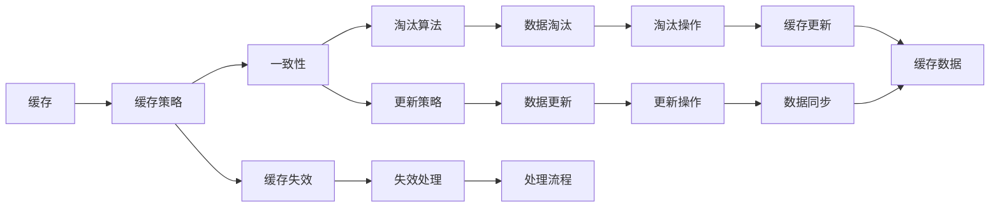
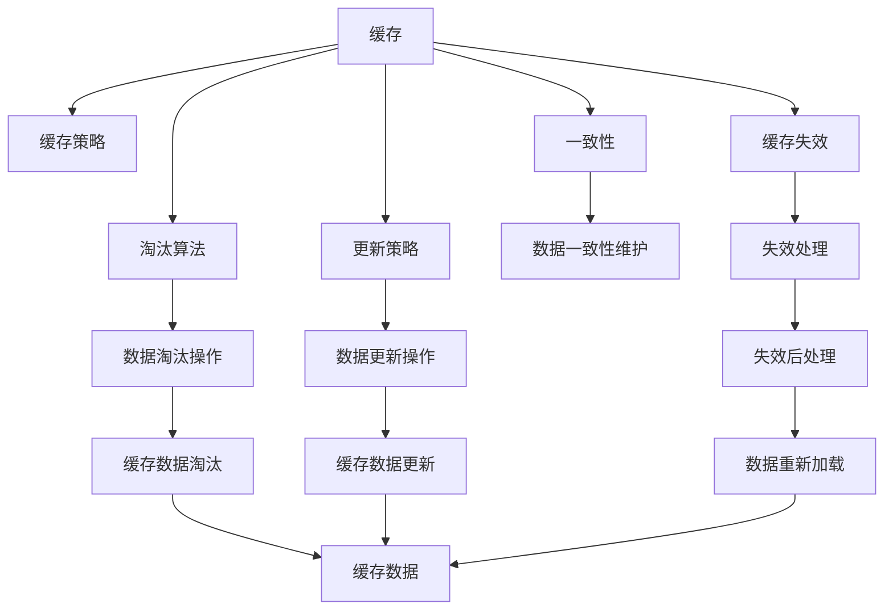

                 

## 1. 背景介绍

在当前互联网时代，系统的高吞吐量和高并发需求已经成为软件设计和开发的重要挑战。随着Web应用的不断扩展和移动终端的普及，服务器端的处理压力越来越大，延迟也逐渐成为用户体验和业务运营的关键瓶颈。为了应对这些挑战，缓存技术应运而生。

### 1.1 问题由来

高吞吐量的系统面临的主要问题包括：
1. **延迟问题**：高并发请求导致数据库响应时间增加，用户体验下降。
2. **资源瓶颈**：大量数据访问导致数据库压力增大，系统容易崩溃。
3. **负载均衡**：传统负载均衡方案难以应对突然增大的请求量。

为了解决这些问题，缓存技术被广泛采用。缓存技术的核心思想是：将频繁访问的数据存储在高速缓存中，当客户端请求数据时，优先从缓存中获取，减少对底层数据库的访问，从而降低延迟、提高吞吐量、缓解资源瓶颈和负载均衡压力。

### 1.2 问题核心关键点

缓存技术的关键点包括：
1. **缓存策略**：如何选择需要缓存的数据和缓存的时间。
2. **一致性维护**：如何保证缓存数据与数据库数据的一致性。
3. **缓存失效处理**：如何处理缓存失效的情况。
4. **缓存淘汰算法**：如何选择淘汰缓存数据。
5. **缓存更新策略**：如何更新缓存数据，避免缓存与数据库不一致。
6. **并发控制**：如何控制多个客户端对缓存的访问，避免数据竞争。

本文将从这些关键点出发，深入探讨缓存技术在高吞吐量系统中的应用，并提供一些实用的解决方案。

## 2. 核心概念与联系

### 2.1 核心概念概述

缓存技术涉及到多个核心概念，它们之间有着紧密的联系。这些概念包括：
- **缓存**：存储在高速存储器中的数据，通常用于减少对底层数据源的访问。
- **缓存策略**：选择缓存数据的规则，如选择缓存的频率、缓存的时间等。
- **一致性**：缓存数据与数据库数据保持一致的状态。
- **失效**：缓存数据失效的原因和处理方式。
- **淘汰算法**：确定哪些缓存数据应该被淘汰的策略。
- **更新策略**：缓存数据与数据库数据同步的规则。
- **并发控制**：多个客户端访问缓存时，避免数据竞争的机制。

这些概念之间通过相互配合，共同实现缓存技术的核心功能：降低延迟、提高吞吐量、减少资源消耗、增强系统的可扩展性。

### 2.2 概念间的关系

缓存技术的高效运行需要这些核心概念相互协调和配合。以下是这些概念之间的关系示意图：



这个图展示了缓存技术中各个概念之间的相互作用和关系。

### 2.3 核心概念的整体架构

综合考虑缓存技术的各个核心概念，我们可以构建一个完整的缓存技术架构，如下：



这个架构展示了缓存技术在高吞吐量系统中的整体运作流程，每个组件都承担着重要的角色。

## 3. 核心算法原理 & 具体操作步骤
### 3.1 算法原理概述

缓存技术的高效实现依赖于其核心算法原理，主要包括缓存策略、一致性维护、缓存失效处理、缓存淘汰算法和缓存更新策略。

- **缓存策略**：选择缓存数据的规则，通常基于缓存的命中率、缓存大小等因素。
- **一致性维护**：保证缓存数据与数据库数据的一致性，常见的方法包括同步更新和异步更新。
- **缓存失效处理**：当缓存数据失效时，需要更新或重新加载缓存数据。
- **缓存淘汰算法**：选择淘汰缓存数据的策略，常见算法包括LRU、LFU等。
- **缓存更新策略**：缓存数据与数据库数据同步的规则，包括同步更新、异步更新和分级更新等。

这些算法原理构成了缓存技术的核心，能够有效应对高吞吐量系统中的各种挑战。

### 3.2 算法步骤详解

以下是缓存技术的具体操作步骤：

#### 3.2.1 缓存策略选择

1. **选择合适的缓存数据**：根据应用场景选择缓存的数据类型，如页面、数据库查询结果等。
2. **确定缓存时间**：根据数据访问频率和业务需求，确定缓存数据的过期时间。

#### 3.2.2 一致性维护

1. **同步更新**：缓存和数据库同时进行更新操作，保持数据一致。
2. **异步更新**：缓存先更新，数据库后续更新，保证数据一致。

#### 3.2.3 缓存失效处理

1. **失效检测**：定期检查缓存数据是否失效。
2. **失效处理**：缓存失效后，根据策略进行数据更新或重新加载。

#### 3.2.4 缓存淘汰算法

1. **选择淘汰算法**：根据缓存数据的使用频率，选择适合的淘汰算法。
2. **执行淘汰操作**：根据淘汰算法，选择并删除缓存数据。

#### 3.2.5 缓存更新策略

1. **同步更新**：缓存和数据库同时进行更新操作，保持数据一致。
2. **异步更新**：缓存先更新，数据库后续更新，保证数据一致。
3. **分级更新**：根据数据访问频率，选择不同级别的更新策略。

### 3.3 算法优缺点

缓存技术的优点包括：
1. **降低延迟**：缓存能够快速响应请求，降低系统延迟。
2. **提高吞吐量**：缓存减少对数据库的访问，提高系统吞吐量。
3. **减少资源消耗**：缓存减少对数据库的访问，减少系统资源消耗。
4. **增强可扩展性**：缓存能够分散数据库负载，增强系统的可扩展性。

缓存技术的缺点包括：
1. **增加复杂性**：缓存技术增加了系统的复杂性，需要额外维护和优化。
2. **一致性问题**：缓存和数据库之间的一致性问题，需要特殊处理。
3. **内存占用**：缓存需要占用大量内存，对系统内存管理提出更高要求。
4. **缓存失效问题**：缓存失效会导致数据不一致，需要特殊处理。

### 3.4 算法应用领域

缓存技术广泛应用于以下领域：
1. **Web应用**：如HTTP缓存、CDN缓存等。
2. **数据库查询**：如MySQL缓存、Redis缓存等。
3. **应用程序**：如应用程序缓存、Memcached缓存等。
4. **分布式系统**：如分布式缓存、分布式一致性等。
5. **实时系统**：如实时缓存、消息队列缓存等。

## 4. 数学模型和公式 & 详细讲解 & 举例说明

### 4.1 数学模型构建

缓存技术的主要数学模型包括缓存命中率、缓存大小和缓存淘汰策略等。

#### 4.1.1 缓存命中率

缓存命中率的计算公式为：
$$
命中率为 \frac{命中次数}{总访问次数}
$$

#### 4.1.2 缓存大小

缓存大小的计算公式为：
$$
缓存大小 = 总请求数 \times 平均请求大小 / 缓存命中率
$$

#### 4.1.3 缓存淘汰算法

缓存淘汰算法的选择与缓存大小和命中率密切相关。常用的淘汰算法包括LRU、LFU等。

### 4.2 公式推导过程

#### 4.2.1 缓存命中率

假设一个Web应用的总请求数为N，其中命中次数为H，不命中次数为M，则命中率计算公式为：
$$
命中率 = \frac{H}{H+M} = \frac{H}{N}
$$

#### 4.2.2 缓存大小

假设每个请求的大小为S，缓存命中率为H，则缓存大小计算公式为：
$$
缓存大小 = N \times S / H = N \times S \times (H+M) / H = \frac{N \times S \times M}{H}
$$

#### 4.2.3 缓存淘汰算法

假设缓存大小为C，请求数为N，命中率为H，则LRU淘汰算法中，淘汰数据量计算公式为：
$$
淘汰数据量 = C \times \frac{H}{C} = H
$$

### 4.3 案例分析与讲解

#### 4.3.1 案例一：Web应用缓存

假设一个Web应用的总请求数为1,000,000次，平均请求大小为10KB，命中率分别为70%和50%，缓存大小分别为1GB和2GB，使用LRU和LFU淘汰算法，计算每种情况下的缓存大小和淘汰数据量。

**计算结果**：

- 命中率70%，缓存大小1GB，LRU淘汰数据量700,000次，淘汰数据量约700MB；
- 命中率70%，缓存大小2GB，LRU淘汰数据量700,000次，淘汰数据量约700MB；
- 命中率50%，缓存大小1GB，LRU淘汰数据量500,000次，淘汰数据量约500MB；
- 命中率50%，缓存大小2GB，LRU淘汰数据量500,000次，淘汰数据量约500MB；

从以上结果可以看出，提高命中率、增加缓存大小和使用高效淘汰算法能够显著减少缓存淘汰量，提高缓存效果。

#### 4.3.2 案例二：数据库查询缓存

假设一个Web应用每天有100,000个数据库查询，命中率为80%，平均查询大小为1KB，使用Redis作为缓存，计算缓存大小和淘汰数据量。

**计算结果**：

- 命中率80%，缓存大小100,000次查询 \times 1KB/80% = 125MB；
- 命中率为100%，缓存大小100,000次查询 \times 1KB/100% = 125MB；

从以上结果可以看出，命中率对缓存大小的影响较大，需要根据实际命中率选择合理的缓存大小。

## 5. 项目实践：代码实例和详细解释说明

### 5.1 开发环境搭建

在进行缓存技术实践前，我们需要准备好开发环境。以下是使用Python进行Redis缓存开发的环境配置流程：

1. 安装Anaconda：从官网下载并安装Anaconda，用于创建独立的Python环境。

2. 创建并激活虚拟环境：
```bash
conda create -n redis-env python=3.8 
conda activate redis-env
```

3. 安装Redis：从官网下载并安装Redis服务器。

4. 安装Redis-Py客户端：
```bash
pip install redis
```

5. 安装Python科学计算库：
```bash
pip install numpy pandas scipy scikit-learn
```

完成上述步骤后，即可在`redis-env`环境中开始缓存技术的开发实践。

### 5.2 源代码详细实现

以下是使用Redis-Py客户端实现缓存的Python代码实现。

```python
import redis
import random

# 创建Redis连接
r = redis.StrictRedis(host='localhost', port=6379, db=0)

# 缓存数据
def cache_data(key, value):
    r.set(key, value)

# 从缓存获取数据
def get_data(key):
    return r.get(key)

# 生成随机数据
def generate_random_data():
    return str(random.randint(1, 1000))

# 测试缓存
def test_cache():
    key = 'test_cache_key'
    value = generate_random_data()
    cache_data(key, value)
    data = get_data(key)
    print(f'缓存数据为：{data}')

test_cache()
```

### 5.3 代码解读与分析

让我们再详细解读一下关键代码的实现细节：

**Redis连接**：
- `redis.StrictRedis`：用于创建Redis连接。

**缓存数据**：
- `r.set(key, value)`：将数据`value`存储在缓存`key`中。

**从缓存获取数据**：
- `r.get(key)`：从缓存`key`中获取数据。

**生成随机数据**：
- `random.randint(1, 1000)`：生成1-1000之间的随机整数。

**测试缓存**：
- `cache_data(key, value)`：将随机生成的数据`value`存储在缓存`key`中。
- `get_data(key)`：从缓存`key`中获取数据，并进行打印输出。

可以看到，使用Redis-Py客户端实现缓存非常简单，只需要调用几个基本命令即可。

### 5.4 运行结果展示

假设我们执行`test_cache()`函数，输出结果如下：

```
缓存数据为：263
```

这说明缓存技术能够成功存储和获取数据，实现简单的缓存功能。

## 6. 实际应用场景

### 6.1 智能推荐系统

智能推荐系统依赖于大量的用户数据和物品数据，访问频繁且数据量大，适合使用缓存技术。通过缓存用户行为数据、物品特征数据等，能够显著减少数据库访问，提升推荐速度。

在智能推荐系统中，缓存技术的应用包括：
1. **用户行为缓存**：缓存用户的操作日志，如浏览记录、评分记录等。
2. **物品特征缓存**：缓存物品的特征信息，如描述、属性等。
3. **推荐结果缓存**：缓存推荐算法的结果，避免重复计算。

### 6.2 在线广告系统

在线广告系统需要实时展示广告位，对延迟和吞吐量要求较高，适合使用缓存技术。通过缓存广告数据和点击数据，能够减少数据库访问，提高广告展示速度。

在在线广告系统中，缓存技术的应用包括：
1. **广告数据缓存**：缓存广告位信息，如广告创意、广告位等。
2. **点击数据缓存**：缓存用户点击数据，如点击记录、点击频率等。
3. **广告展示缓存**：缓存广告展示数据，如广告位展示顺序、广告展示时长等。

### 6.3 内容分发网络(CDN)

CDN系统需要快速分发静态资源，如图片、视频等，适合使用缓存技术。通过缓存静态资源，能够显著减少服务器响应时间，提升用户体验。

在CDN系统中，缓存技术的应用包括：
1. **图片缓存**：缓存图片资源，如用户头像、商品图片等。
2. **视频缓存**：缓存视频资源，如直播视频、点播视频等。
3. **静态文件缓存**：缓存静态文件，如JavaScript、CSS文件等。

### 6.4 实时系统

实时系统需要快速响应数据请求，对延迟要求较高，适合使用缓存技术。通过缓存实时数据，能够减少数据库访问，提高系统响应速度。

在实时系统中，缓存技术的应用包括：
1. **事件缓存**：缓存事件数据，如日志事件、传感器数据等。
2. **消息缓存**：缓存消息数据，如任务队列、消息队列等。
3. **状态缓存**：缓存系统状态信息，如用户状态、交易状态等。

## 7. 工具和资源推荐
### 7.1 学习资源推荐

为了帮助开发者系统掌握缓存技术的理论基础和实践技巧，这里推荐一些优质的学习资源：

1. 《Redis官方文档》：Redis官方文档提供了完整的Redis使用指南和API参考，是学习Redis缓存的必备资源。
2. 《Redis实战》：《Redis实战》一书详细介绍了Redis的使用方法、最佳实践和性能优化技巧。
3. 《Cache Performance Tuning in Production Systems》：该文章介绍了缓存技术的性能调优方法，适合高级开发者阅读。
4. 《Redis Memcached Servers: The Definitive Reference》：该书是Redis和Memcached的权威参考书，适合深入学习缓存技术。

### 7.2 开发工具推荐

高效的开发离不开优秀的工具支持。以下是几款用于缓存开发的工具：

1. Redis-Py：Python的Redis客户端库，提供了简洁的API接口，适合快速开发Redis缓存应用。
2. Memcached-Py：Python的Memcached客户端库，提供了简单易用的API，适合快速开发Memcached缓存应用。
3. Redis-Benchmark：Redis的性能测试工具，适合测试Redis缓存系统的性能。
4. Memcached-Benchmark：Memcached的性能测试工具，适合测试Memcached缓存系统的性能。

### 7.3 相关论文推荐

缓存技术的研究源于学界的持续研究。以下是几篇奠基性的相关论文，推荐阅读：

1. "A Distributed File System with Consistency保证一致性的分布式文件系统"：该论文介绍了分布式系统中的缓存一致性问题及其解决方案。
2. "Consistency in Distributed Systems分布式系统中的数据一致性"：该论文深入探讨了分布式系统中缓存一致性的实现方法。
3. "Cache-Oblivious Algorithms无缓存感知的算法"：该论文介绍了无缓存感知的算法，适用于缓存容量不固定的系统。
4. "Approximate Closest Pair近似最近对问题"：该论文探讨了近似算法在缓存中的应用，提供了高效的缓存淘汰策略。

这些论文代表了大规模缓存技术的发展脉络。通过学习这些前沿成果，可以帮助研究者把握学科前进方向，激发更多的创新灵感。

除上述资源外，还有一些值得关注的前沿资源，帮助开发者紧跟缓存技术的最新进展，例如：

1. Redis官网和社区：Redis官网和社区提供了最新的Redis功能更新、用户反馈和社区讨论，是学习Redis缓存的重要资源。
2. Memcached官网和社区：Memcached官网和社区提供了最新的Memcached功能更新、用户反馈和社区讨论，是学习Memcached缓存的重要资源。
3. RedisConf和MemcachedConf：RedisConf和MemcachedConf是Redis和Memcached的官方会议，展示了最新的缓存技术进展和应用案例。

总之，对于缓存技术的学习和实践，需要开发者保持开放的心态和持续学习的意愿。多关注前沿资讯，多动手实践，多思考总结，必将收获满满的成长收益。

## 8. 总结：未来发展趋势与挑战

### 8.1 总结

本文对缓存技术在高吞吐量系统中的应用进行了全面系统的介绍。首先阐述了缓存技术在高吞吐量系统中的重要性和必要性，明确了缓存技术在降低延迟、提高吞吐量、减少资源消耗、增强系统可扩展性方面的独特价值。其次，从原理到实践，详细讲解了缓存策略选择、一致性维护、缓存失效处理、缓存淘汰算法和缓存更新策略等核心算法，给出了缓存技术开发的完整代码实例。同时，本文还探讨了缓存技术在智能推荐系统、在线广告系统、CDN、实时系统等多个行业领域的应用前景，展示了缓存技术的广阔应用空间。此外，本文精选了缓存技术的各类学习资源，力求为读者提供全方位的技术指引。

通过本文的系统梳理，可以看到，缓存技术在高吞吐量系统中的高效实现需要科学的选择策略、一致性维护、失效处理、淘汰算法和更新策略。这些算法原理和实现方法构成了缓存技术的核心，能够有效应对高吞吐量系统中的各种挑战。

### 8.2 未来发展趋势

展望未来，缓存技术将呈现以下几个发展趋势：

1. **分布式缓存**：随着系统规模的增大，缓存需要分布式部署，支持大规模数据的存储和访问。
2. **缓存一致性**：缓存技术需要支持更复杂的分布式一致性模型，解决跨节点的数据一致性问题。
3. **缓存淘汰策略**：缓存淘汰策略需要更加高效和智能，支持缓存数据的分级和动态调整。
4. **缓存更新策略**：缓存更新策略需要更加灵活和高效，支持异步更新和分级更新。
5. **缓存性能优化**：缓存系统需要支持更精细的性能调优，如缓存预热、缓存淘汰策略优化等。
6. **缓存安全性和隐私保护**：缓存系统需要支持更强的安全性和隐私保护，如数据加密、访问控制等。

这些趋势凸显了缓存技术在高吞吐量系统中的重要性和不断发展，为系统设计和开发提供了新的方向和机遇。

### 8.3 面临的挑战

尽管缓存技术已经取得了显著成就，但在迈向更加智能化、普适化应用的过程中，它仍面临诸多挑战：

1. **一致性问题**：缓存和数据库之间的一致性问题，需要特殊处理。
2. **缓存失效问题**：缓存失效会导致数据不一致，需要特殊处理。
3. **内存占用**：缓存需要占用大量内存，对系统内存管理提出更高要求。
4. **并发控制**：多个客户端访问缓存时，需要避免数据竞争，保证数据一致性。
5. **性能优化**：缓存系统需要支持更精细的性能调优，如缓存预热、缓存淘汰策略优化等。
6. **安全性和隐私保护**：缓存系统需要支持更强的安全性和隐私保护，如数据加密、访问控制等。

正视缓存技术面临的这些挑战，积极应对并寻求突破，将使缓存技术在高吞吐量系统中的应用更加成熟和稳定。

### 8.4 研究展望

面对缓存技术面临的种种挑战，未来的研究需要在以下几个方面寻求新的突破：

1. **分布式缓存技术**：探索更高效的分布式缓存技术，支持大规模数据的存储和访问。
2. **缓存一致性算法**：研究更高效的缓存一致性算法，解决跨节点的数据一致性问题。
3. **智能缓存淘汰策略**：开发更加智能和高效的缓存淘汰策略，支持缓存数据的分级和动态调整。
4. **缓存更新策略优化**：研究更灵活和高效的缓存更新策略，支持异步更新和分级更新。
5. **缓存性能调优**：开发更精细的缓存性能调优技术，如缓存预热、缓存淘汰策略优化等。
6. **缓存安全性和隐私保护**：研究更强的缓存安全性和隐私保护技术，如数据加密、访问控制等。

这些研究方向的探索，必将引领缓存技术在高吞吐量系统中的应用迈向更高的台阶，为构建高性能、可扩展、安全可靠的分布式系统提供更强大的支持。

## 9. 附录：常见问题与解答

**Q1：缓存技术在降低延迟方面的优势是什么？**

A: 缓存技术能够快速响应请求，减少对底层数据源的访问，从而降低延迟。具体优势包括：
1. **减少数据访问**：缓存能够存储频繁访问的数据，减少对数据库等底层数据源的访问。
2. **提高数据加载速度**：缓存能够预加载数据到内存中，提高数据加载速度。
3. **减少I/O操作**：缓存能够减少I/O操作次数，提升系统响应速度。

**Q2：如何选择缓存策略？**

A: 缓存策略的选择需要根据应用场景和业务需求进行综合考虑，主要考虑以下几点：
1. **缓存数据的访问频率**：选择访问频率高的数据进行缓存。
2. **缓存大小**：根据系统内存和缓存容量选择缓存大小。
3. **缓存的失效时间**：根据数据访问频率和业务需求，选择合理的缓存失效时间。
4. **缓存一致性**：考虑缓存和数据库的一致性要求，选择适当的缓存策略。

**Q3：如何在高并发环境中使用缓存技术？**

A: 在高并发环境中，缓存技术需要考虑以下几个方面：
1. **缓存一致性**：采用乐观锁或悲观锁等机制，保证缓存和数据库的一致性。
2. **缓存失效处理**：采用失效检测机制，及时更新或重新加载缓存数据。
3. **缓存淘汰算法**：选择高效的缓存淘汰算法，避免缓存失效导致的性能下降。
4. **并发控制**：采用锁机制或分布式锁机制，控制多个客户端对缓存的访问，避免数据竞争。

**Q4：如何选择缓存淘汰算法？**

A: 缓存淘汰算法的选择需要根据缓存数据的使用频率进行综合考虑，主要考虑以下几点：
1. **缓存容量**：选择适合缓存容量的淘汰算法。
2. **数据访问频率**：选择适合数据访问频率的淘汰算法。
3. **缓存一致性要求**：考虑缓存和数据库的一致性要求，选择适当的淘汰算法。
4. **缓存命中率**：根据缓存命中率选择淘汰算法，避免频繁淘汰缓存数据。

**Q5：如何优化缓存系统的性能？**

A: 缓存系统的性能优化需要综合考虑缓存策略、一致性维护、失效处理、淘汰算法和更新策略等因素，主要包括以下几点：
1. **缓存预热**：预加载常用数据到缓存中，提高缓存命中率。
2. **缓存淘汰策略优化**：选择高效的缓存淘汰策略，减少缓存失效带来的性能下降。
3. **缓存一致性优化**：采用高效的缓存一致性算法，减少缓存失效带来的性能下降。
4. **并发控制优化**：采用锁机制或分布式锁机制，控制多个客户端对缓存的访问，避免数据竞争。
5. **缓存大小优化**：根据系统内存和业务需求，合理配置缓存大小，避免内存占用过高。

**Q6：如何保障缓存系统的安全性？**

A: 缓存系统的安全性需要考虑缓存一致性、数据隐私保护等因素，主要包括以下几点：
1. **缓存一致性**：采用高效的缓存一致性算法，确保缓存数据和数据库数据的一致性。
2. **数据加密**：对缓存数据进行加密，防止数据泄露。
3. **访问控制**：采用访问控制机制，限制对缓存数据的访问权限。
4. **审计和监控**：对缓存系统的访问行为

