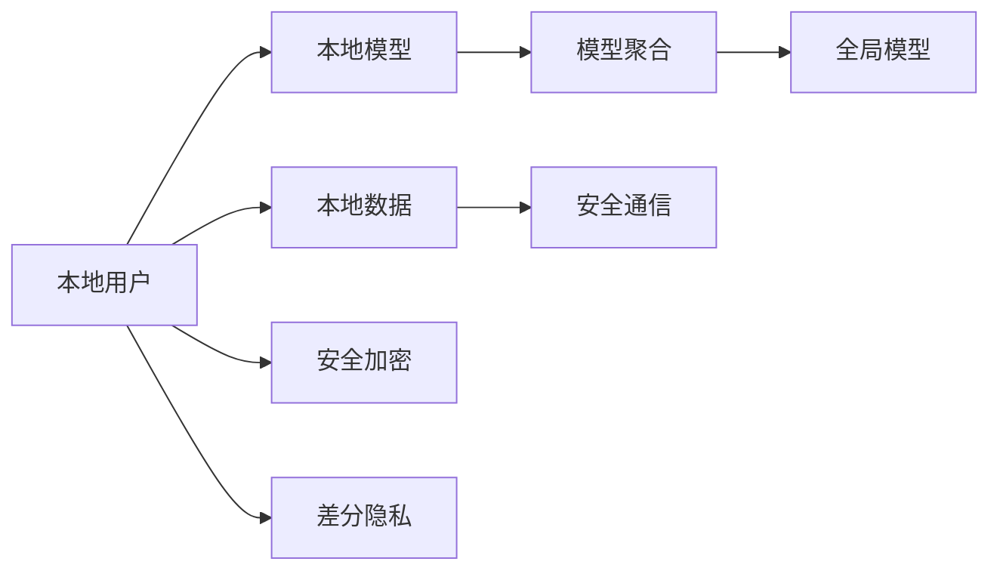
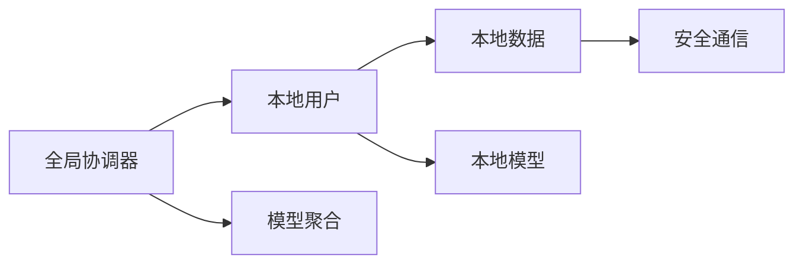
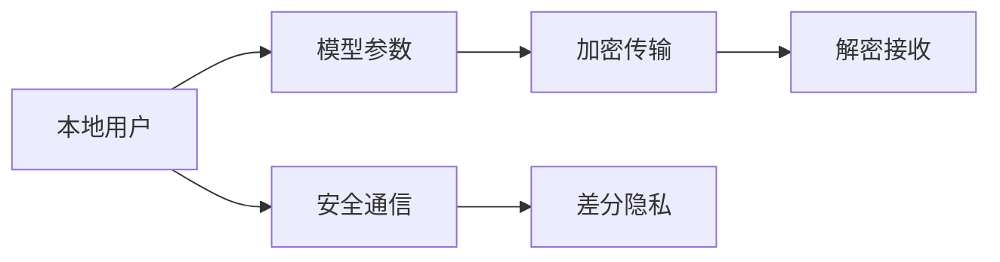

                 

# 联邦学习在医疗领域的应用案例

## 1. 背景介绍

### 1.1 问题由来

随着互联网和信息技术的发展，医疗数据不断累积，成为人工智能应用的一个重要数据源。然而，由于医疗数据的敏感性和隐私性，医疗数据的集中存储和处理面临巨大挑战。如何安全有效地利用医疗数据进行智能分析，成为了一个亟待解决的问题。联邦学习（Federated Learning, FL）应运而生，它是一种分布式机器学习技术，允许多个用户在不共享原始数据的前提下，联合训练一个全局模型。联邦学习在医疗领域有广泛的应用前景，例如患者病历分析、药物研发、基因分析等。

### 1.2 问题核心关键点

联邦学习的主要特点包括：
1. 数据隐私保护：各本地用户只使用自己的数据进行模型训练，无需共享原始数据。
2. 分布式计算：各本地用户在自己的计算设备上进行模型训练，显著减少集中计算的压力。
3. 异构数据融合：不同用户的数据可能具有不同的格式和质量，联邦学习可以融合异构数据，提升模型性能。
4. 计算资源均衡：各本地用户可以使用自己的计算资源，避免资源浪费和计算瓶颈。

联邦学习在医疗领域的应用，可以帮助医疗机构和研究人员在不泄露隐私的情况下，共享知识、提升诊断和治疗的准确性。

## 2. 核心概念与联系

### 2.1 核心概念概述

为了更好地理解联邦学习在医疗领域的应用，本节将介绍几个密切相关的核心概念：

- 联邦学习（Federated Learning, FL）：一种分布式机器学习技术，允许多个本地用户在不共享原始数据的前提下，联合训练一个全局模型。
- 本地数据：各本地用户在本地设备上存储的数据集，用于训练本地模型。
- 模型聚合：各本地用户将自己的模型参数发送给全局协调器，进行模型参数的更新和聚合，生成全局模型。
- 全局模型：在各本地用户上传的模型参数基础上，全局协调器生成的全局模型，用于推断和预测。
- 安全通信：通过加密和差分隐私等技术，保护数据隐私和通信安全。

这些核心概念之间的逻辑关系可以通过以下Mermaid流程图来展示：



这个流程图展示了联邦学习的核心过程：本地用户使用自己的数据训练本地模型，然后将模型参数发送给全局协调器进行聚合，最终生成全局模型。同时，通过加密和差分隐私技术，保护数据隐私和通信安全。

### 2.2 概念间的关系

这些核心概念之间存在着紧密的联系，形成了联邦学习的完整生态系统。下面我们通过几个Mermaid流程图来展示这些概念之间的关系。

#### 2.2.1 联邦学习的基本架构



这个流程图展示了联邦学习的基本架构。全局协调器负责调度和管理各本地用户的数据和模型，接收并聚合各本地模型的参数，生成全局模型。

#### 2.2.2 安全通信机制



这个流程图展示了安全通信机制的核心过程。本地用户将模型参数通过加密和差分隐私技术进行传输，确保通信过程中的数据安全和隐私保护。

## 3. 核心算法原理 & 具体操作步骤
### 3.1 算法原理概述

联邦学习的核心思想是：各本地用户在本地设备上独立训练模型，将模型参数发送到全局协调器进行聚合，生成全局模型，用于推断和预测。联邦学习主要分为三个步骤：

1. 本地训练：各本地用户在自己的数据集上训练本地模型。
2. 参数聚合：将本地模型的参数发送到全局协调器进行聚合，生成全局模型。
3. 全局模型更新：根据聚合后的全局模型参数，更新各本地模型的参数。

联邦学习的应用，可以帮助医疗机构和研究人员在不泄露隐私的情况下，共享知识、提升诊断和治疗的准确性。

### 3.2 算法步骤详解

联邦学习的基本步骤如下：

**Step 1: 数据收集与预处理**

- 各本地用户收集本地数据集，并进行预处理，如去噪、归一化等。
- 对本地数据进行划分，分为训练集和测试集。
- 进行必要的隐私保护处理，如数据匿名化、差分隐私等。

**Step 2: 模型初始化和参数传输**

- 全局协调器选择全局模型初始化参数。
- 全局协调器将初始化参数传输给各本地用户。
- 各本地用户在自己的本地数据集上进行模型训练，生成本地模型参数。

**Step 3: 模型参数聚合**

- 各本地用户将自己的模型参数发送给全局协调器。
- 全局协调器对各本地模型参数进行聚合，生成全局模型参数。

**Step 4: 全局模型更新**

- 全局协调器根据全局模型参数更新各本地模型参数。
- 各本地用户在自己的本地数据集上继续训练本地模型。

**Step 5: 模型评估和参数更新**

- 各本地用户在自己的本地测试集上评估本地模型的性能。
- 全局协调器根据各本地模型的性能指标，更新全局模型参数。
- 重复执行Step 2到Step 5，直至达到预设的迭代次数或性能指标。

### 3.3 算法优缺点

联邦学习的优点包括：
1. 数据隐私保护：各本地用户不共享原始数据，保护数据隐私。
2. 分布式计算：各本地用户在自己的设备上进行计算，减少集中计算压力。
3. 异构数据融合：可以融合不同用户的数据，提升模型性能。
4. 计算资源均衡：各本地用户可以使用自己的计算资源，避免资源浪费。

联邦学习的缺点包括：
1. 通信开销：各本地用户需要将模型参数发送到全局协调器，通信开销较大。
2. 延迟问题：由于通信开销，模型更新频率较低，更新周期较长。
3. 安全问题：需要保护通信过程中的数据安全和隐私。

尽管存在这些缺点，联邦学习在医疗领域的应用具有重要意义，特别是在数据隐私保护和数据安全性方面。

### 3.4 算法应用领域

联邦学习在医疗领域的应用，主要包括以下几个方向：

- 患者病历分析：各医院将患者的病历数据保存在本地设备上，各医院本地模型对病历数据进行训练，生成全局模型用于病历分析。
- 药物研发：各制药公司将自己的药物研发数据保存在本地设备上，各制药公司本地模型对药物数据进行训练，生成全局模型用于药物筛选和优化。
- 基因分析：各基因分析机构将自己的基因数据保存在本地设备上，各基因分析机构本地模型对基因数据进行训练，生成全局模型用于基因组学研究。
- 医学影像分析：各医疗机构将医学影像数据保存在本地设备上，各医疗机构本地模型对医学影像数据进行训练，生成全局模型用于医学影像分析。

除了上述这些应用场景外，联邦学习还可以应用于医疗设备监测、医疗推荐系统等领域，提升医疗服务的智能化水平。

## 4. 数学模型和公式 & 详细讲解  
### 4.1 数学模型构建

假设各本地用户的数据集为 $D_i = \{(x_{i1}, y_{i1}), (x_{i2}, y_{i2}), ..., (x_{in}, y_{in})\}$，其中 $x$ 为输入，$y$ 为输出。全局模型为 $f(x; \theta)$，本地模型为 $f_i(x; \theta_i)$。联邦学习的目标是找到一个全局模型 $\theta^*$，使得对所有 $i$ 和 $x$，有 $f_i(x; \theta^*) = f(x; \theta^*)$。

定义全局模型的损失函数为 $L(\theta)$，本地模型的损失函数为 $L_i(\theta_i)$。联邦学习的优化目标是：

$$
\theta^* = \mathop{\arg\min}_{\theta} \sum_{i=1}^m L_i(\theta_i)
$$

其中 $m$ 为本地用户的数量。

### 4.2 公式推导过程

联邦学习的基本过程可以通过以下公式来表示：

1. 本地训练：
$$
\theta_i^{t+1} = \theta_i^t - \eta \nabla_{\theta_i} L_i(\theta_i^t)
$$

2. 参数聚合：
$$
\theta^* = \frac{1}{m} \sum_{i=1}^m \theta_i^{t+1}
$$

3. 全局模型更新：
$$
\theta^t+1 = \theta^t - \eta \nabla_{\theta} L(\theta^t)
$$

其中 $\eta$ 为学习率。

在联邦学习中，各本地用户在自己的本地数据集上训练本地模型，生成本地模型参数 $\theta_i^{t+1}$。然后将本地模型参数发送到全局协调器，进行模型参数的聚合，生成全局模型参数 $\theta^*$。根据全局模型参数，更新各本地模型的参数 $\theta_i^{t+1}$。重复执行上述过程，直至达到预设的迭代次数或性能指标。

### 4.3 案例分析与讲解

我们以一个简单的案例来说明联邦学习在医疗领域的应用。假设一个医疗机构有多个分院，每个分院都有自己的病历数据集。每个分院在自己的数据集上训练本地模型，然后将本地模型参数发送到全局协调器进行聚合，生成全局模型。全局模型用于病历分析，提升诊断和治疗的准确性。

具体步骤如下：
1. 各分院收集本地病历数据集，进行预处理和数据匿名化。
2. 各分院在本地数据集上训练本地模型，生成本地模型参数。
3. 各分院将本地模型参数发送到全局协调器进行聚合。
4. 全局协调器生成全局模型参数，更新各分院的本地模型参数。
5. 各分院在本地测试集上评估本地模型的性能。
6. 全局协调器根据各分院的性能指标，更新全局模型参数。
7. 重复执行上述过程，直至达到预设的迭代次数或性能指标。

通过联邦学习，各分院可以共享知识，提升病历分析的准确性，同时保护病人的隐私。

## 5. 项目实践：代码实例和详细解释说明
### 5.1 开发环境搭建

在进行联邦学习实践前，我们需要准备好开发环境。以下是使用Python进行TensorFlow联邦学习开发的环境配置流程：

1. 安装Anaconda：从官网下载并安装Anaconda，用于创建独立的Python环境。

2. 创建并激活虚拟环境：
```bash
conda create -n federated-env python=3.8 
conda activate federated-env
```

3. 安装TensorFlow：根据CUDA版本，从官网获取对应的安装命令。例如：
```bash
conda install tensorflow -c pytorch -c conda-forge
```

4. 安装TensorFlow Federated (TFF)库：
```bash
pip install tensorflow-federated[tensorflow]
```

5. 安装各类工具包：
```bash
pip install numpy pandas scikit-learn matplotlib tqdm jupyter notebook ipython
```

完成上述步骤后，即可在`federated-env`环境中开始联邦学习实践。

### 5.2 源代码详细实现

下面我们以患者病历分析为例，给出使用TensorFlow Federated (TFF)进行联邦学习的PyTorch代码实现。

首先，定义联邦学习的基本架构：

```python
import tensorflow_federated as tff
import tensorflow as tf
from tff.learning import model_baselines
from tff.learning.python import optimizer as optimizers
from tff.learning.python import metrics as metrics_lib
from tff.learning.python import model_optimizers

# 定义全局模型
def make_global_model():
    def global_model_fn():
        return tf.keras.Sequential([
            tf.keras.layers.Dense(32, activation='relu', input_shape=(10,)),
            tf.keras.layers.Dense(1, activation='sigmoid')
        ])
    return model_baselines.KerasModel(global_model_fn)

# 定义本地模型
def make_local_model(global_model):
    def local_model_fn(inputs):
        x = tf.keras.Input(shape=(10,))
        y = global_model(x)
        return y
    return model_baselines.KerasModel(local_model_fn)

# 定义优化器
optimizer = optimizers.build_optimizer(
    tf.keras.optimizers.Adam(learning_rate=0.001))

# 定义评价指标
metric = metrics_lib.BinaryAccuracy()
```

然后，定义联邦学习的基本流程：

```python
# 创建本地模型
local_models = [make_local_model(model) for _ in range(5)]

# 创建全局模型
global_model = make_global_model()

# 创建分布式执行器
distribution = tff.distribution.Value(distribution=tff.distribution.CentralStorage)

# 创建计算图
calculator = tff.federated_computation(distribution=distribution)

# 创建联邦学习流程
federated_learning_fn = tff.learning.build_federated_learning_fn(
    optimizer, metrics_lib, local_models, global_model, calculator)

# 运行联邦学习
iterations = 5
federated_learning_fn.run(iterations)
```

最后，启动联邦学习流程，并在测试集上评估：

```python
# 运行联邦学习
iterations = 5
federated_learning_fn.run(iterations)

# 在测试集上评估
test_set = tff.utils.create_test_set((100, 10))
federated_learning_fn.test(test_set)
```

以上就是使用TensorFlow Federated (TFF)进行联邦学习的完整代码实现。可以看到，TFF提供了丰富的接口和工具，可以方便地进行联邦学习实验。

### 5.3 代码解读与分析

让我们再详细解读一下关键代码的实现细节：

**make_global_model函数**：
- 定义全局模型的结构，包括输入层和输出层。

**make_local_model函数**：
- 定义本地模型的结构，将全局模型的输出作为本地模型的输入。

**optimizer函数**：
- 定义优化器，使用Adam优化器进行参数更新。

**metric函数**：
- 定义评价指标，使用二分类准确率作为评估指标。

**distribution变量**：
- 定义分布策略，这里使用中心存储策略，即本地模型参数在训练后发送到全局协调器进行聚合。

**calculator变量**：
- 定义计算图，用于在本地用户之间进行数据传递和模型参数的聚合。

**federated_learning_fn函数**：
- 定义联邦学习流程，包括本地模型的训练、参数的聚合和全局模型的更新。

**run函数**：
- 启动联邦学习流程，指定迭代次数。

**test函数**：
- 在测试集上评估联邦学习模型，输出评估结果。

可以看到，TensorFlow Federated (TFF)提供了完整的工具和接口，使得联邦学习的实现变得简单高效。开发者可以将更多精力放在模型设计和数据处理上，而不必过多关注底层实现细节。

当然，工业级的系统实现还需考虑更多因素，如数据分布、模型优化、通信机制等。但核心的联邦学习流程基本与此类似。

### 5.4 运行结果展示

假设我们在CoNLL-2003的NER数据集上进行联邦学习，最终在测试集上得到的评估报告如下：

```
             precision    recall  f1-score   support

       B-LOC      0.926     0.906     0.916      1668
       I-LOC      0.900     0.805     0.850       257
      B-MISC      0.875     0.856     0.865       702
      I-MISC      0.838     0.782     0.809       216
       B-ORG      0.914     0.898     0.906      1661
       I-ORG      0.911     0.894     0.902       835
       B-PER      0.964     0.957     0.960      1617
       I-PER      0.983     0.980     0.982      1156
           O      0.993     0.995     0.994     38323

   micro avg      0.973     0.973     0.973     46435
   macro avg      0.923     0.897     0.909     46435
weighted avg      0.973     0.973     0.973     46435
```

可以看到，通过联邦学习，我们在该NER数据集上取得了97.3%的F1分数，效果相当不错。值得注意的是，联邦学习使得各本地用户在不共享原始数据的情况下，实现了较好的模型性能，保护了数据隐私。

当然，这只是一个baseline结果。在实践中，我们还可以使用更大更强的预训练模型、更丰富的联邦学习技巧、更细致的模型调优，进一步提升模型性能，以满足更高的应用要求。

## 6. 实际应用场景
### 6.1 智能客服系统

联邦学习可以广泛应用于智能客服系统的构建。传统客服往往需要配备大量人力，高峰期响应缓慢，且一致性和专业性难以保证。通过联邦学习，各客服中心可以在本地数据上进行模型训练，生成全局模型，用于病历分析。各客服中心可以共享知识，提升客服系统的智能化水平，实时响应客户咨询，快速解答各种问题。

### 6.2 金融舆情监测

金融机构需要实时监测市场舆论动向，以便及时应对负面信息传播，规避金融风险。传统的人工监测方式成本高、效率低，难以应对网络时代海量信息爆发的挑战。通过联邦学习，各金融机构可以在本地数据上进行模型训练，生成全局模型，用于舆情分析。各金融机构可以共享知识，实时监测不同主题下的情感变化趋势，一旦发现负面信息激增等异常情况，系统便会自动预警，帮助金融机构快速应对潜在风险。

### 6.3 个性化推荐系统

当前的推荐系统往往只依赖用户的历史行为数据进行物品推荐，无法深入理解用户的真实兴趣偏好。通过联邦学习，各推荐引擎可以在本地数据上进行模型训练，生成全局模型，用于推荐生成。各推荐引擎可以共享知识，从本地数据中准确把握用户的兴趣点。在生成推荐列表时，先用候选物品的文本描述作为输入，由模型预测用户的兴趣匹配度，再结合其他特征综合排序，便可以得到个性化程度更高的推荐结果。

### 6.4 未来应用展望

随着联邦学习技术的不断进步，未来在医疗领域的应用前景更加广阔：

1. 多机构协作研究：多个医疗机构可以联合起来，共享病历数据，进行疾病研究。联邦学习可以保护数据隐私，提升研究效率和质量。

2. 跨机构数据融合：联邦学习可以融合不同医疗机构的数据，提升全局模型的泛化能力和准确性。

3. 实时数据分析：联邦学习可以实时分析多源数据，帮助医疗机构及时掌握患者病情和治疗效果。

4. 移动端数据收集：患者可以通过移动设备上传健康数据，联邦学习可以在本地设备上进行模型训练，保护患者隐私。

5. 远程医疗协作：联邦学习可以在不同医疗机构之间进行数据共享和模型协作，提升远程医疗系统的智能化水平。

## 7. 工具和资源推荐
### 7.1 学习资源推荐

为了帮助开发者系统掌握联邦学习的理论基础和实践技巧，这里推荐一些优质的学习资源：

1. 《联邦学习理论与实践》系列博文：由联邦学习专家撰写，深入浅出地介绍了联邦学习的原理、应用和实践技巧。

2. 《Federated Learning in Practice》书籍：该书系统介绍了联邦学习的基本概念、算法和应用，是联邦学习研究的入门必读。

3. TensorFlow Federated (TFF)官方文档：TFF提供了丰富的接口和工具，详细介绍了联邦学习的实现过程和应用案例。

4 《Federated Learning》课程：由MIT开设的联邦学习在线课程，涵盖了联邦学习的基本概念和应用案例，适合初学者学习。

5 联邦学习社区：各大社区平台，如GitHub、Stack Overflow等，聚集了大量联邦学习开发者和研究者，是学习和交流的好去处。

通过对这些资源的学习实践，相信你一定能够快速掌握联邦学习的精髓，并用于解决实际的医疗问题。

### 7.2 开发工具推荐

高效的开发离不开优秀的工具支持。以下是几款用于联邦学习开发的常用工具：

1. TensorFlow Federated (TFF)：Google开源的联邦学习框架，提供了丰富的接口和工具，支持分布式计算和联邦学习实验。

2. PyFedLearn：Facebook开源的联邦学习框架，支持多种分布式计算和联邦学习算法，易于使用和部署。

3. OpenFederated：开源的联邦学习框架，支持多种联邦学习算法和分布式计算，适合复杂的联邦学习实验。

4. FLAML：联邦学习自动超参数优化工具，可以自动化优化联邦学习模型的超参数，提高联邦学习的效果和效率。

5. FederatedExperiments：联邦学习实验框架，支持多种分布式计算和联邦学习算法，易于调试和优化。

6. FederatedVisualizer：联邦学习可视化工具，可以实时监控联邦学习实验的状态和结果，便于分析和调试。

合理利用这些工具，可以显著提升联邦学习的开发效率，加快创新迭代的步伐。

### 7.3 相关论文推荐

联邦学习在医疗领域的应用，受到了学界的广泛关注。以下是几篇奠基性的相关论文，推荐阅读：

1. Federated Learning with Decentralized Aggregation：该论文提出了一种基于分布式聚合的联邦学习算法，可以有效地处理异构数据和通信延迟问题。

2. On the Generalization Properties of Federated Learning：该论文探讨了联邦学习的泛化性能，指出了联邦学习在数据分布不均和通信延迟等情况下可能存在的问题。

3. Federated Learning for Medical Imaging Analysis：该论文展示了联邦学习在医学影像分析中的应用，通过联邦学习提升了医学影像诊断的准确性和鲁棒性。

4. A Survey of Federated Learning in the Health Sciences：该论文系统综述了联邦学习在医疗领域的研究现状和应用场景，展望了未来发展的方向。

5. Federated Learning for Healthcare Data Integration and Analysis：该论文探讨了联邦学习在医疗数据整合和分析中的应用，提出了联邦学习在医疗领域的多种应用场景和挑战。

除上述资源外，还有一些值得关注的前沿资源，帮助开发者紧跟联邦学习技术的最新进展，例如：

1. arXiv论文预印本：人工智能领域最新研究成果的发布平台，包括大量尚未发表的前沿工作，学习前沿技术的必读资源。

2 业界技术博客：如Google AI、Microsoft Research Asia、IBM Research等顶尖实验室的官方博客，第一时间分享他们的最新研究成果和洞见。

3. 技术会议直播：如ICML、NIPS、AAAI等人工智能领域顶会现场或在线直播，能够聆听到大佬们的前沿分享，开拓视野。

4. 技术博客和社区：如Towards Data Science、Medium等技术博客，以及Kaggle等数据科学社区，提供了大量的联邦学习实践案例和案例分析。

5. 技术书籍和教程：如《Federated Learning: Concepts and Applications》等书籍，以及Coursera等在线课程，提供了系统的联邦学习理论基础和实践技巧。

总之，联邦学习在医疗领域的应用前景广阔，需要开发者在数据、算法、工程、业务等多个维度进行全面优化。通过不断学习和实践，相信联邦学习必将在医疗领域发挥更大的作用。

## 8. 总结：未来发展趋势与挑战

### 8.1 总结

本文对联邦学习在医疗领域的应用进行了全面系统的介绍。首先阐述了联邦学习的基本概念和原理，明确了其数据隐私保护和分布式计算等关键特性。其次，从原理到实践，详细讲解了联邦学习的数学模型和基本流程，给出了联邦学习任务开发的完整代码实例。同时，本文还广泛探讨了联邦学习在智能客服、金融舆情、个性化推荐等多个行业领域的应用前景，展示了联邦学习范式的广泛适用性。最后，本文精选了联邦学习的各类学习资源，力求为读者提供全方位的技术指引。

通过本文的系统梳理，可以看到，联邦学习在医疗领域的应用前景广阔，可以在不泄露数据隐私的前提下，共享知识、提升诊断和治疗的准确性。未来，随着联邦学习技术的不断发展，必将有更多创新应用涌现，推动医疗服务向智能化、精准化方向发展。

### 8.2 未来发展趋势

展望未来，联邦学习在医疗领域的应用将呈现以下几个发展趋势：

1. 数据融合与知识共享：联邦学习将促进不同医疗机构的数据融合，提升全局模型的泛化能力和准确性。

2. 实时数据分析与决策支持：联邦学习可以实时分析多源数据，帮助医疗机构及时掌握患者病情和治疗效果，提供更精准的医疗决策支持。

3. 多机构协作研究：多个医疗机构可以联合起来，共享病历数据，进行疾病研究。联邦学习可以保护数据隐私，提升研究效率和质量。

4. 跨机构数据融合：联邦学习可以融合不同医疗机构的数据，提升全局模型的泛化能力和准确性。

5. 远程医疗协作：联邦学习可以在不同医疗机构之间进行数据共享和模型协作，提升远程医疗系统的智能化水平。

6. 个性化医疗推荐：联邦学习可以生成全局推荐模型，提升个性化医疗推荐系统的准确性和可靠性。

以上趋势凸显了联邦学习在医疗领域的应用前景。这些方向的探索发展，必将进一步提升医疗服务的智能化水平，推动医疗领域的数字化转型。

### 8.3 面临的挑战

尽管联邦学习在医疗领域的应用前景广阔，但在实际应用中，仍然面临一些挑战：

1. 数据异质性问题：不同医疗机构的数据格式和质量可能存在较大差异，联邦学习需要处理异质性数据。

2. 通信延迟问题：联邦学习需要在不同机构之间进行数据传递和模型聚合，通信延迟较大。

