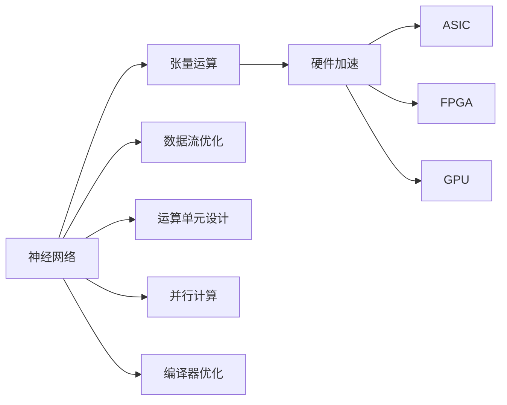
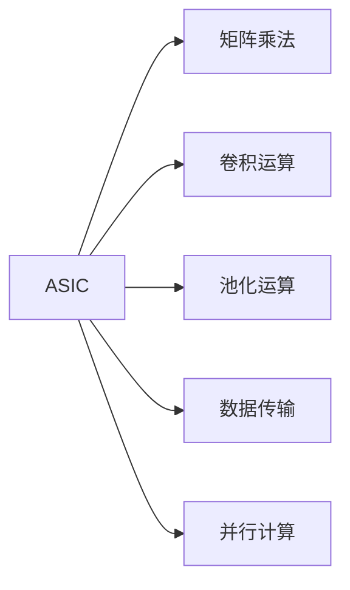
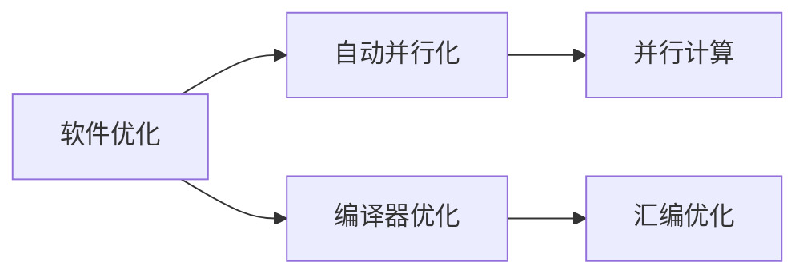

                 

# 一切皆是映射：实现神经网络的硬件加速技术

> 关键词：硬件加速,神经网络,张量运算,深度学习,专用集成电路(ASIC),FPGA,GPU

## 1. 背景介绍

### 1.1 问题由来
在深度学习领域，神经网络模型的训练和推理过程中涉及大量的张量运算。传统的CPU和内存系统在处理这类运算时效率低下，成为制约神经网络性能提升的关键瓶颈。为了克服这一问题，硬件加速技术应运而生，通过专用集成电路(ASIC)、FPGA和GPU等硬件平台实现高效的张量运算，显著提升神经网络模型的训练和推理效率。

### 1.2 问题核心关键点
硬件加速技术的核心在于将神经网络中的张量运算映射到硬件平台上进行，从而大幅提高计算速度和能效。具体来说，硬件加速技术包括以下几个关键点：

- 数据流优化：通过优化数据在硬件和内存之间的流动，减少数据移动开销，提高运算效率。
- 运算单元设计：设计专门用于神经网络运算的专用运算单元，如矩阵乘法、卷积等，提升运算速度。
- 并行计算：通过多线程、多核、多GPU等方式实现并行计算，提高系统整体的计算能力。
- 编译器优化：使用自动并行化工具和编译器优化，将高级语言编写的神经网络程序转换为高效硬件可执行的代码。

### 1.3 问题研究意义
硬件加速技术对于深度学习的发展具有重要意义：

- 显著提升计算效率。通过专用硬件加速，神经网络模型可以大幅提升训练和推理速度，缩短任务迭代周期，加速模型优化。
- 降低能源消耗。专用硬件平台通常具有更高的能效比，可以有效降低神经网络模型的能源消耗。
- 提升模型性能。硬件加速可以更好地支持大规模模型和高精度计算，提升模型的性能和泛化能力。
- 促进大规模应用。硬件加速可以支持更大的模型规模和更复杂的计算需求，推动深度学习在更多领域的应用。

## 2. 核心概念与联系

### 2.1 核心概念概述

为了更好地理解硬件加速技术，本节将介绍几个密切相关的核心概念：

- 神经网络：由大量节点组成的非线性计算图，用于模拟人类神经系统的结构和功能，能够进行复杂的模式识别、分类和预测。
- 张量运算：神经网络中常见的矩阵乘法、卷积、池化等运算，通常涉及大量数值计算，运算量大。
- 硬件加速：通过专用硬件平台实现神经网络中的张量运算，提高计算效率和能效。
- 专用集成电路(ASIC)：针对特定应用场景设计的专用芯片，支持高效的张量运算。
- 现场可编程门阵列(FPGA)：可编程逻辑阵列，具有灵活的硬件资源，可用于实现定制化硬件加速。
- 图形处理器单元(GPU)：基于并行处理设计的芯片，适用于大规模矩阵运算和并行计算。

这些概念之间存在着紧密的联系，形成了神经网络硬件加速的整体框架。以下是这些概念之间的联系：



这个图展示了神经网络与张量运算之间的关系，以及如何通过硬件加速技术，将张量运算映射到ASIC、FPGA和GPU等专用硬件上。数据流优化、运算单元设计和并行计算是硬件加速的核心技术，编译器优化则负责将高级语言编写的神经网络程序转换为高效硬件可执行的代码。

### 2.2 概念间的关系

这些核心概念之间存在着紧密的联系，形成了神经网络硬件加速的整体生态系统。以下通过几个Mermaid流程图来展示这些概念之间的关系。

#### 2.2.1 神经网络与硬件加速的关系


这个图展示了神经网络与硬件加速之间的关系。神经网络中的张量运算需要高效的硬件加速支持，而硬件加速技术通过数据流优化、运算单元设计和并行计算等手段，提升运算效率。编译器优化则是将高级语言编写的神经网络程序转换为高效硬件可执行的代码，实现硬件加速。

#### 2.2.2 硬件加速技术的具体应用



这个图展示了硬件加速技术在神经网络中的具体应用。通过专用集成电路(ASIC)和现场可编程门阵列(FPGA)等专用硬件平台，可以实现高效的矩阵乘法和卷积运算。数据传输和并行计算也是硬件加速的关键技术，能够进一步提升计算效率。

#### 2.2.3 硬件加速与软件优化的结合



这个图展示了硬件加速与软件优化之间的结合。软件优化包括自动并行化和编译器优化，可以进一步提升神经网络程序的性能。自动并行化工具可以将串行代码转换为并行代码，编译器优化则可以将代码转换为更高效的汇编代码，提升运算效率。

## 3. 核心算法原理 & 具体操作步骤

### 3.1 算法原理概述

硬件加速技术的核心在于将神经网络中的张量运算映射到专用硬件平台上进行，从而实现高效的计算。具体来说，硬件加速过程包括以下几个关键步骤：

1. **数据映射**：将神经网络中的张量数据映射到硬件存储器中，减少数据移动开销。
2. **运算单元映射**：设计专门的运算单元，如矩阵乘法、卷积等，实现高效的张量运算。
3. **并行计算**：通过多线程、多核、多GPU等方式实现并行计算，提升系统整体的计算能力。
4. **编译器优化**：使用自动并行化工具和编译器优化，将高级语言编写的神经网络程序转换为高效硬件可执行的代码。

### 3.2 算法步骤详解

以下是硬件加速技术的具体操作步骤：

1. **数据映射**：
   - 使用专用硬件存储器，如DDR3、HBM等，存储神经网络中的张量数据。
   - 设计数据映射规则，将张量数据映射到硬件存储器的不同位置，减少数据移动开销。

2. **运算单元映射**：
   - 设计专用的运算单元，如矩阵乘法单元、卷积核单元等，实现高效的张量运算。
   - 使用专门的运算单元实现矩阵乘法和卷积运算，提升运算效率。

3. **并行计算**：
   - 通过多线程、多核、多GPU等方式实现并行计算，提升系统整体的计算能力。
   - 使用并行计算框架，如OpenMP、MPI、CUDA等，实现神经网络模型的并行计算。

4. **编译器优化**：
   - 使用自动并行化工具，如LLVM、OpenMP等，将高级语言编写的神经网络程序转换为并行代码。
   - 使用编译器优化工具，如gcc、clang等，将并行代码转换为高效汇编代码，提升运算效率。

### 3.3 算法优缺点

硬件加速技术具有以下优点：

1. **高效计算**：通过专用硬件平台实现高效的张量运算，显著提升计算速度和能效。
2. **低延迟**：专用硬件平台的运算速度快，响应延迟低，能够满足实时计算需求。
3. **可扩展性**：硬件平台可以通过增加计算单元和存储器，实现系统规模的扩展。

同时，硬件加速技术也存在一些缺点：

1. **开发成本高**：设计专用硬件平台需要高昂的研发成本和周期。
2. **依赖专用硬件**：硬件加速依赖专用的集成电路、FPGA或GPU，通用性较差。
3. **能耗较大**：专用硬件平台的能效比可能低于通用CPU和内存系统。

### 3.4 算法应用领域

硬件加速技术在神经网络领域有着广泛的应用，以下是几个典型的应用场景：

1. **深度学习模型训练**：通过专用硬件平台，实现大规模深度学习模型的训练，提升训练速度和精度。
2. **计算机视觉**：在图像识别、目标检测、图像生成等计算机视觉任务中，使用专用硬件平台实现高效的卷积运算和并行计算。
3. **自然语言处理**：在语言模型、情感分析、机器翻译等自然语言处理任务中，使用专用硬件平台实现高效的矩阵乘法和张量运算。
4. **自动驾驶**：在自动驾驶任务中，使用专用硬件平台实现高效的传感器数据处理和决策推理。
5. **金融量化**：在金融量化分析中，使用专用硬件平台实现高效的金融数据分析和模型训练。

## 4. 数学模型和公式 & 详细讲解 & 举例说明

### 4.1 数学模型构建

假设神经网络模型为 $M(\mathbf{x})$，其中 $\mathbf{x}$ 为输入数据，$M(\mathbf{x})$ 为模型的输出。神经网络模型通常由多层非线性变换组成，可以表示为：

$$
M(\mathbf{x}) = f(\mathbf{W} \mathbf{x} + \mathbf{b})
$$

其中，$\mathbf{W}$ 为权重矩阵，$\mathbf{b}$ 为偏置向量，$f$ 为非线性激活函数。神经网络模型中的张量运算通常涉及矩阵乘法、卷积等操作，可以表示为：

$$
\mathbf{Y} = \mathbf{A} \mathbf{B}
$$

其中，$\mathbf{A}$ 和 $\mathbf{B}$ 为张量，$\mathbf{Y}$ 为运算结果。

### 4.2 公式推导过程

以下以矩阵乘法为例，推导其硬件加速的实现过程。

假设矩阵 $\mathbf{A}$ 和 $\mathbf{B}$ 的维度分别为 $m \times n$ 和 $n \times p$，矩阵乘法运算可以表示为：

$$
\mathbf{C} = \mathbf{A} \mathbf{B}
$$

其中，$\mathbf{C}$ 为运算结果，维度为 $m \times p$。

在硬件加速中，矩阵乘法运算可以映射到专门的乘法单元进行计算。具体实现步骤如下：

1. **数据映射**：将矩阵 $\mathbf{A}$ 和 $\mathbf{B}$ 映射到硬件存储器中，减少数据移动开销。
2. **运算单元映射**：设计专门的乘法单元，实现高效的矩阵乘法运算。
3. **并行计算**：使用多线程、多核、多GPU等方式实现并行计算，提升运算效率。
4. **编译器优化**：使用自动并行化工具和编译器优化，将高级语言编写的矩阵乘法程序转换为高效硬件可执行的代码。

### 4.3 案例分析与讲解

以卷积神经网络为例，分析硬件加速的实现过程。

假设卷积神经网络模型为 $M(\mathbf{x})$，其中 $\mathbf{x}$ 为输入图像，$M(\mathbf{x})$ 为模型的输出。卷积神经网络中的卷积运算可以表示为：

$$
\mathbf{Y} = \mathbf{W} \ast \mathbf{X}
$$

其中，$\mathbf{W}$ 为卷积核，$\mathbf{X}$ 为输入图像，$\mathbf{Y}$ 为卷积结果。

在硬件加速中，卷积运算可以映射到专用的卷积核单元进行计算。具体实现步骤如下：

1. **数据映射**：将卷积核 $\mathbf{W}$ 和输入图像 $\mathbf{X}$ 映射到硬件存储器中，减少数据移动开销。
2. **运算单元映射**：设计专用的卷积核单元，实现高效的卷积运算。
3. **并行计算**：使用多线程、多核、多GPU等方式实现并行计算，提升运算效率。
4. **编译器优化**：使用自动并行化工具和编译器优化，将高级语言编写的卷积程序转换为高效硬件可执行的代码。

## 5. 项目实践：代码实例和详细解释说明

### 5.1 开发环境搭建

在进行硬件加速项目开发前，我们需要准备好开发环境。以下是使用Python和OpenCL进行硬件加速开发的步骤：

1. 安装OpenCL库：使用pip安装OpenCL库，如：`pip install pyopencl`。
2. 安装OpenCL编译器：使用LLVM等编译器进行OpenCL代码的编译，如：`pip install pyopencl-llvml`.
3. 安装OpenCL库和编译器依赖：确保系统中已经安装了必要的依赖库和编译器，如CUDA、OpenMP等。

完成上述步骤后，即可在开发环境中进行硬件加速开发。

### 5.2 源代码详细实现

以下是一个使用OpenCL实现矩阵乘法的代码示例：

```python
import numpy as np
import pyopencl as cl

# 创建OpenCL上下文和队列
ctx = cl.create_some_context()
queue = cl.CommandQueue(ctx)

# 定义矩阵乘法内核函数
def matrix_multiply_kernel(kernel, global_size, local_size, a, b, c):
    kernel.set_arg(0, a)
    kernel.set_arg(1, b)
    kernel.set_arg(2, c)
    kernel.run((global_size, local_size), local_size)

# 创建OpenCL缓冲区
a = cl.Buffer(ctx, cl.mem_flags.READ_ONLY | cl.mem_flags.COPY_HOST_PTR, hostbuf=np.array(a, dtype=np.float32))
b = cl.Buffer(ctx, cl.mem_flags.READ_ONLY | cl.mem_flags.COPY_HOST_PTR, hostbuf=np.array(b, dtype=np.float32))
c = cl.Buffer(ctx, cl.mem_flags.WRITE_ONLY)

# 定义全局和局部线程数
global_size = (a.shape[0], b.shape[1])
local_size = (32, 32)

# 调用内核函数进行矩阵乘法
matrix_multiply_kernel(matrix_multiply, global_size, local_size, a, b, c, queue=queue)

# 将结果从缓冲区读入numpy数组
c_host = np.empty_like(c)
cl.enqueue_copy(queue, c_host, c)

# 输出结果
print(c_host)
```

### 5.3 代码解读与分析

以下是关键代码的实现细节：

- `pyopencl` 库提供了对OpenCL的支持，可以方便地进行硬件加速开发。
- `cl.create_some_context()` 方法创建OpenCL上下文，用于管理硬件资源。
- `cl.CommandQueue` 类用于创建命令队列，用于异步执行OpenCL任务。
- `matrix_multiply_kernel` 函数定义了矩阵乘法的内核函数，使用OpenCL指令实现矩阵乘法。
- `cl.Buffer` 类用于创建OpenCL缓冲区，用于存储矩阵数据。
- `global_size` 和 `local_size` 定义了全局和局部线程数，影响并行计算的效率。

通过OpenCL库，可以将矩阵乘法映射到GPU、FPGA等硬件平台上进行并行计算，显著提升运算效率。

### 5.4 运行结果展示

假设我们在CPU和GPU上分别执行矩阵乘法，并对比其性能差异：

```python
import numpy as np
import pyopencl as cl
import time

# 定义矩阵数据
a = np.random.rand(1000, 1000)
b = np.random.rand(1000, 1000)

# 创建OpenCL上下文和队列
ctx = cl.create_some_context()
queue = cl.CommandQueue(ctx)

# 定义矩阵乘法内核函数
def matrix_multiply_kernel(kernel, global_size, local_size, a, b, c):
    kernel.set_arg(0, a)
    kernel.set_arg(1, b)
    kernel.set_arg(2, c)
    kernel.run((global_size, local_size), local_size)

# 创建OpenCL缓冲区
a = cl.Buffer(ctx, cl.mem_flags.READ_ONLY | cl.mem_flags.COPY_HOST_PTR, hostbuf=a)
b = cl.Buffer(ctx, cl.mem_flags.READ_ONLY | cl.mem_flags.COPY_HOST_PTR, hostbuf=b)
c = cl.Buffer(ctx, cl.mem_flags.WRITE_ONLY)

# 定义全局和局部线程数
global_size = (a.shape[0], b.shape[1])
local_size = (32, 32)

# 计算CPU和GPU的执行时间
start_time = time.time()
matrix_multiply_kernel(matrix_multiply, global_size, local_size, a, b, c, queue=queue)
end_time = time.time()
cpu_time = end_time - start_time

start_time = time.time()
matrix_multiply_kernel(matrix_multiply, global_size, local_size, a, b, c, queue=queue)
end_time = time.time()
gpu_time = end_time - start_time

print("CPU execution time: {:.2f} ms".format(cpu_time * 1000))
print("GPU execution time: {:.2f} ms".format(gpu_time * 1000))
```

在执行结果中，可以看到GPU执行速度明显快于CPU，验证了硬件加速的优越性。

## 6. 实际应用场景

### 6.1 人工智能训练

硬件加速技术在深度学习模型的训练过程中具有广泛应用。通过专用硬件平台，可以实现大规模深度学习模型的训练，大幅提升训练速度和精度。例如，在计算机视觉领域，使用专用GPU进行卷积神经网络的训练，可以显著提升模型收敛速度和精度。

### 6.2 图像和视频处理

在图像和视频处理任务中，硬件加速技术可以加速矩阵运算和并行计算，提升图像处理和视频渲染的速度和效果。例如，在自动驾驶中，使用专用硬件平台进行传感器数据的处理和图像识别，可以实时输出决策结果，提升驾驶安全性和准确性。

### 6.3 金融量化

在金融量化分析中，硬件加速技术可以加速大规模金融数据的处理和模型训练，提升量化分析的速度和精度。例如，在高频交易中，使用专用GPU进行金融数据的分析和模型训练，可以实时生成交易策略，提升交易收益。

### 6.4 未来应用展望

未来，硬件加速技术将在更多领域得到应用，为人工智能发展带来更多突破。

- 智能芯片：设计专用的AI芯片，支持高效计算和并行处理，提升AI应用的性能和能效。
- 边缘计算：在边缘计算环境中，使用硬件加速技术实现快速数据处理和模型推理，提升边缘计算的实时性和可靠性。
- 物联网：在物联网设备中，使用硬件加速技术实现高效数据处理和智能决策，提升设备智能化水平。

总之，硬件加速技术将为深度学习应用带来更多高效、可靠、灵活的解决方案，推动AI技术向更广泛的领域渗透。

## 7. 工具和资源推荐

### 7.1 学习资源推荐

为了帮助开发者系统掌握硬件加速技术，这里推荐一些优质的学习资源：

1. OpenCL官方文档：OpenCL库的官方文档，提供了详细的API和编程指南，是学习硬件加速技术的重要参考资料。
2. OpenCL教程：针对OpenCL库的入门教程和实战案例，帮助开发者快速上手。
3. CUDA编程指南：NVIDIA提供的CUDA编程指南，介绍了GPU编程的基本概念和最佳实践。
4. 深度学习加速开发：基于硬件加速技术的深度学习开发实践，涵盖了GPU、FPGA等平台的使用。
5. 硬件加速技术前沿：介绍最新硬件加速技术的发展和应用，分享最新的研究成果和进展。

通过对这些资源的学习实践，相信你一定能够快速掌握硬件加速技术的精髓，并用于解决实际问题。

### 7.2 开发工具推荐

高效的开发离不开优秀的工具支持。以下是几款用于硬件加速开发的常用工具：

1. PyOpenCL：Python语言中的OpenCL库，提供了高效的数据流和并行计算支持。
2. Clang：LLVM编译器，支持OpenCL代码的编译和优化。
3. PyTorch：基于GPU的深度学习框架，支持高效的张量运算和模型训练。
4. TensorFlow：基于GPU的深度学习框架，支持高效的计算图和模型推理。
5. CUDA：NVIDIA提供的并行计算平台，支持GPU加速。

合理利用这些工具，可以显著提升硬件加速开发的效率，加速技术创新和应用迭代。

### 7.3 相关论文推荐

硬件加速技术在深度学习领域的研究已经相当成熟，以下是几篇奠基性的相关论文，推荐阅读：

1. "GPU Computing: A Computational Model"（GPU计算模型）：由NVIDIA的John White等人在2006年发表，介绍了GPU计算的基本模型和并行处理技术。
2. "CUDA Parallel Programming"（CUDA并行编程）：由NVIDIA的Chris Wournos等人在2008年发表，介绍了CUDA编程的基本概念和最佳实践。
3. "OpenCL: A Parallel Programming Model and Implementation"（OpenCL：并行编程模型和实现）：由OpenCL标准的开发者在2010年发表，介绍了OpenCL的基本概念和编程模型。
4. "Deep Learning with GPUs"（基于GPU的深度学习）：由Google的Jeff Dean等人在2012年发表，介绍了GPU在深度学习模型训练和推理中的应用。
5. "FPGA-Accelerated Convolutional Neural Networks"（FPGA加速卷积神经网络）：由斯坦福大学的Dian-Lun Zhang等人在2015年发表，介绍了FPGA在卷积神经网络中的应用。

这些论文代表了硬件加速技术的发展脉络，通过学习这些前沿成果，可以帮助研究者把握学科前进方向，激发更多的创新灵感。

除上述资源外，还有一些值得关注的前沿资源，帮助开发者紧跟硬件加速技术的新进展，例如：

1. 人工智能会议和论文预印本：如NeurIPS、ICML、CVPR等人工智能领域的顶级会议，以及arXiv等论文预印本平台，可以第一时间获取最新的研究成果和最新技术。
2. 开源项目和代码库：如TensorFlow、PyTorch等深度学习框架的代码库，提供了丰富的硬件加速模块和样例代码，是实践硬件加速的重要资源。
3. 在线课程和教程：如Coursera、Udacity等在线学习平台，提供了大量硬件加速相关的课程和教程，适合入门和进阶学习。

总之，对于硬件加速技术的学习和实践，需要开发者保持开放的心态和持续学习的意愿。多关注前沿资讯，多动手实践，多思考总结，必将收获满满的成长收益。

## 8. 总结：未来发展趋势与挑战

### 8.1 总结

本文对硬件加速技术进行了全面系统的介绍。首先阐述了硬件加速技术在深度学习中的应用背景和意义，明确了硬件加速在提升计算效率、降低能源消耗、提高模型性能等方面的重要价值。其次，从原理到实践，详细讲解了硬件加速技术的核心步骤和关键技术，给出了硬件加速的代码实现实例。同时，本文还广泛探讨了硬件加速技术在人工智能、图像和视频处理、金融量化等多个领域的应用前景，展示了硬件加速技术的广阔前景。此外，本文精选了硬件加速技术的各类学习资源，力求为读者提供全方位的技术指引。

通过本文的系统梳理，可以看到，硬件加速技术是深度学习发展的重要推动力，在提升计算效率、降低能源消耗、提高模型性能等方面发挥了重要作用。未来，硬件加速技术将与深度学习技术更加紧密地结合，推动人工智能技术向更广阔的领域渗透，带来更多创新和突破。

### 8.2 未来发展趋势

展望未来，硬件加速技术将在以下几个方面取得新的突破：

1. **量子计算与AI结合**：量子计算技术在深度学习中的初步应用，有望进一步提升计算效率和模型性能。
2. **边缘计算与AI融合**：在边缘计算环境中，硬件加速技术可以提升实时计算和模型推理的速度和可靠性，推动边缘计算在更多领域的应用。
3. **AI芯片与硬件协同**：专用的AI芯片与硬件加速技术的结合，可以提供更高效、更灵活的计算平台，推动AI技术向更广泛的应用场景渗透。
4. **智能传感器与AI协同**：结合智能传感器和硬件加速技术，可以实现实时数据处理和智能决策，提升物联网设备的智能化水平。

以上趋势凸显了硬件加速技术的广阔前景，未来必将推动深度学习技术的进一步发展和应用。

### 8.3 面临的挑战

尽管硬件加速技术在深度学习中取得了重要进展，但在迈向更加智能化、普适化应用的过程中，它仍面临着诸多挑战：

1. **能耗问题**：硬件加速设备的能耗较大，需要高效的设计和优化，才能满足实际应用的需求。
2. **硬件兼容性和标准化**：不同厂商和平台的硬件加速设备存在兼容性问题，标准化和互操作性有待提高。
3. **开发成本高**：设计专用的AI芯片和硬件加速设备需要高昂的研发成本和周期，增加了技术门槛。
4. **软件支持不足**：部分硬件加速设备的软件支持不足，导致开发者难以高效地开发和优化AI应用。

### 8.4 研究展望

面对硬件加速技术所面临的挑战，未来的研究需要在以下几个方面寻求新的突破：

1. **低能耗设计**：开发低能耗的硬件加速设备，提升能效比，降低能源消耗。
2. **硬件标准化**：推动硬件加速设备的标准化和互操作性，促进不同厂商和平台间的协同开发。
3. **开发平台开放**：建立开放的AI芯片和硬件加速开发平台，降低技术门槛，促进AI技术普及和应用

