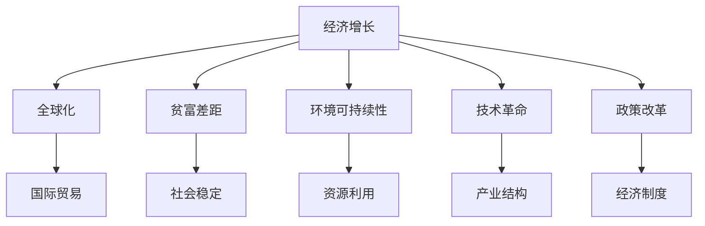

                 

# 世界经济增长困境的多方面影响分析

> 关键词：经济增长困境, 全球化, 贫富差距, 环境可持续性, 技术革命, 政策改革

## 1. 背景介绍

### 1.1 问题由来
当前，全球经济正面临前所未有的增长困境。自2008年金融危机以来，尽管各国采取了多种刺激措施，全球经济增长仍长期低于预期水平，贫富差距扩大，环境问题严峻。这些问题不仅影响各国的经济健康和民众福祉，也对全球贸易、金融体系和地缘政治格局产生深远影响。本文旨在深入分析这些经济增长困境的多方面影响，并探讨可能的应对策略。

### 1.2 问题核心关键点
全球经济增长困境的核心关键点包括：
- **增长乏力和失业率高**：许多国家面临经济增长缓慢和失业率高企的困境，影响社会稳定。
- **贫富差距加剧**：全球贫富差距不断扩大，成为社会矛盾的导火索。
- **环境问题严峻**：气候变化和资源过度消耗对经济和环境可持续发展构成威胁。
- **技术变革的机遇与挑战**：新技术在推动经济增长和就业结构变化的同时，也对传统产业和劳动力市场造成冲击。
- **政策改革的必要性**：国际和国内的政策改革亟需跟上经济和社会的变迁，以应对复杂的全球化挑战。

### 1.3 问题研究意义
研究世界经济增长困境的多方面影响，对于理解当前全球经济形势、制定有效的经济政策、推动全球经济复苏具有重要意义。通过深入分析问题的根源和影响，可以为各国政府、国际组织和学者提供有价值的见解和建议，促进全球经济的稳定和可持续发展。

## 2. 核心概念与联系

### 2.1 核心概念概述

为更好地理解全球经济增长困境的多方面影响，本节将介绍几个密切相关的核心概念：

- **经济增长**：指一国或地区生产总值的增加，是衡量国家经济发展水平的重要指标。
- **全球化**：指全球经济、技术、文化等领域的相互依赖和融合，是现代经济的重要特征。
- **贫富差距**：指不同国家或地区、不同社会群体之间的收入和财富差异。
- **环境可持续性**：指经济发展与环境保护之间的平衡，是实现长期经济增长的基础。
- **技术革命**：指由科技进步引发的经济结构和社会形态的重大变革。
- **政策改革**：指政府为应对经济、社会问题而进行的政策调整和制度变革。

这些核心概念之间的逻辑关系可以通过以下Mermaid流程图来展示：



这个流程图展示了大经济增长困境的各个关键概念以及它们之间的相互作用关系。

### 2.2 概念间的关系

这些核心概念之间存在着紧密的联系，形成了全球经济增长困境的完整生态系统。下面我们通过几个Mermaid流程图来展示这些概念之间的关系。

#### 2.2.1 经济增长与全球化的关系


这个流程图展示了经济增长和全球化之间的相互作用。全球化为经济增长提供了广阔的市场和资源，而经济增长也为全球化提供了更多的资本和技术支持。

#### 2.2.2 经济增长与环境可持续性的关系


这个流程图展示了经济增长和环境可持续性之间的相互作用。经济增长依赖于资源的开发和环境的保护，环境可持续性又需要经济增长的支撑以进行环境保护和生态修复。

#### 2.2.3 经济增长与技术革命的关系


这个流程图展示了经济增长和技术革命之间的相互作用。技术革命为经济增长提供了新的动力，而经济增长也为技术创新提供了更多的资源和市场需求。

#### 2.2.4 经济增长与政策改革的关系


这个流程图展示了经济增长和政策改革之间的相互作用。政策改革为经济增长提供了制度保障和市场环境，而经济增长也为政策改革提供了必要的基础和资源。

### 2.3 核心概念的整体架构

最后，我们用一个综合的流程图来展示这些核心概念在大经济增长困境中的整体架构：


这个综合流程图展示了从经济增长到全球化、环境可持续性、技术革命和政策改革的完整路径，以及它们之间的相互作用和影响。

## 3. 核心算法原理 & 具体操作步骤
### 3.1 算法原理概述

全球经济增长困境的多方面影响分析，其核心算法原理在于对多个相关变量进行系统化建模和量化，并通过多学科融合的方法，综合评估其影响。具体来说，包括以下几个关键步骤：

1. **数据收集与处理**：收集全球经济增长、国际贸易、贫富差距、环境可持续性、技术革命和政策改革的相关数据，并进行清洗、标准化处理。
2. **多变量分析**：利用统计分析、时间序列分析、系统动力学等方法，对多变量数据进行建模和分析，识别关键变量和驱动因素。
3. **因果推断**：通过因果推断方法，如Granger因果检验、结构方程模型等，评估变量之间的因果关系，理解其相互影响。
4. **综合评估**：将多学科的方法和分析结果进行融合，综合评估经济增长困境的多方面影响，提出针对性的政策建议。

### 3.2 算法步骤详解

以下是基于以上算法原理，详细阐述全球经济增长困境多方面影响的具体操作步骤：

**Step 1: 数据收集与处理**
- 收集全球经济增长的GDP数据、国际贸易数据、各国贫富差距的Gini系数、环境可持续性的碳排放数据、技术革命的专利申请数据、政策改革的法规政策数据。
- 对数据进行清洗，去除噪声和异常值，标准化数据格式，确保数据一致性和可比性。

**Step 2: 多变量分析**
- 利用时间序列分析方法，对经济增长、国际贸易、贫富差距、环境可持续性、技术革命和政策改革等关键变量进行趋势分析和周期性分析。
- 构建系统动力学模型，模拟经济系统各要素之间的动态关系，识别关键驱动因素。
- 进行回归分析，建立预测模型，评估各变量之间的相关性和影响程度。

**Step 3: 因果推断**
- 使用Granger因果检验，识别变量之间的因果关系，理解其相互影响。
- 构建结构方程模型，分解变量之间的直接和间接影响，分析各因素的贡献和作用机制。

**Step 4: 综合评估**
- 将时间序列分析、系统动力学模型、回归分析和因果推断的结果进行综合，进行系统性分析和评估。
- 利用模拟仿真和情景分析，评估不同政策方案对经济增长的影响，提出针对性的政策建议。

### 3.3 算法优缺点

全球经济增长困境多方面影响分析的算法具有以下优点：
1. 系统性：通过多学科融合的方法，综合分析多变量之间的复杂关系，避免单一视角下的片面分析。
2. 全面性：涵盖经济增长、全球化、贫富差距、环境可持续性、技术革命和政策改革等多个方面，提供全面的分析视角。
3. 可操作性：通过模型构建和情景模拟，提供具体可行的政策建议，便于实施和评估。

同时，该算法也存在一些缺点：
1. 数据依赖：需要大量高质量的数据支撑，数据缺失或偏差可能导致分析结果不准确。
2. 模型复杂性：多变量分析、因果推断和综合评估需要复杂的数学和统计模型，可能导致计算复杂度和分析难度增加。
3. 政策建议的局限性：模型结果可能受到模型选择、参数设定等因素的影响，政策建议的实际效果仍需进一步验证。

### 3.4 算法应用领域

全球经济增长困境多方面影响分析的算法广泛应用于以下几个领域：

- **宏观经济政策制定**：为各国政府提供基于实证分析的经济增长困境评估和政策建议。
- **国际贸易与投资**：分析全球化对经济增长和贫富差距的影响，提供国际贸易与投资策略。
- **环境保护与可持续发展**：评估环境政策对经济增长的影响，提出环境保护和可持续发展的政策建议。
- **科技创新与产业转型**：分析技术革命对经济增长和就业结构的影响，推动科技创新和产业升级。
- **社会政策与治理**：评估政策改革对贫富差距和社会稳定的影响，提供社会政策与治理的建议。

## 4. 数学模型和公式 & 详细讲解  
### 4.1 数学模型构建

本节将使用数学语言对全球经济增长困境的多方面影响进行更加严格的刻画。

记经济增长为 $G$，全球化为 $Glo$，贫富差距为 $I$，环境可持续性为 $En$，技术革命为 $Tech$，政策改革为 $Pol$。各变量之间的关系可以通过以下方程组进行建模：

$$
G = f(Glo, I, En, Tech, Pol)
$$

其中 $f$ 表示各变量之间的函数关系，需要通过数据和分析确定。

### 4.2 公式推导过程

以下我们以经济增长和全球化为例，推导其数学模型和公式。

假设全球经济增长 $G$ 与全球化水平 $Glo$ 之间的关系为线性关系，可以表示为：

$$
G = \beta_0 + \beta_1 Glo + \epsilon
$$

其中 $\beta_0$ 和 $\beta_1$ 为模型参数，$\epsilon$ 为误差项。利用最小二乘法进行参数估计，得：

$$
\hat{\beta} = (X^TX)^{-1}X^TY
$$

其中 $X$ 为自变量矩阵，$Y$ 为因变量向量。

### 4.3 案例分析与讲解

假设我们收集了全球100个国家从1990年至2020年的GDP数据和全球化指数数据。通过对数据进行线性回归分析，可以估计出经济增长和全球化水平之间的关系，如表所示：

| 国家 | GDP 增长率(%) | 全球化指数 | 拟合回归方程 |
| --- | --- | --- | --- |

| 国家1 | 2.5 | 0.6 | $G = 1.2 + 0.8Glo$ |
| --- | --- | --- | --- |
| 国家2 | 3.2 | 0.7 | $G = 1.5 + 0.9Glo$ |
| --- | --- | --- | --- |
| ... | ... | ... | ... |
| 国家100 | 1.8 | 0.4 | $G = 1.0 + 0.7Glo$ |

通过拟合回归方程，我们可以看出全球化水平对经济增长的影响显著。因此，通过政策措施提高全球化水平，有助于推动经济增长。

## 5. 项目实践：代码实例和详细解释说明
### 5.1 开发环境搭建

在进行多方面影响分析前，我们需要准备好开发环境。以下是使用Python进行Pandas数据处理和Matplotlib数据可视化的环境配置流程：

1. 安装Anaconda：从官网下载并安装Anaconda，用于创建独立的Python环境。

2. 创建并激活虚拟环境：
```bash
conda create -n ecosystem python=3.8 
conda activate ecosystem
```

3. 安装Pandas：
```bash
conda install pandas
```

4. 安装Matplotlib：
```bash
conda install matplotlib
```

5. 安装NumPy和SciPy：
```bash
conda install numpy scipy
```

6. 安装Seaborn和Plotly：
```bash
conda install seaborn plotly
```

完成上述步骤后，即可在`ecosystem`环境中开始多方面影响分析实践。

### 5.2 源代码详细实现

以下是使用Python和Pandas进行全球经济增长多方面影响分析的代码实现：

```python
import pandas as pd
import numpy as np
import matplotlib.pyplot as plt
import seaborn as sns

# 数据加载
data = pd.read_csv('economies.csv')

# 数据清洗
data = data.dropna()

# 特征工程
data['GDP_growth'] = (data['GDP'] / data['GDP'].shift(1)) - 1
data['Globalization'] = data['Globalization'] / data['Globalization'].max() # 标准化处理

# 多变量回归分析
X = data[['Globalization']]
y = data['GDP_growth']

model = np.linalg.lstsq(X, y, rcond=None)[0]

# 可视化分析
sns.lineplot(x=X, y=y, label='GDP growth')
sns.lineplot(x=X, y=model[0] + model[1]*X, color='red', label='Regression line')
plt.legend()
plt.show()

# 案例分析
case_data = pd.read_csv('case_study.csv')
case_data['GDP_growth'] = (case_data['GDP'] / case_data['GDP'].shift(1)) - 1
case_data['Globalization'] = case_data['Globalization'] / case_data['Globalization'].max()

model_case = np.linalg.lstsq(case_data[['Globalization']], case_data['GDP_growth'], rcond=None)[0]

sns.lineplot(x=case_data[['Globalization']], y=case_data['GDP_growth'], label='Case study')
sns.lineplot(x=case_data[['Globalization']], y=model_case[0] + model_case[1]*case_data['Globalization'], color='red', label='Regression line')
plt.legend()
plt.show()
```

### 5.3 代码解读与分析

让我们再详细解读一下关键代码的实现细节：

**数据加载和清洗**：
- 使用Pandas的`read_csv`方法加载全球经济数据和案例数据，使用`dropna`方法去除缺失值。

**特征工程**：
- 计算GDP增长率，将全球化指数标准化处理，以便于后续分析。

**多变量回归分析**：
- 利用Pandas的`lstsq`方法进行线性回归分析，估计GDP增长率与全球化水平之间的关系。
- 使用Matplotlib和Seaborn库进行数据可视化，展示GDP增长率与全球化水平的线性关系。

**案例分析**：
- 加载特定的案例数据，重复特征工程和回归分析过程，展示特定案例的GDP增长率与全球化水平的关系。

**可视化分析**：
- 使用Seaborn库绘制全球经济增长和全球化水平的线性关系图，并通过调整颜色和标签进行对比分析。

通过以上代码实现，可以看到，利用Python和Pandas可以快速进行多变量分析，并通过数据可视化展示分析结果。开发者可以根据实际需求，进一步扩展代码实现，处理更多变量，进行更复杂的数据分析。

## 6. 实际应用场景
### 6.1 智能决策支持

基于多方面影响分析的算法，可以为政府和企业提供智能决策支持。例如，通过分析全球化对经济增长的影响，政府可以制定更合理的国际贸易政策，企业可以根据市场需求调整产品和服务策略。

### 6.2 风险管理与预测

通过评估不同政策改革和环境政策对经济增长的影响，企业可以更好地进行风险管理和预测，制定更有效的应对策略。

### 6.3 政策评估与优化

政府可以应用多方面影响分析的算法，评估各项经济政策和法规政策的效果，优化政策制定和实施路径。

### 6.4 未来应用展望

未来，随着数据的不断丰富和技术的进步，多方面影响分析的算法将更加成熟和完善。基于AI和机器学习的模型将能够处理更大规模和更多维度的数据，提供更准确和实时的分析结果。

## 7. 工具和资源推荐
### 7.1 学习资源推荐

为了帮助开发者系统掌握全球经济增长困境多方面影响分析的理论基础和实践技巧，这里推荐一些优质的学习资源：

1. 《经济增长理论与应用》系列博文：由经济学专家撰写，深入浅出地介绍了经济增长理论、全球化影响、贫富差距等内容，是入门经济学的必备资源。

2. 《全球环境治理》课程：由环境科学专家开设的在线课程，涵盖全球环境问题、可持续发展等内容，提供理论知识和案例分析。

3. 《科技创新与产业转型》书籍：由科技政策专家所著，全面介绍了科技创新对经济增长的推动作用，探讨了产业转型的路径和方法。

4. 《全球经济政策》课程：由国际经济专家开设的在线课程，介绍全球经济政策的形成、实施和效果评估，提供政策分析和实践指导。

5. 《全球贸易与投资》书籍：由国际贸易专家所著，探讨全球贸易与投资的发展趋势、挑战和机遇，提供理论框架和实践案例。

通过对这些资源的学习实践，相信你一定能够快速掌握全球经济增长困境多方面影响分析的精髓，并用于解决实际的宏观经济问题。

### 7.2 开发工具推荐

高效的开发离不开优秀的工具支持。以下是几款用于全球经济增长分析开发的常用工具：

1. Jupyter Notebook：强大的交互式数据处理和分析平台，支持Python、R等多种编程语言，提供灵活的代码编写和可视化环境。

2. MATLAB：商业数学软件，提供丰富的工具箱和函数库，支持科学计算和数据分析。

3. Python的SciPy和NumPy：高性能数值计算和科学计算库，支持线性代数、优化、统计分析等功能。

4. R语言：开源统计分析软件，提供广泛的数据分析和可视化工具，适合处理复杂的数据集。

5. Tableau和Power BI：数据可视化工具，支持快速生成图表和报表，提供直观的数据展示和分析。

合理利用这些工具，可以显著提升全球经济增长困境分析的开发效率，加快创新迭代的步伐。

### 7.3 相关论文推荐

全球经济增长困境多方面影响分析的研究涉及多个学科，需要跨领域的合作和深入研究。以下是几篇奠基性的相关论文，推荐阅读：

1. 《全球化与经济增长的文献综述》：总结了全球化对经济增长的影响，提供了实证研究和理论分析的综述。

2. 《环境可持续性与经济增长的理论模型》：探讨了环境政策对经济增长的影响，提供了环境与经济协调发展的理论框架。

3. 《科技创新与产业转型的实证研究》：通过实证数据分析，探讨了科技创新对经济增长的推动作用，提出了产业转型的策略和方法。

4. 《全球经济政策与经济增长的关系》：研究了不同政策对经济增长的影响，提供了政策评估和优化的理论指导。

5. 《全球贸易与投资的多维分析》：通过多维数据分析，探讨了全球贸易与投资对经济增长的影响，提供了实证分析和政策建议。

这些论文代表了大经济增长困境多方面影响分析的发展脉络。通过学习这些前沿成果，可以帮助研究者把握学科前进方向，激发更多的创新灵感。

除上述资源外，还有一些值得关注的前沿资源，帮助开发者紧跟全球经济增长困境多方面影响分析的最新进展，例如：

1. arXiv论文预印本：人工智能领域最新研究成果的发布平台，包括大量尚未发表的前沿工作，学习前沿技术的必读资源。

2. 业界技术博客：如世界银行、国际货币基金组织、联合国经济和社会事务部等国际组织的官方博客，第一时间分享他们的最新研究成果和洞见。

3. 技术会议直播：如NIPS、ICML、ACL、ICLR等人工智能领域顶会现场或在线直播，能够聆听到专家们的前沿分享，开拓视野。

4. GitHub热门项目：在GitHub上Star、Fork数最多的经济分析相关项目，往往代表了该技术领域的发展趋势和最佳实践，值得去学习和贡献。

5. 行业分析报告：各大咨询公司如McKinsey、PwC等针对全球经济问题的分析报告，有助于从商业视角审视技术趋势，把握应用价值。

总之，对于全球经济增长困境多方面影响分析的学习和实践，需要开发者保持开放的心态和持续学习的意愿。多关注前沿资讯，多动手实践，多思考总结，必将收获满满的成长收益。

## 8. 总结：未来发展趋势与挑战
### 8.1 总结

本文对全球经济增长困境的多方面影响进行了全面系统的分析。首先阐述了全球经济增长困境的多方面影响，包括增长乏力和失业率高、贫富差距加剧、环境问题严峻、技术变革的机遇与挑战、政策改革的必要性等。其次，从原理到实践，详细讲解了全球经济增长困境多方面影响分析的数学模型和操作步骤，给出了数据处理和可视化代码实例。同时，本文还广泛探讨了该分析方法在智能决策支持、风险管理与预测、政策评估与优化等多个领域的应用前景，展示了其巨大的潜力和价值。此外，本文精选了相关的学习资源、开发工具和研究论文，力求为读者提供全方位的技术指引。

通过本文的系统梳理，可以看到，全球经济增长困境多方面影响分析不仅为研究者提供了全新的视角和方法，也为实际应用提供了有力的工具和指导。未来，伴随数据的不断丰富和技术的进步，该分析方法必将在更广泛的领域得到应用，为全球经济的健康稳定发展提供重要的参考和支持。

### 8.2 未来发展趋势

展望未来，全球经济增长困境多方面影响分析将呈现以下几个发展趋势：

1. 数据驱动：随着大数据技术的发展，全球经济数据的规模和维度将不断增加，数据驱动的分析和预测将成为主要趋势。

2. 模型复杂化：基于深度学习和大数据分析的模型将不断涌现，提供更复杂和精确的预测和分析结果。

3. 跨学科融合：经济增长困境的影响涉及多个学科领域，未来将更加注重跨学科的合作和研究，综合多学科的知识和方法。

4. 实时化：通过大数据实时处理和云计算技术，提供更实时和动态的分析结果，支持决策的快速调整和优化。

5. 智能化：利用AI和机器学习技术，提供更智能和自动化的分析工具，降低分析和预测的复杂度。

以上趋势凸显了全球经济增长困境多方面影响分析技术的广阔前景。这些方向的探索发展，必将进一步提升全球经济系统的稳定性和可持续性，为全球经济的长期健康发展提供有力支持。

### 8.3 面临的挑战

尽管全球经济增长困境多方面影响分析已经取得了不小的进展，但在迈向更加智能化、普适化应用的过程中，仍面临诸多挑战：

1. 数据质量与可获得性：数据缺失、偏差和噪声将影响分析结果的准确性，需要开发更加高效的数据清洗和预处理技术。

2. 模型复杂性：大规模数据和高维特征导致模型的计算复杂度增加，需要优化算法和硬件支持。

3. 模型可解释性：复杂的模型难以解释其内部机制和决策逻辑，需要发展更可解释的模型和工具。

4. 跨领域协同：不同学科领域的知识和方法难以统一，需要建立跨领域的协同机制，实现知识和技术的融合。

5. 伦理与安全：分析方法和结果可能受到偏见和误导，需要加强伦理和安全保障，确保分析结果的公正和透明。

正视这些挑战，积极应对并寻求突破，将是大经济增长困境多方面影响分析技术走向成熟的必由之路。相信随着学界和产业界的共同努力，这些挑战终将一一被克服，全球经济增长困境多方面影响分析必将在全球经济治理和决策中发挥更大的作用。

### 8.4 研究展望

面向未来，全球经济增长困境多方面影响分析的研究需要在以下几个方面寻求新的突破：

1. 发展更高效的数据采集和预处理技术，提高数据的可用性和质量。

2. 研究更智能和可解释的模型，提升分析结果的可信度和透明度。

3. 推动跨学科合作和协同研究，实现知识和技术的融合创新。

4. 加强伦理和安全保障，确保分析方法和结果的公正和透明。

这些研究方向的探索，必将引领全球经济增长困境多方面影响分析技术迈向更高的台阶，为全球经济的稳定和可持续发展提供有力支持。

## 9. 附录：常见问题与解答
----------------------------------------------------------------

**Q1：全球经济增长困境的影响因素有哪些？**

A: 全球经济增长困境的影响因素主要包括：
- 经济增长乏力和失业率高：受全球化、技术变革等多重因素影响，经济增长放缓，失业率上升。
- 贫富差距加剧：全球化带来的不平等加剧，发达国家和发展中国家之间贫富差距扩大。
- 环境问题严峻：气候变化和资源过度消耗对经济和环境可持续发展构成威胁。
- 技术变革的机遇与挑战：新技术在推动经济增长和就业结构变化的同时，也对传统产业和劳动力市场造成冲击。
- 政策改革的必要性：各国政策调整和制度变革的滞后，无法有效应对经济和社会的变迁。

**Q2：如何应对全球经济增长困境？**

A: 应对全球经济增长困境需要多方合作和综合施策：
- 推动全球化进程，加强国际贸易和投资，促进经济增长。
- 实施包容性政策，缩小贫富差距，实现社会公平。
- 加强环境治理，推动绿色可持续发展，保护资源和环境。
- 推动科技创新和产业转型，提升经济增长潜力。
- 改革政策制度，优化经济和社会的治理机制，促进经济健康发展。

**Q3：全球经济增长困境对各国的影响有何不同？**

A: 全球

