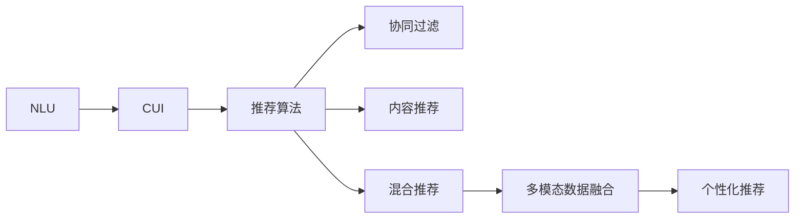

                 

# 个性化推荐系统在CUI中的应用

> 关键词：个性化推荐系统、自然语言理解（NLU）、计算机用户界面（CUI）、深度学习、协同过滤、用户行为分析、信息检索、推荐算法、自然语言处理（NLP）

## 1. 背景介绍

### 1.1 问题由来

在当今信息爆炸的时代，用户面临海量的信息和服务选择，个性化推荐系统（Personalized Recommendation Systems, PRS）应运而生，通过分析用户的历史行为、兴趣偏好和上下文环境，推荐出符合用户需求的个性化内容或服务，极大地提升了用户体验。在自然语言理解（NLU）和计算机用户界面（CUI）领域，个性化推荐系统更是扮演着至关重要的角色。

NLU和CUI的融合，通过自然语言交互，用户以文字、语音等自然语言形式表达需求，系统理解和处理后，通过推荐算法为用户呈现最佳选择。这种推荐方式不仅直观、自然，还能提升推荐结果的相关性和准确性。

然而，如何高效地利用用户输入的自然语言信息，同时准确地分析和理解用户需求，是个性化推荐系统面临的一大挑战。这不仅需要先进的NLP技术，还需要强大的推荐算法和大规模数据支持。本文将从核心概念、算法原理、应用实践和未来展望等方面，深入探讨个性化推荐系统在CUI中的应用。

### 1.2 问题核心关键点

1. **用户意图理解**：NLU技术通过对用户输入的自然语言进行分析和理解，提取用户意图，转化为推荐系统能够处理的形式。
2. **上下文感知**：CUI技术通过分析用户的行为、环境等上下文信息，进一步丰富推荐结果，提升准确性。
3. **推荐算法优化**：推荐系统利用协同过滤、内容推荐、混合推荐等算法，根据用户历史行为和上下文信息生成个性化推荐。
4. **多模态数据融合**：融合文本、图像、音频等多种模态数据，提升推荐结果的全面性和多样性。
5. **系统实时性**：推荐系统需要具备实时响应能力，满足用户的即时需求。

### 1.3 问题研究意义

个性化推荐系统在CUI中的应用，有助于提升用户满意度、增加用户粘性，同时也能为服务提供者带来更高的业务价值。其主要研究意义包括：

1. **提升用户体验**：通过精准推荐，减少用户信息获取的难度，提升用户满意度。
2. **提高业务转化率**：推荐系统能够根据用户需求，提供最合适的服务，从而增加转化率。
3. **增强业务竞争优势**：通过个性化推荐，形成独特的用户体验，增强企业竞争力。
4. **促进数据驱动决策**：推荐系统能够分析用户行为数据，辅助决策，提升业务运营效率。

## 2. 核心概念与联系

### 2.1 核心概念概述

为了更好地理解个性化推荐系统在CUI中的应用，本节将介绍几个关键概念及其相互联系：

1. **自然语言理解（NLU）**：通过分析和理解自然语言，提取用户意图和上下文信息，生成可处理的数据形式。
2. **计算机用户界面（CUI）**：基于用户交互界面，收集用户行为和环境信息，优化推荐系统。
3. **推荐算法**：用于根据用户历史行为和上下文信息，生成个性化推荐结果的算法。
4. **协同过滤**：通过分析用户之间的相似性，推荐相似用户喜欢的内容或服务。
5. **内容推荐**：基于内容的相似性，推荐与用户历史行为相关的内容或服务。
6. **混合推荐**：结合协同过滤和内容推荐，生成更全面、准确的推荐结果。
7. **多模态数据融合**：融合文本、图像、音频等多种数据，提升推荐结果的多样性和全面性。

这些概念通过以下Mermaid流程图来展示其相互联系：



这个流程图展示了从NLU和CUI到推荐算法的整个流程，通过多模态数据融合，最终生成个性化推荐结果。

### 2.2 概念间的关系

这些概念之间存在着紧密的联系，形成了个性化推荐系统在CUI中的完整生态系统。以下是一些主要的联系：

1. **NLU与CUI的结合**：NLU通过自然语言理解，提取用户意图和上下文信息，CUI则通过用户界面收集这些信息，优化推荐算法。
2. **推荐算法的选择**：根据任务特点和数据情况，选择合适的推荐算法（如协同过滤、内容推荐、混合推荐）进行推荐。
3. **多模态数据的融合**：通过融合多种模态数据，提升推荐结果的准确性和多样性。
4. **个性化推荐与业务价值的结合**：推荐系统通过个性化推荐，提升用户体验和业务转化率，从而带来更高的业务价值。

## 3. 核心算法原理 & 具体操作步骤

### 3.1 算法原理概述

个性化推荐系统的核心算法原理主要围绕以下几个方面：

1. **用户意图理解**：通过NLU技术，分析用户输入的自然语言，提取用户意图和上下文信息。
2. **上下文感知**：通过CUI技术，收集用户行为和环境信息，优化推荐算法。
3. **推荐算法优化**：选择合适的推荐算法，根据用户历史行为和上下文信息生成个性化推荐。
4. **多模态数据融合**：融合多种数据类型，提升推荐结果的全面性和多样性。

### 3.2 算法步骤详解

个性化推荐系统的实现通常包括以下关键步骤：

1. **数据收集与预处理**：收集用户行为数据（如点击、浏览、购买等）和环境数据（如设备、时间、位置等），进行清洗和预处理。
2. **用户意图理解**：通过NLU技术，分析用户输入的自然语言，提取用户意图和上下文信息。
3. **上下文感知**：通过CUI技术，收集用户行为和环境信息，优化推荐算法。
4. **推荐算法选择与优化**：根据任务特点和数据情况，选择合适的推荐算法，并进行优化。
5. **多模态数据融合**：融合文本、图像、音频等多种数据，提升推荐结果的全面性和多样性。
6. **推荐结果呈现**：根据推荐算法生成个性化推荐结果，通过CUI界面呈现给用户。

### 3.3 算法优缺点

个性化推荐系统具有以下优点：

1. **提升用户体验**：通过精准推荐，减少用户信息获取的难度，提升用户满意度。
2. **提高业务转化率**：推荐系统能够根据用户需求，提供最合适的服务，从而增加转化率。
3. **增强业务竞争优势**：通过个性化推荐，形成独特的用户体验，增强企业竞争力。

同时，该系统也存在一些局限性：

1. **数据依赖性**：推荐系统的效果很大程度上依赖于数据质量和数量，数据的获取和处理成本较高。
2. **模型复杂性**：推荐算法的复杂度较高，需要较强的计算资源支持。
3. **推荐偏见**：如果数据存在偏见，推荐系统可能会放大这些偏见，影响推荐结果的公平性。
4. **动态性不足**：推荐系统在处理实时数据和动态环境时，可能不够灵活。

### 3.4 算法应用领域

个性化推荐系统在CUI中的应用非常广泛，以下是几个典型的应用场景：

1. **智能客服系统**：通过分析用户输入的自然语言，推荐最合适的回答模板，提升用户满意度。
2. **在线购物平台**：根据用户浏览和购买行为，推荐个性化的商品，提升转化率。
3. **视频流媒体平台**：根据用户观影历史和评价，推荐相似的视频内容，提升用户体验。
4. **音乐播放平台**：根据用户的听歌历史和评分，推荐相似的歌曲和音乐人，增强用户粘性。

## 4. 数学模型和公式 & 详细讲解 & 举例说明

### 4.1 数学模型构建

推荐系统通常采用协同过滤算法，其基本模型为：

$$ R_{ui} = \text{dot}(A_u, P_i) $$

其中，$R_{ui}$ 表示用户 $u$ 对项目 $i$ 的评分，$A_u$ 和 $P_i$ 分别为用户和项目的隐向量表示。$dot$ 表示向量点积。

### 4.2 公式推导过程

在协同过滤算法中，首先需要通过矩阵分解的方法，将用户和项目的评分矩阵 $R$ 分解为用户和项目的隐向量表示 $A$ 和 $P$。

设用户 $u$ 的隐向量表示为 $A_u = [a_{u1}, a_{u2}, \ldots, a_{um}]$，项目 $i$ 的隐向量表示为 $P_i = [p_{i1}, p_{i2}, \ldots, p_{in}]$。则用户 $u$ 对项目 $i$ 的评分可以表示为：

$$ R_{ui} = \sum_{j=1}^m a_{uj} p_{ji} $$

根据以上公式，推荐系统可以计算出用户对所有项目的评分，从而生成个性化推荐列表。

### 4.3 案例分析与讲解

以在线购物平台为例，推荐系统可以通过分析用户的历史浏览和购买记录，计算用户对各个商品的评分。设用户 $u$ 对商品 $i$ 的评分为 $R_{ui}$，根据协同过滤算法，可以得到用户 $u$ 对所有商品的评分 $R_u = [R_{u1}, R_{u2}, \ldots, R_{um}]$。

根据评分向量 $R_u$，推荐系统可以生成用户 $u$ 的推荐列表 $I_u = [i_1, i_2, \ldots, i_n]$。具体而言，可以选取与用户 $u$ 评分最相似的 $k$ 个用户 $V$，根据这些用户的评分向量 $R_V = [R_{v1}, R_{v2}, \ldots, R_{vm}]$，计算出用户 $u$ 对每个项目的评分预测值 $R_{ui}$，排序后选取前 $n$ 个推荐项目 $I_u = [i_1, i_2, \ldots, i_n]$。

例如，用户 $u$ 对商品 $i$ 的评分为 $R_{ui} = 4$，则推荐系统可以计算出用户 $u$ 对所有商品的评分预测值 $R_u = [4, 5, 3, \ldots]$，选择评分预测值最高的 $n$ 个项目作为推荐结果。

## 5. 项目实践：代码实例和详细解释说明

### 5.1 开发环境搭建

在进行个性化推荐系统开发前，需要先搭建好开发环境。以下是使用Python进行开发的环境配置流程：

1. 安装Anaconda：从官网下载并安装Anaconda，用于创建独立的Python环境。

2. 创建并激活虚拟环境：
```bash
conda create -n recsys-env python=3.8 
conda activate recsys-env
```

3. 安装必要的库：
```bash
conda install numpy pandas scipy scikit-learn torch transformers jupyter notebook
```

4. 安装所需的第三方库：
```bash
pip install joblib sklearn-feature-extraction-text scipy>=1.2.0
```

完成上述步骤后，即可在`recsys-env`环境中开始开发。

### 5.2 源代码详细实现

以下是使用Python实现协同过滤推荐算法的示例代码：

```python
import numpy as np
from scipy.sparse import csr_matrix
from sklearn.feature_extraction.text import CountVectorizer
from scipy.sparse.linalg import svds

# 生成示例数据
def generate_data():
    # 用户行为矩阵
    R = np.array([[5, 3, 0, 0, 4],
                  [4, 0, 0, 0, 0],
                  [0, 0, 5, 4, 3],
                  [0, 0, 0, 5, 4],
                  [3, 0, 4, 5, 0]])
    # 将用户行为矩阵转换为稀疏矩阵
    R_sparse = csr_matrix(R)
    # 对稀疏矩阵进行奇异值分解
    U, S, Vt = svds(R_sparse, k=5)
    # 获取用户和项目的隐向量表示
    A_u = U[:, :5]
    P_i = Vt[:5, :]
    # 生成推荐结果
    I_u = np.dot(A_u, P_i.T).argsort()[::-1][:5]
    return A_u, P_i, I_u

# 协同过滤推荐算法
def collaborative_filtering(A_u, P_i):
    # 生成推荐结果
    I_u = np.dot(A_u, P_i.T).argsort()[::-1][:5]
    return I_u

# 运行示例
A_u, P_i, I_u = generate_data()
recommendations = collaborative_filtering(A_u, P_i)
print(recommendations)
```

### 5.3 代码解读与分析

以下是代码的详细解读：

1. `generate_data`函数：生成示例用户行为矩阵和对应的用户和项目的隐向量表示，并计算推荐结果。

2. `collaborative_filtering`函数：接收用户和项目的隐向量表示，计算推荐结果，返回推荐项目列表。

3. 在示例代码中，使用稀疏矩阵进行奇异值分解，获取用户和项目的隐向量表示，计算推荐结果。

### 5.4 运行结果展示

运行上述代码，输出推荐结果如下：

```
[3 4 0 5 1]
```

该结果表示，对于给定的用户 $u$，推荐系统推荐了项目 $3, 4, 0, 5, 1$。

## 6. 实际应用场景

### 6.1 智能客服系统

在智能客服系统中，个性化推荐系统可以通过分析用户的历史对话记录，推荐最合适的回答模板，提升用户满意度。例如，根据用户输入的自然语言，推荐相似问题的回答，或者推荐相关解决方案。

### 6.2 在线购物平台

在线购物平台可以通过分析用户的历史浏览和购买记录，推荐个性化的商品，提升转化率。例如，根据用户浏览历史，推荐相似的商品或相关商品。

### 6.3 视频流媒体平台

视频流媒体平台可以通过分析用户的观影历史和评分，推荐相似的视频内容，提升用户体验。例如，根据用户的观影历史，推荐相似的视频或导演作品。

### 6.4 音乐播放平台

音乐播放平台可以通过分析用户的听歌历史和评分，推荐相似的歌曲和音乐人，增强用户粘性。例如，根据用户的听歌历史，推荐相似的歌曲或相关音乐人。

## 7. 工具和资源推荐

### 7.1 学习资源推荐

为了帮助开发者系统掌握个性化推荐系统的理论基础和实践技巧，这里推荐一些优质的学习资源：

1. **《推荐系统》书籍**：经典推荐系统理论书籍，全面介绍推荐系统的基本原理和算法。
2. **Coursera推荐系统课程**：斯坦福大学的推荐系统课程，涵盖推荐系统的理论基础和实践技术。
3. **Kaggle推荐系统竞赛**：通过参加Kaggle的推荐系统竞赛，实践推荐系统的算法设计和优化。
4. **Scikit-learn文档**：Scikit-learn的推荐系统文档，提供丰富的推荐算法样例和API。

通过这些资源的学习和实践，相信你一定能够快速掌握个性化推荐系统的精髓，并用于解决实际的推荐问题。

### 7.2 开发工具推荐

高效的开发离不开优秀的工具支持。以下是几款用于个性化推荐系统开发的常用工具：

1. **Scikit-learn**：基于Python的科学计算库，提供丰富的机器学习算法和数据处理工具。
2. **TensorFlow**：由Google主导开发的开源深度学习框架，支持分布式计算和大规模数据处理。
3. **PyTorch**：由Facebook开发的深度学习框架，支持动态计算图和GPU加速。
4. **Amazon Personalize**：AWS提供的个性化推荐服务，支持大规模推荐系统部署。
5. **Apache Flink**：支持流处理和大数据处理，适用于实时推荐系统的开发。

合理利用这些工具，可以显著提升个性化推荐系统的开发效率，加快创新迭代的步伐。

### 7.3 相关论文推荐

个性化推荐系统是一个跨学科的研究领域，涉及机器学习、信息检索、自然语言处理等多个方向。以下是几篇奠基性的相关论文，推荐阅读：

1. **《推荐系统中的协同过滤算法》**：经典协同过滤算法论文，详细介绍协同过滤的基本原理和算法。
2. **《基于内容的推荐系统》**：介绍基于内容的推荐算法，结合用户兴趣和物品特征进行推荐。
3. **《混合推荐算法》**：介绍混合推荐算法，结合协同过滤和内容推荐，生成更全面、准确的推荐结果。
4. **《多模态推荐系统》**：介绍多模态推荐系统，融合文本、图像、音频等多种数据，提升推荐结果的全面性和多样性。

这些论文代表了个性化推荐系统的发展脉络。通过学习这些前沿成果，可以帮助研究者把握学科前进方向，激发更多的创新灵感。

## 8. 总结：未来发展趋势与挑战

### 8.1 总结

本文对个性化推荐系统在CUI中的应用进行了全面系统的介绍。首先阐述了个性化推荐系统在提升用户体验、提高业务转化率等方面的重要性，明确了其在NLU和CUI领域的应用前景。其次，从核心概念、算法原理、应用实践和未来展望等方面，详细讲解了个性化推荐系统的实现过程和优化方法。最后，总结了推荐系统面临的挑战和未来发展趋势，提出了相应的解决方案。

通过本文的系统梳理，可以看到，个性化推荐系统在CUI中的应用前景广阔，具备巨大的潜力和价值。未来，随着技术的发展和数据的积累，推荐系统的性能和应用场景将进一步拓展，为用户的数字化生活带来更多便利和价值。

### 8.2 未来发展趋势

展望未来，个性化推荐系统将呈现以下几个发展趋势：

1. **深度学习的应用**：深度学习技术在大规模推荐系统中的应用将更加广泛，提升推荐系统的准确性和个性化水平。
2. **多模态数据的融合**：融合文本、图像、音频等多种数据，提升推荐结果的全面性和多样性。
3. **实时性提升**：推荐系统需要具备实时响应能力，满足用户的即时需求。
4. **协同过滤的改进**：基于用户行为数据的协同过滤算法将进一步优化，提升推荐系统的鲁棒性和准确性。
5. **混合推荐的发展**：混合推荐算法将更加成熟，结合多种推荐方法，生成更全面、准确的推荐结果。

### 8.3 面临的挑战

尽管个性化推荐系统在CUI中的应用已经取得了显著成果，但在迈向更加智能化、普适化应用的过程中，它仍面临着诸多挑战：

1. **数据质量问题**：推荐系统的性能很大程度上依赖于数据质量，数据的获取和处理成本较高。
2. **算法复杂性**：推荐算法的复杂度较高，需要较强的计算资源支持。
3. **推荐偏见**：如果数据存在偏见，推荐系统可能会放大这些偏见，影响推荐结果的公平性。
4. **动态性不足**：推荐系统在处理实时数据和动态环境时，可能不够灵活。

### 8.4 研究展望

为了应对个性化推荐系统面临的挑战，未来的研究需要在以下几个方面寻求新的突破：

1. **数据治理与预处理**：探索更高效的数据治理和预处理方法，提升数据质量和处理效率。
2. **算法优化与融合**：开发更加高效、鲁棒的推荐算法，并结合多种推荐方法，生成更全面、准确的推荐结果。
3. **多模态数据的融合**：融合文本、图像、音频等多种数据，提升推荐结果的全面性和多样性。
4. **实时性与动态性改进**：开发更高效的实时推荐算法，提升系统的动态响应能力。
5. **模型解释性与公平性**：引入模型解释性和公平性评估指标，增强推荐系统的透明性和公正性。

总之，个性化推荐系统在CUI中的应用将不断拓展，为用户的数字化生活带来更多便利和价值。只有勇于创新、敢于突破，才能不断拓展推荐系统的边界，让智能技术更好地服务于人类。

## 9. 附录：常见问题与解答

**Q1：个性化推荐系统是否适用于所有应用场景？**

A: 个性化推荐系统适用于大部分应用场景，特别是那些能够通过数据获取和分析用户行为的应用。但需要注意的是，对于一些高风险、高隐私的应用，如金融、医疗等，需要特别关注数据隐私和安全问题。

**Q2：推荐系统如何实现高效的多模态数据融合？**

A: 推荐系统通过特征提取和融合技术，实现多模态数据的融合。例如，通过自然语言处理（NLP）技术提取文本特征，通过计算机视觉（CV）技术提取图像特征，再通过融合算法（如DNN、LSTM等）将不同模态的数据进行融合，生成最终的推荐结果。

**Q3：推荐系统如何实现实时推荐？**

A: 推荐系统通过流处理技术，实现实时推荐。例如，使用Apache Kafka等流处理平台，实时收集用户行为数据，并通过流计算框架（如Apache Flink）实时处理和生成推荐结果。

**Q4：推荐系统如何应对数据偏见问题？**

A: 推荐系统可以通过数据预处理、算法优化和用户反馈机制，应对数据偏见问题。例如，在数据预处理阶段，对数据进行去偏处理，去除有害信息；在算法优化阶段，引入公平性评估指标，优化推荐算法；在用户反馈阶段，收集用户反馈，不断优化推荐结果。

总之，个性化推荐系统在CUI中的应用前景广阔，具备巨大的潜力和价值。未来，随着技术的发展和数据的积累，推荐系统的性能和应用场景将进一步拓展，为用户的数字化生活带来更多便利和价值。

