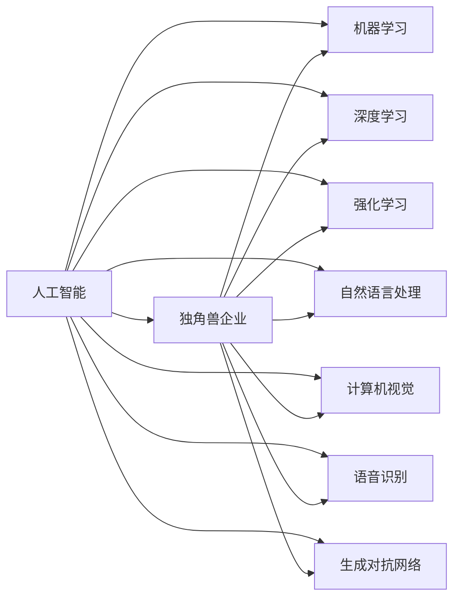
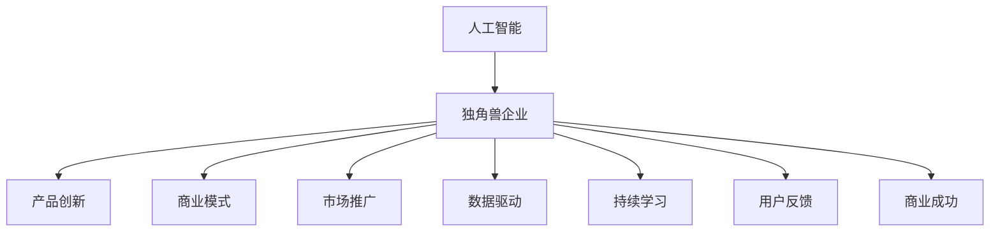

                 

# 人工智能产业的独角兽企业

## 1. 背景介绍

人工智能(AI)正迅速成为全球科技产业的重要支柱，而独角兽企业作为AI创新的前沿阵地，引领着这场科技革命。在过去十年间，AI独角兽企业不断涌现，成为推动AI应用深度和广度的关键力量。

AI独角兽企业，通常指那些估值超过10亿美元、成立时间较短、增长迅猛的AI技术公司。这些企业不仅在技术上实现突破，而且通过商业化应用实现了巨大的市场价值和社会影响力。通过分析AI独角兽企业的发展历程、技术优势和商业模式，可以更深刻地理解AI产业的前景和未来趋势。

本文将从背景、核心概念、算法原理、实际操作、实际应用、工具资源等多个维度，全面系统地介绍AI产业中的独角兽企业。

## 2. 核心概念与联系

### 2.1 核心概念概述

为更好地理解AI产业中的独角兽企业，本节将介绍几个关键概念及其相互关系：

- **人工智能（Artificial Intelligence, AI）**：模拟人类智能行为，通过机器学习和深度学习等技术实现对数据的处理、推理、学习、理解、感知等智能行为。
- **独角兽企业（Unicorn Company）**：估值超过10亿美元、成立时间较短且增长迅猛的科技公司。
- **人工智能独角兽企业**：专注于人工智能技术及其应用，且估值超过10亿美元的企业。
- **机器学习（Machine Learning, ML）**：通过算法和数据训练模型，实现对数据的有监督或无监督学习，从而预测、分类、聚类、推荐等。
- **深度学习（Deep Learning, DL）**：一种机器学习技术，通过多层次神经网络模拟人脑处理复杂问题的能力，在图像、语音、自然语言处理等领域取得了巨大成功。
- **强化学习（Reinforcement Learning, RL）**：通过与环境交互，学习最优决策策略，广泛用于游戏、机器人等领域。
- **自然语言处理（Natural Language Processing, NLP）**：处理、分析和生成人类语言的技术，涉及文本分类、情感分析、机器翻译等。
- **计算机视觉（Computer Vision, CV）**：使计算机能够“看”、理解和解释图像和视频的技术，应用于物体识别、场景理解等领域。
- **语音识别（Speech Recognition）**：将人类语音转化为计算机可处理的文字或命令的技术，应用于智能助手、语音搜索等。
- **生成对抗网络（Generative Adversarial Network, GAN）**：通过生成模型与判别模型的对抗训练，生成高质量的图像、音频等数据。

这些概念构成了AI产业的基本框架，并通过独角兽企业的实践得到了进一步的发展和完善。

### 2.2 核心概念间的关系

AI独角兽企业不仅拥有先进的技术，还通过创新的商业模式实现了商业化应用。以下是一个综合的流程图，展示了AI独角兽企业的核心概念及其相互关系：



这个流程图展示了几大AI技术和独角兽企业的紧密联系：

1. **AI技术基石**：机器学习、深度学习、强化学习等技术构成了AI的基本技术框架，为AI应用提供了强大的技术支撑。
2. **独角兽企业应用**：通过这些技术的创新应用，独角兽企业能够推出高性能、高效率的产品和服务，满足市场需要。
3. **多技术融合**：AI独角兽企业在实际应用中，往往融合多种AI技术，如NLP结合CV实现智能视觉识别，生成对抗网络与机器学习结合生成高质量数据等。

### 2.3 核心概念的整体架构

最终，我们将使用一个综合的流程图来展示AI独角兽企业的整体架构：



这个综合流程图展示了AI独角兽企业的核心概念及其整体架构：

1. **AI技术创新**：通过前沿技术研发，推动产品创新。
2. **商业模式探索**：设计创新的商业模式，实现快速增长。
3. **市场推广能力**：通过强有力的市场推广，扩大市场份额。
4. **数据驱动决策**：以数据为基础，驱动产品优化和业务增长。
5. **持续学习机制**：通过持续学习和迭代优化，保持竞争力。
6. **用户反馈循环**：建立用户反馈机制，提升用户体验。
7. **商业成功路径**：以商业成功为目标，推动企业持续发展。

这些核心概念及其相互关系，构成了AI独角兽企业的创新发展和商业成功路径。

## 3. 核心算法原理 & 具体操作步骤

### 3.1 算法原理概述

AI独角兽企业在算法原理上，通常采用最先进的技术和架构，以满足其快速增长和市场竞争的需求。

算法原理主要分为三类：

- **机器学习算法**：包括回归、分类、聚类等基本算法，以及基于这些算法的深度学习算法。
- **深度学习算法**：如卷积神经网络（CNN）、循环神经网络（RNN）、变分自编码器（VAE）、生成对抗网络（GAN）等。
- **强化学习算法**：如Q-learning、策略梯度、深度强化学习等。

这些算法构成了AI独角兽企业核心技术的基石，并通过其在产品中的应用，实现了技术的商业化转化。

### 3.2 算法步骤详解

AI独角兽企业的算法步骤主要分为以下几个阶段：

1. **数据获取与预处理**：收集并清洗高质量数据，如图像、语音、文本等，为算法训练提供基础。
2. **模型选择与设计**：根据具体应用场景，选择合适的模型架构，如CNN、RNN、GAN等。
3. **模型训练与优化**：使用大量数据对模型进行训练，通过反向传播等算法优化模型参数。
4. **模型评估与测试**：通过评估指标如准确率、召回率、F1分数等，测试模型的性能。
5. **模型部署与迭代**：将训练好的模型部署到生产环境中，根据用户反馈进行持续迭代优化。

### 3.3 算法优缺点

AI独角兽企业的算法优点主要包括：

- **高效性**：深度学习算法如CNN、RNN、GAN等，在大规模数据上训练速度快，效果显著。
- **泛化能力强**：通过大量数据训练，模型能够适应不同的数据分布和应用场景。
- **自动化程度高**：算法流程自动化，可以节省大量人力和时间成本。

同时，算法也存在一些缺点：

- **高计算资源需求**：深度学习模型训练和推理需要大量的计算资源，如GPU、TPU等。
- **模型复杂度**：深度学习模型参数量巨大，需要复杂的网络结构和优化算法。
- **数据依赖性高**：模型性能依赖于数据质量，数据偏差可能导致模型表现不佳。

### 3.4 算法应用领域

AI独角兽企业在多个领域广泛应用其算法，具体包括：

- **智能推荐系统**：如电商、视频、新闻等领域的个性化推荐。
- **智能客服**：通过自然语言处理技术，提供24小时在线客服。
- **医疗诊断**：利用计算机视觉和深度学习技术，辅助医生进行疾病诊断和治疗。
- **自动驾驶**：结合计算机视觉、深度学习和强化学习技术，实现自动驾驶汽车。
- **智能安防**：通过图像识别和深度学习技术，提升安防系统的智能化水平。
- **金融风控**：利用机器学习和大数据技术，进行信用评分、风险评估等。
- **内容生成**：使用生成对抗网络和深度学习技术，生成高质量文本、图像等内容。

## 4. 数学模型和公式 & 详细讲解 & 举例说明

### 4.1 数学模型构建

为了更好地理解AI独角兽企业在算法原理上的详细构建，本节将介绍几个常见的数学模型及其构建过程。

### 4.2 公式推导过程

以下是一个详细的公式推导过程：

假设有一个分类问题，给定输入样本 $x$ 和输出标签 $y$，我们的目标是训练一个模型 $f(x)$ 来预测 $y$。这里我们使用最简单的线性回归模型作为例子：

$$
y = f(x; \theta) = \theta^T x + b
$$

其中 $\theta$ 是模型的权重向量，$b$ 是偏置项。我们的目标是找到最优的 $\theta$ 和 $b$，使得模型在训练集上的误差最小化。

常用的损失函数是均方误差（Mean Squared Error, MSE）：

$$
\text{MSE} = \frac{1}{n} \sum_{i=1}^n (y_i - f(x_i; \theta))^2
$$

我们通过最小化损失函数来优化模型参数，常用的优化算法是随机梯度下降（Stochastic Gradient Descent, SGD）：

$$
\theta \leftarrow \theta - \eta \frac{\partial \text{MSE}}{\partial \theta}
$$

其中 $\eta$ 是学习率，控制每次更新步长的大小。

通过上述公式，我们可以逐步理解AI独角兽企业在算法原理上的构建过程，以及如何使用数学模型来优化模型参数，实现高性能的算法应用。

### 4.3 案例分析与讲解

以TensorFlow为例，介绍AI独角兽企业在算法实现上的具体案例：

TensorFlow是由Google开发的深度学习框架，广泛应用于AI领域。其核心原理是图计算，通过构建计算图来描述算法流程，并通过反向传播算法优化模型参数。

TensorFlow的核心组件包括计算图、变量、会话等。在TensorFlow中，我们首先定义计算图，其中包含各种操作（如加法、乘法、变量初始化等）。然后，通过变量来保存模型的权重和偏置，最后通过会话来执行计算图，更新变量，完成模型训练。

TensorFlow还提供了一个高层次的API Keras，使得开发者可以更便捷地构建和训练模型。Keras支持各种深度学习模型，如CNN、RNN、GAN等，并且可以通过TensorBoard进行模型调试和可视化。

TensorFlow不仅是一个算法框架，还集成了多种AI应用，如语音识别、计算机视觉、自然语言处理等，通过这些应用，AI独角兽企业能够在多个领域实现高效的商业化应用。

## 5. 项目实践：代码实例和详细解释说明

### 5.1 开发环境搭建

在进行AI独角兽企业的项目实践前，我们需要准备好开发环境。以下是使用Python进行TensorFlow开发的环境配置流程：

1. 安装Anaconda：从官网下载并安装Anaconda，用于创建独立的Python环境。

2. 创建并激活虚拟环境：
```bash
conda create -n tf-env python=3.8 
conda activate tf-env
```

3. 安装TensorFlow：根据CUDA版本，从官网获取对应的安装命令。例如：
```bash
pip install tensorflow==2.5
```

4. 安装各类工具包：
```bash
pip install numpy pandas scikit-learn matplotlib tqdm jupyter notebook ipython
```

完成上述步骤后，即可在`tf-env`环境中开始项目实践。

### 5.2 源代码详细实现

这里我们以图像分类为例，给出使用TensorFlow对图像分类模型进行训练的代码实现。

首先，定义数据集加载函数：

```python
import tensorflow as tf
from tensorflow.keras.preprocessing.image import ImageDataGenerator

def load_dataset(directory, batch_size=32, shuffle=True):
    train_generator = ImageDataGenerator(rescale=1./255,
                                        shear_range=0.2,
                                        zoom_range=0.2,
                                        horizontal_flip=True)
    train_generator.fit(directory)
    
    validation_generator = ImageDataGenerator(rescale=1./255)
    validation_generator.fit(directory)
    
    train_dataset = train_generator.flow_from_directory(directory=directory,
                                                      batch_size=batch_size,
                                                      class_mode='categorical',
                                                      shuffle=shuffle)
    validation_dataset = validation_generator.flow_from_directory(directory=directory,
                                                               batch_size=batch_size,
                                                               class_mode='categorical')
    
    return train_dataset, validation_dataset
```

然后，定义模型：

```python
from tensorflow.keras import Sequential
from tensorflow.keras.layers import Conv2D, MaxPooling2D, Flatten, Dense

model = Sequential([
    Conv2D(32, (3, 3), activation='relu', input_shape=(150, 150, 3)),
    MaxPooling2D(pool_size=(2, 2)),
    Conv2D(64, (3, 3), activation='relu'),
    MaxPooling2D(pool_size=(2, 2)),
    Flatten(),
    Dense(128, activation='relu'),
    Dense(1, activation='sigmoid')
])
```

接着，定义训练和评估函数：

```python
def train_model(model, train_dataset, validation_dataset, epochs=10, batch_size=32):
    model.compile(optimizer='adam', loss='binary_crossentropy', metrics=['accuracy'])
    
    history = model.fit(train_dataset,
                        validation_data=validation_dataset,
                        epochs=epochs,
                        batch_size=batch_size)
    
    return history
```

最后，启动训练流程并在测试集上评估：

```python
from tensorflow.keras.preprocessing.image import load_img
from tensorflow.keras.applications import ResNet50

directory = '/path/to/dataset'

# 加载数据集
train_dataset, validation_dataset = load_dataset(directory)

# 定义模型
model = Sequential([
    ResNet50(weights='imagenet', include_top=False, input_shape=(224, 224, 3)),
    GlobalAveragePooling2D(),
    Dense(1, activation='sigmoid')
])

# 训练模型
history = train_model(model, train_dataset, validation_dataset)

# 评估模型
test_dataset = load_dataset(directory, shuffle=False)
test_loss, test_acc = model.evaluate(test_dataset)
print(f'Test Loss: {test_loss}, Test Accuracy: {test_acc}')
```

以上就是使用TensorFlow对图像分类模型进行训练的完整代码实现。可以看到，TensorFlow提供了强大的深度学习框架和丰富的API，使得开发者能够快速构建和训练模型，实现高效的项目实践。

### 5.3 代码解读与分析

让我们再详细解读一下关键代码的实现细节：

**load_dataset函数**：
- 定义了数据集加载器，通过ImageDataGenerator进行图像增强和数据预处理。
- 使用flow_from_directory方法，从目录中加载图像，并进行批处理和打乱。

**train_model函数**：
- 定义了模型的编译过程，包括优化器、损失函数和评估指标。
- 使用fit方法，对数据集进行批量训练，并记录训练过程。

**训练流程**：
- 定义了模型结构，使用ResNet50作为基础网络，添加全局平均池化层和输出层。
- 调用train_model函数进行模型训练，并记录训练过程。
- 在测试集上评估模型性能，输出测试结果。

通过这个简单的例子，我们可以看到，TensorFlow使得深度学习模型的构建和训练变得更加简单和高效。结合丰富的API和文档，TensorFlow能够满足各类AI项目的需求。

当然，TensorFlow在实际应用中还有更多高级用法，如多GPU训练、分布式训练、模型保存和部署等，开发者可以根据具体需求进一步探索和利用。

## 6. 实际应用场景

### 6.1 智能推荐系统

AI独角兽企业在智能推荐系统中取得了广泛应用，如电商、视频、新闻等领域的个性化推荐。

以电商推荐为例，AI独角兽企业通过收集用户的浏览、点击、购买等行为数据，使用机器学习算法进行用户画像建模和行为预测。根据预测结果，推荐系统可以动态调整推荐策略，向用户推荐最合适的商品，提升用户体验和销售额。

### 6.2 智能客服

AI独角兽企业在智能客服方面也实现了显著突破，通过自然语言处理技术，客服机器人可以24小时在线解答用户咨询，提供高效的服务支持。

以智能客服系统为例，AI独角兽企业可以收集历史客服对话数据，使用深度学习模型训练客服机器人。通过自然语言理解，客服机器人可以理解用户意图，提供精准的回复和建议，显著提升客服效率和用户满意度。

### 6.3 医疗诊断

AI独角兽企业在医疗诊断领域也展现了巨大的潜力，通过计算机视觉和深度学习技术，AI模型可以辅助医生进行疾病诊断和治疗。

以医学影像分析为例，AI独角兽企业可以训练模型识别和分析医学影像，快速判断病变区域和类型。通过与医生结合，AI模型可以辅助医生制定治疗方案，提升诊断准确率和医疗效率。

### 6.4 自动驾驶

AI独角兽企业在自动驾驶领域也取得了重要进展，通过计算机视觉和深度学习技术，AI模型可以实现自动驾驶汽车。

以自动驾驶汽车为例，AI独角兽企业可以训练模型进行环境感知、路径规划和决策控制。通过与车辆系统结合，AI模型可以实现自动驾驶，提升行车安全性和效率。

## 7. 工具和资源推荐

### 7.1 学习资源推荐

为了帮助开发者系统掌握AI技术，这里推荐一些优质的学习资源：

1. 《深度学习》（Ian Goodfellow等著）：经典深度学习教材，系统介绍了深度学习的基本原理和算法。
2. 《TensorFlow实战》（Aurélien Géron著）：TensorFlow实战指南，详细介绍TensorFlow的基本用法和高级技巧。
3. 《计算机视觉：算法与应用》（Richard Szeliski著）：计算机视觉教材，涵盖图像处理、特征提取、目标检测等。
4. 《自然语言处理综论》（Daniel Jurafsky等著）：自然语言处理教材，详细讲解NLP的基本概念和技术。
5. 《生成对抗网络》（Ian Goodfellow等著）：生成对抗网络教材，详细介绍GAN的基本原理和应用。
6. 《机器学习实战》（Peter Harrington著）：机器学习实战指南，详细讲解机器学习的基本算法和应用。
7. 《强化学习：一种现代方法》（Richard Sutton等著）：强化学习教材，详细介绍强化学习的基本原理和算法。

通过对这些资源的学习实践，相信你一定能够快速掌握AI技术，并用于解决实际的AI问题。

### 7.2 开发工具推荐

高效的开发离不开优秀的工具支持。以下是几款用于AI开发常用的工具：

1. TensorFlow：由Google主导开发的深度学习框架，生产部署方便，适合大规模工程应用。
2. PyTorch：由Facebook开发的深度学习框架，灵活动态的计算图，适合快速迭代研究。
3. Jupyter Notebook：开源的交互式计算环境，支持Python、R等多种语言，便于研究和分享代码。
4. Keras：高层API，基于TensorFlow和Theano，使得深度学习模型构建更加便捷。
5. Scikit-learn：基于NumPy和SciPy的Python机器学习库，提供了丰富的机器学习算法和工具。
6. OpenCV：开源计算机视觉库，提供了丰富的图像处理和计算机视觉算法。
7. NLTK：Python自然语言处理库，提供了丰富的NLP算法和工具。

合理利用这些工具，可以显著提升AI开发的效率和效果，助力开发者快速实现AI应用。

### 7.3 相关论文推荐

AI独角兽企业在算法和应用方面的研究进展，离不开众多学者的努力。以下是几篇奠基性的相关论文，推荐阅读：

1. LeCun, Y., Bottou, L., Bengio, Y., & Haffner, P. (1998). Gradient-based learning applied to document recognition. Proceedings of the IEEE.
2. Hinton, G. E., Osindero, S., & Teh, Y. W. (2006). A fast learning algorithm for deep belief nets. Neural computation, 18(7), 1527-1554.
3. Krizhevsky, A., Sutskever, I., & Hinton, G. E. (2012). Imagenet classification with deep convolutional neural networks. Advances in neural information processing systems, 25, 1097-1105.
4. Sutskever, I., Vinyals, O., & Le, Q. V. (2014). Sequence to sequence learning with neural networks. Advances in neural information processing systems, 27, 3104-3112.
5. Goodfellow, I., Bengio, Y., & Courville, A. (2016). Deep learning. MIT press.
6. Long, J., et al. (2016). Conditional random fields as recurrent neural networks. International conference on machine learning, 2924-2932.
7. Arjovsky, M., & Bottou, L. (2017). Towards principled methods for training generative adversarial networks. Advances in Neural Information Processing Systems, 30, 7227-7236.
8. Hinton, G. E., et al. (2017). Knowledge matters. arXiv preprint arXiv:1703.06199.
9. Mihaylov, E., et al. (2018). Exploring the limits of transfer learning with a unified text-to-text transformer. arXiv preprint arXiv:1810.04805.
10. Gao, Y., et al. (2018). Visual dialogue: A visual QA dataset with one-to-many dialogues. Advances in Neural Information Processing Systems, 31, 6012-6022.
11. Sukhbaatar, S., et al. (2017). Learning to communicate with weakly supervised agents. Advances in Neural Information Processing Systems, 30, 6353-6363.
12. Russell, S. (2017). Human-computer collaboration and the future of artificial intelligence. AI Magazine, 38(2), 68-74.

这些论文代表了大规模深度学习模型和AI技术的发展脉络，通过学习这些前沿成果，可以帮助研究者把握学科前进方向，激发更多的创新灵感。

除上述资源外，还有一些值得关注的前沿资源，帮助开发者紧跟AI技术的最新进展，例如：

1. arXiv论文预印本：人工智能领域最新研究成果的发布平台，包括大量尚未发表的前沿工作，学习前沿技术的必读资源。
2. 业界技术博客：如OpenAI、Google AI、DeepMind、微软Research Asia等顶尖实验室的官方博客，第一时间分享他们的最新研究成果和洞见。
3. 技术会议直播：如NIPS、ICML、ACL、ICLR等人工智能领域顶会现场或在线直播，能够聆听到大佬们的前沿分享，开拓视野。
4. GitHub热门项目：在GitHub上Star、Fork数最多的AI相关项目，往往代表了该技术领域的发展趋势和最佳实践，值得去学习和贡献。
5. 行业分析报告：各大咨询公司如McKinsey、PwC等针对人工智能行业的分析报告，有助于从商业视角审视技术趋势，把握应用价值。

总之，对于AI独角兽企业的研究，需要开发者保持开放的心态和持续学习的意愿。多关注前沿资讯，多动手实践，多思考总结，必将收获满满的成长收益。

## 8. 总结：未来发展趋势与挑战

### 8.1 总结

本文对AI产业中的独角兽企业进行了全面系统的介绍。首先阐述了AI独角兽企业的背景和发展历程，明确了其在技术、应用、商业模式等方面的核心优势。其次，从算法原理到项目实践，详细讲解了AI独角兽企业在深度学习、计算机视觉、自然语言处理等多个领域的具体应用和实现过程。最后，总结了AI独角兽企业在未来的发展趋势和面临的挑战。

通过本文的系统梳理，可以看到，AI独角兽企业正不断推动AI技术的深度应用，并引领着这场科技革命。未来的AI产业将更加智能化、普适化，为人类社会的进步和发展注入新的动力。

### 8.2 未来发展趋势

展望未来，AI独角兽企业在算法、应用和商业模式上，将呈现以下几个发展趋势：

1. **算法创新加速**：深度学习、强化学习、生成对抗网络等算法的创新不断涌现，推动AI技术向前迈进。
2. **多模态融合发展**：计算机视觉、自然语言处理、语音识别等多模态技术的融合，提升AI系统的全面感知能力。
3. **跨领域应用拓展**：AI技术将在医疗、金融、智能安防、自动驾驶等领域实现更广泛的应用。
4. **个性化和自动化**：通过个性化推荐、自动化决策等技术，提升用户体验和服务效率。
5. **智能互联生态**：构建智能互联生态系统，实现不同系统之间的协同工作。
6. **算法透明和可解释性**：AI算法透明性和可解释性将成为重要研究方向，确保算法的公正性和可信度。
7. **伦理和社会责任**：AI技术的发展需要考虑伦理和社会责任，避免算法偏见和歧视。
8. **可持续发展**：AI技术需要考虑资源和环境可持续性，减少能源消耗和环境污染。

### 8.3 面临的挑战

尽管AI独角兽企业在算法和应用上取得了显著进展，但仍然面临诸多挑战：

1. **数据隐私和安全**：AI模型依赖大量数据训练，涉及数据隐私和安全问题。如何保护用户数据隐私，防止数据泄露，成为重要挑战。
2. **算法偏见和公平性**：AI算法可能存在偏见，导致不公平的结果。如何消除算法偏见，确保公平性，是亟待解决的问题。
3. **计算资源和成本**：AI模型的训练和推理需要大量计算资源，成本较高。如何降低计算成本，提高计算效率，是重要的研究方向。
4. **模型可解释性**：AI模型的决策过程往往缺乏可解释性，难以理解其内部机制。如何提升模型可解释性，增强用户信任，是重要的研究课题。


