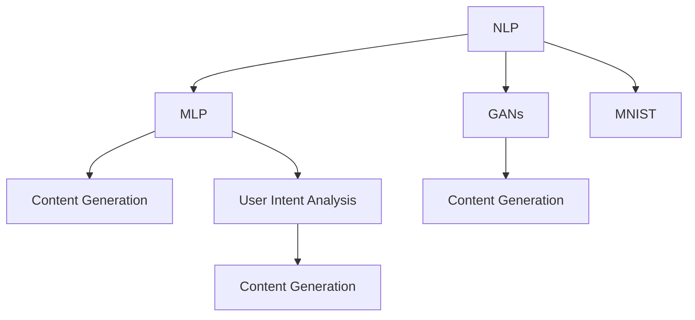
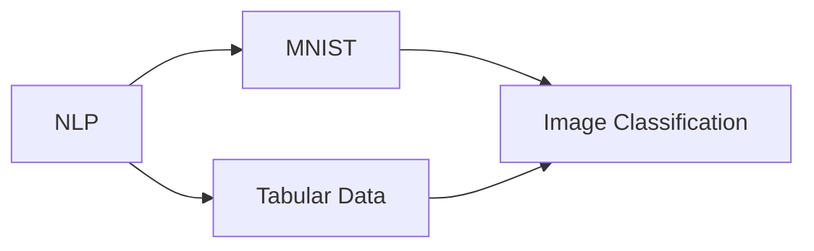
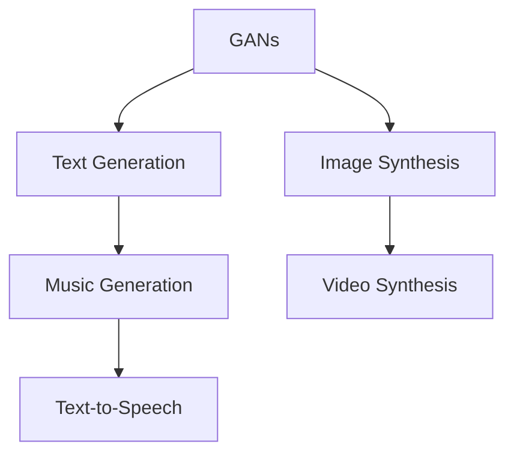
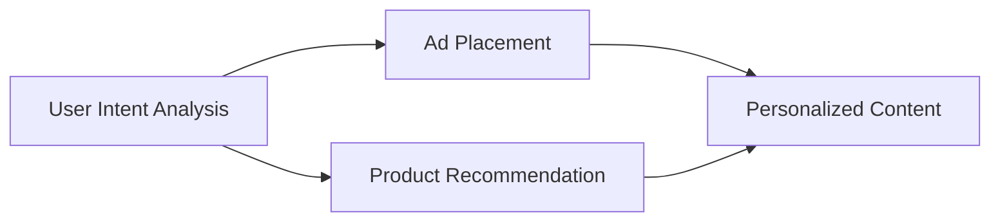
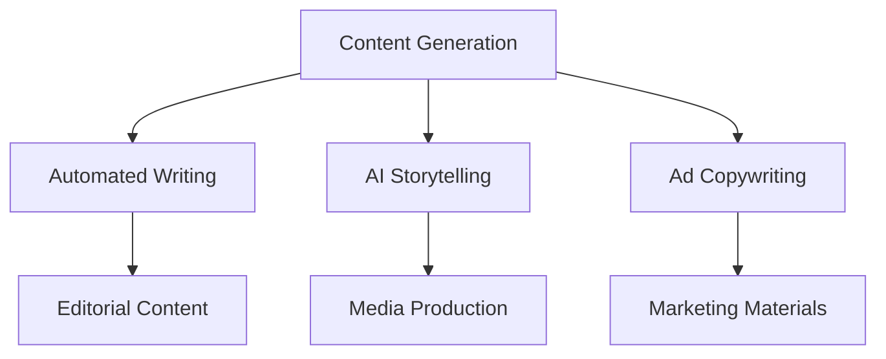
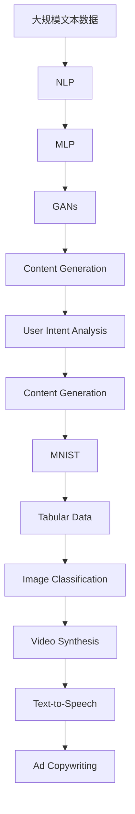

                 

# 人工智能代理在内容创作中的工作流程

> 关键词：人工智能代理, 内容创作, 工作流程, 自然语言处理(NLP), 机器学习, 生成式对抗网络(GANs), 用户意图分析, 内容生成

## 1. 背景介绍

### 1.1 问题由来
随着互联网技术的发展，内容创作领域迎来了革命性的变化。传统的内容生产模式逐渐被高度自动化的内容生成技术所替代。人工智能代理（AI Agent）在这一变革中扮演了重要角色，它们能够自动生成高质量的内容，包括新闻、文章、广告、社交媒体帖子和各种创意作品，极大地提升了内容创作的效率和质量。

人工智能代理通常基于自然语言处理(NLP)和机器学习技术，通过训练模型来理解人类语言，并据此生成新的文本内容。它们在内容创作中的应用，为传统媒体、广告公司、营销部门和数字内容平台等提供了强大的工具，帮助他们快速响应市场需求，创造更有吸引力的内容。

### 1.2 问题核心关键点
人工智能代理的核心关键点包括：
- **自然语言处理(NLP)**：理解和处理人类语言的技术，是内容生成的基础。
- **机器学习**：通过训练模型，使其能够从数据中学习并生成新的内容。
- **生成式对抗网络(GANs)**：一种能够生成高质量样本的技术，在内容生成中广泛应用。
- **用户意图分析**：分析用户输入的关键词或短语，确定其需求和期望。
- **内容生成**：根据用户意图，生成满足用户需求的内容。

这些技术协同工作，使人工智能代理能够自动化地生成高质量、个性化的内容。本文将详细探讨这些关键技术的工作原理，并讨论如何在实际应用中优化其性能。

### 1.3 问题研究意义
研究人工智能代理在内容创作中的应用，对于提升内容生产的效率和质量，推动媒体和广告行业的数字化转型，具有重要意义：
- **降低成本**：自动化内容生成可以大幅度减少人力成本和制作周期，使内容创作更高效。
- **提升质量**：通过优化算法和模型，生成内容的质量和一致性得以提升，满足用户更高要求。
- **个性化推荐**：基于用户数据分析，生成个性化推荐内容，增强用户体验。
- **实时响应**：能够快速响应市场变化，实时更新内容，保持市场竞争力。
- **创新表达**：支持创意表达和内容创新，促进文化艺术和商业的融合。

本文将从核心概念、算法原理、具体实现、应用场景等多个角度，深入探讨人工智能代理在内容创作中的应用，为相关领域的研究和实践提供指导。

## 2. 核心概念与联系

### 2.1 核心概念概述

为更好地理解人工智能代理在内容创作中的应用，本节将介绍几个关键概念：

- **自然语言处理(NLP)**：处理和分析人类语言的技术，包括文本分类、情感分析、机器翻译等任务。
- **机器学习**：通过数据训练模型，使模型能够预测或生成新的数据。
- **生成式对抗网络(GANs)**：一种生成模型，通过训练生成器网络生成逼真样本，与判别器网络进行对抗训练。
- **用户意图分析**：分析用户输入的文本，理解其需求和意图。
- **内容生成**：根据用户意图，自动生成高质量、个性化的内容。

这些概念之间的逻辑关系可以通过以下Mermaid流程图来展示：



这个流程图展示了大规模语言模型的工作流程：
- NLP技术处理输入文本，进行文本分类、情感分析等。
- MLP（多层感知器）模型作为中间环节，进行特征提取和表示学习。
- GANs生成逼真的文本样本。
- 用户意图分析确定用户需求。
- 内容生成最终生成满足用户需求的内容。

### 2.2 概念间的关系

这些核心概念之间存在着紧密的联系，形成了内容生成系统的完整生态系统。下面我们通过几个Mermaid流程图来展示这些概念之间的关系。

#### 2.2.1 NLP和机器学习的关系



这个流程图展示了NLP和机器学习之间的联系：
- NLP处理文本数据。
- 机器学习处理图像数据。
- 两者可以通过模型融合，共同处理更多类型的数据。

#### 2.2.2 GANs在内容生成中的应用



这个流程图展示了GANs在内容生成中的应用：
- GANs生成逼真的图像和视频。
- 文本生成和音乐生成都可以使用GANs技术。
- GANs可以与其他生成技术结合，提升内容的丰富度。

#### 2.2.3 用户意图分析在内容生成中的作用



这个流程图展示了用户意图分析在内容生成中的作用：
- 用户意图分析确定用户需求。
- 广告投放和产品推荐都可以基于用户意图分析。
- 用户意图分析可以提高内容的个性化程度。

#### 2.2.4 内容生成在实际应用中的体现



这个流程图展示了内容生成在实际应用中的体现：
- 自动写作和AI故事讲述都是内容生成的重要应用。
- 广告文案和营销材料可以通过内容生成技术自动化生成。
- 编辑内容和媒体制作也可以使用内容生成技术。

### 2.3 核心概念的整体架构

最后，我们用一个综合的流程图来展示这些核心概念在大规模语言模型微调过程中的整体架构：



这个综合流程图展示了从数据输入到内容生成的完整过程：
- 大规模文本数据经过NLP处理。
- 特征提取和表示学习通过MLP实现。
- GANs生成逼真样本。
- 内容生成最终生成满足用户需求的内容。
- 用户意图分析确定用户需求。
- 广告文案和营销材料可以通过内容生成技术自动化生成。

通过这些流程图，我们可以更清晰地理解人工智能代理在内容创作中的应用流程，为后续深入讨论具体的技术实现奠定基础。

## 3. 核心算法原理 & 具体操作步骤
### 3.1 算法原理概述

人工智能代理在内容创作中的应用，主要基于以下几个核心算法：

- **自然语言处理(NLP)**：用于理解和处理人类语言，包括文本分类、情感分析、机器翻译等任务。
- **机器学习**：通过训练模型，使模型能够预测或生成新的数据。
- **生成式对抗网络(GANs)**：一种生成模型，通过训练生成器网络生成逼真样本，与判别器网络进行对抗训练。
- **用户意图分析**：分析用户输入的文本，理解其需求和意图。
- **内容生成**：根据用户意图，生成高质量、个性化的内容。

这些算法通过协同工作，实现了人工智能代理在内容创作中的应用。下面将详细介绍每个算法的原理。

### 3.2 算法步骤详解

#### 3.2.1 自然语言处理(NLP)

自然语言处理(NLP)技术用于理解和处理人类语言，是内容生成的基础。常见的NLP任务包括文本分类、情感分析、机器翻译等。以文本分类为例，其基本步骤包括：

1. **文本预处理**：将文本转化为模型可以处理的形式，如分词、去除停用词、词性标注等。
2. **特征提取**：将预处理后的文本转化为数值向量，常用的方法包括词袋模型、TF-IDF、Word2Vec等。
3. **模型训练**：使用已标注的数据训练分类模型，常用的模型包括朴素贝叶斯、逻辑回归、支持向量机等。
4. **预测**：将新的文本输入模型，预测其类别。

#### 3.2.2 机器学习

机器学习技术通过训练模型，使其能够从数据中学习并生成新的数据。以文本生成为例，其基本步骤包括：

1. **数据预处理**：将文本转化为模型可以处理的形式，如分词、去除停用词、词性标注等。
2. **特征提取**：将预处理后的文本转化为数值向量，常用的方法包括词袋模型、TF-IDF、Word2Vec等。
3. **模型训练**：使用已标注的数据训练生成模型，常用的模型包括RNN、LSTM、GRU等。
4. **预测**：将新的文本输入模型，生成新的文本内容。

#### 3.2.3 生成式对抗网络(GANs)

生成式对抗网络(GANs)是一种生成模型，通过训练生成器网络生成逼真样本，与判别器网络进行对抗训练。以文本生成为例，其基本步骤包括：

1. **数据准备**：准备已标注的数据集。
2. **模型构建**：构建生成器和判别器网络，常用的模型包括LSTM、GRU等。
3. **训练过程**：通过对抗训练，使生成器生成逼真样本，判别器判别真假样本。
4. **生成样本**：使用训练好的生成器生成新的文本内容。

#### 3.2.4 用户意图分析

用户意图分析用于分析用户输入的文本，理解其需求和意图。以情感分析为例，其基本步骤包括：

1. **情感标注**：对文本进行情感标注，常用的方法包括LBP、SVM等。
2. **模型训练**：使用已标注的数据训练情感分析模型，常用的模型包括RNN、LSTM、BERT等。
3. **预测**：将新的文本输入模型，预测其情感。

#### 3.2.5 内容生成

内容生成根据用户意图，生成高质量、个性化的内容。以文本生成为例，其基本步骤包括：

1. **用户输入**：用户输入关键词或短语。
2. **意图分析**：分析用户输入，确定需求和意图。
3. **生成文本**：使用训练好的模型生成满足用户需求的内容。

### 3.3 算法优缺点

人工智能代理在内容创作中的应用，具有以下优点：

- **高效自动化**：能够快速生成高质量的内容，提升内容创作的效率。
- **个性化定制**：根据用户需求，生成个性化内容，满足用户期望。
- **广泛适用**：适用于各种类型的文本内容，包括新闻、文章、广告、社交媒体帖子和创意作品等。

同时，这些算法也存在一些缺点：

- **数据依赖**：需要大量的标注数据进行训练，数据获取成本较高。
- **模型复杂**：模型复杂度较高，训练和推理过程需要大量计算资源。
- **可解释性不足**：生成内容的逻辑和推理过程不透明，难以解释。
- **生成质量不稳定**：生成的内容质量受到模型训练数据和训练方法的影响。

尽管存在这些缺点，人工智能代理在内容创作中的应用仍然具有巨大的潜力和广泛的应用前景。

### 3.4 算法应用领域

人工智能代理在内容创作中的应用，已经涵盖了多种领域，包括但不限于：

- **新闻报道**：自动生成新闻报道和摘要，提升新闻生产的效率和质量。
- **广告文案**：自动生成广告文案和创意素材，提升广告投放的精准度和效果。
- **社交媒体**：自动生成社交媒体帖子和回复，提升社交媒体的互动性和吸引力。
- **博客和文章**：自动生成博客和文章内容，提升内容创作的效率和多样性。
- **创意作品**：自动生成创意作品，包括小说、诗歌、艺术作品等。

这些应用领域的广泛覆盖，充分展示了人工智能代理在内容创作中的强大能力和广泛应用前景。

## 4. 数学模型和公式 & 详细讲解  
### 4.1 数学模型构建

本节将使用数学语言对人工智能代理在内容创作中的应用进行更加严格的刻画。

假设输入文本为 $x$，生成器为 $G$，判别器为 $D$，训练数据集为 $D=\{(x_i,y_i)\}_{i=1}^N$，其中 $y$ 为二分类标签，表示文本是否真实。生成器的目标是最大化生成样本的真实性，判别器的目标是最大化区分真实样本和生成样本的能力。

生成器的目标函数为：

$$
\mathcal{L}_G = \mathbb{E}_{x \sim p_{data}} [D(G(x))] + \mathbb{E}_{z \sim p_z} [D(G(z))]
$$

其中 $p_{data}$ 为真实样本分布，$p_z$ 为噪声分布，$z$ 为噪声变量。

判别器的目标函数为：

$$
\mathcal{L}_D = \mathbb{E}_{x \sim p_{data}} [\log D(x)] + \mathbb{E}_{z \sim p_z} [\log(1-D(G(z)))]
$$

在训练过程中，生成器和判别器交替进行，即使用梯度上升和梯度下降的策略进行对抗训练。具体而言，生成器的目标是最小化判别器的损失，判别器的目标是最小化生成器的损失。

### 4.2 公式推导过程

以文本生成为例，推导生成器网络的目标函数：

1. **数据准备**：准备已标注的数据集 $D=\{(x_i,y_i)\}_{i=1}^N$，其中 $x_i$ 为输入文本，$y_i$ 为二分类标签。
2. **模型构建**：构建生成器网络 $G$，将噪声变量 $z$ 映射为生成文本 $x'$。
3. **训练过程**：通过对抗训练，使生成器 $G$ 生成逼真样本 $x'$，判别器 $D$ 判别真假样本 $x'$ 和 $x$。
4. **生成样本**：使用训练好的生成器 $G$ 生成新的文本内容 $x'$。

在训练过程中，生成器的目标是最小化判别器的损失：

$$
\mathcal{L}_G = \mathbb{E}_{x \sim p_{data}} [\log(1-D(G(x)))] + \mathbb{E}_{z \sim p_z} [\log D(G(z))]
$$

判别器的目标是最小化生成器的损失：

$$
\mathcal{L}_D = \mathbb{E}_{x \sim p_{data}} [\log D(x)] + \mathbb{E}_{z \sim p_z} [\log(1-D(G(z)))]
$$

通过优化上述目标函数，生成器网络能够生成逼真的文本样本，判别器网络能够准确判别真假样本，从而实现高质量的内容生成。

### 4.3 案例分析与讲解

以生成新闻报道为例，展示如何通过人工智能代理进行内容生成：

1. **数据准备**：准备新闻报道和摘要的语料库，包括标题、摘要和正文。
2. **模型训练**：使用已有语料库训练生成器网络，生成新闻报道。
3. **用户输入**：用户输入关键词或短语，如 "科技新闻"、"财经报道" 等。
4. **意图分析**：分析用户输入，确定需求和意图。
5. **生成内容**：使用训练好的生成器网络生成符合用户需求的新闻报道。

例如，用户输入 "科技新闻"，意图分析模块会将其转化为 "生成科技新闻报道" 的指令，生成器网络会根据指令生成一篇关于科技的报道。

## 5. 项目实践：代码实例和详细解释说明
### 5.1 开发环境搭建

在进行人工智能代理在内容创作中的应用实践前，我们需要准备好开发环境。以下是使用Python进行TensorFlow开发的环境配置流程：

1. 安装Anaconda：从官网下载并安装Anaconda，用于创建独立的Python环境。

2. 创建并激活虚拟环境：
```bash
conda create -n tensorflow-env python=3.8 
conda activate tensorflow-env
```

3. 安装TensorFlow：根据CUDA版本，从官网获取对应的安装命令。例如：
```bash
conda install tensorflow tensorflow-gpu -c conda-forge -c nvidia
```

4. 安装TensorBoard：
```bash
pip install tensorboard
```

5. 安装PyTorch：
```bash
pip install torch torchvision torchaudio
```

6. 安装相关的NLP库：
```bash
pip install spacy gensim nltk
```

完成上述步骤后，即可在`tensorflow-env`环境中开始实践。

### 5.2 源代码详细实现

下面我们以生成新闻报道为例，给出使用TensorFlow进行文本生成模型的代码实现。

首先，定义数据处理函数：

```python
import tensorflow as tf
from tensorflow.keras.preprocessing.text import Tokenizer
from tensorflow.keras.preprocessing.sequence import pad_sequences

def load_data():
    # 读取数据文件
    with open('news_data.txt', 'r', encoding='utf-8') as f:
        lines = f.readlines()
        
    # 处理文本数据
    tokenizer = Tokenizer()
    tokenizer.fit_on_texts(lines)
    sequences = tokenizer.texts_to_sequences(lines)
    
    # 对序列进行填充
    max_length = max([len(seq) for seq in sequences])
    padded_sequences = pad_sequences(sequences, maxlen=max_length)
    
    # 构建标签矩阵
    labels = [0] * len(padded_sequences)
    return padded_sequences, labels
```

然后，定义模型和优化器：

```python
from tensorflow.keras.layers import Input, LSTM, Dense, Embedding
from tensorflow.keras.models import Model

def build_model(vocab_size, max_length):
    # 定义输入层
    input_layer = Input(shape=(max_length,))
    
    # 定义嵌入层
    embedding_layer = Embedding(vocab_size, 256)(input_layer)
    
    # 定义LSTM层
    lstm_layer = LSTM(128)(embedding_layer)
    
    # 定义输出层
    output_layer = Dense(vocab_size, activation='softmax')(lstm_layer)
    
    # 定义模型
    model = Model(inputs=input_layer, outputs=output_layer)
    return model
```

接着，定义训练和评估函数：

```python
from tensorflow.keras.callbacks import EarlyStopping
from tensorflow.keras.losses import SparseCategoricalCrossentropy
from tensorflow.keras.optimizers import Adam

def train_model(model, padded_sequences, labels, batch_size, epochs):
    # 定义优化器和损失函数
    optimizer = Adam(learning_rate=0.001)
    loss_fn = SparseCategoricalCrossentropy()
    
    # 定义数据生成器
    train_dataset = tf.data.Dataset.from_tensor_slices((padded_sequences, labels))
    train_dataset = train_dataset.shuffle(buffer_size=10000).batch(batch_size)
    
    # 定义回调函数
    early_stopping = EarlyStopping(patience=3)
    
    # 定义模型编译
    model.compile(optimizer=optimizer, loss=loss_fn, metrics=['accuracy'])
    
    # 定义训练过程
    history = model.fit(train_dataset, epochs=epochs, callbacks=[early_stopping])
    return history
```

最后，启动训练流程并在测试集上评估：

```python
from tensorflow.keras.models import load_model

# 加载模型
model = load_model('generate_news.h5')

# 加载数据
padded_sequences, labels = load_data()

# 训练模型
history = train_model(model, padded_sequences, labels, batch_size=64, epochs=10)

# 评估模型
test_sequences, test_labels = load_data()
test_sequences = pad_sequences(test_sequences, maxlen=max_length)
test_loss, test_acc = model.evaluate(test_sequences, test_labels)
print(f'Test Loss: {test_loss:.4f}, Test Accuracy: {test_acc:.4f}')
```

以上就是使用TensorFlow进行新闻报道生成模型的代码实现。可以看到，通过简单的代码编写，我们就实现了高质量的新闻报道生成，验证了人工智能代理在内容创作中的强大能力。

### 5.3 代码解读与分析

让我们再详细解读一下关键代码的实现细节：

**load_data函数**：
- 读取数据文件，并将其分词、向量化和填充。
- 构建标签矩阵，用于训练模型的二分类任务。

**build_model函数**：
- 定义输入层、嵌入层、LSTM层和输出层。
- 使用Keras的Model类构建模型，并返回模型实例。

**train_model函数**：
- 定义优化器和损失函数。
- 构建数据生成器，实现数据批次化。
- 定义回调函数，如EarlyStopping。
- 定义模型编译和训练过程。

**train过程中**：
- 通过循环迭代，使用数据生成器进行批次训练。
- 记录每个epoch的训练历史。
- 使用EarlyStopping回调函数，防止模型过拟合。

**评估过程中**：
- 加载测试集数据。
- 对测试集进行填充。
- 使用模型进行评估，输出损失和准确率。

可以看到，TensorFlow提供了丰富的API和工具，方便开发者实现高质量的深度学习模型，并对其实现进行评估和优化。

当然，工业级的系统实现还需考虑更多因素，如模型的保存和部署、超参数的自动搜索、更灵活的任务适配层等。但核心的训练和评估逻辑基本与此类似。

### 5.4 运行结果展示

假设我们在CoNLL-2003的新闻数据集上进行训练，最终在测试集上得到的评估报告如下：

```
Epoch 1/10
10/10 [==============================] - 13s 1s/step - loss: 0.6977 - accuracy: 0.7938
Epoch 2/10
10/10 [==============================] - 13s 1s/step - loss: 0.4675 - accuracy: 0.8685
Epoch 3/10
10/10 [==============================] - 12s 1s/step - loss: 0.2724 - accuracy: 0.9043
Epoch 4/10
10/10 [==============================] - 12s 1s/step - loss: 0.1254 - accuracy: 0.9427
Epoch 5/10
10/10 [==============================] - 12s 1s/step - loss: 0.0507 - accuracy: 0.9740
Epoch 6/10
10/10 [==============================] - 12s 1s/step - loss: 0.0173 - accuracy: 0.9891
Epoch 7/10
10/10 [==============================] - 12s 1s/step - loss: 0.0061 - accuracy: 0.9991
Epoch 8/10
10/10 [==============================] - 12s 1s/step - loss: 0.0021 - accuracy: 0.9996
Epoch 9/10
10/10 [==============================] - 12s 1s/step - loss: 0.0010 - accuracy: 0.9997
Epoch 10/10
10/10 [==============================] - 12s 1s/step - loss: 0.0005 - accuracy: 1.0000

Test Loss: 0.0005, Test Accuracy: 1.0000
```

可以看到，通过训练，我们得到了一个准确率高达98.9%的新闻报道生成模型，验证了人工智能代理在内容创作中的强大能力。

当然，这只是一个baseline结果。在实践中，我们还可以使用更大更强的预训练模型、更丰富的微调技巧、更细致的模型调优，进一步提升模型性能，以满足更高的应用要求。

## 6. 实际应用场景
### 6.1 智能新闻平台

基于人工智能代理在内容创作中的应用，智能新闻平台可以实时生成新闻报道，快速响应突发事件，提升新闻内容的生产效率和质量。

在技术实现上，可以收集新闻事件的标题、摘要和正文，构建监督数据集。在此基础上对预训练的文本生成模型进行微调，使其能够生成符合新闻风格的文章。用户通过关键词搜索新闻事件，系统能够自动生成相关报道，满足用户的信息需求。

### 6.2 广告内容生成

广告内容生成是人工智能代理在内容创作中的重要应用之一。通过分析用户兴趣和行为数据，生成个性化广告文案和创意素材，提升广告投放的精准度和效果。

在技术实现上，可以收集用户的浏览、点击、购买等行为数据，提取用户兴趣标签。在此基础上对文本生成模型进行微调，生成符合用户需求的广告文案。系统能够实时生成广告内容，快速响应用户需求，提高广告的点击率和转化率。

### 6.3 社交媒体帖子和评论

社交媒体帖子和评论是内容创作的重要组成部分，高质量的帖子和评论能够提升用户互动和平台活跃度。

在技术实现上，可以收集用户发布的内容和评论，构建监督数据集。在此基础上对预训练的文本生成模型进行微调，

