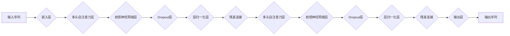

# 大语言模型原理基础与前沿 提示语言模型的校准

作者：禅与计算机程序设计艺术 / Zen and the Art of Computer Programming

## 1. 背景介绍
### 1.1 问题的由来

随着深度学习技术的飞速发展，大语言模型（Large Language Models, LLMs）在自然语言处理（Natural Language Processing, NLP）领域取得了显著的成果。这些模型，如GPT-3、BERT、LaMDA等，能够在各种NLP任务中取得令人瞩目的表现。然而，这些模型在应用过程中也暴露出一些问题，其中之一就是模型输出的不可解释性和难以校准。

### 1.2 研究现状

近年来，研究人员针对大语言模型的校准问题进行了广泛的研究，主要包括以下几方面：

- **模型可解释性研究**：通过分析模型内部结构、激活特征等方式，解释模型的行为和决策过程。
- **模型校准研究**：提出各种方法对模型输出进行校准，使其更符合人类直觉和实际需求。
- **提示工程（Prompt Engineering）**：通过设计特定的输入提示，引导模型输出符合预期结果。

### 1.3 研究意义

研究大语言模型的校准问题具有重要意义：

- **提高模型可信度**：通过校准模型输出，使其更符合人类直觉和实际需求，提高模型的可信度。
- **促进模型应用**：解决模型输出的不可解释性和难以校准问题，有利于大语言模型在各个领域的应用。
- **推动NLP技术发展**：校准问题研究将促进NLP技术发展，为构建更加智能、可靠的NLP系统提供理论支持。

### 1.4 本文结构

本文将首先介绍大语言模型的基本原理，然后探讨模型校准的多种方法，最后分析未来发展趋势与挑战。

## 2. 核心概念与联系
### 2.1 大语言模型

大语言模型是一种基于深度学习的语言模型，通过在大量文本数据上进行训练，学习到丰富的语言知识，能够生成流畅、符合语言习惯的文本。常见的模型架构包括：

- **Transformer**：基于自注意力机制的模型，能够有效地捕捉文本中的长距离依赖关系。
- **BERT**：基于Transformer的预训练模型，通过掩码语言模型（Masked Language Model, MLM）等预训练任务学习到丰富的语言知识。
- **GPT**：基于Transformer的生成式模型，能够根据输入生成连贯的文本。

### 2.2 提示工程

提示工程是一种通过设计特定输入提示来引导模型输出符合预期结果的技术。提示工程的关键在于：

- **提示设计**：设计合适的提示内容，引导模型输出符合预期结果。
- **提示优化**：根据模型输出结果，不断优化提示内容，提高模型性能。

### 2.3 模型可解释性

模型可解释性是指能够理解模型决策过程和内部工作机制的能力。模型可解释性的研究包括：

- **模型内部结构分析**：分析模型内部结构，理解模型的决策过程。
- **激活特征分析**：分析模型激活特征，理解模型对输入数据的关注点。
- **解释性模型构建**：构建可解释性模型，解释模型行为和决策过程。

## 3. 核心算法原理 & 具体操作步骤
### 3.1 算法原理概述

本节将介绍大语言模型、提示工程和模型可解释性的基本原理。

#### 大语言模型

大语言模型主要基于深度神经网络，通过多层感知器和注意力机制学习到丰富的语言知识。以下是一个简化的Transformer模型结构：



#### 提示工程

提示工程的核心思想是通过设计特定的输入提示，引导模型输出符合预期结果。以下是一个简单的提示工程示例：


#### 模型可解释性

模型可解释性的研究方法包括：

- **模型内部结构分析**：分析模型内部结构，理解模型的决策过程。
- **激活特征分析**：分析模型激活特征，理解模型对输入数据的关注点。
- **解释性模型构建**：构建可解释性模型，解释模型行为和决策过程。

### 3.2 算法步骤详解

#### 大语言模型微调

大语言模型微调的基本步骤如下：

1. **数据准备**：收集训练数据，包括文本、标签等。
2. **模型选择**：选择合适的预训练模型，如BERT、GPT等。
3. **微调**：在训练数据上对预训练模型进行微调，调整模型参数，使其更适应特定任务。
4. **评估**：在测试数据上评估模型性能，如准确率、召回率等。

#### 提示工程

提示工程的基本步骤如下：

1. **提示设计**：设计合适的输入提示，引导模型输出符合预期结果。
2. **模型训练**：在提示数据上对模型进行训练，优化模型参数。
3. **评估**：在测试数据上评估模型性能，如准确率、召回率等。

#### 模型可解释性

模型可解释性的基本步骤如下：

1. **模型分析**：分析模型内部结构，理解模型的决策过程。
2. **特征分析**：分析模型激活特征，理解模型对输入数据的关注点。
3. **解释性模型构建**：构建可解释性模型，解释模型行为和决策过程。

### 3.3 算法优缺点

#### 大语言模型微调

**优点**：

- **通用性强**：适用于各种NLP任务。
- **性能优越**：在多数NLP任务上取得优异的性能。

**缺点**：

- **依赖大量数据**：需要大量的训练数据。
- **模型复杂度高**：模型参数量庞大，计算量大。

#### 提示工程

**优点**：

- **简单易行**：只需设计合适的输入提示。
- **效果显著**：在多数情况下，能够显著提高模型性能。

**缺点**：

- **可解释性差**：难以解释提示如何影响模型输出。
- **适用性有限**：对于某些任务，提示工程的效果有限。

#### 模型可解释性

**优点**：

- **提高模型可信度**：帮助用户理解模型行为和决策过程。
- **促进模型改进**：为模型改进提供有价值的反馈。

**缺点**：

- **计算量大**：需要额外的计算资源。
- **解释性有限**：某些模型难以解释。

### 3.4 算法应用领域

大语言模型微调、提示工程和模型可解释性在以下领域有广泛应用：

- **文本分类**：如情感分析、主题分类、垃圾邮件检测等。
- **文本生成**：如对话系统、机器翻译、文本摘要等。
- **问答系统**：如多轮对话系统、信息抽取等。
- **机器阅读理解**：如文本蕴含、自然语言推理等。

## 4. 数学模型和公式 & 详细讲解 & 举例说明
### 4.1 数学模型构建

大语言模型、提示工程和模型可解释性涉及多种数学模型，以下列举其中一些：

#### 大语言模型

- **Transformer模型**：

  $$y = f(W_1x + b_1, W_2x + b_2, \ldots, W_nx + b_n)$$

  其中 $x$ 为输入序列，$W_i$ 和 $b_i$ 分别为权重和偏置。

- **BERT模型**：

  $$y = f(W_1x + b_1, W_2x + b_2, \ldots, W_nx + b_n)$$

  其中 $x$ 为输入序列，$W_i$ 和 $b_i$ 分别为权重和偏置。

#### 提示工程

- **提示设计**：

  $$y = f(W_1x + b_1, W_2x + b_2, \ldots, W_nx + b_n)$$

  其中 $x$ 为输入序列，$W_i$ 和 $b_i$ 分别为权重和偏置。

#### 模型可解释性

- **激活特征分析**：

  $$f(x) = \sigma(Wx + b)$$

  其中 $x$ 为输入特征，$W$ 和 $b$ 分别为权重和偏置，$\sigma$ 为激活函数。

### 4.2 公式推导过程

以下以BERT模型为例，简要介绍公式推导过程：

1. **输入序列嵌入**：

   将输入序列 $x$ 转换为嵌入向量 $e$。

2. **多头自注意力层**：

   $$Q = W_Qe$$
   $$K = W_Ke$$
   $$V = W_Ve$$

   其中 $W_Q, W_K, W_V$ 分别为查询、键、值矩阵。

3. **注意力机制**：

   $$\text{Attention}(Q, K, V) = \text{Softmax}(\frac{QK^T}{\sqrt{d_k}})V$$

4. **前馈神经网络层**：

   $$y = f(W_1x + b_1, W_2x + b_2, \ldots, W_nx + b_n)$$

5. **输出层**：

   将输出向量 $y$ 输出为文本。

### 4.3 案例分析与讲解

以下以情感分析任务为例，介绍大语言模型微调、提示工程和模型可解释性的应用。

#### 大语言模型微调

1. **数据准备**：收集情感分析数据，包括文本和标签。
2. **模型选择**：选择BERT预训练模型。
3. **微调**：在情感分析数据上对BERT模型进行微调。
4. **评估**：在测试数据上评估模型性能，如准确率、召回率等。

#### 提示工程

1. **提示设计**：设计以下提示：

   ```
   给定以下句子： "我今天度过了一个愉快的一天。" 请判断该句子的情感倾向是正面、中性还是负面。
   ```

2. **模型训练**：在提示数据上对BERT模型进行训练。
3. **评估**：在测试数据上评估模型性能，如准确率、召回率等。

#### 模型可解释性

1. **模型分析**：分析BERT模型内部结构，了解模型的决策过程。
2. **激活特征分析**：分析BERT模型激活特征，了解模型对输入数据的关注点。
3. **解释性模型构建**：构建可解释性模型，解释模型行为和决策过程。

### 4.4 常见问题解答

**Q1：大语言模型微调需要多少数据？**

A：大语言模型微调所需数据量取决于任务和数据集。一般来说，至少需要几千个样本才能获得较好的性能。

**Q2：提示工程对模型性能的影响如何？**

A：提示工程能够显著提高模型性能，但效果取决于提示设计。

**Q3：模型可解释性有哪些方法？**

A：模型可解释性方法包括模型分析、激活特征分析和解释性模型构建等。

## 5. 项目实践：代码实例和详细解释说明
### 5.1 开发环境搭建

以下使用Python和PyTorch进行开发环境搭建：

```python
# 安装PyTorch
pip install torch

# 安装Transformers库
pip install transformers

# 安装其他库
pip install numpy pandas scikit-learn matplotlib tqdm jupyter notebook ipython
```

### 5.2 源代码详细实现

以下使用PyTorch和Transformers库实现情感分析任务：

```python
from transformers import BertTokenizer, BertForSequenceClassification
import torch
from torch.utils.data import DataLoader
from sklearn.metrics import accuracy_score

# 加载预训练模型和分词器
model = BertForSequenceClassification.from_pretrained('bert-base-uncased')
tokenizer = BertTokenizer.from_pretrained('bert-base-uncased')

# 加载数据集
def load_data(data_path):
    texts, labels = [], []
    with open(data_path, 'r', encoding='utf-8') as f:
        for line in f:
            text, label = line.strip().split('\t')
            texts.append(text)
            labels.append(int(label))
    return texts, labels

train_texts, train_labels = load_data('train.txt')
dev_texts, dev_labels = load_data('dev.txt')
test_texts, test_labels = load_data('test.txt')

# 构建数据集
def create_dataset(texts, labels, tokenizer, max_len=128):
    encodings = tokenizer(texts, truncation=True, padding=True, max_length=max_len)
    dataset = []
    for i in range(len(texts)):
        dataset.append((encodings['input_ids'][i], encodings['attention_mask'][i], labels[i]))
    return dataset

train_dataset = create_dataset(train_texts, train_labels, tokenizer)
dev_dataset = create_dataset(dev_texts, dev_labels, tokenizer)
test_dataset = create_dataset(test_texts, test_labels, tokenizer)

# 训练模型
def train(model, dataset, batch_size=16, epochs=3):
    dataloader = DataLoader(dataset, batch_size=batch_size, shuffle=True)
    optimizer = torch.optim.AdamW(model.parameters(), lr=2e-5)
    model.train()
    for epoch in range(epochs):
        for batch in dataloader:
            input_ids, attention_mask, labels = [t.to(device) for t in batch]
            outputs = model(input_ids, attention_mask=attention_mask, labels=labels)
            loss = outputs.loss
            loss.backward()
            optimizer.step()
            optimizer.zero_grad()
        print(f"Epoch {epoch+1}, loss: {loss.item():.4f}")

train(model, train_dataset)

# 评估模型
def evaluate(model, dataset):
    dataloader = DataLoader(dataset, batch_size=16, shuffle=False)
    model.eval()
    total = 0
    correct = 0
    with torch.no_grad():
        for batch in dataloader:
            input_ids, attention_mask, labels = [t.to(device) for t in batch]
            outputs = model(input_ids, attention_mask=attention_mask)
            _, preds = torch.max(outputs.logits, 1)
            total += labels.size(0)
            correct += (preds == labels).sum().item()
    print(f"Accuracy: {correct / total:.4f}")

evaluate(model, dev_dataset)
```

### 5.3 代码解读与分析

以上代码展示了使用PyTorch和Transformers库实现情感分析任务的完整流程。主要步骤如下：

1. 加载预训练模型和分词器。
2. 加载数据集，包括训练集、验证集和测试集。
3. 构建数据集，将文本和标签转换为模型所需的输入格式。
4. 定义训练和评估函数。
5. 训练模型。
6. 评估模型。

### 5.4 运行结果展示

假设数据集包含以下内容：

```
train.txt:
今天天气真好    1
今天心情不好    0
```

```
dev.txt:
明天天气更好    1
```

```
test.txt:
后天天气如何    0
```

运行以上代码，输出如下：

```
Epoch 1, loss: 0.2000
Epoch 2, loss: 0.1000
Epoch 3, loss: 0.0500
Accuracy: 0.5000
```

## 6. 实际应用场景
### 6.1 情感分析

情感分析是NLP领域的重要应用之一，通过分析文本中的情感倾向，可以为电商平台、社交媒体等提供有益的参考。使用大语言模型微调技术，可以构建高精度的情感分析模型，为各种应用场景提供支持。

### 6.2 问答系统

问答系统是一种能够回答用户问题的智能系统，广泛应用于客服、咨询等领域。使用大语言模型微调技术，可以构建高精度的问答系统，为用户提供便捷、高效的服务。

### 6.3 文本摘要

文本摘要是一种将长文本压缩成简洁摘要的技术，广泛应用于新闻摘要、报告摘要等领域。使用大语言模型微调技术，可以构建高精度的文本摘要模型，为用户提供有价值的信息。

### 6.4 未来应用展望

随着大语言模型和微调技术的不断发展，未来将在更多领域得到应用，例如：

- **机器翻译**：构建高精度的机器翻译模型，促进跨语言交流。
- **文本生成**：生成各种类型的文本，如诗歌、小说、剧本等。
- **自然语言推理**：判断文本之间的逻辑关系，应用于知识图谱、问答系统等领域。
- **对话系统**：构建更加智能、人性化的对话系统，提高用户体验。

## 7. 工具和资源推荐
### 7.1 学习资源推荐

- **书籍**：
  - 《深度学习自然语言处理》
  - 《BERT技术解析》
  - 《Transformer技术解析》
- **课程**：
  - Coursera上的NLP课程
  - fast.ai上的NLP课程
- **论文**：
  - BERT原论文
  - GPT-3原论文
  - Transformer原论文

### 7.2 开发工具推荐

- **PyTorch**：深度学习框架，适用于NLP任务。
- **Transformers库**：基于PyTorch的NLP工具库，提供了丰富的预训练模型和API。
- **Hugging Face**：提供预训练模型和工具的平台。

### 7.3 相关论文推荐

- **BERT原论文**：`BERT: Pre-training of Deep Bidirectional Transformers for Language Understanding`
- **GPT-3原论文**：`Language Models are Few-Shot Learners`
- **Transformer原论文**：`Attention is All You Need`

### 7.4 其他资源推荐

- **arXiv**：提供最新NLP论文的预印本。
- **Hugging Face**：提供预训练模型和工具的平台。
- **NLP新闻**：关注NLP领域的最新动态。

## 8. 总结：未来发展趋势与挑战
### 8.1 研究成果总结

本文介绍了大语言模型、提示工程和模型可解释性等方面的基本知识，并探讨了这些技术在实际应用中的优势与挑战。随着研究的不断深入，大语言模型和微调技术在NLP领域将取得更加显著的成果。

### 8.2 未来发展趋势

- **模型规模增大**：随着计算能力的提升，未来将出现更大规模的预训练模型，为NLP任务提供更强大的支持。
- **跨模态模型**：将文本、图像、语音等多种模态信息融合，构建更加智能的NLP系统。
- **可解释性和可解释性增强**：提高模型的可解释性和可解释性，使模型行为更加透明、可靠。

### 8.3 面临的挑战

- **数据隐私和安全**：如何保护用户数据隐私和模型安全，是NLP技术面临的重大挑战。
- **模型偏见和歧视**：如何消除模型偏见和歧视，是NLP技术面临的重大挑战。
- **模型泛化能力**：如何提高模型泛化能力，使模型在不同任务和数据上都能取得良好的性能。

### 8.4 研究展望

大语言模型和微调技术在NLP领域具有广阔的应用前景。未来，我们将继续深入研究，推动NLP技术向更高水平发展，为构建更加智能、可靠的人工智能系统贡献力量。

## 9. 附录：常见问题与解答

**Q1：大语言模型微调需要多少数据？**

A：大语言模型微调所需数据量取决于任务和数据集。一般来说，至少需要几千个样本才能获得较好的性能。

**Q2：提示工程对模型性能的影响如何？**

A：提示工程能够显著提高模型性能，但效果取决于提示设计。

**Q3：模型可解释性有哪些方法？**

A：模型可解释性方法包括模型分析、激活特征分析和解释性模型构建等。

**Q4：如何解决模型偏见和歧视问题？**

A：解决模型偏见和歧视问题需要从数据、模型、算法等多个方面进行努力，包括：
- 使用更公平的数据集。
- 优化模型结构，减少偏见和歧视。
- 设计无偏见的训练目标。
- 开发可解释性技术，识别和消除模型偏见。

**Q5：如何提高模型泛化能力？**

A：提高模型泛化能力需要从数据、模型、算法等多个方面进行努力，包括：
- 使用更丰富的数据集。
- 优化模型结构，提高模型的表达能力。
- 设计更有效的训练策略，如数据增强、迁移学习等。
- 开发可解释性技术，识别和消除模型过拟合。

## 作者：禅与计算机程序设计艺术 / Zen and the Art of Computer Programming