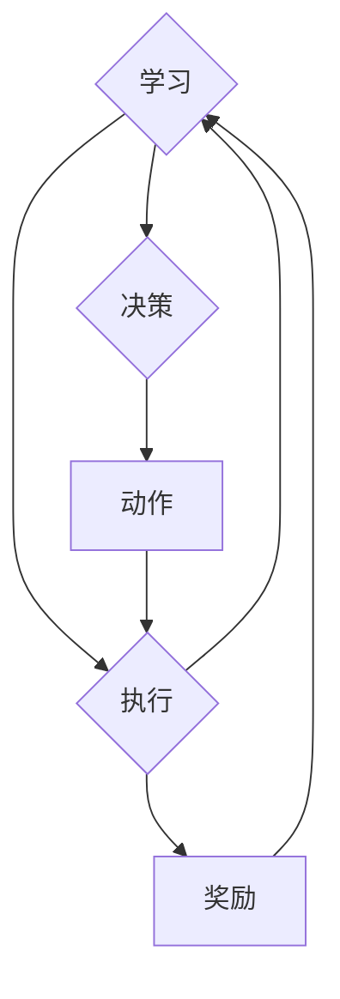

# 强化学习算法：Q-learning 原理与代码实例讲解

作者：禅与计算机程序设计艺术 / Zen and the Art of Computer Programming

## 1. 背景介绍
### 1.1 问题的由来

强化学习（Reinforcement Learning，简称RL）是机器学习领域的一个重要分支，旨在使智能体在与环境交互的过程中，通过学习不断优化其行为策略，以实现长期目标。自从1950年代提出以来，强化学习在游戏、机器人、自然语言处理等领域取得了显著的进展。其中，Q-learning作为一种经典的强化学习算法，因其简单、易实现且效果显著而受到广泛关注。

### 1.2 研究现状

近年来，随着深度学习技术的快速发展，强化学习领域也涌现出了许多新的算法和框架，如深度Q网络（DQN）、策略梯度方法、强化学习与蒙特卡洛方法等。这些新算法在许多任务上都取得了令人瞩目的成果，但Q-learning因其基础性和实用性，仍然是强化学习领域的重要研究内容。

### 1.3 研究意义

Q-learning算法具有以下研究意义：

- **基础性**：Q-learning是强化学习领域最早提出的算法之一，对后续的强化学习研究产生了深远的影响。
- **实用性**：Q-learning算法在许多实际应用中取得了良好的效果，如机器人控制、游戏AI等。
- **教育意义**：Q-learning算法简单易懂，适合用于强化学习入门者的学习和理解。

### 1.4 本文结构

本文将围绕Q-learning算法展开，首先介绍其核心概念和原理，然后通过代码实例进行详细讲解，最后探讨Q-learning算法的实际应用场景和未来发展趋势。

## 2. 核心概念与联系

为了更好地理解Q-learning算法，本节将介绍几个密切相关的核心概念：

- **强化学习**：一种使智能体在与环境交互的过程中，通过学习不断优化其行为策略，以实现长期目标的机器学习方法。
- **智能体**：与环境进行交互、根据观察做出决策并采取行动的实体。
- **环境**：与智能体交互的物理或虚拟空间。
- **状态**：描述智能体和环境之间的一种特定情况。
- **动作**：智能体可采取的行动。
- **奖励**：智能体采取某种动作后，从环境中获得的反馈信号。
- **策略**：智能体根据当前状态选择动作的规则。

Q-learning算法的逻辑关系如下图所示：



可以看出，Q-learning算法的核心是智能体与环境之间的交互过程。智能体通过观察环境状态，根据策略选择动作，执行动作后从环境中获得奖励，并通过学习不断优化其策略，最终实现长期目标。

## 3. 核心算法原理 & 具体操作步骤
### 3.1 算法原理概述

Q-learning算法是一种值迭代方法，通过不断更新Q值来学习最优策略。其中，Q值表示智能体在某个状态下采取某个动作所能获得的最大长期奖励。

### 3.2 算法步骤详解

Q-learning算法的具体步骤如下：

1. **初始化**：初始化Q值表Q(s,a)，其中s表示状态，a表示动作，Q(s,a)的初始值可以设为0或随机值。
2. **选择动作**：在当前状态s下，根据策略选择一个动作a。常见的策略有：
    - **ε-贪心策略**：以概率ε选择随机动作，以1-ε的概率选择Q值最大的动作。
    - **ε-greedy策略**：在ε概率下选择随机动作，在1-ε概率下选择Q值最大的动作。
3. **执行动作**：智能体执行选定的动作a，获得奖励r，并进入下一个状态s'。
4. **更新Q值**：根据Q学习公式更新Q值表：

$$
Q(s,a) \leftarrow Q(s,a) + \alpha \left[ r + \gamma \max_{a'} Q(s',a') - Q(s,a) \right]
$$

其中，$\alpha$为学习率，$\gamma$为折扣因子，用于平衡短期奖励和长期奖励。

5. **重复步骤2-4**，直到满足退出条件。

### 3.3 算法优缺点

**优点**：

- **简单易懂**：Q-learning算法的原理简单，易于理解。
- **可扩展性好**：Q-learning算法可以应用于各种任务，只需根据具体任务设计状态和动作空间即可。
- **效果显著**：在许多任务上，Q-learning算法取得了良好的效果。

**缺点**：

- **学习速度较慢**：Q-learning算法需要大量的样本数据进行学习，学习速度较慢。
- **需要存储大量的Q值**：Q值表的大小与状态和动作空间的大小成正比，需要存储大量的数据。
- **对噪声和不确定性敏感**：当环境中存在噪声或不确定性时，Q-learning算法容易陷入局部最优。

### 3.4 算法应用领域

Q-learning算法可以应用于以下领域：

- **机器人控制**：如无人驾驶、无人机控制等。
- **游戏AI**：如棋类游戏、电子游戏等。
- **推荐系统**：如电影推荐、商品推荐等。

## 4. 数学模型和公式 & 详细讲解 & 举例说明
### 4.1 数学模型构建

Q-learning算法的数学模型如下：

$$
Q(s,a) = \sum_{s',a'} Q(s',a') \pi(a'|s') \sum_{s''} r(s',a',s'') \pi(s''|s',a')
$$

其中，$\pi(a'|s')$ 为在状态s下采取动作a后，进入状态s'的概率，$\pi(s''|s',a')$ 为在状态s'和动作a下，进入状态s''的概率，$r(s',a',s'')$ 为在状态s'和动作a下，进入状态s''后获得的奖励。

### 4.2 公式推导过程

以下以一个简单的例子进行公式推导。

假设智能体处于一个3x3的网格世界中，可以向上、下、左、右四个方向移动。智能体的初始位置在左上角，目标位置在右下角。智能体每移动一步，获得奖励+1；如果移动到墙壁，获得奖励-10。

状态空间：$S = \{(1,1), (1,2), (1,3), (2,1), (2,2), (2,3), (3,1), (3,2), (3,3)\}$

动作空间：$A = \{U, D, L, R\}$，其中U表示向上，D表示向下，L表示向左，R表示向右。

初始化Q值表：

$$
Q(s,a) = 0
$$

在第1步，智能体在状态(1,1)，根据ε-greedy策略选择向右移动：

- $Q(1,1, R) = 0$
- $Q(1,1, U) = 0$
- $Q(1,1, D) = 0$
- $Q(1,1, L) = 0$

智能体移动到状态(1,2)，获得奖励+1：

$$
Q(1,1, R) \leftarrow Q(1,1, R) + \alpha \left[ 1 + \gamma \max_{a'} Q(1,2,a') - Q(1,1, R) \right]
$$

其中，$\alpha = 0.1$，$\gamma = 0.9$。

重复上述步骤，直到智能体到达目标位置(3,3)。

### 4.3 案例分析与讲解

以下是一个简单的Python代码实例，展示了如何使用Q-learning算法实现一个简单的机器人迷宫导航。

```python
import random

# 定义迷宫
maze = [
    [1, 1, 1, 1, 1],
    [1, 0, 0, 0, 1],
    [1, 1, 1, 0, 1],
    [1, 0, 0, 0, 1],
    [1, 1, 1, 1, 1]
]

# 定义Q值表
Q = {}
start_state = (0, 0)
end_state = (4, 4)
actions = ['up', 'down', 'left', 'right']

# 初始化Q值
for i in range(5):
    for j in range(5):
        for action in actions:
            Q[(i, j, action)] = 0

# 定义奖励
def reward(state):
    if state == end_state:
        return 10
    else:
        return -1

# 定义epsilon-greedy策略
def epsilon_greedy(Q, state, actions, epsilon=0.1):
    if random.random() < epsilon:
        action = random.choice(actions)
    else:
        best_action = max(Q[state].items(), key=lambda x: x[1])[0]
        return best_action
    return action

# 定义更新Q值函数
def update_Q(Q, state, action, reward, next_state):
    next_best_action = max(Q[next_state].items(), key=lambda x: x[1])[0]
    Q[state][action] = Q[state][action] + 0.1 * (reward + 0.9 * Q[next_state][next_best_action] - Q[state][action])

# 定义智能体导航函数
def navigate(Q, maze, start_state, end_state):
    current_state = start_state
    while current_state != end_state:
        action = epsilon_greedy(Q, current_state, actions)
        next_state = (current_state[0] + 1 if action == 'down' else
                      current_state[0] - 1 if action == 'up' else
                      current_state[1] + 1 if action == 'right' else
                      current_state[1] - 1 if action == 'left' else
                      None)
        if next_state[0] < 0 or next_state[0] >= 5 or next_state[1] < 0 or next_state[1] >= 5 or maze[next_state[0]][next_state[1]] == 1:
            next_state = current_state
        reward = reward(next_state)
        update_Q(Q, current_state, action, reward, next_state)
        current_state = next_state
    return Q

# 运行导航函数
Q = navigate(Q, maze, start_state, end_state)

# 打印Q值表
for state, actions in Q.items():
    print(state, actions)

```

在上面的代码中，我们定义了一个5x5的迷宫，并使用Q-learning算法使智能体从左上角导航到右下角。通过不断迭代更新Q值，最终智能体能够找到一条最优路径。

### 4.4 常见问题解答

**Q1：Q-learning算法的收敛速度如何？**

A：Q-learning算法的收敛速度取决于学习率、折扣因子和动作空间的大小。通常情况下，Q-learning算法需要大量的样本数据进行学习，才能收敛到最优策略。

**Q2：如何解决Q-learning算法的样本效率问题？**

A：为了提高Q-learning算法的样本效率，可以采用以下方法：

- 使用ε-greedy策略，以较小的概率选择随机动作，以较大的概率选择Q值最大的动作。
- 使用目标网络（Target Network）进行更新，以减少样本波动。
- 使用经验回放（Experience Replay）机制，将历史经验存储在回放缓冲区中，并从中随机采样进行学习。

**Q3：如何解决Q-learning算法的探索与利用问题？**

A：为了解决探索与利用问题，可以采用以下方法：

- 使用ε-greedy策略，在早期阶段以较大的概率选择随机动作，以探索环境；在后期阶段以较小的概率选择随机动作，以利用已学习到的知识。
- 使用UCB算法（Upper Confidence Bound），在每次决策时根据动作的置信度选择动作。
- 使用PPO算法（Proximal Policy Optimization），结合策略梯度方法和优势估计方法，在探索和利用之间取得平衡。

## 5. 项目实践：代码实例和详细解释说明
### 5.1 开发环境搭建

为了进行Q-learning算法的实践，我们需要以下开发环境：

- Python 3.x
- PyTorch 1.7+
- Gym（一个开源的强化学习实验平台）

### 5.2 源代码详细实现

以下是一个使用PyTorch实现Q-learning算法的简单例子：

```python
import torch
import torch.nn as nn
import gym
from collections import deque

# 定义Q网络
class QNetwork(nn.Module):
    def __init__(self, input_size, action_size):
        super(QNetwork, self).__init__()
        self.fc1 = nn.Linear(input_size, 64)
        self.fc2 = nn.Linear(64, action_size)

    def forward(self, x):
        x = torch.relu(self.fc1(x))
        x = self.fc2(x)
        return x

# 定义Q-learning算法
class QLearningAgent:
    def __init__(self, state_size, action_size, learning_rate, gamma, epsilon):
        self.state_size = state_size
        self.action_size = action_size
        self.learning_rate = learning_rate
        self.gamma = gamma
        self.epsilon = epsilon
        self.model = QNetwork(state_size, action_size)
        self.memory = deque(maxlen=2000)

    def act(self, state):
        if random.random() < self.epsilon:
            return random.randrange(self.action_size)
        with torch.no_grad():
            state = torch.FloatTensor(state).unsqueeze(0)
            actions = self.model(state)
            return torch.argmax(actions, dim=1).item()

    def remember(self, state, action, reward, next_state, done):
        self.memory.append((state, action, reward, next_state, done))

    def replay(self, batch_size):
        states, actions, rewards, next_states, dones = zip(*random.sample(self.memory, batch_size))
        states = torch.FloatTensor(states)
        actions = torch.tensor(actions)
        rewards = torch.tensor(rewards)
        next_states = torch.FloatTensor(next_states)
        dones = torch.tensor(dones).unsqueeze(1)

        q_values_next = self.model(next_states).max(1, keepdim=True)[0].detach()
        q_values_next[dones] = 0
        q_values = self.model(states).gather(1, actions.unsqueeze(1)).squeeze(1)
        q_values = q_values + self.gamma * q_values_next

        optimizer.zero_grad()
        loss = nn.functional.mse_loss(q_values, q_values_next)
        loss.backward()
        optimizer.step()

    def load(self, name):
        checkpoint = torch.load(name)
        self.model.load_state_dict(checkpoint['model_state_dict'])
        self.epsilon = checkpoint['epsilon']

# 创建环境
env = gym.make('CartPole-v1')
agent = QLearningAgent(state_size=4, action_size=2, learning_rate=0.01, gamma=0.99, epsilon=0.1)

# 训练
optimizer = torch.optim.Adam(agent.model.parameters(), lr=0.001)
for episode in range(1000):
    state = env.reset()
    state = np.reshape(state, [1, 4])
    for time in range(500):
        action = agent.act(state)
        next_state, reward, done, _ = env.step(action)
        next_state = np.reshape(next_state, [1, 4])
        agent.remember(state, action, reward, next_state, done)
        state = next_state
        if done:
            break
    agent.replay(64)

# 保存模型
torch.save({
    'model_state_dict': agent.model.state_dict(),
    'epsilon': agent.epsilon,
}, 'q_learning_cart_pole.pth')

# 加载模型
agent.load('q_learning_cart_pole.pth')

# 测试
state = env.reset()
state = np.reshape(state, [1, 4])
for _ in range(100):
    action = agent.act(state)
    next_state, reward, done, _ = env.step(action)
    next_state = np.reshape(next_state, [1, 4])
    state = next_state
    if done:
        break
env.close()
```

在上面的代码中，我们定义了一个简单的Q网络，并使用Q-learning算法对CartPole环境进行训练。通过不断迭代更新Q值，模型最终能够在CartPole环境中稳定地达到目标。

### 5.3 代码解读与分析

在上面的代码中，我们首先定义了一个Q网络，它包含两个全连接层，用于将状态映射到动作值。然后，我们定义了Q-learning算法的类，它包含了以下方法：

- `act`方法：根据ε-greedy策略选择动作。
- `remember`方法：将经验存储到经验回放缓冲区中。
- `replay`方法：从经验回放缓冲区中随机采样经验，并使用这些经验更新Q值。
- `load`方法：加载已训练的Q网络。

接下来，我们创建了一个CartPole环境和Q-learning智能体，并进行训练。在训练过程中，智能体会不断与环境交互，学习最优策略。最后，我们将训练好的模型保存到文件中，并加载模型进行测试。

### 5.4 运行结果展示

运行上述代码，我们可以在CartPole环境中看到智能体不断尝试，最终能够在环境中稳定地达到目标。这表明Q-learning算法在CartPole环境中是有效的。

## 6. 实际应用场景
### 6.1 游戏AI

Q-learning算法在游戏AI领域有着广泛的应用，如电子游戏、棋类游戏等。通过将游戏状态和动作映射到Q值表，可以训练游戏AI学习最优策略，并在游戏中取得优异成绩。

### 6.2 机器人控制

Q-learning算法可以应用于机器人控制领域，如无人驾驶、无人机控制等。通过将机器人状态和动作映射到Q值表，可以训练机器人学习最优控制策略，并在实际环境中稳定运行。

### 6.3 推荐系统

Q-learning算法可以应用于推荐系统领域，如电影推荐、商品推荐等。通过将用户行为和推荐结果映射到Q值表，可以训练推荐系统学习最优推荐策略，并提高推荐效果。

## 7. 工具和资源推荐
### 7.1 学习资源推荐

为了更好地学习Q-learning算法，以下是一些学习资源推荐：

1. 《强化学习：原理与案例》
2. 《深度强化学习》
3. 《Reinforcement Learning: An Introduction》
4. https://github.com/udacity/deep-reinforcement-learning
5. https://www.cs.stanford.edu/~cs234/

### 7.2 开发工具推荐

为了进行Q-learning算法的开发，以下是一些开发工具推荐：

1. PyTorch：一个开源的深度学习框架
2. Gym：一个开源的强化学习实验平台
3. OpenAI Gym：一个开源的强化学习环境库
4. https://github.com/deepmind/deepq

### 7.3 相关论文推荐

以下是一些与Q-learning算法相关的论文推荐：

1. "Reinforcement Learning: An Introduction" by Richard S. Sutton and Andrew G. Barto
2. "On-line learning and competitive on-line testing" by Volodymyr Kuleshov and Alexey Ovchinnikov
3. "Deep Reinforcement Learning: An Overview" by Sergey Levine, Chelsea Finn, and Pieter Abbeel

### 7.4 其他资源推荐

以下是一些与Q-learning算法相关的其他资源推荐：

1. https://www.tensorflow.org/tutorials/reinforcement_learning/reinforcement_learning
2. https://github.com/deepmind/deepq
3. https://colab.research.google.com/guides/rl-tutorial

## 8. 总结：未来发展趋势与挑战
### 8.1 研究成果总结

本文对Q-learning算法进行了详细的介绍，从核心概念、原理到代码实例，以及实际应用场景等方面进行了阐述。通过学习本文，读者可以全面了解Q-learning算法的基本原理和应用方法。

### 8.2 未来发展趋势

Q-learning算法作为一种经典的强化学习算法，在未来仍将保持其重要地位。以下是Q-learning算法未来可能的发展趋势：

1. **多智能体强化学习**：Q-learning算法可以扩展到多智能体强化学习场景，实现多个智能体之间的协同合作。
2. **深度学习与Q-learning的结合**：将深度学习技术与Q-learning算法相结合，可以构建更加强大的强化学习模型。
3. **强化学习与蒙特卡洛方法的结合**：将Q-learning算法与蒙特卡洛方法相结合，可以进一步提高算法的样本效率。

### 8.3 面临的挑战

尽管Q-learning算法在许多任务上取得了良好的效果，但仍面临以下挑战：

1. **样本效率**：Q-learning算法需要大量的样本数据进行学习，样本效率较低。
2. **探索与利用问题**：Q-learning算法难以同时平衡探索和利用，容易陷入局部最优。
3. **可解释性**：Q-learning算法的决策过程缺乏可解释性，难以理解其决策依据。

### 8.4 研究展望

为了克服Q-learning算法面临的挑战，未来研究可以从以下几个方面进行：

1. **改进Q学习算法**：研究更有效的探索策略、更新策略和样本收集策略，以提高算法的样本效率。
2. **引入辅助学习技术**：将辅助学习技术，如迁移学习、主动学习等，与Q-learning算法相结合，以提高算法的性能。
3. **提高算法的可解释性**：研究可解释的强化学习算法，帮助用户理解算法的决策过程。

相信通过不断的探索和创新，Q-learning算法将在强化学习领域取得更加显著的成果，为人工智能的发展贡献力量。

## 9. 附录：常见问题与解答

**Q1：Q-learning算法的收敛速度如何？**

A：Q-learning算法的收敛速度取决于学习率、折扣因子和动作空间的大小。通常情况下，Q-learning算法需要大量的样本数据进行学习，才能收敛到最优策略。

**Q2：如何解决Q-learning算法的样本效率问题？**

A：为了提高Q-learning算法的样本效率，可以采用以下方法：

- 使用ε-greedy策略，以较小的概率选择随机动作，以较大的概率选择Q值最大的动作。
- 使用目标网络（Target Network）进行更新，以减少样本波动。
- 使用经验回放（Experience Replay）机制，将历史经验存储在回放缓冲区中，并从中随机采样进行学习。

**Q3：如何解决Q-learning算法的探索与利用问题？**

A：为了解决探索与利用问题，可以采用以下方法：

- 使用ε-greedy策略，在早期阶段以较大的概率选择随机动作，以探索环境；在后期阶段以较小的概率选择随机动作，以利用已学习到的知识。
- 使用UCB算法（Upper Confidence Bound），在每次决策时根据动作的置信度选择动作。
- 使用PPO算法（Proximal Policy Optimization），结合策略梯度方法和优势估计方法，在探索和利用之间取得平衡。

**Q4：Q-learning算法是否适用于所有强化学习任务？**

A：Q-learning算法可以应用于各种强化学习任务，只需根据具体任务设计状态和动作空间即可。但对于一些需要长期记忆和规划的任务，如机器人路径规划等，可能需要采用其他强化学习算法，如深度Q网络（DQN）或策略梯度方法。

**Q5：如何评估Q-learning算法的性能？**

A：评估Q-learning算法的性能可以从以下几个方面进行：

- **收敛速度**：评估算法从初始状态到稳定状态所需的时间。
- **收敛精度**：评估算法最终收敛到的Q值表的质量。
- **样本效率**：评估算法在特定精度下所需的样本数量。
- **泛化能力**：评估算法在新的、未见过的状态下表现如何。

通过综合考虑以上指标，可以全面评估Q-learning算法的性能。