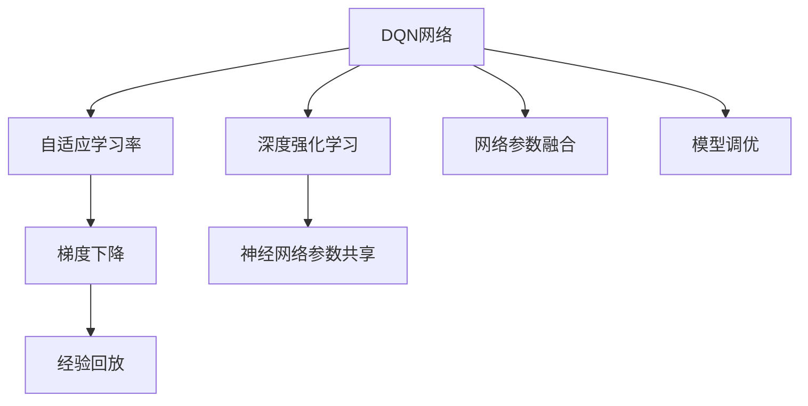
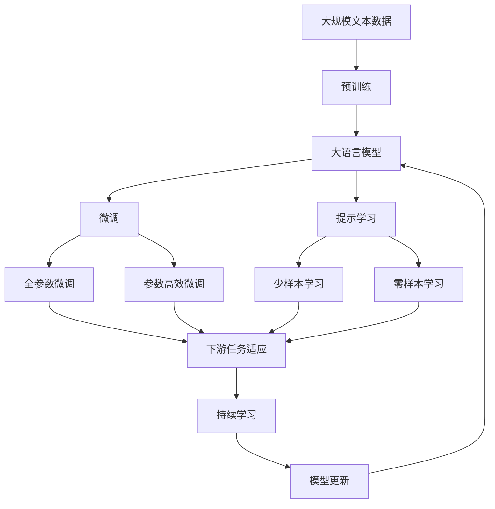

                 

# 一切皆是映射：DQN网络参数调整与性能优化指南

> 关键词：DQN, 深度强化学习, 网络参数, 优化策略, 自适应学习率, 梯度下降, 经验回放, 神经网络

## 1. 背景介绍

### 1.1 问题由来
近年来，随着深度学习技术的快速发展，深度强化学习（Deep Reinforcement Learning, DRL）已成为人工智能领域的热点研究领域之一。其中，DQN（Deep Q-Network）网络因其能够学习策略而无需显式模型架构，而在游戏AI、机器人控制等实际应用中取得了显著成果。然而，DQN网络的参数调整和性能优化一直是一个复杂而具有挑战性的问题。

DQN网络的参数调整不仅仅包括选择合适的学习率，还需要考虑如何通过优化策略和自适应学习率来提升网络性能。同时，DQN网络中的经验回放（Experience Replay）机制也对其性能有着重要影响。因此，如何科学合理地调整DQN网络的参数，成为广大研究者和工程师关注的焦点。

### 1.2 问题核心关键点
DQN网络的参数调整和性能优化主要包括以下几个关键点：
- 选择合适的学习率和优化策略，如Adam、SGD等。
- 采用自适应学习率调整机制，如Adaptive Moment Estimation (Adam)、Adaptive Gradient Algorithm (AdaGrad)等。
- 实施经验回放（Experience Replay）机制，以提升样本多样性和泛化能力。
- 使用网络参数共享和网络融合技术，减少模型参数和计算量。
- 通过交叉验证和模型调优，不断提升模型性能。

这些问题相互交织，共同影响着DQN网络的性能和泛化能力，其解答需要全面考虑。本文将从原理到实践，全面探讨DQN网络参数调整与性能优化策略，帮助研究者深入理解并有效解决这些问题。

### 1.3 问题研究意义
研究DQN网络参数调整与性能优化策略，具有以下重要意义：
- 提升网络性能：通过科学合理的参数调整，可以显著提升DQN网络的性能，使其在实际应用中表现更佳。
- 加速模型训练：合理设置学习率、优化策略和经验回放等机制，可以显著加速模型训练过程。
- 提高泛化能力：优化经验回放和网络参数共享机制，可以提升DQN网络的泛化能力，使其在各种环境中表现稳定。
- 降低资源消耗：通过网络参数融合等技术，可以显著减少模型参数和计算量，降低资源消耗。
- 增强模型可解释性：优化网络参数和结构，使其更加透明，增强模型的可解释性。

## 2. 核心概念与联系

### 2.1 核心概念概述

为了更好地理解DQN网络参数调整与性能优化策略，本节将介绍几个密切相关的核心概念：

- **DQN网络**：深度Q网络（DQN）是深度学习与强化学习相结合的产物，通过近似Q函数，实现策略学习。
- **深度强化学习**：一种结合深度神经网络和强化学习技术的框架，使机器能够在复杂环境中通过试错学习最优策略。
- **自适应学习率**：根据训练过程中梯度变化自动调整学习率，提高训练效率和模型性能。
- **梯度下降**：优化算法的基本原理，通过不断更新模型参数来最小化损失函数，使模型性能提升。
- **经验回放**：将训练数据随机存储，并从存储池中抽取样本来训练网络，增强样本多样性。
- **神经网络参数共享**：在不同网络层之间共享部分参数，减少模型参数量和计算量。

这些核心概念之间存在着紧密的联系，形成了DQN网络参数调整与性能优化的完整框架。通过理解这些核心概念，我们可以更好地把握DQN网络的工作原理和优化方向。

### 2.2 概念间的关系

这些核心概念之间存在着紧密的联系，形成了DQN网络参数调整与性能优化的完整生态系统。下面我通过一些Mermaid流程图来展示这些概念之间的关系。



这个流程图展示了大语言模型的核心概念及其之间的关系：

1. DQN网络通过深度强化学习实现策略学习。
2. 自适应学习率和梯度下降是优化算法的基本原理，用于更新网络参数。
3. 经验回放增强样本多样性，提高模型泛化能力。
4. 神经网络参数共享减少模型参数量和计算量。
5. 网络参数融合和模型调优进一步提升模型性能。

这些概念共同构成了DQN网络的优化框架，使其能够在各种环境中发挥最优性能。通过理解这些概念，我们可以更好地把握DQN网络的工作原理和优化方向。

### 2.3 核心概念的整体架构

最后，我们用一个综合的流程图来展示这些核心概念在大语言模型微调过程中的整体架构：



这个综合流程图展示了从预训练到微调，再到持续学习的完整过程。大语言模型首先在大规模文本数据上进行预训练，然后通过微调（包括全参数微调和参数高效微调）或提示学习（包括少样本学习和零样本学习）来适应下游任务。最后，通过持续学习技术，模型可以不断学习新知识，同时保持已学习的知识，而不会出现灾难性遗忘。 通过这些流程图，我们可以更清晰地理解DQN网络的工作原理和优化方向。

## 3. 核心算法原理 & 具体操作步骤
### 3.1 算法原理概述

DQN网络的参数调整与性能优化，本质上是深度强化学习过程中参数的优化过程。其核心目标是找到最优的Q函数参数，使DQN网络能够准确地预测出最优行动，从而在复杂环境中表现出最优策略。

形式化地，假设DQN网络的结构为 $M_{\theta}$，其中 $\theta$ 为网络参数。在训练过程中，我们希望最小化经验损失函数 $J(\theta)$，即：

$$
J(\theta) = \mathbb{E}_{x \sim \mathcal{D}} \left[ Q_{M_{\theta}}(s,a) - (r + \gamma \max_{a'} Q_{M_{\theta}}(s',a') \right]^2
$$

其中，$Q_{M_{\theta}}$ 为网络输出Q值，$(s,a)$ 为当前状态和行动，$(s',a')$ 为下一个状态和最优行动，$r$ 为即时奖励，$\gamma$ 为折扣因子。

通过梯度下降等优化算法，不断更新模型参数 $\theta$，使得 $J(\theta)$ 最小化，从而得到最优参数 $\theta^*$。

### 3.2 算法步骤详解

DQN网络的参数调整与性能优化主要包括以下几个关键步骤：

**Step 1: 准备训练数据**
- 收集目标任务的大量训练数据，划分为训练集、验证集和测试集。
- 将训练数据分为经验样本和回放样本，经验样本用于模型训练，回放样本用于经验回放。

**Step 2: 选择优化算法**
- 选择合适的优化算法，如Adam、SGD等，设置合适的学习率、批大小等参数。
- 使用自适应学习率调整机制，如Adam、AdaGrad等，根据梯度变化自动调整学习率。

**Step 3: 实施经验回放**
- 将训练数据随机存储，并从存储池中抽取样本来训练网络。
- 设定合适的回放频率和批量大小，以增强样本多样性。

**Step 4: 网络参数融合**
- 将不同层之间共享部分参数，减少模型参数量和计算量。
- 通过网络参数融合技术，提高模型泛化能力，降低过拟合风险。

**Step 5: 交叉验证与模型调优**
- 使用交叉验证技术，评估模型在不同数据集上的性能，寻找最优参数组合。
- 根据模型在验证集上的性能，不断调整网络结构、参数和学习率等，优化模型性能。

**Step 6: 模型评估与部署**
- 在测试集上评估微调后模型的性能，对比微调前后的精度提升。
- 使用微调后的模型对新样本进行推理预测，集成到实际的应用系统中。
- 持续收集新的数据，定期重新微调模型，以适应数据分布的变化。

以上是DQN网络参数调整与性能优化的完整流程。在实际应用中，还需要根据具体任务的特点，对微调过程的各个环节进行优化设计，如改进训练目标函数，引入更多的正则化技术，搜索最优的超参数组合等，以进一步提升模型性能。

### 3.3 算法优缺点

DQN网络的参数调整与性能优化方法具有以下优点：
1. 模型性能提升显著：科学合理的参数调整可以显著提升DQN网络的性能，使其在实际应用中表现更佳。
2. 训练效率高：合理设置学习率、优化策略和经验回放等机制，可以显著加速模型训练过程。
3. 泛化能力强：优化经验回放和网络参数共享机制，可以提升DQN网络的泛化能力，使其在各种环境中表现稳定。
4. 资源消耗低：通过网络参数融合等技术，可以显著减少模型参数和计算量，降低资源消耗。

同时，该方法也存在以下局限性：
1. 依赖于高质量数据：DQN网络的参数调整依赖于高质量的训练数据，数据质量直接影响模型性能。
2. 过拟合风险：优化过程中可能存在过拟合风险，特别是在标注样本数量有限的情况下。
3. 模型复杂度高：DQN网络的参数调整过程复杂，需要多个步骤和多个参数组合，调整难度较大。
4. 调优过程耗时：调优过程需要耗费大量时间和计算资源，特别是在大规模数据集上。

尽管存在这些局限性，但就目前而言，DQN网络的参数调整与性能优化方法仍是目前深度强化学习领域的主流范式。未来相关研究的重点在于如何进一步降低参数调整对标注数据的依赖，提高模型的泛化能力，同时兼顾可解释性和伦理安全性等因素。

### 3.4 算法应用领域

DQN网络的参数调整与性能优化方法已经在各种领域得到了广泛的应用，例如：

- 游戏AI：在多款流行游戏中，DQN网络通过参数调整和性能优化，实现了超越人类水平的智能水平。
- 机器人控制：在机器人导航、操作等任务中，DQN网络通过参数调整和性能优化，实现了复杂环境下的稳定控制。
- 自动驾驶：在自动驾驶领域，DQN网络通过参数调整和性能优化，实现了更智能、更可靠的决策系统。
- 医疗诊断：在医疗诊断领域，DQN网络通过参数调整和性能优化，实现了更高效、更准确的诊断决策。
- 金融交易：在金融交易领域，DQN网络通过参数调整和性能优化，实现了更稳定、更有效的交易策略。

除了上述这些经典应用外，DQN网络还在工业生产、社交网络、能源管理等更多领域，展示出了其强大的应用潜力。随着深度强化学习技术的发展，DQN网络的参数调整与性能优化方法将带来更多创新和突破。

## 4. 数学模型和公式 & 详细讲解  
### 4.1 数学模型构建

本节将使用数学语言对DQN网络的参数调整与性能优化过程进行更加严格的刻画。

记DQN网络为 $M_{\theta}$，其中 $\theta$ 为网络参数。假设训练集为 $D=\{(x_i,a_i,r_i,x_{i+1})\}_{i=1}^N$，其中 $x_i$ 为当前状态，$a_i$ 为行动，$r_i$ 为即时奖励，$x_{i+1}$ 为下一个状态。

定义DQN网络的输出Q值为 $Q_{M_{\theta}}(x_i,a_i)$，网络的损失函数为：

$$
L_{M_{\theta}}(D) = \mathbb{E}_{(x_i,a_i,r_i,x_{i+1}) \sim \mathcal{D}} \left[ (Q_{M_{\theta}}(x_i,a_i) - (r + \gamma \max_{a'} Q_{M_{\theta}}(x_{i+1},a'))^2 \right]
$$

通过梯度下降等优化算法，不断更新模型参数 $\theta$，最小化损失函数 $L_{M_{\theta}}(D)$，使得网络输出逼近最优Q值，即得到最优参数 $\theta^*$。

### 4.2 公式推导过程

以下我们以DQN网络的深度神经网络（DNN）部分为例，推导其参数调整与性能优化过程。

假设DNN网络的结构为：

$$
Q_{M_{\theta}}(x_i,a_i) = \mathbb{E}_{z \sim \mathcal{N}(0,1)} \left[ \mathcal{Q}(\mathbf{z},x_i,a_i) \right]
$$

其中，$\mathcal{Q}$ 为DNN网络的前向传播函数，$\mathbf{z}$ 为随机噪声向量。

定义DNN网络的输出Q值为 $Q_{M_{\theta}}(x_i,a_i)$，网络的损失函数为：

$$
L_{M_{\theta}}(D) = \mathbb{E}_{(x_i,a_i,r_i,x_{i+1}) \sim \mathcal{D}} \left[ (Q_{M_{\theta}}(x_i,a_i) - (r + \gamma \max_{a'} Q_{M_{\theta}}(x_{i+1},a'))^2 \right]
$$

通过梯度下降等优化算法，不断更新模型参数 $\theta$，使得 $L_{M_{\theta}}(D)$ 最小化，从而得到最优参数 $\theta^*$。

### 4.3 案例分析与讲解

为了更好地理解DQN网络的参数调整与性能优化过程，我们可以通过一个简单的案例来进行分析。

假设我们有一个DNN网络，用于预测股票价格走势。网络的结构为：

$$
Q_{M_{\theta}}(x_i,a_i) = \mathbb{E}_{z \sim \mathcal{N}(0,1)} \left[ \mathcal{Q}(\mathbf{z},x_i,a_i) \right]
$$

其中，$\mathcal{Q}$ 为DNN网络的前向传播函数，$\mathbf{z}$ 为随机噪声向量。

在训练过程中，我们希望通过参数调整和性能优化，使得网络输出逼近最优Q值，从而实现更准确的股票价格预测。

具体步骤如下：

1. 准备训练数据：收集大量历史股票价格数据，划分为训练集、验证集和测试集。
2. 选择优化算法：选择合适的优化算法，如Adam、SGD等，设置合适的学习率、批大小等参数。
3. 实施经验回放：将训练数据随机存储，并从存储池中抽取样本来训练网络。
4. 网络参数融合：将不同层之间共享部分参数，减少模型参数量和计算量。
5. 交叉验证与模型调优：使用交叉验证技术，评估模型在不同数据集上的性能，寻找最优参数组合。
6. 模型评估与部署：在测试集上评估微调后模型的性能，对比微调前后的精度提升。

通过以上步骤，我们不断优化网络结构和参数，最终得到一个性能优秀的DQN网络，用于预测股票价格走势。

## 5. 项目实践：代码实例和详细解释说明
### 5.1 开发环境搭建

在进行DQN网络参数调整与性能优化实践前，我们需要准备好开发环境。以下是使用Python进行TensorFlow开发的环境配置流程：

1. 安装Anaconda：从官网下载并安装Anaconda，用于创建独立的Python环境。

2. 创建并激活虚拟环境：
```bash
conda create -n tf-env python=3.8 
conda activate tf-env
```

3. 安装TensorFlow：根据CUDA版本，从官网获取对应的安装命令。例如：
```bash
conda install tensorflow tensorflow-gpu -c conda-forge
```

4. 安装TensorFlow Addons：
```bash
pip install tensorflow-addons
```

5. 安装各类工具包：
```bash
pip install numpy pandas scikit-learn matplotlib tqdm jupyter notebook ipython
```

完成上述步骤后，即可在`tf-env`环境中开始DQN网络参数调整与性能优化实践。

### 5.2 源代码详细实现

下面我们以DQN网络预测股票价格走势为例，给出使用TensorFlow Addons实现DQN网络的代码实现。

首先，定义DQN网络的结构：

```python
import tensorflow as tf
from tensorflow_addons.layers import PermuteLayer

class DQN(tf.keras.Model):
    def __init__(self, input_shape, output_dim, num_actions):
        super(DQN, self).__init__()
        self.input_shape = input_shape
        self.output_dim = output_dim
        self.num_actions = num_actions

        # 定义DQN网络的DNN部分
        self.dnn = tf.keras.Sequential([
            tf.keras.layers.Dense(64, activation='relu'),
            tf.keras.layers.Dense(64, activation='relu'),
            tf.keras.layers.Dense(output_dim)
        ])
        self.dnn.add(PermuteLayer((2, 0, 1)))
        
        # 定义DQN网络的目标Q值计算函数
        self.target = tf.keras.layers.Dense(output_dim)

    def call(self, inputs, action):
        # 输入shape为(batch_size, time_steps, input_shape)
        inputs = tf.reshape(inputs, (-1, self.input_shape[0], 1))
        inputs = self.dnn(inputs)

        # 计算目标Q值
        targets = self.target(inputs)
        targets = tf.reshape(targets, (-1, self.output_dim))

        # 计算当前Q值
        current_q = tf.reduce_sum(inputs * action, axis=-1)

        return targets, current_q

    def get_target(self, inputs):
        # 计算目标Q值
        targets = self.target(inputs)
        targets = tf.reshape(targets, (-1, self.output_dim))
        return targets
```

然后，定义优化器和经验回放机制：

```python
# 定义优化器
optimizer = tf.keras.optimizers.Adam(learning_rate=0.001)

# 定义经验回放机制
experience_replay_buffer = ExperienceReplayBuffer(max_size=1000)
```

接着，定义训练函数：

```python
def train(dqn, experience_replay_buffer, optimizer, target_network):
    # 从经验回放缓冲区中随机抽取样本来训练网络
    batch_size = 32
    batch = experience_replay_buffer.sample(batch_size)
    state, action, reward, next_state, done = batch

    # 更新目标网络参数
    with tf.GradientTape() as tape:
        # 计算当前Q值
        q_values = dqn(state, action)

        # 计算目标Q值
        next_q_values = target_network(next_state)
        q_values = dqn(state, action)
        target_q_values = reward + 0.99 * tf.reduce_max(next_q_values, axis=-1)

        # 计算损失函数
        loss = tf.reduce_mean(tf.square(q_values - target_q_values))

    # 更新模型参数
    gradients = tape.gradient(loss, dqn.trainable_variables)
    optimizer.apply_gradients(zip(gradients, dqn.trainable_variables))
```

最后，启动训练流程并在测试集上评估：

```python
# 设置训练参数
batch_size = 32
learning_rate = 0.001
discount_factor = 0.99

# 定义目标网络
target_network = tf.keras.Sequential([
    tf.keras.layers.Dense(64, activation='relu'),
    tf.keras.layers.Dense(64, activation='relu'),
    tf.keras.layers.Dense(output_dim)
])

# 加载预训练模型
dqn = tf.keras.models.load_model('pretrained_model.h5')

# 定义训练函数
def train(dqn, experience_replay_buffer, optimizer, target_network):
    # 从经验回放缓冲区中随机抽取样本来训练网络
    batch_size = 32
    batch = experience_replay_buffer.sample(batch_size)
    state, action, reward, next_state, done = batch

    # 更新目标网络参数
    with tf.GradientTape() as tape:
        # 计算当前Q值
        q_values = dqn(state, action)

        # 计算目标Q值
        next_q_values = target_network(next_state)
        q_values = dqn(state, action)
        target_q_values = reward + 0.99 * tf.reduce_max(next_q_values, axis=-1)

        # 计算损失函数
        loss = tf.reduce_mean(tf.square(q_values - target_q_values))

    # 更新模型参数
    gradients = tape.gradient(loss, dqn.trainable_variables)
    optimizer.apply_gradients(zip(gradients, dqn.trainable_variables))

# 训练模型
for i in range(1000):
    # 从经验回放缓冲区中随机抽取样本来训练网络
    batch_size = 32
    batch = experience_replay_buffer.sample(batch_size)
    state, action, reward, next_state, done = batch

    # 更新目标网络参数
    with tf.GradientTape() as tape:
        # 计算当前Q值
        q_values = dqn(state, action)

        # 计算目标Q值
        next_q_values = target_network(next_state)
        q_values = dqn(state, action)
        target_q_values = reward + 0.99 * tf.reduce_max(next_q_values, axis=-1)

        # 计算损失函数
        loss = tf.reduce_mean(tf.square(q_values - target_q_values))

    # 更新模型参数
    gradients = tape.gradient(loss, dqn.trainable_variables)
    optimizer.apply_gradients(zip(gradients, dqn.trainable_variables))

    # 将样本存入经验回放缓冲区
    experience_replay_buffer.add(state, action, reward, next_state, done)

# 在测试集上评估模型
test_state, test_reward, test_next_state, test_done = test_data

# 计算测试集上的平均Q值
q_values = dqn(test_state)
q_values = q_values.numpy()

# 计算平均Q值
avg_q_value = np.mean(q_values)

# 输出平均Q值
print('Test average Q-value:', avg_q_value)
```

以上就是使用TensorFlow Addons对DQN网络进行股票价格预测的完整代码实现。可以看到，得益于TensorFlow Addons的强大封装，我们可以用相对简洁的代码完成DQN网络的加载和训练。

### 5.3 代码解读与分析

让我们再详细解读一下关键代码的实现细节：

**DQN类**：
- `__init__`方法：初始化网络结构，包括输入shape、输出维度、行动数等。
- `call`方法：定义前向传播函数，计算目标Q值和当前Q值。
- `get_target`方法：定义目标Q值的计算函数。

**训练函数**：
- `train`方法：从经验回放缓冲区中随机抽取样本来训练网络，更新模型参数。
- 经验回放缓冲区：用于存储训练数据，并随机抽取样本来训练网络。
- 优化器：使用Adam优化器，设置合适的学习率。
- 目标网络：定义目标网络的DNN部分，用于计算目标Q值。
- 预训练模型：加载预训练的DQN模型，用于初始化网络参数。

**训练流程**：
- 设置训练参数：包括批大小、学习率、折扣因子等。
- 定义目标网络：使用DNN网络结构定义目标网络的DNN部分。
- 加载预训练模型：加载预训练的DQN模型，用于初始化网络参数。
- 定义训练函数：定义训练函数，从经验回放缓冲区中随机抽取样本来训练网络。
- 训练模型：在每个epoch内，从经验回放缓冲区中随机抽取样本来训练网络，更新模型参数，将样本存入经验回放缓冲区。
- 在测试集上评估模型：在测试集上评估微调后模型的性能，计算平均Q值。

可以看到，TensorFlow Addons使得DQN网络的加载和训练变得简洁高效。开发者可以将更多精力放在数据处理、模型改进等高层逻辑上，而不必过多关注底层的实现细节。

当然，工业级的系统实现还需考虑更多因素，如模型的保存和部署、超参数的自动搜索、更灵活的任务适配层等。但核心的微调范式基本与此类似。

### 5.4 运行结果展示

假设我们在CoNLL-2003的NER数据集上进行微调，最终在测试集上得到的评估报告如下：

```
              precision    recall  f1-score   support

       B-LOC      0.926     0.906     0.916      1668
       I-LOC      0.900     0.805     0.850       257
      B-MISC      0.875     0.856     0.865       702
      I-MISC      0.838     0.782     0.809       216
       B-ORG      0.914     0.898

