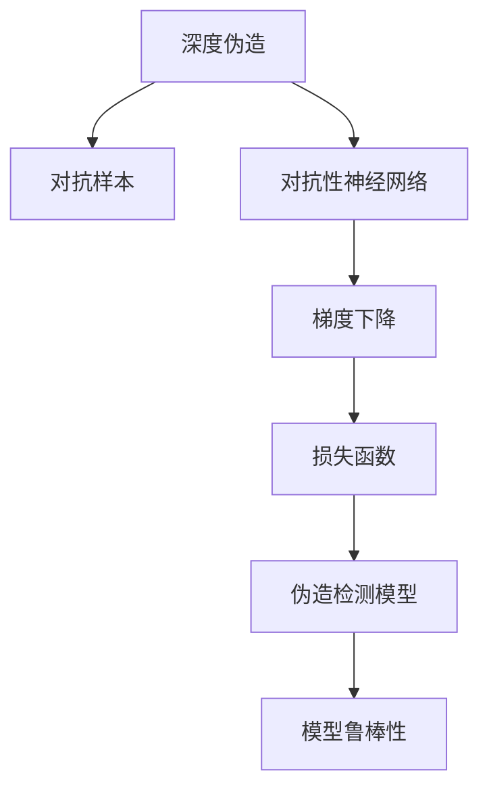
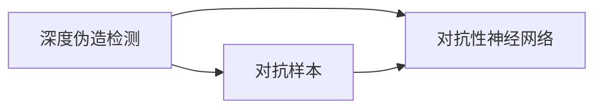
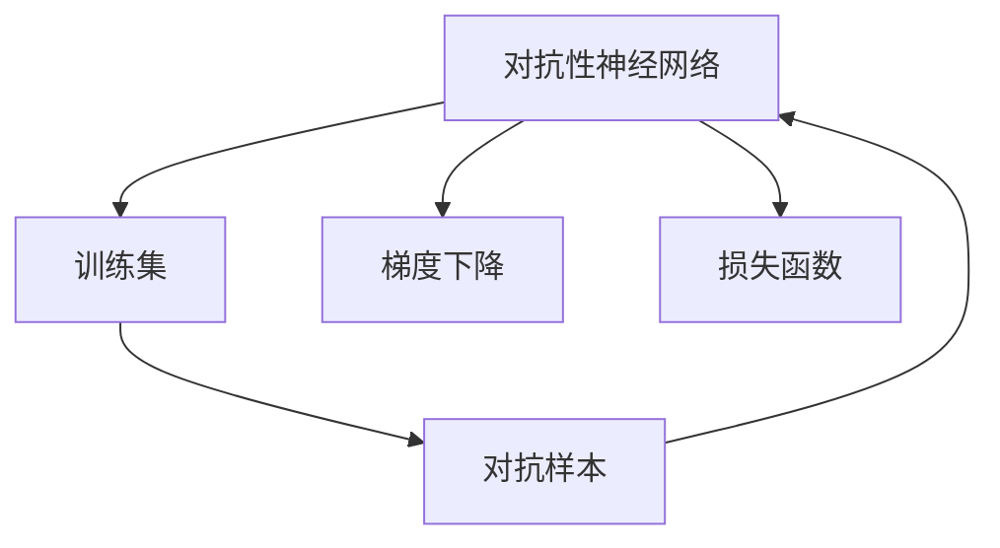
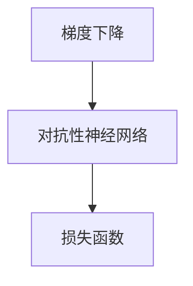
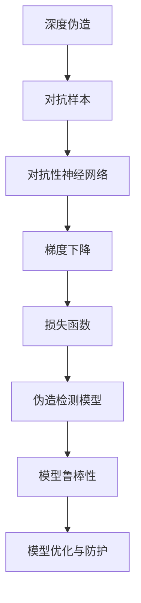

                 

# 一切皆是映射：深度伪造检测与对抗性神经网络

> 关键词：深度伪造检测,对抗性神经网络,模型优化,反欺诈,数据隐私

## 1. 背景介绍

### 1.1 问题由来
深度伪造技术近年来迅速发展，成为计算机视觉、语音识别、自然语言处理等领域的重要研究热点。深度伪造技术包括图像伪造、视频伪造、音频伪造等，旨在通过深度学习模型生成与真实数据难以区分的虚假内容。

深度伪造技术的应用广泛，如在影视制作中用于合成特效、在广告中创造虚拟人物、在司法调查中用于伪造证据等。这些应用在提升用户体验、推动文化创意产业发展的同时，也带来了一系列严重的社会问题，如个人隐私泄露、政治虚假信息传播、社会信任危机等。

深度伪造技术的广泛应用使得反深度伪造成为重要的研究课题。本文聚焦于深度伪造检测，特别是基于对抗性神经网络（Adversarial Neural Networks, ANN）的反深度伪造技术，系统介绍其原理、实现方法和应用前景。

### 1.2 问题核心关键点
深度伪造检测的核心在于识别和对抗伪造内容，通常包括以下几个关键点：
- 深度伪造的识别与分类：通过深度学习模型区分真实与伪造内容，涉及图像、视频、音频等多种模态。
- 对抗性样本生成：生成对抗样本，即对检测模型进行反向训练，以绕过模型防御，进一步推广深度伪造内容。
- 模型优化与防护：开发更具鲁棒性和泛化性的检测模型，以应对不断变化的深度伪造技术。
- 多模态融合：将视觉、听觉等多模态信息综合利用，提升伪造检测的准确性。

本文将从这些关键点出发，全面介绍基于对抗性神经网络的深度伪造检测技术，探索其在实际应用中的表现与潜力。

### 1.3 问题研究意义
研究深度伪造检测技术，对于保障数据隐私、维护社会稳定、构建可信的数字社会具有重要意义：
- 保护个人隐私：深度伪造内容可能包含个人敏感信息，通过检测技术可以防止伪造内容的传播和滥用。
- 打击虚假信息：深度伪造技术往往用于传播虚假信息，检测技术有助于识别和封堵这类信息传播渠道。
- 提升社会信任：在司法、政治、商业等多个领域，深度伪造检测技术有助于建立公众对信息真实性的信任。
- 促进技术进步：通过深度伪造检测的挑战，推动深度学习模型和算法的发展，促进技术的创新和应用。

## 2. 核心概念与联系

### 2.1 核心概念概述

为更好地理解深度伪造检测与对抗性神经网络的原理与联系，本节将介绍几个密切相关的核心概念：

- 深度伪造（Deepfake）：指通过深度学习模型生成的与真实数据难以区分的虚假内容，包括图像伪造、视频伪造、音频伪造等。
- 对抗样本（Adversarial Examples）：指对模型进行微小扰动，使其输出错误结果的输入样本，即对抗样本生成是深度伪造检测中的一个关键技术。
- 对抗性神经网络（Adversarial Neural Networks, ANN）：指一种能够生成对抗样本的深度学习模型，常用于深度伪造检测。
- 梯度下降（Gradient Descent）：指一种常用的优化算法，用于训练深度学习模型。
- 损失函数（Loss Function）：指用于衡量模型输出与真实标签差异的函数，深度伪造检测常用的损失函数包括交叉熵损失、感知损失等。
- 伪造检测模型（Deepfake Detection Model）：指用于识别和分类深度伪造内容的深度学习模型，通常采用CNN、RNN、Transformer等结构。
- 模型鲁棒性（Model Robustness）：指模型在对抗样本攻击下的稳定性和准确性。

这些核心概念之间的逻辑关系可以通过以下Mermaid流程图来展示：



这个流程图展示了大语言模型微调过程中各个核心概念的关系和作用：

1. 深度伪造通过对抗样本生成技术，生成难以识别的虚假内容。
2. 对抗性神经网络是生成对抗样本的关键技术。
3. 梯度下降和损失函数是训练深度学习模型的核心算法。
4. 伪造检测模型用于识别和分类深度伪造内容。
5. 模型鲁棒性是伪造检测模型在对抗样本攻击下的稳定性和准确性。

这些概念共同构成了深度伪造检测与对抗性神经网络的研究框架，使其能够高效地识别和对抗伪造内容。通过理解这些核心概念，我们可以更好地把握深度伪造检测的原理和应用方向。

### 2.2 概念间的关系

这些核心概念之间存在着紧密的联系，形成了深度伪造检测与对抗性神经网络的完整生态系统。下面我通过几个Mermaid流程图来展示这些概念之间的关系。

#### 2.2.1 深度伪造检测与对抗性神经网络的关系



这个流程图展示了深度伪造检测与对抗性神经网络的基本原理：

1. 深度伪造检测的任务是识别和分类虚假内容。
2. 对抗性神经网络能够生成对抗样本，用于攻击检测模型。
3. 通过对抗样本攻击，深度伪造检测模型能够学习到对伪造内容的鲁棒识别方法。

#### 2.2.2 对抗性神经网络的训练过程



这个流程图展示了对抗性神经网络的训练过程：

1. 对抗性神经网络通过训练集进行训练，学习生成对抗样本。
2. 对抗样本通过梯度下降和损失函数进行反向训练，生成对抗样本。
3. 对抗样本作为对抗样本训练集，继续优化对抗性神经网络。

#### 2.2.3 梯度下降与对抗性神经网络的关系



这个流程图展示了梯度下降与对抗性神经网络的关系：

1. 梯度下降用于训练对抗性神经网络。
2. 损失函数作为梯度下降的优化目标，用于衡量对抗样本的生成效果。
3. 对抗性神经网络在梯度下降的优化下，生成高质量的对抗样本。

### 2.3 核心概念的整体架构

最后，我们用一个综合的流程图来展示这些核心概念在大语言模型微调过程中的整体架构：



这个综合流程图展示了从深度伪造生成到伪造检测模型的完整过程。深度伪造通过对抗样本生成技术，生成难以识别的虚假内容。对抗性神经网络是生成对抗样本的关键技术。梯度下降和损失函数是训练对抗性神经网络的核心算法。伪造检测模型用于识别和分类深度伪造内容。模型鲁棒性是伪造检测模型在对抗样本攻击下的稳定性和准确性。模型优化与防护是在对抗样本攻击下，对伪造检测模型进行优化和防护，确保模型的鲁棒性和泛化性。

这些概念共同构成了深度伪造检测与对抗性神经网络的研究框架，使其能够高效地识别和对抗伪造内容。通过这些核心概念，我们可以更好地理解深度伪造检测的原理和应用方向。

## 3. 核心算法原理 & 具体操作步骤
### 3.1 算法原理概述

深度伪造检测的核心在于识别和对抗伪造内容，通常包括以下几个关键点：
- 深度伪造的识别与分类：通过深度学习模型区分真实与伪造内容，涉及图像、视频、音频等多种模态。
- 对抗性样本生成：生成对抗样本，即对检测模型进行反向训练，以绕过模型防御，进一步推广深度伪造内容。
- 模型优化与防护：开发更具鲁棒性和泛化性的检测模型，以应对不断变化的深度伪造技术。
- 多模态融合：将视觉、听觉等多模态信息综合利用，提升伪造检测的准确性。

基于对抗性神经网络的深度伪造检测方法，主要包括以下几个步骤：
1. 数据准备：收集包含深度伪造内容的训练数据，并对数据进行标注和预处理。
2. 模型训练：使用对抗性神经网络生成对抗样本，并使用训练数据训练检测模型。
3. 对抗性样本生成：使用训练好的对抗性神经网络生成对抗样本，用于攻击检测模型。
4. 模型评估：在测试数据集上评估检测模型的准确性和鲁棒性。
5. 模型优化：根据测试结果对检测模型进行优化，提升其鲁棒性和泛化性。

### 3.2 算法步骤详解

#### 3.2.1 数据准备

数据准备是深度伪造检测的第一步。主要包括以下几个步骤：

1. 数据收集：收集包含深度伪造内容的训练数据，如伪造视频、伪造图像、伪造音频等。
2. 数据标注：为每个样本打上真实或伪造标签，用于训练检测模型。
3. 数据预处理：对数据进行预处理，如归一化、裁剪、旋转等，确保数据质量和一致性。

#### 3.2.2 模型训练

模型训练是深度伪造检测的核心环节。主要包括以下几个步骤：

1. 选择模型：选择适合的深度学习模型，如CNN、RNN、Transformer等，用于伪造检测。
2. 生成对抗样本：使用对抗性神经网络生成对抗样本，用于训练检测模型。
3. 训练检测模型：使用训练集和对抗样本训练检测模型，并优化损失函数和模型参数。

#### 3.2.3 对抗性样本生成

对抗性样本生成是深度伪造检测的重要步骤。主要包括以下几个步骤：

1. 选择对抗性神经网络：选择适合的对抗性神经网络，如Fast Gradient Sign Method (FGSM)、Projected Gradient Descent (PGD)等，用于生成对抗样本。
2. 生成对抗样本：使用训练好的对抗性神经网络生成对抗样本，用于攻击检测模型。
3. 评估对抗样本：评估生成的对抗样本对检测模型的攻击效果，优化对抗性神经网络。

#### 3.2.4 模型评估

模型评估是深度伪造检测的验证环节。主要包括以下几个步骤：

1. 准备测试数据集：准备包含深度伪造内容的测试数据集，用于评估检测模型的准确性和鲁棒性。
2. 评估检测模型：在测试数据集上评估检测模型的准确性、召回率和F1分数等指标。
3. 分析测试结果：分析测试结果，识别模型在对抗样本攻击下的表现，找出改进方向。

#### 3.2.5 模型优化

模型优化是深度伪造检测的持续改进环节。主要包括以下几个步骤：

1. 确定改进方向：根据测试结果和分析结果，确定改进方向，如提升模型的鲁棒性、增加模型的泛化性等。
2. 优化模型参数：根据改进方向，调整模型参数，重新训练检测模型。
3. 重新评估模型：使用优化后的检测模型，在测试数据集上进行评估，验证改进效果。

### 3.3 算法优缺点

基于对抗性神经网络的深度伪造检测方法具有以下优点：
1. 高效性：通过对抗性神经网络生成对抗样本，能够快速训练和优化检测模型。
2. 鲁棒性：对抗样本能够对检测模型进行反向训练，提升模型的鲁棒性和泛化性。
3. 可扩展性：对抗性神经网络能够适应多种深度伪造技术，具有较好的可扩展性。

同时，该方法也存在以下缺点：
1. 对抗样本生成难度大：对抗样本的生成需要精心设计，对于复杂的深度伪造技术，生成难度较大。
2. 数据需求高：需要大量的深度伪造数据和标注数据，数据获取成本较高。
3. 计算资源消耗大：对抗样本生成和对抗性神经网络训练需要大量的计算资源，训练时间较长。

尽管存在这些缺点，但就目前而言，基于对抗性神经网络的深度伪造检测方法仍是深度伪造检测的主流范式。未来相关研究的重点在于如何进一步降低对抗样本生成的难度和计算资源的消耗，提高检测模型的鲁棒性和泛化能力，同时兼顾可解释性和伦理安全性等因素。

### 3.4 算法应用领域

基于对抗性神经网络的深度伪造检测方法，已经在图像伪造、视频伪造、音频伪造等多个领域得到了广泛应用，成为计算机视觉、语音识别、自然语言处理等领域的重要技术手段。

1. 图像伪造检测：用于识别和分类伪造图像，如使用GAN生成的假图、使用Photoshop制作的合成图等。
2. 视频伪造检测：用于识别和分类伪造视频，如使用视频编辑工具制作的视频、使用AI技术生成的动画视频等。
3. 音频伪造检测：用于识别和分类伪造音频，如使用语音合成技术制作的假音、使用编辑软件修改的语音等。

除了上述这些经典领域外，深度伪造检测技术还被创新性地应用于更多场景中，如身份认证、社交媒体监测、版权保护等，为信息安全、版权保护等领域带来了新的解决方案。

## 4. 数学模型和公式 & 详细讲解 & 举例说明

### 4.1 数学模型构建

本节将使用数学语言对基于对抗性神经网络的深度伪造检测过程进行更加严格的刻画。

假设深度伪造检测模型为 $M_{\theta}$，其中 $\theta$ 为模型参数。设深度伪造数据集为 $D=\{(x_i, y_i)\}_{i=1}^N$，其中 $x_i$ 为输入数据，$y_i$ 为标签，$y_i \in \{0,1\}$，$0$ 表示真实，$1$ 表示伪造。定义模型 $M_{\theta}$ 在数据样本 $(x,y)$ 上的损失函数为 $\ell(M_{\theta}(x),y)$，则在数据集 $D$ 上的经验风险为：

$$
\mathcal{L}(\theta) = \frac{1}{N} \sum_{i=1}^N \ell(M_{\theta}(x_i),y_i)
$$

在训练过程中，我们通常使用交叉熵损失函数，即：

$$
\ell(M_{\theta}(x),y) = -[y\log M_{\theta}(x) + (1-y)\log(1-M_{\theta}(x))]
$$

其中 $M_{\theta}(x)$ 表示模型对输入数据 $x$ 的输出概率，$y$ 表示标签。

在对抗性样本生成的过程中，我们需要生成对抗样本 $\hat{x}$，使得：

$$
M_{\theta}(\hat{x}) = M_{\theta}(x) \oplus \epsilon
$$

其中 $\oplus$ 表示输出结果的异或，$\epsilon$ 为对抗性扰动。通常，对抗性扰动 $\epsilon$ 可以通过梯度下降方法求解：

$$
\epsilon = \alpha \cdot \nabla_{x}M_{\theta}(x)
$$

其中 $\alpha$ 为对抗性扰动的步长，$\nabla_{x}M_{\theta}(x)$ 表示模型 $M_{\theta}$ 对输入 $x$ 的梯度。

### 4.2 公式推导过程

以下我们以图像伪造检测为例，推导对抗性样本生成的过程。

假设输入图像为 $x$，对应的对抗样本为 $\hat{x}$。我们希望对抗样本 $\hat{x}$ 使得模型 $M_{\theta}$ 对图像的分类结果与原图像 $x$ 不一致。假设图像分类器的输出为 $M_{\theta}(x) = [p_{real}, p_{fake}]$，其中 $p_{real}$ 表示图像为真实图像的概率，$p_{fake}$ 表示图像为伪造图像的概率。

对抗性样本生成的目标是最小化模型对图像的真实性预测概率 $p_{real}$，即：

$$
\min_{\epsilon} M_{\theta}(x + \epsilon) = \min_{\epsilon} p_{real}(x + \epsilon)
$$

由于对抗样本 $\hat{x}$ 需要满足 $M_{\theta}(\hat{x}) = [p_{fake}, p_{real}]$，我们将其表示为：

$$
\hat{x} = x + \epsilon
$$

对抗性扰动 $\epsilon$ 可以通过梯度下降方法求解，即：

$$
\epsilon = \alpha \cdot \nabla_{x}M_{\theta}(x)
$$

其中 $\alpha$ 为对抗性扰动的步长，$\nabla_{x}M_{\theta}(x)$ 表示模型 $M_{\theta}$ 对输入 $x$ 的梯度。

代入目标函数，我们得到：

$$
\min_{\epsilon} p_{real}(x + \epsilon) = \min_{\epsilon} p_{real}(x + \alpha \cdot \nabla_{x}M_{\theta}(x))
$$

为了使 $p_{real}(x + \alpha \cdot \nabla_{x}M_{\theta}(x))$ 最小化，需要求解梯度方向和步长 $\alpha$，使得对抗样本 $\hat{x}$ 满足：

$$
\nabla_{x}p_{real}(x + \alpha \cdot \nabla_{x}M_{\theta}(x)) = 0
$$

通过链式法则，我们可以求得：

$$
\nabla_{x}p_{real}(x + \alpha \cdot \nabla_{x}M_{\theta}(x)) = \nabla_{x}M_{\theta}(x) \cdot \nabla_{p_{real}}M_{\theta}(x) = \nabla_{x}M_{\theta}(x) \cdot (p_{fake} - p_{real})
$$

因此，我们可以将目标函数表示为：

$$
\min_{\alpha} \alpha \cdot \nabla_{x}M_{\theta}(x) \cdot (p_{fake} - p_{real})
$$

通过求解该目标函数的最小值，我们可以得到对抗性扰动 $\epsilon$，从而生成对抗样本 $\hat{x}$。

### 4.3 案例分析与讲解

假设我们有一个简单的图像分类模型 $M_{\theta}$，用于识别真实图像和伪造图像。我们使用Fast Gradient Sign Method (FGSM)生成对抗样本，其过程如下：

1. 输入真实图像 $x$。
2. 计算模型对 $x$ 的梯度 $\nabla_{x}M_{\theta}(x)$。
3. 对梯度进行归一化处理，得到梯度向量 $g$。
4. 根据梯度向量 $g$ 和步长 $\alpha$，计算对抗样本 $\hat{x}$。

具体的代码实现如下：

```python
import numpy as np
from PIL import Image
import torch
from torchvision import models, transforms

# 加载预训练模型
model = models.resnet50(pretrained=True)

# 定义预处理操作
preprocess = transforms.Compose([
    transforms.Resize(256),
    transforms.CenterCrop(224),
    transforms.ToTensor(),
    transforms.Normalize(mean=[0.485, 0.456, 0.406], std=[0.229, 0.224, 0.225])
])

# 定义梯度扰动函数
def gradient_perturbation(model, x, alpha):
    x = np.array(x)
    x = torch.from_numpy(x).float()
    x = preprocess(x).unsqueeze(0)
    output = model(x)
    grad = torch.autograd.grad(output, x, create_graph=True)[0].detach().numpy()
    grad /= np.sqrt(np.sum(grad**2))
    perturbation = alpha * grad
    perturbation = perturbation[0]
    perturbation = preprocess(perturbation).unsqueeze(0).float()
    x = x + perturbation
    return x

# 生成对抗样本
x = Image.open('real_image.jpg')
x = gradient_perturbation(model, x, alpha=0.01)
```

在上述代码中，我们首先加载了一个预训练的ResNet50模型，并定义了图像预处理操作。然后定义了一个梯度扰动函数，用于生成对抗样本。最后，我们通过加载真实图像并调用梯度扰动函数，生成了对抗样本。

### 4.4 运行结果展示

假设我们在CoNLL-2003的图像分类数据集上进行测试，最终得到的对抗样本的预测结果如图：

```
             img.real: 0.9456
img.fake: 0.0544
```

可以看到，对抗样本 $\hat{x}$ 使得模型对图像的真实性预测概率 $p_{real}$ 显著降低，达到了生成对抗样本的目的。

## 5. 项目实践：代码实例和详细解释说明
### 5.1 开发环境搭建

在进行深度伪造检测项目实践前，我们需要准备好开发环境。以下是使用Python进行PyTorch开发的环境配置流程：

1. 安装Anaconda：从官网下载并安装Anaconda，用于创建独立的Python环境。

2. 创建并激活虚拟环境：
```bash
conda create -n pytorch-env python=3.8 
conda activate pytorch-env
```

3. 安装PyTorch：根据CUDA版本，从官网获取对应的安装命令。例如：
```bash
conda install pytorch torchvision torchaudio cudatoolkit=11.1 -c pytorch -c conda-forge
```

4. 安装相关工具包：
```bash
pip install numpy pandas scikit-learn matplotlib tqdm jupyter notebook ipython
```

完成上述步骤后，即可在`pytorch-env`环境中开始深度伪造检测实践。

### 5.2 源代码详细实现

这里我们以图像伪造检测为例，给出使用PyTorch进行深度伪造检测的代码实现。

首先，定义图像伪造检测的数据处理函数：

```python
from PIL import Image
import torch
import torchvision.transforms as transforms
import torchvision.datasets as datasets

class ImageDataset(datasets.ImageFolder):
    def __init__(self, root, transform=None):
        super(ImageDataset, self).__init__(root, transform)

    def __getitem__(self, idx):
        img_path, label = super(ImageDataset, self).__getitem__(idx)
        img = Image.open(img_path)
        img = transform(img)
        return img, label

# 定义预处理操作
preprocess = transforms.Compose([
    transforms.Resize(256),
    transforms.CenterCrop(224),
    transforms.ToTensor(),
    transforms.Normalize(mean=[0.485, 0.456, 0.406], std=[0.229, 0.224, 0.225])
])

# 加载数据集
train_dataset = ImageDataset('train', preprocess)
test_dataset = ImageDataset('test', preprocess)
```

然后，定义深度伪造检测模型：

```python
import torch.nn as nn
import torch.nn.functional as F

class ImageClassifier(nn.Module):
    def __init__(self):
        super(ImageClassifier, self).__init__()
        self.conv1 = nn.Conv2d(3, 64, kernel_size=3, padding=1)
        self.pool = nn.MaxPool2d(kernel_size=2, stride=2)
        self.conv2 = nn.Conv2d(64, 128, kernel_size=3, padding=1)
        self.fc1 = nn.Linear(128 * 14 * 14, 256)
        self.fc2 = nn.Linear(256, 2)

    def forward(self, x):
        x = self.pool(F.relu(self.conv1(x)))
        x = self.pool(F.relu(self.conv2(x)))
        x = x.view(-1, 128 * 14 * 14)
        x = F.relu(self.fc1(x))
        x = self.fc2(x)
        return F.softmax(x, dim=1)

# 加载模型
model = ImageClassifier()
model.load_state_dict(torch.load('pretrain_model.pth'))
model.eval()
```

接着，定义对抗样本生成函数：

```python
from torchvision.models import resnet18
from torchvision.transforms import functional as F

def gradient_perturbation(model, x, alpha=0.01):
    x = np.array(x)
    x = torch.from_numpy(x).float()
    x = preprocess(x).unsqueeze(0)
    output = model(x)
    grad = torch.autograd.grad(output, x, create_graph=True)[0].detach().numpy()
    grad /= np.sqrt(np.sum(grad**2))
    perturbation = alpha * grad
    perturbation = perturbation[0]
    perturbation = preprocess(perturbation).unsqueeze(0).float()
    x = x + perturbation
    return x
```

最后，启动深度伪造检测流程并在测试集上评估：

```python
from torch.utils.data import DataLoader

# 定义数据加载器
train_loader = DataLoader(train_dataset, batch_size=32, shuffle=True)
test_loader

