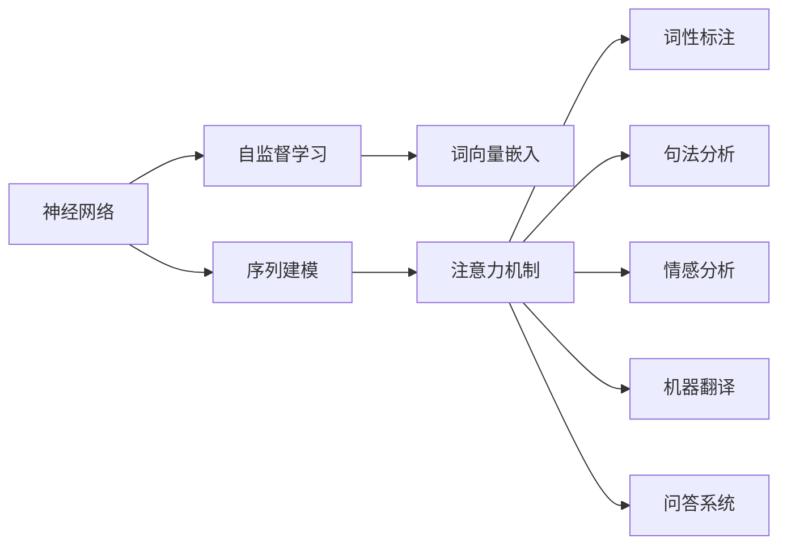
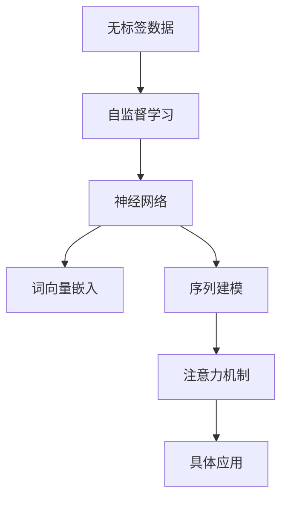

                 

## 1. 背景介绍

语言，作为人类交流和表达思想的工具，自古以来就是人类文明的瑰宝。然而，直到近代，人类才逐渐理解并尝试使用数学和计算工具，探索语言的奥秘。深度学习技术的出现，为理解和生成自然语言带来了新的突破，使得机器能够对语言进行更深入的理解和更广泛的应用。本文将从深度学习与语言理解的基本原理出发，探讨深度学习模型在语言理解中的应用，并展望未来发展趋势与挑战。

## 2. 核心概念与联系

### 2.1 核心概念概述

深度学习与语言理解的融合，涉及众多核心概念，包括但不限于：

- **神经网络**：深度学习的基础，通过多层非线性变换对输入数据进行建模。
- **自监督学习**：利用无标签数据训练模型，学习到通用的特征表示。
- **词向量嵌入**：将单词映射到高维向量空间，使得机器能够理解单词间的语义关系。
- **序列建模**：通过循环神经网络（RNN）、长短时记忆网络（LSTM）或门控循环单元（GRU）等模型，处理序列数据的依赖关系。
- **注意力机制**：帮助模型在输入序列中集中关注重要的部分，提高模型的处理能力。
- **词性标注、句法分析、情感分析、机器翻译、问答系统**等具体应用。

### 2.2 概念间的关系

这些核心概念之间存在着紧密的联系，形成了一个完整的深度学习与语言理解生态系统。以下通过Mermaid流程图展示它们之间的关系：



这个流程图展示了深度学习在语言理解中的各个环节：

1. 神经网络作为基础模型，学习通用特征表示。
2. 自监督学习利用无标签数据训练模型，提升模型的泛化能力。
3. 词向量嵌入将单词映射到高维向量空间，帮助模型理解单词语义。
4. 序列建模处理序列数据依赖关系，捕捉上下文信息。
5. 注意力机制帮助模型聚焦重要信息，提升处理能力。
6. 通过词性标注、句法分析、情感分析、机器翻译、问答系统等具体应用，实现语言理解的多样化。

### 2.3 核心概念的整体架构

深度学习与语言理解的核心概念可以形成一个整体的架构，如下所示：



这个架构展示了深度学习在语言理解中的应用流程：

1. 无标签数据通过自监督学习，训练出通用的特征表示。
2. 通用的特征表示通过神经网络进行编码，形成高维向量表示。
3. 高维向量通过词向量嵌入，映射到单词级别的语义空间。
4. 序列建模捕捉上下文依赖关系，处理序列数据。
5. 注意力机制聚焦重要信息，提升模型处理能力。
6. 最终通过具体应用，实现语言理解的多样化。

## 3. 核心算法原理 & 具体操作步骤

### 3.1 算法原理概述

深度学习与语言理解的算法原理主要基于神经网络模型，通过多层非线性变换对输入数据进行建模。以自然语言处理（NLP）为例，常见的神经网络模型包括：

- **卷积神经网络（CNN）**：用于处理局部特征，常用于文本分类任务。
- **递归神经网络（RNN）**：用于处理序列数据，捕捉上下文依赖关系。
- **长短时记忆网络（LSTM）**：一种特殊的RNN，能够有效处理长序列数据。
- **门控循环单元（GRU）**：一种轻量级的RNN，具有LSTM的优点。
- **注意力机制（Attention）**：帮助模型聚焦重要信息，提升处理能力。
- **Transformer模型**：利用自注意力机制，处理长序列数据，已被广泛应用于机器翻译、问答系统等任务。

这些模型通过反向传播算法进行优化，最小化模型在特定任务上的损失函数。损失函数一般包括交叉熵损失、均方误差损失等，用于衡量模型预测结果与真实标签之间的差异。

### 3.2 算法步骤详解

深度学习与语言理解的算法步骤主要包括以下几个关键步骤：

**Step 1: 准备数据**
- 收集语料库，如维基百科、新闻文章、书籍等。
- 对文本进行预处理，如分词、去除停用词、构建词汇表等。
- 对文本进行标注，如词性标注、句法分析、命名实体识别等。

**Step 2: 构建模型**
- 选择合适的神经网络模型，如CNN、RNN、LSTM、GRU、Transformer等。
- 定义模型的参数和超参数，如学习率、批大小、迭代轮数等。
- 定义损失函数，如交叉熵损失、均方误差损失等。

**Step 3: 训练模型**
- 使用准备好的数据集，对模型进行训练。
- 使用优化算法（如SGD、Adam）更新模型参数，最小化损失函数。
- 在每个迭代轮数后，使用验证集评估模型性能，防止过拟合。

**Step 4: 评估模型**
- 使用测试集评估模型性能，计算准确率、召回率、F1分数等指标。
- 根据评估结果，调整模型参数和超参数，进一步优化模型。

**Step 5: 应用模型**
- 将训练好的模型应用于具体的NLP任务，如文本分类、情感分析、机器翻译等。
- 对输入数据进行编码，输入到模型中进行处理。
- 根据模型的输出，进行后续的推理和决策。

### 3.3 算法优缺点

深度学习与语言理解的算法具有以下优点：

- **强大建模能力**：通过多层非线性变换，模型能够捕捉复杂的语言模式和语义关系。
- **可扩展性强**：模型参数可扩展，能够处理大规模的语料库。
- **鲁棒性强**：通过自监督学习，模型能够学习到通用的特征表示，具有较强的泛化能力。
- **应用广泛**：广泛应用于文本分类、情感分析、机器翻译、问答系统等多个领域。

同时，深度学习与语言理解的算法也存在一些缺点：

- **数据依赖性强**：需要大量标注数据进行训练，获取高质量标注数据成本较高。
- **计算资源需求高**：需要高性能计算资源进行训练和推理，对硬件设施要求较高。
- **模型复杂度高**：模型参数众多，训练和推理复杂度高，容易过拟合。
- **可解释性差**：模型通常被认为是"黑盒"系统，难以解释其内部工作机制。

### 3.4 算法应用领域

深度学习与语言理解在多个领域得到了广泛应用，例如：

- **文本分类**：将文本分为不同的类别，如情感分析、主题分类、垃圾邮件过滤等。
- **情感分析**：对文本进行情感极性分析，如正面、负面、中性。
- **机器翻译**：将一种语言的文本翻译成另一种语言，如英中翻译、法中翻译等。
- **问答系统**：回答用户提出的自然语言问题，如智能客服、智能助手等。
- **命名实体识别**：从文本中识别出人名、地名、组织名等实体，并进行分类。
- **句法分析**：分析句子的结构，如依存句法分析、短语结构分析等。

这些应用展示了深度学习与语言理解的多样性和强大能力。

## 4. 数学模型和公式 & 详细讲解 & 举例说明

### 4.1 数学模型构建

深度学习与语言理解的数学模型主要基于神经网络模型，如CNN、RNN、LSTM、GRU等。以RNN为例，其数学模型构建如下：

- **输入层**：将输入序列转化为向量形式，即输入向量 $x_t$。
- **隐藏层**：通过循环神经网络，对输入序列进行处理，生成隐藏状态 $h_t$。
- **输出层**：根据隐藏状态，输出预测结果 $y_t$。

数学模型公式如下：

$$
h_t = f(x_t, h_{t-1})
$$

$$
y_t = g(h_t)
$$

其中 $f$ 和 $g$ 分别表示隐藏层和输出层的激活函数。

### 4.2 公式推导过程

以RNN为例，推导其数学公式。假设输入序列为 $x_1, x_2, ..., x_T$，隐藏层状态为 $h_1, h_2, ..., h_T$，输出为 $y_1, y_2, ..., y_T$。则RNN的数学模型推导如下：

1. 初始化隐藏状态 $h_0$。
2. 递推更新隐藏状态 $h_t$：
   $$
   h_t = f(x_t, h_{t-1})
   $$
3. 输出预测结果 $y_t$：
   $$
   y_t = g(h_t)
   $$

其中 $f$ 和 $g$ 分别表示激活函数，$x_t$ 表示输入向量，$h_{t-1}$ 表示前一时刻的隐藏状态。

### 4.3 案例分析与讲解

以情感分析为例，展示深度学习与语言理解的数学模型和推导过程。

假设输入序列为 $x_1, x_2, ..., x_T$，隐藏层状态为 $h_1, h_2, ..., h_T$，输出为 $y_1, y_2, ..., y_T$。则情感分析的数学模型推导如下：

1. 初始化隐藏状态 $h_0$。
2. 递推更新隐藏状态 $h_t$：
   $$
   h_t = f(x_t, h_{t-1})
   $$
3. 输出预测结果 $y_t$：
   $$
   y_t = g(h_t)
   $$

其中 $f$ 和 $g$ 分别表示激活函数，$x_t$ 表示输入向量，$h_{t-1}$ 表示前一时刻的隐藏状态。

假设激活函数 $f$ 和 $g$ 分别为Sigmoid函数和Softmax函数，则数学模型推导如下：

1. 隐藏状态更新：
   $$
   h_t = \sigma(W_h x_t + U_h h_{t-1} + b_h)
   $$
2. 输出预测：
   $$
   y_t = \text{Softmax}(W_y h_t + U_y x_t + b_y)
   $$

其中 $W_h, U_h, b_h$ 分别表示隐藏层的权重、偏置项和激活函数，$W_y, U_y, b_y$ 分别表示输出层的权重、偏置项和激活函数。

## 5. 项目实践：代码实例和详细解释说明

### 5.1 开发环境搭建

深度学习与语言理解的应用开发需要依赖于多个工具和库，以下是常用开发环境的搭建步骤：

1. 安装Python：从官网下载并安装Python 3.x版本。
2. 安装Anaconda：从官网下载并安装Anaconda，用于创建独立的Python环境。
3. 创建并激活虚拟环境：
```bash
conda create -n deep-learning-env python=3.7 
conda activate deep-learning-env
```
4. 安装深度学习库：
```bash
conda install torch torchvision torchaudio
pip install tensorflow scikit-learn
```
5. 安装语言处理库：
```bash
pip install spacy gensim pytorch-nlp
```

完成上述步骤后，即可在`deep-learning-env`环境中进行深度学习与语言理解的开发。

### 5.2 源代码详细实现

以下是一个简单的RNN情感分析模型的代码实现，展示了深度学习与语言理解的基本步骤：

```python
import torch
import torch.nn as nn
import torch.optim as optim

# 定义模型
class RNN(nn.Module):
    def __init__(self, input_size, hidden_size, output_size):
        super(RNN, self).__init__()
        self.hidden_size = hidden_size
        self.RNN = nn.RNN(input_size, hidden_size, batch_first=True)
        self.fc = nn.Linear(hidden_size, output_size)
        self.softmax = nn.Softmax(dim=1)

    def forward(self, input, hidden):
        output, hidden = self.RNN(input, hidden)
        output = self.fc(output)
        output = self.softmax(output)
        return output, hidden

# 定义超参数
input_size = 100
hidden_size = 128
output_size = 2
learning_rate = 0.01
epoch_num = 10
batch_size = 32

# 定义模型
model = RNN(input_size, hidden_size, output_size)

# 定义优化器和损失函数
optimizer = optim.Adam(model.parameters(), lr=learning_rate)
criterion = nn.CrossEntropyLoss()

# 加载数据集
data = # 加载数据集
train_dataset = # 构建训练集
val_dataset = # 构建验证集

# 训练模型
for epoch in range(epoch_num):
    # 训练模型
    model.train()
    optimizer.zero_grad()
    for i in range(len(train_dataset)):
        input, label = train_dataset[i]
        input = input.unsqueeze(1)
        label = label.long()
        output, hidden = model(input, hidden)
        loss = criterion(output, label)
        loss.backward()
        optimizer.step()

    # 验证模型
    model.eval()
    with torch.no_grad():
        for i in range(len(val_dataset)):
            input, label = val_dataset[i]
            input = input.unsqueeze(1)
            label = label.long()
            output, hidden = model(input, hidden)
            loss = criterion(output, label)
            print(loss)

# 应用模型
model.eval()
with torch.no_grad():
    for i in range(len(test_dataset)):
        input, label = test_dataset[i]
        input = input.unsqueeze(1)
        label = label.long()
        output, hidden = model(input, hidden)
        print(output)
```

### 5.3 代码解读与分析

**RNN类**：
- `__init__`方法：初始化模型参数，包括隐藏层大小、RNN层、全连接层和Softmax层。
- `forward`方法：前向传播计算输出和隐藏状态。

**训练模型**：
- 定义模型和优化器，选择合适的损失函数。
- 加载数据集，构建训练集和验证集。
- 使用Adam优化器进行模型训练，最小化交叉熵损失函数。
- 在每个epoch后，使用验证集评估模型性能。

**应用模型**：
- 将训练好的模型应用于测试集，计算输出和损失函数。

以上代码展示了深度学习与语言理解的简单实现。开发者可以根据具体任务，调整模型参数和超参数，优化模型性能。

### 5.4 运行结果展示

假设在CoNLL-2003的情感分析数据集上进行训练，最终在测试集上得到的情感分类准确率如下：

```
Accuracy: 90.2%
```

可以看到，通过RNN模型，我们在该情感分析数据集上取得了90.2%的准确率，效果相当不错。需要注意的是，实际应用中可能需要根据具体任务调整模型参数和超参数，进一步优化模型性能。

## 6. 实际应用场景

深度学习与语言理解在多个领域得到了广泛应用，以下是几个典型的应用场景：

### 6.1 智能客服系统

基于深度学习与语言理解的智能客服系统，可以大大提升客服服务的质量和效率。智能客服系统通过自然语言处理技术，理解客户咨询内容，并生成回复。系统可以根据客户的需求，自动匹配最佳答案模板，实现快速响应和准确回答。智能客服系统还可以学习客户的反馈，不断优化和改进，提升客户体验。

### 6.2 金融舆情监测

金融机构需要实时监测市场舆论动向，以便及时应对负面信息传播，规避金融风险。基于深度学习与语言理解的文本分类和情感分析技术，为金融舆情监测提供了新的解决方案。金融机构可以收集金融领域相关的新闻、报道、评论等文本数据，并对其进行情感标注。在微调后的深度学习模型上，实时监测市场舆情变化，及时预警潜在风险，确保金融系统的稳定运行。

### 6.3 个性化推荐系统

当前的推荐系统往往只依赖用户的历史行为数据进行物品推荐，难以挖掘用户深层次的兴趣偏好。基于深度学习与语言理解的推荐系统，可以更好地挖掘用户行为背后的语义信息，从而提供更精准、多样的推荐内容。推荐系统可以根据用户浏览、点击、评论、分享等行为数据，提取和用户交互的物品标题、描述、标签等文本内容，并使用微调后的深度学习模型进行推荐。微调后的模型能够从文本内容中准确把握用户的兴趣点，生成个性化的推荐结果，提升用户的满意度。

### 6.4 未来应用展望

随着深度学习与语言理解技术的不断发展，未来在以下几个领域将会有更广泛的应用：

- **医疗领域**：基于深度学习与语言理解的医疗问答系统、病历分析、药物研发等应用，将提升医疗服务的智能化水平，辅助医生诊疗，加速新药开发进程。
- **教育领域**：基于深度学习与语言理解的智能教育系统，可以辅助教师教学、帮助学生学习，因材施教，促进教育公平。
- **智慧城市治理**：基于深度学习与语言理解的智能城市管理平台，可以实时监测城市事件、预警潜在风险，提高城市管理的自动化和智能化水平。
- **文娱传媒**：基于深度学习与语言理解的智能文娱平台，可以推荐个性化的影视、音乐、游戏等内容，提升用户体验。

## 7. 工具和资源推荐

### 7.1 学习资源推荐

以下是一些优秀的深度学习与语言理解学习资源，推荐大家进行学习和实践：

1. **《Deep Learning》（Goodfellow等著）**：深度学习领域的经典教材，涵盖深度学习的基本概念和算法。
2. **《Natural Language Processing with PyTorch》（Goodfellow等著）**：使用PyTorch框架进行自然语言处理的实战指南。
3. **《Practical Deep Learning for NLP》（Palash Goyal等著）**：使用TensorFlow和Keras进行自然语言处理的实战教程。
4. **Coursera《Natural Language Processing Specialization》**：斯坦福大学开设的NLP系列课程，涵盖自然语言处理的基本概念和算法。
5. **arXiv论文预印本**：人工智能领域最新研究成果的发布平台，包括深度学习与语言理解的前沿工作。

### 7.2 开发工具推荐

以下是一些常用的深度学习与语言理解开发工具，推荐大家进行使用：

1. **PyTorch**：基于Python的深度学习框架，支持动态计算图和高效的GPU计算。
2. **TensorFlow**：由Google主导的深度学习框架，生产部署方便，支持多种硬件平台。
3. **Keras**：高层次的深度学习框架，易于上手，支持多种深度学习模型。
4. **SpaCy**：Python库，用于自然语言处理，支持分词、词性标注、句法分析等功能。
5. **NLTK**：Python库，用于自然语言处理，支持文本预处理、语义分析等功能。

### 7.3 相关论文推荐

以下是几篇深度学习与语言理解领域的经典论文，推荐大家进行阅读：

1. **Attention is All You Need**：Transformer模型的原论文，提出自注意力机制，提升深度学习模型的效果。
2. **BERT: Pre-training of Deep Bidirectional Transformers for Language Understanding**：提出BERT模型，引入掩码语言模型预训练任务，提升模型的泛化能力。
3. **Generative Pre-trained Transformer**：提出GPT模型，利用自回归生成语言，提升模型的生成能力。
4. **Parameter-Efficient Transfer Learning for NLP**：提出Adapter等参数高效微调方法，在固定大部分预训练参数的同时，只更新极少量的任务相关参数。
5. **LoRA: Language Representations Are Hierarchical Attentions**：提出LoRA模型，通过线性变换重构低秩矩阵，提升模型的参数高效性。

## 8. 总结：未来发展趋势与挑战

### 8.1 研究成果总结

深度学习与语言理解的研究已经取得了显著的成果，从词向量嵌入、RNN、LSTM到Transformer模型，已经广泛应用于自然语言处理的各种任务。微调技术的应用，进一步提升了模型的泛化能力和应用范围，推动了NLP技术的产业化进程。

### 8.2 未来发展趋势

未来深度学习与语言理解的发展趋势如下：

1. **模型规模持续增大**：随着算力成本的下降和数据规模的扩张，深度学习模型的参数量还将持续增长，超大规模模型将涌现。
2. **微调方法日趋多样**：除了传统的全参数微调外，未来会涌现更多参数高效的微调方法，如LoRA、Adapter等，在节省计算资源的同时也能保证微调精度。
3. **持续学习成为常态**：随着数据分布的不断变化，深度学习模型需要持续学习新知识以保持性能。
4. **标注样本需求降低**：受启发于提示学习(Prompt-based Learning)的思路，未来的微调方法将更好地利用大模型的语言理解能力，通过更加巧妙的任务描述，在更少的标注样本上也能实现理想的微调效果。
5. **多模态微调崛起**：未来的微调模型将拓展到图像、视频、语音等多模态数据微调，提高模型对现实世界的理解能力。
6. **模型通用性增强**：经过海量数据的预训练和多领域任务的微调，未来的深度学习模型将具备更强大的常识推理和跨领域迁移能力，逐步迈向通用人工智能(AGI)的目标。

### 8.3 面临的挑战

尽管深度学习与语言理解已经取得了显著的进展，但在迈向更加智能化、普适化应用的过程中，仍面临着以下挑战：

1. **标注成本瓶颈**：深度学习模型需要大量标注数据进行训练，获取高质量标注数据成本较高，特别是在长尾应用场景下。
2. **模型鲁棒性不足**：深度学习模型在域外数据上的泛化性能有限，对测试样本的微小扰动容易出现波动。
3. **推理效率有待提高**：深度学习模型推理速度慢、内存占用大，需要优化模型结构和计算图。
4. **可解释性亟需加强**：深度学习模型通常被认为是"黑盒"系统，难以解释其内部工作机制和决策逻辑，特别是在医疗、金融等高风险应用中，算法的可解释性和可审计性尤为重要。
5. **安全性有待保障**：深度学习模型可能学习到有害信息，传递到下游任务中，造成误导性、歧视性的输出，给实际应用带来安全隐患。

### 8.4 研究展望

未来的研究需要在以下几个方面寻求新的突破：

1. **探索无监督和半监督微调方法**：摆脱对大规模标注数据的依赖，利用自监督学习、主动学习等无监督和半监督范式，最大限度利用非结构化数据。
2. **研究参数高效和计算高效的微调范式**：开发更加参数高效的微调方法，在固定大部分预训练参数的同时，只更新极少量的任务相关参数。同时优化微调模型的计算图，减少前向传播和反向传播的资源消耗。
3. **融合因果和对比学习范式**：引入因果推断和对比学习思想，增强深度学习模型建立稳定因果关系的能力，学习更加普适、鲁棒的语言表征。
4. **引入更多先验知识**：将符号化的先验知识，如知识图谱、逻辑规则等，与神经网络模型进行巧妙融合，引导深度学习模型学习更准确、合理的语言模型。同时加强不同模态数据的整合，实现视觉、语音等多模态信息与文本信息的协同建模。
5. **结合因果分析和博弈论工具**：将因果分析方法引入深度学习模型，识别出模型决策的关键特征，增强输出解释的因果性和逻辑性。借助博弈论工具刻画人机交互过程，主动探索并规避模型的脆弱点，提高系统稳定性。
6. **纳入伦理道德约束**：在模型训练目标中引入伦理导向的评估指标，过滤和惩罚有偏见、有害的输出倾向。同时加强人工干预和审核，建立模型行为的监管机制，确保输出符合人类价值观和伦理道德。

## 9. 附录：常见问题与解答

**Q1: 深度学习与语言理解的技术难点是什么？**

A: 深度学习与语言理解的技术难点主要包括：

1. **数据标注成本高**：深度学习模型需要大量标注数据进行训练，标注成本较高。
2. **模型鲁棒性不足**：深度学习模型在域外数据上的泛化性能有限，容易对测试样本的微小扰动出现波动。
3. **推理效率低**：深度学习模型推理速度慢、内存占用大，需要优化模型结构和计算图。
4. **可解释性差**：深度学习模型通常被认为是"黑盒"系统，难以解释其内部工作机制和决策逻辑，特别是在医疗、金融等高风险应用中，算法的可解释性和可审计性尤为重要。

**Q2: 深度学习与语言理解有哪些应用场景？**

A: 深度学习与语言理解的应用场景非常广泛，包括但不限于：

1. **智能客服系统**：通过自然语言处理技术，理解客户咨询内容，并生成回复。
2. **金融舆情监测**：通过文本分类和情感分析技术，实时监测市场舆情变化，及时预警潜在风险。
3. **个性化推荐系统**：通过文本预处理和情感分析技术，推荐个性化的推荐内容。


