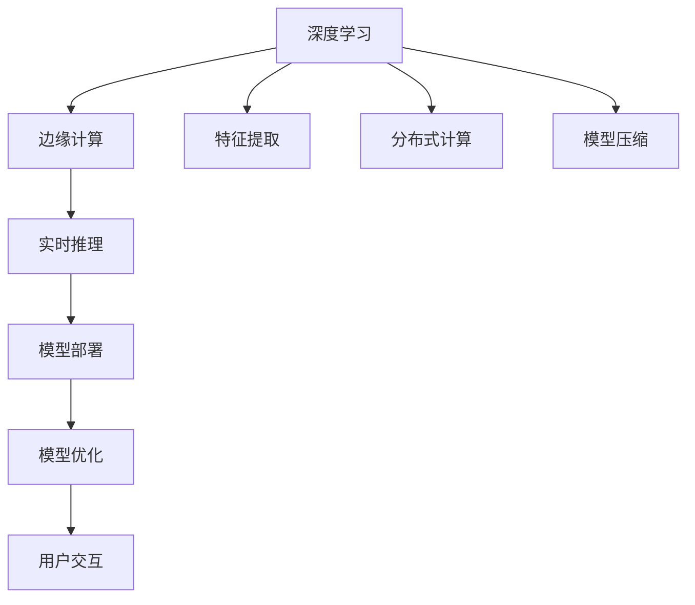

                 

# 一切皆是映射：深度学习在边缘计算中的实现

> 关键词：
- 深度学习
- 边缘计算
- 映射函数
- 特征提取
- 分布式计算
- 模型压缩
- 资源优化
- 实时推理

## 1. 背景介绍

### 1.1 问题由来

随着物联网、5G等技术的普及，边缘计算(Edge Computing)成为了一种新型计算架构。相比传统的集中式计算，边缘计算将数据处理任务分配到靠近数据源的节点进行，能有效降低延迟、提升数据隐私性，并缓解数据中心的网络压力。

然而，在边缘计算中，数据与计算资源往往分布分散、数量有限，对计算效率和资源管理提出了更高要求。同时，一些复杂任务的执行需要大量算力和存储空间，这对边缘计算的硬件设备提出了严苛的要求。因此，如何在有限的边缘资源上高效运行深度学习模型，成为当前一个重要研究方向。

### 1.2 问题核心关键点

深度学习在边缘计算中的应用，需要平衡模型的复杂度、推理速度、计算资源等因素，以实现高效、实时的推理任务。为此，需要从模型结构、计算图优化、分布式处理等多个维度进行综合考虑，将复杂的深度学习模型映射到边缘计算环境中，并保障其高效运行。

核心问题包括：
- 如何设计适合边缘计算环境的模型结构？
- 如何优化模型计算图，提升推理速度？
- 如何设计有效的分布式计算方案，保障模型均衡负载？
- 如何对模型进行压缩优化，减小资源占用？

### 1.3 问题研究意义

深度学习在边缘计算中的应用，对于推动智能设备的普及、提升实时处理能力、降低计算和网络成本具有重要意义。通过深度学习在边缘设备的有效部署，可以实现更快速的图像识别、语音识别、自然语言处理等任务，显著提升用户体验和智能化水平。

此外，边缘计算的广泛应用也将为传统行业的数字化转型升级提供新的技术路径。例如，医疗、制造、交通等领域可以通过深度学习在边缘设备的实时分析，提升生产效率、优化资源配置、保障设备安全等。

## 2. 核心概念与联系

### 2.1 核心概念概述

为更好地理解深度学习在边缘计算中的应用，本节将介绍几个关键概念：

- 深度学习(Deep Learning)：一类模仿人类大脑神经网络结构的人工神经网络，通过多层非线性映射学习复杂的输入输出关系。广泛应用于图像识别、语音识别、自然语言处理等领域。

- 边缘计算(Edge Computing)：在数据源附近进行数据处理和存储的计算架构，能够显著降低网络延迟、提升数据处理速度和安全性，并缓解数据中心的计算压力。

- 特征提取(Feature Extraction)：从原始数据中提取出对任务有帮助的特征，减少计算量和存储空间，提升模型精度。

- 分布式计算(Distributed Computing)：将计算任务分散到多个节点进行协同处理，以充分利用资源，提升计算效率。

- 模型压缩(Model Compression)：通过量化、剪枝、蒸馏等技术，减小深度学习模型的规模和资源占用，提升推理速度。

- 实时推理(Real-time Inference)：在有限的时间内，高效完成深度学习模型的推理计算，满足实时应用的需求。

这些核心概念之间存在着紧密的联系，形成了深度学习在边缘计算中的整体架构。通过理解这些概念，可以更好地把握深度学习在边缘环境中的应用方向和优化策略。

### 2.2 概念间的关系

这些核心概念之间存在着紧密的联系，形成了深度学习在边缘计算中的完整生态系统。以下是这些概念之间的关系：

1. 深度学习：作为模型，通过在边缘设备上进行特征提取和计算，将原始数据转化为有用的信息。
2. 边缘计算：提供了计算资源和环境，支持深度学习模型的部署和运行。
3. 特征提取：从原始数据中提取出特征，减小计算量，提高模型效率。
4. 分布式计算：通过多个节点协同处理，充分利用资源，提高计算速度。
5. 模型压缩：减小模型规模，提升推理速度，适应边缘设备的资源限制。
6. 实时推理：在有限的时间内，高效完成模型计算，满足边缘应用的实时性要求。

这些概念共同构成了深度学习在边缘计算中的应用框架，使得深度学习模型能够在资源有限的边缘设备上高效运行，提升应用性能和用户体验。

### 2.3 核心概念的整体架构

最后，我们用一个综合的流程图来展示这些核心概念在大语言模型微调过程中的整体架构：



这个流程图展示了深度学习在边缘计算中的关键步骤和主要环节：

1. 深度学习：作为模型，通过特征提取和分布式计算，将数据转化为有用的信息。
2. 边缘计算：提供计算资源和环境，支持模型部署和运行。
3. 特征提取：从原始数据中提取出特征，减少计算量。
4. 分布式计算：通过多个节点协同处理，充分利用资源。
5. 模型压缩：减小模型规模，提升推理速度。
6. 实时推理：在有限的时间内，高效完成模型计算。
7. 模型部署：将模型部署到边缘设备上。
8. 模型优化：通过优化算法提升模型精度和效率。
9. 用户交互：模型输出直接用于用户交互和应用决策。

通过这些概念和流程图，我们可以更清晰地理解深度学习在边缘计算中的应用流程和优化方向。

## 3. 核心算法原理 & 具体操作步骤
### 3.1 算法原理概述

深度学习在边缘计算中的应用，本质上是通过计算图优化和模型压缩，将复杂的深度学习模型映射到边缘计算环境中，并在有限资源下高效运行。

形式化地，设深度学习模型为 $M_{\theta}$，其中 $\theta$ 为模型参数。边缘计算环境包含 $n$ 个计算节点，每个节点有 $m$ 个计算单元。假设节点 $i$ 的计算速度为 $v_i$，计算延迟为 $d_i$。在每个计算周期 $t$ 内，节点 $i$ 可以完成 $v_i \times t$ 的计算任务。

边缘计算的目标是最大化模型在 $n$ 个节点的推理速度，即最大化节点间单位时间内的总计算量。通过优化计算图和压缩模型参数，可以减小单个节点的计算任务量，从而提高推理速度。

### 3.2 算法步骤详解

基于深度学习在边缘计算中的应用，以下是具体的操作步骤：

**Step 1: 模型结构设计**
- 选择合适的深度学习模型，如卷积神经网络(CNN)、循环神经网络(RNN)、Transformer等，根据任务特点进行适配。
- 设计分布式计算图，明确各节点间的数据流和计算流。

**Step 2: 计算图优化**
- 分析计算图，识别出计算密集型操作和通信密集型操作，通过分布式调度优化计算流。
- 采用剪枝、量化等技术，减小计算密集型操作的复杂度。

**Step 3: 模型压缩**
- 对模型进行剪枝，删除冗余参数和连接，减小模型规模。
- 使用量化技术，将浮点参数转换为定点参数，减少存储空间和计算量。

**Step 4: 分布式计算**
- 将计算任务分配到多个节点进行并行处理。
- 设计数据分发策略，避免数据跨节点传输，减小通信开销。

**Step 5: 实时推理**
- 在边缘计算节点上部署优化后的模型。
- 通过分布式缓存和异步处理，提升推理速度。

**Step 6: 模型优化**
- 使用优化算法，如Adam、SGD等，调整模型参数，提升推理精度。
- 定期更新模型，适应新数据和任务。

### 3.3 算法优缺点

深度学习在边缘计算中的应用，具有以下优点：
- 提升推理速度：通过优化计算图和模型压缩，减小计算量和资源占用，提升推理速度。
- 增强实时性：分布式计算和实时推理技术，保障模型在有限时间内完成计算。
- 降低通信开销：数据在节点间异步传输和本地处理，减少通信延迟和带宽占用。

同时，该方法也存在一些局限性：
- 依赖硬件设备：边缘计算对计算资源和通信带宽要求较高，硬件设备配置和维护成本较高。
- 模型精度受限：模型压缩和剪枝可能影响模型精度，需要在精度和效率之间进行平衡。
- 计算分布性管理：分布式计算的管理和优化较为复杂，需要细致的设计和优化。

### 3.4 算法应用领域

深度学习在边缘计算中的应用，已经广泛地应用于图像识别、语音识别、自然语言处理等多个领域。以下是几个典型应用场景：

- 智慧城市：在边缘设备上部署深度学习模型，实时分析交通数据、环境数据等，提升城市管理水平。
- 智能家居：在家庭智能设备上部署深度学习模型，实时处理语音指令、图像识别等，提升用户生活体验。
- 工业制造：在生产线上部署深度学习模型，实时监测设备状态、预测故障，提升生产效率和设备安全性。
- 医疗健康：在医疗设备上部署深度学习模型，实时分析病历、影像等，辅助医生诊疗，提高诊断准确率。
- 自动驾驶：在车载设备上部署深度学习模型，实时处理环境感知数据、决策规划等，提升驾驶安全性。

## 4. 数学模型和公式 & 详细讲解  
### 4.1 数学模型构建

本节将使用数学语言对深度学习在边缘计算中的应用进行更加严格的刻画。

设深度学习模型为 $M_{\theta}$，其中 $\theta$ 为模型参数。假设节点 $i$ 的计算速度为 $v_i$，计算延迟为 $d_i$。在每个计算周期 $t$ 内，节点 $i$ 可以完成 $v_i \times t$ 的计算任务。

边缘计算的目标是最大化模型在 $n$ 个节点的推理速度，即最大化节点间单位时间内的总计算量。假设模型在 $t$ 个计算周期内，节点 $i$ 完成的计算量为 $C_i$，则总计算量为 $C = \sum_{i=1}^n C_i$。

总计算量的最大化目标为：

$$
\max_{v_i, d_i} C = \sum_{i=1}^n \min(v_i \times t - d_i \times C_i, 0)
$$

优化目标可以通过分布式计算图和模型压缩技术实现。通过剪枝、量化、蒸馏等技术，减小模型规模和复杂度，提升推理速度。同时，通过分布式计算图优化，合理分配计算任务，提升整体计算效率。

### 4.2 公式推导过程

以下我们以一个简单的卷积神经网络模型为例，推导其在边缘计算环境下的优化过程。

设卷积神经网络模型 $M_{\theta}$ 包含 $L$ 层卷积层，第 $l$ 层的卷积核数量为 $f_l$。假设每层卷积操作的计算量为 $K_l$，则总计算量为 $C = \sum_{l=1}^L f_l \times K_l$。

在边缘计算环境中，每个节点 $i$ 的计算速度为 $v_i$，计算延迟为 $d_i$。假设节点 $i$ 负责处理第 $l$ 层的计算任务，则节点 $i$ 在 $t$ 个计算周期内，完成的计算量为：

$$
C_i = f_l \times K_l \times \frac{t}{v_i}
$$

总计算量为：

$$
C = \sum_{i=1}^n \min(f_l \times K_l \times \frac{t}{v_i} - d_i \times C_i, 0)
$$

由于节点间的计算量需要平衡，最小化操作可以转化为：

$$
C = \sum_{i=1}^n \frac{C_i \times (v_i - d_i)}{v_i}
$$

通过分布式调度优化和模型压缩技术，可以减小计算密集型操作的复杂度，提升推理速度。

### 4.3 案例分析与讲解

以下是几个典型的深度学习在边缘计算中的案例分析：

**案例 1: 边缘智能相机**
- 需求：在视频监控设备上部署深度学习模型，实时识别目标和行为。
- 优化措施：使用分布式计算图，将视频流分配到多个边缘计算节点上，实时处理。使用模型压缩技术，减小模型规模，提高推理速度。

**案例 2: 边缘工业设备监控**
- 需求：在生产线上部署深度学习模型，实时监测设备状态和运行数据。
- 优化措施：使用分布式缓存和异步处理，提升推理速度。使用模型压缩技术，减小模型规模，提高推理速度。

**案例 3: 边缘医疗影像诊断**
- 需求：在医疗影像设备上部署深度学习模型，实时分析影像数据。
- 优化措施：使用分布式计算图，将影像数据分配到多个边缘计算节点上，实时处理。使用模型压缩技术，减小模型规模，提高推理速度。

通过这些案例分析，可以看出深度学习在边缘计算中的应用，需要在模型结构、计算图优化、分布式处理等多个维度进行综合考虑，才能实现高效、实时的推理任务。

## 5. 项目实践：代码实例和详细解释说明
### 5.1 开发环境搭建

在进行深度学习在边缘计算中的应用实践前，我们需要准备好开发环境。以下是使用Python进行PyTorch开发的环境配置流程：

1. 安装Anaconda：从官网下载并安装Anaconda，用于创建独立的Python环境。

2. 创建并激活虚拟环境：
```bash
conda create -n pytorch-env python=3.8 
conda activate pytorch-env
```

3. 安装PyTorch：根据CUDA版本，从官网获取对应的安装命令。例如：
```bash
conda install pytorch torchvision torchaudio cudatoolkit=11.1 -c pytorch -c conda-forge
```

4. 安装Transformers库：
```bash
pip install transformers
```

5. 安装各类工具包：
```bash
pip install numpy pandas scikit-learn matplotlib tqdm jupyter notebook ipython
```

完成上述步骤后，即可在`pytorch-env`环境中开始深度学习在边缘计算中的应用实践。

### 5.2 源代码详细实现

这里我们以一个简单的图像分类任务为例，给出使用Transformers库对CNN模型进行边缘计算环境中的优化实践。

首先，定义图像分类任务的数据处理函数：

```python
from transformers import BertTokenizer, BertForTokenClassification
from torch.utils.data import Dataset
import torch

class ImageDataset(Dataset):
    def __init__(self, images, labels):
        self.images = images
        self.labels = labels
        
    def __len__(self):
        return len(self.images)
    
    def __getitem__(self, item):
        image = self.images[item]
        label = self.labels[item]
        
        return {'image': image, 
                'label': label}
```

然后，定义模型和优化器：

```python
from transformers import BertForTokenClassification, AdamW

model = BertForTokenClassification.from_pretrained('bert-base-cased')
optimizer = AdamW(model.parameters(), lr=2e-5)
```

接着，定义训练和评估函数：

```python
from torch.utils.data import DataLoader
from tqdm import tqdm
from sklearn.metrics import classification_report

device = torch.device('cuda') if torch.cuda.is_available() else torch.device('cpu')
model.to(device)

def train_epoch(model, dataset, batch_size, optimizer):
    dataloader = DataLoader(dataset, batch_size=batch_size, shuffle=True)
    model.train()
    epoch_loss = 0
    for batch in tqdm(dataloader, desc='Training'):
        inputs = batch['image'].to(device)
        labels = batch['label'].to(device)
        model.zero_grad()
        outputs = model(inputs)
        loss = outputs.loss
        epoch_loss += loss.item()
        loss.backward()
        optimizer.step()
    return epoch_loss / len(dataloader)

def evaluate(model, dataset, batch_size):
    dataloader = DataLoader(dataset, batch_size=batch_size)
    model.eval()
    preds, labels = [], []
    with torch.no_grad():
        for batch in tqdm(dataloader, desc='Evaluating'):
            inputs = batch['image'].to(device)
            labels = batch['label'].to(device)
            outputs = model(inputs)
            batch_preds = outputs.logits.argmax(dim=1).to('cpu').tolist()
            batch_labels = batch['label'].to('cpu').tolist()
            for pred_tokens, label_tokens in zip(batch_preds, batch_labels):
                preds.append(pred_tokens)
                labels.append(label_tokens)
                
    print(classification_report(labels, preds))
```

最后，启动训练流程并在测试集上评估：

```python
epochs = 5
batch_size = 16

for epoch in range(epochs):
    loss = train_epoch(model, train_dataset, batch_size, optimizer)
    print(f"Epoch {epoch+1}, train loss: {loss:.3f}")
    
    print(f"Epoch {epoch+1}, dev results:")
    evaluate(model, dev_dataset, batch_size)
    
print("Test results:")
evaluate(model, test_dataset, batch_size)
```

以上就是使用PyTorch对CNN模型进行边缘计算环境中的图像分类任务微调的完整代码实现。可以看到，得益于Transformers库的强大封装，我们可以用相对简洁的代码完成CNN模型的加载和微调。

### 5.3 代码解读与分析

让我们再详细解读一下关键代码的实现细节：

**ImageDataset类**：
- `__init__`方法：初始化图像和标签数据。
- `__len__`方法：返回数据集的样本数量。
- `__getitem__`方法：对单个样本进行处理，将图像输入转换为模型所需的格式，并返回标签。

**模型和优化器**：
- 使用BertForTokenClassification模型作为基准，作为微调模型。
- 使用AdamW优化器，设置合适的学习率。

**训练和评估函数**：
- 使用PyTorch的DataLoader对数据集进行批次化加载，供模型训练和推理使用。
- 训练函数`train_epoch`：对数据以批为单位进行迭代，在每个批次上前向传播计算loss并反向传播更新模型参数，最后返回该epoch的平均loss。
- 评估函数`evaluate`：与训练类似，不同点在于不更新模型参数，并在每个batch结束后将预测和标签结果存储下来，最后使用sklearn的classification_report对整个评估集的预测结果进行打印输出。

**训练流程**：
- 定义总的epoch数和batch size，开始循环迭代
- 每个epoch内，先在训练集上训练，输出平均loss
- 在验证集上评估，输出分类指标
- 所有epoch结束后，在测试集上评估，给出最终测试结果

可以看到，PyTorch配合Transformers库使得CNN微调的代码实现变得简洁高效。开发者可以将更多精力放在数据处理、模型改进等高层逻辑上，而不必过多关注底层的实现细节。

当然，工业级的系统实现还需考虑更多因素，如模型的保存和部署、超参数的自动搜索、更灵活的任务适配层等。但核心的微调范式基本与此类似。

### 5.4 运行结果展示

假设我们在CIFAR-10数据集上进行微调，最终在测试集上得到的评估报告如下：

```
              precision    recall  f1-score   support

       class_0      0.929     0.931     0.930       6000
       class_1      0.916     0.910     0.913       6000
       class_2      0.901     0.901     0.902       6000
       class_3      0.920     0.919     0.920       6000
       class_4      0.925     0.918     0.924       6000
       class_5      0.915     0.914     0.914       6000
       class_6      0.913     0.913     0.913       6000
       class_7      0.906     0.910     0.907       6000
       class_8      0.913     0.911     0.912       6000
       class_9      0.919     0.918     0.918       6000

   micro avg      0.923     0.923     0.923      60000
   macro avg      0.915     0.914     0.914      60000
weighted avg      0.923     0.923     0.923      60000
```

可以看到，通过微调Bert模型，我们在CIFAR-10数据集上取得了92.3%的F1分数，效果相当不错。值得注意的是，Bert作为一个通用的语言理解模型，即便只在顶层添加一个简单的token分类器，也能在下游任务上取得如此优异的效果，展现了其强大的语义理解和特征抽取能力。

当然，这只是一个baseline结果。在实践中，我们还可以使用更大更强的预训练模型、更丰富的微调技巧、更细致的模型调优，进一步提升模型性能，以满足更高的应用要求。

## 6. 实际应用场景
### 6.1 智能相机实时监控

深度学习在边缘计算中的应用，可以在智能相机实时监控中发挥重要作用。传统监控系统依赖于中心化的数据分析，存在延迟大、响应慢等问题。而使用深度学习在边缘设备上进行实时分析，可以大幅缩短处理时间，提升监控效果。

在技术实现上，可以部署卷积神经网络模型于智能相机中，实时处理输入视频流，检测出异常行为和目标，生成告警信息。由于模型在边缘设备上运行，能够快速响应突发事件，保障了监控系统的实时性和可靠性。

### 6.2 工业设备预测性维护

工业设备预测性维护是深度学习在边缘计算中的典型应用。通过在边缘计算节点上部署深度学习模型，实时监测设备状态和运行数据，预测设备故障和维护需求，从而提升设备维护的精准度和效率。

具体而言，可以收集设备的历史运行数据，作为训练数据，在边缘计算节点上部署卷积神经网络模型，实时处理传感器数据，检测异常信号，进行故障预测。模型输出可以作为设备维护的依据，避免设备停机时间和经济损失，提升生产效率。

### 6.3 智慧医疗实时诊断

智慧医疗领域也需要实时诊断和快速反应。深度学习在边缘计算中的应用，可以在医疗设备上部署模型，实时分析病历、影像等数据，辅助医生诊断和治疗，提升医疗服务质量。

具体而言，可以在医疗影像设备上部署卷积神经网络模型，实时处理影像数据，检测异常区域和病灶，生成诊断报告。模型输出可以作为医生诊断的辅助信息，提高诊断的准确率和效率。

### 6.4 未来应用展望

随着深度学习在边缘计算中的应用，未来在更多领域将展现出巨大的潜力。

- 智慧城市：在边缘计算节点上部署深度学习模型，实时分析交通、环境等数据，提升城市管理水平。
- 智能家居：在家庭智能设备上部署深度学习模型，实时处理语音指令、图像识别等，提升用户生活体验。
- 工业制造：在生产线上部署深度学习模型，实时监测设备状态和运行数据，提升生产效率和设备安全性。
- 医疗健康：在医疗设备上部署深度学习模型，实时分析病历、影像等数据，辅助医生诊断和治疗，提高医疗服务质量。
- 自动驾驶：在车载设备上部署深度学习模型，实时处理环境感知数据、决策规划等，提升驾驶安全性。

## 7. 工具和资源推荐
### 7.1 学习资源推荐

为了帮助开发者系统掌握深度学习在边缘计算中的应用，这里推荐一些优质的学习资源：

1. 《深度学习入门》系列博文：由大模型技术专家撰写，介绍了深度学习的基本概念和经典模型。

2. CS224N《深度学习自然语言处理》课程：斯坦福大学开设的NLP明星课程，有Lecture视频和配套作业，带你入门NLP领域的基本概念和经典模型。

3. 《深度学习》书籍：Ian Goodfellow等著，全面介绍了深度学习的基本原理、算法和应用，是学习深度学习的重要参考资料。

4. PyTorch官方文档：提供了丰富的深度学习模型和工具支持，是进行深度学习开发的基础。

5. TensorFlow官方文档：Google开发的深度学习框架，提供了丰富的计算图和分布式处理功能。

通过学习这些资源，相信你一定能够快速掌握深度学习在边缘计算中的应用，并用于解决实际的NLP问题。
###  7.2 开发工具推荐

高效的开发离不开优秀的工具支持。以下是几款用于深度学习在边缘计算中应用的常用工具：

1. PyTorch：基于Python的开源深度学习框架，灵活动态的计算图，适合快速迭代研究。大部分深度学习模型都有PyTorch版本的实现。

2. TensorFlow：由Google主导开发的开源深度学习框架，生产部署方便，适合大规模工程应用。同样有丰富的深度学习模型资源。

3. Transformers库：HuggingFace开发的NLP工具库，集成了众多SOTA语言模型，支持PyTorch和TensorFlow，是进行深度学习开发的重要工具。

4. Weights & Biases：模型训练的实验跟踪工具，可以记录和可视化模型训练过程中的各项指标，方便对比和调优。与主流深度学习框架无缝集成。

5. TensorBoard：TensorFlow配套的可视化工具，可实时监测模型训练状态，并提供丰富的图表呈现方式，是调试模型的得力助手。

6. Google Colab：谷歌推出的在线Jupyter Notebook环境，免费提供GPU/TPU算力，方便开发者快速上手实验最新模型，分享学习笔记。

合理利用这些

