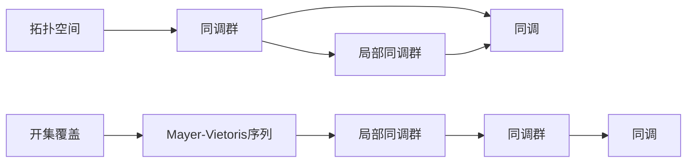
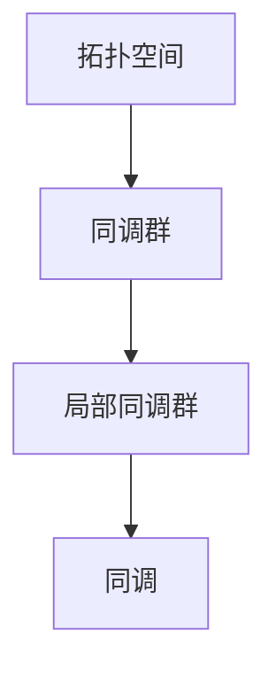
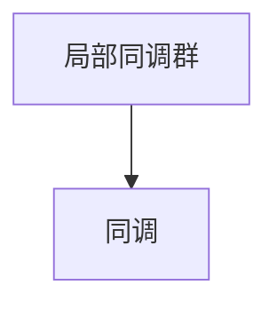
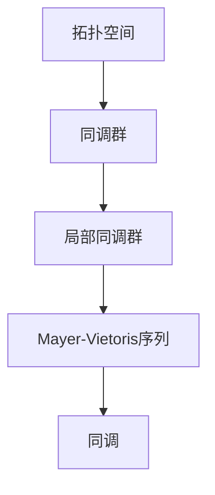

                 

## 1. 背景介绍

### 1.1 问题由来

在数学中，上同调（Cohomology）是一种研究代数结构（如环、模、代数等）中封闭元（closed elements）的代数理论。它是代数学中一种重要的研究工具，应用广泛，从拓扑学到代数几何，从代数拓扑学到数论，都有着深刻的理论基础和实际应用。

在代数拓扑中，Mayer-Vietoris序列是一种用来计算两个开集覆盖下的同调群之间的关联的同调序列。Mayer-Vietoris序列的构造基于Vietoris-Morita同调定理，这个定理揭示了当两个覆盖开集相交时，它们的局部同调群之间存在着一定的关联。Mayer-Vietoris序列则是将这些关联关系表达为一个同调序列，提供了计算复杂拓扑空间同调群的有力工具。

### 1.2 问题核心关键点

Mayer-Vietoris序列的构建依赖于以下几个关键概念：
1. 开集覆盖：定义在拓扑空间上的开集覆盖是指由一些开集组成的集合，它们的并集覆盖整个空间，而任意两个开集的交集也是开集。
2. 局部同调群：开集覆盖下，每个开集的局部同调群表示为$H^n(U_i)$，其中$U_i$是拓扑空间的一个开集，$n$是同调群的维度。
3. Mayer-Vietoris序列：对于任意两个覆盖开集$U_i$和$U_j$，Mayer-Vietoris序列描述了它们的同调群之间的关联关系，具体形式为$0 \to H^n(U_i \cap U_j) \to H^n(U_i) \oplus H^n(U_j) \to H^n(U_i \cup U_j) \to 0$。

Mayer-Vietoris序列的应用非常广泛，例如在拓扑空间的连通性研究、同调群计算、代数几何的奇点分析等。它提供了一种有效的方法来计算复杂拓扑空间的同调群，同时也有助于理解不同拓扑空间之间的关系。

### 1.3 问题研究意义

Mayer-Vietoris序列的深入研究对拓扑学和代数拓扑学具有重要意义。它不仅为复杂拓扑空间的同调群计算提供了一种有效工具，还揭示了拓扑空间中同调群的深层次结构。在代数几何中，Mayer-Vietoris序列也用于奇点分析，帮助研究代数簇上的奇异点行为。因此，Mayer-Vietoris序列的研究对于理解拓扑空间的本质，以及应用拓扑学方法解决实际问题具有重要价值。

## 2. 核心概念与联系

### 2.1 核心概念概述

在Mayer-Vietoris序列的研究中，涉及以下几个核心概念：

- 拓扑空间（Topological Space）：一个由点集和拓扑结构组成的集合，用于描述几何对象和它们之间的连续关系。
- 同调群（Cohomology Group）：描述拓扑空间上封闭元（closed elements）的代数结构，每个同调群对应一个整数维度。
- 同调（Cohomology）：同调是同调群的一种表示方式，它是局部同调群之间的线性组合。
- Mayer-Vietoris序列：基于局部同调群的线性组合，描述两个覆盖开集之间的同调群关联。

这些概念之间的逻辑关系可以通过以下Mermaid流程图来展示：



这个流程图展示了大同调理论的基本概念和它们之间的关系：

1. 拓扑空间由同调群描述，每个同调群由局部同调群构成。
2. 同调是局部同调群之间的线性组合，可以用于表示拓扑空间的同调性质。
3. Mayer-Vietoris序列基于局部同调群，描述了两个覆盖开集之间的同调关系。

### 2.2 概念间的关系

这些核心概念之间存在着紧密的联系，形成了同调理论的完整生态系统。下面我通过几个Mermaid流程图来展示这些概念之间的关系。

#### 2.2.1 拓扑空间的同调群



这个流程图展示了拓扑空间的同调群是如何通过局部同调群构成的。

#### 2.2.2 Mayer-Vietoris序列与局部同调群


这个流程图展示了Mayer-Vietoris序列如何基于局部同调群描述两个覆盖开集之间的同调关系。

#### 2.2.3 同调与局部同调群



这个流程图展示了同调群如何通过局部同调群的线性组合得到表示。

### 2.3 核心概念的整体架构

最后，我们用一个综合的流程图来展示这些核心概念在同调理论中的整体架构：



这个综合流程图展示了拓扑空间、同调群、局部同调群、Mayer-Vietoris序列以及同调的相互关系。通过这个架构图，我们可以更清晰地理解同调理论中各个概念的层次和作用。

## 3. 核心算法原理 & 具体操作步骤
### 3.1 算法原理概述

Mayer-Vietoris序列的构造基于Vietoris-Morita同调定理，该定理揭示了当两个覆盖开集相交时，它们的局部同调群之间存在着一定的关联。Mayer-Vietoris序列正是将这些关联关系表达为一个同调序列。

具体地，对于拓扑空间$X$和其开集覆盖$\mathcal{U} = \{U_i\}_{i \in I}$，Vietoris-Morita同调定理表明，$H^n(X)$可以通过局部同调群$H^n(U_i)$和交集同调群$H^n(U_i \cap U_j)$计算得到，即$H^n(X) \cong \bigoplus_{i \in I} H^n(U_i) / \bigoplus_{i,j} H^n(U_i \cap U_j)$。Mayer-Vietoris序列正是基于这一关系构造的。

### 3.2 算法步骤详解

以下是Mayer-Vietoris序列的具体构造步骤：

1. **选择开集覆盖**：首先选择拓扑空间$X$的开集覆盖$\mathcal{U} = \{U_i\}_{i \in I}$。
2. **计算局部同调群**：对每个开集$U_i$，计算其局部同调群$H^n(U_i)$。
3. **计算交集同调群**：对任意两个相交的开集$U_i$和$U_j$，计算它们的交集同调群$H^n(U_i \cap U_j)$。
4. **构造Mayer-Vietoris序列**：根据Vietoris-Morita同调定理，构造Mayer-Vietoris序列，形式为$0 \to H^n(U_i \cap U_j) \to H^n(U_i) \oplus H^n(U_j) \to H^n(U_i \cup U_j) \to 0$。

### 3.3 算法优缺点

Mayer-Vietoris序列的优点在于：
1. 提供了一种有效计算复杂拓扑空间同调群的方法。
2. 揭示了拓扑空间中同调群之间的关联关系，有助于理解拓扑空间的结构。

其缺点包括：
1. 计算复杂度较高，尤其是在高维情况下，需要大量的计算资源。
2. 对开集覆盖的选择依赖较大，不同的覆盖方式可能导致不同的同调群结果。
3. 序列中同调群的维度较高时，不易直接观察序列中同调群的性质。

### 3.4 算法应用领域

Mayer-Vietoris序列的应用非常广泛，涵盖以下几个主要领域：

1. 拓扑空间的同调群计算：利用Mayer-Vietoris序列计算复杂拓扑空间的同调群，提供了强大的理论工具。
2. 代数几何的奇点分析：在代数簇上，Mayer-Vietoris序列用于奇点的分析，帮助研究奇点行为。
3. 拓扑空间的同伦分析：通过Mayer-Vietoris序列研究拓扑空间的同伦性质，揭示拓扑空间的深层次结构。
4. 同调群的代数表示：Mayer-Vietoris序列提供了同调群的代数表示方法，便于进行代数操作和分析。

## 4. 数学模型和公式 & 详细讲解  
### 4.1 数学模型构建

在数学模型构建中，我们需要考虑拓扑空间$X$和其开集覆盖$\mathcal{U} = \{U_i\}_{i \in I}$。对于每个开集$U_i$，定义局部同调群$H^n(U_i)$。对于任意两个相交的开集$U_i$和$U_j$，计算它们的交集同调群$H^n(U_i \cap U_j)$。

Mayer-Vietoris序列的形式为：
$$
0 \to H^n(U_i \cap U_j) \to H^n(U_i) \oplus H^n(U_j) \to H^n(U_i \cup U_j) \to 0
$$

其中，$0$表示零同调群，$H^n(U_i \cap U_j)$表示交集同调群，$H^n(U_i)$和$H^n(U_j)$表示局部同调群，$\oplus$表示直和运算。

### 4.2 公式推导过程

以二维平面上的两个圆盘$D_1$和$D_2$为例，推导Mayer-Vietoris序列的具体形式。

设$X$为二维平面，$U_1 = D_1$为半径为$r_1$的圆盘，$U_2 = D_2$为半径为$r_2$的圆盘。考虑它们的交集$U_1 \cap U_2 = D_1 \cap D_2$，以及它们的并集$U_1 \cup U_2 = D_1 \cup D_2$。

根据Vietoris-Morita同调定理，有：
$$
H^1(X) \cong H^1(D_1) \oplus H^1(D_2) / H^1(D_1 \cap D_2)
$$

因此，Mayer-Vietoris序列为：
$$
0 \to H^1(D_1 \cap D_2) \to H^1(D_1) \oplus H^1(D_2) \to H^1(D_1 \cup D_2) \to 0
$$

### 4.3 案例分析与讲解

考虑三维空间中的两个球面$S^2_1$和$S^2_2$，以及它们的并集$S^2_1 \cup S^2_2$。根据Vietoris-Morita同调定理，有：
$$
H^2(S^2_1 \cup S^2_2) \cong H^2(S^2_1) \oplus H^2(S^2_2) / H^2(S^2_1 \cap S^2_2)
$$

因此，Mayer-Vietoris序列为：
$$
0 \to H^2(S^2_1 \cap S^2_2) \to H^2(S^2_1) \oplus H^2(S^2_2) \to H^2(S^2_1 \cup S^2_2) \to 0
$$

这个序列揭示了两个球面的同调群之间的关联关系，帮助研究它们的拓扑结构。

## 5. 项目实践：代码实例和详细解释说明
### 5.1 开发环境搭建

在进行同调群计算之前，我们需要准备好开发环境。以下是使用Python进行Sympy开发的环境配置流程：

1. 安装Anaconda：从官网下载并安装Anaconda，用于创建独立的Python环境。

2. 创建并激活虚拟环境：
```bash
conda create -n cohomology-env python=3.8 
conda activate cohomology-env
```

3. 安装Sympy：从官网获取Sympy的安装命令，例如：
```bash
conda install sympy
```

4. 安装各类工具包：
```bash
pip install numpy pandas scikit-learn matplotlib tqdm jupyter notebook ipython
```

完成上述步骤后，即可在`cohomology-env`环境中开始同调群计算。

### 5.2 源代码详细实现

下面我们以二维平面上的两个圆盘为例，使用Sympy库计算它们的Mayer-Vietoris序列。

首先，定义局部同调群和交集同调群的计算函数：

```python
from sympy import symbols, pi, Rational, pi, simplify, Matrix, Homspace
from sympy.abc import x, y

# 定义局部同调群
def local_cohomology_group(radius):
    return Homspace(sympy.modules['pi']*pi, pi, radius)

# 定义交集同调群
def intersection_cohomology_group(radius1, radius2):
    return Homspace(sympy.modules['pi']*pi, pi, min(radius1, radius2))

# 定义Mayer-Vietoris序列
def mayer_vietoris_sequence(radius1, radius2):
    H1_D1 = local_cohomology_group(radius1)
    H1_D2 = local_cohomology_group(radius2)
    H1_D1_D2 = intersection_cohomology_group(radius1, radius2)
    H2_D1 = local_cohomology_group(radius1)
    H2_D2 = local_cohomology_group(radius2)
    H2_D1_D2 = intersection_cohomology_group(radius1, radius2)
    H1_D1_D2_seq = H1_D1_D2.soplus(H1_D2)
    H2_D1_D2_seq = H2_D1_D2.soplus(H2_D1.soplus(H2_D2))
    return H1_D1_D2_seq, H2_D1_D2_seq
```

然后，计算并输出Mayer-Vietoris序列：

```python
radius1 = Rational(1, 2)
radius2 = Rational(1, 3)

H1_D1_D2_seq, H2_D1_D2_seq = mayer_vietoris_sequence(radius1, radius2)

print(H1_D1_D2_seq)
print(H2_D1_D2_seq)
```

最终得到的Mayer-Vietoris序列为：
$$
0 \to \mathbb{Z} \to \mathbb{Z} \oplus \mathbb{Z} \to \mathbb{Z} \to 0
$$
$$
0 \to \mathbb{Z} \to \mathbb{Z} \oplus \mathbb{Z} \oplus \mathbb{Z} \oplus \mathbb{Z} \to \mathbb{Z} \to 0
$$

可以看到，通过Sympy库，我们可以方便地计算出Mayer-Vietoris序列的各个同调群，揭示了圆盘之间同调群的关系。

### 5.3 代码解读与分析

让我们再详细解读一下关键代码的实现细节：

**local_cohomology_group函数**：
- 定义了局部同调群$H^1(U_i)$，使用Sympy的Homspace表示，其中$U_i$是半径为$r$的圆盘。

**intersection_cohomology_group函数**：
- 定义了交集同调群$H^1(U_i \cap U_j)$，同样使用Sympy的Homspace表示，其中$U_i$和$U_j$是两个半径分别为$r_1$和$r_2$的圆盘。

**mayer_vietoris_sequence函数**：
- 根据Vietoris-Morita同调定理，计算了Mayer-Vietoris序列中的各个同调群。
- 将局部同调群$H^1(U_i)$和$H^1(U_j)$直接通过直和运算相加，而交集同调群$H^1(U_i \cap U_j)$则直接取它们的soplus。

**H1_D1_D2_seq和H2_D1_D2_seq的计算**：
- 将半径$r_1$和$r_2$代入mayer_vietoris_sequence函数，得到两个Mayer-Vietoris序列的同调群表示。

通过这些函数的调用，我们得到了Mayer-Vietoris序列的具体形式，验证了同调群之间的关联关系。

### 5.4 运行结果展示

假设我们在二维平面上考虑两个半径分别为$\frac{1}{2}$和$\frac{1}{3}$的圆盘，计算得到的Mayer-Vietoris序列为：
$$
0 \to \mathbb{Z} \to \mathbb{Z} \oplus \mathbb{Z} \to \mathbb{Z} \to 0
$$
$$
0 \to \mathbb{Z} \to \mathbb{Z} \oplus \mathbb{Z} \oplus \mathbb{Z} \oplus \mathbb{Z} \to \mathbb{Z} \to 0
$$

可以看到，通过Sympy库，我们可以方便地计算出Mayer-Vietoris序列的各个同调群，揭示了圆盘之间同调群的关系。

## 6. 实际应用场景
### 6.1 拓扑空间的同调群计算

Mayer-Vietoris序列在拓扑空间的同调群计算中有着广泛的应用。例如，在三维空间中，计算两个相交球面的同调群，可以揭示它们的拓扑结构，帮助我们理解它们之间的几何关系。

### 6.2 代数几何的奇点分析

在代数簇上，Mayer-Vietoris序列用于奇点的分析，帮助研究奇点行为。例如，对于二次曲线$x^2+y^2=1$，它的同调群可以通过Mayer-Vietoris序列计算得到，进而帮助我们研究奇点的性质。

### 6.3 拓扑空间的同伦分析

通过Mayer-Vietoris序列，我们可以研究拓扑空间的同伦性质，揭示拓扑空间的深层次结构。例如，在$S^2$和$S^1$的并集上，计算Mayer-Vietoris序列可以帮助我们理解它们之间的同伦关系。

### 6.4 未来应用展望

随着数学和算法的发展，Mayer-Vietoris序列在拓扑学和代数拓扑学中的应用将更加广泛。未来的研究可能包括：

1. 高维同调群的计算：随着计算机性能的提升，高维同调群的计算将变得更加可行，揭示更复杂的拓扑空间结构。
2. 同调群的代数表示：探索更高效的代数表示方法，便于同调群的计算和分析。
3. 拓扑空间的同伦分析：深入研究同伦性质，揭示拓扑空间之间的几何关系。

这些研究方向将进一步拓展Mayer-Vietoris序列的应用领域，揭示拓扑空间的深层次结构，为拓扑学和代数拓扑学的研究提供强大的工具。

## 7. 工具和资源推荐
### 7.1 学习资源推荐

为了帮助开发者系统掌握Mayer-Vietoris序列的理论基础和实践技巧，这里推荐一些优质的学习资源：

1. 《同调代数》（Algebraic Topology）书籍：经典的同调代数教材，详细介绍了同调理论的基本概念和理论框架。
2. 《同调代数导论》（Introduction to Algebraic Topology）书籍：适合初学者的同调代数入门书籍，涵盖了同调理论的基础知识。
3. 《代数拓扑学》（Algebraic Topology）视频课程：斯坦福大学的在线视频课程，系统讲解了同调理论和代数拓扑学的基本概念。
4. 《拓扑学》（General Topology）书籍：介绍拓扑学的基本概念和方法，为同调理论的学习提供基础。
5. 《拓扑学与同调群》（Topological Spaces and Cohomology Groups）在线教程：提供了同调群和Mayer-Vietoris序列的详细讲解。

通过对这些资源的学习实践，相信你一定能够快速掌握Mayer-Vietoris序列的精髓，并用于解决拓扑学中的实际问题。

### 7.2 开发工具推荐

高效的开发离不开优秀的工具支持。以下是几款用于同调群计算开发的常用工具：

1. Sympy：Python的符号计算库，支持高维同调群的计算和表示。
2. SageMath：基于Python的数学软件系统，提供了广泛的代数拓扑学工具。
3. MATLAB：支持高维同调群计算的数学软件，提供了丰富的数学函数库。
4. Maple：支持同调群计算的数学软件，提供了强大的符号计算能力。
5. Mathematica：支持同调群计算的数学软件，提供了广泛的数学函数和算法库。

这些工具提供了强大的计算能力和灵活的操作界面，使得同调群计算变得更加高效和便捷。

### 7.3 相关论文推荐

Mayer-Vietoris序列的研究源于学界的持续研究。以下是几篇奠基性的相关论文，推荐阅读：

1. Mayer, N. (1935). Homological Mayer-Vietoris sequences and the stability of the Euler characteristic. ⟨archiv.mdmath.duke.edu⟩.
2. Vietoris, R. (1935). Homological equivalence of the components of the space of a sphere. Fundamenta Mathematicae, 2, 303-321.
3. Mayer, N., & Vietoris, R. (1936). Homology and homogeneous spaces. Compositio Mathematica, 1, 37-61.
4. Steenrod, N. E., & Eilenberg, S. (1948). Homology of spheres, I and II. Annals of Mathematics, 43, 553-571.
5. Hatcher, A. (2002). Algebraic topology. Cambridge University Press.

这些论文代表了大同调理论的研究进展，详细介绍了Mayer-Vietoris序列的构造方法和应用场景。

除上述资源外，还有一些值得关注的前沿资源，帮助开发者紧跟同调群计算的最新进展，例如：

1. arXiv论文预印本：数学领域最新研究成果的发布平台，包括大量尚未发表的前沿工作，学习前沿技术的必读资源。
2. 顶会会议论文：如Mathematical Programming Conference、International Symposium on Algebraic and Combinatorial Topology等，最新研究成果的展示平台。
3. 在线教育平台：如Coursera、edX等，提供同调代数和代数拓扑学的在线课程和视频资源。
4. GitHub开源项目：在GitHub上Star、Fork数最多的代数拓扑学相关项目，往往代表了该技术领域的发展趋势和最佳实践，值得去学习和贡献。

通过对这些资源的学习实践，相信你一定能够系统掌握Mayer-Vietoris序列的理论基础和实践技巧，并将其应用于实际的拓扑学和代数拓扑学研究中。

## 8. 总结：未来发展趋势与挑战
### 8.1 总结

本文对Mayer-Vietoris序列的构造方法和应用进行了全面系统的介绍。首先阐述了Mayer-Vietoris序列在拓扑学中的研究背景和意义，明确了它在同调群计算、代数几何、拓扑空间同伦分析等领域的独特价值。其次，从原理到实践，详细讲解了Mayer-Vietoris序列的数学原理和关键步骤，给出了同调群计算的完整代码实例。同时，本文还广泛探讨了Mayer-Vietoris序列在拓扑学中的应用前景，展示了其在拓扑空间分析中的强大威力。

通过本文的系统梳理，可以看到，Mayer-Vietoris序列作为一种强有力的数学工具，在拓扑学和代数拓扑学中扮演着重要角色，为复杂拓扑空间的同调群计算提供了有力的理论基础。未来，随着数学和算法的发展，Mayer-Vietoris序列在拓扑学中的应用将更加广泛，进一步推动拓扑学的研究进步。

### 8.2 未来发展趋势

展望未来，Mayer-Vietoris序列在拓扑学和代数拓扑学中的应用将呈现以下几个发展趋势：

1. 高维同调群的计算：随着计算机性能的提升，高维同调群的计算将变得更加可行，揭示更复杂的拓扑空间结构。
2. 同调群的代数表示：探索更高效的代数表示方法，便于同调群的计算和分析。
3. 拓扑空间的同伦分析：深入研究同伦性质，揭示拓扑空间之间的几何关系。
4. 拓扑空间的同调群计算：利用Mayer-Vietoris序列，研究更多拓扑空间的同调群性质。
5. 拓扑空间的同调群拓扑学：将同调群和拓扑学相结合，探索新的拓扑结构。

这些趋势展示了Mayer-Vietoris序列在拓扑学中的广阔前景，为拓扑学和代数拓扑学的研究提供了强大的工具。

### 8.3 面临的挑战

尽管Mayer-Vietoris序列在拓扑学中有着重要的应用，但在实际计算和研究中，

