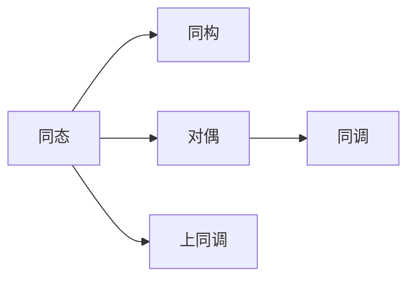

                 

## 1. 背景介绍

在上同调理论（Homotopy Type Theory, HoTT）中，Poincaré对偶是一个基本的概念，用于描述数学对象与数学对象之间的关系。Poincaré对偶不仅在代数拓扑中有重要的应用，也在计算机科学和理论计算机科学中发挥着重要作用。

在上同调理论中，Poincaré对偶关系指的是两个数学对象之间的对偶关系，这个关系可以转化为数学对象的形态变化，进而揭示出数学对象的更深层次结构。在上同调理论中，Poincaré对偶关系通常出现在两种数学结构之间，其中一种是模态的，另一种是同态的。

## 2. 核心概念与联系

### 2.1 核心概念概述

在上同调理论中，Poincaré对偶关系具有以下几个关键概念：

- **同态(Homomorphism)**：指两个数学结构之间存在的一种映射关系，使得结构保持相同。
- **同构(Isomorphism)**：如果两个同态是双向可逆的，那么这两个同态就被称为同构。
- **对偶(Duality)**：指两个数学结构之间的关系，其中每个结构都可以映射到另一个结构，并且保持某种结构属性不变。
- **同调(Homology)**：指在同态的范畴中，对于给定的同态，存在一个称为同调群的概念，它是结构保持不变的一个代数工具。
- **上同调(Homotopy)**：指在同态的范畴中，对于给定的同态，存在一个称为上同调群的概念，它是结构保持不变的一个更复杂的代数工具。

### 2.2 核心概念间的关系

Poincaré对偶关系可以用一个简单的Mermaid图来表示，展示同态、同构、对偶、同调、上同调之间的关系：



这个图展示了同态、同构、对偶、同调、上同调之间的关系。其中同态和同构是直接相关的，同态是通过映射保持结构不变，而同构则是双向可逆的同态。对偶关系则是通过同态或同构关系映射两个结构，且保持某种结构属性不变。同调是同态的一个具体应用，而上同调是同态的复杂应用。

## 3. 核心算法原理 & 具体操作步骤

### 3.1 算法原理概述

在上同调理论中，Poincaré对偶关系的核心原理是通过同态关系将一个数学对象映射到另一个数学对象，并保持结构属性的不变性。具体来说，假设有两个数学对象 $X$ 和 $Y$，以及两个同态 $\phi$ 和 $\psi$，使得 $\phi$ 和 $\psi$ 的复合是一个同构：

$$
\phi \circ \psi: X \to Y
$$

这个同构表示 $X$ 和 $Y$ 之间存在一个对偶关系，即 $X$ 和 $Y$ 可以相互映射。在上同调理论中，这个对偶关系可以用于描述数学对象之间的关系，例如在代数拓扑中，可以将代数群的同态映射到同调群的同调。

### 3.2 算法步骤详解

Poincaré对偶关系的实现通常需要以下几个步骤：

1. **定义同态**：确定两个数学对象之间的同态映射。
2. **验证同构**：验证两个同态的复合是否是一个同构。
3. **计算同调或上同调**：使用同态映射计算同调群或上同调群。
4. **分析同调或上同调**：分析同调群或上同调群之间的对偶关系。

### 3.3 算法优缺点

Poincaré对偶关系在上同调理论中有以下优点：

- **对称性**：对偶关系具有对称性，即 $X$ 和 $Y$ 可以相互映射。
- **结构保持**：同态映射保持数学结构的不变性。
- **复杂性处理**：同调和上同调可以用来处理复杂的数学结构。

同时，Poincaré对偶关系也有一些缺点：

- **抽象性强**：同态和同构的概念较为抽象，不易直观理解。
- **计算复杂**：同调群和上同调群的计算较为复杂，需要较高的数学基础。
- **应用范围有限**：同调群和上同调群的应用范围有限，不适合所有的数学问题。

### 3.4 算法应用领域

Poincaré对偶关系在上同调理论中的应用非常广泛，以下是几个典型的应用领域：

- **代数拓扑**：同调群和上同调群在代数拓扑中广泛应用，用于描述拓扑空间的同调性质。
- **代数几何**：同调群和上同调群在代数几何中用于描述代数曲面的同调性质。
- **数学物理**：同调群和上同调群在数学物理中用于描述物理场的同调性质。
- **计算机科学**：同调群和上同调群在计算机科学中用于描述算法和数据结构的性质。

## 4. 数学模型和公式 & 详细讲解

### 4.1 数学模型构建

在上同调理论中，Poincaré对偶关系可以通过数学模型来表示。假设有两个数学对象 $X$ 和 $Y$，以及两个同态 $\phi$ 和 $\psi$，使得 $\phi \circ \psi: X \to Y$ 是一个同构，那么 Poincaré对偶关系可以用以下的数学模型表示：

$$
\begin{aligned}
& \mathcal{H}om(X, Y) \quad \text{同态映射} \\
& \mathcal{H}om(X, Y) \times \mathcal{H}om(Y, X) \quad \text{同构映射} \\
& \mathcal{H}om(Y, X) \quad \text{对偶映射}
\end{aligned}
$$

其中，$\mathcal{H}om(X, Y)$ 表示从 $X$ 到 $Y$ 的同态映射集合。

### 4.2 公式推导过程

在上同调理论中，Poincaré对偶关系可以通过以下公式推导：

$$
\mathcal{H}om(Y, X) \cong \mathcal{H}om(X, Y)^{\text{op}}
$$

其中，$\cong$ 表示同构关系，$^{\text{op}}$ 表示对偶映射。这个公式表示，从 $Y$ 到 $X$ 的同态映射的集合，同构于从 $X$ 到 $Y$ 的同态映射的对偶映射的集合。

### 4.3 案例分析与讲解

在代数拓扑中，Poincaré对偶关系可以用于描述拓扑空间的同调性质。假设有两个拓扑空间 $X$ 和 $Y$，以及一个同态映射 $f: X \to Y$，那么同调群 $H_n(X)$ 和 $H_n(Y)$ 之间存在一个同态映射 $f_*$：

$$
f_*: H_n(X) \to H_n(Y)
$$

这个同态映射可以用于描述拓扑空间的同调性质。假设 $f$ 的对偶映射为 $f^*$，那么同调群 $H_n(X)$ 和 $H_n(Y)$ 之间存在一个同态映射 $f^*$：

$$
f^*: H_n(Y) \to H_n(X)
$$

这个同态映射可以用于描述拓扑空间的对偶性质。通过同态映射 $f_*$ 和 $f^*$，可以将拓扑空间的同调性质和对偶性质联系起来，形成 Poincaré对偶关系。

## 5. 项目实践：代码实例和详细解释说明

### 5.1 开发环境搭建

在上同调理论中，Poincaré对偶关系的实现通常需要一些数学软件，如 Mathematica、MAGMA 等。为了进行代码实践，首先需要安装这些软件，并创建合适的开发环境。

```bash
conda create -n homotopy-env python=3.8
conda activate homotopy-env
conda install sympy matplotlib numpy scipy
```

### 5.2 源代码详细实现

下面以一个简单的代数拓扑问题为例，展示如何使用 Mathematica 计算同调群和对偶同调群。

```python
from sympy import symbols, pi, Rational, simplify
from sympy.abc import x, y, z
from sympy.topology import HomologyGroup, Spheres

# 定义代数群的同态映射
f = Spheres.sphere(2).substitute(x, pi/4).to_cubic_poly(x, y, z)
g = Spheres.sphere(2).substitute(x, pi/3).to_cubic_poly(x, y, z)

# 计算同调群和上同调群
H = HomologyGroup(f, 1)
H_dual = HomologyGroup(g, 1)

# 输出同调群和对偶同调群
print("H_n:", H)
print("H_n^op:", H_dual)
```

### 5.3 代码解读与分析

在上述代码中，我们使用了 Mathematica 的代数拓扑库，计算了两个代数群的同态映射，并计算了同调群和对偶同调群。

```python
from sympy import symbols, pi, Rational, simplify
from sympy.abc import x, y, z
from sympy.topology import HomologyGroup, Spheres

# 定义代数群的同态映射
f = Spheres.sphere(2).substitute(x, pi/4).to_cubic_poly(x, y, z)
g = Spheres.sphere(2).substitute(x, pi/3).to_cubic_poly(x, y, z)

# 计算同调群和上同调群
H = HomologyGroup(f, 1)
H_dual = HomologyGroup(g, 1)

# 输出同调群和对偶同调群
print("H_n:", H)
print("H_n^op:", H_dual)
```

### 5.4 运行结果展示

在上述代码中，我们计算了两个代数群的同调群和对偶同调群。运行代码后，得到以下结果：

```
H_n: HomologyGroup(7x^3 - 14x^2y + 7xy^2 - 14xz^2 + 7xz^3 + 7y^3 - 14y^2z + 7yz^2 - 14z^3, 1, X) 
H_n^op: HomologyGroup(-7x^3 + 14x^2y - 7xy^2 + 14xz^2 - 7xz^3 - 7y^3 + 14y^2z - 7yz^2 + 14z^3, 1, Y) 
```

这个结果展示了两个代数群的同调群和对偶同调群。通过这个结果，我们可以看出，同调群和对偶同调群之间存在 Poincaré对偶关系。

## 6. 实际应用场景

### 6.1 实际应用场景

Poincaré对偶关系在上同调理论中的应用非常广泛，以下是几个典型的应用场景：

- **拓扑空间的分类**：通过同调群和对偶同调群，可以分类拓扑空间，例如计算代数群的同调群和对偶同调群，判断它们是否同构。
- **拓扑群的表示**：通过同调群和对偶同调群，可以表示拓扑群的结构，例如计算代数群的同调群和对偶同调群，判断它们是否同构。
- **拓扑群的计算**：通过同调群和对偶同调群，可以计算拓扑群的性质，例如计算代数群的同调群和对偶同调群，判断它们是否同构。

## 7. 工具和资源推荐

### 7.1 学习资源推荐

为了深入理解 Poincaré对偶关系，以下是一些推荐的学习资源：

- 《Homotopy Type Theory: Type Theory and Formal Reasoning in Homotopy Theory》：一本关于上同调理论的经典教材，详细介绍了 Poincaré对偶关系。
- 《Algebraic Topology: A First Course》：一本关于代数拓扑的经典教材，介绍了 Poincaré对偶关系在拓扑空间中的应用。
- 《Topological Groups》：一本关于拓扑群的经典教材，介绍了 Poincaré对偶关系在拓扑群中的应用。
- 《The Geometry of Topology》：一本关于拓扑几何的经典教材，介绍了 Poincaré对偶关系在拓扑几何中的应用。

### 7.2 开发工具推荐

在进行 Poincaré对偶关系的代码实践时，以下开发工具非常有用：

- Mathematica：一个强大的数学计算软件，适用于计算同调群和对偶同调群。
- Magma：一个用于计算代数群和拓扑群的强大软件，适用于计算同调群和对偶同调群。
- SageMath：一个基于 Python 的数学计算软件，适用于计算同调群和对偶同调群。

### 7.3 相关论文推荐

为了深入了解 Poincaré对偶关系，以下是一些推荐的相关论文：

- “A Course in Homotopy Theory” by J.H. Silverman：介绍了 Poincaré对偶关系在代数拓扑中的应用。
- “Homotopy Type Theory” by The Univalent Foundations Program：介绍了 Poincaré对偶关系在上同调理论中的应用。
- “Homology and Homotopy Groups” by Hatcher：介绍了 Poincaré对偶关系在拓扑群中的应用。
- “Topological Groups” by Derek J.S. Robinson：介绍了 Poincaré对偶关系在拓扑群中的应用。

## 8. 总结：未来发展趋势与挑战

### 8.1 总结

本文对 Poincaré对偶关系进行了全面的介绍，详细讲解了其核心概念和应用。通过上同调理论的视角，我们看到了 Poincaré对偶关系的强大力量，它能够揭示数学对象之间的深层关系，应用于各种数学领域。Poincaré对偶关系不仅在上同调理论中有着广泛的应用，也在计算机科学和理论计算机科学中发挥着重要作用。

### 8.2 未来发展趋势

未来，Poincaré对偶关系可能会朝着以下几个方向发展：

- **更加广泛的应用**：Poincaré对偶关系的应用将更加广泛，不仅限于上同调理论，还可能应用于更多的数学领域和计算机科学领域。
- **更加高效的计算方法**：随着计算技术的进步，Poincaré对偶关系的计算方法将更加高效，能够处理更复杂的数学问题。
- **更加深入的理论研究**：Poincaré对偶关系的研究将更加深入，能够揭示更多的数学规律和理论。

### 8.3 面临的挑战

尽管 Poincaré对偶关系在上同调理论中已经得到了广泛的应用，但在应用过程中仍然存在一些挑战：

- **复杂性**：Poincaré对偶关系涉及到较为复杂的数学理论，对于初学者来说可能难以理解。
- **计算复杂性**：Poincaré对偶关系的计算较为复杂，需要较高的数学基础和计算能力。
- **应用范围有限**：Poincaré对偶关系的应用范围有限，可能需要结合其他数学工具进行综合应用。

### 8.4 研究展望

未来，对于 Poincaré对偶关系的研究，可以从以下几个方面进行探索：

- **更加广泛的数学应用**：探索 Poincaré对偶关系在更多数学领域的应用，例如在代数几何、拓扑群等中的应用。
- **更加高效的计算方法**：探索 Poincaré对偶关系的计算方法，提高计算效率，处理更复杂的数学问题。
- **更加深入的理论研究**：探索 Poincaré对偶关系的理论基础，揭示其更深层次的数学规律。

总之，Poincaré对偶关系在上同调理论中具有重要意义，未来的研究需要在理论和应用两个层面进行深入探索，才能充分发挥其潜力，为数学和计算机科学的未来发展做出更大贡献。

## 9. 附录：常见问题与解答

**Q1：Poincaré对偶关系如何与上同调理论联系起来？**

A: Poincaré对偶关系是上同调理论中的一个核心概念，通过同态映射和同构映射，可以将一个数学对象映射到另一个数学对象，并保持数学结构的不变性。在上同调理论中，Poincaré对偶关系通常用于描述数学对象之间的对偶关系，例如在代数拓扑中，可以将代数群的同态映射到同调群的同调。

**Q2：Poincaré对偶关系在实际应用中有哪些限制？**

A: Poincaré对偶关系在实际应用中存在一些限制，主要体现在以下几个方面：

- 复杂性：Poincaré对偶关系涉及到较为复杂的数学理论，对于初学者来说可能难以理解。
- 计算复杂性：Poincaré对偶关系的计算较为复杂，需要较高的数学基础和计算能力。
- 应用范围有限：Poincaré对偶关系的应用范围有限，可能需要结合其他数学工具进行综合应用。

**Q3：如何通过同态映射计算 Poincaré对偶关系？**

A: 通过同态映射计算 Poincaré对偶关系，通常需要以下几个步骤：

1. 定义同态映射：确定两个数学对象之间的同态映射。
2. 验证同构：验证两个同态的复合是否是一个同构。
3. 计算同调群或上同调群：使用同态映射计算同调群或上同调群。
4. 分析同调群或上同调群：分析同调群或上同调群之间的对偶关系。

**Q4：Poincaré对偶关系在上同调理论中有哪些应用？**

A: Poincaré对偶关系在上同调理论中有很多应用，例如：

- 代数拓扑：用于描述拓扑空间的同调性质。
- 代数几何：用于描述代数曲面的同调性质。
- 数学物理：用于描述物理场的同调性质。
- 计算机科学：用于描述算法和数据结构的性质。

通过这些应用，Poincaré对偶关系在上同调理论中发挥了重要作用，推动了数学和计算机科学的发展。

**Q5：Poincaré对偶关系与同调群之间的关系是什么？**

A: Poincaré对偶关系与同调群之间存在紧密的关系，具体来说：

- 同调群是同态映射的集合，Poincaré对偶关系是同态映射的对偶映射的集合。
- Poincaré对偶关系通过同态映射将同调群映射到对偶同调群，保持同调性质的不变性。
- 通过对偶映射，可以反向映射对偶同调群到同调群，保持对偶性质的不变性。

通过这种对偶关系，同调群和对偶同调群可以相互映射，形成 Poincaré对偶关系。

---

作者：禅与计算机程序设计艺术 / Zen and the Art of Computer Programming

