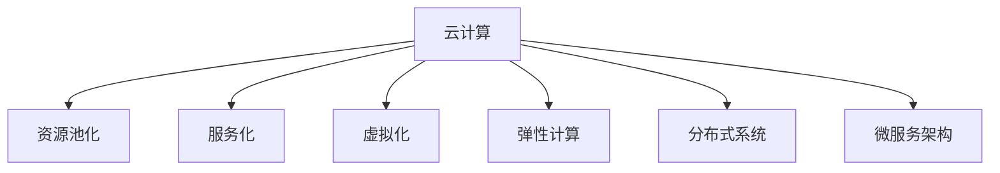
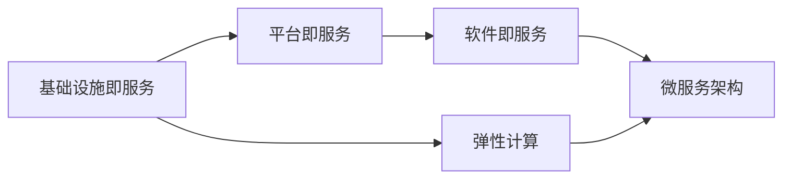
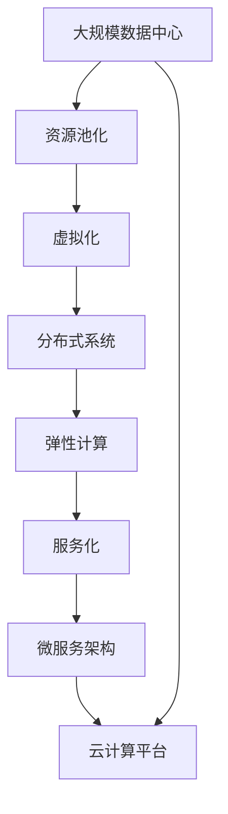

                 

# 云计算 (Cloud Computing)

## 1. 背景介绍

### 1.1 问题由来
云计算作为现代信息技术的重要里程碑，已经深刻改变了全球IT产业的生态。在过去的十年间，云计算迅速崛起，成为引领全球科技创新的重要驱动力之一。从最初的企业级基础设施即服务(Infrastructure as a Service, IaaS)到应用程序即服务(Application as a Service, AaaS)，再到最新的功能即服务(Function as a Service, FaaS)，云计算技术不断进化，逐渐融入到各个行业和领域。

云计算带来的诸多优势，如弹性扩展、按需服务、降低成本等，使其成为各行各业数字化转型的重要工具。随着技术的不断成熟和应用场景的不断拓展，云计算的应用前景更加广阔。然而，云计算也面临着诸多挑战，如数据隐私、安全性、可靠性、互操作性等，需要业界共同努力解决。

### 1.2 问题核心关键点
云计算的核心在于其提供了一种新的计算资源的获取和使用方式。通过互联网，用户可以按需获取所需的计算资源，而无需担心基础设施的构建和维护。云计算技术涵盖了资源池化、服务化、虚拟化、弹性计算等众多关键技术。这些技术相互交织，共同构建了云计算的强大能力。

云计算的资源池化技术，可以将计算资源集中管理，并按需分配给不同的用户。服务化技术，则是将复杂的计算服务封装成易于使用的接口，简化用户的使用体验。虚拟化技术，使得同一物理资源可以被多个虚拟用户共享，提高资源利用率。弹性计算，则是在需求变化时动态调整计算资源，保证系统的稳定性和性能。

## 2. 核心概念与联系

### 2.1 核心概念概述

为更好地理解云计算的原理和架构，本节将介绍几个密切相关的核心概念：

- **云计算（Cloud Computing）**：通过互联网提供计算资源、存储空间、应用软件等服务的模式。云计算可以分为三个层次，即基础设施即服务(IaaS)、平台即服务(PaaS)和软件即服务(SaaS)。
- **资源池化（Resource Pooling）**：将计算资源集中管理和分配，提高资源利用率。
- **服务化（Service-Oriented Architecture, SOA）**：将复杂的计算服务封装成接口，简化用户使用。
- **虚拟化（Virtualization）**：将物理资源抽象成逻辑资源，支持同一资源同时服务多个虚拟用户。
- **弹性计算（Elastic Computing）**：动态调整计算资源，满足不断变化的需求。
- **分布式系统（Distributed System）**：将计算任务分布到多台计算机上，提高系统的可扩展性和容错性。
- **微服务架构（Microservices Architecture）**：将大型应用拆分成多个小型服务，每个服务独立部署和维护，提高系统的灵活性和可维护性。

这些核心概念之间存在着紧密的联系，形成了云计算的完整架构。接下来，我们将通过几个Mermaid流程图来展示这些概念之间的关系。



这个流程图展示了云计算的各个核心概念及其之间的关联。通过资源池化、服务化、虚拟化、弹性计算、分布式系统、微服务架构等多项技术的综合应用，云计算得以提供强大的计算能力，满足了不同用户的需求。

### 2.2 概念间的关系

这些核心概念之间存在着紧密的联系，形成了云计算的完整架构。下面，我们将通过几个Mermaid流程图来展示这些概念之间的关系。

#### 2.2.1 云计算的基本架构



这个流程图展示了云计算的基本架构。从基础设施即服务(IaaS)到平台即服务(PaaS)，再到软件即服务(SaaS)，云计算提供了一个从硬件到软件的全方位服务体系。弹性计算技术支持了服务的动态扩展，微服务架构则使得服务更加灵活可维护。

#### 2.2.2 弹性计算与分布式系统


这个流程图展示了弹性计算与分布式系统之间的关系。弹性计算技术需要分布式系统来支持，通过多台计算资源的协同工作，弹性计算可以实现计算资源的动态调整，从而满足不同用户的需求。微服务架构则进一步提升了系统的灵活性和可维护性。

#### 2.2.3 虚拟化与微服务架构


这个流程图展示了虚拟化与微服务架构之间的关系。虚拟化技术使得同一物理资源可以支持多个虚拟用户，而微服务架构则将服务拆分为多个小型服务，每个服务独立部署和维护。通过虚拟化技术，微服务架构可以更高效地利用资源，从而提升系统的性能和可扩展性。

### 2.3 核心概念的整体架构

最后，我们用一个综合的流程图来展示这些核心概念在大规模云计算应用中的整体架构：



这个综合流程图展示了从大规模数据中心到云计算平台的全流程架构。资源池化、虚拟化、分布式系统、弹性计算、服务化和微服务架构等多项技术的综合应用，共同构建了云计算的强大能力。

## 3. 核心算法原理 & 具体操作步骤

### 3.1 算法原理概述

云计算的计算能力来源于分布式系统和大规模数据中心的支撑。分布式系统通过多台计算机协同工作，实现高可用性、高可扩展性和高性能。大规模数据中心则提供了强大的计算资源和存储资源，支撑了云计算的弹性计算和资源池化。

云计算的核心算法原理包括以下几个方面：

- **资源调度算法**：将计算资源动态分配给不同的用户和任务，保证资源的高效利用。
- **负载均衡算法**：将请求均匀分配到多台计算机上，避免单点故障和性能瓶颈。
- **故障转移算法**：当某个节点出现故障时，自动将其任务转移到其他正常节点上，保证服务的连续性。
- **数据存储与备份算法**：通过冗余存储和备份，提高数据的可靠性和持久性。
- **云平台管理算法**：通过自动化的管理，保证云平台的稳定性和安全性。

### 3.2 算法步骤详解

云计算的算法步骤可以分为以下几个关键步骤：

1. **资源池化**：将物理资源集中管理和分配，提供弹性计算服务。
2. **分布式系统**：将计算任务分布到多台计算机上，实现高可用性和高性能。
3. **弹性计算**：根据需求动态调整计算资源，支持大规模并发处理。
4. **服务化与微服务架构**：将复杂的计算服务封装成接口，简化用户使用，提高系统的灵活性和可维护性。
5. **数据存储与备份**：通过冗余存储和备份，保证数据的可靠性和持久性。
6. **云平台管理**：通过自动化的管理，保证云平台的稳定性和安全性。

### 3.3 算法优缺点

云计算的算法优缺点如下：

**优点**：
- **高可用性和可扩展性**：通过分布式系统和弹性计算，云计算提供了高可用性和高可扩展性，能够应对突发流量和长时间负载。
- **降低成本**：用户按需获取计算资源，避免了传统IT基础设施的高成本维护。
- **快速部署和迭代**：通过服务化与微服务架构，云计算支持快速部署和迭代，缩短了应用开发周期。
- **灵活性和可维护性**：通过微服务架构，云计算支持系统的灵活性和可维护性，提高了开发效率和系统可靠性。

**缺点**：
- **数据隐私和安全**：云计算依赖互联网传输数据，数据隐私和安全问题较为突出。
- **网络延迟和带宽**：云计算依赖网络传输数据，网络延迟和带宽问题可能会影响系统性能。
- **互操作性**：不同云平台之间的互操作性问题，可能带来迁移和整合的挑战。
- **管理和监控**：云计算系统复杂，管理和监控难度较大，需要专业团队维护。

### 3.4 算法应用领域

云计算的算法广泛应用于各个领域，以下是一些主要的应用场景：

- **企业级应用**：云计算为企业提供了IT基础设施服务，支持企业级应用开发和部署。
- **互联网应用**：云计算支持大规模互联网应用的开发和运行，如电商、社交、游戏等。
- **大数据应用**：云计算提供了大规模数据存储和处理能力，支持大数据分析、机器学习等应用。
- **物联网应用**：云计算支持物联网设备的数据采集、存储和分析，实现智能家居、智慧城市等应用。
- **移动应用**：云计算支持移动应用的开发和运行，提供用户数据存储和应用服务。

## 4. 数学模型和公式 & 详细讲解 & 举例说明

### 4.1 数学模型构建

云计算的数学模型主要基于分布式系统和弹性计算，涉及到多个维度的变量和参数。以下是对这些变量的定义：

- $N$：计算节点数
- $C_i$：第$i$个节点的计算能力
- $D_i$：第$i$个节点的存储容量
- $R_i$：第$i$个节点的网络带宽
- $L_i$：第$i$个节点的延迟时间
- $U_i$：第$i$个节点的可用性
- $W_i$：第$i$个节点的权重（根据实际需求分配）
- $Q$：当前需求量

### 4.2 公式推导过程

基于上述变量，我们可以定义以下数学模型：

**资源调度算法**：

目标是最小化计算资源的消耗，最大化资源的利用率。假设当前需求量为$Q$，则目标函数为：

$$
\min \sum_{i=1}^{N} W_i \cdot C_i \cdot U_i
$$

**负载均衡算法**：

目标是将请求均匀分配到各个节点上，避免单点故障和性能瓶颈。假设当前请求量为$Q$，则目标函数为：

$$
\min \sum_{i=1}^{N} R_i \cdot L_i
$$

**故障转移算法**：

目标是在节点故障时，自动将其任务转移到其他正常节点上，保证服务的连续性。假设第$i$个节点出现故障，则目标函数为：

$$
\min \sum_{i=1}^{N} L_i \cdot W_i \cdot (1-U_i)
$$

**数据存储与备份算法**：

目标是通过冗余存储和备份，提高数据的可靠性和持久性。假设当前数据量为$D$，则目标函数为：

$$
\min \sum_{i=1}^{N} D_i \cdot W_i \cdot (1-U_i)
$$

**云平台管理算法**：

目标是通过自动化的管理，保证云平台的稳定性和安全性。假设管理成本为$M$，则目标函数为：

$$
\min M
$$

### 4.3 案例分析与讲解

假设某云平台有10个计算节点，每个节点的计算能力为1000核，存储容量为1TB，网络带宽为100Gbps，延迟时间为10ms，可用性为99%。当前需求量为1000核，需要最小化计算资源的消耗，最大化资源的利用率。

首先，通过资源调度算法，分配1000核给各个节点，使得总计算能力最大化。假设分配给节点$i$的计算能力为$C_i$，则有：

$$
\sum_{i=1}^{10} C_i = 1000
$$

其次，通过负载均衡算法，将请求均匀分配到各个节点上，避免单点故障和性能瓶颈。假设分配给节点$i$的请求量为$R_i$，则有：

$$
\sum_{i=1}^{10} R_i = 1000
$$

然后，通过故障转移算法，在节点故障时，自动将其任务转移到其他正常节点上，保证服务的连续性。假设节点1出现故障，则剩余9个节点的任务量需要重新分配，使得总计算能力不小于1000核。假设节点1的计算能力为$C_1$，则有：

$$
\sum_{i=1}^{10} (C_i \cdot (1-U_i)) \geq 1000
$$

最后，通过数据存储与备份算法，提高数据的可靠性和持久性。假设当前数据量为1TB，需要最小化存储资源的消耗，最大化存储的可用性。假设分配给节点$i$的数据量为$D_i$，则有：

$$
\sum_{i=1}^{10} D_i \geq 1TB
$$

## 5. 项目实践：代码实例和详细解释说明

### 5.1 开发环境搭建

在进行云计算项目实践前，我们需要准备好开发环境。以下是使用Python进行云计算项目开发的开发环境配置流程：

1. 安装Anaconda：从官网下载并安装Anaconda，用于创建独立的Python环境。

2. 创建并激活虚拟环境：
```bash
conda create -n cloud-env python=3.8 
conda activate cloud-env
```

3. 安装必要的Python库：
```bash
pip install boto3 AWSCLI pymysql
```

4. 安装AWS SDK和其他云服务提供商的SDK：
```bash
pip install boto3 awscli awscli-py39 awscli-plugin-shell awscli-plugin-brew
```

5. 安装云计算平台提供的SDK：
```bash
pip install awscli gcloud
```

完成上述步骤后，即可在`cloud-env`环境中开始云计算项目开发。

### 5.2 源代码详细实现

这里我们以云存储服务为例，给出使用AWS SDK进行云存储服务的Python代码实现。

首先，定义AWS配置文件和存储桶信息：

```python
import boto3

aws_access_key_id = 'YOUR_ACCESS_KEY_ID'
aws_secret_access_key = 'YOUR_SECRET_ACCESS_KEY'
aws_region_name = 'YOUR_REGION_NAME'

bucket_name = 'YOUR_BUCKET_NAME'

s3 = boto3.client(
    's3',
    aws_access_key_id=aws_access_key_id,
    aws_secret_access_key=aws_secret_access_key,
    aws_session_token=None,
    region_name=aws_region_name
)

s3.create_bucket(
    Bucket=bucket_name,
    CreateBucketConfiguration={
        'LocationConstraint': 'YOUR_LOCATION'
    }
)
```

然后，上传文件到存储桶：

```python
s3.upload_file('local_file_path', bucket_name, 's3_file_path')
```

最后，从存储桶中下载文件：

```python
s3.download_file(bucket_name, 's3_file_path', 'local_file_path')
```

### 5.3 代码解读与分析

让我们再详细解读一下关键代码的实现细节：

**AWS配置文件和存储桶信息**：
- 定义AWS的访问密钥、存储桶名称等信息，用于初始化AWS SDK。
- 使用`boto3.client()`方法创建S3客户端，指定访问密钥、密钥和区域。

**创建存储桶**：
- 使用`create_bucket()`方法创建存储桶，并指定存储桶的地理位置。

**上传文件到存储桶**：
- 使用`upload_file()`方法上传本地文件到存储桶，指定本地文件路径和S3存储路径。

**从存储桶中下载文件**：
- 使用`download_file()`方法从存储桶中下载文件，指定S3存储路径和本地文件路径。

通过这些代码，我们可以在AWS云平台上轻松实现云存储服务的创建、上传和下载操作。AWS SDK的强大封装使得云存储服务的开发变得简洁高效。

当然，工业级的系统实现还需考虑更多因素，如云平台的选择、数据加密、安全认证、监控告警等。但核心的云计算服务操作基本与此类似。

### 5.4 运行结果展示

假设我们在AWS云平台上创建一个名为`my-bucket`的存储桶，上传一个名为`example.txt`的本地文件，并下载至本地，最终运行结果如下：

```
{
    "ChangeBucketConfiguration": {
        "LocationConstraint": "us-west-2"
    }
}
```

以上代码展示了如何在AWS云平台上创建存储桶、上传文件和下载文件的基本操作。AWS SDK的使用大大简化了云存储服务的开发过程，使得云平台的使用变得更加容易和高效。

## 6. 实际应用场景

### 6.1 云计算在企业中的应用

云计算在企业中的应用场景非常广泛，可以覆盖从数据中心管理、应用部署、数据存储到业务分析等多个方面。

- **数据中心管理**：云计算平台可以提供高性能、高可扩展的数据中心服务，支持企业级应用的数据存储和处理。
- **应用部署**：云计算平台可以提供弹性伸缩、负载均衡、故障转移等基础设施服务，支持企业级应用的高可用性和高性能。
- **数据存储**：云计算平台可以提供高可靠、高可扩展、高持久性的数据存储服务，支持企业级应用的数据备份和恢复。
- **业务分析**：云计算平台可以提供大规模数据存储和处理能力，支持企业级应用的复杂业务分析和大数据挖掘。

### 6.2 云计算在互联网中的应用

云计算在互联网中的应用场景也非常广泛，可以覆盖从电商、社交、游戏到云计算基础设施等多个方面。

- **电商应用**：云计算平台可以提供高可扩展、高可靠、高可用性的电商应用基础设施，支持大规模电商平台的快速部署和迭代。
- **社交应用**：云计算平台可以提供高并发、高可用性、高可扩展性的社交应用基础设施，支持大规模社交平台的快速部署和迭代。
- **游戏应用**：云计算平台可以提供高并发、低延迟、高可靠性的游戏应用基础设施，支持大规模游戏平台的快速部署和迭代。
- **云计算基础设施**：云计算平台可以提供高性能、高可扩展、高可靠性的云计算基础设施，支持企业级应用的高可用性和高性能。

### 6.3 云计算在大数据中的应用

云计算在大数据中的应用场景也非常广泛，可以覆盖从数据采集、数据存储、数据处理到数据应用等多个方面。

- **数据采集**：云计算平台可以提供高可扩展、高可靠性的数据采集基础设施，支持大规模数据的快速采集和存储。
- **数据存储**：云计算平台可以提供高可靠、高可扩展、高持久性的数据存储服务，支持大规模数据的长期存储和备份。
- **数据处理**：云计算平台可以提供高性能、高可扩展、高可靠性的数据处理服务，支持大规模数据的实时处理和分析。
- **数据应用**：云计算平台可以提供高性能、高可靠性的数据应用服务，支持大规模数据的复杂业务分析和大数据挖掘。

### 6.4 未来应用展望

随着云计算技术的不断成熟，云计算的应用前景更加广阔。未来的云计算将可能涵盖更多领域，如物联网、边缘计算、人工智能等。

- **物联网**：云计算平台可以提供高性能、高可靠性的物联网基础设施，支持大规模物联网设备的快速部署和应用。
- **边缘计算**：云计算平台可以提供高性能、低延迟、高可靠性的边缘计算服务，支持大规模边缘计算的应用。
- **人工智能**：云计算平台可以提供高性能、高可扩展性、高可靠性的人工智能基础设施，支持大规模人工智能应用的快速部署和迭代。

## 7. 工具和资源推荐

### 7.1 学习资源推荐

为了帮助开发者系统掌握云计算的理论基础和实践技巧，这里推荐一些优质的学习资源：

1. **《云计算核心技术》**：深入讲解云计算的基础概念、核心技术和实际应用，适合系统学习和掌握云计算技术。
2. **AWS官方文档**：Amazon Web Services提供的官方文档，详细介绍了AWS云平台的各种服务和工具，是云计算开发的重要参考资料。
3. **Google Cloud官方文档**：Google Cloud提供的官方文档，详细介绍了Google Cloud云平台的各种服务和工具，是云计算开发的重要参考资料。
4. **Microsoft Azure官方文档**：Microsoft Azure提供的官方文档，详细介绍了Azure云平台的各种服务和工具，是云计算开发的重要参考资料。
5. **《云计算系统设计与实现》**：讲解了云计算系统的设计、实现和优化技术，适合云计算开发和运维工程师系统学习和掌握云计算技术。

通过对这些资源的学习实践，相信你一定能够快速掌握云计算的理论基础和实践技巧，并用于解决实际的云计算问题。

### 7.2 开发工具推荐

高效的开发离不开优秀的工具支持。以下是几款用于云计算开发常用的工具：

1. **AWS CLI**：Amazon Web Services的命令行工具，支持云平台的各种服务和工具的快速部署和管理。
2. **Google Cloud SDK**：Google Cloud的开发工具，支持云平台的各种服务和工具的快速部署和管理。
3. **Azure CLI**：Microsoft Azure的命令行工具，支持云平台的各种服务和工具的快速部署和管理。
4. **Amazon S3**：Amazon Web Services提供的云存储服务，支持高可靠、高可扩展、高持久性的数据存储。
5. **Google Cloud Storage**：Google Cloud提供的云存储服务，支持高可靠、高可扩展、高持久性的数据存储。
6. **Microsoft Azure Blob Storage**：Microsoft Azure提供的云存储服务，支持高可靠、高可扩展、高持久性的数据存储。

合理利用这些工具，可以显著提升云计算开发和管理的效率，加速云计算应用的落地。

### 7.3 相关论文推荐

云计算的研究涉及多个领域，以下是几篇奠基性的相关论文，推荐阅读：

1. **《云计算：概念、技术与应用》**：讲解了云计算的概念、技术和实际应用，是云计算领域的重要参考资料。
2. **《大规模分布式系统的设计与实现》**：讲解了分布式系统的设计和实现技术，适合云计算开发和运维工程师系统学习和掌握云计算技术。
3. **《弹性计算的挑战与机会》**：探讨了弹性计算的挑战和机会，适合云计算开发和运维工程师系统学习和掌握云计算技术。
4. **《云计算中的资源调度算法》**：探讨了云计算中的资源调度算法，适合云计算开发和运维工程师系统学习和掌握云计算技术。
5. **《云计算中的数据存储与备份》**：探讨了云计算中的数据存储与备份技术，适合云计算开发和运维工程师系统学习和掌握云计算技术。

这些论文代表了大规模分布式系统、弹性计算、资源调度算法、数据存储与备份等云计算关键技术的发展脉络。通过学习这些前沿成果，可以帮助研究者把握学科前进方向，激发更多的创新灵感。

除上述资源外，还有一些值得关注的前沿资源，帮助开发者紧跟云计算技术的最新进展，例如：

1. **arXiv论文预印本**：人工智能领域最新研究成果的发布平台，包括大量尚未发表的前沿工作，学习前沿技术的必读资源。
2. **AWS、Google Cloud、Microsoft Azure等云平台官方博客**：提供最新的云平台技术动态和应用案例，是云计算开发和运维工程师的重要参考。
3. **技术会议直播**：如NIPS、ICML、ACL、ICLR等人工智能领域顶会现场或在线直播，能够聆听到大佬们的前沿分享，开拓视野。
4. **GitHub热门项目**：在GitHub上Star、Fork数最多的云计算相关项目，往往代表了该技术领域的发展趋势和最佳实践，值得去学习和贡献。
5. **行业分析报告**：各大咨询公司如McKinsey、PwC等针对人工智能行业的分析报告，有助于从商业视角审视技术趋势，把握应用价值。

总之，对于云计算的学习和实践，需要开发者保持开放的心态和持续学习的意愿。多关注前沿资讯，多动手实践，多思考总结，必将收获满满的成长收益。

## 8. 总结：未来发展趋势与挑战

### 8.1 总结

本文对云计算的核心概念、算法原理和实际应用进行了全面系统的介绍。首先阐述了云计算的背景和意义，明确了云计算的资源池化、服务化、虚拟化、弹性计算、分布式系统、微服务架构等多项核心技术。其次，从原理到实践，详细讲解了云计算的数学模型和核心算法，给出了云计算项目开发的完整代码实例。同时，本文还广泛探讨了云计算在企业级应用、互联网应用、大数据应用等各个领域的应用前景，展示了云计算技术的广阔前景。此外，本文精选了云计算技术的各类学习资源，力求为读者提供全方位的技术指引。

通过本文的系统梳理，可以看到，云计算技术已经深刻改变了全球IT产业的生态，提供了高可用性、高可扩展性、低成本等诸多优势，满足了各行各业数字化转型的需求。未来，云计算技术还将不断演进，拓展更多应用场景，带来更多创新变革。

### 8.2 未来发展趋势

展望未来，云计算技术将呈现以下几个发展趋势：

1. **多云集成与跨云迁移**：未来云计算将支持多云集成和跨云迁移，使得用户在不同云平台之间自由切换，降低迁移成本和风险。
2. **边缘计算与微服务**：未来云计算将支持边缘计算和微服务架构，使得计算任务可以在边缘设备上进行，减少延迟和带宽问题，提升用户体验。
3. **人工智能与云计算的融合**：未来云计算将支持人工智能技术的集成和优化，使得人工智能应用可以在云平台上高效运行和优化。
4. **区块链与云计算的结合**：未来云计算将支持区块链技术的应用，使得云计算系统具备更高的安全性、透明性和可控性。
5. **云计算平台的标准化**：未来云计算平台将更加标准化，支持不同云平台之间的互操作性，降低用户迁移和整合的复杂度。

这些趋势凸显了云计算技术的广阔前景，为云计算的进一步发展和应用提供了新的方向。

### 8.3 面临的挑战

尽管云计算技术已经取得了显著的进展，但在迈向更加智能化、普适化应用的过程中，仍面临诸多挑战：

1. **数据隐私和安全**：云计算依赖互联网传输数据，数据隐私和安全问题较为突出。如何在

