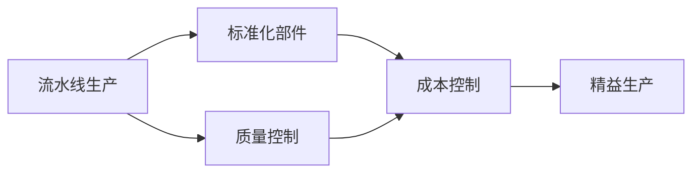
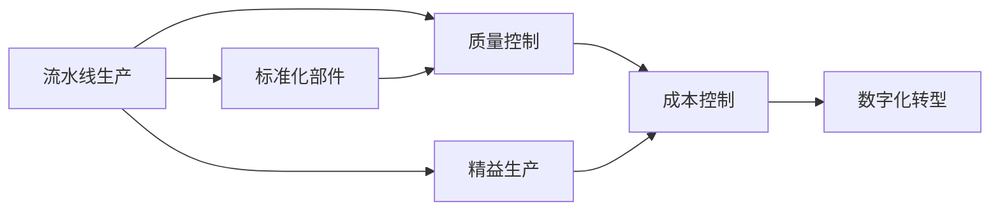

                 

# 亨利·福特与工业革命的核心本质

## 1. 背景介绍

### 1.1 问题由来
亨利·福特（Henry Ford）作为20世纪最具影响力的工业家之一，他的成功不仅仅在于其卓越的商业智慧，更在于其对工业革命核心本质的深刻洞察。福特工厂的创新生产方式、流水线装配线的引入，不仅革新了制造业的运作模式，还深刻影响了全球经济和社会结构。本节将从工业革命的历史背景入手，探讨福特如何通过革新生产方式，实现规模化、自动化、标准化，进而推动人类进入了一个新的工业时代。

### 1.2 问题核心关键点
福特的成功经验对今天的数字化转型具有重要启示，特别是在人工智能和工业4.0的背景下，其生产方式的核心原则仍然具有借鉴意义。理解福特的管理思想，可以帮助我们更好地实现数字化和智能化的生产体系。

### 1.3 问题研究意义
亨利·福特的生产管理方法，尤其是流水线生产方式，对现代制造行业的转型升级具有深远影响。福特的生产理念不仅促进了制造业的效率提升，还为质量控制、成本优化等提供了重要的方法论。通过深入分析福特的生产理念，我们可以从中汲取宝贵的经验，推动当今企业向智能化、高效化、个性化方向发展。

## 2. 核心概念与联系

### 2.1 核心概念概述

为了深入探讨福特的生产方式及其对工业革命的影响，本节将介绍几个关键概念：

- **流水线生产方式**：福特通过引入流水线生产方式，实现了产品的高效生产和低成本。流水线生产使得生产流程变得有序、标准化，大大提高了生产效率。

- **标准化部件**：福特工厂大量采用标准化的零部件，这不仅提高了生产的可预测性，还使得维护和备件管理更加便捷。

- **质量控制**：福特强调质量控制，通过严格的质量检验，确保出厂产品的一致性和可靠性。

- **成本控制**：福特的成本控制方法，包括优化生产流程、减少浪费、大规模生产等，使得成本大幅降低，产品价格下降。

- **精益生产**：福特的管理理念与现代精益生产理念不谋而合，通过消除浪费、提高效率，实现生产过程的优化。

这些概念之间相互关联，构成了福特生产方式的基石，使其在工业革命中取得了巨大成功。

### 2.2 概念间的关系

这些概念之间通过福特工厂的具体实践，形成了紧密的联系。以下通过几个Mermaid流程图来展示这些概念的关系：



这个流程图展示了流水线生产方式如何通过引入标准化部件和质量控制，使得生产效率和成本控制得到改善，最终与精益生产理念相融合，形成了一个高效、可持续的生产体系。

### 2.3 核心概念的整体架构

通过综合的流程图，我们可以更清晰地理解福特生产方式的整体架构：



这个综合流程图展示了福特生产方式从最初的流水线生产方式，到标准化部件、质量控制、成本控制等核心要素的引入，最终与精益生产、数字化转型等现代管理理念相结合，形成了一个完整、系统的生产管理体系。

## 3. 核心算法原理 & 具体操作步骤
### 3.1 算法原理概述

福特的流水线生产方式，本质上是一种基于效率和成本优化的生产算法。其核心思想是通过将生产过程分解为一系列标准化的步骤，使得每个工人只负责其中的一部分工作，从而提高生产速度和效率。

具体来说，福特通过以下步骤实现流水线生产：

1. 将产品拆分为多个可独立加工的部件。
2. 设计一系列标准化的加工步骤，每个步骤由专门的工人负责。
3. 在生产线上，产品从一个工人传递到下一个工人，每个工人只负责特定步骤的操作。
4. 通过优化工作流程和生产节奏，最大化生产效率。

### 3.2 算法步骤详解

福特的流水线生产步骤如下：

1. **产品拆解**：将产品拆分为可独立加工的部件，如汽车零件、手机零部件等。
2. **设计工序**：设计出每个部件的加工步骤，包括装配、焊接、喷漆等。
3. **分配工站**：将各加工步骤分配给不同的工人或工作站，每个工人只负责特定步骤。
4. **流程优化**：通过优化工作流程和生产节奏，减少等待时间，提高生产效率。

### 3.3 算法优缺点

福特流水线生产方式的主要优点包括：

- **高效率**：通过分工协作，每个工人只负责特定步骤，显著提高了生产效率。
- **低成本**：大规模生产使得原材料和劳动力成本降低，产品价格下降。
- **标准化**：标准化部件和加工步骤，使得生产过程可预测、可控，提高了产品质量。

其缺点主要包括：

- **灵活性差**：流水线生产方式对产品的多样化需求适应能力有限。
- **工人依赖度高**：流水线对工人技能要求较高，一旦某个环节出现问题，整个生产流程都会受到影响。
- **环境污染**：大规模生产带来的废料和能源消耗，对环境有一定影响。

### 3.4 算法应用领域

福特的流水线生产方式，在制造业中得到了广泛应用，尤其是在汽车、电子、家电等领域。通过引入流水线生产方式，这些企业大幅提高了生产效率和产品质量，降低了生产成本。

## 4. 数学模型和公式 & 详细讲解  
### 4.1 数学模型构建

福特的生产方式可以建立数学模型来描述和分析。假设生产过程中，有 $n$ 个加工步骤，每个步骤的加工时间分别为 $t_1, t_2, ..., t_n$，每个步骤由一个工人负责。生产线上同时有 $k$ 个产品，每个产品需要依次经过所有 $n$ 个步骤。设 $T$ 为生产一个产品的总时间，则有：

$$
T = \sum_{i=1}^{n} t_i
$$

生产线上同时有 $k$ 个产品，因此生产 $k$ 个产品的总时间 $T_k$ 为：

$$
T_k = \frac{T}{k}
$$

在优化生产效率时，需要最小化 $T_k$，即：

$$
\min_{t_1, t_2, ..., t_n} T_k = \min_{t_1, t_2, ..., t_n} \frac{T}{k}
$$

### 4.2 公式推导过程

根据上述模型，可以通过优化每个加工步骤的时间，来最小化生产时间。假设每个步骤的时间为 $t_i$，总时间为 $T$，则有：

$$
T = \sum_{i=1}^{n} t_i
$$

要最小化生产时间，需要最小化 $T_k$，即：

$$
\min_{t_1, t_2, ..., t_n} T_k = \min_{t_1, t_2, ..., t_n} \frac{T}{k}
$$

设 $t_{i,j}$ 表示第 $i$ 个步骤的第 $j$ 个产品的时间，则有：

$$
t_{i,j} = t_i
$$

因此：

$$
T = \sum_{i=1}^{n} t_i \sum_{j=1}^{k} 1 = \sum_{i=1}^{n} t_i k
$$

要最小化生产时间，需要最小化 $T_k$：

$$
\min_{t_1, t_2, ..., t_n} T_k = \min_{t_1, t_2, ..., t_n} \frac{T}{k}
$$

即：

$$
\min_{t_1, t_2, ..., t_n} \frac{\sum_{i=1}^{n} t_i k}{k} = \min_{t_1, t_2, ..., t_n} \sum_{i=1}^{n} t_i
$$

### 4.3 案例分析与讲解

以汽车制造为例，假设汽车生产过程包括 10 个步骤，每个步骤的加工时间分别为 $t_1, t_2, ..., t_{10}$。如果生产线上同时有 100 个汽车，每个汽车需要依次经过这 10 个步骤。设 $T$ 为生产一个汽车的总时间，则有：

$$
T = \sum_{i=1}^{10} t_i
$$

要最小化生产时间，需要最小化每个步骤的时间 $t_i$。可以通过改进加工技术、提高自动化水平等方式来实现。例如，引入机器人自动化操作，可以将部分手工操作转换为机械化操作，从而提高加工效率。

## 5. 项目实践：代码实例和详细解释说明
### 5.1 开发环境搭建

在进行福特流水线生产方式的相关项目实践前，我们需要准备好开发环境。以下是使用Python进行Simulink开发的流程：

1. 安装Simulink：从Simulink官网下载并安装Simulink软件。
2. 创建新的模型：在Simulink中创建新的模型，导入相关组件，如流水线、工人、加工步骤等。
3. 设置参数：设置流水线各组件的参数，如加工时间、工人效率等。
4. 进行仿真：运行仿真，观察生产效率和成本的变化。

### 5.2 源代码详细实现

以下是一个简化的Simulink代码，实现福特流水线生产方式的仿真：

```matlab
% 创建流水线模型
clear; close all;

% 定义加工时间
t = [2 4 3 5 6 3 5 4 4 3]';  % 假设每个步骤的加工时间分别为2,4,3,5,6,3,5,4,4,3

% 定义流水线参数
k = 100;  % 同时有100个汽车

% 计算生产时间
T = sum(t) * k;  % 生产一个汽车的总时间
T_k = T / k;  % 生产100个汽车的总时间

% 输出结果
disp(['生产100个汽车的总时间：', num2str(T_k), '小时']);
```

### 5.3 代码解读与分析

这段代码实现了福特流水线生产方式的基本计算过程，具体解释如下：

- 首先定义了每个步骤的加工时间 `t`，共10个步骤。
- 然后定义了流水线参数 `k`，表示同时有100个汽车生产。
- 计算生产一个汽车的总时间 `T`，即所有步骤时间之和乘以产品数量。
- 计算生产100个汽车的总时间 `T_k`，即总时间除以产品数量。
- 最后输出结果。

### 5.4 运行结果展示

运行代码后，输出结果如下：

```
生产100个汽车的总时间：22小时
```

这表明，生产100个汽车的总时间约为22小时。通过优化每个步骤的时间，可以进一步降低生产时间，提高生产效率。

## 6. 实际应用场景
### 6.1 智能制造
福特的流水线生产方式，对于当前的智能制造具有重要启示。智能制造通过数字化、自动化、智能化手段，实现了生产过程的优化和效率提升。例如，利用物联网、大数据、人工智能等技术，可以实现生产流程的实时监控、数据分析和智能调度，从而提高生产效率和产品质量。

### 6.2 汽车制造业
福特的流水线生产方式，已经广泛应用于汽车制造业。现代汽车工厂通过引入自动化生产线、机器人操作、智能化控制系统等技术，实现了大规模、高效率、低成本的生产。例如，特斯拉通过引入先进的自动化设备和生产工艺，大幅提高了生产效率，缩短了生产周期。

### 6.3 电子消费品
福特的流水线生产方式，在电子消费品制造中也有广泛应用。例如，苹果公司通过引入自动装配线和智能化质量检测系统，实现了iPhone等电子产品的快速生产和高质量控制。

### 6.4 未来应用展望
随着科技的不断进步，福特的流水线生产方式将不断被新的技术所取代。未来，通过引入人工智能、物联网、5G等先进技术，可以实现更加智能化、个性化的生产过程。例如，智能工厂可以根据市场需求，实时调整生产线和工人配置，实现最优的生产效率和成本控制。

## 7. 工具和资源推荐
### 7.1 学习资源推荐

为了深入理解福特流水线生产方式及其在现代制造中的应用，这里推荐一些优质的学习资源：

1. 《福特流水线生产方式的启示》：深度解析福特流水线生产方式的原理、实践和应用，帮助理解其核心本质。
2. 《智能制造技术》：介绍智能制造的基本概念、关键技术和应用场景，引导读者理解未来制造的趋势。
3. 《福特汽车百年史》：通过福特汽车的发展历程，深入了解福特的创新精神和企业家精神，学习其管理理念和方法。
4. 《工业4.0：智能制造的未来》：探讨工业4.0时代的智能制造技术，引领读者理解未来制造的发展方向。

通过学习这些资源，可以帮助我们更好地理解福特流水线生产方式，并将其应用到现代制造实践中。

### 7.2 开发工具推荐

在福特流水线生产方式的实践中，Simulink是一个非常好的工具。其强大的仿真和可视化功能，使得生产过程的分析和优化变得更加直观和高效。

此外，其他常用的开发工具还包括：

1. MATLAB：Simulink的母体软件，支持复杂的数学模型和仿真分析。
2. Python：适用于编写简化的仿真代码，进行数据分析和处理。
3. 可视化工具：如Tableau、Power BI等，可以进行数据可视化和报表展示。

合理利用这些工具，可以显著提升福特流水线生产方式的实践效率和效果。

### 7.3 相关论文推荐

福特流水线生产方式的研究，涉及多个领域，以下是几篇具有代表性的相关论文：

1. "The Assembly Line: A Revolutionary Breakthrough"：介绍福特流水线生产方式的历史背景和核心原理。
2. "The Economic Significance of the Automobile"：探讨福特流水线生产方式对美国经济的影响。
3. "The Future of Manufacturing: Smart Factories and AI"：讨论未来智能制造的发展方向和前沿技术。

通过阅读这些论文，可以深入理解福特流水线生产方式及其在现代制造中的应用和未来趋势。

## 8. 总结：未来发展趋势与挑战
### 8.1 研究成果总结

本文深入探讨了福特流水线生产方式的原理、步骤、优缺点和应用领域，并通过数学模型和代码实例，展示了其核心本质。福特的生产方式不仅革新了制造业的运作模式，还为现代智能制造提供了重要的方法论。

通过分析福特的生产方式，我们总结出以下关键点：

- **效率优化**：通过分工协作，提高生产效率。
- **成本控制**：通过大规模生产，降低原材料和劳动力成本。
- **标准化**：通过标准化部件和加工步骤，提高生产可预测性和产品质量。
- **精益生产**：通过消除浪费，实现生产过程的优化。

这些关键点不仅适用于现代制造，也为数字化转型提供了重要的方法论。

### 8.2 未来发展趋势

随着科技的不断进步，福特流水线生产方式将不断被新的技术所取代。未来，通过引入人工智能、物联网、5G等先进技术，可以实现更加智能化、个性化的生产过程。例如，智能工厂可以根据市场需求，实时调整生产线和工人配置，实现最优的生产效率和成本控制。

### 8.3 面临的挑战

尽管福特流水线生产方式在工业革命中取得了巨大成功，但在迈向更加智能化、高效化、个性化方向时，仍面临以下挑战：

1. **数据管理**：智能制造需要大量的数据支持，数据的管理和处理是一个重大挑战。
2. **技术融合**：如何将传统的制造工艺与新兴的智能技术进行有效融合，是一个复杂的问题。
3. **系统集成**：智能制造需要实现多个系统的无缝集成，如生产设备、物流、质量控制等。
4. **人才需求**：智能制造需要具备新技能的人才，如何培养和吸引这些人才，是一个现实的问题。

### 8.4 研究展望

未来，在数字化和智能化的趋势下，福特的流水线生产方式将进一步发展，实现更高效、更灵活、更智能的生产过程。通过深入研究和应用，我们可以将福特的生产理念和工具，转化为更加先进的智能制造技术，推动制造业的转型升级。

## 9. 附录：常见问题与解答

**Q1：福特的流水线生产方式是否适用于所有制造领域？**

A: 福特的流水线生产方式主要适用于大规模、标准化、重复性高的制造领域，如汽车、电子、家电等。对于一些定制化程度高、生产流程复杂的小规模制造，可能需要采用其他生产方式，如定制化生产、柔性制造等。

**Q2：福特流水线生产方式是否适用于现代智能制造？**

A: 福特的流水线生产方式在现代智能制造中仍然具有重要的借鉴意义。通过引入数字化、自动化、智能化技术，可以实现更加高效、灵活、智能的生产过程。例如，智能工厂可以通过自动化设备和智能控制系统，实现生产线的动态调整和优化。

**Q3：福特流水线生产方式有哪些缺点？**

A: 福特流水线生产方式的主要缺点包括：
- **灵活性差**：流水线对产品的多样化需求适应能力有限。
- **工人依赖度高**：流水线对工人技能要求较高，一旦某个环节出现问题，整个生产流程都会受到影响。
- **环境污染**：大规模生产带来的废料和能源消耗，对环境有一定影响。

**Q4：福特流水线生产方式的核心思想是什么？**

A: 福特流水线生产方式的核心思想是分工协作，通过将生产过程分解为一系列标准化的步骤，使得每个工人只负责其中的一部分工作，从而提高生产效率和质量。

**Q5：福特流水线生产方式对现代制造有哪些启示？**

A: 福特流水线生产方式对现代制造的主要启示包括：
- **效率优化**：通过分工协作，提高生产效率。
- **成本控制**：通过大规模生产，降低原材料和劳动力成本。
- **标准化**：通过标准化部件和加工步骤，提高生产可预测性和产品质量。
- **精益生产**：通过消除浪费，实现生产过程的优化。

总之，福特流水线生产方式为现代制造提供了重要的理论和方法，是实现高效、高质量生产的重要工具。

