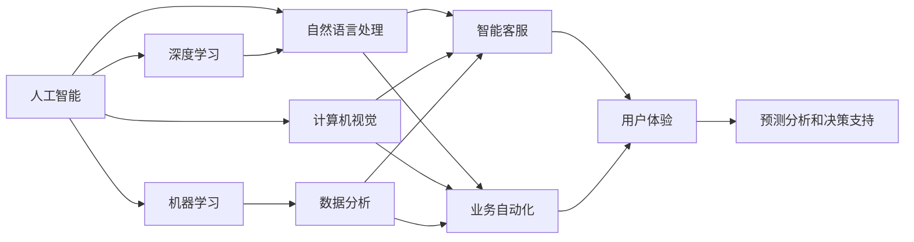
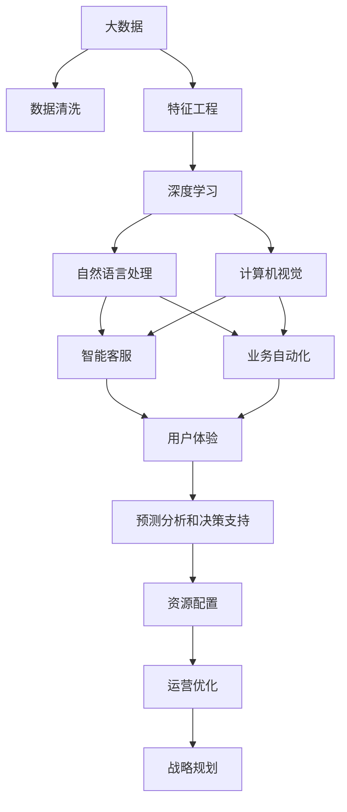

                 

## 1. 背景介绍

### 1.1 问题由来

随着科技的飞速发展，人工智能（AI）已经成为推动现代社会进步的重要力量。在过去几十年中，AI技术已经从早期基于规则和逻辑推理的系统，发展到了现在基于大数据、深度学习和复杂算法的智能系统。在企业数字化转型的大背景下，AI的应用变得愈发广泛和深入，推动了各行业的业务创新和效率提升。

### 1.2 问题核心关键点

当前，AI在企业数字化转型中的应用主要集中在以下几个关键点：

- **数据分析和处理**：利用机器学习和深度学习技术，对企业海量数据进行挖掘和分析，以发现潜在的业务模式和趋势。
- **自动化流程**：通过智能机器人、自动化决策系统等，实现企业业务流程的自动化，提升效率，减少人为错误。
- **智能客服和用户体验**：使用自然语言处理（NLP）和计算机视觉（CV）技术，提高客户服务质量和用户体验。
- **预测分析和决策支持**：结合预测模型和决策支持系统，帮助企业进行战略规划和资源配置，提升决策质量。
- **数据安全和隐私保护**：在数据处理和传输过程中，采用先进的加密和防护技术，确保数据安全，保护用户隐私。

### 1.3 问题研究意义

AI技术在企业中的应用，不仅能够带来业务流程的自动化和效率提升，还能够通过数据分析发现新的市场机会和业务模式，推动企业创新。AI技术的应用，帮助企业在激烈的竞争中保持领先地位，提高竞争力。此外，AI还能够降低企业运营成本，优化资源配置，提高企业整体效益。

## 2. 核心概念与联系

### 2.1 核心概念概述

为更好地理解AI在企业中的应用，本节将介绍几个密切相关的核心概念：

- **人工智能**：指利用计算机模拟人类智能行为的技术，包括机器学习、深度学习、自然语言处理、计算机视觉等。
- **机器学习**：通过算法让计算机系统从数据中学习规律，并应用于新的数据样本上，以提高决策准确性。
- **深度学习**：一种特殊的机器学习技术，通过多层次的神经网络结构，从大规模数据中学习复杂的特征表示。
- **自然语言处理**：使计算机能够理解和生成人类语言的技术，包括文本分析、情感分析、语音识别等。
- **计算机视觉**：使计算机能够理解并处理图像和视频数据的领域，包括目标检测、图像分割、图像生成等。
- **企业数字化转型**：企业通过引入数字技术和手段，优化业务流程，提升运营效率，实现数字化、智能化发展的过程。

这些核心概念之间存在着紧密的联系，形成了企业AI应用的基础框架。例如，深度学习技术通过分析海量数据，学习出复杂的特征表示，被广泛应用于自然语言处理和计算机视觉领域。而自然语言处理和计算机视觉技术的进步，则推动了智能客服和业务自动化等企业应用的发展。企业数字化转型的过程中，AI技术的应用贯穿始终，成为推动企业变革的关键力量。

### 2.2 概念间的关系

这些核心概念之间存在着复杂的相互关系，可以通过以下Mermaid流程图来展示：



这个流程图展示了人工智能、机器学习、深度学习、自然语言处理、计算机视觉等核心概念在企业数字化转型中的应用场景和关系。例如，深度学习通过学习大规模数据中的复杂特征表示，为自然语言处理和计算机视觉提供了强大的支持。而自然语言处理和计算机视觉技术的进步，又推动了智能客服和业务自动化的发展，提升了用户体验和运营效率。最终，这些技术的应用，使得企业能够进行精准的预测分析和决策支持，实现数字化转型的目标。

### 2.3 核心概念的整体架构

最后，我们用一个综合的流程图来展示这些核心概念在企业数字化转型中的整体架构：



这个综合流程图展示了从大数据收集、数据清洗、特征工程，到深度学习、自然语言处理、计算机视觉等核心技术的应用，以及智能客服、业务自动化、用户体验、预测分析和决策支持等企业数字化转型的关键应用场景。这些技术和服务相互配合，共同推动企业数字化转型的进程，提升企业的竞争力。

## 3. 核心算法原理 & 具体操作步骤

### 3.1 算法原理概述

企业AI应用的核心算法原理主要包括：

- **监督学习**：通过标记好的训练数据，训练模型以识别输入和输出之间的关系。在企业中，监督学习常用于预测分析和决策支持系统。
- **无监督学习**：从数据中发现隐藏的结构和模式，无需标记数据。在企业中，无监督学习常用于客户分群、情感分析等。
- **强化学习**：通过与环境交互，逐步优化决策策略，以最大化目标函数。在企业中，强化学习常用于自动化决策系统和智能机器人。
- **迁移学习**：将一个领域的知识迁移到另一个领域，以提高模型的泛化能力。在企业中，迁移学习常用于跨领域的数据分析和业务流程优化。

### 3.2 算法步骤详解

企业AI应用的一般操作步骤包括：

1. **数据收集与清洗**：收集相关业务数据，并进行数据清洗和预处理，确保数据质量。
2. **特征工程**：从原始数据中提取有意义的特征，以供模型学习。
3. **模型选择与训练**：根据任务类型选择适合的机器学习或深度学习模型，并在训练数据上进行模型训练。
4. **模型评估与调优**：在测试数据集上评估模型性能，根据结果进行调整和优化。
5. **模型部署与应用**：将训练好的模型部署到实际应用场景中，进行业务流程自动化、智能客服、预测分析等。
6. **持续学习与优化**：定期更新模型参数，以适应数据分布的变化和新业务需求。

### 3.3 算法优缺点

企业AI应用的主要优点包括：

- **自动化效率高**：AI技术能够自动化处理大量重复性工作，提升业务效率。
- **决策准确性高**：AI模型能够从海量数据中提取规律，做出准确预测和决策。
- **业务流程优化**：AI技术能够优化业务流程，降低运营成本。

然而，企业AI应用也存在一些缺点：

- **数据质量要求高**：AI模型依赖于高质量的数据，如果数据质量差，模型性能会受到影响。
- **模型复杂度高**：一些复杂的AI模型需要大量计算资源和存储空间，可能带来成本压力。
- **隐私和安全风险**：AI模型处理大量敏感数据，可能带来隐私和安全风险。

### 3.4 算法应用领域

企业AI应用广泛涉及多个领域，包括但不限于：

- **金融领域**：用于风险控制、欺诈检测、投资决策等。
- **医疗领域**：用于疾病诊断、患者分类、药物研发等。
- **制造领域**：用于质量控制、设备维护、供应链优化等。
- **零售领域**：用于客户行为分析、库存管理、营销策略等。
- **物流领域**：用于路径规划、货物跟踪、运输优化等。

## 4. 数学模型和公式 & 详细讲解

### 4.1 数学模型构建

企业AI应用中的数学模型主要分为以下几种：

- **回归模型**：用于预测连续数值，如销售预测、股票价格预测等。
- **分类模型**：用于分类问题，如客户分类、产品分类等。
- **聚类模型**：用于发现数据中的自然分组，如客户分群、市场分群等。
- **神经网络模型**：用于处理复杂的多层次特征表示，如图像识别、自然语言处理等。

### 4.2 公式推导过程

以线性回归模型为例，其公式推导如下：

$$
y = \theta_0 + \theta_1 x_1 + \theta_2 x_2 + ... + \theta_n x_n + \epsilon
$$

其中，$y$为预测值，$x_i$为特征向量，$\theta_i$为模型参数，$\epsilon$为误差项。根据最小二乘法，模型参数的求解公式为：

$$
\theta = (\mathbf{X}^T\mathbf{X})^{-1}\mathbf{X}^T\mathbf{y}
$$

其中，$\mathbf{X}$为特征矩阵，$\mathbf{y}$为标签向量。

### 4.3 案例分析与讲解

以一个简单的销售预测案例为例，假设有以下数据：

| 日期       | 销售额 | 广告投入 | 促销活动 |
|------------|--------|----------|----------|
| 2021-01-01 | 100    | 10       | 是       |
| 2021-01-02 | 120    | 20       | 否       |
| 2021-01-03 | 110    | 30       | 是       |
| ...        | ...    | ...      | ...      |

假设模型为线性回归模型，则可以使用上述公式进行参数求解。解得的模型参数$\theta$可以用于预测新的销售数据。

## 5. 项目实践：代码实例和详细解释说明

### 5.1 开发环境搭建

在企业AI应用中，Python和R是常用的编程语言。以下是使用Python进行企业AI应用的开发环境配置流程：

1. 安装Anaconda：从官网下载并安装Anaconda，用于创建独立的Python环境。

2. 创建并激活虚拟环境：
```bash
conda create -n ai-env python=3.7 
conda activate ai-env
```

3. 安装必要的包：
```bash
conda install pandas numpy matplotlib scikit-learn seaborn jupyter notebook ipython
```

4. 安装TensorFlow或PyTorch：
```bash
conda install tensorflow
```

5. 安装必要的企业应用库：
```bash
pip install transformers datasets
```

### 5.2 源代码详细实现

以下是一个使用TensorFlow进行销售预测的简单示例：

```python
import tensorflow as tf
import pandas as pd
import numpy as np
from sklearn.model_selection import train_test_split

# 读取数据
data = pd.read_csv('sales.csv')

# 特征工程
X = data[['广告投入', '促销活动']]
y = data['销售额']

# 数据集划分
X_train, X_test, y_train, y_test = train_test_split(X, y, test_size=0.2, random_state=42)

# 模型构建
model = tf.keras.Sequential([
    tf.keras.layers.Dense(64, activation='relu', input_shape=(X_train.shape[1],)),
    tf.keras.layers.Dense(1)
])

# 模型编译
model.compile(optimizer='adam', loss='mse')

# 模型训练
model.fit(X_train, y_train, epochs=10, validation_data=(X_test, y_test))

# 模型评估
model.evaluate(X_test, y_test)
```

### 5.3 代码解读与分析

该代码实现了基于TensorFlow的线性回归模型，用于预测企业的销售数据。其中，`train_test_split`函数用于数据集划分，`Sequential`模型用于构建线性回归模型，`compile`函数用于模型编译，`fit`函数用于模型训练，`evaluate`函数用于模型评估。

## 6. 实际应用场景

### 6.1 智能客服系统

智能客服系统是企业AI应用的重要场景之一。通过智能客服系统，企业可以提供24/7的客户服务，提升客户满意度和忠诚度。智能客服系统主要涉及自然语言处理和机器学习技术，可以实现自动问答、情感分析、语义理解等功能。

以下是一个使用NLP技术实现的智能客服系统示例：

1. 收集历史客户服务数据，提取问题和回答对，构建标注数据集。
2. 使用BERT等预训练模型进行微调，构建智能客服模型。
3. 部署模型到生产环境，进行实时问答和情感分析。

### 6.2 预测分析和决策支持

预测分析和决策支持是企业AI应用的另一重要场景。通过预测分析，企业可以做出更加科学的决策，优化资源配置。预测分析主要涉及时间序列预测、回归模型、分类模型等技术。

以下是一个使用ARIMA模型进行销售预测的示例：

1. 收集历史销售数据，构建时间序列数据集。
2. 使用ARIMA模型进行时间序列预测。
3. 将预测结果用于库存管理和供应链优化。

### 6.3 图像识别和计算机视觉

图像识别和计算机视觉技术在企业中的应用也非常广泛。例如，通过图像识别技术，企业可以实现自动化的质量检测、设备监控等功能。计算机视觉技术还可以用于人脸识别、行为分析等场景。

以下是一个使用卷积神经网络（CNN）进行图像识别的示例：

1. 收集图像数据，构建图像数据集。
2. 使用CNN模型进行图像识别。
3. 部署模型到生产环境，进行实时图像检测。

### 6.4 未来应用展望

未来，随着AI技术的不断进步，企业AI应用将迎来更多新的场景和应用。例如：

- **自然语言生成**：通过自然语言生成技术，企业可以自动生成报告、邮件等文本内容，提升工作效率。
- **增强现实（AR）和虚拟现实（VR）**：通过AR和VR技术，企业可以提供沉浸式客户体验，提升用户体验。
- **语音识别和自然语言理解**：通过语音识别和自然语言理解技术，企业可以实现语音助手、智能对话等功能。
- **区块链技术**：通过区块链技术，企业可以实现透明、安全的交易和数据管理。

## 7. 工具和资源推荐

### 7.1 学习资源推荐

为了帮助企业AI应用的开发者系统掌握相关技术，以下是一些优质的学习资源：

1. 《Python深度学习》一书：系统介绍了深度学习的基础知识和实践技巧，包括TensorFlow、PyTorch等框架的使用。
2. Coursera的《机器学习》课程：由斯坦福大学教授Andrew Ng主讲，涵盖了机器学习的基本概念和常用算法。
3. Kaggle竞赛：参与Kaggle竞赛可以锻炼数据处理和模型训练的能力，同时了解最新的AI应用案例。
4. GitHub企业AI项目：GitHub上众多高质量的AI企业项目，可以学习其他企业家的实践经验。
5. HuggingFace官方文档：提供丰富的预训练模型和代码示例，是企业AI开发的重要参考。

### 7.2 开发工具推荐

高效的开发离不开优秀的工具支持。以下是几款用于企业AI应用开发的常用工具：

1. TensorFlow：基于Python的开源深度学习框架，生产部署方便，适合大规模工程应用。
2. PyTorch：基于Python的开源深度学习框架，灵活动态的计算图，适合快速迭代研究。
3. scikit-learn：Python中的机器学习库，提供了丰富的算法和工具，方便模型训练和调优。
4. Jupyter Notebook：交互式的开发环境，适合Python、R等语言的多样化编程需求。
5. TensorBoard：TensorFlow配套的可视化工具，可实时监测模型训练状态，并提供丰富的图表呈现方式。

### 7.3 相关论文推荐

企业AI应用的研究也得到了学界的广泛关注，以下是几篇奠基性的相关论文，推荐阅读：

1. "Deep Learning" by Ian Goodfellow等：深度学习领域的经典教材，涵盖了深度学习的理论基础和实践应用。
2. "The AI-First Future" by Satya Nadella：微软CEO关于AI对企业未来发展影响的思考，具有重要的战略指导意义。
3. "Predictive Maintenance: a Survey" by Ting Zhang等：综述了预测维护领域的研究进展，涉及机器学习、深度学习等多种技术。
4. "A Survey on Deep Learning Based Intelligent Customer Service" by Meng Zhang等：综述了智能客服领域的研究进展，涉及自然语言处理、机器学习等多种技术。
5. "ImageNet Classification with Deep Convolutional Neural Networks" by Alex Krizhevsky等：深度学习在计算机视觉领域的重要应用，推动了图像识别技术的快速发展。

## 8. 总结：未来发展趋势与挑战

### 8.1 研究成果总结

本文对企业AI应用的理论基础和实践技巧进行了全面系统的介绍。首先阐述了AI技术在企业数字化转型中的重要作用，明确了AI应用在数据分析、自动化流程、智能客服、预测分析等多个关键点上的价值。其次，从算法原理到具体操作步骤，详细讲解了企业AI应用的数学模型和代码实现，帮助读者掌握核心技术。同时，本文还广泛探讨了AI技术在企业数字化转型中的应用场景和未来发展趋势，为读者提供了系统的参考。

### 8.2 未来发展趋势

展望未来，企业AI应用将呈现以下几个发展趋势：

1. **自动化程度提升**：AI技术将更多地应用于自动化流程，提高业务效率，降低运营成本。
2. **智能化决策支持**：通过深度学习和机器学习技术，AI将提供更精准的预测分析和决策支持，提升决策质量。
3. **多模态融合**：AI将结合图像、语音、文本等多种数据源，实现多模态数据的协同处理，提供更全面的智能服务。
4. **数据隐私保护**：随着数据隐私意识的提升，企业AI应用将更加注重数据隐私和安全保护，确保用户数据的安全。
5. **伦理和社会责任**：AI技术的应用将更加注重伦理和社会责任，避免偏见和歧视，提升技术的应用价值。

### 8.3 面临的挑战

尽管企业AI应用已经取得了显著进展，但在实现广泛应用的过程中，仍面临诸多挑战：

1. **数据质量和标注成本**：高质量标注数据的高成本和标注质量的不确定性，仍然是AI应用中的瓶颈。
2. **模型复杂度和资源消耗**：一些复杂的AI模型需要大量计算资源和存储空间，可能带来成本压力。
3. **模型可解释性和透明性**：一些AI模型的决策过程难以解释，缺乏透明性和可解释性，可能导致信任度下降。
4. **隐私和安全风险**：AI模型处理大量敏感数据，可能带来隐私和安全风险。
5. **伦理和社会责任**：AI技术的应用需要更加注重伦理和社会责任，避免偏见和歧视。

### 8.4 研究展望

未来，企业在应用AI技术时，需要在以下几个方面进行深入研究：

1. **自动化工具的开发**：开发更高效的自动化工具，减少人工干预，提升业务效率。
2. **智能决策系统的设计**：设计和优化智能决策系统，提高决策的准确性和透明性。
3. **多模态数据融合技术**：研究和开发多模态数据融合技术，实现全面、准确的智能服务。
4. **隐私保护和安全技术**：研究隐私保护和安全技术，确保用户数据的安全。
5. **伦理和社会责任的保障**：研究AI技术的伦理和社会责任保障机制，避免偏见和歧视，提升技术的应用价值。

## 9. 附录：常见问题与解答

**Q1：企业AI应用是否需要大量的数据标注？**

A: 企业AI应用中的数据标注成本较高，但在某些场景下，少量标注数据也可以取得不错的效果。例如，自然语言处理和计算机视觉任务中，可以通过少样本学习和无监督学习方法，使用少量标注数据进行模型训练。

**Q2：企业AI应用的模型复杂度是否可以降低？**

A: 企业AI应用的模型复杂度通常较高，但可以通过模型压缩、剪枝、量化等技术，降低模型复杂度，提高模型推理效率。同时，也可以考虑使用轻量级模型，如MobileNet、EfficientNet等，降低计算资源消耗。

**Q3：企业AI应用中如何处理数据隐私和安全问题？**

A: 企业AI应用中，数据隐私和安全问题尤为重要。可以通过数据脱敏、加密、访问控制等技术，保护用户数据的安全。同时，也可以采用联邦学习等技术，在不暴露用户数据的情况下，进行模型训练和优化。

**Q4：企业AI应用中的模型如何实现可解释性？**

A: 企业AI应用的模型可解释性可以通过多种方法实现，如LIME、SHAP等。这些方法可以帮助用户理解模型的决策过程，提升信任度。同时，也可以通过可视化工具，如TensorBoard、ModelScope等，直观展示模型的训练和推理过程。

**Q5：企业AI应用中的模型如何进行持续学习？**

A: 企业AI应用中的模型需要定期进行持续学习，以适应数据分布的变化和新业务需求。可以通过在线学习、增量学习等技术，保持模型的更新和优化。同时，也可以引入知识蒸馏、模型迁移等方法，提升模型的泛化能力和鲁棒性。

总之，企业AI应用需要开发者在技术、业务、伦理等多个维度进行全面优化，方能实现高质量的业务落地。通过不断探索和实践，相信企业AI技术将在更多场景中发挥重要作用，推动企业的数字化转型和智能化发展。

