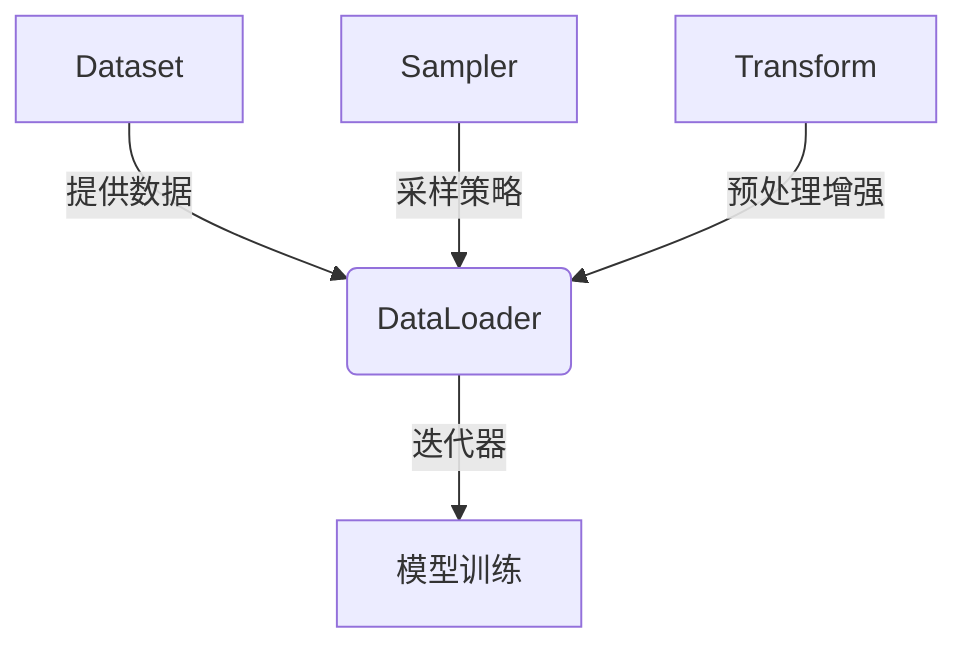

# 从零开始大模型开发与微调：用于自定义数据集的torch.utils.data工具箱使用详解

## 1. 背景介绍

### 1.1 问题的由来

在深度学习领域,数据是驱动模型训练和性能提升的核心要素。然而,现实世界中的数据通常是非结构化的,需要进行预处理和转换,以适应深度学习模型的输入格式。这个过程通常是耗时且容易出错的,尤其是当处理大型数据集时。为了解决这个问题,PyTorch提供了一个强大的数据加载工具箱torch.utils.data,它可以帮助我们高效地加载和预处理自定义数据集,从而加快模型训练的速度。

### 1.2 研究现状

目前,大多数深度学习实践者都在使用PyTorch或TensorFlow等框架进行模型开发和训练。这些框架提供了各种工具和库,用于加载和预处理数据。然而,对于自定义数据集,开发者通常需要编写大量的样板代码来实现数据加载和预处理功能。这不仅耗时且容易出错,还会降低代码的可读性和可维护性。

### 1.3 研究意义

本文旨在深入探讨PyTorch中的torch.utils.data工具箱,并提供详细的示例和最佳实践,帮助读者更好地理解和使用这个工具箱。通过掌握torch.utils.data,读者可以更高效地加载和预处理自定义数据集,从而加快模型开发和训练的速度。此外,本文还将介绍如何利用这个工具箱进行数据增强、批处理和多线程加载等高级技术,以进一步优化数据加载过程。

### 1.4 本文结构

本文将分为以下几个部分:

1. 背景介绍
2. 核心概念与联系
3. 核心算法原理与具体操作步骤
4. 数学模型和公式详细讲解与举例说明
5. 项目实践:代码实例和详细解释说明
6. 实际应用场景
7. 工具和资源推荐
8. 总结:未来发展趋势与挑战
9. 附录:常见问题与解答

## 2. 核心概念与联系

在深入探讨torch.utils.data工具箱之前,我们需要先了解一些核心概念和它们之间的联系。

### 2.1 Dataset

Dataset是torch.utils.data中最基本的概念。它表示一个可迭代的数据集合,每个元素都是一个数据样本。PyTorch提供了一些常用的Dataset类,如TensorDataset、ConcatDataset等。但在大多数情况下,我们需要自定义Dataset类来处理特定格式的数据。

### 2.2 DataLoader

DataLoader是用于加载和批处理数据的迭代器。它接受一个Dataset实例作为输入,并提供了一些高级功能,如批处理、随机采样、多线程加载等。使用DataLoader可以极大地提高数据加载效率,尤其是在处理大型数据集时。

### 2.3 Sampler

Sampler决定了数据从Dataset中被采样的策略。PyTorch提供了几种常用的Sampler,如SequentialSampler、RandomSampler等。我们也可以自定义Sampler来实现特定的采样策略。

### 2.4 Transform

Transform是用于数据预处理和增强的函数或类。PyTorch提供了一些常用的Transform,如ToTensor、Normalize等。我们也可以自定义Transform来满足特定的需求。

### 2.5 核心概念关系

这些核心概念之间的关系如下所示:



在上图中,Dataset提供原始数据,Sampler决定采样策略,Transform实现数据预处理和增强。DataLoader将这些组件结合起来,形成一个高效的数据迭代器,为模型训练提供数据。

## 3. 核心算法原理与具体操作步骤

### 3.1 算法原理概述

torch.utils.data工具箱的核心算法原理可以概括为以下几个步骤:

1. 构建自定义Dataset类,实现`__getitem__`和`__len__`方法。
2. 创建Sampler实例,决定数据采样策略。
3. 创建Transform实例,实现数据预处理和增强。
4. 将Dataset、Sampler和Transform传递给DataLoader,创建数据迭代器。
5. 在训练循环中,使用DataLoader迭代器加载批次数据,进行模型训练。

### 3.2 算法步骤详解

#### 步骤1: 构建自定义Dataset类

自定义Dataset类需要继承PyTorch的Dataset基类,并实现两个方法:

- `__getitem__(self, index)`方法用于获取指定索引的数据样本。
- `__len__(self)`方法返回数据集的总长度。

下面是一个简单的自定义Dataset示例:

```python
import os
from PIL import Image
from torch.utils.data import Dataset

class CustomImageDataset(Dataset):
    def __init__(self, data_dir, transform=None):
        self.data_dir = data_dir
        self.image_paths = [os.path.join(data_dir, f) for f in os.listdir(data_dir)]
        self.transform = transform

    def __getitem__(self, index):
        image_path = self.image_paths[index]
        image = Image.open(image_path).convert('RGB')
        if self.transform:
            image = self.transform(image)
        return image

    def __len__(self):
        return len(self.image_paths)
```

在这个示例中,我们定义了一个CustomImageDataset类,用于加载指定目录下的图像数据。`__getitem__`方法打开图像文件,应用Transform(如果提供),并返回处理后的图像张量。`__len__`方法返回数据集中图像文件的总数。

#### 步骤2: 创建Sampler实例

Sampler决定了数据从Dataset中被采样的策略。PyTorch提供了几种常用的Sampler,如SequentialSampler(顺序采样)、RandomSampler(随机采样)等。我们也可以自定义Sampler来实现特定的采样策略。

下面是一个使用RandomSampler的示例:

```python
from torch.utils.data import RandomSampler

dataset = CustomImageDataset(data_dir)
sampler = RandomSampler(dataset)
```

#### 步骤3: 创建Transform实例

Transform是用于数据预处理和增强的函数或类。PyTorch提供了一些常用的Transform,如ToTensor、Normalize等。我们也可以自定义Transform来满足特定的需求。

下面是一个使用ToTensor和Normalize的示例:

```python
from torchvision.transforms import Compose, ToTensor, Normalize

transform = Compose([
    ToTensor(),
    Normalize(mean=[0.485, 0.456, 0.406], std=[0.229, 0.224, 0.225])
])
```

#### 步骤4: 创建DataLoader实例

DataLoader是用于加载和批处理数据的迭代器。它接受一个Dataset实例作为输入,并提供了一些高级功能,如批处理、随机采样、多线程加载等。

下面是一个创建DataLoader的示例:

```python
from torch.utils.data import DataLoader

dataloader = DataLoader(dataset, batch_size=32, sampler=sampler, num_workers=4)
```

在这个示例中,我们创建了一个DataLoader实例,batch_size设置为32,sampler使用之前创建的RandomSampler实例,num_workers设置为4,表示使用4个线程进行数据加载。

#### 步骤5: 在训练循环中使用DataLoader

在训练循环中,我们可以使用DataLoader迭代器加载批次数据,并将其输入到模型中进行训练。

```python
for images in dataloader:
    # 前向传播
    outputs = model(images)
    # 计算损失
    loss = criterion(outputs, labels)
    # 反向传播和优化
    optimizer.zero_grad()
    loss.backward()
    optimizer.step()
```

### 3.3 算法优缺点

#### 优点

- 高效的数据加载和预处理
- 支持自定义Dataset、Sampler和Transform
- 提供批处理、随机采样、多线程加载等高级功能
- 代码简洁,易于使用和维护

#### 缺点

- 对于一些特殊的数据格式,可能需要编写复杂的自定义Dataset和Transform
- 多线程加载可能会导致一些潜在的问题,如数据竞争和死锁
- 对于一些特殊的采样策略,可能需要编写自定义Sampler

### 3.4 算法应用领域

torch.utils.data工具箱可以应用于各种深度学习任务,如图像分类、目标检测、自然语言处理等。它特别适用于处理大型数据集,可以极大地提高数据加载效率,从而加快模型训练的速度。

## 4. 数学模型和公式详细讲解与举例说明

在深度学习中,数据预处理和增强是非常重要的一个环节。torch.utils.data工具箱提供了一些常用的Transform,如ToTensor、Normalize等,用于实现数据预处理和增强。这些Transform通常涉及一些数学模型和公式,下面我们将详细讲解其中的一些核心概念。

### 4.1 数学模型构建

#### 4.1.1 ToTensor

ToTensor是一个常用的Transform,用于将PIL Image或NumPy数组转换为PyTorch张量。对于PIL Image,ToTensor首先将图像数据从(H, W, C)格式转换为(C, H, W)格式,然后将像素值缩放到[0, 1]范围内。对于NumPy数组,ToTensor直接将其转换为PyTorch张量。

数学模型如下:

$$
\text{tensor} = \frac{\text{image}}{255}
$$

其中,image表示原始图像数据,tensor表示转换后的PyTorch张量。

#### 4.1.2 Normalize

Normalize是另一个常用的Transform,用于对张量数据进行标准化。标准化可以加快模型的收敛速度,并提高模型的性能。

数学模型如下:

$$
\text{normalized} = \frac{\text{tensor} - \text{mean}}{\text{std}}
$$

其中,tensor表示输入张量,mean和std分别表示数据集的均值和标准差,normalized表示标准化后的张量。

在实际应用中,mean和std通常是基于整个数据集计算得到的,以确保标准化过程能够很好地反映数据的分布。

### 4.2 公式推导过程

在深度学习中,标准化是一种常用的数据预处理技术。标准化的目的是将数据转换为均值为0、标准差为1的分布,以便模型更容易学习。下面我们将推导标准化公式。

假设我们有一个数据样本$x$,其均值为$\mu$,标准差为$\sigma$。我们希望将$x$转换为标准正态分布,即均值为0、标准差为1的分布。

首先,我们需要将$x$中心化,即减去均值$\mu$:

$$
x' = x - \mu
$$

这样,$x'$的均值就变为0了。

接下来,我们需要将$x'$缩放到标准差为1。我们可以除以原始标准差$\sigma$:

$$
\frac{x'}{\sigma} = \frac{x - \mu}{\sigma}
$$

这样,我们就得到了标准化后的数据样本$z$:

$$
z = \frac{x - \mu}{\sigma}
$$

$z$的均值为0,标准差为1,符合标准正态分布的要求。

在实际应用中,我们通常会基于整个数据集计算均值$\mu$和标准差$\sigma$,然后对每个数据样本进行标准化。这样可以确保标准化过程能够很好地反映数据的分布。

### 4.3 案例分析与讲解

现在,让我们通过一个具体的案例来演示如何使用torch.utils.data工具箱进行数据预处理和增强。

假设我们有一个包含多个图像文件的目录,我们希望加载这些图像,并对它们进行一些预处理和增强操作,如调整大小、标准化等。我们将使用之前介绍的ToTensor和Normalize Transform,以及一些其他常用的Transform。

```python
from torchvision.transforms import Compose, Resize, ToTensor, Normalize

# 定义Transform
transform = Compose([
    Resize((224, 224)),  # 调整图像大小
    ToTensor(),  # 将PIL Image转换为PyTorch张量
    Normalize(mean=[0.485, 0.456, 0.406], std=[0.229, 0.224, 0.225])  # 标准化
])

# 创建自定义Dataset
dataset = CustomImageDataset(data_dir, transform=transform)

# 创建DataLoader
dataloader = DataLoader(dataset, batch_size=32, shuffle=True, num_workers=4)
```

在上面的代码中,我