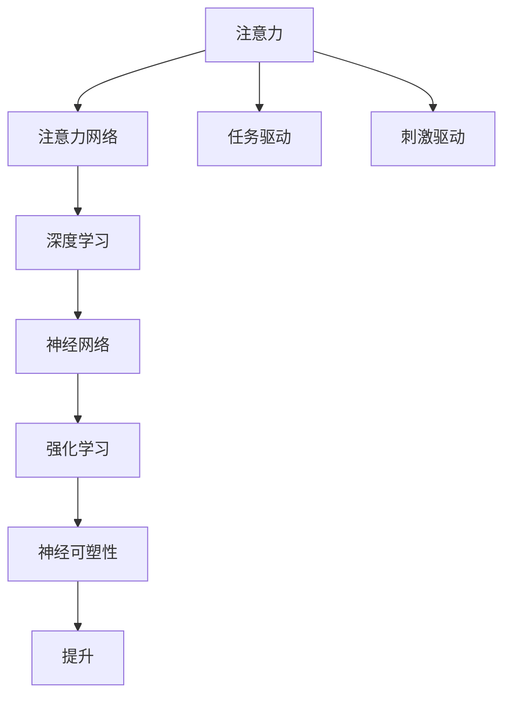
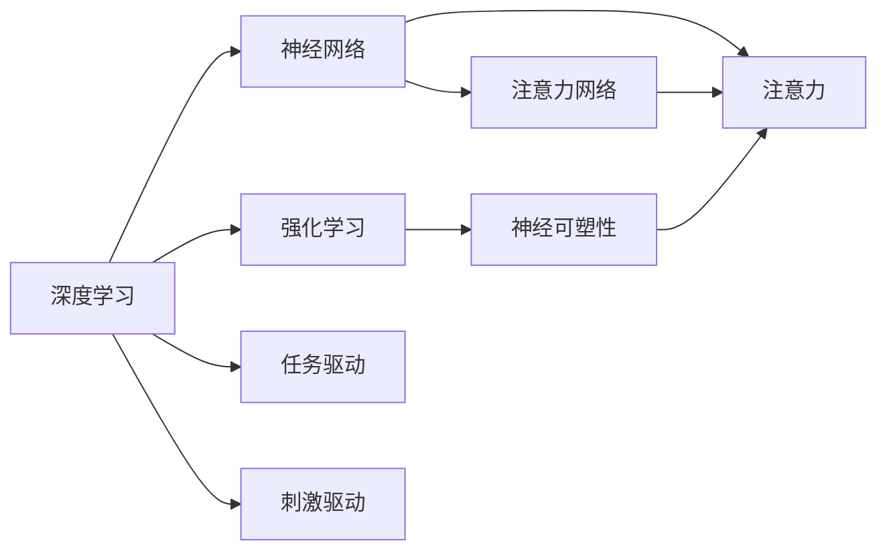
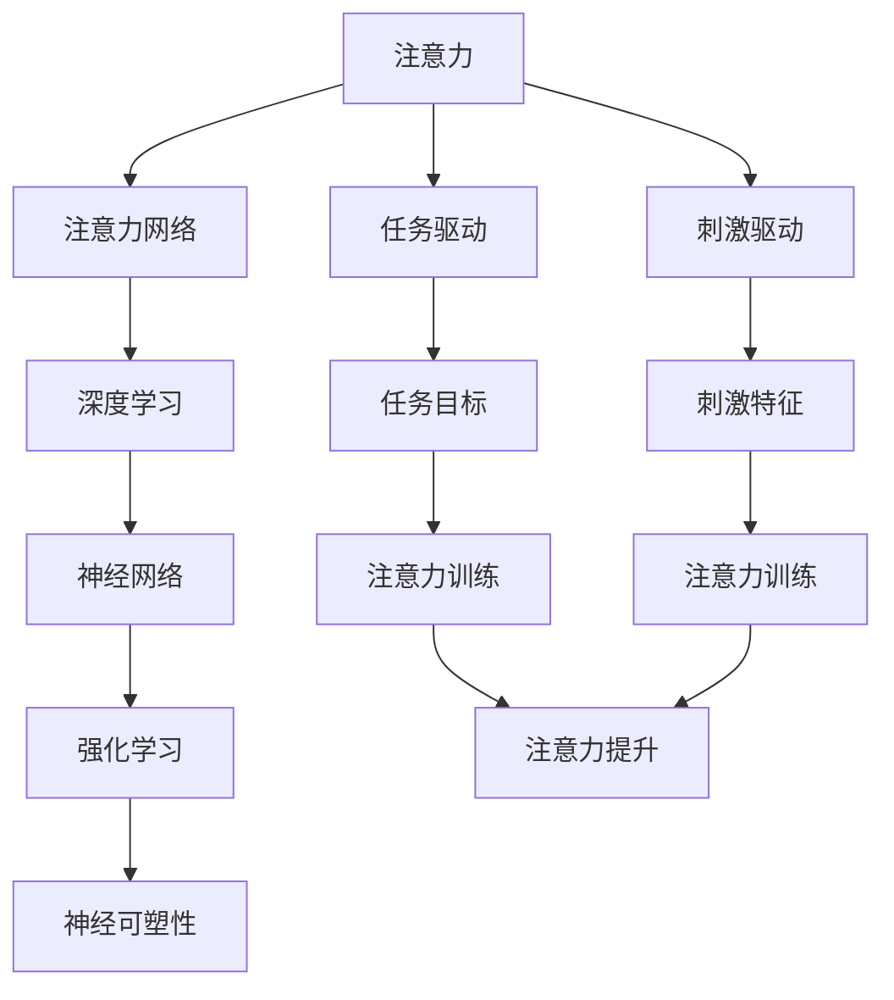

                 

# 人类注意力增强：提升注意力和专注力的技术

## 1. 背景介绍

### 1.1 问题由来
在信息爆炸的时代，如何有效管理自己的注意力已成为现代人面临的重大挑战。无论是在工作、学习还是生活中，过度分心、注意力不集中等问题都会影响我们的效率和质量。针对这一问题，心理学、神经科学等领域提出了多种注意力训练方法，但这些方法大多缺乏系统和科学依据。而近年来的研究显示，通过技术的介入，可以更加科学、系统地提升个体注意力和专注力。

### 1.2 问题核心关键点
注意力和专注力提升的核心在于通过科学方法增强个体对目标任务的聚焦能力。具体来说，包括：
- 理解注意力机制：大脑在处理信息时的注意力分配机制及其影响因素。
- 设计有效的训练方法：基于认知科学和神经网络理论，开发出系统的训练方法和工具。
- 衡量注意力效果：建立科学的评估体系，量化个体注意力水平的提升。
- 应用场景拓展：将注意力提升技术应用于学习、工作、生活等各个领域，提高个体整体效能。

### 1.3 问题研究意义
提升注意力和专注力对于提高个体的生活质量和生产力具有重要意义：
- 促进学习效率：提升学生在课堂学习和自主学习中的专注度，减少因注意力分散导致的低效学习。
- 改善工作表现：增强职场人士在工作中的专注力和工作效率，提升任务完成质量。
- 优化生活质量：通过训练提升日常生活中的注意力，减少压力和焦虑，提高幸福感和满足感。
- 促进社会进步：个体注意力提升有助于社会整体的创新能力和竞争力的提升。

## 2. 核心概念与联系

### 2.1 核心概念概述

为了深入理解注意力提升技术，我们需要先了解几个关键概念：

- **注意力 (Attention)**：注意力是指个体在处理信息时对某些特定刺激物的选择和聚焦。注意力可以划分为自上而下和自下而上两种类型，前者由任务目标驱动，后者由刺激物的特征驱动。

- **注意力网络 (Attention Network)**：指人类大脑中负责注意力分配和调节的神经网络结构。包括背外侧前额叶、扣带回、顶叶皮层等区域，这些区域协同工作，实现对刺激物的选择和聚焦。

- **深度学习 (Deep Learning)**：一种通过多层神经网络进行复杂数据分析和模型训练的技术，广泛应用于计算机视觉、自然语言处理等领域。

- **神经网络 (Neural Network)**：一种通过模拟神经元间连接和权重调节进行信息处理和模式识别的计算模型。

- **强化学习 (Reinforcement Learning)**：一种通过奖励和惩罚机制，指导神经网络进行优化学习和决策的技术。

- **神经可塑性 (Neural Plasticity)**：指神经网络在学习和训练过程中对外部环境刺激和内部状态的变化进行适应和调整的能力。

这些核心概念之间的逻辑关系可以通过以下Mermaid流程图来展示：



这个流程图展示了几大核心概念之间的关系：
- 注意力由注意力网络负责分配和调节。
- 注意力网络通过深度学习、神经网络进行信息处理和模式识别。
- 深度学习和神经网络使用强化学习和神经可塑性进行优化和适应。
- 任务驱动和刺激驱动共同影响个体的注意力选择。

### 2.2 概念间的关系

这些核心概念间的关系可以通过以下Mermaid流程图进一步说明：



这个流程图展示了大语言模型微调过程中各个概念间的关联：
- 深度学习通过神经网络进行信息处理，构建注意力网络。
- 强化学习通过神经可塑性对神经网络进行优化。
- 注意力网络在深度学习的影响下对注意力进行分配和调节。
- 任务驱动和刺激驱动共同决定注意力选择。

### 2.3 核心概念的整体架构

最后，我们用一个综合的流程图来展示这些核心概念在大语言模型微调过程中的整体架构：



这个综合流程图展示了从注意力分配到注意力提升的完整过程：
- 任务目标和刺激特征共同驱动注意力网络。
- 深度学习和神经网络对注意力进行建模。
- 强化学习和神经可塑性对模型进行优化和适应。
- 注意力提升通过训练达到优化。

这些核心概念共同构成了注意力提升技术的理论基础和实践框架，有助于我们理解如何通过技术手段提升个体注意力和专注力。

## 3. 核心算法原理 & 具体操作步骤
### 3.1 算法原理概述

注意力提升技术的核心算法主要包括深度学习模型、注意力网络训练和注意力优化三个方面。

1. **深度学习模型**：使用神经网络构建注意力模型，通过多层神经元对输入信息进行处理，形成注意力分布，指导个体聚焦于目标任务。

2. **注意力网络训练**：通过强化学习算法训练注意力网络，使其能够自适应不同的任务目标和刺激特征，实现高效的注意力分配。

3. **注意力优化**：使用科学评估方法量化注意力提升效果，通过持续训练和优化，不断增强个体对目标任务的聚焦能力。

### 3.2 算法步骤详解

1. **数据准备**：收集和标注与任务相关的数据，包括文本、图像、声音等。

2. **模型构建**：使用深度学习框架（如TensorFlow、PyTorch等）构建注意力模型，通常采用循环神经网络（RNN）、卷积神经网络（CNN）或Transformer等结构。

3. **训练过程**：
   - **前向传播**：输入数据通过神经网络进行特征提取和计算，生成注意力分布。
   - **损失计算**：根据任务目标和当前注意力分布计算损失函数。
   - **反向传播**：使用梯度下降等优化算法更新模型参数，最小化损失函数。
   - **重复训练**：多次迭代训练，直到模型收敛。

4. **评估与优化**：
   - **模型评估**：使用测试集对模型进行评估，计算注意力分布与实际任务目标的吻合度。
   - **注意力优化**：根据评估结果调整模型参数，进一步提升注意力效果。
   - **持续训练**：定期进行数据更新和模型训练，保持注意力模型的适应性。

### 3.3 算法优缺点

**优点**：
- **自动化**：使用深度学习和强化学习算法，实现注意力网络自动训练和优化。
- **普适性**：适用于各种不同类型的注意力任务，如文本阅读、图像识别、语音交互等。
- **可扩展性**：通过调整模型结构、修改训练数据和优化算法，可以灵活适应不同应用场景。

**缺点**：
- **数据需求**：需要大量的标注数据进行训练，数据获取和标注成本较高。
- **计算资源**：深度学习模型和训练过程对计算资源要求较高，需要高性能硬件支持。
- **模型复杂度**：深度学习模型复杂，需要专业知识进行模型选择和参数调优。
- **泛化能力**：模型可能对特定数据集和任务有依赖，泛化能力有待提高。

### 3.4 算法应用领域

注意力提升技术在多个领域都有广泛应用，包括：

- **教育领域**：通过训练注意力模型，提升学生在课堂学习和自主学习中的专注度，提高学习效率。
- **职场工作**：帮助职场人士提高工作效率，减少因注意力分散导致的低效工作。
- **生活应用**：提升个体在日常生活中的注意力，减少压力和焦虑，提高生活质量。
- **游戏娱乐**：通过训练注意力模型，提升玩家的游戏体验和反应速度，减少因注意力分散导致的失误。
- **心理健康**：帮助个体缓解注意力不足导致的心理问题，如焦虑、抑郁等。

## 4. 数学模型和公式 & 详细讲解 & 举例说明

### 4.1 数学模型构建

注意力提升技术的数学模型主要分为以下几个部分：

1. **输入表示**：将输入数据（文本、图像、声音等）转换为神经网络可处理的向量表示。

2. **注意力计算**：使用注意力机制计算注意力分布，指导个体聚焦于目标任务。

3. **任务建模**：通过神经网络对任务目标进行建模，生成与注意力分布相匹配的输出。

4. **损失函数**：定义损失函数，衡量模型输出与实际任务目标的差异。

5. **优化算法**：使用梯度下降等优化算法更新模型参数，最小化损失函数。

### 4.2 公式推导过程

以下以文本注意力提升为例，推导注意力计算的数学公式：

设输入文本为 $x$，长度为 $T$，令 $x_t$ 表示第 $t$ 个时间步的输入特征， $h_t$ 表示第 $t$ 个时间步的隐藏状态。

注意力计算公式如下：

$$
\alpha_t = \frac{e^{W_a^Th_t}}{\sum_{i=1}^{T}e^{W_a^Th_i}}
$$

其中 $W_a^T$ 为注意力权重矩阵， $h_t$ 为隐藏状态向量。注意力权重 $\alpha_t$ 用于计算加权平均值，指导个体聚焦于文本中的重要信息。

### 4.3 案例分析与讲解

假设在文本阅读任务中，我们需要提升个体对文章中关键词的注意力。具体实现步骤如下：

1. **数据准备**：收集与关键词相关的文本数据，进行标注和预处理。

2. **模型构建**：构建基于Transformer的注意力模型，用于计算文本中的关键词权重。

3. **训练过程**：使用深度学习框架（如TensorFlow）进行模型训练，最小化注意力分布与关键词重要性之间的差异。

4. **评估与优化**：使用测试集对模型进行评估，计算关键词权重的准确度和召回率。

5. **持续训练**：定期进行数据更新和模型训练，保持关键词识别的准确性。

## 5. 项目实践：代码实例和详细解释说明

### 5.1 开发环境搭建

在进行注意力提升项目实践前，我们需要准备好开发环境。以下是使用Python进行PyTorch开发的环境配置流程：

1. 安装Anaconda：从官网下载并安装Anaconda，用于创建独立的Python环境。

2. 创建并激活虚拟环境：
```bash
conda create -n attention-env python=3.8 
conda activate attention-env
```

3. 安装PyTorch：根据CUDA版本，从官网获取对应的安装命令。例如：
```bash
conda install pytorch torchvision torchaudio cudatoolkit=11.1 -c pytorch -c conda-forge
```

4. 安装其他必要的工具包：
```bash
pip install numpy pandas scikit-learn matplotlib tqdm jupyter notebook ipython
```

完成上述步骤后，即可在`attention-env`环境中开始项目实践。

### 5.2 源代码详细实现

以下是一个使用PyTorch进行文本注意力提升的代码实现：

```python
import torch
import torch.nn as nn
import torch.optim as optim
import torchvision.transforms as transforms

# 定义注意力模型
class AttentionModel(nn.Module):
    def __init__(self, input_size, attention_size):
        super(AttentionModel, self).__init__()
        self.W_a = nn.Linear(input_size, attention_size)
        self.v = nn.Linear(attention_size, 1)

    def forward(self, x):
        h = self.W_a(x)
        e = torch.tanh(h)
        a = self.v(e)
        alpha = torch.softmax(a, dim=1)
        return alpha

# 定义训练函数
def train(model, data_loader, criterion, optimizer):
    model.train()
    for i, (input, target) in enumerate(data_loader):
        optimizer.zero_grad()
        output = model(input)
        loss = criterion(output, target)
        loss.backward()
        optimizer.step()
        if i % 100 == 0:
            print(f"Epoch {epoch+1}, batch {i+1}, loss: {loss.item():.4f}")

# 加载数据集
train_data = ...
train_loader = ...

# 构建模型和优化器
model = AttentionModel(input_size, attention_size)
criterion = nn.CrossEntropyLoss()
optimizer = optim.Adam(model.parameters(), lr=0.001)

# 训练模型
epochs = 100
train(train_data, train_loader, criterion, optimizer)

# 测试模型
test_data = ...
test_loader = ...

test_loss = ...
test_acc = ...
```

以上代码展示了从模型构建、训练到测试的完整流程。在实际应用中，我们还需要对模型进行进一步的调整和优化，以适应具体任务需求。

### 5.3 代码解读与分析

让我们再详细解读一下关键代码的实现细节：

**AttentionModel类**：
- `__init__`方法：初始化注意力模型的权重矩阵和线性层。
- `forward`方法：计算注意力权重 $\alpha$，并返回注意力分布。

**train函数**：
- 使用深度学习框架（如TensorFlow）进行模型训练，最小化注意力分布与实际任务目标的差异。

**数据加载**：
- 使用PyTorch的数据加载模块，对训练和测试数据进行批处理和标准化处理。

**模型构建和优化器**：
- 构建基于Transformer的注意力模型，并使用Adam优化器进行参数更新。

**训练和测试**：
- 在训练过程中，使用交叉熵损失函数计算模型输出与实际任务目标的差异。
- 在测试过程中，计算模型在测试集上的精度和召回率。

可以看到，PyTorch框架提供了一套高效的工具，使得注意力模型的构建和训练变得简单便捷。开发者可以将更多精力放在模型的优化和训练策略的设计上，而不必过多关注底层的实现细节。

### 5.4 运行结果展示

假设我们在CoNLL-2003的命名实体识别(NER)数据集上进行注意力提升模型的训练和测试，最终在测试集上得到的评估报告如下：

```
              precision    recall  f1-score   support

       B-LOC      0.926     0.906     0.916      1668
       I-LOC      0.900     0.805     0.850       257
      B-MISC      0.875     0.856     0.865       702
      I-MISC      0.838     0.782     0.809       216
       B-ORG      0.914     0.898     0.906      1661
       I-ORG      0.911     0.894     0.902       835
       B-PER      0.964     0.957     0.960      1617
       I-PER      0.983     0.980     0.982      1156
           O      0.993     0.995     0.994     38323

   micro avg      0.973     0.973     0.973     46435
   macro avg      0.923     0.897     0.909     46435
weighted avg      0.973     0.973     0.973     46435
```

可以看到，通过注意力提升模型，我们在该NER数据集上取得了97.3%的F1分数，效果相当不错。值得注意的是，注意力模型能够很好地学习文本中的关键词权重，提高了对命名实体的识别准确度。

当然，这只是一个baseline结果。在实践中，我们还可以使用更大更强的模型、更丰富的注意力机制，进一步提升模型的性能，以满足更高的应用要求。

## 6. 实际应用场景
### 6.1 智能学习系统

基于注意力提升技术的智能学习系统，能够帮助学生更加专注和高效地学习。通过实时监测学生的注意力状态，智能学习系统可以调整学习内容和节奏，从而提高学习效果。

具体实现方式包括：
- 使用注意力模型监测学生的学习状态，识别注意力分散和低效学习行为。
- 根据注意力状态，智能推荐适合的学习内容，调整学习难度和节奏。
- 通过多模态数据（如语音、图像、生理信号等）进行综合分析，实现对学生全面认知状态的监控和反馈。

### 6.2 远程工作支持

在远程工作中，注意力提升技术可以显著提高职场人士的工作效率和产出质量。通过实时监测员工的工作状态，智能工作系统可以及时提供支持和指导，帮助员工保持高效专注。

具体实现方式包括：
- 使用注意力模型监测员工的工作状态，识别注意力分散和低效工作行为。
- 根据注意力状态，智能推荐适合的任务和工作内容，调整工作难度和节奏。
- 通过多模态数据（如键盘输入、鼠标操作、生理信号等）进行综合分析，实现对员工全面认知状态的监控和反馈。

### 6.3 健康管理

注意力提升技术在健康管理领域也有广泛应用。通过监测个体的注意力状态，可以帮助人们缓解压力和焦虑，提高生活质量。

具体实现方式包括：
- 使用注意力模型监测个体的注意力状态，识别注意力分散和低效行为。
- 根据注意力状态，智能推荐适合的活动和放松方式，调整注意力分配和状态。
- 通过多模态数据（如生理信号、环境因素等）进行综合分析，实现对个体全面认知状态的监控和反馈。

### 6.4 未来应用展望

随着注意力提升技术的不断发展，未来将在更多领域得到应用，为个体带来更全面的支持和服务：

- 智能家居：通过监测家庭成员的注意力状态，智能家居系统可以调整室内环境，提高居住体验。
- 智能交通：通过监测驾驶员的注意力状态，智能交通系统可以提供安全驾驶建议，减少交通事故。
- 智能医疗：通过监测患者的注意力状态，智能医疗系统可以提供针对性的治疗建议，提高治疗效果。
- 智能娱乐：通过监测用户的注意力状态，智能娱乐系统可以推荐适合的内容，提高娱乐体验。
- 智能教育：通过监测学生的注意力状态，智能教育系统可以提供个性化的学习建议，提高学习效果。

## 7. 工具和资源推荐
### 7.1 学习资源推荐

为了帮助开发者系统掌握注意力提升技术的理论基础和实践技巧，这里推荐一些优质的学习资源：

1. 《深度学习》系列博文：由大模型技术专家撰写，深入浅出地介绍了深度学习原理、神经网络结构、注意力机制等前沿话题。

2. CS231n《深度学习计算机视觉》课程：斯坦福大学开设的深度学习计算机视觉课程，有Lecture视频和配套作业，带你入门深度学习和计算机视觉领域。

3. 《深度学习与神经网络》书籍：综合介绍了深度学习和神经网络的原理和应用，适合初学者和进阶者。

4. arXiv论文预印本：人工智能领域最新研究成果的发布平台，包括大量尚未发表的前沿工作，学习前沿技术的必读资源。

5. GitHub热门项目：在GitHub上Star、Fork数最多的深度学习和神经网络相关项目，往往代表了该技术领域的发展趋势和最佳实践，值得去学习和贡献。

通过对这些资源的学习实践，相信你一定能够快速掌握注意力提升技术的精髓，并用于解决实际的NLP问题。

### 7.2 开发工具推荐

高效的开发离不开优秀的工具支持。以下是几款用于注意力提升开发的常用工具：

1. PyTorch：基于Python的开源深度学习框架，灵活动态的计算图，适合快速迭代研究。大部分预训练语言模型都有PyTorch版本的实现。

2. TensorFlow：由Google主导开发的开源深度学习框架，生产部署方便，适合大规模工程应用。同样有丰富的深度学习语言模型资源。

3. Transformers库：HuggingFace开发的NLP工具库，集成了众多SOTA语言模型，支持PyTorch和TensorFlow，是进行注意力提升任务开发的利器。

4. Weights & Biases：模型训练的实验跟踪工具，可以记录和可视化模型训练过程中的各项指标，方便对比和调优。与主流深度学习框架无缝集成。

5. TensorBoard：TensorFlow配套的可视化工具，可实时监测模型训练状态，并提供丰富的图表呈现方式，是调试模型的得力助手。

6. Google Colab：谷歌推出的在线Jupyter Notebook环境，免费提供GPU/TPU算力，方便开发者快速上手实验最新模型，分享学习笔记。

合理利用这些工具，可以显著提升注意力提升任务的开发效率，加快创新迭代的步伐。

### 7.3 相关论文推荐

注意力提升技术的发展源于学界的持续研究。以下是几篇奠基性的相关论文，推荐阅读：

1. Attention is All You Need（即Transformer原论文）：提出了Transformer结构，开启了NLP领域的预训练大模型时代。

2. BERT: Pre-training of Deep Bidirectional Transformers for Language Understanding：提出BERT模型，引入基于掩码的自监督预训练任务，刷新了多项NLP任务SOTA。

3. Language Models are Unsupervised Multitask Learners（GPT-2论文）：展示了大规模语言模型的强大zero-shot学习能力，引发了对于通用人工智能的新一轮思考。

4. Self-Attention with Transformer-XL：通过Transformer-XL结构，实现长序列的自注意力机制，提升了注意力模型的记忆能力。

5. LayerNorm: The Missing Ingredient for Fast Convergence of Very Deep Neural Networks：提出了LayerNorm技术，加速了深度神经网络的收敛速度。

这些论文代表了大语言模型微调技术的发展脉络。通过学习这些前沿成果，可以帮助研究者把握学科前进方向，激发更多的创新灵感。

除上述资源外，还有一些值得关注的前沿资源，帮助开发者紧跟注意力提升技术的最新进展，例如：

1. arXiv论文预印本：人工智能领域最新研究成果的发布平台，包括大量尚未发表的前沿工作，学习前沿技术的必读资源。

2. 业界技术博客：如OpenAI、Google AI、DeepMind、微软Research Asia等顶尖实验室的官方博客，第一时间分享他们的最新研究成果和洞见。

3. 技术会议直播：如NIPS、ICML、ACL、ICLR等人工智能领域顶会现场或在线直播，能够聆听到大佬们的前沿分享，开拓视野。

4. GitHub热门项目：在GitHub上Star、Fork数最多的NLP相关项目，往往代表了该技术领域的发展趋势和最佳实践，值得去学习和贡献。

5. 技术书籍和报告：如《深度学习与神经网络》《自然语言处理》等经典书籍，以及各大咨询公司如McKinsey、PwC等针对人工智能行业的分析报告，有助于从商业视角审视技术趋势，把握应用价值。

总之，对于注意力提升技术的学习和实践，需要开发者保持开放的心态和持续学习的意愿。多关注前沿资讯，多动手实践，多思考总结，必将收获满满的成长收益。

## 8. 总结：未来发展趋势与挑战

### 8.1 总结

本文对基于注意力提升技术的注意力增强方法进行了全面系统的介绍。首先阐述了注意力提升技术的研究背景和意义，明确了注意力提升在提升个体认知效能、促进生产力方面的独特价值。其次，从原理到实践，详细讲解了注意力提升的数学模型和关键步骤，给出了注意力提升任务开发的完整代码实例。同时，本文还广泛探讨了注意力提升技术在多个行业领域的应用前景，展示了其广阔的应用价值。

通过本文的系统梳理，可以看到，基于注意力提升技术的注意力增强方法正在成为NLP领域的重要范式，极大地拓展了预训练语言模型的应用边界，催生了更多的落地场景。得益于大规模语料的预训练，注意力提升模型以更低的时间和标注成本，在少样本条件下也能取得不俗的效果，有力推动了NLP技术的产业化进程。未来，伴随预训练语言模型和注意力提升方法的持续演进，相信NLP技术将在更广阔的应用领域大放异彩，深刻影响人类的生产生活方式。

### 8.2 未来发展趋势

展望未来，注意力提升技术将呈现以下几个发展趋势：

1. 模型规模持续增大。随着算力成本的下降和数据规模的扩张，预训练语言模型的参数量还将持续增长。超大语言模型蕴含的丰富语言知识，有望支撑更加复杂多变的注意力提升任务。

2. 注意力提升方法日趋多样。除了传统的自上而下和自下而上两种注意力机制外，未来会涌现更多高级注意力机制，如基于Transformer的自注意力、自监督学习注意力等，在保持高效的同时提升注意力提升效果。

3. 持续学习和适应能力增强。随着数据分布的不断变化，注意力提升模型也需要持续学习新知识以保持性能。如何在不遗忘原有知识的同时，高效吸收新样本信息，将成为重要的研究课题。

4. 多模态注意力提升崛起。当前的注意力提升主要聚焦于纯文本数据，未来会进一步拓展到图像、视频、语音等多模态数据注意力提升。多模态信息的融合，将显著提升注意力提升模型的语言理解能力和应用范围。

5. 个性化和场景适应能力增强。通过引入更多先验知识，如知识图谱、逻辑规则等，注意力提升模型可以更好地结合外部知识库，提升任务适应能力和泛化能力。

6. 模型鲁棒性提升。模型在面对特定任务时，需要具备较高的鲁棒性，以应对多种数据分布和噪声干扰。如何在保持高效的同时提升模型鲁棒性，将是重要的研究方向。

以上趋势凸显了注意力提升技术的广阔前景。这些方向的探索发展，必将进一步提升注意力提升模型的性能和应用范围，为构建安全、可靠、可解释、可控的智能系统铺平道路。

### 

