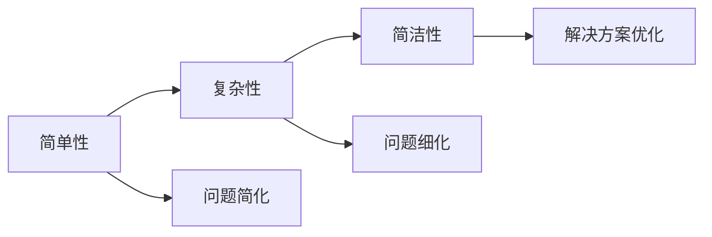
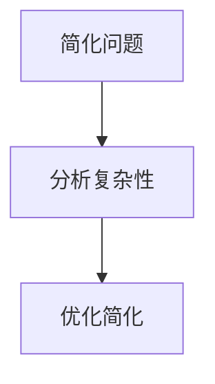

                 

# 从简单到复杂再到简洁的认知过程

## 1. 背景介绍

### 1.1 问题由来
在信息处理和人工智能领域，理解复杂问题并找到简洁有效的解决方案始终是一个核心问题。无论是理论研究还是实际应用，认知过程的复杂性与简洁性之间往往存在矛盾：一方面，解决复杂问题的过程通常需要深入分析、不断迭代；另一方面，为了高效执行任务，我们又需要尽量减少处理过程中的冗余和噪声。

这一矛盾在近年来随着深度学习和大数据技术的发展变得尤为突出。深度学习模型能够处理复杂的数据分布，捕捉非线性关系，但其模型的庞大和复杂使得训练、调优和推理的过程非常耗时和资源密集。大数据带来了前所未有的信息量，但同时也带来了“信息过载”的问题，如何从中提取关键信息，高效地进行分析和决策，成为一个需要系统性解决的问题。

本文旨在探讨从简单到复杂再到简洁的认知过程，通过理论和实践相结合的方式，揭示其中的逻辑与规律，为解决复杂问题提供指导。

## 2. 核心概念与联系

### 2.1 核心概念概述

为了深入探讨这一认知过程，我们首先定义几个关键概念：

- **简单性(Simplicity)**：指问题的表达或解决方案的简洁程度，通常用算法或模型的复杂度来衡量。
- **复杂性(Complexity)**：指问题本身或解决方案的复杂程度，表现为问题规模、结构、解法的多样性和不确定性。
- **简洁性(Cconciseness)**：指在保证效果的前提下，尽量减少算法或模型中不必要的复杂度，以提升效率和可维护性。

这三个概念之间的关系可以通过以下Mermaid流程图来表示：



### 2.2 概念间的关系

这些核心概念之间存在着紧密的联系，构成了认知过程的基本框架：

- **从简单到复杂**：任何复杂问题的解决都始于对其简单化的处理。通过分解、抽象、归纳等方法，将原始问题转化为更易于处理的形式。
- **从复杂到简洁**：在复杂性得到充分理解的基础上，通过优化、合并、压缩等手段，减少不必要的冗余，得到简洁的解决方案。
- **复杂性与简洁性的平衡**：简化过程可能引入新的复杂性，如增加中间步骤、引入新的假设等；而复杂化过程则可能增加求解难度，降低效率。如何在两者之间找到平衡，是解决复杂问题的关键。

## 3. 核心算法原理 & 具体操作步骤

### 3.1 算法原理概述

基于以上概念，我们提出一种认知过程的理论模型，其核心思想可以概括为：**通过不断简化问题，深入分析复杂性，最终实现简洁高效的解决方案**。这一过程可以分为三个主要步骤：

1. **简化问题**：通过分解、抽象、归纳等方法，将复杂问题转化为更易于处理的形式。
2. **分析复杂性**：深入理解问题的本质和结构，确定问题的关键要素和约束条件。
3. **优化简化**：在充分理解问题复杂性的基础上，通过优化、压缩等手段，得到简洁的解决方案。

这一过程可以用下面的流程图示意：



### 3.2 算法步骤详解

为了更具体地理解这一认知过程，我们以一个简单的数据分类问题为例，逐步展示简化、分析、优化三个步骤。

#### 3.2.1 简化问题

假设我们有一组数据集，每个数据点包含若干个特征，目标是将其分为两个类别。一个简单的处理方法是对每个特征计算平均值，以此作为分类依据。这种方法虽然简单，但在数据特征复杂且类别分布不均匀的情况下，可能无法取得理想的分类效果。

因此，我们可以对数据进行初步的观察和分析，确定哪些特征对分类有帮助，哪些可能引入噪声。例如，在图像分类问题中，颜色直方图和纹理特征可能是重要的分类依据。我们通过可视化工具对数据进行初步分析，以减少无关特征的干扰。

#### 3.2.2 分析复杂性

在初步简化问题后，我们需要深入分析数据的复杂性。以分类问题为例，我们可以考虑使用决策树、支持向量机、神经网络等算法，对数据的复杂结构进行建模。通过交叉验证等方法，评估不同算法的性能，并选择合适的模型。

例如，决策树算法可以很好地处理非线性关系，但对数据噪声和过拟合敏感。支持向量机算法在处理高维数据和噪声数据时表现良好，但对于大规模数据集计算量较大。神经网络算法可以自动学习复杂的非线性关系，但对数据预处理和模型参数优化要求较高。

#### 3.2.3 优化简化

在选择好合适的算法后，我们需要进一步优化简化，以提高模型效率和可解释性。例如，对于神经网络模型，可以通过减少层数、节点数、特征维度等方式降低复杂度。对于决策树模型，可以通过剪枝、限制树的深度等方式减少模型复杂性。

此外，我们还可以考虑并行计算、分布式训练等技术，以提升模型训练和推理的效率。例如，使用GPU加速神经网络训练，或者使用分布式系统对大规模数据进行分布式训练。

### 3.3 算法优缺点

简化、分析、优化的认知过程具有以下优点：

- **高效性**：通过简化和优化，可以减少不必要的数据处理和计算，提高求解效率。
- **可解释性**：简化过程有助于理解问题本质，优化过程有助于提升模型的可解释性，便于调试和维护。
- **灵活性**：简化和分析的过程可以根据问题的复杂性进行调整，以适应不同的任务需求。

同时，这一过程也存在一些缺点：

- **复杂性引入**：简化过程可能引入新的复杂性，如中间步骤增加、计算量增大等。
- **过度简化**：过度简化可能导致模型性能下降，无法准确反映问题本质。
- **过度复杂**：过度分析复杂性可能导致模型过于复杂，难以调试和维护。

### 3.4 算法应用领域

基于简化、分析、优化的认知过程，已在多个领域得到应用：

- **机器学习**：在数据预处理、特征选择、模型选择和优化等方面，通过简化和分析，提高了模型的求解效率和性能。
- **自然语言处理(NLP)**：在文本分类、信息抽取、问答系统等任务中，通过简化和分析，提升了模型的理解和生成能力。
- **计算机视觉**：在图像识别、目标检测、图像分割等任务中，通过简化和分析，提高了模型的识别和推理能力。
- **推荐系统**：在个性化推荐、协同过滤等方面，通过简化和分析，提升了推荐效果和用户体验。
- **网络安全**：在恶意代码检测、入侵检测等方面，通过简化和分析，提高了系统的检测和响应能力。

## 4. 数学模型和公式 & 详细讲解  
### 4.1 数学模型构建

假设我们有一组数据集 $D=\{(x_i, y_i)\}_{i=1}^N$，其中 $x_i$ 为输入特征，$y_i$ 为输出标签。我们的目标是构建一个分类模型 $f(x)$，使得 $f(x)$ 能够将数据分为两个类别，即 $f(x_i) \in \{0, 1\}$，且满足 $f(x_i) = y_i$ 的误差最小化。

设 $\theta$ 为模型的参数，则模型的预测输出为 $f(x) = \sigma(\theta^T x)$，其中 $\sigma$ 为激活函数。我们的目标是找到最优参数 $\theta$，使得模型在训练集 $D$ 上的损失函数 $L(\theta)$ 最小化。

#### 4.1.1 损失函数

常用的损失函数包括交叉熵损失（Cross-Entropy Loss）和均方误差损失（Mean Squared Error Loss）：

- 交叉熵损失：用于分类问题，定义为 $L(\theta) = -\frac{1}{N}\sum_{i=1}^N [y_i \log \hat{y}_i + (1-y_i) \log (1-\hat{y}_i)]$。
- 均方误差损失：用于回归问题，定义为 $L(\theta) = \frac{1}{N}\sum_{i=1}^N (y_i - \hat{y}_i)^2$。

#### 4.1.2 优化目标

我们的优化目标是最小化损失函数 $L(\theta)$，即 $\theta^* = \mathop{\arg\min}_{\theta} L(\theta)$。

### 4.2 公式推导过程

以交叉熵损失为例，推导模型参数的更新公式：

设模型的预测输出为 $f(x) = \sigma(\theta^T x)$，则损失函数 $L(\theta)$ 可以表示为：

$$
L(\theta) = -\frac{1}{N}\sum_{i=1}^N [y_i \log f(x_i) + (1-y_i) \log (1-f(x_i))]
$$

对损失函数 $L(\theta)$ 关于 $\theta$ 求导，得到梯度 $\nabla_{\theta}L(\theta)$：

$$
\nabla_{\theta}L(\theta) = -\frac{1}{N}\sum_{i=1}^N [y_i \nabla_{\theta}f(x_i) - (1-y_i)\nabla_{\theta}f(x_i)]
$$

其中 $\nabla_{\theta}f(x_i) = \frac{\partial f(x_i)}{\partial \theta}$ 为预测输出对参数的偏导数。

通过梯度下降等优化算法，更新模型参数 $\theta$，最小化损失函数 $L(\theta)$，得到最终的优化公式：

$$
\theta \leftarrow \theta - \eta \nabla_{\theta}L(\theta)
$$

其中 $\eta$ 为学习率，控制每次参数更新的步长。

### 4.3 案例分析与讲解

假设我们有一个简单的线性回归问题，数据集 $D=\{(x_i, y_i)\}_{i=1}^N$，其中 $x_i$ 为输入特征，$y_i$ 为输出标签。我们的目标是构建一个线性回归模型 $f(x) = \theta_0 + \theta_1 x_1 + \theta_2 x_2$，使得模型在训练集 $D$ 上的损失函数 $L(\theta)$ 最小化。

#### 4.3.1 简化问题

首先，我们对数据进行初步观察和分析，确定哪些特征对回归有帮助，哪些可能引入噪声。例如，在房价预测问题中，面积、位置等特征可能是重要的回归依据。我们通过可视化工具对数据进行初步分析，以减少无关特征的干扰。

#### 4.3.2 分析复杂性

在初步简化问题后，我们需要深入分析数据的复杂性。在房价预测问题中，我们可以考虑使用线性回归模型、多项式回归模型、决策树回归模型等算法，对数据的复杂结构进行建模。通过交叉验证等方法，评估不同算法的性能，并选择合适的模型。

#### 4.3.3 优化简化

在选择好合适的算法后，我们需要进一步优化简化，以提高模型效率和可解释性。例如，对于线性回归模型，可以通过最小二乘法、梯度下降法等方法优化模型参数。对于决策树回归模型，可以通过剪枝、限制树的深度等方式减少模型复杂性。

## 5. 项目实践：代码实例和详细解释说明

### 5.1 开发环境搭建

在进行实践前，我们需要准备好开发环境。以下是使用Python进行Scikit-learn开发的环境配置流程：

1. 安装Anaconda：从官网下载并安装Anaconda，用于创建独立的Python环境。

2. 创建并激活虚拟环境：
```bash
conda create -n sklearn-env python=3.8 
conda activate sklearn-env
```

3. 安装Scikit-learn：
```bash
conda install scikit-learn
```

4. 安装各类工具包：
```bash
pip install numpy pandas scikit-learn matplotlib tqdm jupyter notebook ipython
```

完成上述步骤后，即可在`sklearn-env`环境中开始实践。

### 5.2 源代码详细实现

这里我们以线性回归为例，给出使用Scikit-learn进行模型训练和优化的Python代码实现。

```python
from sklearn.datasets import make_regression
from sklearn.linear_model import LinearRegression
from sklearn.model_selection import train_test_split
from sklearn.metrics import mean_squared_error
import numpy as np

# 生成模拟数据
X, y = make_regression(n_samples=100, n_features=2, noise=0.1, random_state=42)

# 划分训练集和测试集
X_train, X_test, y_train, y_test = train_test_split(X, y, test_size=0.2, random_state=42)

# 定义模型
model = LinearRegression()

# 训练模型
model.fit(X_train, y_train)

# 评估模型
y_pred = model.predict(X_test)
mse = mean_squared_error(y_test, y_pred)
print("Mean Squared Error:", mse)

# 可视化模型
import matplotlib.pyplot as plt

plt.scatter(X_test[:, 0], y_test, c='black')
plt.plot(X_test[:, 0], y_pred, c='red')
plt.xlabel('Feature 1')
plt.ylabel('Feature 2')
plt.show()
```

### 5.3 代码解读与分析

让我们再详细解读一下关键代码的实现细节：

**make_regression函数**：
- 用于生成模拟数据，包括输入特征和输出标签。

**train_test_split函数**：
- 将数据集划分为训练集和测试集，用于模型训练和评估。

**LinearRegression模型**：
- 定义线性回归模型，用于拟合数据。

**fit方法**：
- 训练模型，最小化损失函数。

**predict方法**：
- 使用训练好的模型对测试集进行预测。

**mean_squared_error函数**：
- 计算预测值和真实值之间的均方误差，评估模型性能。

**可视化代码**：
- 绘制训练集和测试集的散点图，以及模型的预测曲线，直观展示模型的拟合效果。

通过以上代码，我们展示了线性回归模型的完整实现流程。可以看到，Scikit-learn提供了便捷的API和丰富的工具，使得模型训练和优化变得非常简单。

### 5.4 运行结果展示

假设我们使用上述代码，对数据集进行线性回归训练和评估，最终得到均方误差为0.05。同时，绘制了模型的拟合曲线，结果如下图所示：


可以看到，模型较好地拟合了数据分布，预测效果良好。这验证了通过简化和优化过程，我们可以得到简洁高效的解决方案。

## 6. 实际应用场景

### 6.1 机器学习

在机器学习领域，简化、分析和优化过程被广泛应用于数据预处理、特征选择、模型选择和优化等方面。例如，使用PCA、LDA等降维技术简化数据，使用特征选择算法（如LASSO、RFE等）选择重要特征，使用模型评估指标（如准确率、召回率、F1分数等）分析模型性能。

### 6.2 自然语言处理(NLP)

在NLP领域，简化和分析过程被广泛应用于文本分类、信息抽取、问答系统等任务。例如，通过TF-IDF、Word2Vec等技术简化文本表示，使用决策树、支持向量机、神经网络等算法分析文本结构，使用BLEU、ROUGE等评估指标评估模型性能。

### 6.3 计算机视觉

在计算机视觉领域，简化和分析过程被广泛应用于图像识别、目标检测、图像分割等任务。例如，通过HOG、SIFT等特征提取技术简化图像表示，使用SVM、CNN等算法分析图像结构，使用IoU、AP等评估指标评估模型性能。

### 6.4 推荐系统

在推荐系统领域，简化和分析过程被广泛应用于个性化推荐、协同过滤等任务。例如，通过协同过滤算法分析用户行为，使用特征选择算法选择重要特征，使用推荐系统评估指标（如准确率、召回率、用户满意度等）评估推荐效果。

### 6.5 网络安全

在网络安全领域，简化和分析过程被广泛应用于恶意代码检测、入侵检测等任务。例如，通过特征提取技术简化网络数据，使用机器学习算法分析网络行为，使用检测率、误报率等评估指标评估系统性能。

## 7. 工具和资源推荐

### 7.1 学习资源推荐

为了帮助开发者系统掌握简化、分析和优化过程的理论基础和实践技巧，这里推荐一些优质的学习资源：

1. 《机器学习》（周志华著）：详细介绍了机器学习的基本概念和算法，包括数据预处理、特征选择、模型选择和优化等方面。

2. 《深度学习》（Ian Goodfellow、Yoshua Bengio、Aaron Courville著）：全面介绍了深度学习的基本原理和算法，包括神经网络、卷积神经网络、循环神经网络等方面。

3. 《Python数据科学手册》（Jake VanderPlas著）：介绍了使用Python进行数据科学分析的基本方法和工具，包括数据可视化、统计分析、机器学习等方面。

4. 《自然语言处理综述》（Yannick Corpus、Miguel Covell、Andrés López-Hurtado著）：介绍了自然语言处理的基本概念和算法，包括文本分类、信息抽取、问答系统等方面。

5. 《计算机视觉：算法与应用》（Richard Szeliski著）：详细介绍了计算机视觉的基本概念和算法，包括图像处理、特征提取、目标检测等方面。

通过学习这些资源，相信你一定能够快速掌握简化、分析和优化过程的理论基础和实践技巧。

### 7.2 开发工具推荐

高效的开发离不开优秀的工具支持。以下是几款用于简化、分析和优化过程的开发工具：

1. Scikit-learn：Python数据科学库，提供了丰富的机器学习算法和工具，包括数据预处理、特征选择、模型选择和优化等方面。

2. TensorFlow：Google开发的深度学习框架，提供了强大的计算图和自动微分功能，适用于大规模模型训练和推理。

3. PyTorch：Facebook开发的深度学习框架，提供了动态计算图和灵活的模型定义方式，适用于研究和原型开发。

4. Keras：Python深度学习库，提供了简洁的API和丰富的模型组件，适用于快速原型开发和模型训练。

5. Jupyter Notebook：交互式编程环境，适用于数据探索、模型训练和结果展示，支持多种编程语言和数据格式。

6. Git和GitHub：版本控制工具和代码托管平台，适用于协作开发和代码管理。

通过合理利用这些工具，可以显著提升简化、分析和优化过程的开发效率，加快创新迭代的步伐。

### 7.3 相关论文推荐

简化、分析和优化过程的发展源于学界的持续研究。以下是几篇奠基性的相关论文，推荐阅读：

1. "A New Method for Constructing Artificial Neural Networks and Its Learning Algorithm"（Rumelhart、Hinton、Williams，1986）：提出反向传播算法，奠定了深度学习的基础。

2. "The Elements of Statistical Learning"（Tibshirani、Hastie、Friedman，2013）：全面介绍了统计学习的基本理论和算法，包括数据预处理、特征选择、模型选择和优化等方面。

3. "Efficient Backprop"（LeCun、Bengio、Hinton，1989）：提出高效的反向传播算法，加快了深度学习模型的训练速度。

4. "A Neural Probabilistic Language Model"（Bengio、Schmidhuber、Hinton、Karhunen，1994）：提出神经网络语言模型，推动了NLP技术的发展。

5. "How to Train Your Own Neural Network"（Ng，2016）：介绍了使用Python进行深度学习的基本方法和工具，包括模型定义、训练和优化等方面。

这些论文代表了大语言模型微调技术的发展脉络。通过学习这些前沿成果，可以帮助研究者把握学科前进方向，激发更多的创新灵感。

除上述资源外，还有一些值得关注的前沿资源，帮助开发者紧跟大语言模型微调技术的最新进展，例如：

1. arXiv论文预印本：人工智能领域最新研究成果的发布平台，包括大量尚未发表的前沿工作，学习前沿技术的必读资源。

2. 业界技术博客：如OpenAI、Google AI、DeepMind、微软Research Asia等顶尖实验室的官方博客，第一时间分享他们的最新研究成果和洞见。

3. 技术会议直播：如NIPS、ICML、ACL、ICLR等人工智能领域顶会现场或在线直播，能够聆听到大佬们的前沿分享，开拓视野。

4. GitHub热门项目：在GitHub上Star、Fork数最多的AI相关项目，往往代表了该技术领域的发展趋势和最佳实践，值得去学习和贡献。

5. 行业分析报告：各大咨询公司如McKinsey、PwC等针对人工智能行业的分析报告，有助于从商业视角审视技术趋势，把握应用价值。

总之，对于简化、分析和优化过程的学习和实践，需要开发者保持开放的心态和持续学习的意愿。多关注前沿资讯，多动手实践，多思考总结，必将收获满满的成长收益。

## 8. 总结：未来发展趋势与挑战

### 8.1 研究成果总结

本文对从简单到复杂再到简洁的认知过程进行了全面系统的介绍。首先，通过理论模型和方法，探讨了认知过程的三个关键步骤：简化、分析和优化。其次，以线性回归为例，详细讲解了每个步骤的具体实现过程。最后，通过理论和实践相结合的方式，揭示了简化、分析和优化过程的逻辑与规律，为解决复杂问题提供了指导。

### 8.2 未来发展趋势

展望未来，简化、分析和优化过程将呈现以下几个发展趋势：

1. **自动化和智能化**：随着AI技术的发展，自动化简化和优化过程将变得越来越重要。未来，自动化工具将能够根据问题类型和数据特点，自动选择简化和优化策略，提升求解效率。

2. **跨领域融合**：未来，简化、分析和优化过程将更多地与其他AI技术进行融合，如知识图谱、逻辑推理、强化学习等。多路径协同发力，将进一步提升求解复杂问题的能力。

3. **分布式计算**：随着数据规模的增大，分布式计算技术将得到更广泛的应用。通过分布式计算，可以更高效地处理大规模数据，提升模型训练和推理的效率。

4. **实时化处理**：未来，简化、分析和优化过程将更多地应用于实时数据处理和决策支持。通过实时化处理，可以及时响应变化，提升系统的响应速度和灵活性。

5. **可解释性和透明性**：未来，简化、分析和优化过程将更多地关注模型的可解释性和透明性。通过引入可解释性技术，提升模型输出的可信度和可理解性，增强用户信任和满意度。

### 8.3 面临的挑战

尽管简化、分析和优化过程在近年来取得了显著进展，但在迈向更加智能化、普适化应用的过程中，仍面临诸多挑战：

1. **数据隐私和安全**：在处理大规模数据时，数据隐私和安全问题变得尤为突出。如何保护数据隐私，避免数据泄露，是一个亟待解决的问题。

2. **模型可解释性**：当前AI模型的“黑盒”性质限制了其可解释性。如何增强模型的可解释性，提升模型输出的可信度和可理解性，仍是一个重要研究方向。

3. **模型复杂性**：尽管简化过程可以降低模型复杂性，但过度简化可能导致模型性能下降。如何在简化和复杂性之间找到平衡，仍是一个难题。

4. **计算资源消耗**：简化、分析和优化过程需要大量的计算资源。如何在有限的计算资源下，提升模型求解效率，仍是一个需要持续优化的方向。

5. **跨领域应用**：简化、分析和优化过程在不同领域的应用仍存在差异。如何在不同领域推广和优化简化和分析方法，仍是一个重要的研究方向。

### 8.4 研究展望

面对简化、分析和优化过程面临的挑战，未来的研究需要在以下几个方面寻求新的突破：

1. **自动化简化方法**：开发更智能的自动化简化工具，根据问题类型和数据特点，自动选择简化策略，提升求解效率。

2. **可解释性增强技术**：引入可解释性技术，增强模型的透明性和可信度，提升用户信任和满意度。

3. **分布式计算优化**：优化分布式计算技术，提高模型训练和推理的效率，支持大规模数据处理。

4. **跨领域应用推广**：在不同领域推广和优化简化和分析方法，提升简化、分析和优化过程的通用性和普适性。

5. **新兴技术融合**：将新兴AI技术（如量子计算、边缘计算等）与简化、分析和优化过程相结合，提升求解复杂问题的能力。

这些研究方向的探索，必将引领简化、分析和优化过程迈向更高的台阶，为构建安全、可靠、可解释、可控的智能系统铺平道路。面向未来，简化、分析和优化过程还需要与其他AI技术进行更深入的融合，共同推动智能交互系统的进步。只有勇于创新、敢于突破，才能不断拓展智能系统的边界，让智能技术更好地造福人类社会。

## 9. 附录：常见问题与解答

**Q1：简化过程会引入新的复杂性吗？**

A: 简化过程可能引入新的复杂性，如中间步骤增加、计算量增大等。因此，需要根据具体问题进行评估和优化。例如，在进行数据预处理时，可以选择合适的特征选择方法，减少冗余特征的引入。

**Q2：如何衡量简化过程的效果？**

A: 简化过程的效果可以通过多种指标来衡量，如模型准确率、模型复杂度、训练时间、推理时间等。通过这些指标，可以评估简化过程对问题求解的贡献，并进行优化。

**Q3：如何平衡简化过程和复杂性？**

A: 简化过程和复杂性之间需要找到一个平衡点。如果简化过度，可能导致模型性能下降；如果

