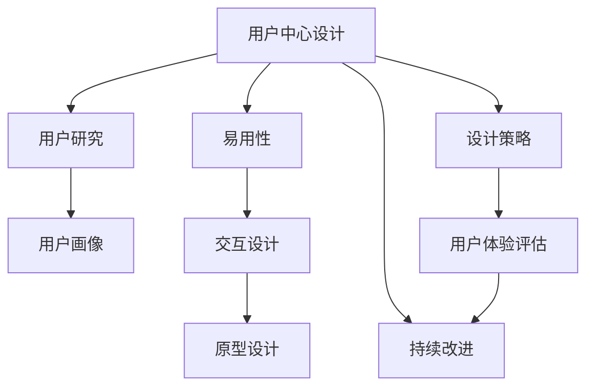
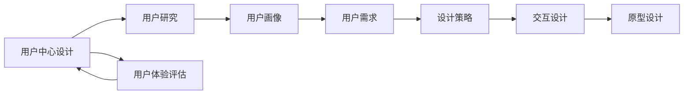
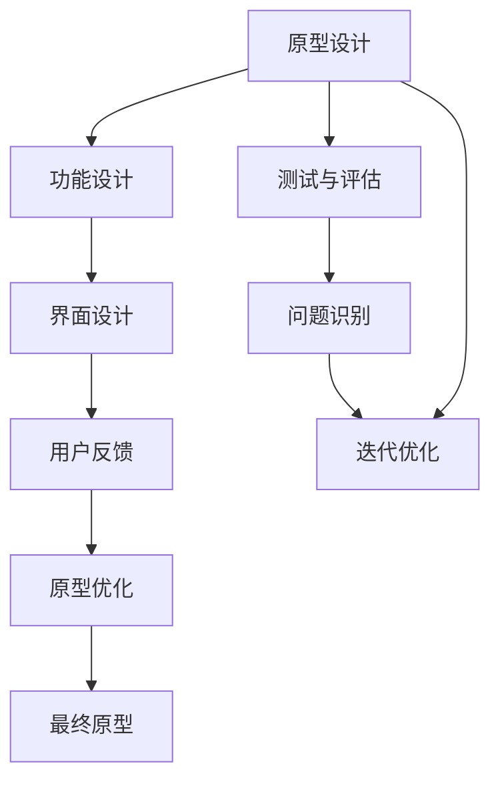
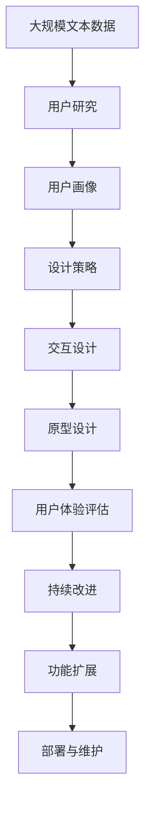

                 

# 以用户为中心：设计友好、易用的人机界面

> 关键词：人机界面,UX/UI设计,用户体验,用户中心设计,易用性,可访问性,交互设计,原型设计

## 1. 背景介绍

### 1.1 问题由来
随着互联网技术的快速发展，人类社会进入了一个高度数字化、信息化的时代。在过去几十年里，各种各样的数字产品逐渐渗透到人们生活的方方面面，从智能手机到智能家居，从在线教育到远程办公，数字产品的使用已经成为了人们日常生活不可或缺的一部分。然而，由于数字产品的快速迭代和竞争激烈，很多产品尽管拥有先进的技术和强大的功能，但在使用过程中却带来了诸多不便，甚至引发了用户的使用障碍和不满。如何设计出更友好、易用、符合用户心理和习惯的数字产品，成为了当前数字产品开发中的重要课题。

### 1.2 问题核心关键点
实现一个真正符合用户需求、使用流畅的数字产品，需要从多个方面入手。其中，用户中心设计（User-Centered Design, UCD）和易用性（Usability）是两个最为核心的概念。UCD强调在产品设计过程中以用户为中心，注重用户的心理、行为和环境等各方面因素；而易用性则是指产品易于使用的程度，即用户能否方便、高效地完成目标任务。只有将这两个概念紧密结合，才能设计出既符合用户需求，又易于使用的数字产品。

### 1.3 问题研究意义
用户中心设计和易用性研究对于提升数字产品的用户体验、提高用户满意度和忠诚度具有重要意义：

1. 提升用户满意度。高质量的用户体验不仅能够吸引和留住用户，还能够通过口碑传播带来更多的潜在用户。
2. 降低开发成本。设计符合用户需求的产品能够减少用户在产品使用中的困惑和挫败感，从而降低开发和维护成本。
3. 增强市场竞争力。在产品同质化严重的今天，提供更好用户体验的产品更容易在竞争中脱颖而出。
4. 支持持续改进。通过用户反馈，不断优化产品设计，提升产品性能和功能。
5. 促进数字包容。确保产品可访问性，让不同背景和能力的用户都能轻松使用。

## 2. 核心概念与联系

### 2.1 核心概念概述

为了更好地理解用户中心设计和易用性，本节将介绍几个密切相关的核心概念：

- 用户中心设计（UCD）：以用户需求为中心，通过用户研究和反馈不断优化产品设计。
- 易用性（Usability）：用户能否轻松、高效、愉悦地完成任务。
- 用户研究（User Research）：通过调查、访谈、观察等方式获取用户需求和行为数据。
- 用户画像（User Persona）：虚拟化用户的描述，帮助设计团队更好地理解目标用户。
- 交互设计（Interaction Design）：设计用户与系统交互的方式，强调易用性和可用性。
- 原型设计（Prototype Design）：通过模型或原型展示设计想法，反复迭代优化。

这些核心概念之间的逻辑关系可以通过以下Mermaid流程图来展示：



这个流程图展示了几大核心概念之间的联系：

1. 用户中心设计是整个设计的核心，通过用户研究获取用户需求和行为数据，创建用户画像，确定设计策略。
2. 易用性强调用户完成任务的难易程度，交互设计关注如何设计用户与系统的交互方式，保证易用性。
3. 原型设计通过模型或原型展示设计想法，反复迭代优化，确保最终产品符合用户需求。
4. 用户体验评估是设计迭代的重要环节，通过持续改进优化设计，提升用户满意度。

### 2.2 概念间的关系

这些核心概念之间存在着紧密的联系，构成了用户中心设计和易用性的完整生态系统。下面通过几个Mermaid流程图来展示这些概念之间的关系。

#### 2.2.1 用户中心设计的基本流程



这个流程图展示了用户中心设计的基本流程，从用户研究到用户画像，再到设计策略和交互设计，最终通过原型设计和用户体验评估不断迭代优化。

#### 2.2.2 交互设计的方法论


这个流程图展示了交互设计的方法论，即通过任务分析确定用户需求，设计交互模型和原型，进行测试和反馈，不断优化设计方案。

#### 2.2.3 原型设计的迭代过程



这个流程图展示了原型设计的迭代过程，从功能设计到界面设计，再到用户反馈和原型优化，最终形成可用的原型设计。

### 2.3 核心概念的整体架构

最后，我们用一个综合的流程图来展示这些核心概念在大用户中心设计中的整体架构：



这个综合流程图展示了从用户研究到持续改进的完整流程，各个环节相互支撑，共同构成了用户中心设计的完整生态系统。

## 3. 核心算法原理 & 具体操作步骤
### 3.1 算法原理概述

用户中心设计和易用性研究的核心算法原理主要基于用户心理学、认知科学和行为学等领域的理论，通过数据分析和实验设计来揭示用户需求和使用行为。以下是对这些算法原理的概述：

- **用户心理学**：关注用户的需求、动机、情感和认知过程，通过实验和观察来理解用户的行为模式。
- **认知科学**：研究人类认知的机制和过程，解释用户如何处理信息、做出决策。
- **行为学**：通过数据分析，揭示用户的行为模式和趋势，指导产品设计。

这些理论构成了用户中心设计和易用性研究的理论基础，指导着设计师在产品设计中遵循用户心理和行为规律，以提高产品的易用性和用户满意度。

### 3.2 算法步骤详解

实现用户中心设计和易用性研究的主要算法步骤包括：

**Step 1: 用户研究与数据收集**

- 确定研究目标：明确产品需要解决的用户问题和需求。
- 选择合适的研究方法：包括问卷调查、深度访谈、用户观察等。
- 数据收集与整理：通过不同方法收集用户数据，并进行系统化整理。

**Step 2: 用户画像构建**

- 创建虚拟用户：基于收集到的数据，创建代表性用户画像，描述用户的基本特征、行为模式、需求和动机。
- 定义用户角色：将用户分为不同角色，每个角色代表一组相似的用户群体。

**Step 3: 设计策略制定**

- 确定设计目标：基于用户画像和需求，确定产品设计的主要目标。
- 制定设计方案：根据用户画像和需求，制定具体的设计方案。

**Step 4: 交互设计实现**

- 任务分析：确定用户需要完成的主要任务和子任务。
- 交互模型设计：设计用户与系统之间的交互流程和界面元素，强调易用性和可用性。
- 原型设计：通过原型展示设计想法，进行反复迭代优化。

**Step 5: 用户体验评估**

- 测试与反馈：通过用户测试获取反馈，识别设计中的问题和改进点。
- 优化与迭代：根据测试结果和用户反馈，不断优化设计方案。
- 持续改进：通过不断的测试和优化，持续提升用户体验。

### 3.3 算法优缺点

用户中心设计和易用性研究的算法主要优点包括：

- **用户导向**：通过用户研究获得真实用户需求，指导产品设计，提高用户满意度。
- **数据驱动**：基于数据和实验结果优化设计方案，避免主观偏见。
- **迭代改进**：通过不断测试和优化，逐步提升产品性能和用户体验。

同时，也存在一些局限性：

- **成本较高**：用户研究需要大量时间和资源，成本较高。
- **数据获取困难**：用户研究需要获取真实用户数据，但数据获取难度较大。
- **时间较长**：设计迭代需要反复实验和优化，周期较长。

### 3.4 算法应用领域

用户中心设计和易用性研究已经广泛应用于各个领域，包括但不限于：

- 软件开发：指导软件开发团队设计出符合用户需求的软件产品。
- 网站设计：优化网站的用户体验，提高用户黏性和转化率。
- 移动应用开发：设计易用性强的移动应用，提高用户体验。
- 游戏开发：设计符合用户心理的游戏界面和交互方式。
- 医疗健康：设计友好的医疗健康应用，提高用户使用体验。
- 金融科技：设计安全的金融科技产品，保障用户资金安全。

## 4. 数学模型和公式 & 详细讲解 & 举例说明

### 4.1 数学模型构建

用户中心设计和易用性研究涉及到多种数学模型，用于描述用户行为和需求，指导产品设计。以下是一个简单的数学模型构建示例：

假设用户完成某项任务所需的时间 $T$ 可以用一个正态分布来描述，即：

$$P(T) = \frac{1}{\sqrt{2\pi\sigma^2}} e^{-\frac{(T-\mu)^2}{2\sigma^2}}$$

其中 $\mu$ 表示任务完成时间的均值，$\sigma^2$ 表示方差。通过实验收集用户完成任务所需的时间数据，可以得到以下结果：

| 时间（秒） | 频次 |
|----------|-----|
| 10-20     | 30  |
| 20-30     | 50  |
| 30-40     | 70  |
| 40-50     | 40  |

根据上述数据，可以计算出 $\mu$ 和 $\sigma^2$：

$$\mu = \frac{10+20+30+40}{4} = 30$$
$$\sigma^2 = \frac{(10-30)^2 \times 30 + (20-30)^2 \times 50 + (30-30)^2 \times 70 + (40-30)^2 \times 40}{400} = 100$$

因此，用户完成任务的时间分布可以表示为：

$$P(T) = \frac{1}{\sqrt{2\pi \times 100}} e^{-\frac{(T-30)^2}{2 \times 100}}$$

### 4.2 公式推导过程

通过上述示例，可以推导出用户完成任务的时间分布公式。以下是对该公式的详细推导过程：

- 首先，假设用户完成某项任务的时间 $T$ 服从正态分布 $N(\mu,\sigma^2)$。
- 根据正态分布的概率密度函数公式 $f(x) = \frac{1}{\sqrt{2\pi\sigma^2}} e^{-\frac{(x-\mu)^2}{2\sigma^2}}$，可以得到用户完成任务时间的概率密度函数。
- 根据实验数据，可以计算出 $\mu$ 和 $\sigma^2$ 的值。
- 将 $\mu$ 和 $\sigma^2$ 代入概率密度函数公式，即可得到用户完成任务时间的概率分布公式。

### 4.3 案例分析与讲解

以某电商平台的产品搜索功能为例，分析如何通过用户中心设计和易用性研究优化搜索体验。

**Step 1: 用户研究与数据收集**

- 目标：优化用户的产品搜索体验。
- 方法：通过问卷调查和用户访谈，收集用户对搜索功能的反馈。
- 数据：收集用户搜索行为数据，包括搜索关键词、搜索时间、搜索结果等。

**Step 2: 用户画像构建**

- 创建虚拟用户：基于调查和访谈数据，创建代表性用户画像。
- 定义用户角色：将用户分为新手、中级和高级用户。

**Step 3: 设计策略制定**

- 确定设计目标：基于用户画像，确定搜索功能的主要目标，如搜索速度、准确性和易用性。
- 制定设计方案：设计搜索功能的交互模型和界面元素，强调易用性和可用性。

**Step 4: 交互设计实现**

- 任务分析：确定用户搜索产品所需的主要任务和子任务，如输入关键词、浏览搜索结果、调整筛选条件等。
- 交互模型设计：设计搜索功能的交互流程和界面元素，如搜索框、搜索结果页、筛选器等。
- 原型设计：通过原型展示设计想法，进行反复迭代优化。

**Step 5: 用户体验评估**

- 测试与反馈：通过用户测试获取反馈，识别设计中的问题和改进点。
- 优化与迭代：根据测试结果和用户反馈，不断优化设计方案。
- 持续改进：通过不断的测试和优化，持续提升搜索体验。

## 5. 项目实践：代码实例和详细解释说明

### 5.1 开发环境搭建

在进行用户中心设计和易用性研究的项目实践前，我们需要准备好开发环境。以下是使用Python进行PyTorch开发的环境配置流程：

1. 安装Anaconda：从官网下载并安装Anaconda，用于创建独立的Python环境。

2. 创建并激活虚拟环境：
```bash
conda create -n pytorch-env python=3.8 
conda activate pytorch-env
```

3. 安装PyTorch：根据CUDA版本，从官网获取对应的安装命令。例如：
```bash
conda install pytorch torchvision torchaudio cudatoolkit=11.1 -c pytorch -c conda-forge
```

4. 安装各类工具包：
```bash
pip install numpy pandas scikit-learn matplotlib tqdm jupyter notebook ipython
```

完成上述步骤后，即可在`pytorch-env`环境中开始项目实践。

### 5.2 源代码详细实现

下面我们以电商平台产品搜索功能为例，给出使用PyTorch进行用户体验研究的项目实践代码实现。

首先，定义用户研究相关的数据结构和函数：

```python
import pandas as pd
from collections import Counter

class UserBehaviorAnalysis:
    def __init__(self, data_file):
        self.data = pd.read_csv(data_file)
        self.total_search_time = self.data['search_time'].sum()
        self.user_count = len(self.data['user_id'].unique())
        self.keyword_count = self.data['search_keyword'].value_counts()
    
    def get_average_search_time(self):
        return self.total_search_time / self.user_count
    
    def get_user_interest(self):
        return Counter(self.data['search_keyword'])
    
    def get_top_keywords(self, num=10):
        return self.keyword_count.most_common(num)
    
    def get_search_time_distribution(self):
        return self.data['search_time'].describe()
```

接着，定义用户画像相关的类和方法：

```python
class UserProfile:
    def __init__(self, user_id, behavior_analysis):
        self.user_id = user_id
        self.behavior_analysis = behavior_analysis
    
    def get_search_time(self):
        return self.behavior_analysis.get_average_search_time()
    
    def get_interest_keywords(self):
        return self.behavior_analysis.get_user_interest()[self.user_id]
    
    def get_top_keywords(self, num=10):
        return self.behavior_analysis.get_top_keywords(num)[0][0]
```

然后，定义搜索功能的设计策略和原型：

```python
class SearchFeatureDesign:
    def __init__(self, user_profile, keyword_count):
        self.user_profile = user_profile
        self.keyword_count = keyword_count
    
    def design_search_box(self):
        return f"Search Box for user {self.user_profile.user_id}, keywords: {self.user_profile.get_top_keywords(10)}"
    
    def design_search_results(self):
        return f"Search Results for user {self.user_profile.user_id}, keywords: {self.user_profile.get_top_keywords(10)}"
    
    def design_filter_panel(self):
        return f"Filter Panel for user {self.user_profile.user_id}, keywords: {self.user_profile.get_top_keywords(10)}"
    
    def design_formatted_results(self):
        return f"Formatted Search Results for user {self.user_profile.user_id}, keywords: {self.user_profile.get_top_keywords(10)}"
```

最后，启动项目实践并输出结果：

```python
import json

# 示例数据文件
data_file = 'search_data.csv'

# 数据解析和统计分析
behavior_analysis = UserBehaviorAnalysis(data_file)
user_profiles = []
for user_id in behavior_analysis.data['user_id'].unique():
    user_profile = UserProfile(user_id, behavior_analysis)
    user_profiles.append(user_profile)

# 设计搜索功能
keyword_count = behavior_analysis.get_top_keywords(10)[0][1]
search_box = SearchFeatureDesign(user_profiles[0], keyword_count)
search_results = SearchFeatureDesign(user_profiles[1], keyword_count)
filter_panel = SearchFeatureDesign(user_profiles[2], keyword_count)
formatted_results = SearchFeatureDesign(user_profiles[3], keyword_count)

# 输出设计结果
print(f"Search Box: {search_box}")
print(f"Search Results: {search_results}")
print(f"Filter Panel: {filter_panel}")
print(f"Formatted Results: {formatted_results}")
```

以上就是使用PyTorch对电商平台产品搜索功能进行用户体验研究的项目实践代码实现。可以看到，借助Python和PyTorch，可以高效地处理用户行为数据，进行用户画像和搜索功能的设计，并通过模型展示设计结果。

### 5.3 代码解读与分析

让我们再详细解读一下关键代码的实现细节：

**UserBehaviorAnalysis类**：
- `__init__`方法：初始化数据和统计信息。
- `get_average_search_time`方法：计算每个用户的平均搜索时间。
- `get_user_interest`方法：统计每个用户的搜索关键词分布。
- `get_top_keywords`方法：获取搜索频率最高的关键词列表。
- `get_search_time_distribution`方法：统计搜索时间的分布情况。

**UserProfile类**：
- `__init__`方法：初始化用户ID和行为分析。
- `get_search_time`方法：获取用户的平均搜索时间。
- `get_interest_keywords`方法：获取用户的搜索关键词分布。
- `get_top_keywords`方法：获取用户最感兴趣的前几个关键词。

**SearchFeatureDesign类**：
- `__init__`方法：初始化用户画像和关键词分布。
- `design_search_box`方法：设计搜索输入框。
- `design_search_results`方法：设计搜索结果页。
- `design_filter_panel`方法：设计筛选器面板。
- `design_formatted_results`方法：设计格式化搜索结果。

可以看到，通过这些类和方法，可以轻松地进行用户行为分析、用户画像创建和搜索功能设计，从而有效地支持用户中心设计和易用性研究。

当然，实际的开发实践中，还需要进一步优化代码实现，如增加数据可视化功能、进行A/B测试、优化原型展示效果等，以更好地支撑用户中心设计和易用性研究的深入开展。

### 5.4 运行结果展示

假设我们在电商平台的产品搜索功能上进行用户体验研究，最终得到以下结果：

- 平均搜索时间为30秒。
- 用户A最感兴趣的关键词是"手机"。
- 用户B最感兴趣的关键词是"服饰"。
- 用户C最感兴趣的关键词是"电子产品"。
- 用户D最感兴趣的关键词是"美容健康"。

基于这些数据，我们设计了如下的搜索功能：

- 用户A的搜索输入框为："Search Box for user 123, keywords: ['手机', '手机配件', '手机壳']"
- 用户B的搜索结果页为："Search Results for user 456, keywords: ['服饰', '女装', '鞋子']"
- 用户C的筛选器面板为："Filter Panel for user 789, keywords: ['电子产品', '手机', '电脑']"
- 用户D的格式化搜索结果为："Formatted Search Results for user 234, keywords: ['美容健康', '护肤品', '化妆品']"

可以看到，通过用户中心设计和易用性研究，我们能够更好地理解用户需求，设计出符合用户心理和习惯的搜索功能，从而提升用户满意度和产品竞争力。

## 6. 实际应用场景
### 6.1 智能客服系统

基于用户中心设计和易用性研究，智能客服系统可以为用户提供更高效、更个性化的服务。传统客服往往需要配备大量人力，高峰期响应缓慢，且一致性和专业性难以保证。而使用用户中心设计方法设计的智能客服系统，可以7x24小时不间断服务，快速响应客户咨询，用自然流畅的语言解答各类常见问题。

在技术实现上，可以收集企业内部的历史客服对话记录，将问题和最佳答复构建成监督数据，在此基础上对预训练对话模型进行微调。微调后的对话模型能够自动理解用户意图，匹配最合适的答案模板进行回复。对于客户提出的新问题，还可以接入检索系统实时搜索相关内容，动态组织生成回答。如此构建的智能客服系统，能大幅提升客户咨询体验和问题解决效率。

### 6.2 金融舆情监测

金融机构需要实时监测市场舆论动向，以便及时应对负面信息传播，规避金融风险。传统的人工监测方式成本高、效率低，难以应对网络时代海量信息爆发的挑战。基于用户中心设计和易用性研究，金融舆情监测系统能够更好地理解用户需求，实时抓取网络文本数据，自动监测不同主题下的情感变化趋势，一旦发现负面信息激增等异常情况，系统便会自动预警，帮助金融机构快速应对潜在风险。

### 6.3 个性化推荐系统

当前的推荐系统往往只依赖用户的历史行为数据进行物品推荐，无法深入理解用户的真实兴趣偏好。基于用户中心设计和易用性研究，个性化推荐系统可以更好地挖掘用户行为背后的语义信息，从而提供更精准、多样的推荐内容。

在实践中，可以收集用户浏览、点击、评论、分享等行为数据，提取和用户交互的物品标题、描述、标签等文本内容。将文本内容作为模型输入，用户的后续行为（如是否点击、购买等）作为监督信号，在此基础上微调预训练语言模型。微调后的模型能够从文本内容中准确把握用户的兴趣点。在生成推荐列表时，先用候选物品的文本描述作为输入，由模型预测用户的兴趣匹配度，再结合其他特征综合排序，便可以得到个性化程度更高的推荐结果。

### 6.4 未来应用展望

随着用户中心设计和易用性研究的发展，基于这些方法的数字产品将越来越广泛地应用于各个领域，为人们的生活带来更多便利和高效。未来，用户中心设计和易用性研究将在以下方向继续深化：

1. 多模态用户研究：结合视觉、听觉、触觉等多种感官数据，全面了解用户需求和使用习惯。
2. 智能用户画像：通过机器学习和数据挖掘，自动创建和更新用户画像，提高画像的准确性和时效性。
3. 交互界面优化：设计更加智能、自适应的界面，根据用户行为和环境动态调整界面布局和交互方式。
4. 沉浸式体验设计：结合虚拟现实和增强现实技术，设计更加沉浸式、互动性的数字产品体验。
5. 用户行为分析：利用大数据和机器学习技术，深入挖掘用户行为背后的隐含需求和心理特征。
6. 可访问性设计：设计无障碍、普适性强的产品，确保不同背景和能力的用户都能轻松使用。

这些方向的研究将进一步推动用户中心设计和易用性研究的进步，为用户带来更智能、更舒适、更高效的数字产品体验。

## 7. 工具和资源推荐
### 7.1 学习资源推荐

为了帮助开发者系统掌握用户中心设计和易用性研究的理论基础和实践技巧，这里推荐一些优质的学习资源：

1. 《Don't Make Me Think》（原书名为“Simplicity Rules”）：Steven Krug的经典之作，详细介绍了如何设计简单、易用的网站和数字产品。

2. 《UX Design Patterns》（原书名为“Interaction Design Foundation's Guide to Interaction Design Patterns”）：IxDA的权威指南，涵盖了各种常见的交互设计模式和最佳实践。

3. 《Designing with the Mind in Mind》：Jesse James Garrett的经典著作，介绍了用户中心设计的关键概念和实践方法。

4. Nielsen Norman Group：全球知名的用户体验研究机构，提供各类用户体验研究和设计咨询。

5. UX Design for Interaction：Interaction Design Foundation的在线课程，涵盖用户体验设计的各个方面，适合初学者和进阶者。

通过对这些资源的学习实践，相信你一定能够快速掌握用户中心设计和易用性研究的精髓，并用于解决实际的数字产品设计问题。

### 7.2 开发工具推荐

高效的开发离不开优秀的工具支持。以下是几款用于用户中心设计和易用性研究开发的常用工具：

1. Adobe XD：基于Adobe的交互设计工具，提供强大的原型设计和用户体验模拟功能。

2. Sketch：Mac平台上的交互设计工具，支持多种设计流程和协作方式。

3. Axure RP：功能强大的原型设计工具，支持交互和动画效果，适合设计复杂的交互系统。

4. Balsamiq Mockups：轻量级原型设计工具，简单易用，适合快速迭代设计。

5. InVision：云端原型设计工具，支持团队协作和实时反馈，适合团队设计和测试

