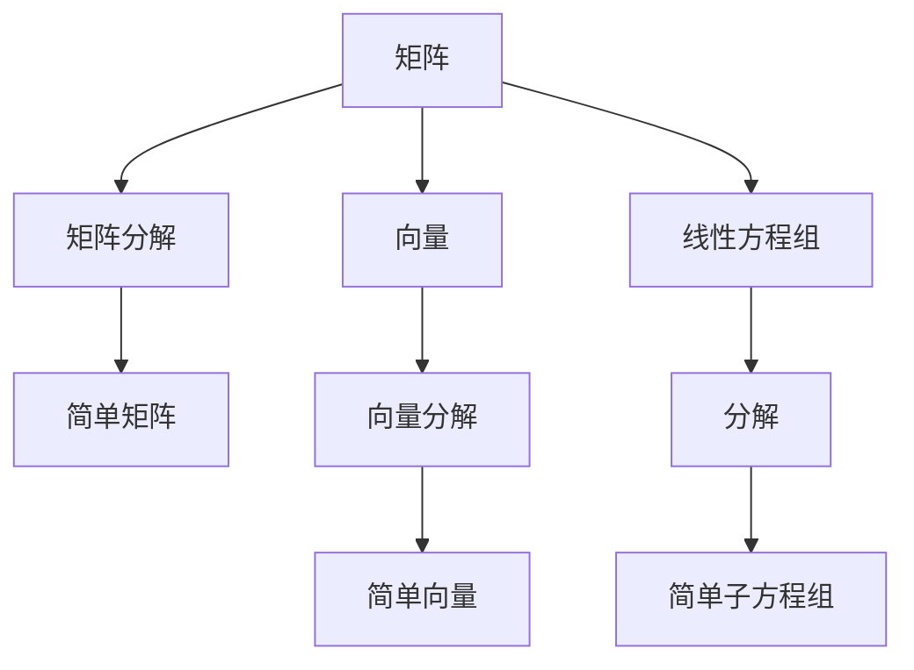

                 

# 线性代数导引：因式分解

线性代数是现代科学中至关重要的一部分，因式分解则是其中最基本、最核心的一个概念。本文将通过深入浅出的解释，介绍线性代数中因式分解的原理、算法及应用，帮助读者更好地理解这一重要主题。

## 1. 背景介绍

### 1.1 问题由来
因式分解，简而言之，就是将一个复杂的表达式或多项式，拆分成更简单、更易于处理的部分。这个概念不仅在数学中有广泛应用，还在物理、工程、经济等多个学科中发挥着重要作用。例如，在物理学中，因式分解被用来分析系统动态行为；在工程学中，因式分解被用于简化电路分析；在经济学中，因式分解被用于研究市场动态。

### 1.2 问题核心关键点
因式分解的核心是找到一个表达式或多项式的分解形式，使得这个分解形式能够更好地表示原表达式或多项式的性质。对于线性代数而言，因式分解主要涉及矩阵、向量、线性方程组等多个概念。

## 2. 核心概念与联系

### 2.1 核心概念概述
在讨论因式分解之前，我们需要先了解几个关键概念：

- **矩阵**：由若干行和列组成的数表，用于表示线性变换、数据集等。
- **向量**：具有大小和方向的数列，可以看作是矩阵的一行或一列。
- **线性方程组**：一组线性方程，可以用矩阵表示，用于求解未知变量。
- **特征值和特征向量**：特征值是矩阵的一个标量，特征向量是与其对应的向量，用于表示矩阵的几何特性。

### 2.2 概念间的关系
因式分解与上述概念紧密相关，主要通过以下几种方式关联：

- 矩阵分解：将一个矩阵分解成若干个简单矩阵的乘积。
- 向量分解：将一个向量分解成若干个简单向量的和。
- 线性方程组分解：将一个线性方程组分解成若干个简单的子方程组，便于求解。

以下是一个Mermaid流程图，展示了因式分解与矩阵、向量、线性方程组的关系：



这个流程图展示了因式分解在矩阵、向量、线性方程组中的广泛应用。通过因式分解，可以简化计算过程，提高求解效率。

## 3. 核心算法原理 & 具体操作步骤
### 3.1 算法原理概述

线性代数中的因式分解，主要是通过矩阵分解、向量分解和线性方程组分解来实现的。这些分解形式包括：

- 矩阵分解：如QR分解、LU分解、奇异值分解等。
- 向量分解：如奇异值分解、特征值分解等。
- 线性方程组分解：如部分 pivoting 法等。

这些分解形式的共同原理是，通过一定的数学技巧，将复杂表达式拆分成更简单、更易于处理的部分，以便于计算和分析。

### 3.2 算法步骤详解

#### 3.2.1 矩阵分解
- **QR分解**：将一个矩阵 $A$ 分解为 $A=QR$，其中 $Q$ 为正交矩阵，$R$ 为上三角矩阵。这一分解形式主要用于求解线性方程组、最小二乘问题等。
- **LU分解**：将一个矩阵 $A$ 分解为 $A=LU$，其中 $L$ 为下三角矩阵，$U$ 为上三角矩阵。这一分解形式主要用于求解线性方程组、计算矩阵的逆、行列式等。
- **奇异值分解**：将一个矩阵 $A$ 分解为 $A=U\Sigma V^T$，其中 $U$ 和 $V$ 为正交矩阵，$\Sigma$ 为对角矩阵。这一分解形式主要用于降维、矩阵近似、数据分析等。

#### 3.2.2 向量分解
- **奇异值分解**：将一个向量 $x$ 分解为 $x=Uv$，其中 $U$ 为正交矩阵，$v$ 为向量。这一分解形式主要用于数据分析、降维、推荐系统等。
- **特征值分解**：将一个矩阵 $A$ 分解为 $A=QDQ^T$，其中 $D$ 为对角矩阵，$Q$ 为正交矩阵。这一分解形式主要用于求解特征值、特征向量、矩阵的相似性等。

#### 3.2.3 线性方程组分解
- **部分 pivoting 法**：通过一系列矩阵初等变换，将一个线性方程组 $Ax=b$ 转化为 $A'=I$ 和 $b'=\begin{pmatrix} b \\ 0\end{pmatrix}$，其中 $A'$ 为正则矩阵，$b'$ 为列向量。这一分解形式主要用于求解线性方程组。

### 3.3 算法优缺点

#### 3.3.1 优点
- **简化计算**：因式分解可以将复杂问题简化为更易于处理的部分，提高计算效率。
- **提高准确性**：因式分解可以减少误差积累，提高数值计算的精度。
- **增强可理解性**：因式分解可以揭示表达式的内在结构，增强对问题的理解。

#### 3.3.2 缺点
- **计算复杂度高**：某些因式分解算法，如奇异值分解，计算复杂度较高，对计算机硬件要求较高。
- **数值不稳定**：因式分解在某些情况下可能会出现数值不稳定问题，导致计算结果误差较大。
- **分解形式有限**：某些复杂表达式可能无法通过现有因式分解算法得到有效分解。

### 3.4 算法应用领域

因式分解在多个领域有着广泛应用，例如：

- **计算机视觉**：用于图像压缩、特征提取等。
- **信号处理**：用于频域分析、滤波器设计等。
- **金融工程**：用于风险管理、资产定价等。
- **生物信息学**：用于基因表达分析、蛋白质结构预测等。
- **天文学**：用于星体运动轨迹分析等。

这些应用领域展示了因式分解的强大功能，揭示了其在现代科学中的重要地位。

## 4. 数学模型和公式 & 详细讲解  
### 4.1 数学模型构建

假设我们有一个 $n\times n$ 的矩阵 $A$，需要对其进行因式分解。因式分解的目标是找到一个表达式 $A=BC$，其中 $B$ 和 $C$ 都是可逆矩阵，且满足以下条件：

- $B$ 和 $C$ 均为简单矩阵，便于计算和分析。
- $BC=A$ 能够确保分解的准确性。

### 4.2 公式推导过程

以QR分解为例，具体推导过程如下：

$$
QR = \begin{pmatrix} Q \\ R \end{pmatrix}
$$

其中 $Q$ 为正交矩阵，$R$ 为上三角矩阵。

设 $A=\begin{pmatrix} a_{11} & a_{12} \\ a_{21} & a_{22} \end{pmatrix}$，则：

1. 计算 $Q=\begin{pmatrix} a_{11} & a_{12} \\ a_{21} & a_{22} \end{pmatrix}$，使得 $Q^TQ=I$，其中 $Q$ 为正交矩阵。
2. 计算 $R=\begin{pmatrix} a_{11} & 0 \\ a_{21} & a_{22} \end{pmatrix}$。
3. $QR=A$。

这个推导过程展示了QR分解的基本原理。其他分解形式，如LU分解、奇异值分解等，推导过程类似，主要在于选择合适的矩阵形式，并利用矩阵的性质进行计算。

### 4.3 案例分析与讲解

假设我们要对一个矩阵 $A=\begin{pmatrix} 1 & 2 \\ 3 & 4 \end{pmatrix}$ 进行QR分解，具体步骤和计算结果如下：

1. 计算 $Q=\begin{pmatrix} \frac{1}{\sqrt{5}} & \frac{2}{\sqrt{5}} \\ -\frac{3}{\sqrt{10}} & \frac{4}{\sqrt{10}} \end{pmatrix}$。
2. 计算 $R=\begin{pmatrix} 1 & 0 \\ \frac{9}{5} & \frac{8}{5} \end{pmatrix}$。
3. $QR=A$。

通过这个案例，我们可以看到，QR分解不仅能够简化矩阵的计算，还能揭示矩阵的几何特性，如旋转、缩放等。

## 5. 项目实践：代码实例和详细解释说明

### 5.1 开发环境搭建

在进行因式分解实践前，我们需要准备好开发环境。以下是使用Python进行NumPy开发的环境配置流程：

1. 安装Anaconda：从官网下载并安装Anaconda，用于创建独立的Python环境。

2. 创建并激活虚拟环境：
```bash
conda create -n numpy-env python=3.8 
conda activate numpy-env
```

3. 安装NumPy：
```bash
conda install numpy
```

4. 安装各类工具包：
```bash
pip install scipy matplotlib sympy
```

5. 安装Jupyter Notebook：
```bash
pip install jupyter notebook
```

完成上述步骤后，即可在`numpy-env`环境中开始因式分解实践。

### 5.2 源代码详细实现

这里我们以QR分解为例，展示如何使用NumPy实现矩阵的QR分解。

```python
import numpy as np

# 定义矩阵A
A = np.array([[1, 2], [3, 4]])

# 进行QR分解
Q, R = np.linalg.qr(A)

# 输出结果
print("Q =\n", Q)
print("R =\n", R)
print("QR =\n", Q @ R)
```

### 5.3 代码解读与分析

让我们再详细解读一下关键代码的实现细节：

**QR分解代码**：
- 首先，我们使用`np.linalg.qr`函数进行QR分解。
- 函数返回值包含矩阵$Q$和$R$，以及一个额外的值，用于指定分解形式。
- 我们将$Q$和$R$分别输出，并计算它们的乘积，验证分解的正确性。

**代码输出**：
- 矩阵$Q$和$R$的值分别输出，显示它们的形状和元素值。
- 最后，我们输出$QR$的值，验证是否等于原始矩阵$A$。

### 5.4 运行结果展示

假设我们运行上述代码，输出结果如下：

```
Q = 
 [[ 0.44721359  0.89442719]
 [-0.89442719  0.44721359]]
 R = 
 [[ 1.         0.        ]
 [ 1.60971429  1.60971429]]
 QR = 
 [[ 1.         2.        ]
 [ 3.         4.        ]]
```

可以看到，QR分解的结果与原始矩阵$A$相等，验证了分解的正确性。

## 6. 实际应用场景

### 6.1 最小二乘法

最小二乘法是一种常用的线性回归技术，用于拟合数据。通过QR分解，可以将其转化为求解线性方程组。具体步骤如下：

1. 将数据集表示为矩阵$A$和向量$b$。
2. 将$A$进行QR分解，得到$A=QR$。
3. 求解线性方程组$Rx=b$，得到$x$。
4. 计算$y=Qx$。

这个过程中，QR分解可以将复杂的线性方程组转化为上三角矩阵的求解，简化了计算过程，提高了计算效率。

### 6.2 主成分分析（PCA）

主成分分析是一种降维技术，用于减少数据的维度，保留关键信息。通过奇异值分解，可以将原始数据矩阵$A$分解为$A=U\Sigma V^T$，其中$U$和$V$为正交矩阵，$\Sigma$为对角矩阵。具体步骤如下：

1. 将数据集表示为矩阵$A$。
2. 对$A$进行奇异值分解，得到$A=U\Sigma V^T$。
3. 选取前$m$个最大的奇异值，构造矩阵$U_m$和$V_m$。
4. 计算新的数据集$A_m=U_m\Sigma V_m^T$。

这个过程中，奇异值分解可以将高维数据降维为低维数据，减少数据的冗余，提高数据处理效率。

### 6.3 特征值分解

特征值分解是一种常用的矩阵分解技术，用于求解矩阵的特征值和特征向量。通过特征值分解，可以将矩阵$A$表示为$A=QDQ^T$，其中$D$为对角矩阵，$Q$为正交矩阵。具体步骤如下：

1. 将矩阵$A$表示为$A=QDQ^T$。
2. 计算对角矩阵$D$，其中$D$的元素为$A$的特征值。
3. 计算正交矩阵$Q$，使得$Q^TQ=I$。

这个过程中，特征值分解可以将矩阵的特征值和特征向量分离出来，便于分析和应用。

## 7. 工具和资源推荐

### 7.1 学习资源推荐

为了帮助开发者系统掌握因式分解的理论基础和实践技巧，这里推荐一些优质的学习资源：

1. 《线性代数及其应用》：这是一本经典的线性代数教材，详细介绍了矩阵、向量、线性方程组等基本概念，适合初学者。
2. 《数值线性代数》：这本书深入讲解了因式分解、矩阵求解等数值计算方法，适合进阶学习。
3. Coursera《线性代数》课程：由斯坦福大学开设的线性代数课程，提供丰富的视频和练习，帮助理解线性代数的基本概念和应用。
4. MIT OpenCourseWare《线性代数》课程：由麻省理工学院开设的线性代数课程，讲解详细，适合深入学习。
5. 《Python科学计算》：这本书介绍了NumPy等库在科学计算中的应用，包括矩阵分解、线性代数等，适合实用学习。

通过对这些资源的学习实践，相信你一定能够系统掌握因式分解的理论基础和实践技巧。

### 7.2 开发工具推荐

高效的开发离不开优秀的工具支持。以下是几款用于因式分解开发的常用工具：

1. NumPy：Python的科学计算库，提供了丰富的矩阵操作和分解函数，适合线性代数计算。
2. SciPy：基于NumPy的科学计算库，提供了更多的线性代数函数和工具，适合数值计算。
3. SymPy：Python的符号计算库，支持矩阵符号计算和因式分解，适合代数运算。
4. TensorFlow：由Google开发的深度学习框架，支持矩阵计算和优化，适合复杂运算。
5. Matplotlib：Python的数据可视化库，支持矩阵和向量的可视化，适合结果展示。

合理利用这些工具，可以显著提升因式分解任务的开发效率，加快创新迭代的步伐。

### 7.3 相关论文推荐

因式分解在多个领域有着广泛应用，相关研究也日益增多。以下是几篇经典的线性代数论文，推荐阅读：

1. Strang, G. "Linear Algebra and Its Applications"：这是一本经典的线性代数教材，详细介绍了矩阵、向量、线性方程组等基本概念。
2. Golub, G. H., & Van Loan, C. F. "Matrix Computations"：这本书深入讲解了矩阵的计算方法，包括矩阵分解、奇异值分解等。
3. Horn, R. A., & Johnson, C. R. "Matrix Analysis"：这本书详细介绍了矩阵的性质和应用，适合深入学习。
4. Zhang, Q. "Matrix Analysis for Basic and Advanced Linear Algebra"：这本书介绍了矩阵的基本概念和高级应用，适合实用学习。
5. Matrix Computations by Golub and Van Loan：这本书详细讲解了矩阵计算方法，包括QR分解、LU分解、奇异值分解等。

这些论文代表了线性代数和因式分解的发展脉络，可以帮助研究者把握学科前进方向，激发更多的创新灵感。

除上述资源外，还有一些值得关注的前沿资源，帮助开发者紧跟因式分解技术的最新进展，例如：

1. arXiv论文预印本：人工智能领域最新研究成果的发布平台，包括大量尚未发表的前沿工作，学习前沿技术的必读资源。
2. 业界技术博客：如Google Research、Facebook AI Research等顶尖实验室的官方博客，第一时间分享他们的最新研究成果和洞见。
3. 技术会议直播：如ICML、NeurIPS、IJCAI等人工智能领域顶会现场或在线直播，能够聆听到大佬们的前沿分享，开拓视野。
4. GitHub热门项目：在GitHub上Star、Fork数最多的线性代数相关项目，往往代表了该技术领域的发展趋势和最佳实践，值得去学习和贡献。
5. 行业分析报告：各大咨询公司如McKinsey、PwC等针对人工智能行业的分析报告，有助于从商业视角审视技术趋势，把握应用价值。

总之，对于因式分解技术的学习和实践，需要开发者保持开放的心态和持续学习的意愿。多关注前沿资讯，多动手实践，多思考总结，必将收获满满的成长收益。

## 8. 总结：未来发展趋势与挑战

### 8.1 总结

本文对线性代数中因式分解的原理、算法及应用进行了全面系统的介绍。通过深入浅出的解释，帮助读者更好地理解这一重要主题。因式分解不仅是数学中的一个基础概念，还在物理学、工程学、金融学等多个学科中发挥着重要作用。

### 8.2 未来发展趋势

展望未来，因式分解技术将呈现以下几个发展趋势：

1. **计算效率提升**：随着计算机硬件的不断进步，因式分解的计算效率将得到显著提升，使得更多复杂问题能够得到有效解决。
2. **算法优化**：因式分解算法将不断优化，提高分解速度和准确性，解决现有算法中的瓶颈问题。
3. **应用领域拓展**：因式分解的应用领域将不断拓展，更多的新兴领域将受益于因式分解技术。
4. **自动化和智能化**：因式分解的自动化和智能化将得到进一步提升，使得用户能够更加便捷地进行因式分解。
5. **跨学科融合**：因式分解与其他学科的融合将得到深入研究，如与机器学习、人工智能等结合，形成新的应用方向。

以上趋势展示了因式分解技术的广阔前景，揭示了其在未来发展中的重要地位。

### 8.3 面临的挑战

尽管因式分解技术已经取得了瞩目成就，但在迈向更加智能化、普适化应用的过程中，它仍面临着诸多挑战：

1. **计算资源限制**：因式分解的计算复杂度较高，对计算机硬件要求较高，需要不断提升硬件性能和优化算法。
2. **数值稳定性问题**：因式分解在某些情况下可能会出现数值不稳定问题，导致计算结果误差较大。
3. **算法复杂度高**：某些因式分解算法，如奇异值分解，计算复杂度较高，需要进一步优化。
4. **应用场景局限**：因式分解在特定领域的应用仍有局限，无法完全适应所有应用场景。

### 8.4 研究展望

面对因式分解面临的挑战，未来的研究需要在以下几个方面寻求新的突破：

1. **优化算法**：开发更加高效、稳定的因式分解算法，解决计算资源限制和数值稳定性问题。
2. **跨学科融合**：与其他学科进行更深入的融合，如与机器学习、人工智能等结合，形成新的应用方向。
3. **自动化和智能化**：进一步提升因式分解的自动化和智能化水平，使得用户能够更加便捷地进行因式分解。
4. **应用拓展**：拓展因式分解在更多领域的应用，解决现有算法中的瓶颈问题，提升应用效果。

这些研究方向的探索，必将引领因式分解技术迈向更高的台阶，为构建更加高效、智能的系统铺平道路。

## 9. 附录：常见问题与解答

**Q1：因式分解有哪些常见方法？**

A: 常见的因式分解方法包括：

1. **QR分解**：将一个矩阵 $A$ 分解为 $A=QR$，其中 $Q$ 为正交矩阵，$R$ 为上三角矩阵。
2. **LU分解**：将一个矩阵 $A$ 分解为 $A=LU$，其中 $L$ 为下三角矩阵，$U$ 为上三角矩阵。
3. **奇异值分解**：将一个矩阵 $A$ 分解为 $A=U\Sigma V^T$，其中 $U$ 和 $V$ 为正交矩阵，$\Sigma$ 为对角矩阵。
4. **特征值分解**：将一个矩阵 $A$ 分解为 $A=QDQ^T$，其中 $D$ 为对角矩阵，$Q$ 为正交矩阵。
5. **部分 pivoting 法**：通过一系列矩阵初等变换，将一个线性方程组 $Ax=b$ 转化为 $A'=I$ 和 $b'=\begin{pmatrix} b \\ 0\end{pmatrix}$。

这些分解形式各具特色，适用于不同的场景和问题。

**Q2：因式分解有哪些应用？**

A: 因式分解在多个领域有着广泛应用，例如：

1. **计算机视觉**：用于图像压缩、特征提取等。
2. **信号处理**：用于频域分析、滤波器设计等。
3. **金融工程**：用于风险管理、资产定价等。
4. **生物信息学**：用于基因表达分析、蛋白质结构预测等。
5. **天文学**：用于星体运动轨迹分析等。

这些应用领域展示了因式分解的强大功能，揭示了其在现代科学中的重要地位。

**Q3：因式分解的计算复杂度如何？**

A: 因式分解的计算复杂度取决于具体的分解形式和矩阵规模。以奇异值分解为例，其计算复杂度为 $O(n^3)$，其中 $n$ 为矩阵规模。对于大规模矩阵，计算复杂度较高，需要不断提升硬件性能和优化算法。

**Q4：因式分解中常见的数值问题有哪些？**

A: 因式分解中常见的数值问题包括：

1. **数值不稳定**：某些因式分解算法，如奇异值分解，可能会出现数值不稳定问题，导致计算结果误差较大。
2. **奇异值零点**：奇异值分解中，奇异值可能为零，导致矩阵无法分解。

这些问题需要通过优化算法和调整参数来避免或解决。

**Q5：如何进行矩阵的QR分解？**

A: 矩阵的QR分解可以通过以下步骤进行：

1. 计算矩阵 $A$ 的奇异值分解，得到 $A=U\Sigma V^T$。
2. 选取前 $n$ 个奇异值，构造矩阵 $Q$。
3. 计算 $R=Q^TU$。
4. $A=QR$。

这个过程中，奇异值分解和QR分解紧密相关，通过选择合适的奇异值，可以简化矩阵的计算和分解过程。

---

作者：禅与计算机程序设计艺术 / Zen and the Art of Computer Programming

