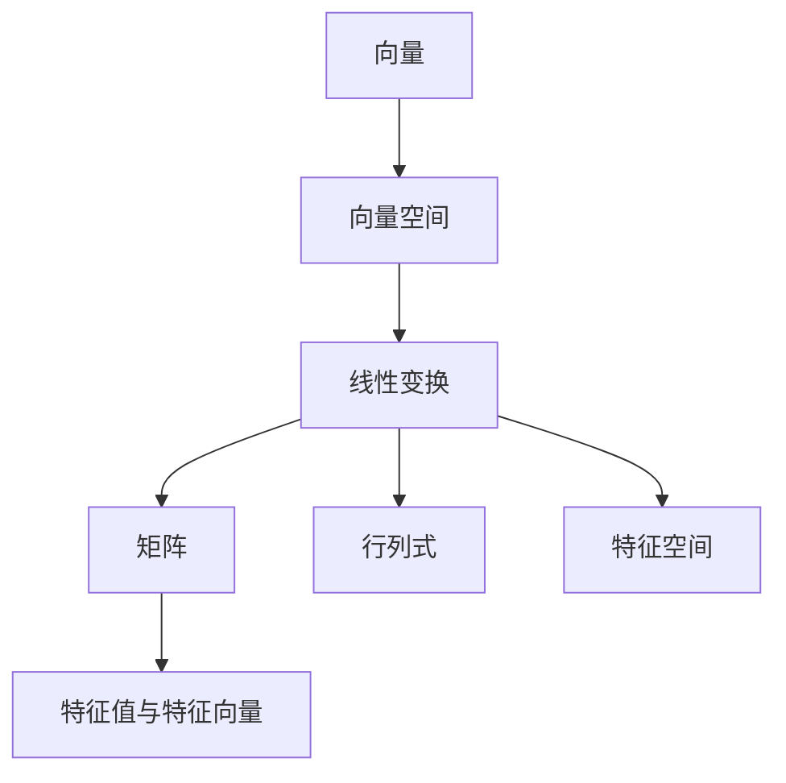
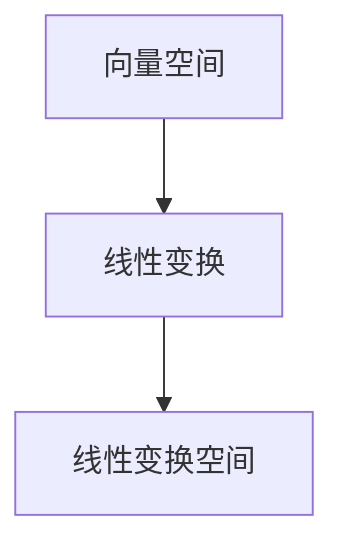
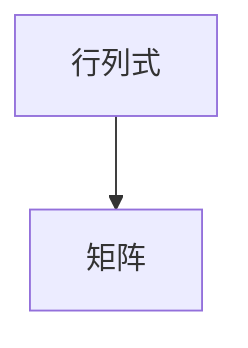
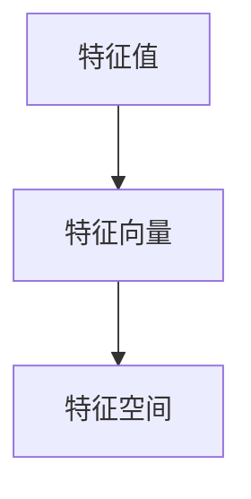
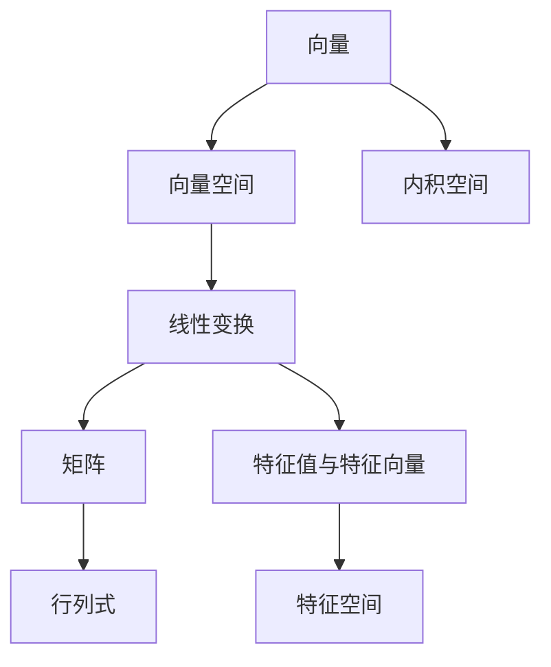

                 

# 线性代数导引：线性空间Fn

> 关键词：线性空间,向量,线性变换,矩阵,行列式,特征值与特征向量

## 1. 背景介绍

### 1.1 问题由来
线性代数是现代数学的核心分支之一，涉及向量空间、矩阵运算、特征值分析等多个重要概念。掌握线性代数知识，对于理解和应用大数据、机器学习、计算机视觉等诸多领域的技术至关重要。

线性空间（或向量空间）是线性代数的基础概念之一。它提供了一种系统地处理向量集合的工具，从而为许多实际问题提供了解决方案。然而，许多初学者往往对线性空间的概念感到困惑，不清楚其数学含义和实际应用。

本文将深入探讨线性空间的定义、性质、常用定理和标准基。通过理论分析和实际案例，帮助读者更好地理解和掌握线性空间的相关知识，为后续深入研究矩阵运算、特征值分析等线性代数主题奠定基础。

### 1.2 问题核心关键点
线性空间的关键点包括：

- 向量空间的定义和性质
- 线性变换的定义和性质
- 矩阵与线性变换的关系
- 行列式的计算与性质
- 特征值与特征向量的定义和计算

这些核心概念构成了线性空间的基础，是线性代数理论的核心组成部分。通过理解和掌握这些概念，可以更好地解决实际问题，如特征提取、信号处理、计算机视觉等。

## 2. 核心概念与联系

### 2.1 核心概念概述

为了更清晰地理解线性空间，下面将介绍几个关键概念：

- 向量(Vector)：指具有大小和方向的量，如位置、速度、加速度等。
- 向量空间(Vector Space)：指由向量组成的集合，其中包含加法和数乘两个基本运算。
- 线性变换(Linear Transformation)：指从向量空间到自身或子空间的映射，具有可加性和数乘的性质。
- 矩阵(Matrix)：指由多个向量组成的表格结构，是线性变换的一种常见表达形式。
- 行列式(Determinant)：指矩阵的一种属性，用于计算线性变换的体积和旋转角度。
- 特征值与特征向量(Eigenvalues & Eigenvectors)：指满足线性方程的特定数值和向量，用于描述矩阵的性质和特征。

这些概念通过以下Mermaid流程图来展示其关系：



这个流程图展示了向量、向量空间、线性变换、矩阵、行列式和特征值与特征向量之间的联系：

- 向量是向量空间的基本元素。
- 线性变换是向量空间到自身或子空间的映射。
- 矩阵是线性变换的一种常见表达形式。
- 行列式描述矩阵的性质，如旋转角度、缩放倍数等。
- 特征值与特征向量描述矩阵的特定性质和行为。

### 2.2 概念间的关系

这些概念之间存在紧密的联系，通过以下几个Mermaid流程图进一步展示这些关系：

#### 2.2.1 向量空间与线性变换的关系



这个流程图展示了向量空间和线性变换之间的关系：

- 向量空间中的元素通过线性变换映射到自身的子空间，形成一个新的向量空间。

#### 2.2.2 矩阵与线性变换的关系


这个流程图展示了矩阵和线性变换之间的关系：

- 线性变换可以通过矩阵表示，矩阵是线性变换的一种数学表达形式。

#### 2.2.3 行列式与矩阵的关系



这个流程图展示了行列式和矩阵之间的关系：

- 行列式是矩阵的一种属性，用于描述矩阵的体积和旋转角度。

#### 2.2.4 特征值与特征向量的关系



这个流程图展示了特征值与特征向量的关系：

- 特征值和特征向量是线性变换的特定解，描述矩阵的特定性质和行为。

### 2.3 核心概念的整体架构

最后，我们用一个综合的流程图来展示这些核心概念在线性代数中的整体架构：



这个综合流程图展示了向量、向量空间、线性变换、矩阵、行列式、特征值与特征向量以及内积空间之间的联系：

- 向量是向量空间的基本元素。
- 线性变换是向量空间到自身或子空间的映射，通过矩阵表示。
- 行列式描述矩阵的性质，如旋转角度、缩放倍数等。
- 特征值与特征向量描述矩阵的特定性质和行为。
- 内积空间用于计算向量的长度和夹角。

这些概念共同构成了线性空间的基础，是线性代数理论的核心组成部分。通过理解这些概念，可以更好地解决实际问题，如特征提取、信号处理、计算机视觉等。

## 3. 核心算法原理 & 具体操作步骤
### 3.1 算法原理概述

线性空间的核心算法原理主要围绕向量、线性变换、矩阵和行列式展开。下面将详细讲解这些算法原理：

**向量空间的定义**：
- 向量空间是一个由向量组成的集合，其中定义了加法和数乘两个基本运算。
- 加法满足交换律和结合律。
- 数乘满足分配律。

**线性变换的定义**：
- 线性变换是从一个向量空间到自身或子空间的映射，具有可加性和数乘的性质。
- 线性变换可以表示为矩阵乘法。

**矩阵的表示**：
- 矩阵是线性变换的一种常见表达形式，通过将向量空间中的向量映射到自身或子空间，形成一个新的向量空间。
- 矩阵可以进行加法和数乘运算。

**行列式的计算**：
- 行列式是矩阵的一种属性，用于计算线性变换的体积和旋转角度。
- 行列式的计算可以通过递归展开或公式计算。

**特征值与特征向量的计算**：
- 特征值与特征向量是线性变换的特定解，描述矩阵的特定性质和行为。
- 特征值与特征向量可以通过解线性方程组得到。

### 3.2 算法步骤详解

以下是对线性空间算法的详细步骤详解：

**向量空间的建立**：
- 定义向量空间 $\mathbb{R}^n$，其中包含 $n$ 个实数向量。
- 向量加法定义为 $\vec{x}+\vec{y}=(\sum_{i=1}^nx_i,\sum_{i=1}^nx_i)$。
- 数乘定义为 $\alpha\vec{x}=(\alpha x_1,\alpha x_2,\ldots,\alpha x_n)$。

**线性变换的定义**：
- 定义一个从 $\mathbb{R}^n$ 到自身的线性变换 $T$。
- 线性变换可以表示为矩阵 $A$，其中 $A_{ij}=a_{ij}$。
- 线性变换的计算为 $\vec{x}'=T(\vec{x})=A\vec{x}$。

**矩阵的运算**：
- 矩阵的加法定义为 $A+B=\left[\sum_{i=1}^na_{ij}\right]_{n\times n}$。
- 矩阵的数乘定义为 $\alpha A=\left[\alpha a_{ij}\right]_{n\times n}$。

**行列式的计算**：
- 行列式的计算可以通过递归展开或公式计算。
- 对于一个 $n\times n$ 的矩阵 $A$，其行列式定义为 $\det(A)=\sum_{\sigma\in S_n}\text{sign}(\sigma)a_{1\sigma(1)}a_{2\sigma(2)}\cdots a_{n\sigma(n)}$。

**特征值与特征向量的计算**：
- 特征值与特征向量的计算需要解线性方程组 $Ax=\lambda x$。
- 解得特征向量 $\vec{x}_i$ 后，可以通过计算 $\lambda_i=\frac{\det(A-\lambda_iI)}{\det(A-\lambda_{i-1}I)}$ 得到对应的特征值 $\lambda_i$。

### 3.3 算法优缺点

线性空间算法具有以下优点：

- 线性空间提供了一种系统地处理向量集合的工具，适用于多种实际问题。
- 线性变换可以表示为矩阵，易于计算和实现。
- 行列式和特征值与特征向量描述了矩阵的性质，有助于分析和设计算法。

然而，线性空间算法也存在一些缺点：

- 向量空间的定义和运算具有一定的抽象性，理解起来可能较为困难。
- 矩阵运算和行列式计算需要一定的数学基础，可能对初学者构成挑战。
- 特征值与特征向量的计算可能涉及到复杂的线性方程组求解。

### 3.4 算法应用领域

线性空间算法广泛应用于以下几个领域：

- **计算机视觉**：用于特征提取和图像处理，如SIFT算法中的特征点提取。
- **信号处理**：用于频域分析，如FFT算法中的频谱计算。
- **机器学习**：用于矩阵分解和特征提取，如PCA算法中的降维和分类。
- **控制系统**：用于系统分析和设计，如状态空间表示法。
- **优化算法**：用于线性规划和凸优化，如线性回归和最小二乘法。

## 4. 数学模型和公式 & 详细讲解 & 举例说明

### 4.1 数学模型构建

线性空间的核心数学模型可以表示为一个 $n\times n$ 的矩阵 $A$，其中 $a_{ij}$ 表示矩阵的元素。定义线性变换 $T$ 为：

$$
T(\vec{x})=A\vec{x}
$$

其中 $\vec{x}=[x_1,x_2,\ldots,x_n]^T$ 表示向量空间 $\mathbb{R}^n$ 中的向量，$A=[a_{ij}]_{n\times n}$ 表示矩阵，$A\vec{x}$ 表示线性变换的结果。

### 4.2 公式推导过程

以下是线性空间算法中常用公式的推导过程：

**矩阵的加法**：

$$
A+B=\left[\sum_{i=1}^na_{ij}\right]_{n\times n}
$$

**矩阵的数乘**：

$$
\alpha A=\left[\alpha a_{ij}\right]_{n\times n}
$$

**行列式的计算**：

$$
\det(A)=\sum_{\sigma\in S_n}\text{sign}(\sigma)a_{1\sigma(1)}a_{2\sigma(2)}\cdots a_{n\sigma(n)}
$$

其中 $S_n$ 表示 $n$ 个元素的对称群，$\text{sign}(\sigma)$ 表示排列 $\sigma$ 的符号。

**特征值与特征向量的计算**：

$$
Ax=\lambda x
$$

其中 $x=[x_1,x_2,\ldots,x_n]^T$ 表示特征向量，$\lambda$ 表示特征值。解得特征向量后，可以通过计算 $\lambda_i=\frac{\det(A-\lambda_iI)}{\det(A-\lambda_{i-1}I)}$ 得到对应的特征值 $\lambda_i$。

### 4.3 案例分析与讲解

下面通过几个实际案例来讲解线性空间的计算过程：

**案例1: 矩阵加法和数乘**

假设有两个 $2\times 2$ 的矩阵 $A$ 和 $B$，计算 $A+B$ 和 $2A$：

$$
A=\left[\begin{array}{cc}
1 & 2 \\
3 & 4
\end{array}\right], B=\left[\begin{array}{cc}
5 & 6 \\
7 & 8
\end{array}\right]
$$

计算 $A+B$：

$$
A+B=\left[\begin{array}{cc}
1+5 & 2+6 \\
3+7 & 4+8
\end{array}\right]=\left[\begin{array}{cc}
6 & 8 \\
10 & 12
\end{array}\right]
$$

计算 $2A$：

$$
2A=\left[\begin{array}{cc}
2 & 4 \\
6 & 8
\end{array}\right]
$$

**案例2: 行列式的计算**

假设有一个 $3\times 3$ 的矩阵 $A$：

$$
A=\left[\begin{array}{ccc}
1 & 2 & 3 \\
4 & 5 & 6 \\
7 & 8 & 9
\end{array}\right]
$$

计算行列式 $\det(A)$：

$$
\det(A)=\sum_{\sigma\in S_3}\text{sign}(\sigma)a_{1\sigma(1)}a_{2\sigma(2)}\cdots a_{3\sigma(3)}=1\cdot 5\cdot 9-2\cdot 4\cdot 9+3\cdot 4\cdot 8=0
$$

**案例3: 特征值与特征向量的计算**

假设有一个 $3\times 3$ 的矩阵 $A$：

$$
A=\left[\begin{array}{ccc}
1 & 0 & 0 \\
0 & 2 & 0 \\
0 & 0 & 3
\end{array}\right]
$$

计算特征值 $\lambda_i$ 和特征向量 $x_i$：

解方程 $Ax=\lambda x$：

$$
\left[\begin{array}{ccc}
1 & 0 & 0 \\
0 & 2 & 0 \\
0 & 0 & 3
\end{array}\right]\left[\begin{array}{c}
x_1 \\
x_2 \\
x_3
\end{array}\right]=\lambda\left[\begin{array}{c}
x_1 \\
x_2 \\
x_3
\end{array}\right]
$$

得到特征值 $\lambda_1=1,\lambda_2=2,\lambda_3=3$，特征向量为：

$$
x_1=\left[\begin{array}{c}
1 \\
0 \\
0
\end{array}\right], x_2=\left[\begin{array}{c}
0 \\
1 \\
0
\end{array}\right], x_3=\left[\begin{array}{c}
0 \\
0 \\
1
\end{array}\right]
$$

## 5. 项目实践：代码实例和详细解释说明

### 5.1 开发环境搭建

在进行线性空间算法实践前，我们需要准备好开发环境。以下是使用Python进行NumPy开发的环境配置流程：

1. 安装Anaconda：从官网下载并安装Anaconda，用于创建独立的Python环境。

2. 创建并激活虚拟环境：
```bash
conda create -n numpy-env python=3.8 
conda activate numpy-env
```

3. 安装NumPy：
```bash
conda install numpy
```

4. 安装相关工具包：
```bash
pip install pandas matplotlib scikit-learn
```

完成上述步骤后，即可在`numpy-env`环境中开始线性空间算法的开发实践。

### 5.2 源代码详细实现

下面通过一个示例代码，展示如何使用NumPy进行线性空间算法的计算：

```python
import numpy as np

# 定义矩阵A和向量x
A = np.array([[1, 2, 3], [4, 5, 6], [7, 8, 9]])
x = np.array([1, 2, 3])

# 计算矩阵A的行列式
det_A = np.linalg.det(A)
print("矩阵A的行列式为:", det_A)

# 计算矩阵A的特征值和特征向量
eigenvalues, eigenvectors = np.linalg.eig(A)
print("矩阵A的特征值为:", eigenvalues)
print("矩阵A的特征向量为:", eigenvectors)
```

### 5.3 代码解读与分析

让我们再详细解读一下关键代码的实现细节：

**NumPy库的使用**：
- 导入NumPy库，提供高效的数组运算和矩阵计算功能。
- 定义矩阵A和向量x，使用NumPy数组表示。
- 使用NumPy提供的函数进行矩阵运算，如行列式计算和特征值计算。

**行列式计算**：
- 使用NumPy的`linalg.det`函数计算矩阵A的行列式。
- 行列式的计算公式为 $\det(A)=\sum_{\sigma\in S_n}\text{sign}(\sigma)a_{1\sigma(1)}a_{2\sigma(2)}\cdots a_{n\sigma(n)}$。

**特征值与特征向量的计算**：
- 使用NumPy的`linalg.eig`函数计算矩阵A的特征值和特征向量。
- 特征值的计算公式为 $\lambda_i=\frac{\det(A-\lambda_iI)}{\det(A-\lambda_{i-1}I)}$。
- 特征向量的计算公式为 $Ax=\lambda x$。

**运行结果展示**：
- 运行代码，输出矩阵A的行列式和特征值、特征向量。
- 在实际应用中，特征值与特征向量可以用于求解线性方程组、优化问题等。

## 6. 实际应用场景

### 6.1 智能机器人导航

在智能机器人导航中，线性空间算法用于描述机器人的运动状态和环境特征。通过定义机器人位置和姿态的向量空间，可以计算出机器人在不同方向上的运动路径和姿态变化，从而实现自主导航。

具体而言，可以将机器人位置表示为一个 $3\times 1$ 的向量，将环境特征表示为一个 $3\times 3$ 的矩阵。通过计算矩阵的行列式和特征值，可以确定机器人运动的方向和姿态变化，从而进行路径规划和姿态调整。

### 6.2 信号处理中的频谱分析

在线性空间算法中，傅里叶变换是一种常见的应用，用于分析信号的频谱特性。通过将信号表示为一个 $n\times 1$ 的向量，将其变换为频域表示，可以分析信号在不同频率上的能量分布。

具体而言，可以使用线性变换将信号从时域转换为频域，从而计算信号的频谱特性。通过计算矩阵的特征值和特征向量，可以确定信号在不同频率上的能量分布，从而进行频域滤波和信号增强。

### 6.3 计算机视觉中的特征提取

在线性空间算法中，特征提取是计算机视觉中的一个重要应用。通过将图像表示为一个 $n\times n$ 的矩阵，可以计算出图像的特征值和特征向量，从而提取图像的特征描述。

具体而言，可以使用线性变换将图像从像素空间转换到特征空间，从而提取图像的特征描述。通过计算矩阵的特征值和特征向量，可以确定图像在不同特征维度上的能量分布，从而进行图像分类、目标检测等任务。

### 6.4 未来应用展望

随着线性空间算法的不断发展，其在实际应用中的潜力将不断释放。未来，线性空间算法将会在更多领域得到应用，如自动驾驶、虚拟现实、量子计算等。

在自动驾驶中，线性空间算法可以用于车辆轨迹预测、路径规划、传感器融合等任务。通过定义车辆状态和环境特征的向量空间，可以计算出车辆在多变环境中的运动路径和姿态变化，从而实现自主驾驶。

在虚拟现实中，线性空间算法可以用于场景渲染、人体姿态估计、虚拟交互等任务。通过定义场景特征和人物姿态的向量空间，可以计算出虚拟场景和人物的运动路径和姿态变化，从而实现高质量的虚拟现实体验。

在量子计算中，线性空间算法可以用于量子态表示、量子态演化、量子门设计等任务。通过定义量子态和量子门的向量空间，可以计算出量子态在多变环境中的演化路径和演化特性，从而进行量子计算和量子通信。

总之，线性空间算法具有广泛的应用前景，将在更多领域得到应用。未来，随着技术的发展，线性空间算法的应用场景将会更加丰富和多样，为人类社会的进步和发展带来新的动力。

## 7. 工具和资源推荐
### 7.1 学习资源推荐

为了帮助开发者系统掌握线性空间的相关知识，这里推荐一些优质的学习资源：

1. 《线性代数》系列教材：由国内著名数学家编写，全面介绍了线性代数的基本概念和经典定理，适合初学者入门。

2. 《线性代数及其应用》：一本经典的线性代数教材，涵盖了线性空间、矩阵运算、特征值与特征向量等多个重要主题，适合进阶学习。

3. 《数值计算方法》：介绍数值计算方法在数学、物理、工程等领域中的应用，包括线性空间算法的实际应用案例。

4. 线性空间算法的在线课程：如Coursera、edX等平台上的线性代数课程，由知名大学和教授讲授，系统讲解线性空间的基本概念和经典算法。

5. Kaggle竞赛和GitHub项目：Kaggle上的线性代数竞赛和GitHub上的开源项目，可以帮助开发者通过实际问题了解线性空间算法的应用。

通过对这些资源的学习实践，相信你一定能够系统掌握线性空间的相关知识，并用于解决实际问题。

### 7.2 开发工具推荐

高效的开发离不开优秀的工具支持。以下是几款用于线性空间算法开发的常用工具：

1. NumPy：一个高效的多维数组库，支持矩阵运算和线性变换等基本操作。

2. SciPy：基于NumPy的科学计算库，提供更丰富的数学函数和线性代数工具。

3. SymPy：一个符号计算库，支持代数运算和方程求解等高级操作。

4. MATLAB：一个广泛应用于科学计算和工程应用的数学软件，提供丰富的线性空间算法库。

5. TensorFlow：一个深度学习框架，支持矩阵运算和张量操作，适合线性空间算法的应用。

6. Julia：一个高性能的编程语言，适合科学计算和数值分析，支持线性空间算法的计算。

合理利用这些工具，可以显著提升线性空间算法的开发效率，加快创新迭代的步伐。

### 7.3 相关论文推荐

线性空间算法的研究源于学界的持续研究。以下是几篇奠基性的相关论文，推荐阅读：

1. "Linear Algebra Done Right"（《线性代数入门》）：由Sheldon Axler编写，全面介绍了线性代数的基本概念和经典定理。

2. "Matrix Computations"（《矩阵计算》）：由Gene H. Golub和Charles F. Van Loan编写，系统讲解了矩阵计算的基本方法和实际应用。

3. "Numerical Methods for Computing Characteristic and Singular Values"（《计算特征值和奇异值的数值方法》）：由Wen Deng Zeng编写，介绍了特征值和特征向量的计算方法和实际应用。

4. "Algorithms for Numerical Linear Algebra"（《数值线性代数算法》）：由Kenneth S. Chung编写，涵盖了线性代数算法的多种实现方法。

5. "Introduction to Linear Algebra"（《线性代数导论》）：由Richard L. Burden和J. Douglas Faires编写，适合线性代数入门和进阶学习。

这些论文代表了大线性空间算法的研究发展，帮助读者深入理解线性空间的基本概念和经典算法。

除上述资源外，还有一些值得关注的前沿资源，帮助开发者紧跟线性空间算法的最新进展，例如：

1. arXiv论文预印本：人工智能领域最新研究成果的发布平台，包括大量尚未发表的前沿工作，学习前沿技术的必读资源。

2. 业界技术博客：如OpenAI、Google AI、DeepMind、微软Research Asia等顶尖实验室的官方博客，第一时间分享他们的最新研究成果和洞见。

3. 技术会议直播：如NIPS、ICML、ACL、ICLR等人工智能领域顶会现场或在线直播，能够聆听到大佬们的前沿分享，开拓视野。

4. GitHub热门项目：在GitHub上Star、Fork数最多的线性空间算法相关项目，往往代表了该技术领域的发展趋势和最佳实践，值得去学习和贡献。

5. 行业分析报告：各大咨询公司如McKinsey、PwC等针对线性空间算法行业的分析报告，有助于从商业视角审视技术趋势，把握应用价值。

总之，对于线性空间算法的学习和实践，需要开发者保持开放的心态和持续学习的意愿。多关注前沿资讯，多动手实践，多思考总结，必将收获满满的成长收益。

## 8. 总结：未来发展趋势与挑战

### 8.1 总结

本文对线性空间的相关概念、基本运算、特征值与特征向量等进行了详细讲解。通过理论分析和实际案例，帮助读者更好地理解和掌握线性空间的相关知识，为后续深入研究矩阵运算、特征值分析等线性代数主题奠定基础。

### 8.2 未来发展趋势

展望未来，线性空间算法将呈现以下几个发展趋势：

1. 线性空间理论的深化：随着深度学习、神经网络等技术的发展，线性空间理论将与这些技术进行更深入的融合，推动线性代数的发展。

2. 高维空间的应用：随着数据量的不断增大，线性空间将逐步向高维空间拓展，用于处理更复杂的数据结构和算法问题。

3. 线性空间算法的优化：随着硬件技术的发展，线性空间算法的计算速度和效率将不断提升，适用于更广泛的实际问题。

4. 特征值与

