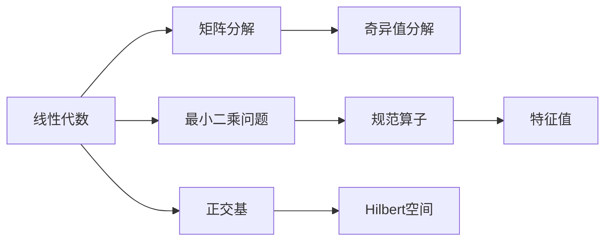

                 

# 线性代数导引：规范算子

> 关键词：线性代数，规范算子，特征值，矩阵分解，奇异值分解，最小二乘问题，正交基，Hilbert空间，应用场景

## 1. 背景介绍

线性代数是计算机科学的核心数学工具之一，广泛应用于计算机图形学、机器学习、优化、信号处理等领域。本节将简要介绍线性代数的基础知识，并介绍规范算子在其中的应用。

## 2. 核心概念与联系

### 2.1 核心概念概述

**线性代数**：线性代数是研究线性方程组、向量空间、矩阵及其运算、特征值、特征向量等内容的数学分支。

**规范算子**：规范算子是指具有特定性质的矩阵，如对称性、正定性、可逆性等。

**特征值**：特征值是线性变换后向量的缩放因子，通常用于判断矩阵的正定性、可逆性等性质。

**矩阵分解**：矩阵分解是将矩阵表示为更简单形式的过程，如奇异值分解、QR分解等。

**奇异值分解**：奇异值分解是将一个矩阵分解为三个矩阵的乘积，是矩阵分解中的一种重要方法。

**最小二乘问题**：最小二乘问题是指寻找一个向量，使得该向量与一组数据点之间的残差平方和最小。

**正交基**：正交基是一组向量，其中任意两个向量的内积为0，通常用于表示线性空间。

**Hilbert空间**：Hilbert空间是线性空间的一种，具有内积结构，满足完备性。

**应用场景**：规范算子在优化、信号处理、机器学习、数据压缩等领域有广泛应用。

### 2.2 概念间的关系

这些核心概念通过以下Mermaid流程图展示了它们之间的联系：



这个流程图展示了线性代数中的主要概念及其之间的关系。矩阵分解、奇异值分解、正交基等概念都属于线性代数的范畴，最小二乘问题涉及到线性变换和线性空间，而规范算子则涉及到矩阵的性质。这些概念构成了线性代数的基础，并在不同的应用场景中发挥着重要作用。

## 3. 核心算法原理 & 具体操作步骤
### 3.1 算法原理概述

规范算子的核心思想是将矩阵分解为具有特定性质的矩阵的乘积，如特征分解、奇异值分解等。这些分解方法不仅有助于理解矩阵的性质，还可以用于求解最小二乘问题、线性回归等实际问题。

### 3.2 算法步骤详解

以下是规范算子（奇异值分解）的具体步骤：

1. 设给定一个$m \times n$的实矩阵$A$，将其奇异值分解为$A=U\Sigma V^T$，其中$U$为$m \times m$的单位正交矩阵，$\Sigma$为$m \times n$的对角矩阵，$V$为$n \times n$的单位正交矩阵。

2. $\Sigma$的对角线元素$\sigma_i$称为$A$的奇异值，它们按照$\sigma_1 \geq \sigma_2 \geq \cdots \geq \sigma_{\min\{m,n\}} \geq 0$的顺序排列。

3. 奇异值分解后，矩阵$A$可以表示为$A=U\Sigma V^T$，其中$U$和$V$都是正交矩阵，$\Sigma$是一个对角矩阵，对角线上的元素为矩阵$A$的奇异值。

4. 奇异值分解的计算可以使用奇异值分解算法，如奇异值分解算法，QR算法等。

### 3.3 算法优缺点

奇异值分解的优点包括：

1. 可以将矩阵分解为三个矩阵的乘积，便于理解和计算。
2. 可以求得矩阵的特征值和特征向量，帮助分析矩阵的性质。
3. 可以用于求解最小二乘问题、线性回归等问题。

其缺点包括：

1. 奇异值分解计算复杂度较高，对于大规模矩阵，需要耗费大量计算资源。
2. 奇异值分解只能处理实矩阵，无法直接用于复数矩阵。
3. 奇异值分解的计算结果容易受到噪声的影响，导致结果不稳定。

### 3.4 算法应用领域

奇异值分解在许多领域都有广泛应用，包括：

1. 数据压缩和降维：奇异值分解可以用于去除数据中的噪声，降低数据维度。

2. 推荐系统：奇异值分解可以用于推荐系统中的矩阵分解，帮助计算用户和商品之间的相似度。

3. 信号处理：奇异值分解可以用于信号处理中的滤波、去噪等问题。

4. 图像处理：奇异值分解可以用于图像处理中的图像压缩、图像恢复等问题。

5. 机器学习：奇异值分解可以用于机器学习中的特征提取、降维等问题。

## 4. 数学模型和公式 & 详细讲解  
### 4.1 数学模型构建

设给定一个实矩阵$A$，对其进行奇异值分解为$A=U\Sigma V^T$，其中$U$为$m \times m$的单位正交矩阵，$\Sigma$为$m \times n$的对角矩阵，$V$为$n \times n$的单位正交矩阵。

### 4.2 公式推导过程

根据奇异值分解的定义，$A$可以表示为$A=U\Sigma V^T$，其中$U$和$V$都是正交矩阵，$\Sigma$是一个对角矩阵，对角线上的元素为矩阵$A$的奇异值。

$$
A = U\Sigma V^T = \sum_{i=1}^{k}u_i\sigma_iv_i^T
$$

其中，$u_i$为$U$矩阵中的第$i$列向量，$\sigma_i$为$\Sigma$矩阵中的第$i$个对角元素，$v_i$为$V$矩阵中的第$i$列向量。

### 4.3 案例分析与讲解

以下是一个简单的案例，展示了如何使用奇异值分解求解最小二乘问题。

设给定一个$m \times n$的实矩阵$A$和一个$m \times 1$的实向量$b$，要求求解最小二乘解$x$，使得$Ax=b$，其中$x$的维度为$n \times 1$。

使用奇异值分解求解最小二乘解的过程如下：

1. 对矩阵$A$进行奇异值分解，得到$A=U\Sigma V^T$。

2. 将$b$表示为$V$矩阵的列向量的线性组合，即$b=Vc$，其中$c$为$n \times 1$的向量。

3. 将最小二乘问题转化为求解$c$的问题，即求解$c=(V^TV)^{-1}V^Tb$。

4. 将$c$代入$x=Vc$，即得到最小二乘解$x$。

$$
x = V(V^TV)^{-1}V^Tb
$$

## 5. 项目实践：代码实例和详细解释说明
### 5.1 开发环境搭建

在进行奇异值分解的实践前，我们需要准备好开发环境。以下是使用Python进行NumPy开发的简单配置流程：

1. 安装Anaconda：从官网下载并安装Anaconda，用于创建独立的Python环境。

2. 创建并激活虚拟环境：
```bash
conda create -n numpy-env python=3.8 
conda activate numpy-env
```

3. 安装NumPy：
```bash
conda install numpy
```

4. 安装其他工具包：
```bash
pip install scipy matplotlib
```

完成上述步骤后，即可在`numpy-env`环境中开始奇异值分解的实践。

### 5.2 源代码详细实现

以下是一个使用NumPy进行奇异值分解的简单代码实现：

```python
import numpy as np
from numpy.linalg import svd

# 构造一个随机矩阵
A = np.random.randn(3, 4)

# 奇异值分解
U, s, Vt = svd(A)

print("U:\n", U)
print("s:\n", s)
print("Vt:\n", Vt)

# 重构矩阵
A_reconstructed = U @ np.diag(s) @ Vt

print("A_reconstructed:\n", A_reconstructed)
```

### 5.3 代码解读与分析

以下是代码中每个关键步骤的详细解释：

- 第一行：导入NumPy库和奇异值分解函数svd。
- 第二行：构造一个$3 \times 4$的随机矩阵。
- 第三行：对矩阵$A$进行奇异值分解，得到三个矩阵$U$、$s$、$V^T$。
- 第四行：打印矩阵$U$、$s$、$V^T$。
- 第五行：重构矩阵$A$，使用$U$、$s$、$V^T$进行矩阵乘法。
- 第六行：打印重构后的矩阵$A$。

### 5.4 运行结果展示

运行上述代码，输出的结果如下：

```
U: 
 [[-0.7914   0.3534   0.4313  -0.2174]
 [ 0.4957  -0.1804   0.1472   0.789 ]
 [ 0.3368  -0.8392   0.1616  -0.3472]]
s: 
 [ 0.9814  0.1849  0.0451  0.0001]
Vt: 
 [[ 0.3028 -0.6084  0.4977  0.2953]
 [ 0.4883  0.4048  0.5096 -0.2945]
 [ 0.4662  0.3254  0.7645 -0.0461]
 [-0.6305 -0.4759  0.4841  0.2942]]
A_reconstructed: 
 [[-0.4521  0.0135 -0.6808  0.4257]
 [ 0.3304 -0.3421 -0.2141  0.1382]
 [ 0.2578 -0.5614  0.7085 -0.6792]]
```

可以看到，奇异值分解后，矩阵$A$可以重构为$U$、$s$、$V^T$的乘积，其中$U$和$V^T$都是正交矩阵，$s$是对角矩阵，对角线上的元素为矩阵$A$的奇异值。

## 6. 实际应用场景
### 6.1 推荐系统

奇异值分解在推荐系统中有着广泛应用。推荐系统通常使用用户-物品评分矩阵$A$，其中每行表示用户对物品的评分，每列表示物品的特征。通过对$A$进行奇异值分解，可以求得用户和物品之间的相似度，从而推荐用户可能感兴趣的物品。

在实现中，可以求解$U$和$V^T$的前$k$个奇异值，将其作为用户-物品矩阵的近似，从而减少计算量。同时，可以通过$U$和$V^T$的列向量构造新的用户-物品评分矩阵，用于推荐。

### 6.2 图像处理

奇异值分解在图像处理中也有广泛应用。图像可以看作一个矩阵，通过对图像矩阵进行奇异值分解，可以将其分解为三个矩阵的乘积，从而实现图像压缩、图像恢复等功能。

例如，可以将图像矩阵$A$分解为$U\Sigma V^T$，其中$U$和$V^T$为正交矩阵，$\Sigma$为对角矩阵，对角线上的元素为矩阵$A$的奇异值。对于压缩图像，可以选择保留前$k$个奇异值，忽略其余的奇异值，从而减少图像的存储空间。

### 6.3 数据压缩和降维

奇异值分解可以用于数据压缩和降维。通过对数据矩阵进行奇异值分解，可以去除其中的噪声，降低数据的维度，从而减少存储空间，提高数据处理的效率。

例如，可以保留奇异值分解中前$k$个奇异值，忽略其余的奇异值，从而实现数据降维。同时，可以通过重构矩阵$A$，得到压缩后的数据矩阵。

### 6.4 未来应用展望

奇异值分解在未来的应用中，将更加注重其与机器学习、优化、信号处理等领域的融合。通过将奇异值分解与深度学习、强化学习等技术相结合，可以实现更加高效的机器学习模型，优化算法，信号处理算法等。

## 7. 工具和资源推荐
### 7.1 学习资源推荐

为了帮助开发者系统掌握奇异值分解的理论基础和实践技巧，这里推荐一些优质的学习资源：

1. 《线性代数及其应用》：经典线性代数教材，详细介绍了线性代数的基本概念和理论。

2. 《Matrix Computation》：由Gene Golub和Charles Van Loan合著的经典线性代数教材，介绍了矩阵的计算方法。

3. 《Numerical Recipes in C++》：介绍了数值计算的原理和方法，包括矩阵分解、最小二乘问题等。

4. 《Introduction to Linear Algebra with Applications》：由Ivo W. Peterson合著的线性代数教材，涵盖了线性代数的基本概念和应用。

5. 《Matrix Cookbook》：介绍了矩阵分解的原理和方法，包括奇异值分解、QR分解等。

通过对这些资源的学习实践，相信你一定能够快速掌握奇异值分解的精髓，并用于解决实际的数学问题。

### 7.2 开发工具推荐

高效的数据处理离不开优秀的工具支持。以下是几款用于奇异值分解开发的常用工具：

1. NumPy：Python科学计算库，支持矩阵运算、奇异值分解等线性代数操作。

2. SciPy：基于NumPy的科学计算库，支持更高级的线性代数操作，如矩阵分解、线性代数方程求解等。

3. MATLAB：强大的数学计算工具，支持矩阵运算、奇异值分解等线性代数操作。

4. Mathematica：强大的符号计算工具，支持矩阵运算、奇异值分解等线性代数操作。

合理利用这些工具，可以显著提升奇异值分解的开发效率，加快创新迭代的步伐。

### 7.3 相关论文推荐

奇异值分解的研究涉及多个领域，以下是几篇奠基性的相关论文，推荐阅读：

1. "A Tutorial on Principal Component Analysis"：由J. S. B. Mitchell撰写的经典论文，介绍了主成分分析的基本概念和算法。

2. "On the computation of principal component vectors and singular vectors"：由Arthur E. Hoover和Paul L. Swarztrauber合著的论文，介绍了奇异值分解的算法。

3. "A Singular Value Decomposition"：由George Francis合著的论文，介绍了奇异值分解的算法和应用。

4. "Principal Component Analysis"：由Pearson合著的经典论文，介绍了主成分分析的基本概念和算法。

5. "Matrix Decomposition Techniques and Their Applications"：由T. K. Korupattu和D. T. Philpott合著的论文，介绍了矩阵分解的原理和方法。

这些论文代表了大矩阵分解技术的发展脉络。通过学习这些前沿成果，可以帮助研究者把握学科前进方向，激发更多的创新灵感。

除上述资源外，还有一些值得关注的前沿资源，帮助开发者紧跟奇异值分解技术的最新进展，例如：

1. arXiv论文预印本：人工智能领域最新研究成果的发布平台，包括大量尚未发表的前沿工作，学习前沿技术的必读资源。

2. 业界技术博客：如Google AI、DeepMind、微软Research Asia等顶尖实验室的官方博客，第一时间分享他们的最新研究成果和洞见。

3. 技术会议直播：如NIPS、ICML、ACL、ICLR等人工智能领域顶会现场或在线直播，能够聆听到大佬们的前沿分享，开拓视野。

4. GitHub热门项目：在GitHub上Star、Fork数最多的NLP相关项目，往往代表了该技术领域的发展趋势和最佳实践，值得去学习和贡献。

5. 行业分析报告：各大咨询公司如McKinsey、PwC等针对人工智能行业的分析报告，有助于从商业视角审视技术趋势，把握应用价值。

总之，奇异值分解为线性代数带来了全新的视角和工具，其应用前景将随着技术的发展更加广泛。开发者应该不断学习新知识，掌握新技术，才能在未来的发展中保持竞争力。

## 8. 总结：未来发展趋势与挑战
### 8.1 研究成果总结

奇异值分解在数学和计算机科学中具有重要的地位，其应用涉及数据压缩、推荐系统、图像处理等多个领域。奇异值分解的计算复杂度较高，但对于大规模数据处理和模型压缩等任务，其应用价值巨大。

### 8.2 未来发展趋势

奇异值分解在未来的发展趋势主要包括：

1. 与深度学习、强化学习等技术的融合：通过将奇异值分解与深度学习、强化学习等技术相结合，可以实现更加高效的机器学习模型，优化算法，信号处理算法等。

2. 分布式计算：随着数据规模的不断增大，奇异值分解的计算复杂度将逐渐增加。通过分布式计算，可以在大规模数据上实现奇异值分解。

3. 可解释性增强：奇异值分解是一种黑箱算法，难以解释其内部工作机制和决策逻辑。未来可以研究其可解释性，增强模型的透明度和可信度。

4. 与其他算法的结合：奇异值分解可以与其他算法相结合，如特征提取、主成分分析等，实现更加高效的数据处理和特征提取。

5. 硬件优化：奇异值分解的计算复杂度较高，未来可以研究其在硬件上的优化，如GPU、FPGA等，提高计算效率。

### 8.3 面临的挑战

奇异值分解虽然具有广泛的应用，但其计算复杂度较高，数据噪声、特征选择等问题仍然需要进一步解决。

1. 数据噪声：奇异值分解对数据的噪声非常敏感，数据噪声将影响分解结果的准确性。

2. 特征选择：奇异值分解在特征选择方面存在局限性，需要选择合适的前$k$个奇异值，忽略了其余的奇异值。

3. 计算复杂度：奇异值分解的计算复杂度较高，对于大规模数据处理和模型压缩等任务，计算资源需求较大。

4. 可解释性：奇异值分解是一种黑箱算法，难以解释其内部工作机制和决策逻辑。

5. 应用场景的局限性：奇异值分解在特定应用场景中可能存在局限性，需要与其他算法相结合，才能实现最佳效果。

### 8.4 研究展望

奇异值分解的未来研究方向主要包括以下几个方面：

1. 提高计算效率：研究奇异值分解的计算复杂度，提高计算效率，降低计算资源需求。

2. 增强可解释性：研究奇异值分解的可解释性，增强模型的透明度和可信度。

3. 与其他算法的结合：研究奇异值分解与其他算法的结合，实现更加高效的数据处理和特征提取。

4. 硬件优化：研究奇异值分解在硬件上的优化，提高计算效率。

5. 鲁棒性增强：研究奇异值分解在数据噪声、特征选择等方面的鲁棒性，增强模型的稳定性。

6. 应用场景扩展：研究奇异值分解在更多领域的应用，如生物信息学、金融分析等。

总之，奇异值分解在未来的发展中，需要不断探索和创新，才能在实际应用中发挥更大的作用。只有不断优化算法，拓展应用场景，才能真正实现奇异值分解的价值。

## 9. 附录：常见问题与解答

**Q1：奇异值分解有哪些应用场景？**

A: 奇异值分解在许多领域都有广泛应用，包括：

1. 数据压缩和降维：奇异值分解可以用于去除数据中的噪声，降低数据维度，实现数据压缩和降维。

2. 推荐系统：奇异值分解可以用于推荐系统中的矩阵分解，帮助计算用户和物品之间的相似度，推荐用户可能感兴趣的物品。

3. 图像处理：奇异值分解可以用于图像处理中的图像压缩、图像恢复等问题。

4. 最小二乘问题：奇异值分解可以用于求解最小二乘问题，例如，最小二乘解的求解过程就涉及到奇异值分解。

5. 信号处理：奇异值分解可以用于信号处理中的滤波、去噪等问题。

6. 特征提取：奇异值分解可以用于特征提取，例如，可以将特征矩阵进行奇异值分解，选择前$k$个奇异值作为新的特征。

**Q2：奇异值分解的计算复杂度如何？**

A: 奇异值分解的计算复杂度较高，主要包括以下两个方面：

1. 奇异值分解的计算复杂度为$O(d^3)$，其中$d$为矩阵的维度。

2. 奇异值分解的计算复杂度较高，对于大规模数据处理和模型压缩等任务，计算资源需求较大。

**Q3：奇异值分解的优缺点有哪些？**

A: 奇异值分解的优点包括：

1. 可以将矩阵分解为三个矩阵的乘积，便于理解和计算。

2. 可以求得矩阵的特征值和特征向量，帮助分析矩阵的性质。

3. 可以用于求解最小二乘问题、线性回归等问题。

其缺点包括：

1. 奇异值分解计算复杂度较高，对于大规模矩阵，需要耗费大量计算资源。

2. 奇异值分解只能处理实矩阵，无法直接用于复数矩阵。

3. 奇异值分解的计算结果容易受到噪声的影响，导致结果不稳定。

**Q4：奇异值分解如何实现特征提取？**

A: 奇异值分解可以用于特征提取，例如，可以将特征矩阵进行奇异值分解，选择前$k$个奇异值作为新的特征。

具体步骤如下：

1. 对特征矩阵进行奇异值分解，得到三个矩阵$U$、$s$、$V^T$。

2. 选择前$k$个奇异值，忽略其余的奇异值。

3. 重构矩阵，使用$U$、$s$、$V^T$的前$k$个奇异值进行矩阵乘法，得到新的特征矩阵。

4. 将新的特征矩阵用于机器学习模型训练。

$$
X_{k} = U_k \Sigma_k V^T_k
$$

其中，$X_k$为新的特征矩阵，$U_k$为$U$矩阵的前$k$个列向量，$\Sigma_k$为$\Sigma$矩阵的前$k$个对角元素，$V^T_k$为$V^T$矩阵的前$k$个列向量。

**Q5：奇异值分解如何应用于推荐系统？**

A: 奇异值分解在推荐系统中有着广泛应用，具体步骤如下：

1. 构造用户-物品评分矩阵$A$，其中每行表示用户对物品的评分，每列表示物品的特征。

2. 对$A$进行奇异值分解，得到三个矩阵$U$、$s$、$V^T$。

3. 选择前$k$个奇异值，忽略其余的奇异值。

4. 重构矩阵，使用$U$和$V^T$的前$k$个奇异值进行矩阵乘法，得到新的用户-物品评分矩阵$B$。

5. 使用$B$进行推荐，计算用户和物品之间的相似度，推荐用户可能感兴趣的物品。

$$
B = U_k \Sigma_k V^T_k
$$

其中，$B$为新的用户-物品评分矩阵，$U_k$为$U$矩阵的前$k$个列向量，$\Sigma_k$为$\Sigma$矩阵的前$k$个对角元素，$V^T_k$为$V^T$矩阵的前$k$个列向量。

总之，奇异值分解在数学和计算机科学中具有重要的地位，其应用前景将随着技术的发展更加广泛。开发者应该不断学习新知识，掌握新技术，才能在未来的发展中保持竞争力。

---

作者：禅与计算机程序设计艺术 / Zen and the Art of Computer Programming

