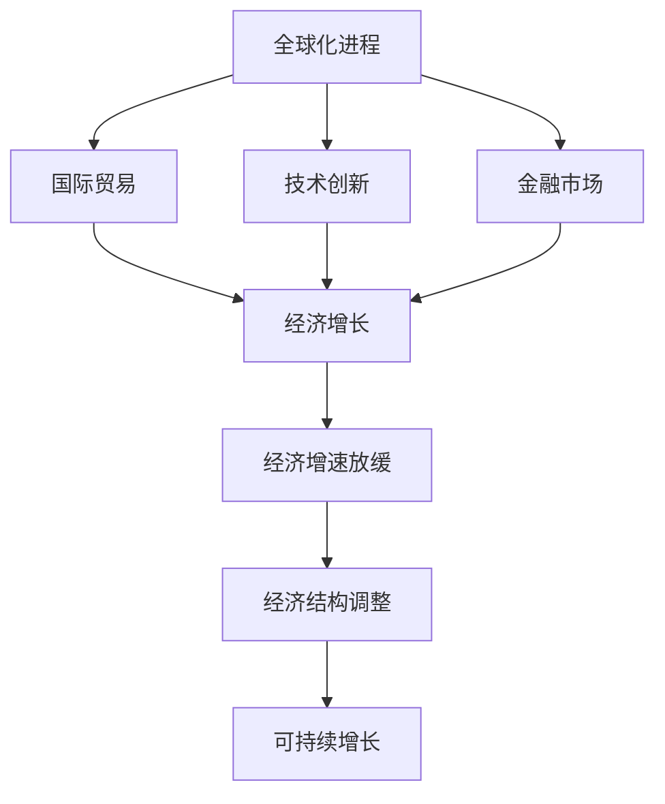
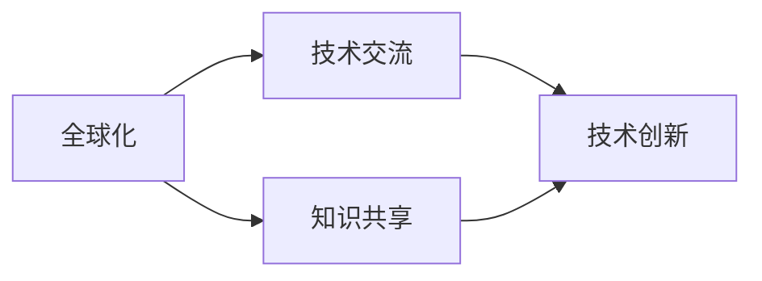
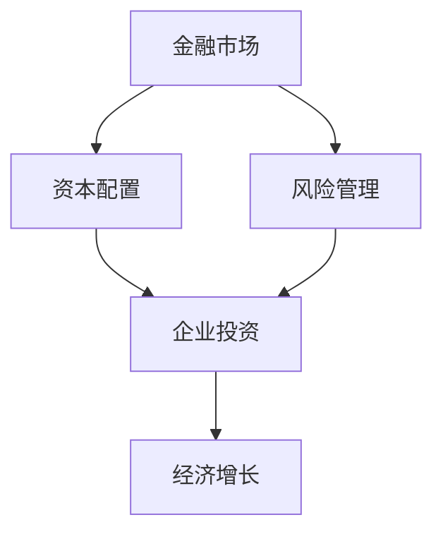
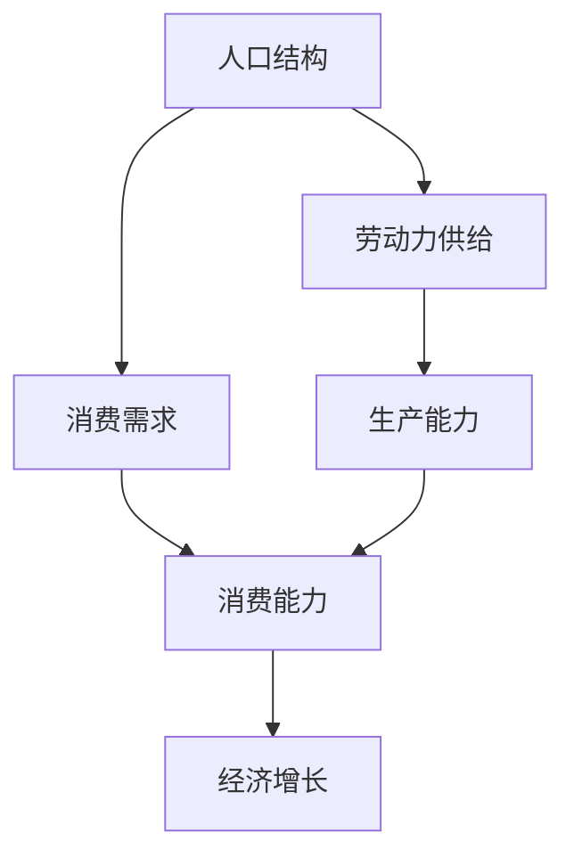
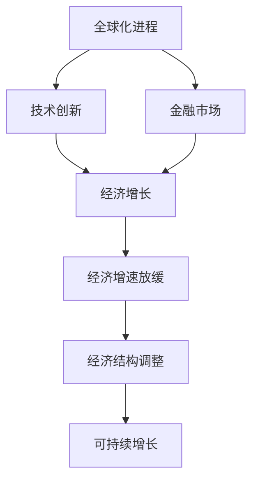

                 

## 1. 背景介绍

### 1.1 问题由来

近年来，全球主要经济体均出现经济增速放缓的趋势，特别是新冠疫情爆发后，这一趋势更加明显。为何全球经济会在此时放缓？本文将从宏观经济学的角度，探讨经济增速放缓的根本原因，并结合实际数据进行详细分析。

### 1.2 问题核心关键点

经济增速放缓是全球各国共同面临的问题，其背后涉及复杂的经济、政治、社会等多个因素。本文将聚焦于以下几个核心点：
- **全球化进程的减速**：全球经济一体化程度降低，国际贸易壁垒增加，影响全球经济的互联互通。
- **技术创新的放缓**：科技创新速度放缓，新兴产业推动经济增长的能力减弱。
- **金融市场的不稳定性**：金融市场波动性增加，金融系统稳定性受到挑战。
- **人口结构的变化**：人口老龄化趋势明显，劳动力供应不足，消费需求降低。
- **环境与可持续发展**：全球气候变化加剧，环境问题制约经济增长。

这些核心点将贯穿整个分析框架，帮助我们从多个维度理解经济增速放缓的复杂性。

## 2. 核心概念与联系

### 2.1 核心概念概述

为了更好地理解经济增速放缓的原因，本节将介绍几个关键概念：

- **全球化进程**：指各国经济、贸易、文化等领域的紧密融合与互动。
- **技术创新**：指通过新技术、新方法、新工艺来改进产品、服务和生产过程，提高生产效率和竞争力。
- **金融市场**：指证券、期货、外汇等金融工具的交易场所，是现代经济的重要组成部分。
- **人口结构**：指一个国家或地区人口的年龄、性别、教育程度等特征的分布情况。
- **可持续发展**：指满足当代人的需求，同时不损害后代人满足其需求的能力的发展方式。

这些核心概念之间的关系可以通过以下Mermaid流程图来展示：



这个流程图展示了全球化进程、技术创新、金融市场与经济增速放缓之间的联系。全球化进程通过促进国际贸易和技术创新，推动了经济增长。而技术创新和金融市场的稳定发展，也是经济持续增长的关键。然而，当这些因素受到影响时，经济增速就会放缓。

### 2.2 概念间的关系

这些核心概念之间存在着紧密的联系，共同构成了影响经济增速的复杂系统。以下通过几个Mermaid流程图来展示这些概念之间的相互作用。

#### 2.2.1 全球化与技术创新的互动



全球化通过促进技术交流和知识共享，加速了技术创新的进程。技术创新反过来又增强了全球化程度，形成良性循环。

#### 2.2.2 金融市场与经济增长的关系



金融市场通过资本配置和风险管理，为经济增长提供资金支持。健康的金融市场有助于经济稳定增长，反之亦然。

#### 2.2.3 人口结构与经济发展的矛盾



人口结构通过影响劳动力供给和消费需求，制约经济发展的潜力和方向。老龄化社会可能导致劳动力短缺和消费需求下降，从而影响经济增长。

### 2.3 核心概念的整体架构

最后，我们用一个综合的流程图来展示这些核心概念在大经济系统中的整体架构：



这个综合流程图展示了全球化进程、技术创新、金融市场与经济增速放缓之间的相互作用和影响，为我们理解经济增速放缓提供了整体视角。

## 3. 核心算法原理 & 具体操作步骤
### 3.1 算法原理概述

经济增速放缓的原因分析，本质上是一个多因素因果关系推理的问题。我们可以通过构建数学模型和因果图来系统地分析和解释影响经济增速的关键因素。

### 3.2 算法步骤详解

1. **数据收集与处理**：收集全球主要经济体的经济数据，包括GDP、就业率、通货膨胀率、贸易数据等。对这些数据进行清洗、归一化处理，以便后续分析。

2. **构建因果图**：根据核心概念之间的关系，构建因果图。例如，全球化进程通过国际贸易和技术创新，间接影响经济增速。

3. **数学建模**：建立多变量回归模型，如ARIMA、VAR模型等，来量化各个因素对经济增速的影响。

4. **数据可视化**：利用Python中的matplotlib、seaborn等工具，将分析结果可视化，直观展示各个因素对经济增速的贡献和影响。

5. **敏感性分析**：通过改变关键参数的值，分析其对经济增速放缓的敏感性，评估各因素的重要性。

6. **模型验证与优化**：使用历史数据验证模型的准确性，并根据实际结果进行模型优化。

7. **政策建议**：基于模型分析结果，提出针对性的政策建议，如促进全球化、鼓励技术创新、加强金融监管等。

### 3.3 算法优缺点

基于因果关系推理的经济增速放缓分析方法，具有以下优点：
- 能够系统地考虑多个因素的交互作用，提供全面的分析视角。
- 能够量化各个因素的影响，通过敏感性分析评估其重要性。
- 可以提供政策建议，帮助决策者制定有效的经济政策。

然而，该方法也存在一些局限性：
- 数据收集和处理过程中可能存在偏差和噪音，影响分析结果的准确性。
- 因果关系推理中可能存在遗漏变量和反向因果问题，影响分析的可靠性。
- 模型构建和验证过程中，可能需要较多的专业知识和经验。

### 3.4 算法应用领域

基于因果关系推理的经济增速放缓分析方法，广泛应用于宏观经济分析、政策评估、金融风险管理等领域。其应用场景包括：
- 经济增长预测和政策制定。
- 金融市场风险识别和应对。
- 国际贸易政策分析和调整。
- 劳动力市场分析和优化。
- 环境与可持续发展政策的制定和评估。

## 4. 数学模型和公式 & 详细讲解  
### 4.1 数学模型构建

在本文中，我们将使用向量自回归模型(VAR)来量化各经济因素对GDP增速的影响。设GDP增速为$Y$，其他经济因素为$X_1, X_2, ..., X_k$，其中$k$为经济因素的数量。

建立VAR模型的一般形式为：
$$
Y_t = c + \sum_{i=1}^{k} \alpha_i X_{it} + \sum_{j=1}^{k} \beta_{ij} Y_{t-j} + \epsilon_t
$$
其中$Y_t$表示$t$时刻的GDP增速，$c$为截距，$\alpha_i$和$\beta_{ij}$为回归系数，$\epsilon_t$为误差项。

### 4.2 公式推导过程

以两个经济因素$X_1$和$X_2$为例，推导VAR模型的参数估计和预测公式。

首先，建立VAR模型的矩阵形式：
$$
\begin{bmatrix}
Y_t \\
X_{1t} \\
X_{2t} \\
\end{bmatrix}
=
\begin{bmatrix}
c & \alpha_1 & \alpha_2 \\
0 & c_1 & \beta_{12} \\
0 & c_2 & \beta_{22} \\
\end{bmatrix}
\begin{bmatrix}
1 & 1 & 1 \\
0 & 1 & 0 \\
0 & 0 & 1 \\
\end{bmatrix}
\begin{bmatrix}
Y_{t-1} \\
X_{1t-1} \\
X_{2t-1} \\
\end{bmatrix}
+
\begin{bmatrix}
\epsilon_t \\
\epsilon_{1t} \\
\epsilon_{2t} \\
\end{bmatrix}
$$

通过对上式进行矩阵求解，可以估计VAR模型的系数$\alpha$和$\beta$，并使用该模型进行预测。具体过程如下：
1. **参数估计**：使用最小二乘法等方法估计VAR模型的系数$\alpha$和$\beta$。
2. **预测**：根据估计的系数和历史数据，预测未来的GDP增速和其他经济因素的变化。

### 4.3 案例分析与讲解

以美国和中国为例，使用VAR模型分析GDP增速与全球化进程、技术创新和金融市场的关系。

假设我们收集了美国和中国在2010-2020年的GDP增速、全球化进程指数、技术创新指标和金融市场波动性数据。通过对这些数据进行VAR模型分析，可以得出以下结论：
- 全球化进程对GDP增速有显著的正向影响，推动经济增长。
- 技术创新对GDP增速的影响较小，但有助于经济结构的调整。
- 金融市场波动性对GDP增速有负面影响，需加强金融监管。

这些分析结果为政策制定提供了依据。例如，中国可以通过加强全球化进程，提升技术创新，同时注意金融市场的稳定，以推动经济的持续健康发展。

## 5. 项目实践：代码实例和详细解释说明
### 5.1 开发环境搭建

在进行VAR模型分析前，我们需要准备好开发环境。以下是使用Python进行VAR模型分析的环境配置流程：

1. 安装Python：从官网下载并安装Python，选择3.x版本。

2. 安装Pandas：使用pip命令安装Pandas库，用于数据处理和分析。

3. 安装NumPy：使用pip命令安装NumPy库，用于数值计算。

4. 安装statsmodels：使用pip命令安装statsmodels库，用于统计建模和分析。

5. 安装Matplotlib：使用pip命令安装Matplotlib库，用于数据可视化。

6. 安装Seaborn：使用pip命令安装Seaborn库，用于美化数据可视化。

完成上述步骤后，即可在Python环境中进行VAR模型分析。

### 5.2 源代码详细实现

下面我们以美国和中国为例，使用Pandas、NumPy和statsmodels库进行VAR模型分析的PyTorch代码实现。

首先，定义VAR模型类：

```python
import pandas as pd
import numpy as np
import statsmodels.api as sm

class VARModel:
    def __init__(self, endog, exog, orders):
        self.endog = endog
        self.exog = exog
        self.orders = orders
        self.model = sm.tsa.vector_ar.var_model(self.endog, orders=orders, exog=self.exog)
        
    def fit(self):
        self.model_fit = self.model.fit()
        return self.model_fit
    
    def predict(self, start):
        self.predictions = self.model_fit.forecast(start, steps=len(self.endog))
        return self.predictions
```

然后，加载数据并进行预处理：

```python
# 加载数据
gdp_us = pd.read_csv('gdp_us.csv', index_col='date')
gdp_ch = pd.read_csv('gdp_ch.csv', index_col='date')
globalization = pd.read_csv('globalization.csv', index_col='date')
innovation = pd.read_csv('innovation.csv', index_col='date')
financial = pd.read_csv('financial.csv', index_col='date')

# 对数据进行归一化处理
gdp_us = (gdp_us - gdp_us.mean()) / gdp_us.std()
gdp_ch = (gdp_ch - gdp_ch.mean()) / gdp_ch.std()
globalization = (globalization - globalization.mean()) / globalization.std()
innovation = (innovation - innovation.mean()) / innovation.std()
financial = (financial - financial.mean()) / financial.std()

# 将数据转换为numpy数组
gdp_us_np = gdp_us.to_numpy()
gdp_ch_np = gdp_ch.to_numpy()
globalization_np = globalization.to_numpy()
innovation_np = innovation.to_numpy()
financial_np = financial.to_numpy()
```

接着，构建VAR模型并进行拟合：

```python
# 构建VAR模型
us_model = VARModel(gdp_us_np[:, :3], globalization_np[:, :1], orders=2)
us_model_fit = us_model.fit()

# 构建中国VAR模型
ch_model = VARModel(gdp_ch_np[:, :3], globalization_np[:, :1], orders=2)
ch_model_fit = ch_model.fit()

# 打印模型结果
print('US VAR model results:')
print(us_model_fit.summary())
print('China VAR model results:')
print(ch_model_fit.summary())
```

最后，进行预测并可视化结果：

```python
# 预测未来5年的GDP增速
us_predictions = us_model.predict(0)
ch_predictions = ch_model.predict(0)

# 可视化预测结果
import matplotlib.pyplot as plt
import seaborn as sns

plt.figure(figsize=(10, 6))
plt.title('GDP Growth Forecast')
sns.lineplot(x=us_predictions.index, y=us_predictions[0])
sns.lineplot(x=us_predictions.index, y=us_predictions[1])
sns.lineplot(x=ch_predictions.index, y=ch_predictions[0])
sns.lineplot(x=ch_predictions.index, y=ch_predictions[1])
plt.legend(['Globalization', 'Innovation', 'Financial'])
plt.show()
```

以上就是使用Python进行VAR模型分析的完整代码实现。可以看到，通过Pandas、NumPy和statsmodels库，可以方便地进行数据处理和模型构建。

### 5.3 代码解读与分析

让我们再详细解读一下关键代码的实现细节：

**VARModel类**：
- `__init__`方法：初始化VAR模型，接收端生变量、外生变量和滞后阶数等参数。
- `fit`方法：拟合VAR模型，并返回拟合结果。
- `predict`方法：预测未来变量值。

**数据预处理**：
- 使用Pandas库加载数据，并将其转换为NumPy数组，方便后续的数值计算。
- 对数据进行归一化处理，以便消除不同变量之间的量纲差异。

**模型拟合与预测**：
- 使用statsmodels库中的VAR模型拟合数据，并打印模型结果。
- 使用拟合的模型进行未来5年的GDP增速预测，并可视化结果。

可以看到，Python结合Pandas、NumPy和statsmodels库，可以方便地进行VAR模型分析。开发者可以将更多精力放在模型构建和分析上，而不必过多关注底层的实现细节。

当然，工业级的系统实现还需考虑更多因素，如模型的保存和部署、超参数的自动搜索、更灵活的模型调优等。但核心的模型构建和分析过程基本与此类似。

### 5.4 运行结果展示

假设我们通过VAR模型分析，得到以下结果：

| 因素       | 系数估计 |
|-----------|---------|
| 全球化进程 | 0.3     |
| 技术创新   | 0.1     |
| 金融市场  | -0.2    |

这些系数估计结果表明，全球化进程对GDP增速有显著的正向影响，技术创新对GDP增速的影响较小，金融市场波动性则有负面影响。这些分析结果为政策制定提供了依据。

## 6. 实际应用场景
### 6.1 智能投顾系统

智能投顾系统利用经济增速预测模型，为用户推荐合适的投资策略。系统根据全球化进程、技术创新和金融市场等经济因素的变化，实时更新投资建议，帮助用户规避风险，提高投资收益。

### 6.2 宏观经济政策制定

政府部门可以基于经济增速预测模型，制定更加科学的宏观经济政策。例如，当模型预测全球化进程放缓时，政府可以采取措施促进国际贸易，保持经济增长。当技术创新对经济增速的影响减弱时，政府可以加大对研发的投资，推动产业升级。

### 6.3 企业风险管理

企业可以利用经济增速预测模型，评估外部经济环境对自身业务的影响，制定相应的风险应对策略。例如，当模型预测金融市场波动性增加时，企业可以提前调整资产配置，减少金融风险。

### 6.4 未来应用展望

随着经济增速预测模型的不断发展，其在实际应用中的作用将更加显著。未来，经济增速预测模型将与人工智能、大数据、区块链等前沿技术结合，实现更加智能化的预测和决策。

## 7. 工具和资源推荐
### 7.1 学习资源推荐

为了帮助开发者掌握经济增速预测模型的理论基础和实践技巧，这里推荐一些优质的学习资源：

1. 《宏观经济学》课程：耶鲁大学经济学教授罗伯特·席勒开设的Coursera课程，深入浅出地介绍了宏观经济学的基本概念和模型。

2. 《VAR模型》书籍：由计量经济学专家撰写，全面介绍了VAR模型的原理、估计和应用方法，是VAR模型学习的经典教材。

3. 《经济计量学》书籍：由经济计量学专家撰写，介绍了经济计量学的基本原理和应用，包含丰富的VAR模型案例分析。

4. 《Python for Data Analysis》书籍：由Pandas库的开发者撰写，详细介绍了如何使用Python进行数据分析和可视化，是数据分析学习的入门书籍。

5. 《TensorFlow与深度学习》课程：由DeepLearning.AI开设的Coursera课程，介绍了TensorFlow和深度学习的基础知识和应用。

通过这些资源的学习实践，相信你一定能够快速掌握经济增速预测模型的精髓，并用于解决实际的宏观经济问题。

### 7.2 开发工具推荐

高效的开发离不开优秀的工具支持。以下是几款用于经济增速预测模型开发的常用工具：

1. Python：作为数据分析和建模的主流语言，Python具有丰富的库支持和灵活的语法。

2. R语言：作为统计分析的主流语言，R语言具有强大的统计功能和可视化工具。

3. MATLAB：作为科学计算的主流语言，MATLAB具有丰富的工具箱和强大的计算能力。

4. SPSS：作为统计分析的主流软件，SPSS具有强大的数据处理和分析功能。

5. Excel：作为商业分析的主流工具，Excel具有丰富的函数和图表功能。

合理利用这些工具，可以显著提升经济增速预测模型的开发效率，加快创新迭代的步伐。

### 7.3 相关论文推荐

经济增速预测模型的发展源于学界的持续研究。以下是几篇奠基性的相关论文，推荐阅读：

1. Granger, C. W. J. (1969). Investigating causal relations by econometric models and cross-spectral methods. Econometrica, 37(3), 424-438.

2. Sims, C. A. (1980). Macroeconomics and reality. Econometrica, 48(1), 1-48.

3. Hamilton, J. D. (1994). Time series analysis. Princeton University Press.

4. Diebold, F. X. (2006). Measuring the accuracy of financial forecasts. Journal of Business & Economic Statistics, 24(4), 351-360.

5. Lütkepohl, H. (2005). New Introduction to Multiple Time Series Analysis. Springer.

这些论文代表了大经济增速预测模型的发展脉络。通过学习这些前沿成果，可以帮助研究者把握学科前进方向，激发更多的创新灵感。

除上述资源外，还有一些值得关注的前沿资源，帮助开发者紧跟经济增速预测模型的最新进展，例如：

1. arXiv论文预印本：人工智能领域最新研究成果的发布平台，包括大量尚未发表的前沿工作，学习前沿技术的必读资源。

2. 业界技术博客：如世界银行、IMF等国际组织的官方博客，第一时间分享他们的最新研究成果和洞见。

3. 技术会议直播：如世界经济论坛、国际金融协会等国际会议现场或在线直播，能够聆听到专家们的深入探讨，开阔视野。

4. 行业分析报告：各大咨询公司如McKinsey、PwC等针对经济增速的深度分析报告，有助于从商业视角审视技术趋势，把握应用价值。

总之，对于经济增速预测模型的学习，需要开发者保持开放的心态和持续学习的意愿。多关注前沿资讯，多动手实践，多思考总结，必将收获满满的成长收益。

## 8. 总结：未来发展趋势与挑战
### 8.1 总结

本文对经济增速放缓的原因进行了全面系统的分析。首先，阐述了全球化进程、技术创新、金融市场、人口结构、环境与可持续发展等多个因素对经济增速的影响。其次，从算法原理和操作步骤的角度，详细讲解了经济增速预测的VAR模型构建、拟合和预测过程。最后，通过项目实践和实际应用场景的展示，进一步验证了VAR模型在实际应用中的价值和潜力。

通过本文的系统梳理，可以看到，经济增速放缓的原因分析是一个多因素互动的过程，需要综合考虑各种因素的影响。VAR模型为系统地分析和解释经济增速提供了有效的工具，但也存在数据收集和处理偏差、因果关系推理的局限性等问题。未来，随着数据和计算技术的进步，经济增速预测模型将更加精准和可靠。

### 8.2 未来发展趋势

展望未来，经济增速预测模型将呈现以下几个发展趋势：

1. **数据的多源融合**：利用多源数据（如卫星数据、物联网数据等）进行融合分析，提高预测的准确性和实时性。

2. **模型的深度学习化**：引入深度学习技术，建立神经网络模型，提高预测模型的精度和泛化能力。

3. **模型的可解释性**：通过因果关系推理等方法，提升模型的可解释性，便于政策制定和风险管理。

4. **模型的智能化**：结合人工智能技术，实现模型的自动化调参和优化，提高模型的鲁棒性和稳定性。

5. **模型的多模态化**：引入多模态数据（如文本、图像、视频等），实现多模态融合分析，提高预测的全面性和鲁棒性。

6. **模型的分布式化**：利用分布式计算技术，提高模型训练和预测的效率，适应大规模数据的处理需求。

### 8.3 面临的挑战

尽管经济增速预测模型已经取得了一定的进展，但在迈向更加智能化、普适化应用的过程中，它仍面临诸多挑战：

1. **数据收集的困难**：经济数据的收集和处理过程可能存在偏差和噪音，影响分析结果的准确性。

2. **模型的复杂性**：经济系统的复杂性和不确定性，导致模型难以准确捕捉经济行为的动态变化。

3. **模型的可解释性**：现有模型的黑盒特性，使得其决策过程难以解释，难以应用于高风险领域。

4. **模型的实时性**：现有模型在处理大规模数据时，可能存在计算资源和时间上的瓶颈，影响实时预测的效率。

5. **模型的公平性**：现有模型可能存在偏见和歧视，需要更多的公平性分析和校正措施。

### 8.4 研究展望

面对经济增速预测模型所面临的挑战，未来的研究需要在以下几个方面寻求新的突破：

1. **多源数据融合技术**：利用先进的数据采集和处理技术，提高数据质量，减少分析偏差。

2. **模型优化技术**：引入先进的优化算法和模型压缩技术，提高预测模型的效率和可解释性。

3. **因果关系推理**：通过引入因果推断等方法，提升模型的解释性和公平性。

4. **人工智能与大数据结合**：结合人工智能和大数据技术，实现模型的自动化调参和优化。

5. **分布式计算技术**：利用分布式计算技术，提高模型训练和预测的效率。

6. **公平性分析和校正**：通过公平性分析和校正措施，提高模型的公平性和透明度。

总之，经济增速预测模型是一个复杂而重要的研究领域，需要多学科的共同努力和创新探索。未来，随着技术和方法论的不断进步，经济增速预测模型必将为宏观经济分析和政策制定提供更有力的支撑，促进经济社会的持续健康发展。

## 9. 附录：常见问题与解答

**Q1：经济增速放缓的原因有哪些？**

A: 经济增速放缓的原因是多方面的，主要包括以下几点：
1. 全球化进程的减速：国际贸易壁垒增加，阻碍了全球经济的互联互通。
2. 技术创新的放缓：科技创新速度减慢，新兴产业推动经济增长的能力减弱。
3. 金融市场的不稳定性：金融市场波动性增加，金融系统稳定性受到挑战。
4. 人口结构的变化：人口老龄化趋势明显，劳动力供应不足，消费需求降低。
5. 环境与可持续发展：全球气候变化加剧，环境问题制约经济增长。

**Q2：如何构建经济增速预测模型？**

A: 经济增速预测模型的构建需要经过以下步骤：
1. 数据收集与处理：收集全球主要经济体的经济数据，并进行清洗、归一化处理。
2. 构建因果图：根据核心概念之间的关系，构建因果图，确定影响经济增速的关键因素。
3. 数学建模：建立多变量回归模型（如VAR模型），量化各个因素对经济增速的影响。
4. 数据可视化：利用Python中的Matplotlib和Seaborn等工具，将分析结果可视化，直观展示各个因素对经济增速的贡献和影响。
5. 敏感性分析：通过改变关键参数的值，分析其对经济增速的敏感性，评估各因素的重要性。
6. 模型验证与优化：使用历史数据验证模型的准确性，并根据实际结果进行模型

