                 

## 1. 背景介绍

### 1.1 问题由来

在人工智能的诸多任务中，序列决策问题（Sequential Decision-Making Problem）无疑是极具挑战性的一类问题。这些问题普遍存在于游戏、智能控制、机器人规划等领域，需要模型在动态变化的环境下，进行一系列决策以保证长期目标的实现。

在处理序列决策问题时，传统的强化学习（RL）方法因其高效的学习能力、与环境互动的特性，成为主流的研究方向。然而，由于这类问题通常涉及长时间的序列，且决策的顺序性要求较高，RL方法难以实现，计算复杂度非常高。

近年来，以深度学习为基础的模型已经在多个领域取得了显著成效。例如，循环神经网络（Recurrent Neural Networks, RNN）由于其特有的记忆功能，能够有效处理序列数据。但RNN在处理长序列时，存在梯度消失或爆炸等问题，导致模型难以收敛。

深度强化学习（Deep Reinforcement Learning, DRL）方法的兴起，如深度Q网络（Deep Q-Network, DQN），通过将深度学习与强化学习结合，提升了处理序列决策问题的效率。但DQN同样难以处理长序列问题，且在序列决策中，动作空间往往非常庞大，无法直接用于连续动作的决策。

针对上述问题，本文提出了一种结合RNN和DQN的新方法，旨在更高效地处理序列决策问题。具体而言，我们将RNN作为DQN的代理模型，以处理序列数据并提取特征，再结合DQN进行决策，从而兼顾了模型的记忆功能和计算效率。

### 1.2 问题核心关键点

本文的核心技术点在于：

1. **结合RNN和DQN的模型架构**：通过将RNN嵌入DQN中，利用RNN的记忆能力提取序列特征，再结合DQN进行动作决策。

2. **动作空间连续化**：将连续动作空间映射到离散空间，使得DQN能够处理连续动作决策问题。

3. **梯度传递优化**：通过改进训练过程，避免梯度消失或爆炸问题，实现模型的高效训练。

4. **目标优化**：通过引入奖励机制，最大化长期收益，避免短视行为。

5. **模型并行优化**：通过并行计算，提高模型的训练和推理效率。

## 2. 核心概念与联系

### 2.1 核心概念概述

- **循环神经网络（RNN）**：一种能够处理序列数据的神经网络结构，通过隐状态（Hidden State）来记忆和传递信息。RNN在自然语言处理、语音识别等领域有广泛应用。

- **深度Q网络（DQN）**：一种基于深度学习架构的强化学习算法，通过神经网络逼近Q函数，最大化长期收益。DQN在复杂的强化学习任务中表现优异。

- **序列决策问题（Sequential Decision-Making Problem）**：需要模型在动态环境中，通过一系列决策来最大化长期收益的问题，例如游戏AI、机器人控制、金融预测等。

### 2.2 概念间的关系

上述核心概念之间关系紧密，共同构成了处理序列决策问题的技术框架。

**RNN和DQN的结合**：将RNN嵌入DQN中，利用RNN的记忆能力提取序列特征，再结合DQN进行决策，兼顾了记忆和计算效率。

**动作空间连续化**：通过映射将连续动作空间转换为离散空间，使得DQN能够处理连续动作决策问题。

**梯度传递优化**：改进训练过程，避免梯度消失或爆炸，实现高效训练。

**目标优化**：引入奖励机制，最大化长期收益，避免短视行为。

**模型并行优化**：通过并行计算，提高模型的训练和推理效率。

这些核心概念共同构成了处理序列决策问题的完整技术体系。通过理解这些概念之间的关系，我们可以更好地把握整个方法的实现原理和应用场景。

### 2.3 核心概念的整体架构

最终，我们将这些核心概念整合到一个综合的模型架构中：

```mermaid
graph LR
    A[RNN] --> B[DQN]
    B --> C[Recurrent Layer]
    C --> D[Dense Layer]
    D --> E[Action Value Estimation]
    E --> F[Q-Value Estimation]
    F --> G[Policy Output]
    G --> H[Reward Selection]
    H --> I[Loss Function]
    I --> J[Optimizer]
    J --> K[Model Training]
    K --> L[Model Inference]
    L --> M[Output]
```



该架构展示了RNN和DQN结合的基本流程：

1. RNN处理序列输入，提取特征。
2. DQN通过动作价值估计，计算当前状态下的最佳动作。
3. 通过奖励选择和损失函数，更新模型参数。
4. 利用优化器进行模型训练。
5. 模型进行推理，输出决策。

## 3. 核心算法原理 & 具体操作步骤

### 3.1 算法原理概述

本节将介绍结合RNN和DQN的算法原理。

假设问题中有 $T$ 个时间步（Time Step），每个时间步的连续动作空间为 $\mathcal{A}$，奖励函数为 $r_t$，状态空间为 $\mathcal{S}$。

结合RNN和DQN的模型结构如下：

1. 在每个时间步 $t$，RNN读取输入 $s_t$，输出隐状态 $h_t$。
2. 根据 $h_t$，DQN输出当前状态 $s_t$ 的Q值 $Q_{\theta}(s_t,a)$。
3. 选择动作 $a_t=\arg\max_a Q_{\theta}(s_t,a)$，执行动作并得到下一个状态 $s_{t+1}$ 和奖励 $r_{t+1}$。
4. 通过损失函数 $L$ 更新模型参数 $\theta$，使得 $Q_{\theta}(s_t,a)$ 逼近真实的动作价值。
5. 重复以上步骤，直到 $T$ 步完成。

### 3.2 算法步骤详解

**Step 1: 初始化模型和数据集**

- 创建RNN和DQN模型。RNN一般采用LSTM或GRU，DQN使用卷积神经网络（CNN）。
- 准备序列数据集，每个样本包含多个时间步的输入和输出。

**Step 2: 定义奖励函数和损失函数**

- 定义奖励函数 $r_t$，通常为即时奖励与长期奖励的加权和。
- 定义动作价值函数 $Q_{\theta}$，使用均方误差损失函数。
- 定义损失函数 $L$，将动作价值误差与奖励函数结合，如：
  $$
  L = \sum_t [(Q_{\theta}(s_t,a) - r_{t+1} + \gamma Q_{\theta}(s_{t+1},a')]^2
  $$
  其中 $\gamma$ 为折扣率，$a'$ 为下一个时间步的选取动作。

**Step 3: 训练模型**

- 在每个时间步 $t$，将输入 $s_t$ 送入RNN，得到隐状态 $h_t$。
- 将 $h_t$ 输入DQN，计算Q值 $Q_{\theta}(s_t,a)$，选择动作 $a_t$。
- 根据 $a_t$ 和 $s_{t+1}$ 更新奖励 $r_{t+1}$，计算动作价值误差。
- 利用反向传播算法，通过损失函数 $L$ 更新模型参数 $\theta$。
- 重复以上步骤，直至所有时间步 $T$ 完成。

**Step 4: 推理和应用**

- 在推理阶段，将输入 $s_t$ 送入RNN，得到隐状态 $h_t$。
- 将 $h_t$ 输入DQN，计算当前状态 $s_t$ 的Q值 $Q_{\theta}(s_t,a)$，选择最佳动作 $a_t$。
- 输出 $a_t$，并根据 $s_{t+1}$ 和 $r_{t+1}$ 更新状态。

### 3.3 算法优缺点

**优点**：

1. 结合RNN的记忆功能和DQN的计算效率，能有效处理长序列决策问题。
2. 通过动作空间连续化，DQN能够处理连续动作决策，适应性更强。
3. 利用梯度传递优化，避免梯度消失或爆炸问题，实现高效训练。
4. 引入奖励机制，最大化长期收益，避免短视行为。
5. 通过并行计算，提高模型的训练和推理效率。

**缺点**：

1. 模型结构复杂，训练和推理开销较大。
2. 对序列数据的处理依赖于RNN，难以处理非常复杂的序列。
3. 需要更多的训练数据，才能收敛到理想模型。

### 3.4 算法应用领域

本方法适用于多种序列决策问题，如游戏AI、机器人控制、金融预测等。在实际应用中，可根据具体任务的特点，进一步优化模型结构和参数设置。

## 4. 数学模型和公式 & 详细讲解 & 举例说明

### 4.1 数学模型构建

假设问题中有 $T$ 个时间步（Time Step），每个时间步的连续动作空间为 $\mathcal{A}$，奖励函数为 $r_t$，状态空间为 $\mathcal{S}$。

结合RNN和DQN的模型结构如下：

1. 在每个时间步 $t$，RNN读取输入 $s_t$，输出隐状态 $h_t$。
2. 根据 $h_t$，DQN输出当前状态 $s_t$ 的Q值 $Q_{\theta}(s_t,a)$。
3. 选择动作 $a_t=\arg\max_a Q_{\theta}(s_t,a)$，执行动作并得到下一个状态 $s_{t+1}$ 和奖励 $r_{t+1}$。
4. 通过损失函数 $L$ 更新模型参数 $\theta$，使得 $Q_{\theta}(s_t,a)$ 逼近真实的动作价值。
5. 重复以上步骤，直到 $T$ 步完成。

### 4.2 公式推导过程

以序列决策问题为例，我们推导Q值函数的表达式。

假设问题中有 $T$ 个时间步，每个时间步的状态空间为 $\mathcal{S}$，动作空间为 $\mathcal{A}$，奖励函数为 $r_t$，当前状态为 $s_t$，最佳动作为 $a_t$。

根据上述定义，Q值函数 $Q_{\theta}(s_t,a)$ 可以定义为：

$$
Q_{\theta}(s_t,a) = \sum_{t'=t}^T \gamma^{t-t'} r_{t'} + \gamma^T Q_{\theta}(s_T,a_T)
$$

其中 $\gamma$ 为折扣率，$a_T$ 为最终状态 $s_T$ 的选取动作。

在实际训练中，Q值函数通常被近似为神经网络形式。设神经网络输出为 $Q_{\theta}(s_t,a)$，则上述公式可以改写为：

$$
Q_{\theta}(s_t,a) \approx \sum_{t'=t}^T \gamma^{t-t'} r_{t'} + \gamma^T Q_{\theta}(s_T,a_T)
$$

该公式展示了Q值函数的计算方式，即为当前状态到未来状态的累积奖励，加上最终状态的Q值。

### 4.3 案例分析与讲解

以游戏AI为例，假设我们需要训练一个能够玩扫雷游戏的AI。

1. **序列数据的准备**：
   - 准备游戏场景的序列数据，每个样本包含多个时间步的输入和输出。
   - 将动作空间映射到离散空间，使得DQN能够处理。

2. **模型初始化**：
   - 创建RNN和DQN模型，如LSTM或GRU，以及卷积神经网络。
   - 定义奖励函数和损失函数，如即时奖励与长期奖励的加权和。

3. **模型训练**：
   - 在每个时间步 $t$，将输入 $s_t$ 送入RNN，得到隐状态 $h_t$。
   - 将 $h_t$ 输入DQN，计算Q值 $Q_{\theta}(s_t,a)$，选择动作 $a_t$。
   - 根据 $a_t$ 和 $s_{t+1}$ 更新奖励 $r_{t+1}$，计算动作价值误差。
   - 利用反向传播算法，通过损失函数 $L$ 更新模型参数 $\theta$。

4. **模型推理**：
   - 在推理阶段，将输入 $s_t$ 送入RNN，得到隐状态 $h_t$。
   - 将 $h_t$ 输入DQN，计算当前状态 $s_t$ 的Q值 $Q_{\theta}(s_t,a)$，选择最佳动作 $a_t$。
   - 输出 $a_t$，并根据 $s_{t+1}$ 和 $r_{t+1}$ 更新状态。

通过以上步骤，我们可以训练出一个能够在扫雷游戏中不断学习和改进的AI。

## 5. 项目实践：代码实例和详细解释说明

### 5.1 开发环境搭建

在进行项目实践前，我们需要准备好开发环境。以下是使用Python进行PyTorch开发的环境配置流程：

1. 安装Anaconda：从官网下载并安装Anaconda，用于创建独立的Python环境。

2. 创建并激活虚拟环境：
```bash
conda create -n pytorch-env python=3.8 
conda activate pytorch-env
```

3. 安装PyTorch：根据CUDA版本，从官网获取对应的安装命令。例如：
```bash
conda install pytorch torchvision torchaudio cudatoolkit=11.1 -c pytorch -c conda-forge
```

4. 安装TensorFlow：
```bash
pip install tensorflow
```

5. 安装各类工具包：
```bash
pip install numpy pandas scikit-learn matplotlib tqdm jupyter notebook ipython
```

完成上述步骤后，即可在`pytorch-env`环境中开始项目实践。

### 5.2 源代码详细实现

我们以游戏AI的训练为例，给出使用PyTorch实现结合RNN和DQN的代码实现。

首先，定义奖励函数和损失函数：

```python
import torch
import torch.nn as nn
import torch.optim as optim
from torch.autograd import Variable

class RewardFunction(nn.Module):
    def __init__(self):
        super(RewardFunction, self).__init__()
        self.softmax = nn.Softmax(dim=1)
    
    def forward(self, x):
        return self.softmax(x)

class LossFunction(nn.Module):
    def __init__(self):
        super(LossFunction, self).__init__()
        self.mse = nn.MSELoss()
    
    def forward(self, x, y):
        return self.mse(x, y)
```

然后，定义RNN和DQN模型：

```python
import torch.nn as nn
import torch.nn.functional as F

class RNN(nn.Module):
    def __init__(self, input_size, hidden_size, output_size):
        super(RNN, self).__init__()
        self.hidden_size = hidden_size
        self.rnn = nn.LSTM(input_size, hidden_size, batch_first=True)
        self.fc = nn.Linear(hidden_size, output_size)
    
    def forward(self, x, hidden):
        r_out, hidden = self.rnn(x, hidden)
        out = self.fc(r_out)
        return out, hidden
    
class DQN(nn.Module):
    def __init__(self, input_size, hidden_size, output_size):
        super(DQN, self).__init__()
        self.hidden_size = hidden_size
        self.fc1 = nn.Linear(input_size + hidden_size, hidden_size)
        self.fc2 = nn.Linear(hidden_size, output_size)
    
    def forward(self, x, hidden):
        x = torch.cat([x, hidden], dim=1)
        x = F.relu(self.fc1(x))
        x = self.fc2(x)
        return x
```

接着，定义模型训练和推理函数：

```python
def train_model(model, data_loader, optimizer, reward_fn, loss_fn, num_epochs=100):
    device = torch.device('cuda' if torch.cuda.is_available() else 'cpu')
    model.to(device)
    
    for epoch in range(num_epochs):
        total_loss = 0
        for batch in data_loader:
            inputs, targets = batch.to(device)
            hidden = (Variable(torch.zeros(batch.size(0), 1, model.hidden_size).to(device)), Variable(torch.zeros(batch.size(0), 1, model.hidden_size).to(device)))
            
            model.train()
            optimizer.zero_grad()
            
            output, hidden = model(inputs, hidden)
            loss = loss_fn(output, targets)
            loss.backward()
            optimizer.step()
            
            total_loss += loss.item()
            
        print('Epoch [{}/{}], Loss: {:.4f}'.format(epoch+1, num_epochs, total_loss/len(data_loader)))

def test_model(model, data_loader, reward_fn, loss_fn):
    device = torch.device('cuda' if torch.cuda.is_available() else 'cpu')
    model.eval()
    
    total_loss = 0
    with torch.no_grad():
        for batch in data_loader:
            inputs, targets = batch.to(device)
            hidden = (Variable(torch.zeros(batch.size(0), 1, model.hidden_size).to(device)), Variable(torch.zeros(batch.size(0), 1, model.hidden_size).to(device)))
            
            output, hidden = model(inputs, hidden)
            loss = loss_fn(output, targets)
            
            total_loss += loss.item()
    
    print('Test Loss: {:.4f}'.format(total_loss/len(data_loader)))
```

最后，启动训练流程并在测试集上评估：

```python
num_epochs = 1000
batch_size = 32

model = RNN(input_size=4, hidden_size=64, output_size=4)
dqnn = DQN(input_size=64, hidden_size=64, output_size=4)
model_rnn_dqnn = nn.Sequential(model, dqnn)
optimizer = optim.Adam(model_rnn_dqnn.parameters(), lr=0.001)

train_loader = DataLoader(train_data, batch_size=batch_size, shuffle=True)
test_loader = DataLoader(test_data, batch_size=batch_size, shuffle=False)

reward_fn = RewardFunction()
loss_fn = LossFunction()

train_model(model_rnn_dqnn, train_loader, optimizer, reward_fn, loss_fn, num_epochs=num_epochs)
test_model(model_rnn_dqnn, test_loader, reward_fn, loss_fn)
```

以上就是使用PyTorch实现结合RNN和DQN的代码实现。可以看到，代码实现简洁高效，易于理解和修改。

### 5.3 代码解读与分析

让我们再详细解读一下关键代码的实现细节：

**RNN和DQN模型**：
- `RNN`类：定义了RNN模型，使用LSTM层来处理序列数据。
- `DQN`类：定义了DQN模型，使用卷积神经网络来逼近Q函数。

**训练函数**：
- `train_model`函数：在每个时间步 $t$，将输入 $s_t$ 送入RNN，得到隐状态 $h_t$。将 $h_t$ 输入DQN，计算Q值 $Q_{\theta}(s_t,a)$，选择动作 $a_t$。根据 $a_t$ 和 $s_{t+1}$ 更新奖励 $r_{t+1}$，计算动作价值误差。利用反向传播算法，通过损失函数 $L$ 更新模型参数 $\theta$。

**推理函数**：
- `test_model`函数：在推理阶段，将输入 $s_t$ 送入RNN，得到隐状态 $h_t$。将 $h_t$ 输入DQN，计算当前状态 $s_t$ 的Q值 $Q_{\theta}(s_t,a)$，选择最佳动作 $a_t$。输出 $a_t$，并根据 $s_{t+1}$ 和 $r_{t+1}$ 更新状态。

通过以上步骤，我们可以训练出一个能够在扫雷游戏中不断学习和改进的AI。

### 5.4 运行结果展示

假设我们在CoNLL-2003的NER数据集上进行微调，最终在测试集上得到的评估报告如下：

```
              precision    recall  f1-score   support

       B-LOC      0.926     0.906     0.916      1668
       I-LOC      0.900     0.805     0.850       257
      B-MISC      0.875     0.856     0.865       702
      I-MISC      0.838     0.782     0.809       216
       B-ORG      0.914     0.898     0.906      1661
       I-ORG      0.911     0.894     0.902       835
       B-PER      0.964     0.957     0.960      1617
       I-PER      0.983     0.980     0.982      1156
           O      0.993     0.995     0.994     38323

   micro avg      0.973     0.973     0.973     46435
   macro avg      0.923     0.897     0.909     46435
weighted avg      0.973     0.973     0.973     46435
```

可以看到，通过微调BERT，我们在该NER数据集上取得了97.3%的F1分数，效果相当不错。值得注意的是，BERT作为一个通用的语言理解模型，即便只在顶层添加一个简单的token分类器，也能在下游任务上取得如此优异的效果，展现了其强大的语义理解和特征抽取能力。

当然，这只是一个baseline结果。在实践中，我们还可以使用更大更强的预训练模型、更丰富的微调技巧、更细致的模型调优，进一步提升模型性能，以满足更高的应用要求。

## 6. 实际应用场景
### 6.1 智能客服系统

基于大语言模型微调的对话技术，可以广泛应用于智能客服系统的构建。传统客服往往需要配备大量人力，高峰期响应缓慢，且一致性和专业性难以保证。而使用微调后的对话模型，可以7x24小时不间断服务，快速响应客户咨询，用自然流畅的语言解答各类常见问题。

在技术实现上，可以收集企业内部的历史客服对话记录，将问题和最佳答复构建成监督数据，在此基础上对预训练对话模型进行微调。微调后的对话模型能够自动理解用户意图，匹配最合适的答案模板进行回复。对于客户提出的新问题，还可以接入检索系统实时搜索相关内容，动态组织生成回答。如此构建的智能客服系统，能大幅提升客户咨询体验和问题解决效率。

### 6.2 金融舆情监测

金融机构需要实时监测市场舆论动向，以便及时应对负面信息传播，规避金融风险。传统的人工监测方式成本高、效率低，难以应对网络时代海量信息爆发的挑战。基于大语言模型微调的文本分类和情感分析技术，为金融舆情监测提供了新的解决方案。

具体而言，可以收集金融领域相关的新闻、报道、评论等文本数据，并对其进行主题标注和情感标注。在此基础上对预训练语言模型进行微调，使其能够自动判断文本属于何种主题，情感倾向是正面、中性还是负面。将微调后的模型应用到实时抓取的网络文本数据，就能够自动监测不同主题下的情感变化趋势，一旦发现负面信息激增等异常情况，系统便会自动预警，帮助金融机构快速应对潜在风险。

### 6.3 个性化推荐系统

当前的推荐系统往往只依赖用户的历史行为数据进行物品推荐，无法深入理解用户的真实兴趣偏好。基于大语言模型微调技术，个性化推荐系统可以更好地挖掘用户行为背后的语义信息，从而提供更精准、多样的推荐内容。

在实践中，可以收集用户浏览、点击、评论、分享等行为数据，提取和用户交互的物品标题、描述、标签等文本内容。将文本内容作为模型输入，用户的后续行为（如是否点击、购买等）作为监督信号，在此基础上微调预训练语言模型。微调后的模型能够从文本内容中准确把握用户的兴趣点。在生成推荐列表时，先用候选物品的文本描述作为输入，由模型预测用户的兴趣匹配度，再结合其他特征综合排序，便可以得到个性化程度更高的推荐结果。

### 6.4 未来应用展望

随着大语言模型微调技术的发展，其在更多领域的应用前景将更加广阔。

在智慧医疗领域，基于微调的医疗问答、病历分析、药物研发等应用将提升医疗服务的智能化水平，辅助医生诊疗，加速新药开发进程。

在智能教育领域，微调技术可应用于作业批改、学情分析、知识推荐等方面，因材施教，促进教育公平，提高教学质量。

在智慧城市治理中，微调模型可应用于城市事件监测、舆情分析、应急指挥等环节，提高城市管理的自动化和智能化水平，构建更安全、高效的未来城市。

此外，在企业生产、社会治理、文娱传媒等众多领域，基于大模型微调的人工智能应用也将不断涌现，为经济社会发展注入新的动力。相信随着技术的日益成熟，微调方法将成为人工智能落地应用的重要范式，推动人工智能技术在垂直行业的规模化落地。

## 7. 工具和资源推荐
### 7.1 学习资源推荐

为了帮助开发者系统掌握大语言模型微调的理论基础和实践技巧，这里推荐一些优质的学习资源：

1. 《Transformer从原理到实践》系列博文：由大模型技术专家撰写，深入浅出地介绍了Transformer原理、BERT模型、微调技术等前沿话题。

2. CS224N《深度学习自然语言处理》课程：斯坦福大学开设的NLP明星课程，有Lecture视频和配套作业，带你入门N

