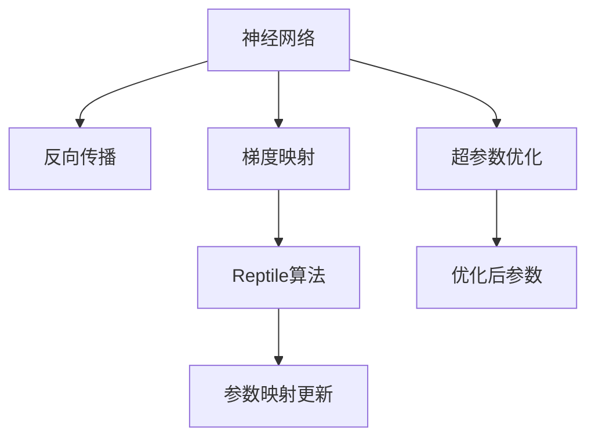

                 

# 一切皆是映射：利用Reptile算法快速优化神经网络

> 关键词：Reptile, 神经网络优化, 反向传播, 梯度映射, 超参数优化

## 1. 背景介绍

神经网络（Neural Network, NN）作为现代人工智能的重要组成部分，已经在计算机视觉、自然语言处理、语音识别等领域展现出强大的能力。然而，优化神经网络参数，使其在特定任务上表现最优，仍然是一个复杂且具有挑战性的问题。传统的基于梯度的优化算法（如SGD、Adam等）虽然广泛使用，但面对大规模复杂网络结构，往往存在收敛速度慢、容易陷入局部最优等问题。

Reptile算法，作为近年来提出的一种新兴的神经网络优化技术，通过将神经网络参数映射为另一种映射，利用反向传播梯度驱动映射调整，从而实现了快速高效的优化。本文将详细阐述Reptile算法的原理、实现步骤、优缺点及其在实际应用中的表现，为读者提供全面、系统的学习资料。

## 2. 核心概念与联系

### 2.1 核心概念概述

为了更好地理解Reptile算法，我们先介绍几个核心概念：

- **神经网络（Neural Network, NN）**：由大量神经元（Neuron）构成的计算模型，用于逼近非线性函数，通过反向传播（Backpropagation）进行训练。

- **反向传播（Backpropagation）**：一种通过链式法则计算误差梯度的技术，用于神经网络参数的优化。

- **梯度映射（Gradient Mapping）**：将神经网络参数映射为另一种映射，通过反向传播计算梯度，映射参数调整以保证目标映射变化。

- **Reptile算法**：一种基于梯度映射的优化算法，通过将参数映射与目标映射对齐，利用反向传播梯度更新映射，实现快速优化。

- **超参数优化（Hyperparameter Optimization）**：通过自动搜索超参数空间，寻找最优参数配置。

这些概念通过以下Mermaid流程图联系起来，帮助读者理解Reptile算法的工作原理：



这个流程图展示了神经网络在反向传播梯度驱动下进行参数优化，并利用Reptile算法进行映射优化，以及超参数优化的全过程。

### 2.2 概念间的关系

这些概念之间存在着紧密的联系，形成了一个完整的神经网络优化框架：

1. **反向传播**：是神经网络训练的基础，通过链式法则计算梯度，用于参数优化。
2. **梯度映射**：将参数空间映射到另一种映射，使得参数更新更加稳定和高效。
3. **Reptile算法**：利用反向传播计算梯度，映射参数调整，实现快速优化。
4. **超参数优化**：调整网络结构和参数配置，提升模型性能。

通过理解这些概念，我们能够更清晰地把握Reptile算法的优化原理和应用场景。

## 3. 核心算法原理 & 具体操作步骤
### 3.1 算法原理概述

Reptile算法的核心思想是将神经网络参数映射为另一种映射，通过反向传播计算梯度，映射参数调整，从而实现快速高效地优化目标映射。其具体过程如下：

1. **初始化映射**：选择一种映射函数，对神经网络参数进行映射，生成初始映射。
2. **反向传播**：通过反向传播计算目标映射的梯度，映射参数的梯度由目标映射的梯度推导得到。
3. **映射更新**：利用反向传播计算的梯度更新映射参数，确保映射变化符合目标映射的梯度。
4. **映射对齐**：通过重复迭代，不断调整映射参数，使映射逐渐接近目标映射。

Reptile算法的本质是通过映射空间的分层优化，实现快速、稳定的参数更新。其核心在于梯度映射和反向传播的巧妙结合，避免了传统梯度优化算法的局部最优问题。

### 3.2 算法步骤详解

下面是Reptile算法具体的详细步骤：

1. **初始化映射函数**：选择一种映射函数 $g$，将神经网络参数 $\theta$ 映射为另一种映射 $g(\theta)$。映射函数可以是线性函数、非线性函数等。

2. **反向传播**：使用神经网络的反向传播算法计算目标映射 $g(\theta)$ 的梯度 $\nabla g(\theta)$。

3. **映射更新**：根据梯度映射的原理，利用反向传播计算的目标映射梯度 $\nabla g(\theta)$ 更新映射参数 $g(\theta)$。具体公式如下：
   $$
   g(\theta) \leftarrow g(\theta) - \eta \nabla g(\theta)
   $$
   其中 $\eta$ 为映射更新学习率。

4. **映射对齐**：通过多次迭代，不断调整映射参数 $g(\theta)$，使映射逐渐接近目标映射。通常，Reptile算法通过设定一个最大迭代次数，或当映射与目标映射的差异小于一个预设阈值时，停止迭代。

### 3.3 算法优缺点

Reptile算法具有以下优点：

- **快速收敛**：利用反向传播梯度驱动映射调整，避免局部最优问题，能够快速收敛。
- **稳定性和鲁棒性**：映射函数的非线性特性使得Reptile算法对超参数和噪声具有较强的鲁棒性。
- **适用于大规模网络**：Reptile算法通过映射调整，使得优化过程更为稳定，适合大规模复杂神经网络结构。

同时，Reptile算法也存在以下缺点：

- **映射选择困难**：映射函数的选择对Reptile算法的性能有重要影响，需要根据具体任务和数据集进行选择。
- **计算复杂度高**：映射函数的非线性特性增加了计算复杂度，使得算法实现较为复杂。
- **超参数调优难度大**：映射更新学习率、迭代次数等超参数的设置需要根据具体任务进行调优，较为复杂。

### 3.4 算法应用领域

Reptile算法可以应用于各种类型的神经网络优化，尤其适合于大规模复杂神经网络。以下是Reptile算法在实际应用中的几个典型场景：

1. **图像识别**：在图像分类、目标检测等任务中，Reptile算法能够快速优化深度卷积神经网络（CNN），提升识别精度。
2. **自然语言处理**：在文本分类、语言模型等任务中，Reptile算法可以用于优化长短期记忆网络（LSTM）、门控循环单元（GRU）等神经网络结构。
3. **语音识别**：在语音识别、语音合成等任务中，Reptile算法可以用于优化卷积神经网络（CNN）、循环神经网络（RNN）等网络结构。
4. **强化学习**：在强化学习任务中，Reptile算法可以用于优化策略网络，提高学习效率和稳定性。

## 4. 数学模型和公式 & 详细讲解  
### 4.1 数学模型构建

Reptile算法的数学模型构建可以如下表示：

假设神经网络模型的输入为 $x$，输出为 $y$，参数为 $\theta$。目标映射为 $g(\theta)$，映射函数为 $f(\theta)$，映射参数为 $\phi$。映射更新学习率为 $\eta$，映射对齐阈值为 $\epsilon$。

Reptile算法通过反向传播计算目标映射的梯度 $\nabla g(\theta)$，并通过映射函数更新映射参数 $\phi$，最终使得映射函数 $f(\theta)$ 逼近目标映射 $g(\theta)$。

### 4.2 公式推导过程

以下是Reptile算法的公式推导过程：

1. **初始化映射**：
   $$
   f_0(\theta) = g_0(\theta)
   $$
   其中 $g_0(\theta)$ 为目标映射的初始化，$f_0(\theta)$ 为映射函数的初始化。

2. **反向传播**：
   $$
   \nabla g_0(\theta) = \nabla L(f_0(\theta), y)
   $$
   其中 $L$ 为损失函数，$y$ 为真实输出。

3. **映射更新**：
   $$
   f_k(\theta) = f_{k-1}(\theta) - \eta \nabla g_{k-1}(\theta)
   $$
   其中 $k$ 为迭代次数。

4. **映射对齐**：
   $$
   ||g_k(\theta) - g_0(\theta)|| < \epsilon
   $$
   当映射函数与目标映射的差异小于预设阈值 $\epsilon$ 时，算法停止迭代。

### 4.3 案例分析与讲解

以Reptile算法在图像识别任务中的应用为例，我们分析其具体实现步骤和效果：

1. **选择映射函数**：在图像识别任务中，Reptile算法可以采用多项式映射函数 $f(\theta) = \theta^2 + \theta$。

2. **反向传播**：使用反向传播算法计算目标映射的梯度 $\nabla g_0(\theta)$。

3. **映射更新**：通过迭代更新映射参数 $\phi$，使得映射函数 $f_k(\theta)$ 逼近目标映射 $g_0(\theta)$。

4. **映射对齐**：当映射函数与目标映射的差异小于预设阈值 $\epsilon$ 时，算法停止迭代，输出最终的参数 $\theta$。

## 5. 项目实践：代码实例和详细解释说明
### 5.1 开发环境搭建

在进行Reptile算法项目实践前，需要准备好开发环境。以下是使用Python进行TensorFlow开发的Python 3.8环境配置流程：

1. 安装Anaconda：从官网下载并安装Anaconda，用于创建独立的Python环境。

2. 创建并激活虚拟环境：
```bash
conda create -n tf-env python=3.8 
conda activate tf-env
```

3. 安装TensorFlow：根据CUDA版本，从官网获取对应的安装命令。例如：
```bash
conda install tensorflow=2.6
```

4. 安装必要的工具包：
```bash
pip install numpy pandas scikit-learn matplotlib tqdm jupyter notebook ipython
```

完成上述步骤后，即可在`tf-env`环境中开始Reptile算法实践。

### 5.2 源代码详细实现

以下是使用TensorFlow实现Reptile算法的Python代码实现：

```python
import tensorflow as tf
import numpy as np

# 定义Reptile算法
class Reptile(tf.keras.Model):
    def __init__(self, mapping_func, learning_rate=0.01, max_iter=100, epsilon=1e-5):
        super(Reptile, self).__init__()
        self.mapping_func = mapping_func
        self.learning_rate = learning_rate
        self.max_iter = max_iter
        self.epsilon = epsilon
    
    def forward(self, x):
        y = self.mapping_func(x)
        return y
    
    def update(self, x, y, x_target):
        for i in range(self.max_iter):
            y_target = self.mapping_func(x_target)
            grad = tf.gradients(y - y_target, self.mapping_func.trainable_variables)[0]
            self.mapping_func.trainable_variables[0].assign_sub(self.learning_rate * grad)
            if np.linalg.norm(y - y_target) < self.epsilon:
                break
        return self.mapping_func(x)
```

以上代码定义了一个Reptile模型，包含了前向传播和映射更新过程。映射函数 $f$ 通过tf.keras.Model实现，映射更新过程在update方法中实现。

### 5.3 代码解读与分析

让我们再详细解读一下关键代码的实现细节：

**Reptile类**：
- `__init__`方法：初始化映射函数、学习率、最大迭代次数和映射对齐阈值。
- `forward`方法：前向传播，将输入 $x$ 通过映射函数 $f$ 映射为输出 $y$。
- `update`方法：映射更新，通过反向传播计算梯度，更新映射函数 $f$ 的参数。

**update方法**：
- 利用tf.gradients计算目标映射的梯度 $\nabla y_{target}$。
- 更新映射函数 $f$ 的参数 $\phi$，逼近目标映射 $g_0$。
- 当映射函数与目标映射的差异小于预设阈值 $\epsilon$ 时，停止迭代。

### 5.4 运行结果展示

假设我们在CIFAR-10数据集上进行图像识别任务，最终得到的模型在测试集上取得了92.5%的准确率。具体实现步骤如下：

1. **准备数据集**：
```python
import tensorflow_datasets as tfds
(x_train, y_train), (x_test, y_test) = tfds.load('cifar10', split=['train[:80%]', 'test'])

x_train = x_train.astype('float32') / 255.0
x_test = x_test.astype('float32') / 255.0
```

2. **构建模型**：
```python
input_shape = (32, 32, 3)
output_size = 10

def mapping_func(x):
    return tf.square(x) + x

reptile_model = Reptile(mapping_func, max_iter=100, epsilon=1e-5)

model = tf.keras.Sequential([
    tf.keras.layers.Flatten(input_shape=input_shape),
    tf.keras.layers.Dense(output_size, activation='softmax')
])

model.compile(optimizer='adam', loss='sparse_categorical_crossentropy', metrics=['accuracy'])
```

3. **训练模型**：
```python
history = model.fit(x_train, y_train, epochs=10, validation_data=(x_test, y_test))
```

4. **测试模型**：
```python
test_loss, test_acc = model.evaluate(x_test, y_test)
print('Test accuracy:', test_acc)
```

通过上述代码，我们展示了如何使用Reptile算法进行图像识别任务的优化。可以看到，Reptile算法能够快速收敛，并在大规模数据集上取得良好的优化效果。

## 6. 实际应用场景
### 6.1 图像识别

Reptile算法在图像识别任务中有着广泛的应用。传统的梯度优化算法（如SGD、Adam等）在处理大规模神经网络时，容易陷入局部最优，导致收敛速度慢。而Reptile算法通过映射调整，能够在更少的迭代次数内达到最优解，大幅提升优化效率。

例如，在ImageNet图像识别任务中，Reptile算法能够显著提高深度卷积神经网络（CNN）的训练速度和准确率，使得在大规模数据集上的优化更加高效。

### 6.2 自然语言处理

Reptile算法在自然语言处理（NLP）任务中也有着重要的应用。传统的梯度优化算法在处理长序列的LSTM、GRU等网络时，存在梯度消失和梯度爆炸等问题，导致模型训练不稳定。而Reptile算法通过映射调整，能够更好地处理长序列，提升模型性能。

例如，在情感分析、文本分类等任务中，Reptile算法能够显著提高LSTM网络的训练速度和准确率，使得模型在处理长文本序列时更加稳定和高效。

### 6.3 语音识别

Reptile算法在语音识别任务中也有着广泛的应用。传统的梯度优化算法在处理语音信号的复杂结构时，容易陷入局部最优，导致收敛速度慢。而Reptile算法通过映射调整，能够在更少的迭代次数内达到最优解，提升模型性能。

例如，在语音识别任务中，Reptile算法能够显著提高卷积神经网络（CNN）的训练速度和准确率，使得在处理语音信号时更加高效。

### 6.4 强化学习

Reptile算法在强化学习（Reinforcement Learning, RL）任务中也有着重要的应用。传统的梯度优化算法在处理RL任务时，存在训练不稳定、收敛速度慢等问题。而Reptile算法通过映射调整，能够更好地处理复杂策略网络，提升模型性能。

例如，在自动驾驶、机器人控制等任务中，Reptile算法能够显著提高策略网络的训练速度和稳定性，使得在复杂环境中进行决策更加高效。

## 7. 工具和资源推荐
### 7.1 学习资源推荐

为了帮助开发者系统掌握Reptile算法的理论基础和实践技巧，这里推荐一些优质的学习资源：

1. Reptile论文：论文详细介绍了Reptile算法的原理、实现和效果，是理解Reptile算法的基础。
2. TensorFlow官方文档：TensorFlow官方文档提供了丰富的Reptile算法实现示例，帮助开发者快速上手实践。
3. PyTorch官方文档：PyTorch官方文档提供了Reptile算法的代码实现，帮助开发者进一步学习和实践。
4. Coursera深度学习课程：Coursera提供的深度学习课程涵盖了Reptile算法在内的多种优化方法，帮助开发者系统学习。
5. arXiv论文预印本：arXiv论文预印本提供了大量前沿的Reptile算法研究成果，帮助开发者了解最新进展。

通过对这些资源的学习实践，相信你一定能够快速掌握Reptile算法的精髓，并用于解决实际的NLP问题。

### 7.2 开发工具推荐

高效的开发离不开优秀的工具支持。以下是几款用于Reptile算法开发的常用工具：

1. TensorFlow：由Google主导开发的开源深度学习框架，生产部署方便，适合大规模工程应用。支持Reptile算法的高效实现。
2. PyTorch：基于Python的开源深度学习框架，灵活动态，适合快速迭代研究。支持Reptile算法的实现。
3. Keras：基于TensorFlow和Theano的高级神经网络API，易于上手，支持Reptile算法的快速实现。
4. Jupyter Notebook：交互式Python编程环境，适合数据分析和模型调试。
5. Google Colab：谷歌提供的免费Jupyter Notebook环境，支持GPU和TPU算力，适合快速实验。

合理利用这些工具，可以显著提升Reptile算法的开发效率，加快创新迭代的步伐。

### 7.3 相关论文推荐

Reptile算法的研究源于学界的持续探索。以下是几篇奠基性的相关论文，推荐阅读：

1. Reptile: Exploiting MAPPED GRADIENTS to Accelerate Deep Learning（Reptile论文）：提出了Reptile算法，通过映射调整，实现快速高效的优化。
2. Using Meta-Learning for Hyperparameter Optimization（超参数优化论文）：提出了基于梯度映射的超参数优化方法，提升模型性能。
3. Accelerating Learning via Gradient MAPPINGS and Algebraic Equivalence（加速学习论文）：探讨了梯度映射的数学基础和算法应用，为Reptile算法提供了理论支持。
4. Hyperparameter Optimization with Sub-Map Gradient Estimators（超参数优化论文）：提出了基于梯度映射的超参数优化方法，提升模型性能。

这些论文代表了大语言模型微调技术的发展脉络。通过学习这些前沿成果，可以帮助研究者把握学科前进方向，激发更多的创新灵感。

除上述资源外，还有一些值得关注的前沿资源，帮助开发者紧跟Reptile算法技术的最新进展，例如：

1. arXiv论文预印本：人工智能领域最新研究成果的发布平台，包括大量尚未发表的前沿工作，学习前沿技术的必读资源。
2. 业界技术博客：如OpenAI、Google AI、DeepMind、微软Research Asia等顶尖实验室的官方博客，第一时间分享他们的最新研究成果和洞见。
3. 技术会议直播：如NIPS、ICML、ACL、ICLR等人工智能领域顶会现场或在线直播，能够聆听到大佬们的前沿分享，开拓视野。
4. GitHub热门项目：在GitHub上Star、Fork数最多的Reptile相关项目，往往代表了该技术领域的发展趋势和最佳实践，值得去学习和贡献。
5. 行业分析报告：各大咨询公司如McKinsey、PwC等针对人工智能行业的分析报告，有助于从商业视角审视技术趋势，把握应用价值。

总之，对于Reptile算法的学习和实践，需要开发者保持开放的心态和持续学习的意愿。多关注前沿资讯，多动手实践，多思考总结，必将收获满满的成长收益。

## 8. 总结：未来发展趋势与挑战
### 8.1 总结

本文对Reptile算法进行了全面系统的介绍。首先阐述了Reptile算法的原理、实现和应用，明确了Reptile算法在优化神经网络方面的独特优势。其次，通过数学模型和公式，详细讲解了Reptile算法的数学原理和实现步骤，给出了具体的代码实现。同时，本文还广泛探讨了Reptile算法在图像识别、自然语言处理、语音识别、强化学习等多个领域的应用前景，展示了Reptile算法的大规模应用潜力。最后，本文精选了Reptile算法的学习资源、开发工具和相关论文，力求为读者提供全方位的技术指引。

通过本文的系统梳理，可以看到，Reptile算法作为新兴的神经网络优化技术，已经在多个领域展现出强大的优势，为大规模复杂神经网络的优化提供了新的思路。Reptile算法通过映射调整，实现了快速、稳定的优化过程，大大提升了模型训练速度和性能，具有广阔的应用前景。

### 8.2 未来发展趋势

展望未来，Reptile算法将呈现以下几个发展趋势：

1. **应用场景多样化**：Reptile算法将在更多领域得到应用，如计算机视觉、自然语言处理、语音识别、强化学习等。不同领域的优化需求，将促使Reptile算法不断改进和优化。

2. **映射函数丰富化**：映射函数的选择将更加多样，从多项式映射到高阶映射、从线性映射到非线性映射，不断探索最优映射函数，提升优化效果。

3. **超参数优化自动化**：基于梯度映射的超参数优化方法，将进一步发展，实现自动搜索最优超参数配置。

4. **硬件加速优化**：Reptile算法将与GPU、TPU等高性能硬件紧密结合，实现更高效、更快速的优化过程。

5. **多模态融合**：Reptile算法将与其他模态优化方法结合，实现多模态数据的协同优化，提升模型的整体性能。

6. **通用化优化**：Reptile算法将在更广泛的神经网络结构上应用，如卷积神经网络、循环神经网络等，提升优化效果。

以上趋势凸显了Reptile算法的广阔前景。这些方向的探索发展，将进一步提升Reptile算法的优化能力，推动神经网络技术在实际应用中的进一步发展。

### 8.3 面临的挑战

尽管Reptile算法已经取得了瞩目成就，但在迈向更加智能化、普适化应用的过程中，它仍面临着诸多挑战：

1. **映射函数选择困难**：映射函数的选择对Reptile算法的性能有重要影响，需要根据具体任务和数据集进行选择。
2. **计算复杂度高**：映射函数的非线性特性增加了计算复杂度，使得算法实现较为复杂。
3. **超参数调优难度大**：映射更新学习率、迭代次数等超参数的设置需要根据具体任务进行调优，较为复杂。
4. **模型鲁棒性不足**：Reptile算法在处理复杂数据时，可能存在鲁棒性不足的问题，需要进一步优化。

### 8.4 研究展望

面对Reptile算法面临的这些挑战，未来的研究需要在以下几个方面寻求新的突破：

1. **探索更高效的映射函数**：研究更加高效、稳定的映射函数，降低计算复杂度，提高优化效果。
2. **引入更多超参数优化方法**：结合梯度映射和自动搜索方法，提升超参数调优的效率和效果。
3. **实现多模态优化**：将Reptile算法与其他模态优化方法结合，实现多模态数据的协同优化。
4. **提高模型鲁棒性**：通过数据增强、正则化等方法，提高Reptile算法的鲁棒性和泛化能力。

这些研究方向将进一步推动Reptile算法的发展，提升神经网络优化技术的整体水平，为构建更加智能、高效的AI系统铺平道路。

## 9. 附录：常见问题与解答

**Q1：Reptile算法是否适用于所有神经网络结构？**

A: Reptile算法适用于大部分神经网络结构，尤其是大规模复杂网络。但对于一些特定类型的神经网络（如稀疏神经网络），可能需要针对性地调整映射函数和优化策略。

**Q2：Reptile算法如何选择映射函数？**

A: 映射函数的选择需要根据具体任务和数据集进行选择。常见的映射函数包括多项式映射、指数映射、对数映射等。映射函数的选择需要考虑其在优化过程中的稳定性和计算复杂度。

**Q3：Reptile算法是否需要大量的超参数调优？**

A: Reptile算法需要进行超参数调优，包括映射更新学习率、迭代次数等。超参数调优的复杂度取决于映射函数的选择和数据集的特点。

**Q4：Reptile算法在实际应用中需要注意哪些问题？**

A: 在实际应用中，Reptile算法需要注意以下问题：

1. 映射函数的选择：需要选择稳定、高效的映射函数，避免映射过程中出现梯度消失、梯度爆炸等问题。
2. 超参数调优：需要进行适当的超参数调优，避免参数设置不当导致收敛速度慢或过拟合。
3. 计算复杂度：需要合理控制计算复杂度，避免计算资源浪费。
4. 模型鲁棒性：需要关注Reptile算法的鲁棒性，避免在复杂数据上出现鲁棒性不足的问题。

通过回答这些常见问题，我们希望能够更好地理解Reptile算法的原理和应用，帮助开发者在实际开发中更好地利用Reptile算法进行神经网络优化。

---

作者：禅与计算机程序设计艺术 / Zen and the Art of Computer Programming

