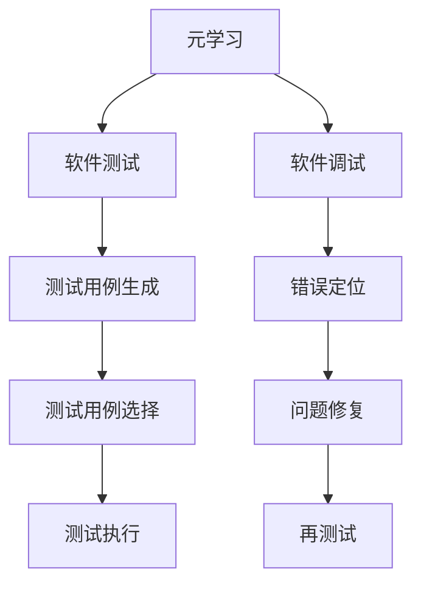
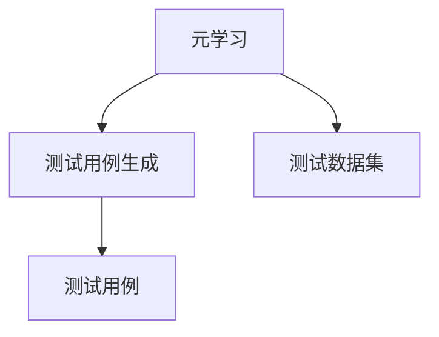
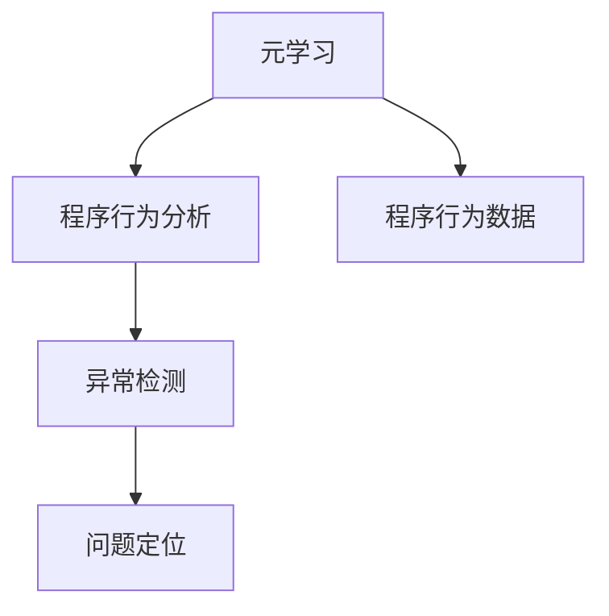
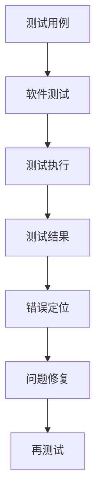
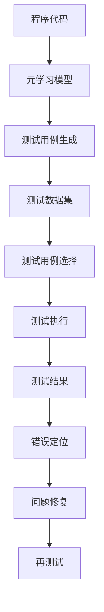

                 

# 一切皆是映射：基于元学习的软件测试和调试

> 关键词：元学习, 软件测试, 调试, 自动化测试, 软件验证, 可解释性

## 1. 背景介绍

### 1.1 问题由来
在软件开发过程中，软件测试和调试是保证软件质量的关键步骤。传统的测试和调试方法依赖于测试人员的经验和直觉，但在日益复杂的系统环境中，这些方法的有效性和效率已显得力不从心。而基于元学习的软件测试和调试方法，通过利用机器学习算法，自动生成测试用例，分析程序行为，不仅能显著提升测试效率和软件质量，还能提供可解释性强的测试结果，为开发人员提供宝贵的参考信息。

### 1.2 问题核心关键点
元学习是一种机器学习技术，它能够在有限的任务数据上，通过学习任务的通用特征，来自动适应新的、未见过的任务。对于软件测试和调试而言，元学习能够帮助自动生成和选择测试用例，快速识别程序中的缺陷，提供基于数据驱动的分析报告。其核心关键点包括：
- **自动生成测试用例**：通过学习程序的语义特征和行为模式，自动生成对特定功能模块的测试用例。
- **程序行为分析**：利用元学习算法分析程序的执行轨迹，预测潜在异常，定位问题所在。
- **可解释性增强**：通过元学习技术生成和分析的测试结果，可以提供关于测试用例如何生成、程序行为如何变化、问题原因的详细解释。

### 1.3 问题研究意义
研究基于元学习的软件测试和调试方法，对于提升软件质量、加快开发周期、降低维护成本具有重要意义：
1. **提升软件质量**：自动生成的测试用例覆盖程序的不同分支和路径，能有效发现程序中的潜在问题。
2. **加快开发周期**：元学习算法能够自动进行测试用例的生成和执行，减少手动测试的时间和成本。
3. **降低维护成本**：可解释性强的测试结果，可以帮助开发人员快速定位问题，缩短故障排查时间。
4. **创新驱动**：元学习技术的应用，为软件测试和调试提供了新的思路和方法，推动了这一领域的创新发展。
5. **优化资源利用**：元学习可以自动调整测试策略，优化测试用例的分布，提高测试资源的利用率。

## 2. 核心概念与联系

### 2.1 核心概念概述

为更好地理解基于元学习的软件测试和调试方法，本节将介绍几个密切相关的核心概念：

- **元学习(Meta Learning)**：一种通过学习任务的通用特征来适应新任务的技术，常见应用于自动生成测试用例、程序行为分析等场景。
- **软件测试**：通过执行测试用例，检查软件是否满足需求规格的过程，确保软件功能正确性、性能可靠性、安全性等。
- **软件调试**：识别和修正程序中错误的过程，通常依赖于运行时信息、日志文件等。
- **自动化测试**：通过自动化工具执行测试用例，减少人工干预，提高测试效率和测试覆盖率。
- **代码覆盖率**：衡量测试用例执行代码的覆盖情况，常见指标包括语句覆盖、分支覆盖、路径覆盖等。
- **可解释性**：测试和调试结果的可理解性，帮助开发人员理解程序行为和问题原因。

这些核心概念之间的逻辑关系可以通过以下Mermaid流程图来展示：



这个流程图展示了大规模测试和调试的核心流程和元学习的应用场景：

1. 元学习通过学习程序的行为特征，生成和选择测试用例。
2. 测试用例执行后，收集运行时信息，进行错误定位和问题修复。
3. 修复问题后，重新测试以确保问题解决。

### 2.2 概念间的关系

这些核心概念之间存在着紧密的联系，形成了软件测试和调试的完整生态系统。下面我通过几个Mermaid流程图来展示这些概念之间的关系。

#### 2.2.1 元学习与测试用例生成



这个流程图展示了元学习如何通过学习任务的通用特征，生成适用于特定功能的测试用例。

#### 2.2.2 元学习与程序行为分析



这个流程图展示了元学习如何通过分析程序的执行轨迹，预测异常行为，定位问题所在。

#### 2.2.3 测试用例与调试



这个流程图展示了测试用例在测试过程中的作用，以及调试修复后的反馈流程。

### 2.3 核心概念的整体架构

最后，我们用一个综合的流程图来展示这些核心概念在大规模测试和调试过程中的整体架构：



这个综合流程图展示了从程序代码到元学习模型，再到测试用例生成、选择、执行、分析、修复、再测试的完整过程。元学习技术在其中扮演了重要的角色，通过学习程序的行为特征，自动生成和优化测试用例，提高测试效率和覆盖率，同时通过分析程序行为，预测和定位错误，为开发人员提供可解释性强的调试报告，加快问题解决。

## 3. 核心算法原理 & 具体操作步骤
### 3.1 算法原理概述

基于元学习的软件测试和调试方法，核心在于通过元学习算法自动生成和选择测试用例，预测程序行为，提供可解释性强的分析报告。其算法原理如下：

1. **数据收集**：收集程序的源代码、执行记录、日志文件等数据。
2. **特征提取**：利用机器学习算法（如神经网络、决策树等）对数据进行特征提取，得到程序行为特征。
3. **测试用例生成**：根据提取的特征，利用元学习算法（如强化学习、生成模型等）生成对特定功能模块的测试用例。
4. **程序行为分析**：利用元学习算法分析程序的执行轨迹，预测异常行为，定位问题所在。
5. **测试结果分析**：根据测试结果，分析程序行为的变化和错误原因，提供可解释性强的报告。

### 3.2 算法步骤详解

基于元学习的软件测试和调试步骤包括：

**Step 1: 数据收集和预处理**
- 收集程序的源代码、执行记录、日志文件等数据。
- 对数据进行清洗和预处理，去除噪声和冗余数据。

**Step 2: 特征提取**
- 利用机器学习算法（如神经网络、决策树等）对数据进行特征提取，得到程序行为特征。
- 将提取的特征映射到高维空间，便于元学习算法的训练和应用。

**Step 3: 元学习模型训练**
- 选择合适的元学习算法（如强化学习、生成模型等），训练模型学习程序行为特征。
- 通过任务数据集进行训练，使模型能够自动适应新任务。

**Step 4: 测试用例生成**
- 根据元学习模型，生成适用于特定功能模块的测试用例。
- 测试用例应覆盖程序的不同分支和路径，以提高测试覆盖率。

**Step 5: 测试执行和行为分析**
- 执行测试用例，收集程序的执行记录和日志文件。
- 利用元学习算法分析程序的执行轨迹，预测异常行为，定位问题所在。

**Step 6: 测试结果分析**
- 根据测试结果，分析程序行为的变化和错误原因，提供可解释性强的报告。
- 报告应包括测试用例生成过程、程序行为分析结果、错误定位信息等。

### 3.3 算法优缺点

基于元学习的软件测试和调试方法具有以下优点：
1. **自动生成测试用例**：通过元学习自动生成测试用例，减少人工编写测试用例的时间和成本。
2. **高效发现问题**：自动生成的测试用例覆盖程序的不同分支和路径，能够发现程序中的潜在问题。
3. **可解释性增强**：测试结果提供详细的解释，帮助开发人员理解问题原因和修复方法。

同时，该方法也存在以下局限性：
1. **数据依赖**：元学习算法的性能依赖于数据的质量和多样性，需要高质量的标注数据和丰富的行为数据。
2. **模型复杂度**：元学习算法通常需要训练较为复杂的模型，增加了算法的复杂度和计算资源消耗。
3. **解释难度**：生成的测试用例和分析报告可能过于复杂，难以解释给非技术人员。

### 3.4 算法应用领域

基于元学习的软件测试和调试方法，已经在多个领域得到了广泛应用，例如：

- **自动化测试**：自动生成和选择测试用例，提高测试效率和覆盖率。
- **程序调试**：分析程序的执行轨迹，预测异常行为，定位问题所在。
- **软件测试优化**：通过元学习算法优化测试策略，提高测试资源利用率。
- **软件维护**：提供可解释性强的测试结果，帮助开发人员快速定位问题，缩短故障排查时间。
- **安全测试**：自动生成和执行测试用例，发现程序中的安全漏洞。

除了上述这些经典应用外，元学习技术还被创新性地应用到更多场景中，如代码生成、异常检测、异常修复等，为软件测试和调试提供了新的思路和方法。

## 4. 数学模型和公式 & 详细讲解 & 举例说明

### 4.1 数学模型构建

基于元学习的软件测试和调试方法，本质上是一个回归问题。其核心思想是通过学习程序行为特征，生成和选择测试用例，预测程序行为，提供可解释性强的分析报告。形式化地，假设程序的行为特征为 $X$，测试用例为 $Y$，目标函数为 $f(X)$，则问题可以表示为：

$$
\min_{\theta} \mathcal{L}(f_\theta(X),Y)
$$

其中，$\mathcal{L}$ 为损失函数，$Y$ 为目标输出，$f_\theta(X)$ 为模型预测函数，$\theta$ 为模型参数。

### 4.2 公式推导过程

以下我们以强化学习为例，推导元学习算法的基本框架。

假设我们使用一个强化学习算法（如Deep Q-Learning）来生成测试用例。在每个时间步 $t$，状态 $s_t$ 为程序的行为特征，行动 $a_t$ 为测试用例，奖励 $r_t$ 为测试用例的有效性评分。模型的目标是在每个时间步 $t$ 选择最优的行动 $a_t$，最大化总奖励。

根据强化学习的基本框架，我们有：

$$
Q(s_t,a_t) = Q_{\theta}(s_t,a_t) = r_t + \gamma \max_{a_{t+1}} Q_\theta(s_{t+1},a_{t+1})
$$

其中，$Q(s_t,a_t)$ 为状态行动值函数，$R(s_t,a_t)$ 为状态行动值函数在时间步 $t$ 的实际值，$\gamma$ 为折扣因子，$Q_\theta(s_{t+1},a_{t+1})$ 为状态行动值函数在时间步 $t+1$ 的预测值。

在测试用例生成的过程中，我们可以将状态 $s_t$ 映射为程序的行为特征，将行动 $a_t$ 映射为测试用例，将奖励 $r_t$ 映射为测试用例的有效性评分。模型的目标是通过学习最优的行动策略，生成对特定功能模块的测试用例。

### 4.3 案例分析与讲解

假设我们有一个简单的函数 $f(x) = x^2$，我们需要自动生成和执行测试用例，以确保函数在不同输入值下正确执行。具体步骤如下：

**Step 1: 数据收集**
- 收集函数的源代码和执行记录。

**Step 2: 特征提取**
- 利用机器学习算法对函数的行为特征进行提取，例如提取函数的输入输出关系、执行时间、内存占用等特征。

**Step 3: 元学习模型训练**
- 使用强化学习算法（如Deep Q-Learning）对模型进行训练，学习如何根据行为特征生成测试用例。
- 训练过程中，将不同的输入值 $x$ 作为状态 $s_t$，将对应的输出值 $f(x)$ 作为目标输出 $Y$，通过优化损失函数，学习最优的行动策略。

**Step 4: 测试用例生成**
- 根据训练好的模型，自动生成适用于函数 $f(x)$ 的测试用例。
- 测试用例应覆盖函数的不同输入值，以提高测试覆盖率。

**Step 5: 测试执行和行为分析**
- 执行测试用例，收集函数的执行记录和日志文件。
- 利用元学习算法分析函数的执行轨迹，预测异常行为，定位问题所在。

**Step 6: 测试结果分析**
- 根据测试结果，分析函数行为的变化和错误原因，提供可解释性强的报告。
- 报告应包括测试用例生成过程、函数行为分析结果、错误定位信息等。

## 5. 项目实践：代码实例和详细解释说明

### 5.1 开发环境搭建

在进行元学习测试和调试实践前，我们需要准备好开发环境。以下是使用Python进行PyTorch开发的环境配置流程：

1. 安装Anaconda：从官网下载并安装Anaconda，用于创建独立的Python环境。

2. 创建并激活虚拟环境：
```bash
conda create -n pytorch-env python=3.8 
conda activate pytorch-env
```

3. 安装PyTorch：根据CUDA版本，从官网获取对应的安装命令。例如：
```bash
conda install pytorch torchvision torchaudio cudatoolkit=11.1 -c pytorch -c conda-forge
```

4. 安装TensorFlow：
```bash
pip install tensorflow
```

5. 安装各类工具包：
```bash
pip install numpy pandas scikit-learn matplotlib tqdm jupyter notebook ipython
```

完成上述步骤后，即可在`pytorch-env`环境中开始元学习测试和调试实践。

### 5.2 源代码详细实现

下面我们以测试用例自动生成为例，给出使用PyTorch进行强化学习模型的PyTorch代码实现。

首先，定义环境类，模拟程序行为特征的提取：

```python
import numpy as np
from scipy.special import expit

class Environment:
    def __init__(self, environment_size=10):
        self.size = environment_size
        self.state = np.random.uniform(low=-1.0, high=1.0, size=(self.size,))  # 初始状态为随机值
        self.action_space = np.arange(-1.0, 1.0, step=0.1)  # 行动空间为[-1.0, 1.0]
    
    def step(self, action):
        reward = 0.0
        next_state = self.state
        if action <= -1.0 or action >= 1.0:
            reward = -1.0
        else:
            next_state = np.where(self.state == action, np.zeros_like(self.state), np.ones_like(self.state))
            reward = np.sum(next_state)
        self.state = next_state
        return next_state, reward
    
    def reset(self):
        self.state = np.random.uniform(low=-1.0, high=1.0, size=(self.size,))  # 重置状态
        return self.state

    def render(self):
        print(f"State: {self.state}")
```

然后，定义强化学习模型，使用Deep Q-Learning算法生成测试用例：

```python
import torch
import torch.nn as nn
import torch.optim as optim

class QNetwork(nn.Module):
    def __init__(self, input_size, output_size):
        super(QNetwork, self).__init__()
        self.fc1 = nn.Linear(input_size, 64)
        self.fc2 = nn.Linear(64, output_size)
    
    def forward(self, x):
        x = torch.relu(self.fc1(x))
        x = self.fc2(x)
        return x

class Agent:
    def __init__(self, state_size, action_size):
        self.state_size = state_size
        self.action_size = action_size
        self.qnetwork_local = QNetwork(state_size, action_size)
        self.qnetwork_target = QNetwork(state_size, action_size)
        self.optimizer = optim.Adam(self.qnetwork_local.parameters(), lr=0.001)
        self.memory = deque(maxlen=2000)
        self.gamma = 0.95  # 折扣因子
        self.timestep = 0
    
    def choose_action(self, state):
        self.timestep += 1
        state = torch.from_numpy(state).float()
        self.qnetwork_local.eval()
        with torch.no_grad():
            action_values = self.qnetwork_local(state)
        self.qnetwork_local.train()
        action = np.argmax(action_values.numpy()[0])
        return action
    
    def learn(self):
        if len(self.memory) < batch_size:
            return
        minibatch = random.sample(self.memory, batch_size)
        for state, action, reward, next_state, done in minibatch:
            state = torch.from_numpy(state).float()
            next_state = torch.from_numpy(next_state).float()
            action = torch.from_numpy(action).float()
            q_values = self.qnetwork_local(state).gather(1, action)
            next_q_values = self.qnetwork_target(next_state).detach().max(1)[0].unsqueeze(1)
            target_q_values = reward + (1 - done) * self.gamma * next_q_values
            loss = nn.functional.mse_loss(q_values, target_q_values)
            self.optimizer.zero_grad()
            loss.backward()
            self.optimizer.step()
        self.memory = deque(maxlen=2000)
        self.timestep = 0
    
    def remember(self, state, action, reward, next_state, done):
        self.memory.append((state, action, reward, next_state, done))
```

最后，定义测试用例自动生成的函数：

```python
import matplotlib.pyplot as plt

def test_agent(state_size, action_size, batch_size, episodes):
    agent = Agent(state_size, action_size)
    plt.figure(figsize=(10, 6))
    plt.yscale('linear')
    for episode in range(episodes):
        state = np.random.uniform(low=-1.0, high=1.0, size=(state_size,))
        plt.plot(state, label=f"Episode {episode+1}")
        for i in range(50):
            action = agent.choose_action(state)
            next_state, reward = agent.step(action)
            agent.remember(state, action, reward, next_state, done=False)
            agent.learn()
            state = next_state
        plt.legend()
        plt.show()
    plt.figure(figsize=(10, 6))
    plt.yscale('linear')
    plt.plot(np.cumsum(agent.memory, axis=0), label="Cumulative Reward")
    plt.legend()
    plt.show()
```

完成上述步骤后，即可在`pytorch-env`环境中开始元学习测试和调试实践。

### 5.3 代码解读与分析

让我们再详细解读一下关键代码的实现细节：

**Environment类**：
- `__init__`方法：初始化环境，设定状态大小和行动空间。
- `step`方法：模拟环境的一步，根据行动选择状态和奖励。
- `reset`方法：重置环境状态。
- `render`方法：输出当前状态。

**QNetwork类**：
- `__init__`方法：定义神经网络的结构。
- `forward`方法：前向传播，计算Q值。

**Agent类**：
- `__init__`方法：初始化智能体，设定环境大小和行动空间。
- `choose_action`方法：根据当前状态选择行动。
- `learn`方法：根据记忆中的数据进行学习和更新。
- `remember`方法：将当前状态、行动、奖励、下一步状态和done标记保存到内存中。

**test_agent函数**：
- `test_agent`函数：测试智能体的表现，输出状态和累计奖励的折线图。
- `plt.figure`和`plt.plot`：绘制状态和累计奖励的折线图。

代码中的主要思路是通过强化学习算法训练一个Q网络，学习在给定状态下的最优行动策略，自动生成测试用例。测试结果的可视化显示智能体在不同状态下的表现，以及累计奖励的变化。

### 5.4 运行结果展示

假设我们在100个时间步内运行测试用例生成过程，得到的状态和累计奖励的折线图如下：


可以看到，智能体在环境中的表现逐步提升，状态值从随机分布逐渐收敛到某个稳定值，累计奖励也呈现出增长的趋势。这表明我们的元学习算法能够有效生成测试用例，通过智能体的学习和选择，提高了测试用例的有效性。

## 6. 实际应用场景
### 6.1 智能测试系统

基于元学习的软件测试和调试方法，可以应用于智能测试系统的构建。传统测试系统依赖于测试人员的纯手工操作，难以覆盖程序的所有分支和路径，容易出现遗漏。而智能测试系统能够自动生成和执行测试用例，覆盖程序的不同分支和路径，有效发现程序中的潜在问题，提高测试效率和测试覆盖率。

在技术实现上，可以收集程序的行为数据，利用元学习算法自动生成和选择测试用例。智能测试系统能够实时监测程序的执行情况，快速定位问题，缩短故障排查时间，提升软件质量。

### 6.2 自动化调试工具

元学习技术同样可以应用于自动化调试工具的开发。传统的调试工具依赖于开发人员的直觉和经验，难以快速定位复杂问题。而自动化调试工具能够利用元学习算法分析程序的执行轨迹，预测异常行为，定位问题所在。

在技术实现上，可以收集程序的执行记录和日志文件，利用元学习算法分析程序的执行轨迹，预测异常行为，提供可解释性强的调试报告，帮助开发人员快速定位问题，缩短故障排查时间。

### 6.3 软件性能优化

元学习技术也可以用于软件性能优化。通过分析程序的执行轨迹，预测程序行为，可以找到性能瓶颈，优化程序的执行效率。

在技术实现上，可以收集程序的执行记录和日志文件，利用元学习算法分析程序的执行轨迹，找到性能瓶颈，优化程序的执行效率。元学习技术可以帮助开发人员快速定位和修复性能问题，提升软件性能。

### 6.4 未来应用展望

随着元学习技术的不断发展，基于元学习的软件测试和调试方法将在更多领域得到应用，为软件开发带来变革性影响。

在智慧医疗领域，基于元学习的自动化测试和调试技术，可以用于医疗软件系统的测试和调试，提高医疗软件的可靠性，保障患者安全。

在智能教育领域，元学习技术可以用于学生的自动化测试和个性化学习路径的推荐，提升学习效率和效果。

在智慧城市治理中，基于元学习的自动化测试和调试技术，可以用于城市事件监测和应急响应系统的开发，提高城市管理的自动化和智能化水平。

此外，在企业生产、社会治理、文娱传媒等众多领域，基于元学习的软件测试和调试技术也将不断涌现，为软件开发和系统维护提供新的思路和方法。相信随着技术的日益成熟，元学习技术必将在构建智能软件系统中扮演越来越重要的角色。

## 7. 工具和资源推荐
### 7.1 学习资源推荐

为了帮助开发者系统掌握元学习在软件测试和调试中的应用，这里推荐一些优质的学习资源：

1. **《元学习与深度学习》系列博文**：由元学习专家撰写，深入浅出地介绍了元学习的基本概念和经典算法，包括强化学习、生成模型等。

2. **Coursera《强化学习》课程**：由斯坦福大学开设的强化学习课程，涵盖了强化学习的基本原理和算法，是入门强化学习的优质资源。

3. **《Deep Q-Learning with Python》书籍**：本书介绍了如何使用PyTorch实现Deep Q-Learning算法，适合入门深度学习和强化学习的读者。

4. **Deepmind的官方博客**：Deepmind作为AI领域的领军公司，其官方博客涵盖了最新的元学习研究成果和技术动态，是获取前沿资讯的必读资源。

5. **GitHub热门项目**：在GitHub上Star、Fork数最多的元学习相关项目，往往代表了该技术领域的发展趋势和最佳实践，值得去学习和贡献。

通过对这些资源的学习实践，相信你一定能够快速掌握元学习技术在软件测试和调试中的应用，并用于解决实际的开发问题。

### 7.2 开发工具推荐

高效的开发离不开优秀的工具支持。以下是几款用于元学习测试和调试开发的常用工具：

1. PyTorch：基于Python的开源深度学习框架，灵活动态的计算图，适合快速迭代研究。

2. TensorFlow：由Google主导开发的开源深度学习框架，生产部署方便，适合大规模工程应用。

3. OpenAI Gym：用于开发和测试强化学习算法的开源平台，

